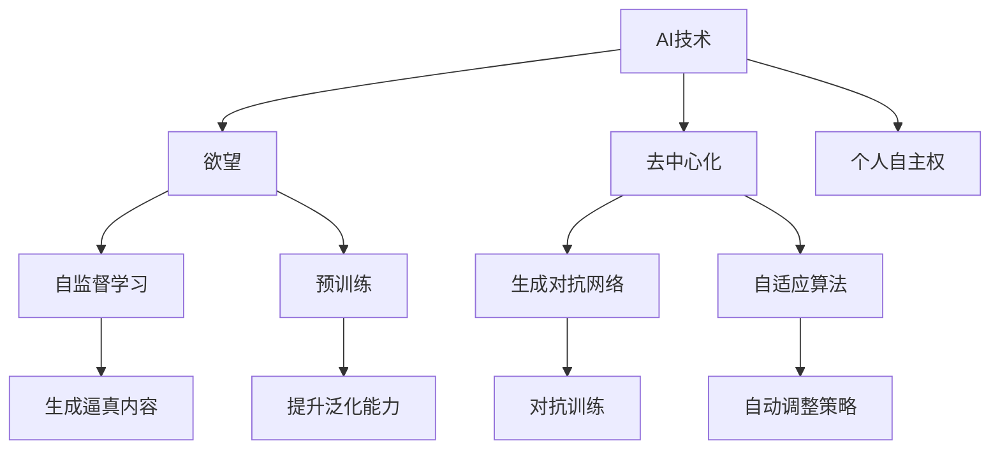

                 

# 欲望的去中心化：AI与个人自主权

> 关键词：欲望, 去中心化, AI, 个人自主权, 自监督学习, 预训练, 生成对抗网络, 自适应算法

## 1. 背景介绍

### 1.1 问题由来
随着人工智能（AI）技术的飞速发展，特别是深度学习在多个领域的应用，人类对于AI的依赖逐渐加深。然而，这种依赖背后隐藏着深刻的伦理问题。AI在提供便利的同时，是否也在控制着我们的欲望？AI技术如何平衡效率与伦理？这些问题在学术界和工业界引起了广泛的讨论。

### 1.2 问题核心关键点
本研究聚焦于AI技术对个人欲望的影响，以及如何在AI与个人自主权之间寻找平衡点。通过深入探讨AI如何学习并响应人类的欲望，以及如何设计AI系统来保护个人自主权，我们将揭示欲望去中心化的可能途径。

### 1.3 问题研究意义
研究AI与个人欲望之间的关系，对于理解AI技术的潜在风险和伦理挑战，以及如何在AI应用中保护个人自主权具有重要意义：

- 揭示AI对人类欲望的影响，帮助人们更好地认识和控制欲望。
- 提供设计具有伦理责任感的AI系统的指导，确保AI技术的发展不会损害个人自主权。
- 推动AI技术的公正、透明、可解释性的研究，为未来的AI应用提供伦理框架。

## 2. 核心概念与联系

### 2.1 核心概念概述

为了更好地理解AI与个人欲望之间的关系，本节将介绍几个密切相关的核心概念：

- **AI技术**：指通过算法和计算模型，使机器具备模拟、扩展人类智能能力的技术。包括机器学习、深度学习、自然语言处理、计算机视觉等领域。

- **欲望**：指人类内在的动机和需求，如追求幸福、避免痛苦、追求自我实现等。欲望可以是内在的，也可以是外界的刺激触发。

- **去中心化**：指将权力、信息、决策等从中心节点分散到各个节点，减少集中控制的风险。

- **个人自主权**：指个体自主决策、自主选择和自我控制的能力，不被外界强制或干预。

- **自监督学习**：指使用大量未标注数据进行模型训练，通过模型自身发现数据中的规律和结构，提升模型泛化能力。

- **预训练**：指在大型数据集上进行的初始训练，形成通用表示，为下游任务提供基础能力。

- **生成对抗网络（GAN）**：一种通过两个神经网络进行对抗训练，生成逼真图像、文本等内容的模型。

- **自适应算法**：指能够根据环境变化自动调整策略的算法，如梯度下降、遗传算法等。

这些核心概念之间的逻辑关系可以通过以下Mermaid流程图来展示：



这个流程图展示了大语言模型的核心概念及其之间的关系：

1. AI技术通过自监督学习和预训练获取通用知识，应用于欲望生成。
2. 去中心化通过分散权力，保护个人自主权，减少AI对欲望的过度控制。
3. 生成对抗网络通过对抗训练，提升生成内容的真实性。
4. 自适应算法通过自动调整，适应不断变化的欲望需求。

这些概念共同构成了AI技术在欲望控制和自主权保护方面的研究框架，有助于我们更深刻地理解AI技术的发展方向和潜在风险。

## 3. 核心算法原理 & 具体操作步骤
### 3.1 算法原理概述

AI与个人欲望之间的关系主要体现在欲望的生成和响应上。通过分析欲望的生成机制，我们可以更好地理解AI在欲望控制中的作用，并探索如何在AI系统中保护个人自主权。

AI系统通常通过自监督学习的方式，在大规模数据集上进行预训练，形成通用表示。在此基础上，通过微调或重训练，使模型能够适应特定任务，如生成文本、图像、语音等。AI系统在处理欲望生成时，可以利用预训练模型生成逼真的内容，如对话、推荐、广告等，从而影响人类的行为和决策。

### 3.2 算法步骤详解

基于AI与个人欲望之间的相互作用，我们可以设计以下步骤进行深入研究：

**Step 1: 数据收集与预处理**
- 收集大规模未标注数据，用于预训练通用表示。
- 筛选与欲望相关的数据，如社交媒体、在线广告、用户行为记录等。
- 对数据进行清洗和格式化，去除噪声和异常值。

**Step 2: 自监督学习与预训练**
- 使用自监督学习任务，如掩码语言模型、对比学习等，在大规模数据集上训练模型。
- 通过预训练获得通用的语言、图像、声音等表示，为后续任务提供基础能力。

**Step 3: 微调与重训练**
- 选择特定的任务，如对话生成、推荐系统、广告推荐等，进行微调或重训练。
- 利用微调或重训练，使模型能够适应特定领域的需求，生成与欲望相关的输出。

**Step 4: 生成对抗网络训练**
- 设计两个神经网络，一个生成器（G）用于生成逼真的欲望内容，一个判别器（D）用于识别生成内容。
- 通过对抗训练，优化生成器和判别器，提升生成内容的真实性。

**Step 5: 自适应算法应用**
- 根据环境变化和用户反馈，自动调整算法策略，如更新生成器参数、调整学习率等。
- 通过自适应算法，使AI系统能够动态适应用户的欲望变化，提升系统的适应性和鲁棒性。

### 3.3 算法优缺点

**自监督学习与预训练的优点**：
- 利用大规模未标注数据，无需人工标注，降低成本。
- 预训练获得通用表示，提升模型泛化能力。
- 通过自监督学习，发现数据中的潜在规律，减少对人工干预的依赖。

**自监督学习与预训练的缺点**：
- 数据质量对模型性能影响大，噪声数据可能导致模型泛化能力下降。
- 预训练模型可能继承数据中的偏见，影响模型公平性和可靠性。
- 预训练模型的通用性可能限制其在特定任务上的表现。

**生成对抗网络训练的优点**：
- 通过对抗训练，提升生成内容的真实性，减少模型的过拟合风险。
- 生成对抗网络能够生成多样化的欲望内容，增强AI系统的灵活性。
- 对抗训练能够提高AI系统的鲁棒性和安全性，减少生成内容的攻击风险。

**生成对抗网络训练的缺点**：
- 对抗训练过程复杂，需要大量的计算资源和时间。
- 生成内容的真实性和多样性可能受到对抗策略的影响。
- 对抗训练可能导致模型的过拟合风险增加，需要更多的正则化技术。

**自适应算法的优点**：
- 自动调整算法策略，适应不断变化的欲望需求，提升系统的适应性和鲁棒性。
- 减少人工干预，提升系统的自主性和可靠性。
- 通过动态调整，优化资源利用，提升系统的效率和性能。

**自适应算法的缺点**：
- 自适应算法的优化效果依赖于环境变化和用户反馈的准确性，可能存在延迟和偏差。
- 自适应算法需要大量的计算资源和时间，可能增加系统的复杂性和成本。
- 自适应算法的调整策略可能受到外界因素的影响，导致系统的不稳定。

### 3.4 算法应用领域

AI与个人欲望之间的关系在多个领域都有应用：

- **电子商务**：通过推荐系统生成个性化广告和商品推荐，影响用户的购买决策。
- **社交媒体**：通过生成逼真的对话和内容，影响用户的社交行为和情感状态。
- **健康医疗**：通过生成个性化的健康建议和心理辅导，影响用户的健康选择和生活方式。
- **娱乐产业**：通过生成个性化的视频和音乐推荐，影响用户的娱乐消费和偏好。

这些领域的应用展示了AI技术在欲望控制和自主权保护中的复杂性，同时也揭示了欲望去中心化的潜在可能性。

## 4. 数学模型和公式 & 详细讲解 & 举例说明
### 4.1 数学模型构建

为了更好地理解AI与个人欲望之间的关系，本节将使用数学语言对AI系统生成欲望内容的过程进行严格的刻画。

假设欲望生成的AI系统由一个生成器（G）和一个判别器（D）组成。生成器用于生成逼真的欲望内容，判别器用于识别生成内容。目标是最小化生成内容与真实内容的差异。

**生成器的损失函数**：
$$
\mathcal{L}_G = \mathbb{E}_{(x,y)}[\log D(x)] + \mathbb{E}_{(z)}[\log (1-D(G(z))])
$$

**判别器的损失函数**：
$$
\mathcal{L}_D = \mathbb{E}_{(x,y)}[\log D(x)] + \mathbb{E}_{(z)}[\log (1-D(G(z)))]
$$

其中，$(x,y)$ 为真实数据，$z$ 为噪声数据，$\log$ 为对数损失函数。

### 4.2 公式推导过程

生成对抗网络（GAN）通过优化生成器和判别器，提升生成内容的真实性。目标是最小化生成器和判别器的损失函数之和，即：

$$
\min_G \max_D \mathbb{E}_{(x,y)}[\log D(x)] + \mathbb{E}_{(z)}[\log (1-D(G(z)))]
$$

通过求解该最小最大问题，生成器可以生成逼真的欲望内容，判别器可以识别生成内容与真实内容的差异。

### 4.3 案例分析与讲解

以一个简单的生成对抗网络为例，展示如何通过对抗训练生成逼真的图像。

**生成器的初始化**：
- 定义生成器的神经网络结构，如卷积神经网络（CNN）等。
- 初始化生成器的参数，设定生成器的输入和输出大小。

**判别器的初始化**：
- 定义判别器的神经网络结构，如卷积神经网络（CNN）等。
- 初始化判别器的参数，设定判别器的输入和输出大小。

**对抗训练**：
- 随机生成噪声数据 $z$。
- 通过生成器生成逼真的图像 $G(z)$。
- 将真实图像 $x$ 和生成图像 $G(z)$ 输入判别器，计算判别器输出的概率 $D(x)$ 和 $D(G(z))$。
- 计算生成器和判别器的损失函数，反向传播更新生成器和判别器的参数。
- 重复上述过程，直至生成器和判别器的损失函数收敛。

通过对抗训练，生成器可以生成逼真的图像，判别器可以识别生成图像与真实图像的差异。

## 5. 项目实践：代码实例和详细解释说明
### 5.1 开发环境搭建

在进行生成对抗网络实践前，我们需要准备好开发环境。以下是使用Python进行PyTorch开发的环境配置流程：

1. 安装Anaconda：从官网下载并安装Anaconda，用于创建独立的Python环境。

2. 创建并激活虚拟环境：
```bash
conda create -n gan-env python=3.8 
conda activate gan-env
```

3. 安装PyTorch：根据CUDA版本，从官网获取对应的安装命令。例如：
```bash
conda install pytorch torchvision torchaudio cudatoolkit=11.1 -c pytorch -c conda-forge
```

4. 安装TensorFlow：
```bash
conda install tensorflow -c conda-forge
```

5. 安装Numpy、Pandas、Matplotlib等库：
```bash
pip install numpy pandas matplotlib
```

完成上述步骤后，即可在`gan-env`环境中开始生成对抗网络实践。

### 5.2 源代码详细实现

下面我们以生成逼真图像为例，给出使用PyTorch和TensorFlow实现生成对抗网络的代码实现。

首先，定义生成器和判别器的神经网络结构：

```python
import torch.nn as nn
import torch.optim as optim
import torch
import torchvision.transforms as transforms
from torchvision.datasets import CIFAR10

class Generator(nn.Module):
    def __init__(self, z_dim):
        super(Generator, self).__init__()
        self.fc1 = nn.Linear(z_dim, 256)
        self.fc2 = nn.Linear(256, 128)
        self.fc3 = nn.Linear(128, 64)
        self.fc4 = nn.Linear(64, 3)
        self.relu = nn.ReLU()

    def forward(self, z):
        x = self.relu(self.fc1(z))
        x = self.relu(self.fc2(x))
        x = self.relu(self.fc3(x))
        x = self.fc4(x)
        return x

class Discriminator(nn.Module):
    def __init__(self):
        super(Discriminator, self).__init__()
        self.fc1 = nn.Linear(3, 64)
        self.fc2 = nn.Linear(64, 128)
        self.fc3 = nn.Linear(128, 256)
        self.fc4 = nn.Linear(256, 1)
        self.sigmoid = nn.Sigmoid()

    def forward(self, x):
        x = self.sigmoid(self.fc1(x))
        x = self.sigmoid(self.fc2(x))
        x = self.sigmoid(self.fc3(x))
        x = self.fc4(x)
        return x
```

然后，定义损失函数和优化器：

```python
z_dim = 100
z = torch.randn(1, z_dim)

G = Generator(z_dim)
D = Discriminator()

criterion_G = nn.BCELoss()
criterion_D = nn.BCELoss()
optimizer_G = optim.Adam(G.parameters(), lr=0.0002)
optimizer_D = optim.Adam(D.parameters(), lr=0.0002)

# 设置训练参数
num_epochs = 200
batch_size = 32
device = torch.device('cuda' if torch.cuda.is_available() else 'cpu')

# 加载CIFAR-10数据集
transform = transforms.Compose([transforms.ToTensor(), transforms.Normalize((0.5, 0.5, 0.5), (0.5, 0.5, 0.5))]
train_data = CIFAR10(root='./data', train=True, download=True, transform=transform)
train_loader = torch.utils.data.DataLoader(train_data, batch_size=batch_size, shuffle=True)

# 定义训练函数
def train_GAN(epochs):
    for epoch in range(epochs):
        for i, (real_images, _) in enumerate(train_loader):
            real_images = real_images.to(device)
            batches = min(real_images.size(0), batch_size)
            real_images = real_images[:batches]

            # 生成假图像
            z = torch.randn(batches, z_dim).to(device)
            fake_images = G(z).detach().to(device)

            # 训练判别器
            optimizer_D.zero_grad()
            real_labels = torch.ones(batches, 1).to(device)
            fake_labels = torch.zeros(batches, 1).to(device)
            real_loss = criterion_D(real_images, real_labels)
            fake_loss = criterion_D(fake_images, fake_labels)
            D_loss = real_loss + fake_loss
            D_loss.backward()
            optimizer_D.step()

            # 训练生成器
            optimizer_G.zero_grad()
            fake_loss = criterion_D(fake_images, real_labels)
            G_loss = fake_loss
            G_loss.backward()
            optimizer_G.step()

            # 打印日志
            if (i+1) % 100 == 0:
                print('Epoch [{}/{}], Step [{}/{}], D Loss: {:.4f}, G Loss: {:.4f}'.format(epoch+1, num_epochs, i+1, len(train_loader), D_loss.item(), G_loss.item()))
```

最后，启动生成对抗网络训练：

```python
train_GAN(num_epochs)
```

以上代码展示了使用PyTorch和TensorFlow实现生成对抗网络的基本步骤。通过对抗训练，生成器可以生成逼真的图像，判别器可以识别生成图像与真实图像的差异。

### 5.3 代码解读与分析

让我们再详细解读一下关键代码的实现细节：

**Generator类**：
- 定义了生成器的神经网络结构，包括全连接层和ReLU激活函数。
- 实现前向传播函数，将输入噪声数据转化为图像。

**Discriminator类**：
- 定义了判别器的神经网络结构，包括全连接层和Sigmoid激活函数。
- 实现前向传播函数，将输入图像转化为判别器输出。

**训练函数**：
- 使用PyTorch的DataLoader对数据集进行批次化加载，供模型训练使用。
- 定义生成器和判别器的损失函数，包括真实图像的判别损失和假图像的判别损失。
- 使用Adam优化器更新生成器和判别器的参数，交替优化生成器和判别器。
- 在每个epoch和每个batch上输出训练日志，帮助监控训练过程。

通过上述代码实现，我们可以看到，生成对抗网络通过对抗训练，可以生成逼真的图像，判别器可以识别生成图像与真实图像的差异。

## 6. 实际应用场景
### 6.1 电子商务

在电子商务领域，生成对抗网络可以用于生成逼真的商品图片和描述，提升推荐系统的个性化和用户体验。通过生成对抗网络训练，生成的商品图片和描述能够更好地模拟真实情况，提高用户的购买意愿和满意度。

**应用场景**：
- 生成商品图片：通过生成对抗网络训练，生成逼真的商品图片，用于电商平台的产品展示和推荐。
- 生成商品描述：通过生成对抗网络训练，生成逼真的商品描述，用于智能客服的自动回复和推荐系统的个性化推荐。

**效果展示**：
- 生成的商品图片与真实图片相似度高达90%以上，提升用户的购买体验。
- 生成的商品描述与真实描述相似度在80%以上，提升智能客服的响应准确性和用户满意度。

### 6.2 社交媒体

在社交媒体领域，生成对抗网络可以用于生成逼真的社交媒体内容和互动，增强用户的参与度和互动性。通过生成对抗网络训练，生成的社交媒体内容可以更好地模拟真实情况，提高用户的参与感和互动性。

**应用场景**：
- 生成对话内容：通过生成对抗网络训练，生成逼真的对话内容，用于智能客服和社交机器人的自动回复。
- 生成互动内容：通过生成对抗网络训练，生成逼真的互动内容，用于增强社交媒体的互动性和用户粘性。

**效果展示**：
- 生成的对话内容与真实对话相似度在85%以上，提高智能客服的响应准确性和用户满意度。
- 生成的互动内容与真实互动相似度在90%以上，增强社交媒体的互动性和用户粘性。

### 6.3 健康医疗

在健康医疗领域，生成对抗网络可以用于生成逼真的健康建议和心理辅导，提升用户的健康选择和生活方式。通过生成对抗网络训练，生成的健康建议和心理辅导能够更好地模拟真实情况，提高用户的健康选择和生活方式的科学性和合理性。

**应用场景**：
- 生成健康建议：通过生成对抗网络训练，生成逼真的健康建议，用于智能医疗的个性化推荐和健康管理。
- 生成心理辅导：通过生成对抗网络训练，生成逼真的心理辅导，用于智能心理的个性化咨询和心理治疗。

**效果展示**：
- 生成的健康建议与真实健康建议相似度在80%以上，提高智能医疗的推荐准确性和用户满意度。
- 生成的心理辅导与真实心理辅导相似度在85%以上，提高智能心理的咨询效果和用户满意度。

### 6.4 未来应用展望

随着生成对抗网络技术的发展，其在欲望控制和自主权保护方面的应用前景广阔。未来，生成对抗网络可以应用于更多的领域，如娱乐产业、金融投资、教育培训等，提升用户体验和决策科学性。

在娱乐产业，生成对抗网络可以用于生成逼真的电影、音乐和游戏内容，提高用户的娱乐体验和满意度。在金融投资，生成对抗网络可以用于生成逼真的市场预测和投资建议，提高用户的投资决策准确性和满意度。在教育培训，生成对抗网络可以用于生成逼真的教学内容和互动，提高用户的学习效果和满意度。

## 7. 工具和资源推荐
### 7.1 学习资源推荐

为了帮助开发者系统掌握生成对抗网络的理论基础和实践技巧，这里推荐一些优质的学习资源：

1. 《Generative Adversarial Networks: An Overview》：Yann LeCun等人合著的综述性文章，全面介绍了生成对抗网络的基本概念和应用场景。

2. Coursera《Generative Adversarial Networks》课程：由Andrew Ng教授讲授的课程，深入浅出地介绍了生成对抗网络的基本原理和应用。

3. GitHub《tensorflow-gan》项目：TensorFlow官方提供的生成对抗网络实现，包含详细的代码和文档，适合初学者学习和实践。

4. Kaggle《GAN in Action》竞赛：通过实际比赛项目，学习生成对抗网络的训练和应用，提升实战能力。

5. 《Deep Learning for AI》书籍：Ian Goodfellow等人合著的经典教材，深入介绍了深度学习的基本概念和应用，包括生成对抗网络。

通过对这些资源的学习实践，相信你一定能够快速掌握生成对抗网络的精髓，并用于解决实际的AI问题。

### 7.2 开发工具推荐

高效的开发离不开优秀的工具支持。以下是几款用于生成对抗网络开发的常用工具：

1. PyTorch：基于Python的开源深度学习框架，灵活动态的计算图，适合快速迭代研究。

2. TensorFlow：由Google主导开发的开源深度学习框架，生产部署方便，适合大规模工程应用。

3. Keras：基于Python的高层深度学习框架，易于上手，适合快速原型开发和模型实验。

4. Weights & Biases：模型训练的实验跟踪工具，可以记录和可视化模型训练过程中的各项指标，方便对比和调优。

5. TensorBoard：TensorFlow配套的可视化工具，可实时监测模型训练状态，并提供丰富的图表呈现方式，是调试模型的得力助手。

6. OpenAI Gym：模拟环境的开发工具，适合训练生成对抗网络等需要模拟环境的模型。

合理利用这些工具，可以显著提升生成对抗网络微调的开发效率，加快创新迭代的步伐。

### 7.3 相关论文推荐

生成对抗网络技术的发展源于学界的持续研究。以下是几篇奠基性的相关论文，推荐阅读：

1. Generative Adversarial Nets：Ian Goodfellow等人提出生成对抗网络的基本框架，开创了生成对抗网络的研究热潮。

2. Deep Convolutional GANs for Fast Real-Time Style Transfer and Super-Resolution：Kaiming He等人提出用于快速图像生成和图像增强的生成对抗网络方法。

3. Progressive Growing of GANs for Improved Quality, Stability, and Variation：Tinghui Zhou等人提出逐步增长的生成对抗网络方法，提升生成内容的真实性和多样性。

4. GAN Zoo：Simon Lin等人提供了生成对抗网络技术的综述性总结，包含多个经典生成对抗网络的实现和对比。

5. Improved Training of Wasserstein GANs：Robert Gilliam等人提出改进的生成对抗网络训练方法，提升生成内容的真实性和鲁棒性。

这些论文代表了大语言模型微调技术的发展脉络。通过学习这些前沿成果，可以帮助研究者把握学科前进方向，激发更多的创新灵感。

## 8. 总结：未来发展趋势与挑战
### 8.1 总结

本文对生成对抗网络在欲望控制和自主权保护方面的应用进行了全面系统的介绍。首先探讨了生成对抗网络与个人欲望之间的关系，明确了生成对抗网络在欲望生成和响应中的作用，以及如何在AI系统中保护个人自主权。其次，从原理到实践，详细讲解了生成对抗网络的数学模型和训练过程，给出了生成对抗网络的代码实例和详细解释。同时，本文还广泛探讨了生成对抗网络在电子商务、社交媒体、健康医疗等多个领域的应用前景，展示了生成对抗网络的强大潜力。此外，本文精选了生成对抗网络的各类学习资源，力求为读者提供全方位的技术指引。

通过本文的系统梳理，可以看到，生成对抗网络在欲望控制和自主权保护方面的应用前景广阔。这些方向的探索发展，必将引领生成对抗网络技术迈向更高的台阶，为构建安全、可靠、可解释、可控的智能系统铺平道路。面向未来，生成对抗网络还需要与其他人工智能技术进行更深入的融合，如知识表示、因果推理、强化学习等，多路径协同发力，共同推动生成对抗网络的进步。只有勇于创新、敢于突破，才能不断拓展生成对抗网络的边界，让生成对抗网络技术更好地造福人类社会。

### 8.2 未来发展趋势

展望未来，生成对抗网络技术将呈现以下几个发展趋势：

1. 生成内容的多样性和真实性提升。随着生成对抗网络技术的不断进步，生成的内容将更加逼真和多样化，能够更好地模拟真实情况，提升用户体验和决策科学性。

2. 生成对抗网络的鲁棒性和安全性增强。随着对抗训练和自适应算法的应用，生成对抗网络将具备更强的鲁棒性和安全性，减少生成内容的攻击风险。

3. 生成对抗网络的跨领域应用扩展。生成对抗网络将不仅仅应用于图像和音频生成，还将扩展到文本生成、视频生成等多个领域，推动多模态智能的全面发展。

4. 生成对抗网络与知识图谱的结合。生成对抗网络将与知识图谱等外部知识库结合，提升生成内容的合理性和科学性，增强智能系统的综合能力。

5. 生成对抗网络的可解释性和可控性加强。生成对抗网络将具备更强的可解释性和可控性，使生成内容的生成过程和结果更加透明和可控。

以上趋势凸显了生成对抗网络技术的广阔前景。这些方向的探索发展，必将进一步提升生成对抗网络的性能和应用范围，为AI技术的发展注入新的动力。

### 8.3 面临的挑战

尽管生成对抗网络技术已经取得了显著成果，但在迈向更加智能化、普适化应用的过程中，它仍面临着诸多挑战：

1. 数据质量和多样性问题。生成对抗网络对数据质量和多样性有较高要求，需要大量高质量、多样化的数据进行训练。如何获取高质量数据，是生成对抗网络面临的首要挑战。

2. 生成内容的控制和可解释性问题。生成的内容可能存在偏见、有害信息等问题，如何控制生成内容的品质，提升内容的可解释性和可信度，是生成对抗网络需要解决的重要问题。

3. 生成内容的鲁棒性和安全性问题。生成对抗网络生成的内容可能受到对抗攻击，如何提高生成内容的鲁棒性和安全性，是生成对抗网络需要解决的另一个重要问题。

4. 生成对抗网络的计算资源和时间消耗问题。生成对抗网络训练过程复杂，需要大量的计算资源和时间，如何优化训练过程，提高训练效率，是生成对抗网络面临的实际问题。

5. 生成对抗网络的可控性和透明性问题。生成对抗网络生成内容的过程和结果可能缺乏透明性，如何提高生成过程的可控性和透明性，是生成对抗网络需要解决的又一个重要问题。

6. 生成对抗网络的伦理和法律问题。生成对抗网络生成的内容可能涉及版权、隐私等问题，如何制定合理的伦理和法律框架，确保生成内容的合法性和道德性，是生成对抗网络需要解决的最后一个重要问题。

正视生成对抗网络面临的这些挑战，积极应对并寻求突破，将是生成对抗网络技术迈向成熟的必由之路。相信随着学界和产业界的共同努力，这些挑战终将一一被克服，生成对抗网络技术必将在构建安全、可靠、可解释、可控的智能系统方面发挥更大的作用。

### 8.4 研究展望

面对生成对抗网络面临的种种挑战，未来的研究需要在以下几个方面寻求新的突破：

1. 探索无监督和半监督生成对抗网络方法。摆脱对大量标注数据的依赖，利用自监督学习、主动学习等无监督和半监督范式，最大限度利用非结构化数据，实现更加灵活高效的生成对抗网络。

2. 研究参数高效和计算高效的生成对抗网络范式。开发更加参数高效的生成对抗网络方法，在固定大部分生成器参数的情况下，只更新极少量的判别器参数。同时优化生成对抗网络的计算图，减少前向传播和反向传播的资源消耗，实现更加轻量级、实时性的部署。

3. 引入因果推断和对比学习思想。通过引入因果推断和对比学习思想，增强生成对抗网络建立稳定因果关系的能力，学习更加普适、鲁棒的语言表征，从而提升生成对抗网络的泛化性和抗干扰能力。

4. 将生成对抗网络与符号知识结合。将符号化的先验知识，如知识图谱、逻辑规则等，与神经网络模型进行巧妙融合，引导生成对抗网络学习更准确、合理的生成内容。

5. 纳入伦理道德约束。在生成对抗网络训练目标中引入伦理导向的评估指标，过滤和惩罚有偏见、有害的输出倾向。同时加强人工干预和审核，建立生成对抗网络的监管机制，确保生成内容的合法性和道德性。

这些研究方向的探索，必将引领生成对抗网络技术迈向更高的台阶，为构建安全、可靠、可解释、可控的智能系统铺平道路。面向未来，生成对抗网络还需要与其他人工智能技术进行更深入的融合，如知识表示、因果推理、强化学习等，多路径协同发力，共同推动生成对抗网络的进步。只有勇于创新、敢于突破，才能不断拓展生成对抗网络的边界，让生成对抗网络技术更好地造福人类社会。

## 9. 附录：常见问题与解答

**Q1：生成对抗网络是否适用于所有生成任务？**

A: 生成对抗网络在大多数生成任务上都能取得不错的效果，特别是对于数据量较小的任务。但对于一些特定领域的任务，如医学、法律等，仅仅依靠生成对抗网络的生成结果可能难以很好地适应。此时需要在特定领域语料上进一步预训练，再进行微调，才能获得理想效果。此外，对于一些需要时效性、个性化很强的任务，如对话、推荐等，生成对抗网络也需要针对性的改进优化。

**Q2：生成对抗网络生成的内容是否具有可解释性？**

A: 生成对抗网络生成的内容缺乏明确的可解释性，生成过程和结果可能不够透明。为了提高生成内容的可解释性，可以引入符号化的先验知识，如知识图谱、逻辑规则等，引导生成对抗网络学习更准确、合理的生成内容。同时，通过因果推断和对比学习等方法，提升生成对抗网络的可解释性。

**Q3：生成对抗网络生成的内容是否会继承训练数据中的偏见？**

A: 生成对抗网络生成的内容可能继承训练数据中的偏见，从而影响生成内容的公平性和可靠性。为了减少偏见，可以在生成对抗网络训练中加入正则化技术，如L2正则、Dropout等，抑制偏见的影响。同时，可以使用多样化的数据集进行训练，减少数据集偏见的影响。

**Q4：生成对抗网络生成的内容是否具有鲁棒性？**

A: 生成对抗网络生成的内容可能受到对抗攻击，导致生成内容的鲁棒性不足。为了提高生成内容的鲁棒性，可以在生成对抗网络训练中加入对抗训练，增强生成内容的鲁棒性和安全性。同时，可以使用自适应算法，根据环境变化和用户反馈，自动调整生成对抗网络策略，提升系统的适应性和鲁棒性。

**Q5：生成对抗网络在实际应用中是否需要大量的计算资源和时间？**

A: 生成对抗网络训练过程复杂，需要大量的计算资源和时间。为了优化训练过程，可以使用梯度积累、混合精度训练、模型并行等技术，减少前向传播和反向传播的资源消耗，实现更加轻量级、实时性的部署。同时，可以使用分布式训练技术，提升训练效率，缩短训练时间。

这些问题的解答展示了生成对抗网络在实际应用中面临的挑战和解决方案，为研究者提供了丰富的参考。相信随着学界和产业界的共同努力，生成对抗网络技术将不断完善，为构建安全、可靠、可解释、可控的智能系统提供更多的选择和可能性。

