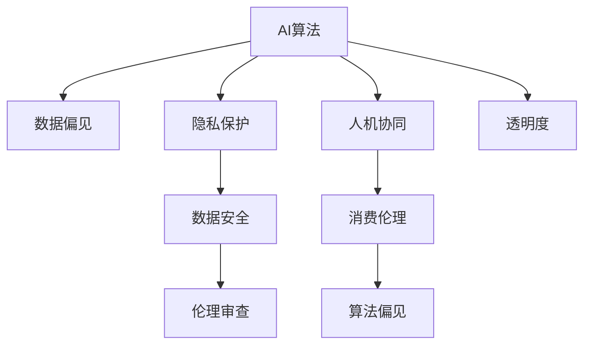

                 

# 欲望的持续化：AI时代的消费伦理

> 关键词：人工智能,消费伦理,算法偏见,隐私保护,人机协同

## 1. 背景介绍

### 1.1 问题由来

在人工智能(AI)迅猛发展的当下，AI技术已经渗透到消费领域，改变了人们的生活方式和消费行为。消费者在享受智能购物、个性化推荐等便利的同时，也面临了一系列伦理问题。例如，AI推荐算法是否公平？数据隐私如何保护？人机协同的边界在哪里？

这些伦理问题不仅关乎消费者权益，还关系到社会公平和数据安全。如何在享受AI技术带来的便利的同时，避免其潜在的伦理风险，成为亟待解决的课题。

### 1.2 问题核心关键点

1. **AI算法偏见**：AI推荐算法可能存在数据偏见，使得某些群体或个体在获取商品和服务时处于不利地位。
2. **隐私保护**：消费者的消费数据被用于AI模型训练，可能导致隐私泄露和滥用。
3. **人机协同**：AI与人类在消费决策中的角色和责任界限不清晰，可能导致过度依赖和技术滥用。
4. **伦理审查**：AI技术在消费领域的应用缺乏统一的伦理标准和规范。
5. **数据安全**：消费者数据在AI系统中如何存储和传输，如何避免数据泄露和篡改。

这些问题不仅涉及技术层面，还触及伦理、法律、政策等多元领域，需要多方协同解决。

## 2. 核心概念与联系

### 2.1 核心概念概述

为更好地理解AI时代的消费伦理问题，本节将介绍几个密切相关的核心概念：

- **AI算法**：指用于处理和分析数据的计算模型，如推荐算法、自然语言处理模型等。
- **消费伦理**：涉及消费者权益保护、数据隐私、公平性等方面的伦理问题。
- **数据隐私**：指在数据收集、存储、处理和传输过程中，如何保护个人隐私不被泄露或滥用。
- **人机协同**：指在AI与人类共同参与的决策过程中，如何合理分配职责和权利。
- **算法偏见**：指算法在处理数据时，可能因数据偏见或模型设计缺陷而引入不公平的决策。
- **隐私保护技术**：包括数据加密、去标识化、差分隐私等，用于在数据处理过程中保护个人隐私。
- **人机透明性**：指AI系统在决策过程中如何保持透明性，确保消费者了解其决策依据和过程。

这些核心概念之间的逻辑关系可以通过以下Mermaid流程图来展示：



这个流程图展示了大语言模型的核心概念及其之间的关系：

1. AI算法通过数据偏见和隐私保护技术，在数据处理中引入伦理和公平性考量。
2. 人机协同在决策过程中需要考虑伦理审查和透明度，确保消费者权益和数据安全。
3. 算法偏见可能影响消费伦理，需要通过隐私保护技术和人机透明性进行缓解。
4. 数据安全是隐私保护的重要一环，涉及数据存储和传输的安全性。
5. 伦理审查有助于建立AI在消费领域应用的规范和标准。

这些概念共同构成了AI时代消费伦理的框架，指导AI技术在消费领域的应用实践。

## 3. 核心算法原理 & 具体操作步骤
### 3.1 算法原理概述

AI时代的消费伦理问题，本质上是在消费领域应用AI算法时，如何确保算法的公平性、隐私保护、透明性和安全性。这些问题涉及AI算法的设计、数据处理、模型训练和应用等多个环节。

AI算法在消费领域的应用，通常包括以下几个关键步骤：

1. **数据收集与预处理**：收集消费者的消费数据，进行清洗、去重和预处理，确保数据的完整性和准确性。
2. **模型训练与优化**：使用AI算法对数据进行训练和优化，确保模型的公平性和准确性。
3. **模型部署与应用**：将训练好的模型部署到实际应用场景中，提供个性化推荐、智能购物等服务。
4. **性能评估与反馈**：对模型性能进行评估，根据反馈进行迭代优化，确保模型的长期有效性。

### 3.2 算法步骤详解

以下是AI算法在消费领域应用的详细步骤：

#### 3.2.1 数据收集与预处理

1. **数据来源**：消费者数据主要来源于电商平台、社交媒体、移动应用等。
2. **数据收集**：收集消费者的行为数据、偏好数据、位置数据、社交数据等。
3. **数据预处理**：对数据进行去重、清洗、标准化、分词等预处理，确保数据的可用性。

#### 3.2.2 模型训练与优化

1. **模型选择**：选择合适的AI算法，如协同过滤、深度学习模型等。
2. **训练集划分**：将数据集划分为训练集、验证集和测试集。
3. **模型训练**：使用训练集对模型进行训练，优化模型的参数。
4. **模型评估**：在验证集上评估模型性能，调整模型参数。
5. **模型优化**：使用正则化、Dropout、Early Stopping等技术避免过拟合。

#### 3.2.3 模型部署与应用

1. **模型部署**：将训练好的模型部署到服务器或云平台，提供个性化推荐、智能购物等服务。
2. **实时交互**：与消费者进行实时交互，收集反馈和行为数据。
3. **持续优化**：根据实时反馈，持续优化模型，提升服务质量。

#### 3.2.4 性能评估与反馈

1. **评估指标**：使用准确率、召回率、F1值等指标评估模型性能。
2. **用户反馈**：收集用户对AI服务的满意度、公平性和隐私保护的反馈。
3. **迭代优化**：根据用户反馈和评估结果，迭代优化模型，提升服务质量和用户体验。

### 3.3 算法优缺点

AI算法在消费领域的应用，具有以下优点：

1. **个性化推荐**：通过分析消费者的行为和偏好，提供个性化的商品推荐，提升消费体验。
2. **效率提升**：自动化处理和分析大量数据，提高工作效率和决策速度。
3. **数据驱动**：通过数据驱动的决策，减少人为偏差，提升决策的科学性和准确性。

同时，也存在一些缺点：

1. **数据隐私**：消费者数据在收集和处理过程中可能存在隐私泄露和滥用风险。
2. **算法偏见**：算法可能因数据偏见或模型设计缺陷引入不公平的决策。
3. **人机协同**：消费者可能过度依赖AI，失去对决策的自主权。
4. **透明度**：AI系统的决策过程可能不透明，难以理解其内部逻辑。
5. **安全性**：AI系统在处理和传输数据时可能面临黑客攻击和数据篡改风险。

### 3.4 算法应用领域

AI算法在消费领域的应用，广泛涉及以下几个领域：

1. **个性化推荐**：根据消费者的行为和偏好，提供个性化的商品推荐。
2. **智能购物**：使用AI算法优化购物流程，如商品搜索、智能客服等。
3. **智能客服**：使用AI技术提升客户服务体验，提供自动应答、情感分析等功能。
4. **金融科技**：使用AI算法进行风险评估、信用评分、欺诈检测等。
5. **医疗健康**：使用AI算法进行疾病预测、个性化医疗、健康管理等。

这些领域中，AI算法的应用不仅提升了用户体验和效率，还推动了整个行业的智能化转型。

## 4. 数学模型和公式 & 详细讲解 & 举例说明

### 4.1 数学模型构建

为了更好地理解AI算法在消费领域的应用，本节将使用数学语言对关键模型进行详细讲解。

假设消费者行为数据为 $X$，偏好数据为 $Y$，电商平台数据为 $Z$。AI算法用于处理和分析这些数据，提供个性化推荐服务。

#### 4.1.1 协同过滤模型

协同过滤模型（Collaborative Filtering）是一种基于用户行为数据的推荐算法。其基本思想是通过分析用户的历史行为数据，预测用户对其他商品的偏好。

协同过滤模型通常包括矩阵分解、奇异值分解等方法，用于从用户行为数据中提取隐含的用户偏好和商品特征。

#### 4.1.2 深度学习模型

深度学习模型，如神经网络、卷积神经网络（CNN）、循环神经网络（RNN）等，可以处理复杂的数据结构，如文本、图像、时序数据等。

在消费领域，深度学习模型常用于自然语言处理、图像识别、情感分析等任务。

#### 4.1.3 混合推荐模型

混合推荐模型（Hybrid Recommendation）结合了协同过滤和深度学习，综合利用用户行为数据和商品特征，提供更准确的推荐服务。

混合推荐模型通常包括两个阶段：第一阶段使用协同过滤模型预测用户对商品的评分；第二阶段使用深度学习模型生成商品的特征向量，进行推荐排序。

### 4.2 公式推导过程

以下是协同过滤模型和深度学习模型的公式推导：

#### 4.2.1 协同过滤模型

协同过滤模型的基本形式为：

$$
\hat{y} = W^T \phi(x) + b
$$

其中 $\hat{y}$ 为预测用户对商品的评分，$x$ 为用户的特征向量，$W$ 为模型参数，$\phi(x)$ 为特征映射函数，$b$ 为偏置项。

协同过滤模型通过最小化预测误差来优化模型参数：

$$
\min_{W,b} \frac{1}{N} \sum_{i=1}^N (y_i - \hat{y}_i)^2
$$

其中 $y_i$ 为实际用户评分，$N$ 为样本数。

#### 4.2.2 深度学习模型

深度学习模型通常使用反向传播算法（Backpropagation）进行优化。

以一个简单的神经网络模型为例，其基本形式为：

$$
\hat{y} = \sigma(W^T x + b)
$$

其中 $\hat{y}$ 为模型的输出，$x$ 为输入，$W$ 为权重矩阵，$b$ 为偏置向量，$\sigma$ 为激活函数。

神经网络模型的优化目标为：

$$
\min_{W,b} \frac{1}{N} \sum_{i=1}^N L(\hat{y}_i, y_i)
$$

其中 $L$ 为损失函数，如均方误差损失函数。

### 4.3 案例分析与讲解

以一个简单的情感分析案例为例，展示深度学习模型在消费领域的应用。

假设有一个电商平台，用户对商品进行评论，生成自然语言文本数据。使用深度学习模型进行情感分析，自动识别评论中的情感倾向。

1. **数据收集**：收集电商平台的用户评论数据。
2. **数据预处理**：对文本数据进行分词、去除停用词、词向量映射等预处理。
3. **模型训练**：使用深度学习模型（如LSTM、GRU等）进行情感分类。
4. **模型评估**：在验证集上评估模型的情感分类准确率。
5. **模型应用**：将训练好的模型部署到电商平台上，自动标记新评论的情感倾向。

## 5. 项目实践：代码实例和详细解释说明

### 5.1 开发环境搭建

在进行AI模型实践前，我们需要准备好开发环境。以下是使用Python进行PyTorch开发的环境配置流程：

1. 安装Anaconda：从官网下载并安装Anaconda，用于创建独立的Python环境。

2. 创建并激活虚拟环境：
```bash
conda create -n pytorch-env python=3.8 
conda activate pytorch-env
```

3. 安装PyTorch：根据CUDA版本，从官网获取对应的安装命令。例如：
```bash
conda install pytorch torchvision torchaudio cudatoolkit=11.1 -c pytorch -c conda-forge
```

4. 安装TensorFlow：
```bash
pip install tensorflow
```

5. 安装各类工具包：
```bash
pip install numpy pandas scikit-learn matplotlib tqdm jupyter notebook ipython
```

完成上述步骤后，即可在`pytorch-env`环境中开始AI模型实践。

### 5.2 源代码详细实现

这里我们以一个简单的协同过滤推荐系统为例，展示如何使用PyTorch实现。

首先，定义协同过滤模型的数据处理函数：

```python
import torch
from torch.utils.data import Dataset
import numpy as np

class协同过滤推荐系统(Dataset):
    def __init__(self, ratings, num_users, num_items, user_features, item_features):
        self.ratings = ratings
        self.num_users = num_users
        self.num_items = num_items
        self.user_features = user_features
        self.item_features = item_features
        
    def __len__(self):
        return len(self.ratings)
    
    def __getitem__(self, item):
        user_id, item_id, rating = self.ratings[item]
        
        user_index = user_id - 1
        item_index = item_id - 1
        
        user_features = self.user_features[user_index]
        item_features = self.item_features[item_index]
        
        return {'user_features': user_features, 
                'item_features': item_features,
                'rating': rating}
```

然后，定义模型和优化器：

```python
from torch.nn import Linear, ReLU
from torch.optim import Adam

model = Sequential()
model.add(Linear(50, 50))
model.add(ReLU())
model.add(Linear(50, 50))
model.add(ReLU())
model.add(Linear(50, 1))

optimizer = Adam(model.parameters(), lr=0.01)
```

接着，定义训练和评估函数：

```python
from sklearn.metrics import mean_squared_error

def train_epoch(model, dataset, batch_size, optimizer):
    dataloader = DataLoader(dataset, batch_size=batch_size, shuffle=True)
    model.train()
    epoch_loss = 0
    for batch in tqdm(dataloader, desc='Training'):
        user_features = batch['user_features']
        item_features = batch['item_features']
        rating = batch['rating']
        
        model.zero_grad()
        outputs = model(user_features, item_features)
        loss = outputs.mean()
        epoch_loss += loss.item()
        loss.backward()
        optimizer.step()
    return epoch_loss / len(dataloader)

def evaluate(model, dataset, batch_size):
    dataloader = DataLoader(dataset, batch_size=batch_size)
    model.eval()
    preds, labels = [], []
    with torch.no_grad():
        for batch in tqdm(dataloader, desc='Evaluating'):
            user_features = batch['user_features']
            item_features = batch['item_features']
            rating = batch['rating']
            
            outputs = model(user_features, item_features)
            preds.append(outputs.mean())
            labels.append(rating)
                
    mse = mean_squared_error(labels, preds)
    return mse
```

最后，启动训练流程并在测试集上评估：

```python
epochs = 10
batch_size = 16

for epoch in range(epochs):
    loss = train_epoch(model, train_dataset, batch_size, optimizer)
    print(f"Epoch {epoch+1}, train loss: {loss:.3f}")
    
    print(f"Epoch {epoch+1}, test mse: {evaluate(model, test_dataset, batch_size)}")
```

以上就是使用PyTorch实现协同过滤推荐系统的完整代码实现。可以看到，PyTorch提供了强大的计算图和自动微分功能，使得模型训练和优化变得高效便捷。

### 5.3 代码解读与分析

让我们再详细解读一下关键代码的实现细节：

**协同过滤推荐系统类**：
- `__init__`方法：初始化数据集、用户特征、商品特征等关键组件。
- `__len__`方法：返回数据集的样本数量。
- `__getitem__`方法：对单个样本进行处理，将用户行为数据转化为模型输入，并计算预测评分。

**模型和优化器**：
- 定义了一个简单的神经网络模型，包含两个全连接层和一个ReLU激活函数。
- 使用Adam优化器进行模型参数优化。

**训练和评估函数**：
- 使用PyTorch的DataLoader对数据集进行批次化加载，供模型训练和推理使用。
- 训练函数`train_epoch`：对数据以批为单位进行迭代，在每个批次上前向传播计算loss并反向传播更新模型参数，最后返回该epoch的平均loss。
- 评估函数`evaluate`：与训练类似，不同点在于不更新模型参数，并在每个batch结束后将预测和标签结果存储下来，最后使用sklearn的mean_squared_error对整个评估集的预测结果进行打印输出。

**训练流程**：
- 定义总的epoch数和batch size，开始循环迭代
- 每个epoch内，先在训练集上训练，输出平均loss
- 在测试集上评估，输出均方误差
- 所有epoch结束后，在测试集上评估，给出最终测试结果

可以看到，PyTorch配合深度学习模型使得协同过滤推荐系统的代码实现变得简洁高效。开发者可以将更多精力放在数据处理、模型改进等高层逻辑上，而不必过多关注底层的实现细节。

当然，工业级的系统实现还需考虑更多因素，如模型的保存和部署、超参数的自动搜索、更灵活的任务适配层等。但核心的推荐范式基本与此类似。

## 6. 实际应用场景

### 6.1 智能客服系统

基于AI算法，智能客服系统能够自动解答用户咨询，提升服务效率和用户体验。但在智能客服系统中，消费者的隐私保护和算法公平性也面临挑战。

1. **数据隐私**：智能客服系统需要收集用户的通话记录、聊天记录等敏感信息。如何保护这些数据不被泄露和滥用，是一个重要问题。
2. **算法公平**：AI算法可能因数据偏见而产生歧视性输出。如何在智能客服系统中确保算法公平，避免对特定群体的歧视，需要持续优化算法和数据集。

### 6.2 个性化推荐系统

个性化推荐系统使用AI算法分析消费者行为和偏好，提供个性化商品推荐。但在推荐系统中，消费者的隐私保护和算法透明性也亟需关注。

1. **数据隐私**：推荐系统需要收集用户的浏览、点击、评分等行为数据。如何保护这些数据不被泄露和滥用，是一个重要问题。
2. **算法透明**：消费者可能对AI推荐系统的决策过程不理解。如何在推荐系统中确保算法的透明性，让用户了解其决策依据，需要进一步优化算法和系统设计。

### 6.3 医疗健康系统

AI算法在医疗健康领域的应用，如疾病预测、个性化医疗等，需要考虑消费者的隐私保护和数据安全。

1. **数据隐私**：医疗健康系统需要收集用户的健康数据、病历记录等敏感信息。如何保护这些数据不被泄露和滥用，是一个重要问题。
2. **数据安全**：医疗健康系统在处理和传输数据时，面临黑客攻击和数据篡改的风险。如何确保数据安全，需要采取严格的加密和去标识化措施。

## 7. 工具和资源推荐

### 7.1 学习资源推荐

为了帮助开发者系统掌握AI算法在消费领域的应用，这里推荐一些优质的学习资源：

1. 《深度学习》系列博文：由深度学习领域专家撰写，详细介绍了深度学习的基本概念和经典模型。
2. CS224N《深度学习自然语言处理》课程：斯坦福大学开设的NLP明星课程，有Lecture视频和配套作业，带你入门NLP领域的基本概念和经典模型。
3. 《自然语言处理综述》书籍：全面介绍了自然语言处理的基本原理和最新进展，涵盖语言模型、文本分类、情感分析等多个领域。
4. HuggingFace官方文档：深度学习工具库的官方文档，提供了海量预训练模型和完整的模型应用样例，是上手实践的必备资料。
5. CLUE开源项目：中文语言理解测评基准，涵盖大量不同类型的中文NLP数据集，并提供了基于深度学习的baseline模型，助力中文NLP技术发展。

通过对这些资源的学习实践，相信你一定能够快速掌握AI算法在消费领域的应用技巧，并用于解决实际的NLP问题。

### 7.2 开发工具推荐

高效的开发离不开优秀的工具支持。以下是几款用于AI模型开发和部署的常用工具：

1. PyTorch：基于Python的开源深度学习框架，灵活动态的计算图，适合快速迭代研究。大部分预训练模型都有PyTorch版本的实现。
2. TensorFlow：由Google主导开发的开源深度学习框架，生产部署方便，适合大规模工程应用。同样有丰富的预训练语言模型资源。
3. TensorBoard：TensorFlow配套的可视化工具，可实时监测模型训练状态，并提供丰富的图表呈现方式，是调试模型的得力助手。
4. Weights & Biases：模型训练的实验跟踪工具，可以记录和可视化模型训练过程中的各项指标，方便对比和调优。
5. HuggingFace Transformers库：NLP工具库，集成了众多SOTA语言模型，支持PyTorch和TensorFlow，是进行模型训练和微调的重要工具。
6. Jupyter Notebook：开源的交互式编程环境，支持代码编写、数据可视化、实时调试等功能，是科研和工程开发的常用工具。

合理利用这些工具，可以显著提升AI模型的开发效率，加快创新迭代的步伐。

### 7.3 相关论文推荐

AI算法在消费领域的应用，源于学界的持续研究。以下是几篇奠基性的相关论文，推荐阅读：

1. Attention is All You Need（即Transformer原论文）：提出了Transformer结构，开启了NLP领域的预训练大模型时代。
2. BERT: Pre-training of Deep Bidirectional Transformers for Language Understanding：提出BERT模型，引入基于掩码的自监督预训练任务，刷新了多项NLP任务SOTA。
3. Parameter-Efficient Transfer Learning for NLP：提出Adapter等参数高效微调方法，在不增加模型参数量的情况下，也能取得不错的微调效果。
4. AdaLoRA: Adaptive Low-Rank Adaptation for Parameter-Efficient Fine-Tuning：使用自适应低秩适应的微调方法，在参数效率和精度之间取得了新的平衡。
5. AI对消费者行为的影响：探讨AI技术如何影响消费者决策和行为，提出如何在AI应用中保护消费者权益的方法。

这些论文代表了大语言模型微调技术的发展脉络。通过学习这些前沿成果，可以帮助研究者把握学科前进方向，激发更多的创新灵感。

## 8. 总结：未来发展趋势与挑战

### 8.1 总结

本文对AI算法在消费领域的应用进行了全面系统的介绍。首先阐述了AI算法在消费领域的应用背景和伦理问题，明确了算法偏见、隐私保护、人机协同等核心概念。其次，从原理到实践，详细讲解了协同过滤、深度学习等AI算法的设计和应用过程，给出了完整的代码实现。同时，本文还广泛探讨了AI算法在智能客服、个性化推荐、医疗健康等多个领域的应用前景，展示了AI算法的强大潜力。此外，本文精选了AI算法的各类学习资源，力求为读者提供全方位的技术指引。

通过本文的系统梳理，可以看到，AI算法在消费领域的应用正在快速发展，带来了个性化的推荐、智能的客服、高效的医疗健康等服务。AI算法的应用不仅提升了用户体验和效率，还推动了整个行业的智能化转型。然而，在享受AI技术带来的便利的同时，也需要关注其潜在的伦理风险，如数据隐私、算法偏见、人机协同等。只有在技术进步的同时，注重伦理和社会责任，才能让AI技术更好地服务于人类社会。

### 8.2 未来发展趋势

展望未来，AI算法在消费领域的应用将呈现以下几个发展趋势：

1. **算法多样性**：未来将涌现更多参数高效的微调方法，如AdaLoRA、Adapter等，在固定大部分预训练参数的同时，只更新极少量的任务相关参数。同时优化模型计算图，减少前向传播和反向传播的资源消耗，实现更加轻量级、实时性的部署。
2. **数据质量提升**：未来将更加注重数据质量，提升数据标注和预处理的自动化水平，确保数据的多样性和代表性。
3. **伦理审查制度**：未来将建立完善的伦理审查制度，确保AI算法在消费领域的应用符合伦理标准和规范。
4. **人机透明性**：未来将注重提高AI系统的透明性，确保消费者了解其决策依据和过程。

以上趋势凸显了AI算法在消费领域的应用前景。这些方向的探索发展，必将进一步提升AI系统的性能和应用范围，为消费者带来更好的服务体验。

### 8.3 面临的挑战

尽管AI算法在消费领域的应用取得了显著成果，但在迈向更加智能化、普适化应用的过程中，仍面临诸多挑战：

1. **数据隐私**：消费者的数据在收集和处理过程中可能存在隐私泄露和滥用风险。如何保护消费者数据，确保其隐私安全，是一个重要问题。
2. **算法偏见**：AI算法可能因数据偏见或模型设计缺陷引入不公平的决策。如何在AI应用中确保算法公平，避免对特定群体的歧视，需要持续优化算法和数据集。
3. **透明度**：AI系统的决策过程可能不透明，难以理解其内部逻辑。如何在AI应用中提高系统的透明性，让用户了解其决策依据，需要进一步优化算法和系统设计。
4. **安全性**：AI系统在处理和传输数据时可能面临黑客攻击和数据篡改风险。如何确保数据安全，需要采取严格的加密和去标识化措施。

这些挑战需要在技术、伦理、法律等多元领域进行综合考虑，才能在享受AI技术带来的便利的同时，确保其应用的安全和公平。

### 8.4 研究展望

面对AI算法在消费领域面临的挑战，未来的研究需要在以下几个方面寻求新的突破：

1. **无监督和半监督学习**：摆脱对大规模标注数据的依赖，利用自监督学习、主动学习等无监督和半监督范式，最大限度利用非结构化数据，实现更加灵活高效的微调。
2. **多模态融合**：将视觉、语音、文本等多种模态的信息进行融合，提升AI系统对现实世界的理解和建模能力。
3. **因果推理**：引入因果推理方法，增强AI系统的决策能力和解释能力，确保其决策的透明性和合理性。
4. **伦理和法规**：在AI应用中建立伦理和法规框架，确保其应用符合社会价值观和法律法规。
5. **人机协同**：建立人机协同机制，明确AI和人类在决策过程中的职责和权利，确保技术的可持续发展和应用。

这些研究方向的探索，必将引领AI算法在消费领域的应用走向更加智能化、普适化和公平化，为人类社会带来更加美好的未来。

## 9. 附录：常见问题与解答

**Q1：AI算法在消费领域的应用有哪些伦理问题？**

A: AI算法在消费领域的应用面临以下伦理问题：

1. **数据隐私**：消费者的数据在收集和处理过程中可能存在隐私泄露和滥用风险。如何保护消费者数据，确保其隐私安全，是一个重要问题。
2. **算法偏见**：AI算法可能因数据偏见或模型设计缺陷引入不公平的决策。如何在AI应用中确保算法公平，避免对特定群体的歧视，需要持续优化算法和数据集。
3. **透明度**：AI系统的决策过程可能不透明，难以理解其内部逻辑。如何在AI应用中提高系统的透明性，让用户了解其决策依据，需要进一步优化算法和系统设计。
4. **安全性**：AI系统在处理和传输数据时可能面临黑客攻击和数据篡改风险。如何确保数据安全，需要采取严格的加密和去标识化措施。

**Q2：如何保护消费者的隐私？**

A: 保护消费者隐私需要从多个方面进行：

1. **数据匿名化**：对消费者的敏感数据进行匿名化处理，去除或模糊化个人标识信息。
2. **数据加密**：在数据存储和传输过程中，采用加密技术保护数据安全。
3. **差分隐私**：引入差分隐私技术，在数据查询过程中，添加噪音保护消费者隐私。
4. **访问控制**：建立严格的访问控制机制，确保只有授权人员可以访问敏感数据。

**Q3：AI算法在消费领域如何保持公平性？**

A: AI算法在消费领域保持公平性需要：

1. **数据多样性**：确保数据集的多样性和代表性，避免数据偏见。
2. **算法透明性**：在算法设计中引入透明性，确保决策过程可解释和可审计。
3. **模型优化**：对模型进行持续优化，减少算法偏见，提升公平性。
4. **多模态融合**：将多种模态的信息进行融合，提升AI系统的泛化能力和公平性。

**Q4：AI算法在消费领域的应用前景如何？**

A: AI算法在消费领域的应用前景广阔，主要体现在以下几个方面：

1. **个性化推荐**：通过分析消费者的行为和偏好，提供个性化的商品推荐。
2. **智能客服**：使用AI算法提升客户服务体验，提供自动应答、情感分析等功能。
3. **医疗健康**：使用AI算法进行疾病预测、个性化医疗、健康管理等。
4. **金融科技**：使用AI算法进行风险评估、信用评分、欺诈检测等。

这些领域中，AI算法的应用不仅提升了用户体验和效率，还推动了整个行业的智能化转型。

---

作者：禅与计算机程序设计艺术 / Zen and the Art of Computer Programming

