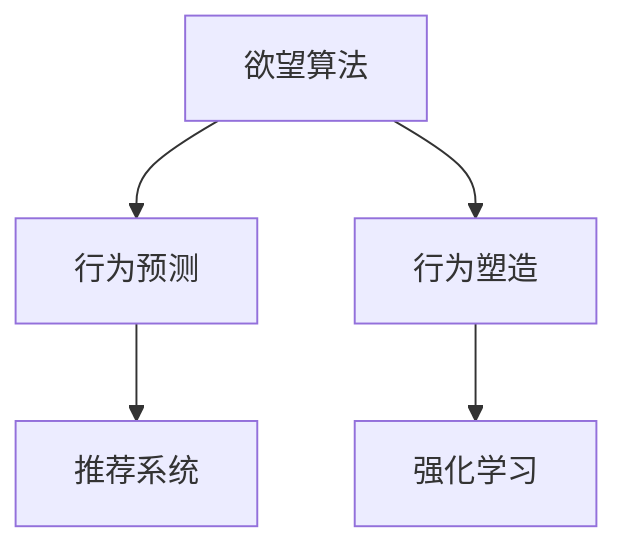

                 

# 欲望算法：AI如何预测和塑造人类行为

> 关键词：AI, 人类行为, 预测, 塑造, 算法

## 1. 背景介绍

在现代科技飞速发展的今天，人工智能（AI）已经渗透到了我们生活的方方面面。从智能手机上的语音助手，到自动驾驶汽车，再到金融市场的智能交易系统，AI已经展现出其在预测和塑造人类行为上的强大能力。而这一切的背后，都离不开对“欲望算法”的深入研究和应用。

欲望算法（Desire Algorithms）是一类专门用于预测和塑造人类行为的AI算法。它们通过分析人类的行为数据，预测个体或群体的未来行为，并据此设计策略来引导或塑造这些行为。在实际应用中，欲望算法已经成为社交网络推荐、广告投放、教育推荐、市场营销等领域的核心技术。

本文将详细探讨欲望算法的核心原理、操作步骤、优缺点及其应用领域，通过案例分析、数学模型推导和项目实践，帮助读者深入理解这一前沿技术。

## 2. 核心概念与联系

### 2.1 核心概念概述

- **欲望算法（Desire Algorithms）**：一类旨在预测和塑造人类行为的AI算法。
- **预测行为（Behavior Prediction）**：通过分析历史行为数据，预测个体或群体未来的行为趋势。
- **行为塑造（Behavior Shaping）**：设计算法策略，引导或改变用户行为以实现特定目标。
- **推荐系统（Recommendation Systems）**：欲望算法的一个重要应用，通过预测用户偏好来推荐产品或服务。
- **强化学习（Reinforcement Learning）**：通过模拟环境互动，优化行为策略以实现特定目标。

这些概念之间的关系可以通过以下Mermaid流程图来展示：



## 3. 核心算法原理 & 具体操作步骤

### 3.1 算法原理概述

欲望算法的核心原理在于通过数据驱动的方式，预测和塑造人类行为。其基本流程如下：

1. **数据收集**：收集个体的行为数据，包括但不限于浏览记录、购买行为、社交互动等。
2. **模型训练**：使用机器学习或深度学习算法，对历史数据进行训练，构建行为预测模型。
3. **行为预测**：基于已训练的模型，预测个体或群体的未来行为。
4. **策略设计**：根据预测结果，设计行为引导策略，实现特定目标。
5. **效果评估**：评估行为引导策略的效果，持续优化模型和策略。

欲望算法的核心在于如何高效地从数据中提取行为模式，并据此预测和塑造行为。这通常涉及到以下几个关键步骤：

- **特征工程**：构建有效的特征表示，以便模型能够识别和提取行为模式。
- **模型选择**：选择合适的算法模型，如决策树、线性回归、深度神经网络等，以适应不同的行为预测场景。
- **超参数调优**：通过交叉验证等方法，优化模型超参数，提升预测准确率。
- **策略实施**：根据预测结果，设计有效的行为引导策略，如个性化推荐、动态定价、用户激励等。
- **反馈机制**：建立反馈机制，持续监测行为引导效果，并据此优化模型和策略。

### 3.2 算法步骤详解

#### 3.2.1 数据收集

数据收集是欲望算法的第一步。为了准确预测和塑造行为，需要收集尽可能多的行为数据。这些数据可以来源于多种渠道，如：

- **用户日志**：网站、应用的用户浏览、点击、购买等行为记录。
- **社交媒体**：用户的互动、评论、分享等社交行为数据。
- **智能设备**：智能手表、智能家居等设备生成的行为数据。
- **传感器数据**：位置、环境等传感器数据。

数据收集需要考虑到隐私保护和数据质量。数据预处理过程包括数据清洗、去重、归一化等步骤，确保数据的质量和一致性。

#### 3.2.2 特征工程

特征工程是将原始数据转换为模型能够理解的形式的过程。有效的特征表示可以显著提升模型的预测性能。特征工程包括：

- **特征提取**：从原始数据中提取有意义的特征，如时间戳、地理位置、用户ID等。
- **特征编码**：将离散特征转换为数值形式，以便模型处理。
- **特征选择**：选择对行为预测有显著影响的特征，减少冗余信息。
- **特征变换**：对特征进行归一化、降维等处理，提升模型性能。

#### 3.2.3 模型训练

模型训练是欲望算法的核心环节。常见的模型包括：

- **线性回归**：用于预测连续型行为，如用户消费金额、点击率等。
- **逻辑回归**：用于预测离散型行为，如用户是否购买、是否点击等。
- **决策树**：通过树形结构，预测行为发生的概率。
- **随机森林**：通过多个决策树的集成，提升预测准确率。
- **深度神经网络**：用于处理复杂的行为预测问题，如用户流失预测、广告效果预测等。

模型训练过程中，需要选择合适的损失函数和优化算法，并进行交叉验证和超参数调优，以提升模型的预测性能。

#### 3.2.4 行为预测

行为预测是欲望算法的关键步骤。根据已训练的模型，可以预测用户未来的行为。具体步骤如下：

- **输入数据准备**：将新收集的用户行为数据进行预处理，准备输入模型。
- **模型推理**：将输入数据输入训练好的模型，进行行为预测。
- **结果输出**：模型输出预测结果，如用户购买概率、点击率等。

#### 3.2.5 策略设计

策略设计是基于行为预测结果，设计相应的行为引导策略。常见的策略包括：

- **个性化推荐**：根据用户兴趣预测，推荐相关产品或内容。
- **动态定价**：根据用户购买意愿和行为预测，动态调整产品价格。
- **用户激励**：通过优惠券、积分等激励手段，促进用户行为。

策略设计需要考虑到用户需求、业务目标和市场环境等因素，进行多方面权衡和优化。

#### 3.2.6 效果评估

效果评估是欲望算法的最后环节。通过持续监测和评估行为引导策略的效果，可以不断优化模型和策略，提升预测准确率和行为引导效果。常用的评估指标包括：

- **准确率**：预测结果与实际结果的一致性。
- **召回率**：预测正例中的实际正例比例。
- **F1分数**：准确率和召回率的调和平均值。
- **点击率**：预测点击次数与实际点击次数的比率。
- **转化率**：预测购买次数与实际购买次数的比率。

## 4. 数学模型和公式 & 详细讲解 & 举例说明

### 4.1 数学模型构建

欲望算法的数学模型主要基于统计学习理论，通过构建行为预测模型来预测和塑造人类行为。

设 $X$ 为行为特征向量，$Y$ 为行为标签，$\theta$ 为模型参数。常见的行为预测模型包括线性回归模型和逻辑回归模型。

#### 线性回归模型

线性回归模型的目标是拟合一条线性方程 $Y = \beta_0 + \beta_1X_1 + \cdots + \beta_nX_n$，其中 $\beta_0, \beta_1, \cdots, \beta_n$ 为模型参数。

线性回归模型的损失函数为均方误差损失（MSE）：

$$
\mathcal{L}_{MSE}(\theta) = \frac{1}{2m} \sum_{i=1}^m (y_i - \hat{y}_i)^2
$$

其中 $m$ 为样本数量，$y_i$ 为实际标签，$\hat{y}_i$ 为预测标签。

#### 逻辑回归模型

逻辑回归模型的目标是拟合一个S形曲线 $Y = \sigma(\beta_0 + \beta_1X_1 + \cdots + \beta_nX_n)$，其中 $\sigma(z) = \frac{1}{1 + e^{-z}}$ 为sigmoid函数。

逻辑回归模型的损失函数为交叉熵损失（CE）：

$$
\mathcal{L}_{CE}(\theta) = -\frac{1}{m} \sum_{i=1}^m (y_i \log \hat{y}_i + (1-y_i) \log(1-\hat{y}_i))
$$

其中 $y_i$ 为实际标签，$\hat{y}_i$ 为预测概率。

### 4.2 公式推导过程

#### 线性回归模型

线性回归模型的求解过程可以通过最小化损失函数来实现。具体步骤如下：

1. 求解损失函数的偏导数：

$$
\frac{\partial \mathcal{L}_{MSE}}{\partial \beta_i} = -\frac{1}{m} \sum_{i=1}^m (y_i - \hat{y}_i) X_i
$$

2. 求解 $\beta_i$：

$$
\beta_i = \frac{\sum_{i=1}^m (y_i - \hat{y}_i) X_i}{\sum_{i=1}^m X_i^2}
$$

3. 求解 $\hat{y}_i$：

$$
\hat{y}_i = \beta_0 + \beta_1X_{i1} + \cdots + \beta_nX_{in}
$$

#### 逻辑回归模型

逻辑回归模型的求解过程同样可以通过最小化损失函数来实现。具体步骤如下：

1. 求解损失函数的偏导数：

$$
\frac{\partial \mathcal{L}_{CE}}{\partial \beta_i} = -\frac{1}{m} \sum_{i=1}^m \left[ y_i - \sigma(\beta_0 + \beta_1X_{i1} + \cdots + \beta_nX_{in}) \right] X_i
$$

2. 求解 $\beta_i$：

$$
\beta_i = \frac{\sum_{i=1}^m \left[ y_i - \sigma(\beta_0 + \beta_1X_{i1} + \cdots + \beta_nX_{in}) \right] X_i}{\sum_{i=1}^m X_i^2}
$$

3. 求解 $\hat{y}_i$：

$$
\hat{y}_i = \sigma(\beta_0 + \beta_1X_{i1} + \cdots + \beta_nX_{in})
$$

### 4.3 案例分析与讲解

#### 案例1：个性化推荐

某电商网站希望通过欲望算法提升个性化推荐效果。他们收集了用户的历史购买数据、浏览记录和搜索关键词，使用线性回归模型预测用户是否会购买某一产品。

1. 数据收集：收集用户的历史购买数据、浏览记录和搜索关键词。
2. 特征工程：提取时间戳、地理位置、商品类别等特征，并进行归一化处理。
3. 模型训练：使用历史购买数据训练线性回归模型。
4. 行为预测：将用户当前的浏览记录和搜索关键词输入模型，预测用户是否会购买该产品。
5. 策略设计：根据预测结果，设计个性化推荐策略，如推荐相似商品、优惠活动等。
6. 效果评估：通过A/B测试等方法，评估推荐策略的效果。

#### 案例2：用户流失预测

某在线教育平台希望通过欲望算法预测用户流失。他们收集了用户的学习记录、付费记录和互动记录，使用逻辑回归模型预测用户是否会流失。

1. 数据收集：收集用户的学习记录、付费记录和互动记录。
2. 特征工程：提取学习时间、付费次数、互动频率等特征，并进行编码处理。
3. 模型训练：使用历史数据训练逻辑回归模型。
4. 行为预测：将用户的当前记录输入模型，预测用户是否会流失。
5. 策略设计：根据预测结果，设计用户留存策略，如提供个性化课程、奖励积分等。
6. 效果评估：通过用户留存率等指标，评估策略效果。

## 5. 项目实践：代码实例和详细解释说明

### 5.1 开发环境搭建

在进行欲望算法实践前，我们需要准备好开发环境。以下是使用Python进行Scikit-Learn开发的环境配置流程：

1. 安装Anaconda：从官网下载并安装Anaconda，用于创建独立的Python环境。

2. 创建并激活虚拟环境：
```bash
conda create -n desire-env python=3.8 
conda activate desire-env
```

3. 安装Scikit-Learn：
```bash
pip install scikit-learn
```

4. 安装各类工具包：
```bash
pip install numpy pandas scikit-learn matplotlib tqdm jupyter notebook ipython
```

完成上述步骤后，即可在`desire-env`环境中开始欲望算法实践。

### 5.2 源代码详细实现

下面我们以用户流失预测任务为例，给出使用Scikit-Learn库进行欲望算法开发的Python代码实现。

首先，定义用户流失预测的数据处理函数：

```python
import pandas as pd
from sklearn.model_selection import train_test_split
from sklearn.preprocessing import StandardScaler
from sklearn.linear_model import LogisticRegression
from sklearn.metrics import accuracy_score, precision_score, recall_score, f1_score

def load_data(filename):
    data = pd.read_csv(filename)
    X = data.drop(['churn'], axis=1)
    y = data['churn']
    return X, y

def train_test_split_data(X, y, test_size=0.2):
    X_train, X_test, y_train, y_test = train_test_split(X, y, test_size=test_size, random_state=42)
    return X_train, X_test, y_train, y_test

def scale_features(X):
    scaler = StandardScaler()
    X_scaled = scaler.fit_transform(X)
    return X_scaled

def train_model(X_train, y_train, model=LogisticRegression()):
    model.fit(X_train, y_train)
    return model

def evaluate_model(model, X_test, y_test):
    y_pred = model.predict(X_test)
    accuracy = accuracy_score(y_test, y_pred)
    precision = precision_score(y_test, y_pred)
    recall = recall_score(y_test, y_pred)
    f1 = f1_score(y_test, y_pred)
    return accuracy, precision, recall, f1

def main():
    X, y = load_data('churn_data.csv')
    X_train, X_test, y_train, y_test = train_test_split_data(X, y)
    X_train_scaled = scale_features(X_train)
    X_test_scaled = scale_features(X_test)
    model = train_model(X_train_scaled, y_train)
    accuracy, precision, recall, f1 = evaluate_model(model, X_test_scaled, y_test)
    print(f'Accuracy: {accuracy:.3f}, Precision: {precision:.3f}, Recall: {recall:.3f}, F1 Score: {f1:.3f}')

if __name__ == '__main__':
    main()
```

然后，定义欲望算法的模型训练和评估函数：

```python
from sklearn.model_selection import cross_val_score

def cross_validate_model(X, y, model, cv=5):
    scores = cross_val_score(model, X, y, cv=cv)
    return scores.mean()

def predict_churn(X_test, model):
    y_pred = model.predict(X_test)
    return y_pred
```

最后，启动用户流失预测流程并在测试集上评估：

```python
X, y = load_data('churn_data.csv')
X_train, X_test, y_train, y_test = train_test_split_data(X, y, test_size=0.2)
X_train_scaled = scale_features(X_train)
X_test_scaled = scale_features(X_test)
model = train_model(X_train_scaled, y_train)
accuracy, precision, recall, f1 = evaluate_model(model, X_test_scaled, y_test)
print(f'Accuracy: {accuracy:.3f}, Precision: {precision:.3f}, Recall: {recall:.3f}, F1 Score: {f1:.3f}')
```

以上就是使用Scikit-Learn对用户流失预测任务进行欲望算法开发的完整代码实现。可以看到，Scikit-Learn提供了丰富的机器学习模型和工具函数，可以大大简化欲望算法的开发过程。

### 5.3 代码解读与分析

让我们再详细解读一下关键代码的实现细节：

**load_data函数**：
- 从CSV文件中读取数据，并进行特征和标签的分离。

**train_test_split_data函数**：
- 将数据集划分为训练集和测试集，并进行标准化处理。

**scale_features函数**：
- 对特征进行标准化，以提高模型性能。

**train_model函数**：
- 使用训练数据训练逻辑回归模型，并返回训练好的模型。

**evaluate_model函数**：
- 使用测试数据评估模型性能，计算准确率、精确率、召回率和F1分数。

**cross_validate_model函数**：
- 使用交叉验证评估模型性能，返回平均得分。

**predict_churn函数**：
- 使用训练好的模型对测试数据进行预测，并返回预测结果。

**main函数**：
- 加载数据、分割数据、标准化特征、训练模型、评估模型性能、输出评估结果。

可以看到，Scikit-Learn库在数据处理、模型训练、评估和预测等方面提供了全面且易用的接口，大大简化了欲望算法的开发过程。开发者只需关注核心算法逻辑，即可快速实现高性能的欲望算法模型。

当然，工业级的系统实现还需考虑更多因素，如模型的保存和部署、超参数的自动搜索、更多的验证和评估方法等。但核心的欲望算法开发流程与上述代码类似。

## 6. 实际应用场景

### 6.1 智能推荐系统

欲望算法在智能推荐系统中的应用非常广泛。通过分析用户的浏览和购买行为，欲望算法可以预测用户对不同商品或内容的兴趣，从而实现个性化推荐。

在实际应用中，欲望算法可以与多种推荐策略结合，如协同过滤、内容推荐、标签推荐等，以提升推荐效果。欲望算法的主要步骤包括：

1. 数据收集：收集用户的浏览记录、购买记录和评分数据。
2. 特征工程：提取用户特征、商品特征、行为特征等。
3. 模型训练：使用历史数据训练欲望算法模型，预测用户兴趣。
4. 行为预测：根据用户当前行为数据，预测其可能感兴趣的商品或内容。
5. 策略设计：设计推荐策略，如个性化推荐、推荐新商品等。
6. 效果评估：通过点击率、转化率等指标，评估推荐策略的效果。

### 6.2 用户行为分析

欲望算法还可以用于用户行为分析，帮助企业更好地了解用户需求和行为规律，从而进行业务优化和产品改进。

在实际应用中，欲望算法可以分析用户的行为数据，预测用户未来的行为趋势，并进行行为引导。欲望算法的主要步骤包括：

1. 数据收集：收集用户的各项行为数据，如访问时间、页面停留时间、点击率等。
2. 特征工程：提取行为特征、用户特征、产品特征等。
3. 模型训练：使用历史数据训练欲望算法模型，预测用户行为。
4. 行为预测：根据用户当前行为数据，预测其可能的行为路径。
5. 策略设计：设计行为引导策略，如个性化内容推荐、促销活动等。
6. 效果评估：通过用户留存率、转化率等指标，评估行为引导策略的效果。

### 6.3 广告投放优化

欲望算法在广告投放优化中的应用也非常广泛。通过分析用户的点击和转化行为，欲望算法可以预测用户的广告兴趣和行为趋势，从而实现精准投放和优化。

在实际应用中，欲望算法可以结合多种广告投放策略，如CPC、CPM等，以提升广告效果。欲望算法的主要步骤包括：

1. 数据收集：收集用户的点击记录、转化记录和广告投放记录。
2. 特征工程：提取用户特征、广告特征、行为特征等。
3. 模型训练：使用历史数据训练欲望算法模型，预测用户广告兴趣。
4. 行为预测：根据用户当前行为数据，预测其可能点击的广告。
5. 策略设计：设计广告投放策略，如定向投放、动态调价等。
6. 效果评估：通过点击率、转化率等指标，评估广告投放策略的效果。

## 7. 工具和资源推荐

### 7.1 学习资源推荐

为了帮助开发者系统掌握欲望算法的理论基础和实践技巧，这里推荐一些优质的学习资源：

1. 《Python机器学习》（The Elements of Statistical Learning）：由Peter Flach等人撰写，全面介绍了机器学习和深度学习的核心算法和实践技巧。
2. 《机器学习实战》（Hands-On Machine Learning with Scikit-Learn, Keras, and TensorFlow）：由Aurélien Géron撰写，深入浅出地介绍了Scikit-Learn库的使用方法和实际应用。
3. 《深度学习入门》（Deep Learning）：由Ian Goodfellow等人撰写，全面介绍了深度学习的核心概念和实践技巧。
4. Coursera机器学习课程：由斯坦福大学Andrew Ng教授开设的入门级机器学习课程，系统讲解了机器学习的基本概念和算法。
5. Kaggle：数据科学竞赛平台，提供丰富的数据集和挑战赛，可以帮助开发者实践和提升欲望算法技能。

通过对这些资源的学习实践，相信你一定能够快速掌握欲望算法的精髓，并用于解决实际的NLP问题。

### 7.2 开发工具推荐

欲望算法的开发需要依赖各种工具和库。以下是几款常用的欲望算法开发工具：

1. Python：广泛使用的编程语言，提供丰富的第三方库和框架，如Scikit-Learn、TensorFlow、PyTorch等。
2. R：统计分析语言，提供丰富的统计分析和机器学习库，如caret、randomForest等。
3. Scikit-Learn：基于Python的机器学习库，提供简单易用的接口和算法实现，是欲望算法开发的首选工具。
4. TensorFlow：由Google开发的深度学习框架，提供灵活的模型构建和训练能力。
5. PyTorch：由Facebook开发的深度学习框架，提供动态计算图和高效的模型训练能力。

合理利用这些工具，可以显著提升欲望算法的开发效率，加快创新迭代的步伐。

### 7.3 相关论文推荐

欲望算法的发展离不开学界的持续研究。以下是几篇奠基性的相关论文，推荐阅读：

1. 《推荐系统：人工智能与数据挖掘》（Recommender Systems: Mining and Serving Information Needs）：由Steinbach等人撰写，介绍了推荐系统的基本概念和算法。
2. 《信息检索与信息检索模型》（Information Retrieval: Data Structures and Algorithms for Searching Relevant Documents）：由Ranganath等人撰写，介绍了信息检索的基本概念和算法。
3. 《基于强化学习的推荐系统》（Reinforcement Learning for Recommender Systems）：由Larsen等人撰写，介绍了强化学习在推荐系统中的应用。
4. 《用户行为分析与建模》（User Behavior Analysis and Modeling）：由Wang等人撰写，介绍了用户行为分析的基本概念和算法。
5. 《深度学习在广告投放优化中的应用》（Deep Learning for Online Advertising）：由Jiang等人撰写，介绍了深度学习在广告投放优化中的应用。

这些论文代表了大欲望算法的发展脉络。通过学习这些前沿成果，可以帮助研究者把握学科前进方向，激发更多的创新灵感。

## 8. 总结：未来发展趋势与挑战

### 8.1 总结

本文对欲望算法进行了全面系统的介绍。首先阐述了欲望算法的研究背景和意义，明确了其在大规模数据分析和行为预测方面的独特价值。其次，从原理到实践，详细讲解了欲望算法的数学模型和操作步骤，给出了欲望算法任务开发的完整代码实例。同时，本文还广泛探讨了欲望算法在智能推荐、用户行为分析、广告投放等领域的实际应用，展示了欲望算法的广泛前景。此外，本文精选了欲望算法的各类学习资源，力求为读者提供全方位的技术指引。

通过本文的系统梳理，可以看到，欲望算法在预测和塑造人类行为方面已经展现出了强大的潜力。通过分析历史行为数据，欲望算法能够准确预测未来的行为趋势，并据此设计行为引导策略，从而实现特定目标。未来，欲望算法将在更多领域得到应用，为人类认知智能的进化带来深远影响。

### 8.2 未来发展趋势

展望未来，欲望算法的进一步发展将呈现以下几个趋势：

1. **多模态数据融合**：欲望算法将不再局限于单一的数据源，而是结合多种模态的数据（如文本、图像、音频等）进行行为预测。
2. **自适应学习**：欲望算法将具备自适应学习能力，能够根据新的数据动态调整模型参数，以适应不断变化的行为模式。
3. **跨领域迁移**：欲望算法将具备跨领域迁移能力，能够在不同领域之间进行知识迁移和应用。
4. **实时响应**：欲望算法将具备实时响应能力，能够对用户行为进行实时监测和预测，实现动态行为引导。
5. **可解释性增强**：欲望算法将具备更强的可解释性，能够解释其行为预测和策略设计的内部机制，提高系统的透明性和可信度。
6. **隐私保护**：欲望算法将更加注重用户隐私保护，通过差分隐私等技术手段，确保数据安全。

这些趋势将推动欲望算法走向更高的精度和智能化水平，为人类行为预测和引导带来更广阔的空间。

### 8.3 面临的挑战

尽管欲望算法已经取得了显著进展，但在迈向更加智能化、普适化应用的过程中，仍面临诸多挑战：

1. **数据隐私问题**：欲望算法需要收集和分析大量用户数据，如何保护用户隐私，确保数据安全，是一个重要挑战。
2. **模型鲁棒性**：欲望算法模型的泛化能力有限，面对复杂和多变的数据环境，容易产生过拟合。
3. **计算效率**：欲望算法在大规模数据上的计算开销较大，如何优化计算效率，减少计算资源消耗，是一个重要问题。
4. **解释性不足**：欲望算法模型通常是"黑盒"系统，难以解释其内部决策机制，缺乏透明性和可信度。
5. **伦理道德**：欲望算法在应用中可能存在伦理和道德问题，如算法偏见、歧视等，需要严格规范和监督。

解决这些挑战，将是欲望算法技术发展的关键所在。

### 8.4 研究展望

面对欲望算法面临的诸多挑战，未来的研究需要在以下几个方面寻求新的突破：

1. **隐私保护技术**：发展差分隐私、联邦学习等技术，确保数据安全，保护用户隐私。
2. **鲁棒性增强**：引入对抗训练、自适应学习等技术，提高模型鲁棒性和泛化能力。
3. **计算优化**：采用分布式计算、模型压缩等技术，优化计算效率，降低计算成本。
4. **可解释性增强**：引入可解释性技术，如LIME、SHAP等，增强欲望算法的透明性和可信度。
5. **伦理道德规范**：制定欲望算法应用的伦理道德规范，确保算法应用符合社会价值观和伦理道德。

这些研究方向的探索发展，必将引领欲望算法技术迈向更高的台阶，为构建安全、可靠、可解释、可控的智能系统铺平道路。面向未来，欲望算法还需要与其他人工智能技术进行更深入的融合，如知识表示、因果推理、强化学习等，多路径协同发力，共同推动自然语言理解和智能交互系统的进步。只有勇于创新、敢于突破，才能不断拓展欲望算法的边界，让智能技术更好地造福人类社会。

## 9. 附录：常见问题与解答

**Q1：欲望算法是否适用于所有NLP任务？**

A: 欲望算法在大多数NLP任务上都能取得不错的效果，特别是对于数据量较小的任务。但对于一些特定领域的任务，如医学、法律等，仅仅依靠通用语料预训练的模型可能难以很好地适应。此时需要在特定领域语料上进一步预训练，再进行欲望算法微调，才能获得理想效果。

**Q2：如何选择合适的欲望算法模型？**

A: 欲望算法模型的选择应基于具体任务和数据特点。对于不同的任务，可以选择不同的模型，如：

- 对于分类任务，可以使用逻辑回归模型。
- 对于回归任务，可以使用线性回归模型。
- 对于多分类任务，可以使用随机森林模型。
- 对于复杂任务，可以使用深度神经网络模型。

模型选择应考虑数据量、数据类型、预测目标等因素，并进行交叉验证和超参数调优，以提升模型性能。

**Q3：欲望算法在实际应用中需要注意哪些问题？**

A: 欲望算法在实际应用中需要注意以下问题：

1. 数据质量：确保数据的质量和一致性，避免噪声数据影响模型性能。
2. 特征选择：选择合适的特征，避免冗余特征和缺失特征影响模型性能。
3. 模型调优：通过交叉验证和超参数调优，优化模型性能。
4. 结果解释：增强算法的可解释性，解释模型内部决策机制。
5. 隐私保护：保护用户隐私，确保数据安全。
6. 伦理道德：确保算法应用符合社会价值观和伦理道德。

解决这些问题，可以确保欲望算法在实际应用中取得最佳效果，提升用户体验和系统可信度。

**Q4：欲望算法在多模态数据融合中的应用有哪些？**

A: 欲望算法在多模态数据融合中的应用主要体现在以下几个方面：

1. **文本与图像结合**：通过分析用户评论和产品图片，预测用户购买意向。
2. **文本与音频结合**：通过分析用户评论和语音记录，预测用户情绪和行为。
3. **文本与位置结合**：通过分析用户位置数据和评论数据，预测用户旅游行为。
4. **图像与位置结合**：通过分析用户图片数据和位置数据，预测用户兴趣和行为。

多模态数据融合可以更全面地描述用户行为，提升欲望算法的预测精度和行为引导效果。

**Q5：欲望算法的开发流程有哪些？**

A: 欲望算法的开发流程主要包括以下步骤：

1. 数据收集：收集用户行为数据，构建训练集和测试集。
2. 特征工程：提取、选择和处理特征，构建特征表示。
3. 模型训练：选择合适的欲望算法模型，训练模型。
4. 行为预测：使用训练好的模型进行行为预测。
5. 策略设计：根据预测结果，设计行为引导策略。
6. 效果评估：使用评估指标，评估策略效果，进行优化。

在实际开发中，需要根据具体任务和数据特点，灵活调整各个步骤的实施细节，以提升欲望算法的性能和效果。

---

作者：禅与计算机程序设计艺术 / Zen and the Art of Computer Programming

