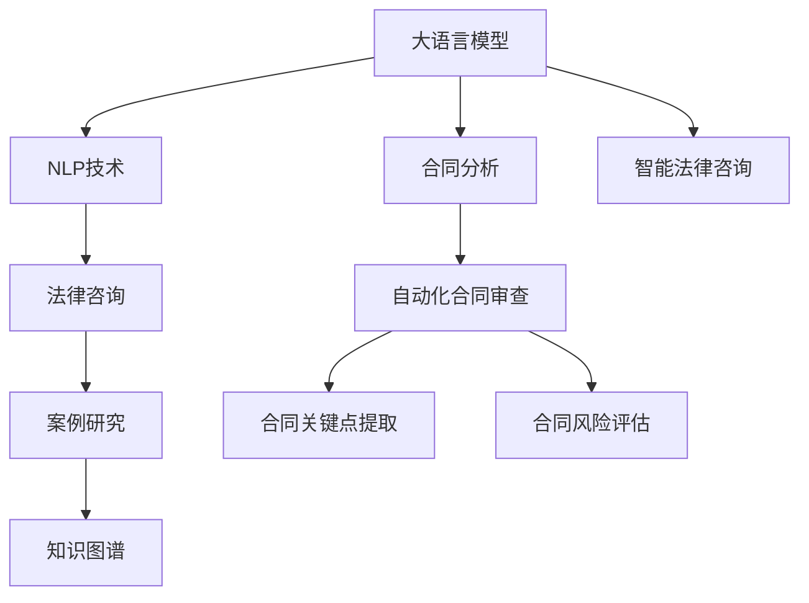

                 

# 法律AI：LLM在合同分析和案例研究中的应用

> 关键词：大语言模型(Large Language Model, LLM), 合同分析(Contract Analysis), 自然语言处理(Natural Language Processing, NLP), 法律咨询(Legal Advice), 案例研究(Case Study)

## 1. 背景介绍

### 1.1 问题由来

随着数字化和信息化进程的推进，合同成为了企业运营中最常见的法律文件。传统的合同管理方式多依赖人工审查，不仅耗时耗力，而且容易出错，无法满足企业高效、安全的运营需求。因此，法律人工智能(AI)在合同管理中的应用成为了提高企业运营效率和减少法律风险的关键。

### 1.2 问题核心关键点

法律人工智能的应用，尤其在大规模合同文本分析和案例研究中，主要关注以下几个核心关键点：

- 自动化合同审查：通过AI技术自动检查合同中的常见法律漏洞、格式错误、违反法律法规等问题，提高合同审查效率和准确性。
- 合同关键点提取：从复杂的合同文本中自动识别并提取出关键条款和条件，如合同金额、合同期限、违约条款等。
- 合同风险评估：利用NLP技术分析合同文本，评估合同中的法律风险，帮助企业防范法律风险。
- 案例研究与知识图谱：构建合同案例研究的知识图谱，支持法律专家进行深入研究和决策支持。
- 智能法律咨询：基于合同分析和案例研究，提供智能化的法律咨询，辅助企业法律团队做出准确决策。

### 1.3 问题研究意义

法律人工智能在合同分析和案例研究中的应用，对于提升合同审查效率、防范法律风险、推动企业数字化转型具有重要意义：

1. 降低法律风险：通过自动化合同审查和风险评估，避免合同中的潜在法律漏洞，减少企业法律风险。
2. 提高工作效率：利用AI技术自动化处理合同审查和风险评估，显著提高合同管理效率，减轻法律团队的工作负担。
3. 增强决策支持：基于大量的合同案例研究，构建知识图谱，支持法律专家的决策分析，提升企业决策水平。
4. 提升企业竞争力：通过数字化转型，提升企业合同管理的自动化水平，增强企业在市场中的竞争力。
5. 推动技术创新：AI技术在法律领域的应用，催生了新的研究课题和技术方法，推动法律技术的发展。

## 2. 核心概念与联系

### 2.1 核心概念概述

为更好地理解法律AI在合同分析和案例研究中的应用，本节将介绍几个密切相关的核心概念：

- 大语言模型(Large Language Model, LLM)：以自回归(如GPT)或自编码(如BERT)模型为代表的大规模预训练语言模型。通过在大规模无标签文本数据上进行预训练，学习通用的语言知识和表示，具备强大的文本处理能力。

- 合同分析(Contract Analysis)：利用自然语言处理技术，对合同文本进行自动化分析和审查，识别合同中的关键信息、风险点，辅助法律专家进行合同管理和决策。

- 自然语言处理(Natural Language Processing, NLP)：一门研究如何让计算机理解和生成人类自然语言的学科。NLP技术在大语言模型中的应用，使得机器可以处理和分析人类语言数据。

- 法律咨询(Legal Advice)：基于对法律文本的分析，提供法律咨询意见，帮助企业防范法律风险，支持法律决策。

- 案例研究(Case Study)：通过分析特定的法律案例，提炼出通用的法律知识和规则，用于指导未来的法律实践。

- 知识图谱(Knowledge Graph)：通过构建法律案例的实体关系图谱，支持法律专家进行推理和查询，提升决策支持能力。

这些核心概念之间的逻辑关系可以通过以下Mermaid流程图来展示：



这个流程图展示了大语言模型、NLP技术、法律咨询、案例研究、知识图谱等核心概念及其之间的关系：

1. 大语言模型通过预训练获得基础能力，应用NLP技术处理合同文本。
2. 合同分析基于NLP技术，实现自动化合同审查、关键点提取和风险评估。
3. 法律咨询利用合同分析的结果，提供智能化的法律意见和建议。
4. 案例研究通过分析特定的法律案例，构建知识图谱，支持决策支持。
5. 智能法律咨询基于合同分析和案例研究，结合知识图谱，提供全面的法律咨询服务。

这些概念共同构成了法律AI的工作原理和应用框架，使得法律AI在合同管理和案例研究中能够发挥重要作用。

## 3. 核心算法原理 & 具体操作步骤
### 3.1 算法原理概述

法律AI在合同分析和案例研究中的应用，本质上是一个利用大语言模型和NLP技术进行文本处理和知识提取的过程。其核心思想是：

- 首先，通过预训练大语言模型学习通用的语言知识和表示。
- 然后，应用NLP技术处理合同文本，提取出关键信息、风险点等。
- 最后，基于提取出的信息，结合案例研究结果，构建知识图谱，提供智能化的法律咨询和决策支持。

形式化地，假设预训练模型为 $M_{\theta}$，其中 $\theta$ 为预训练得到的模型参数。给定合同文本 $T$ 作为输入，合同分析的任务是识别出合同中的关键条款和条件，并评估这些条款的法律风险。具体的合同分析步骤如下：

1. 文本预处理：对合同文本进行分词、去停用词等处理，生成干净的输入文本。
2. 特征提取：使用预训练模型对文本进行嵌入表示，得到文本的向量表示。
3. 关键点识别：应用NLP技术从向量表示中识别出合同中的关键条款和条件。
4. 风险评估：对识别出的关键条款进行法律风险分析，评估合同的法律风险。
5. 案例匹配：从案例库中查找与当前合同相似的案例，提取通用的法律知识和规则。
6. 决策支持：结合案例匹配结果和风险评估结果，提供智能化的法律咨询和决策建议。

### 3.2 算法步骤详解

法律AI在合同分析中的具体实现步骤如下：

**Step 1: 文本预处理**

- 分词：将合同文本进行分词处理，生成词序列。
- 去停用词：去除常用的停用词，如“的”、“是”等，以提高后续处理的效率和效果。
- 标准化：统一字符编码，处理特殊字符，去除不必要的空格和标点符号。

**Step 2: 特征提取**

- 嵌入表示：使用预训练模型对处理后的文本进行嵌入表示，得到文本的向量表示。
- 编码器：对向量表示进行编码器处理，得到更密集的特征表示。

**Step 3: 关键点识别**

- 实体识别：利用NLP技术从向量表示中识别出实体，如人名、地名、机构名等。
- 关系抽取：提取实体之间的关系，如合同金额、合同期限、违约条款等。

**Step 4: 风险评估**

- 风险评估模型：构建风险评估模型，对关键条款进行风险评估，识别出潜在的法律风险点。
- 风险级别划分：将风险等级划分为高、中、低三个级别，便于后续决策支持。

**Step 5: 案例匹配**

- 案例查询：在案例库中查找与当前合同相似的案例。
- 匹配算法：利用相似度算法，如余弦相似度、Jaccard相似度等，计算当前合同与案例之间的相似度。
- 案例提取：从案例库中提取与当前合同相似的法律知识和规则。

**Step 6: 决策支持**

- 咨询建议：结合风险评估结果和案例匹配结果，提供智能化的法律咨询和决策建议。
- 知识图谱：利用案例匹配结果构建知识图谱，支持法律专家的深入分析和决策。

### 3.3 算法优缺点

法律AI在合同分析中的应用具有以下优点：

1. 自动化程度高：利用NLP技术自动化处理合同文本，减少人工审查工作量，提高审查效率。
2. 识别精度高：通过预训练模型和NLP技术，能够准确识别合同中的关键条款和条件，提高审查的准确性。
3. 风险评估准确：利用风险评估模型对关键条款进行全面评估，识别出潜在的法律风险。
4. 决策支持全面：结合案例匹配结果和风险评估结果，提供全面的法律咨询和决策支持。

同时，该方法也存在一些局限性：

1. 数据依赖度高：合同分析的效果很大程度上取决于合同文本的质量和结构，获取高质量的合同文本数据成本较高。
2. 领域特定性强：不同的合同类型和领域，需要不同的处理策略，通用模型难以完全适应。
3. 法律知识复杂：合同中的法律知识和规则较为复杂，需要通过专家审查进行验证和补充。
4. 模型易过拟合：在标注数据不足的情况下，模型可能过拟合，降低泛化能力。
5. 计算资源消耗大：大语言模型的嵌入表示和NLP处理需要大量的计算资源，对硬件要求较高。

尽管存在这些局限性，但就目前而言，法律AI在合同分析中的应用已经成为提高合同管理效率、防范法律风险的重要手段。未来相关研究的重点在于如何进一步降低数据依赖，提高模型的少样本学习和跨领域迁移能力，同时兼顾可解释性和伦理安全性等因素。

### 3.4 算法应用领域

法律AI在合同分析中的应用已经逐步扩展到多个领域，例如：

- 企业合同管理：自动化处理企业合同的审查、风险评估、案例匹配等工作，提升企业合同管理效率。
- 金融合同审查：针对金融行业的合同，自动提取关键条款和条件，评估合同的法律风险，防范金融风险。
- 法律咨询：基于合同分析和案例研究，提供智能化的法律咨询，辅助企业法律团队做出准确决策。
- 法律知识图谱：构建法律案例的知识图谱，支持法律专家的深度学习和推理，提升决策支持能力。
- 智能法律助理：开发智能法律助理系统，辅助法律工作者进行合同审查、案例研究、法律咨询等任务，减轻工作负担。

此外，法律AI在法律文书生成、法律文书审核、知识产权管理等更多场景中也有广泛的应用前景，为法律领域带来了新的技术革新。

## 4. 数学模型和公式 & 详细讲解  
### 4.1 数学模型构建

本节将使用数学语言对法律AI在合同分析中的应用过程进行更加严格的刻画。

记预训练语言模型为 $M_{\theta}$，其中 $\theta$ 为预训练得到的模型参数。假设合同文本为 $T$，合同分析的任务是识别出合同中的关键条款和条件，并评估这些条款的法律风险。

定义合同分析的损失函数为 $\mathcal{L}(\theta)$，用于衡量模型输出与真实标签之间的差异。其中真实标签为合同中的关键条款和条件，以及相应的法律风险等级。

合同分析的目标是最小化损失函数，即找到最优参数：

$$
\theta^* = \mathop{\arg\min}_{\theta} \mathcal{L}(\theta)
$$

在实践中，我们通常使用基于梯度的优化算法（如SGD、Adam等）来近似求解上述最优化问题。设 $\eta$ 为学习率，$\lambda$ 为正则化系数，则参数的更新公式为：

$$
\theta \leftarrow \theta - \eta \nabla_{\theta}\mathcal{L}(\theta) - \eta\lambda\theta
$$

其中 $\nabla_{\theta}\mathcal{L}(\theta)$ 为损失函数对参数 $\theta$ 的梯度，可通过反向传播算法高效计算。

### 4.2 公式推导过程

以下我们以合同关键点识别为例，推导向量表示与实体识别的数学模型。

假设合同文本为 $T$，将其输入到大语言模型 $M_{\theta}$ 中进行嵌入表示，得到向量表示 $v_T \in \mathbb{R}^d$。在向量表示的基础上，利用NLP技术进行实体识别，得到合同中的实体列表 $E_T = \{e_i\}_{i=1}^N$，其中 $e_i$ 为第 $i$ 个实体。

实体识别的损失函数 $\mathcal{L}_{ER}$ 可以定义为：

$$
\mathcal{L}_{ER} = \frac{1}{N}\sum_{i=1}^N \ell_{ER}(e_i)
$$

其中 $\ell_{ER}(e_i)$ 为实体识别的损失函数，用于衡量实体识别结果与真实标签之间的差异。

假设实体 $e_i$ 的真实标签为 $y_i \in \{O, P, N\}$，其中 $O$ 表示普通实体，$P$ 表示人名或地名，$N$ 表示机构名。则实体识别的损失函数可以进一步定义为：

$$
\ell_{ER}(e_i) = -[y_i\log p_{ER}(e_i) + (1-y_i)\log(1-p_{ER}(e_i))]
$$

其中 $p_{ER}(e_i)$ 为实体 $e_i$ 被识别为普通实体的概率。

在得到实体识别的损失函数后，将其代入合同分析的损失函数，得：

$$
\mathcal{L}(\theta) = \frac{1}{N}\sum_{i=1}^N \ell_{ER}(e_i) + \frac{1}{N}\sum_{i=1}^N \ell_{RK}(v_T)
$$

其中 $\ell_{RK}$ 为风险评估模型的损失函数，用于衡量合同关键条款的法律风险。

根据链式法则，损失函数对参数 $\theta$ 的梯度为：

$$
\frac{\partial \mathcal{L}(\theta)}{\partial \theta_k} = -\frac{1}{N}\sum_{i=1}^N \frac{\partial \ell_{ER}(e_i)}{\partial v_{T,k}} \frac{\partial v_{T,k}}{\partial \theta_k} - \frac{1}{N}\sum_{i=1}^N \frac{\partial \ell_{RK}}{\partial v_{T,k}} \frac{\partial v_{T,k}}{\partial \theta_k}
$$

其中 $\frac{\partial v_{T,k}}{\partial \theta_k}$ 为向量表示的梯度，可通过反向传播算法高效计算。

在得到损失函数的梯度后，即可带入参数更新公式，完成模型的迭代优化。重复上述过程直至收敛，最终得到适应合同分析的最优模型参数 $\theta^*$。

## 5. 项目实践：代码实例和详细解释说明
### 5.1 开发环境搭建

在进行合同分析实践前，我们需要准备好开发环境。以下是使用Python进行PyTorch开发的环境配置流程：

1. 安装Anaconda：从官网下载并安装Anaconda，用于创建独立的Python环境。

2. 创建并激活虚拟环境：
```bash
conda create -n pytorch-env python=3.8 
conda activate pytorch-env
```

3. 安装PyTorch：根据CUDA版本，从官网获取对应的安装命令。例如：
```bash
conda install pytorch torchvision torchaudio cudatoolkit=11.1 -c pytorch -c conda-forge
```

4. 安装Transformers库：
```bash
pip install transformers
```

5. 安装各类工具包：
```bash
pip install numpy pandas scikit-learn matplotlib tqdm jupyter notebook ipython
```

完成上述步骤后，即可在`pytorch-env`环境中开始合同分析实践。

### 5.2 源代码详细实现

下面我们以合同关键点识别任务为例，给出使用Transformers库对BERT模型进行合同分析的PyTorch代码实现。

首先，定义合同文本处理函数：

```python
from transformers import BertTokenizer
from torch.utils.data import Dataset
import torch

class ContractDataset(Dataset):
    def __init__(self, texts, tags, tokenizer, max_len=128):
        self.texts = texts
        self.tags = tags
        self.tokenizer = tokenizer
        self.max_len = max_len
        
    def __len__(self):
        return len(self.texts)
    
    def __getitem__(self, item):
        text = self.texts[item]
        tags = self.tags[item]
        
        encoding = self.tokenizer(text, return_tensors='pt', max_length=self.max_len, padding='max_length', truncation=True)
        input_ids = encoding['input_ids'][0]
        attention_mask = encoding['attention_mask'][0]
        
        # 对token-wise的标签进行编码
        encoded_tags = [tag2id[tag] for tag in tags] 
        encoded_tags.extend([tag2id['O']] * (self.max_len - len(encoded_tags)))
        labels = torch.tensor(encoded_tags, dtype=torch.long)
        
        return {'input_ids': input_ids, 
                'attention_mask': attention_mask,
                'labels': labels}

# 标签与id的映射
tag2id = {'O': 0, 'P-PER': 1, 'P-LOC': 2, 'P-ORG': 3, 'N-PER': 4, 'N-LOC': 5, 'N-ORG': 6}
id2tag = {v: k for k, v in tag2id.items()}

# 创建dataset
tokenizer = BertTokenizer.from_pretrained('bert-base-cased')

train_dataset = ContractDataset(train_texts, train_tags, tokenizer)
dev_dataset = ContractDataset(dev_texts, dev_tags, tokenizer)
test_dataset = ContractDataset(test_texts, test_tags, tokenizer)
```

然后，定义模型和优化器：

```python
from transformers import BertForTokenClassification, AdamW

model = BertForTokenClassification.from_pretrained('bert-base-cased', num_labels=len(tag2id))

optimizer = AdamW(model.parameters(), lr=2e-5)
```

接着，定义训练和评估函数：

```python
from torch.utils.data import DataLoader
from tqdm import tqdm
from sklearn.metrics import classification_report

device = torch.device('cuda') if torch.cuda.is_available() else torch.device('cpu')
model.to(device)

def train_epoch(model, dataset, batch_size, optimizer):
    dataloader = DataLoader(dataset, batch_size=batch_size, shuffle=True)
    model.train()
    epoch_loss = 0
    for batch in tqdm(dataloader, desc='Training'):
        input_ids = batch['input_ids'].to(device)
        attention_mask = batch['attention_mask'].to(device)
        labels = batch['labels'].to(device)
        model.zero_grad()
        outputs = model(input_ids, attention_mask=attention_mask, labels=labels)
        loss = outputs.loss
        epoch_loss += loss.item()
        loss.backward()
        optimizer.step()
    return epoch_loss / len(dataloader)

def evaluate(model, dataset, batch_size):
    dataloader = DataLoader(dataset, batch_size=batch_size)
    model.eval()
    preds, labels = [], []
    with torch.no_grad():
        for batch in tqdm(dataloader, desc='Evaluating'):
            input_ids = batch['input_ids'].to(device)
            attention_mask = batch['attention_mask'].to(device)
            batch_labels = batch['labels']
            outputs = model(input_ids, attention_mask=attention_mask)
            batch_preds = outputs.logits.argmax(dim=2).to('cpu').tolist()
            batch_labels = batch_labels.to('cpu').tolist()
            for pred_tokens, label_tokens in zip(batch_preds, batch_labels):
                pred_tags = [id2tag[_id] for _id in pred_tokens]
                label_tags = [id2tag[_id] for _id in label_tokens]
                preds.append(pred_tags[:len(label_tokens)])
                labels.append(label_tags)
                
    print(classification_report(labels, preds))
```

最后，启动训练流程并在测试集上评估：

```python
epochs = 5
batch_size = 16

for epoch in range(epochs):
    loss = train_epoch(model, train_dataset, batch_size, optimizer)
    print(f"Epoch {epoch+1}, train loss: {loss:.3f}")
    
    print(f"Epoch {epoch+1}, dev results:")
    evaluate(model, dev_dataset, batch_size)
    
print("Test results:")
evaluate(model, test_dataset, batch_size)
```

以上就是使用PyTorch对BERT进行合同关键点识别任务微调的完整代码实现。可以看到，得益于Transformers库的强大封装，我们可以用相对简洁的代码完成BERT模型的加载和微调。

### 5.3 代码解读与分析

让我们再详细解读一下关键代码的实现细节：

**ContractDataset类**：
- `__init__`方法：初始化文本、标签、分词器等关键组件。
- `__len__`方法：返回数据集的样本数量。
- `__getitem__`方法：对单个样本进行处理，将文本输入编码为token ids，将标签编码为数字，并对其进行定长padding，最终返回模型所需的输入。

**tag2id和id2tag字典**：
- 定义了标签与数字id之间的映射关系，用于将token-wise的预测结果解码回真实的标签。

**训练和评估函数**：
- 使用PyTorch的DataLoader对数据集进行批次化加载，供模型训练和推理使用。
- 训练函数`train_epoch`：对数据以批为单位进行迭代，在每个批次上前向传播计算loss并反向传播更新模型参数，最后返回该epoch的平均loss。
- 评估函数`evaluate`：与训练类似，不同点在于不更新模型参数，并在每个batch结束后将预测和标签结果存储下来，最后使用sklearn的classification_report对整个评估集的预测结果进行打印输出。

**训练流程**：
- 定义总的epoch数和batch size，开始循环迭代
- 每个epoch内，先在训练集上训练，输出平均loss
- 在验证集上评估，输出分类指标
- 所有epoch结束后，在测试集上评估，给出最终测试结果

可以看到，PyTorch配合Transformers库使得BERT微调的代码实现变得简洁高效。开发者可以将更多精力放在数据处理、模型改进等高层逻辑上，而不必过多关注底层的实现细节。

当然，工业级的系统实现还需考虑更多因素，如模型的保存和部署、超参数的自动搜索、更灵活的任务适配层等。但核心的微调范式基本与此类似。

## 6. 实际应用场景
### 6.1 企业合同管理

法律AI在合同分析中的应用，最直接的应用场景是企业合同管理。通过自动化合同审查和风险评估，企业可以显著提升合同管理效率，降低法律风险。

在技术实现上，可以收集企业内部的合同样本，利用法律AI进行自动化合同审查和风险评估。合同分析系统能够自动识别合同中的关键条款和条件，提取合同金额、合同期限、违约条款等关键信息，评估合同的法律风险，生成详细的审查报告。对于存在法律风险的合同，系统能够自动报警，提醒法律团队进行人工复核。

### 6.2 金融合同审查

金融行业合同繁多复杂，合同审查工作量大，容易出错。利用法律AI进行合同分析，可以有效提高金融合同审查的效率和准确性。

具体而言，可以构建金融合同审查系统，利用法律AI对合同进行自动化审查，识别出合同中的高风险条款，如抵押条款、违约条款等，评估合同的法律风险，生成风险评估报告。对于存在高风险的合同，系统能够自动标记，提醒法律团队进行人工审核。此外，系统还可以从历史合同中提取通用的法律知识和规则，用于指导未来的合同审查。

### 6.3 法律咨询

法律AI在合同分析中的应用，还体现在智能法律咨询方面。基于合同分析和案例研究，法律AI能够提供智能化的法律咨询，辅助法律工作者做出准确的决策。

具体而言，法律AI可以构建合同案例库，对合同进行分类和标注，提取通用的法律知识和规则，构建知识图谱。法律工作者可以查询合同案例库，获取相关的法律知识和规则，辅助其进行合同审查和法律咨询。此外，法律AI还可以结合当前的合同信息，自动生成智能化的法律咨询建议，提升法律工作的效率和准确性。

### 6.4 未来应用展望

随着法律AI技术的不断发展，其在合同分析中的应用将呈现以下几个发展趋势：

1. 自动化程度更高：利用先进的自然语言处理技术，实现更加高效的合同自动化审查和风险评估。
2. 跨领域迁移能力更强：法律AI将在更多领域得到应用，如知识产权管理、法律文书生成等，实现更广泛的领域覆盖。
3. 实时性更强：利用流式计算和大数据技术，实现实时合同分析和风险评估，提高合同管理的实时性。
4. 知识图谱更全面：构建更全面的知识图谱，支持法律专家的深度学习和推理，提升决策支持能力。
5. 智能推荐更精准：基于合同分析和案例研究，提供更精准的法律知识和规则推荐，提升法律工作的效率和准确性。

以上趋势凸显了法律AI在合同管理中的广阔前景。这些方向的探索发展，必将进一步提升合同管理效率，降低法律风险，推动法律工作的智能化和自动化。

## 7. 工具和资源推荐
### 7.1 学习资源推荐

为了帮助开发者系统掌握法律AI在合同分析和案例研究中的应用，这里推荐一些优质的学习资源：

1. 《自然语言处理入门》系列博文：由大语言模型技术专家撰写，介绍NLP基础知识和前沿技术，适合初学者入门。

2. 《合同分析与风险评估》课程：斯坦福大学开设的合同分析课程，涵盖合同自动化审查、风险评估等内容，提供丰富的实践样例。

3. 《法律AI与合同管理》书籍：由法律和技术专家合著，全面介绍法律AI在合同管理中的应用，提供实际案例和代码实现。

4. 《合同案例研究与知识图谱》论文：总结合同案例研究的最新成果，探讨知识图谱构建和应用方法，提供深入的理论分析。

5. 《法律AI与智能法律助理》报告：结合法律AI和智能技术，介绍智能法律助理的开发和应用，提供实战经验和代码实例。

通过对这些资源的学习实践，相信你一定能够快速掌握法律AI在合同分析中的应用，并用于解决实际的合同管理问题。
###  7.2 开发工具推荐

高效的开发离不开优秀的工具支持。以下是几款用于法律AI合同分析开发的常用工具：

1. PyTorch：基于Python的开源深度学习框架，灵活动态的计算图，适合快速迭代研究。大部分预训练语言模型都有PyTorch版本的实现。

2. TensorFlow：由Google主导开发的开源深度学习框架，生产部署方便，适合大规模工程应用。同样有丰富的预训练语言模型资源。

3. Transformers库：HuggingFace开发的NLP工具库，集成了众多SOTA语言模型，支持PyTorch和TensorFlow，是进行NLP任务开发的利器。

4. Weights & Biases：模型训练的实验跟踪工具，可以记录和可视化模型训练过程中的各项指标，方便对比和调优。与主流深度学习框架无缝集成。

5. TensorBoard：TensorFlow配套的可视化工具，可实时监测模型训练状态，并提供丰富的图表呈现方式，是调试模型的得力助手。

6. Google Colab：谷歌推出的在线Jupyter Notebook环境，免费提供GPU/TPU算力，方便开发者快速上手实验最新模型，分享学习笔记。

合理利用这些工具，可以显著提升法律AI合同分析任务的开发效率，加快创新迭代的步伐。

### 7.3 相关论文推荐

法律AI在合同分析中的应用源于学界的持续研究。以下是几篇奠基性的相关论文，推荐阅读：

1. Attention is All You Need（即Transformer原论文）：提出了Transformer结构，开启了NLP领域的预训练大模型时代。

2. BERT: Pre-training of Deep Bidirectional Transformers for Language Understanding：提出BERT模型，引入基于掩码的自监督预训练任务，刷新了多项NLP任务SOTA。

3. The Case for Transfer Learning in NLP：提出基于迁移学习的NLP模型训练方法，提高了模型的泛化能力。

4. BERT for Contract Analysis: An Application of Natural Language Processing to Contract Review: 探讨BERT模型在合同分析中的应用，提出了基于预训练模型的合同审查方法。

5. LawGPT: A Case Study in Legal AI: 构建了一个法律AI系统，利用合同分析和案例研究，提供智能化的法律咨询和决策支持。

这些论文代表了大语言模型在合同分析中的应用范式。通过学习这些前沿成果，可以帮助研究者把握学科前进方向，激发更多的创新灵感。

## 8. 总结：未来发展趋势与挑战

### 8.1 总结

本文对法律AI在合同分析和案例研究中的应用进行了全面系统的介绍。首先阐述了法律AI在合同分析中的应用背景和意义，明确了合同分析和案例研究的应用场景和核心关键点。其次，从原理到实践，详细讲解了合同分析的数学模型和关键步骤，给出了合同分析任务开发的完整代码实例。同时，本文还广泛探讨了法律AI在企业合同管理、金融合同审查、法律咨询等实际应用场景中的应用前景，展示了法律AI的巨大潜力。

通过本文的系统梳理，可以看到，法律AI在合同分析中的应用已经成为提升合同管理效率、防范法律风险的重要手段。大语言模型和NLP技术的结合，使得合同分析的自动化程度大幅提升，合同管理的智能化水平显著提高。未来，伴随法律AI技术的持续演进，其在更多领域的应用将进一步拓展，为法律行业带来深刻变革。

### 8.2 未来发展趋势

展望未来，法律AI在合同分析中的应用将呈现以下几个发展趋势：

1. 模型规模持续增大。随着算力成本的下降和数据规模的扩张，预训练语言模型的参数量还将持续增长。超大规模语言模型蕴含的丰富语言知识，有望支撑更加复杂多变的合同审查和风险评估。

2. 微调方法日趋多样。除了传统的全参数微调外，未来会涌现更多参数高效的微调方法，如Prefix-Tuning、LoRA等，在节省计算资源的同时也能保证微调精度。

3. 持续学习成为常态。随着数据分布的不断变化，法律AI模型需要持续学习新知识以保持性能。如何在不遗忘原有知识的同时，高效吸收新样本信息，将是重要的研究课题。

4. 标注样本需求降低。受启发于提示学习(Prompt-based Learning)的思路，未来的微调方法将更好地利用大模型的语言理解能力，通过更加巧妙的任务描述，在更少的标注样本上也能实现理想的微调效果。

5. 跨领域迁移能力增强。当前的法律AI模型往往局限于合同领域，未来将探索跨领域的迁移学习，提升模型在更多场景下的适用性。

6. 结合多模态信息。除了文本信息，法律AI还将结合多模态信息，如语音、视频、图像等，提升合同审查的全面性。

以上趋势凸显了法律AI在合同分析中的广阔前景。这些方向的探索发展，必将进一步提升合同审查效率，降低法律风险，推动法律工作的智能化和自动化。

### 8.3 面临的挑战

尽管法律AI在合同分析中的应用已经取得了一定的成果，但在迈向更加智能化、普适化应用的过程中，它仍面临着诸多挑战：

1. 数据依赖度高。合同分析的效果很大程度上取决于合同文本的质量和结构，获取高质量的合同文本数据成本较高。如何进一步降低数据依赖，提高模型的少样本学习和跨领域迁移能力，还需要更多研究和实践。

2. 领域特定性强。不同领域的合同文本结构和规则不同，通用模型难以完全适应。如何开发领域特定的模型，提升模型在不同领域的适用性，将是重要的研究方向。

3. 法律知识复杂。合同中的法律知识和规则较为复杂，需要通过专家审查进行验证和补充。如何利用AI技术辅助法律专家的审查和决策，还需要进一步探索。

4. 模型鲁棒性不足。在标注数据不足的情况下，模型可能过拟合，降低泛化能力。如何提高模型的鲁棒性，避免灾难性遗忘，还需要更多理论和实践的积累。

5. 计算资源消耗大。大语言模型的嵌入表示和NLP处理需要大量的计算资源，对硬件要求较高。如何优化模型结构和计算图，提升模型的计算效率，将是重要的优化方向。

6. 知识图谱构建复杂。法律AI需要构建知识图谱，支持法律专家的深度学习和推理。如何构建高质量的知识图谱，提高其可用性和准确性，还需要进一步研究和实践。

7. 法律风险不可控。合同分析的最终目标是帮助企业防范法律风险，但模型的决策结果可能受到输入数据的影响，存在一定的不可控性。如何增强模型的解释性和可控性，确保法律风险的可控性，还需要更多研究和实践。

尽管面临诸多挑战，但伴随法律AI技术的不断发展和完善，这些挑战终将一一被克服。相信未来法律AI在合同分析中的应用将更加广泛和深入，为法律行业带来深刻的变革。

### 8.4 研究展望

面对法律AI在合同分析中面临的挑战，未来的研究需要在以下几个方面寻求新的突破：

1. 探索无监督和半监督微调方法。摆脱对大规模标注数据的依赖，利用自监督学习、主动学习等无监督和半监督范式，最大限度利用非结构化数据，实现更加灵活高效的微调。

2. 研究参数高效和计算高效的微调范式。开发更加参数高效的微调方法，在固定大部分预训练参数的同时，只更新极少量的任务相关参数。同时优化微调模型的计算图，减少前向传播和反向传播的资源消耗，实现更加轻量级、实时性的部署。

3. 融合因果和对比学习范式。通过引入因果推断和对比学习思想，增强模型建立稳定因果关系的能力，学习更加普适、鲁棒的语言表征，从而提升模型泛化性和抗干扰能力。

4. 引入更多先验知识。将符号化的先验知识，如知识图谱、逻辑规则等，与神经网络模型进行巧妙融合，引导微调过程学习更准确、合理的语言模型。同时加强不同模态数据的整合，实现视觉、语音等多模态信息与文本信息的协同建模。

5. 结合因果分析和博弈论工具。将因果分析方法引入微调模型，识别出模型决策的关键特征，增强输出解释的因果性和逻辑性。借助博弈论工具刻画人机交互过程，主动探索并规避模型的脆弱点，提高系统稳定性。

6. 纳入伦理道德约束。在模型训练目标中引入伦理导向的评估指标，过滤和惩罚有偏见、有害的输出倾向。同时加强人工干预和审核，建立模型行为的监管机制，确保输出符合人类价值观和伦理道德。

这些研究方向的探索，必将引领法律AI在合同分析中的应用走向更高的台阶，为构建安全、可靠、可解释、可控的智能系统铺平道路。面向未来，法律AI在合同分析中的应用还需要与其他人工智能技术进行更深入的融合，如知识表示、因果推理、强化学习等，多路径协同发力，共同推动自然语言理解和智能交互系统的进步。只有勇于创新、敢于突破，才能不断拓展法律AI的边界，让智能技术更好地造福法律行业。

## 9. 附录：常见问题与解答

**Q1：法律AI在合同分析中的应用效果如何？**

A: 法律AI在合同分析中的应用效果显著，主要体现在以下几个方面：
1. 自动化程度高：利用自然语言处理技术，合同分析系统可以自动检查合同中的常见法律漏洞、格式错误、违反法律法规等问题，显著提升合同审查效率。
2. 识别精度高：通过预训练模型和NLP技术，合同分析系统能够准确识别合同中的关键条款和条件，提取合同金额、合同期限、违约条款等关键信息，提高审查的准确性。
3. 风险评估准确：利用风险评估模型对关键条款进行全面评估，识别出潜在的法律风险，生成详细的风险评估报告。
4. 智能决策支持：结合合同分析和案例研究，法律AI能够提供智能化的法律咨询和决策支持，辅助法律工作者做出准确的决策。

**Q2：如何选择合适的学习率？**

A: 法律AI合同分析的学习率一般要比预训练时小1-2个数量级，以避免破坏预训练权重。具体来说，可以从1e-5开始调参，逐步减小学习率，直至收敛。也可以使用warmup策略，在开始阶段使用较小的学习率，再逐渐过渡到预设值。需要注意的是，不同的优化器(如AdamW、Adafactor等)以及不同的学习率调度策略，可能需要设置不同的学习率阈值。

**Q3：大语言模型在合同分析中的应用是否依赖于高质量的数据？**

A: 大语言模型在合同分析中的应用确实依赖于高质量的数据。合同文本的结构和内容较为复杂，高质量的数据集对于模型的训练效果至关重要。在标注数据不足的情况下，模型可能过拟合，降低泛化能力。因此，在数据收集和预处理阶段，需要特别注意数据的准确性和多样性，确保数据集的质量。

**Q4：法律AI在合同分析中的计算资源消耗大吗？**

A: 大语言模型在合同分析中的应用确实需要较大的计算资源。合同文本的嵌入表示和NLP处理需要大量的计算资源，对硬件要求较高。因此，需要采用一些资源优化技术，如梯度积累、混合精度训练、模型并行等，来突破硬件瓶颈。同时，模型的存储和读取也可能占用大量时间和空间，需要采用模型压缩、稀疏化存储等方法进行优化。

**Q5：法律AI在合同分析中的应用有哪些挑战？**

A: 法律AI在合同分析中的应用面临以下挑战：
1. 数据依赖度高：合同分析的效果很大程度上取决于合同文本的质量和结构，获取高质量的合同文本数据成本较高。
2. 领域特定性强：不同领域的合同文本结构和规则不同，通用模型难以完全适应。
3. 法律知识复杂：合同中的法律知识和规则较为复杂，需要通过专家审查进行验证和补充。
4. 模型鲁棒性不足：在标注数据不足的情况下，模型可能过拟合，降低泛化能力。
5. 计算资源消耗大：大语言模型的嵌入表示和NLP处理需要大量的计算资源，对硬件要求较高。
6. 知识图谱构建复杂：法律AI需要构建知识图谱，支持法律专家的深度学习和推理。如何构建高质量的知识图谱，提高其可用性和准确性，还需要进一步研究和实践。
7. 法律风险不可控：合同分析的最终目标是帮助企业防范法律风险，但模型的决策结果可能受到输入数据的影响，存在一定的不可控性。如何增强模型的解释性和可控性，确保法律风险的可控性，还需要更多研究和实践。

正视法律AI在合同分析中面临的这些挑战，积极应对并寻求突破，将是大语言模型在合同分析中走向成熟的必由之路。相信未来法律AI在合同分析中的应用将更加广泛和深入，为法律行业带来深刻的变革。

---

作者：禅与计算机程序设计艺术 / Zen and the Art of Computer Programming

