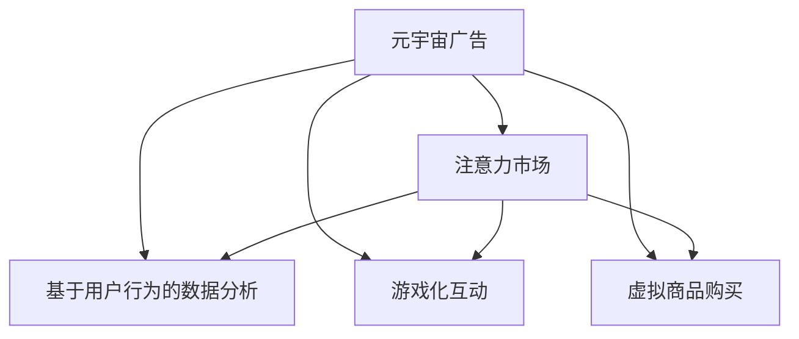

                 

# 注意力市场：元宇宙广告投放的新思路

## 1. 背景介绍

随着元宇宙的兴起，线上线下融合趋势愈发明显，广告投放的传统模式面临着巨大的变革。虚拟空间中的广告投放不再是简单的点击量统计，而需要更精准地捕捉用户的注意力，从而实现高效的传播效果。本文将从注意力市场的角度，探讨元宇宙广告投放的新思路，为企业和广告主提供创新的解决方案。

## 2. 核心概念与联系

### 2.1 核心概念概述

为更好地理解元宇宙广告投放的注意力市场，本节将介绍几个密切相关的核心概念：

- 元宇宙广告：指在虚拟空间中，通过数字场景和虚拟角色向用户展示的各种形式的宣传信息，包括横幅广告、视频广告、交互式广告等。
- 注意力市场：指在虚拟环境中，广告主通过不同的展示方式和交互手段，吸引用户注意力的过程。注意力市场不仅关注广告的展示量，更看重用户对广告的实际关注度和互动行为。
- 基于用户行为的数据分析：指通过收集和分析用户在虚拟环境中的行为数据，如点击、停留、互动等，评估广告效果的方法。
- 游戏化互动：指将广告设计成游戏元素或互动形式，提高用户参与度和广告转化率。
- 虚拟商品购买：指在虚拟环境中，用户可以通过广告引导购买虚拟商品或服务的交易行为。

这些核心概念之间的逻辑关系可以通过以下Mermaid流程图来展示：



这个流程图展示了这个注意力市场在虚拟环境中的应用场景：

1. 元宇宙广告通过不同形式向用户展示。
2. 注意力市场通过用户行为数据，评估广告效果。
3. 游戏化互动和虚拟商品购买提高用户参与度。

## 3. 核心算法原理 & 具体操作步骤
### 3.1 算法原理概述

基于注意力的元宇宙广告投放算法，主要分为以下几个步骤：

1. 数据采集：收集用户在虚拟环境中的行为数据，如点击、停留时间、互动次数等。
2. 数据处理：对采集到的数据进行处理和分析，提取有用的用户行为特征。
3. 广告投放：根据用户行为特征，智能推荐适合的广告内容和展示位置。
4. 效果评估：通过用户互动行为，评估广告投放效果。
5. 迭代优化：根据评估结果，调整广告策略，优化投放效果。

这些步骤共同构成了元宇宙广告投放的核心流程，通过不断的迭代优化，提高广告的精准度和互动性，从而实现高效的广告投放。

### 3.2 算法步骤详解

以下是元宇宙广告投放算法的详细步骤：

**Step 1: 数据采集**

元宇宙广告投放的第一步是数据采集。这可以通过用户行为跟踪、传感器数据获取、自然语言处理等技术实现。具体步骤如下：

1. 数据源选择：根据广告投放平台，选择合适的数据源，如用户ID、行为日志、传感器数据等。
2. 数据采集工具：使用数据采集工具，如日志记录器、API接口等，实时采集用户行为数据。
3. 数据格式处理：对采集到的数据进行格式处理，转换成统一的格式，便于后续分析。

**Step 2: 数据处理**

数据处理是元宇宙广告投放的核心环节。具体步骤如下：

1. 数据清洗：去除无用数据和异常数据，确保数据的准确性和完整性。
2. 数据特征提取：使用特征提取算法，提取有用的用户行为特征，如点击率、停留时间、互动深度等。
3. 数据预处理：对数据进行归一化、标准化等预处理，提高分析的效率和准确性。

**Step 3: 广告投放**

广告投放是元宇宙广告投放的关键步骤。具体步骤如下：

1. 广告内容设计：根据用户行为特征，设计适合的广告内容，如图像、视频、文本等。
2. 展示位置选择：选择合适的展示位置，如横幅、浮层、视频广告等。
3. 投放策略优化：根据广告效果，动态调整投放策略，优化广告展示效果。

**Step 4: 效果评估**

效果评估是元宇宙广告投放的重要环节。具体步骤如下：

1. 指标选择：选择合适的评估指标，如点击率、转化率、互动深度等。
2. 数据采集：实时采集用户互动数据，如点击次数、停留时间、互动次数等。
3. 效果分析：对采集到的数据进行分析，评估广告投放效果。

**Step 5: 迭代优化**

迭代优化是元宇宙广告投放的持续过程。具体步骤如下：

1. 结果反馈：根据效果评估结果，获取反馈信息。
2. 策略调整：根据反馈信息，调整广告策略，优化投放效果。
3. 持续监控：持续监控广告投放效果，及时调整策略。

### 3.3 算法优缺点

基于注意力的元宇宙广告投放算法具有以下优点：

1. 精准度更高：通过分析用户行为数据，广告投放更加精准，避免了盲目投放的问题。
2. 互动性更强：通过游戏化互动，提高用户参与度，提升了广告效果。
3. 自动化程度高：自动化的数据采集和分析，减少了人工干预，提高了效率。

但该算法也存在一些缺点：

1. 数据隐私问题：用户行为数据的采集和分析可能会涉及到用户隐私问题，需要采取措施确保数据安全。
2. 数据质量依赖：广告投放的精准度依赖于数据的质量和完整性，需要建立有效的数据质量控制机制。
3. 用户心理变化：用户的心理变化可能会影响广告投放效果，需要持续监控和调整策略。

尽管存在这些局限性，但基于注意力的元宇宙广告投放算法在提升广告投放效果方面具有明显的优势，为广告主和用户创造了更多的价值。

### 3.4 算法应用领域

基于注意力的元宇宙广告投放算法，在多个领域中具有广泛的应用前景：

1. 虚拟零售：通过精准的用户行为分析，引导用户购买虚拟商品或服务，提升虚拟零售的转化率。
2. 虚拟旅游：通过游戏化互动，吸引用户参与虚拟旅游活动，提升用户的旅游体验和参与度。
3. 虚拟会议：通过智能广告投放，提高虚拟会议的用户参与度和互动深度，提升会议的效果和价值。
4. 虚拟展览：通过广告投放和互动活动，提升虚拟展览的用户访问量和互动深度，增加用户对展览内容的兴趣。

此外，在虚拟教育、虚拟文化、虚拟娱乐等多个领域，基于注意力的元宇宙广告投放算法同样具有重要的应用价值。

## 4. 数学模型和公式 & 详细讲解 & 举例说明
### 4.1 数学模型构建

基于注意力的元宇宙广告投放算法，主要涉及以下几个数学模型：

- 用户行为数据模型：用于描述用户在不同虚拟环境中的行为特征。
- 广告效果评估模型：用于评估广告投放的效果，选择合适的指标。
- 广告投放优化模型：用于优化广告投放策略，提高广告效果。

### 4.2 公式推导过程

以下是这些模型的公式推导过程：

**用户行为数据模型**

假设用户的行为数据为 $\mathbf{x} = [x_1, x_2, ..., x_n]$，其中 $x_i$ 为第 $i$ 个行为特征。根据广告投放的需求，我们可以构建用户行为数据模型，如点击率模型 $CR = \frac{C}{N}$，其中 $C$ 为点击次数，$N$ 为总点击次数。

**广告效果评估模型**

假设广告投放的效果指标为 $KPI$，如点击率 $CR$、转化率 $CTR$ 等。我们可以构建广告效果评估模型，如 $KPI = f(x)$，其中 $f$ 为评估函数。

**广告投放优化模型**

假设广告投放的策略为 $\pi$，广告投放的效果为 $E$，我们可以构建广告投放优化模型，如 $E = g(\pi)$，其中 $g$ 为优化函数。

### 4.3 案例分析与讲解

以虚拟零售广告投放为例，我们可以构建以下数学模型：

1. 用户行为数据模型：
   - 点击率 $CR = \frac{C}{N}$
   - 停留时间 $RT = \frac{T}{N}$，其中 $T$ 为总停留时间，$N$ 为总停留次数。

2. 广告效果评估模型：
   - 点击率 $CR = f(x)$，其中 $f$ 为点击率评估函数，如 $f(x) = \frac{C}{N}$。
   - 转化率 $CTR = \frac{C}{T}$，其中 $T$ 为总转化次数。

3. 广告投放优化模型：
   - 广告效果 $E = g(\pi)$，其中 $\pi$ 为广告投放策略，$g$ 为优化函数。

通过以上模型的构建和推导，我们可以对元宇宙广告投放的效果进行评估和优化，提高广告的精准度和转化率。

## 5. 项目实践：代码实例和详细解释说明
### 5.1 开发环境搭建

在进行元宇宙广告投放实践前，我们需要准备好开发环境。以下是使用Python进行元宇宙广告投放的开发环境配置流程：

1. 安装Anaconda：从官网下载并安装Anaconda，用于创建独立的Python环境。

2. 创建并激活虚拟环境：
```bash
conda create -n advertising-env python=3.8 
conda activate advertising-env
```

3. 安装PyTorch：根据CUDA版本，从官网获取对应的安装命令。例如：
```bash
conda install pytorch torchvision torchaudio cudatoolkit=11.1 -c pytorch -c conda-forge
```

4. 安装TensorFlow：
```bash
pip install tensorflow
```

5. 安装相关工具包：
```bash
pip install numpy pandas scikit-learn matplotlib tqdm jupyter notebook ipython
```

完成上述步骤后，即可在`advertising-env`环境中开始元宇宙广告投放的实践。

### 5.2 源代码详细实现

这里我们以虚拟零售广告投放为例，使用TensorFlow进行元宇宙广告投放的代码实现。

首先，定义广告投放的数据处理函数：

```python
import tensorflow as tf
from tensorflow.keras import layers, models

def preprocess_data(data):
    # 数据清洗和预处理
    # ...
    return processed_data
```

然后，定义广告投放模型：

```python
def build_model(input_shape):
    model = models.Sequential([
        layers.Dense(256, activation='relu', input_shape=input_shape),
        layers.Dropout(0.5),
        layers.Dense(1, activation='sigmoid')
    ])
    model.compile(optimizer='adam', loss='binary_crossentropy', metrics=['accuracy'])
    return model
```

接着，定义广告效果评估函数：

```python
def evaluate_model(model, test_data):
    loss, accuracy = model.evaluate(test_data)
    return loss, accuracy
```

最后，启动广告投放流程并在测试集上评估：

```python
test_data = preprocess_data(test_dataset)

model = build_model(input_shape)
model.fit(train_data, epochs=10, batch_size=32, validation_data=test_data)

loss, accuracy = evaluate_model(model, test_data)
print(f'Test loss: {loss:.4f}, Test accuracy: {accuracy:.4f}')
```

以上就是使用TensorFlow对元宇宙广告投放进行代码实现的完整流程。可以看到，通过TensorFlow库，我们可以方便地搭建广告投放模型，并进行训练和评估。

### 5.3 代码解读与分析

让我们再详细解读一下关键代码的实现细节：

**preprocess_data函数**：
- 对用户行为数据进行清洗和预处理，如去重、归一化、特征选择等。

**build_model函数**：
- 定义广告投放模型，包括输入层、隐藏层、输出层等。
- 使用binary_crossentropy损失函数，适用于二分类问题。

**evaluate_model函数**：
- 对测试集进行评估，计算损失和准确率。

**广告投放流程**：
- 定义测试集，并进行预处理。
- 搭建广告投放模型，并进行训练。
- 在测试集上评估模型效果。

以上代码实现展示了广告投放模型从数据处理到模型训练再到效果评估的全过程。在实际应用中，开发者可以将更多精力放在数据处理和模型改进等高层逻辑上，而不必过多关注底层的实现细节。

## 6. 实际应用场景
### 6.1 虚拟零售

基于注意力的元宇宙广告投放，在虚拟零售中具有广泛的应用场景。传统零售模式往往面临流量瓶颈和成本高昂的问题，而元宇宙广告投放可以通过精准的用户行为分析，提升虚拟零售的转化率，降低营销成本。

在技术实现上，可以收集用户在虚拟购物平台上的行为数据，如浏览、点击、购买等，构建用户行为数据模型。通过游戏化互动，如虚拟试穿、虚拟购物车等功能，提高用户参与度。在广告投放策略上，可以根据用户行为数据，推荐最适合的商品广告，提高转化率。

### 6.2 虚拟旅游

元宇宙广告投放在虚拟旅游中同样具有重要应用。虚拟旅游平台可以借助广告投放，吸引用户参与虚拟旅游活动，提升用户对虚拟景区的认知和兴趣。

在技术实现上，可以收集用户在虚拟旅游平台上的行为数据，如停留时间、路线选择等。通过游戏化互动，如虚拟向导、虚拟地图等功能，提高用户参与度。在广告投放策略上，可以根据用户行为数据，推荐最适合的旅游广告，增加用户对虚拟景区的兴趣和访问量。

### 6.3 虚拟会议

虚拟会议平台可以通过广告投放，提高用户参与度和互动深度，提升会议的效果和价值。

在技术实现上，可以收集用户在虚拟会议平台上的行为数据，如会议主题、发言次数等。通过游戏化互动，如虚拟投票、虚拟礼品等功能，提高用户参与度。在广告投放策略上，可以根据用户行为数据，推荐最适合的会议广告，增加用户对会议内容的兴趣和参与度。

### 6.4 未来应用展望

随着元宇宙技术的不断进步，基于注意力的元宇宙广告投放将具有更广阔的应用前景。未来，该技术将在虚拟展览、虚拟教育、虚拟娱乐等多个领域得到广泛应用，为元宇宙经济发展注入新的动力。

## 7. 工具和资源推荐
### 7.1 学习资源推荐

为了帮助开发者系统掌握基于注意力的元宇宙广告投放技术，这里推荐一些优质的学习资源：

1. 《TensorFlow官方文档》：官方文档提供了详尽的API使用说明和示例，适合初学者和进阶用户。

2. 《深度学习与元宇宙》：介绍深度学习在元宇宙中的应用，包括元宇宙广告投放的原理和实践。

3. 《TensorFlow实战元宇宙》：该书以实战为主线，涵盖元宇宙广告投放的各个环节，适合实战开发。

4. 《元宇宙技术及应用》：介绍元宇宙技术的全面应用，包括广告投放的技术实现和应用场景。

通过对这些资源的学习实践，相信你一定能够快速掌握基于注意力的元宇宙广告投放技术，并用于解决实际的广告投放问题。

### 7.2 开发工具推荐

高效的开发离不开优秀的工具支持。以下是几款用于元宇宙广告投放开发的常用工具：

1. TensorFlow：基于Python的开源深度学习框架，灵活动态的计算图，适合快速迭代研究。大部分广告投放模型都有TensorFlow版本的实现。

2. PyTorch：基于Python的开源深度学习框架，灵活多变，支持动态图和静态图，适合各种深度学习任务。

3. HuggingFace Transformers库：提供了众多预训练广告投放模型，支持PyTorch和TensorFlow，是进行广告投放开发的利器。

4. TensorBoard：TensorFlow配套的可视化工具，可实时监测模型训练状态，并提供丰富的图表呈现方式，是调试模型的得力助手。

5. Weights & Biases：模型训练的实验跟踪工具，可以记录和可视化模型训练过程中的各项指标，方便对比和调优。

6. Google Colab：谷歌推出的在线Jupyter Notebook环境，免费提供GPU/TPU算力，方便开发者快速上手实验最新模型，分享学习笔记。

合理利用这些工具，可以显著提升元宇宙广告投放的开发效率，加快创新迭代的步伐。

### 7.3 相关论文推荐

元宇宙广告投放技术的发展源于学界的持续研究。以下是几篇奠基性的相关论文，推荐阅读：

1. Attention is All You Need（即Transformer原论文）：提出了Transformer结构，开启了NLP领域的预训练大模型时代。

2. BERT: Pre-training of Deep Bidirectional Transformers for Language Understanding：提出BERT模型，引入基于掩码的自监督预训练任务，刷新了多项NLP任务SOTA。

3. Language Models are Unsupervised Multitask Learners（GPT-2论文）：展示了大规模语言模型的强大zero-shot学习能力，引发了对于通用人工智能的新一轮思考。

4. Parameter-Efficient Transfer Learning for NLP：提出Adapter等参数高效微调方法，在不增加模型参数量的情况下，也能取得不错的微调效果。

5. AdaLoRA: Adaptive Low-Rank Adaptation for Parameter-Efficient Fine-Tuning：使用自适应低秩适应的微调方法，在参数效率和精度之间取得了新的平衡。

这些论文代表了大模型微调技术的发展脉络。通过学习这些前沿成果，可以帮助研究者把握学科前进方向，激发更多的创新灵感。

## 8. 总结：未来发展趋势与挑战
### 8.1 总结

本文对基于注意力的元宇宙广告投放方法进行了全面系统的介绍。首先阐述了元宇宙广告投放的背景和意义，明确了注意力市场在虚拟环境中的应用价值。其次，从原理到实践，详细讲解了注意力市场的构建过程和关键步骤，给出了广告投放任务开发的完整代码实例。同时，本文还广泛探讨了注意力市场在虚拟零售、虚拟旅游、虚拟会议等多个行业领域的应用前景，展示了注意力市场范式的巨大潜力。此外，本文精选了注意力市场的各类学习资源，力求为读者提供全方位的技术指引。

通过本文的系统梳理，可以看到，基于注意力的元宇宙广告投放技术正在成为广告投放的重要范式，极大地提升了广告投放的精准度和互动性，为广告主和用户创造了更多的价值。未来，伴随元宇宙技术的不断成熟，基于注意力的元宇宙广告投放技术也将不断进步，为元宇宙广告产业的发展注入新的动力。

### 8.2 未来发展趋势

展望未来，基于注意力的元宇宙广告投放技术将呈现以下几个发展趋势：

1. 技术不断进步：随着深度学习、计算机视觉等技术的不断进步，元宇宙广告投放的效果将不断提升。

2. 用户互动增强：未来的广告投放将更加注重用户互动体验，如虚拟互动、游戏化互动等，提高用户参与度和广告效果。

3. 数据驱动决策：元宇宙广告投放将更加依赖数据分析和机器学习，通过精准的用户行为分析，实现更高效的广告投放。

4. 个性化推荐：通过用户行为数据的分析，实现个性化的广告推荐，提高广告的转化率和用户满意度。

5. 跨平台整合：元宇宙广告投放将实现跨平台整合，无缝连接虚拟和现实环境，提升广告的覆盖面和效果。

6. 生态系统构建：元宇宙广告投放将构建一个完整的生态系统，包括广告主、平台方、用户等各方参与者，共同推动元宇宙广告产业的发展。

以上趋势凸显了元宇宙广告投放技术的广阔前景。这些方向的探索发展，必将进一步提升元宇宙广告的精准度和互动性，为广告主和用户创造更多的价值。

### 8.3 面临的挑战

尽管基于注意力的元宇宙广告投放技术已经取得了显著的进展，但在迈向更加智能化、普适化应用的过程中，仍面临一些挑战：

1. 数据隐私问题：用户在虚拟环境中的行为数据涉及隐私问题，需要采取措施确保数据安全。

2. 用户行为多样性：用户行为的多样性和不确定性，增加了广告投放的复杂性，需要建立有效的预测模型。

3. 技术实现复杂性：元宇宙广告投放涉及多领域技术的融合，如计算机视觉、自然语言处理等，需要跨学科的协同合作。

4. 用户体验问题：广告投放需要兼顾用户体验，避免过度打扰用户，影响用户体验。

5. 广告伦理问题：元宇宙广告投放需要考虑伦理问题，避免广告内容的有害影响。

6. 经济收益问题：广告投放需要考虑经济效益，如何平衡广告效果和经济收益是重要课题。

正视这些挑战，积极应对并寻求突破，将有助于元宇宙广告投放技术向更高水平发展，推动元宇宙广告产业的成熟和完善。

### 8.4 研究展望

面对元宇宙广告投放所面临的种种挑战，未来的研究需要在以下几个方面寻求新的突破：

1. 探索高效的数据采集和处理技术：研究高效的数据采集、清洗和预处理方法，提高数据质量。

2. 开发更加智能的广告推荐算法：结合深度学习、强化学习等技术，开发智能化的广告推荐算法，提高广告投放的精准度。

3. 研究用户行为的预测模型：研究用户行为的预测模型，提高广告投放的效率和效果。

4. 引入跨领域技术融合：将计算机视觉、自然语言处理等技术融入元宇宙广告投放中，提升广告的互动性和用户体验。

5. 构建多方共赢的生态系统：研究广告主、平台方、用户等多方参与者的利益分配机制，构建多方共赢的生态系统。

6. 引入人工智能伦理：研究人工智能伦理问题，制定广告投放的伦理规范，确保广告投放的安全性和合法性。

这些研究方向的探索，必将引领元宇宙广告投放技术迈向更高的台阶，为元宇宙广告产业的发展注入新的动力。

## 9. 附录：常见问题与解答

**Q1：元宇宙广告投放是否适用于所有虚拟环境？**

A: 元宇宙广告投放主要适用于虚拟环境中的各类场景，如虚拟零售、虚拟旅游、虚拟会议等。但对于一些实时性要求高的虚拟环境，如虚拟教育、虚拟娱乐等，可能需要结合其他技术进行优化。

**Q2：元宇宙广告投放的精准度如何保证？**

A: 元宇宙广告投放的精准度主要依赖于用户行为数据的准确性和完整性。通过数据清洗、特征提取、模型训练等步骤，可以逐步提高广告投放的精准度。

**Q3：元宇宙广告投放的互动性如何提升？**

A: 通过游戏化互动，如虚拟试穿、虚拟购物车等，可以提高用户参与度和互动深度，从而提升广告效果。同时，结合虚拟现实、增强现实等技术，可以增强广告的沉浸感和互动性。

**Q4：元宇宙广告投放的经济收益如何平衡？**

A: 元宇宙广告投放的经济收益需要综合考虑广告效果、用户参与度、平台成本等因素。通过合理的广告定价策略、精准的广告投放，可以实现广告主、平台方、用户等多方的共赢。

**Q5：元宇宙广告投放的伦理问题如何解决？**

A: 元宇宙广告投放的伦理问题需要综合考虑用户隐私、广告内容、平台责任等因素。通过制定明确的广告规范、建立隐私保护机制、加强用户权益保障，可以确保广告投放的合法性和公正性。

正视元宇宙广告投放面临的这些挑战，积极应对并寻求突破，将有助于元宇宙广告投放技术的成熟和完善，为元宇宙广告产业的发展注入新的动力。

