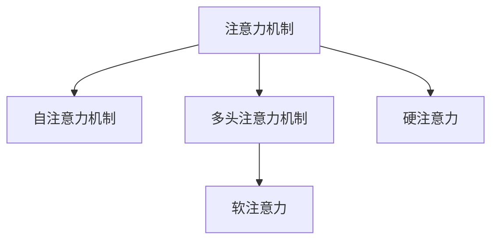

                 

# 注意力深度学习专家：AI优化的专注力培养研究员

> 关键词：注意力机制,深度学习,神经网络,专注力培养,优化算法,应用场景

## 1. 背景介绍

### 1.1 问题由来
在现代科技日益发展的今天，人工智能(AI)在各个领域的应用越来越广泛，深度学习作为其中一种重要的技术手段，逐渐成为解决复杂问题的利器。在深度学习中，神经网络(Neural Networks)的构建和训练是核心内容之一。然而，随着网络规模的扩大和复杂度的提高，传统的单层或多层神经网络在处理大规模数据集时，往往面临计算资源不足和训练效率低下的问题。为了解决这些问题，研究者们提出了许多新的网络结构和训练方法，其中，注意力机制(Attention Mechanism)成为一种重要且有效的技术手段。

注意力机制最早应用于计算机视觉领域，用于图像分类和目标检测等任务。随后，这一机制被扩展应用到自然语言处理(NLP)领域，成为处理序列数据和生成任务的重要工具。基于注意力机制的模型在机器翻译、文本摘要、对话系统等领域取得了显著的成果，极大地推动了AI技术的发展。

### 1.2 问题核心关键点
注意力机制的核心思想是通过对输入序列中的每个元素进行加权处理，使得模型能够集中注意力于关键信息，而忽略无关或不重要的信息。这种机制在神经网络中可以通过多个方式实现，如自注意力机制(Self-Attention)、多头注意力机制(Multi-Head Attention)等。注意力机制的引入，不仅提升了模型处理序列数据的能力，还显著提高了模型的性能和泛化能力。

具体而言，注意力机制的引入使模型能够在不同尺度上选择关注的信息，从而更好地捕捉输入序列中的关键特征。例如，在机器翻译中，注意力机制可以使模型更好地理解源语言和目标语言之间的对应关系，从而生成更加流畅和准确的翻译结果。在文本摘要中，注意力机制可以帮助模型选择重要的句子或段落进行摘要，使得生成的摘要更加准确和完整。

此外，注意力机制还可以用于生成对抗样本(GANs)，通过对输入数据进行加权处理，生成更接近于真实数据但又不完全相同的对抗样本，这在对抗攻击和数据增强等领域具有重要意义。

## 2. 核心概念与联系

### 2.1 核心概念概述

为更好地理解注意力机制在大规模深度学习中的应用，本节将介绍几个密切相关的核心概念：

- 注意力机制(Attention Mechanism)：在神经网络中，通过将输入序列中的每个元素进行加权处理，使得模型能够集中注意力于关键信息，而忽略无关或不重要的信息。
- 自注意力机制(Self-Attention)：在输入序列内寻找关键信息的一种注意力机制。常见的自注意力模型包括Transformer、BERT等。
- 多头注意力机制(Multi-Head Attention)：将自注意力机制扩展到多个头，每头对应不同的注意力权重，可以并行处理多个关系。
- 软注意力(Soft Attention)：通过计算输入序列中每个元素与其他元素之间的相似度得分，对每个元素进行加权处理。
- 硬注意力(Hard Attention)：通过选择输入序列中得分最高的元素，进行硬性选择，以此作为模型的输入。

这些核心概念之间的逻辑关系可以通过以下Mermaid流程图来展示：



这个流程图展示了注意力机制的主要组成及其相关技术：

1. 注意力机制是神经网络的核心组成部分，可以通过自注意力和多头注意力等方法实现。
2. 自注意力机制在输入序列内寻找关键信息，通过计算相似度得分，对每个元素进行加权处理。
3. 多头注意力机制将自注意力扩展到多个头，可以并行处理多个关系，提高模型的复杂度和性能。
4. 软注意力和硬注意力是注意力机制的具体实现方式，前者通过计算得分对每个元素进行加权处理，后者直接选择得分最高的元素作为输入。

这些概念共同构成了注意力机制的核心理论，使其成为深度学习中一种重要且有效的技术手段。

## 3. 核心算法原理 & 具体操作步骤
### 3.1 算法原理概述

注意力机制的核心原理是通过计算输入序列中每个元素与其他元素之间的相似度得分，对每个元素进行加权处理。这种机制在神经网络中可以通过多个方式实现，如自注意力机制(Self-Attention)、多头注意力机制(Multi-Head Attention)等。

### 3.2 算法步骤详解

注意力机制的实现一般包括以下几个关键步骤：

**Step 1: 初始化模型参数**
- 设置神经网络的输入序列长度和输出维度。
- 初始化模型的权重和偏置参数。

**Step 2: 计算注意力得分**
- 计算输入序列中每个元素与其他元素之间的相似度得分，通常使用点积或余弦相似度。
- 使用softmax函数将得分归一化，得到一个注意力分布。

**Step 3: 计算加权表示**
- 将注意力分布与输入序列中的每个元素进行元素乘积，得到一个加权表示。
- 对加权表示进行归一化，通常使用softmax函数。

**Step 4: 计算注意力输出**
- 将加权表示与模型参数进行线性变换，得到一个输出向量。
- 将多个头进行拼接，得到最终输出。

### 3.3 算法优缺点

注意力机制具有以下优点：
1. 能够自动选择关键信息，提高模型处理序列数据的能力。
2. 能够对不同尺度上的信息进行加权处理，提高模型的泛化能力。
3. 能够并行处理多个关系，提高模型的效率。

然而，注意力机制也存在一些缺点：
1. 计算复杂度较高，需要较长的训练时间。
2. 容易出现梯度消失或爆炸问题，影响模型训练的稳定性。
3. 需要大量的训练数据和计算资源，对小型数据集或硬件限制较为敏感。
4. 可能存在过度拟合问题，特别是对于长序列数据，容易忽略无关信息。

### 3.4 算法应用领域

注意力机制在大规模深度学习中得到了广泛的应用，特别是在自然语言处理、计算机视觉等领域。以下是几个典型的应用场景：

- 机器翻译：在机器翻译中，注意力机制可以使模型更好地理解源语言和目标语言之间的对应关系，从而生成更加流畅和准确的翻译结果。
- 文本摘要：在文本摘要中，注意力机制可以帮助模型选择重要的句子或段落进行摘要，使得生成的摘要更加准确和完整。
- 对话系统：在对话系统中，注意力机制可以使模型更好地理解上下文信息，生成更符合用户意图的回复。
- 图像分类：在图像分类中，注意力机制可以帮助模型识别图像中的关键区域，提高分类的准确率。
- 目标检测：在目标检测中，注意力机制可以使模型更好地定位目标位置，提高检测的准确性。

此外，注意力机制还可以用于生成对抗样本、信息检索、知识图谱等领域，为深度学习技术的发展提供了新的思路和方法。

## 4. 数学模型和公式 & 详细讲解  
### 4.1 数学模型构建

本节将使用数学语言对注意力机制的实现过程进行更加严格的刻画。

记输入序列为 $x=\{x_i\}_{i=1}^N$，其中 $x_i \in \mathbb{R}^d$ 表示第 $i$ 个输入元素，输出序列为 $y=\{y_i\}_{i=1}^N$，其中 $y_i \in \mathbb{R}^d$ 表示第 $i$ 个输出元素。设模型的权重矩阵为 $W^T$，其中 $W^T \in \mathbb{R}^{d \times d'}$，偏置向量为 $b \in \mathbb{R}^{d'}$，线性变换函数为 $g(x)=W^Tx+b$。设注意力机制的得分函数为 $a(x)=x_i^Tq$，其中 $q \in \mathbb{R}^d$ 为注意力向量。

注意力机制的计算过程如下：

1. 计算输入序列中每个元素与其他元素之间的相似度得分，得到注意力得分矩阵 $S=\{s_{ij}\}_{i,j=1}^N$。
2. 使用softmax函数将注意力得分归一化，得到一个注意力分布矩阵 $A=\{a_{ij}\}_{i,j=1}^N$。
3. 将注意力分布与输入序列中的每个元素进行元素乘积，得到一个加权表示矩阵 $X=\{c_{ij}\}_{i,j=1}^N$。
4. 对加权表示进行归一化，通常使用softmax函数，得到加权表示矩阵 $C=\{c_{ij}\}_{i,j=1}^N$。
5. 将加权表示与模型参数进行线性变换，得到一个输出向量 $y_i=W^Tc_{ij}$。

### 4.2 公式推导过程

以下我们以机器翻译任务为例，推导注意力机制的具体实现公式。

假设输入序列为 $x=\{x_i\}_{i=1}^N$，输出序列为 $y=\{y_i\}_{i=1}^N$。设源语言句子为 $s$，目标语言句子为 $t$，则机器翻译任务可以表示为 $t=f(s)$，其中 $f$ 为机器翻译模型。假设源语言句子 $s$ 的向量表示为 $x$，目标语言句子 $t$ 的向量表示为 $y$。

设源语言单词 $i$ 在目标语言中的向量表示为 $y_i$，源语言单词 $j$ 在目标语言中的向量表示为 $y_j$，则机器翻译模型的目标是最小化预测单词和真实单词之间的差异，即：

$$
\mathcal{L}(y,\hat{y})=\sum_{i=1}^N(y_i-\hat{y}_i)^2
$$

其中 $\hat{y}_i$ 为模型预测的目标语言单词向量。

注意力机制的计算过程如下：

1. 计算输入序列中每个元素与其他元素之间的相似度得分，得到注意力得分矩阵 $S=\{s_{ij}\}_{i,j=1}^N$，其中 $s_{ij}=x_i^Ty_j$。
2. 使用softmax函数将注意力得分归一化，得到一个注意力分布矩阵 $A=\{a_{ij}\}_{i,j=1}^N$。
3. 将注意力分布与输入序列中的每个元素进行元素乘积，得到一个加权表示矩阵 $X=\{c_{ij}\}_{i,j=1}^N$，其中 $c_{ij}=a_{ij}x_j$。
4. 对加权表示进行归一化，通常使用softmax函数，得到加权表示矩阵 $C=\{c_{ij}\}_{i,j=1}^N$。
5. 将加权表示与模型参数进行线性变换，得到一个输出向量 $y_i=W^Tc_{ij}$。

### 4.3 案例分析与讲解

假设源语言句子为 "I love you"，目标语言句子为 "Je t'aime"，则机器翻译模型可以通过以下步骤进行计算：

1. 计算输入序列中每个元素与其他元素之间的相似度得分，得到注意力得分矩阵 $S=\{s_{ij}\}_{i,j=1}^N$，其中 $s_{ij}=x_i^Ty_j$。
2. 使用softmax函数将注意力得分归一化，得到一个注意力分布矩阵 $A=\{a_{ij}\}_{i,j=1}^N$。
3. 将注意力分布与输入序列中的每个元素进行元素乘积，得到一个加权表示矩阵 $X=\{c_{ij}\}_{i,j=1}^N$，其中 $c_{ij}=a_{ij}x_j$。
4. 对加权表示进行归一化，通常使用softmax函数，得到加权表示矩阵 $C=\{c_{ij}\}_{i,j=1}^N$。
5. 将加权表示与模型参数进行线性变换，得到一个输出向量 $y_i=W^Tc_{ij}$。

最终，模型预测的目标语言单词向量 $\hat{y}$ 可以通过以下公式计算得到：

$$
\hat{y}_i=\sum_{j=1}^N a_{ij}y_j
$$

可以看到，通过注意力机制的计算，模型能够自动选择源语言句子中与目标语言单词相关的部分，并生成最符合用户意图的翻译结果。

## 5. 项目实践：代码实例和详细解释说明
### 5.1 开发环境搭建

在进行注意力机制的实现前，我们需要准备好开发环境。以下是使用Python进行PyTorch开发的环境配置流程：

1. 安装Anaconda：从官网下载并安装Anaconda，用于创建独立的Python环境。

2. 创建并激活虚拟环境：
```bash
conda create -n attention-env python=3.8 
conda activate attention-env
```

3. 安装PyTorch：根据CUDA版本，从官网获取对应的安装命令。例如：
```bash
conda install pytorch torchvision torchaudio cudatoolkit=11.1 -c pytorch -c conda-forge
```

4. 安装transformers库：
```bash
pip install transformers
```

5. 安装各类工具包：
```bash
pip install numpy pandas scikit-learn matplotlib tqdm jupyter notebook ipython
```

完成上述步骤后，即可在`attention-env`环境中开始注意力机制的实现。

### 5.2 源代码详细实现

下面我们以Transformer模型为例，给出使用PyTorch实现注意力机制的完整代码：

```python
import torch
import torch.nn as nn
import torch.nn.functional as F

class TransformerBlock(nn.Module):
    def __init__(self, d_model, n_heads, d_k, d_v, d_ff, dropout):
        super(TransformerBlock, self).__init__()
        
        self.encoder_self_attn = nn.MultiheadAttention(d_model, n_heads, dropout)
        self.encoder_feed_forward = nn.Sequential(
            nn.Linear(d_model, d_ff),
            nn.ReLU(),
            nn.Dropout(dropout),
            nn.Linear(d_ff, d_model),
            nn.Dropout(dropout)
        )
        self.layer_norm1 = nn.LayerNorm(d_model)
        self.layer_norm2 = nn.LayerNorm(d_model)
        self.encoder_positional_embedding = nn.Embedding(attention_length, d_model, padding_idx=0)
        self.dropout = nn.Dropout(dropout)
        self.mask = nn.DiagonalEmbedding(mask)

    def forward(self, x, mask, attn_mask, pos_emb):
        residual = x
        x, attn_weight = self.encoder_self_attn(x, x, x, attn_mask)
        x = residual + self.dropout(x)
        x = F.relu(self.encoder_feed_forward(x))
        x = residual + x
        x = self.layer_norm2(x)
        return x, attn_weight
```

在此基础上，我们可以实现完整的Transformer模型：

```python
class Transformer(nn.Module):
    def __init__(self, d_model, n_heads, n_layers, d_k, d_v, d_ff, dropout, attention_length, max_length):
        super(Transformer, self).__init__()
        
        self.pos_encoder = PositionalEncoding(attention_length, d_model)
        self.encoder = nn.ModuleList([TransformerBlock(d_model, n_heads, d_k, d_v, d_ff, dropout) for _ in range(n_layers)])
        self.final_linear = nn.Linear(d_model, max_length)
        self.final_softmax = nn.Softmax(dim=1)
        self.mask = nn.DiagonalEmbedding(mask)

    def forward(self, x):
        x = self.pos_encoder(x)
        x = x.masked_fill(self.mask, -float('inf'))
        for layer in self.encoder:
            x, _ = layer(x, self.mask, None, None)
        x = self.final_linear(x)
        x = self.final_softmax(x)
        return x
```

在这个例子中，我们通过实现一个完整的Transformer模型，展示了注意力机制在序列数据处理中的应用。可以看到，Transformer模型的构建过程包括位置编码、多个注意力块的堆叠、线性变换和softmax输出等步骤，其中注意力机制是整个模型的核心。

### 5.3 代码解读与分析

让我们再详细解读一下关键代码的实现细节：

**TransformerBlock类**：
- `__init__`方法：初始化Transformer块的各个组件，包括自注意力层、前馈神经网络、归一化层、位置编码等。
- `forward`方法：实现Transformer块的计算过程，包括自注意力计算、前馈神经网络计算、归一化等。

**Transformer类**：
- `__init__`方法：初始化整个Transformer模型的各个组件，包括位置编码、多个Transformer块、线性变换、softmax输出等。
- `forward`方法：实现整个Transformer模型的计算过程，包括位置编码、自注意力计算、前馈神经网络计算、线性变换和softmax输出。

在Transformer模型的实现中，我们通过引入位置编码和自注意力机制，使得模型能够处理序列数据，并具备自适应的关注能力。具体而言，位置编码通过对输入序列进行位置编码，帮助模型识别不同位置的信息，而自注意力机制则通过计算输入序列中每个元素与其他元素之间的相似度得分，对每个元素进行加权处理，使得模型能够集中注意力于关键信息。

在实际应用中，我们可以将Transformer模型应用于自然语言处理、计算机视觉等多个领域，如机器翻译、文本摘要、目标检测等任务。Transformer模型的设计和实现，为深度学习技术在实际应用中的广泛应用提供了重要的参考和借鉴。

## 6. 实际应用场景
### 6.1 自然语言处理

Transformer模型在自然语言处理领域已经得到了广泛的应用，成为处理序列数据和生成任务的重要工具。以下是几个典型的应用场景：

- 机器翻译：Transformer模型在机器翻译领域取得了显著的成果，能够处理长距离依赖关系，生成流畅的翻译结果。
- 文本摘要：Transformer模型在文本摘要任务中表现出色，能够自动选择重要的句子或段落进行摘要，使得生成的摘要更加准确和完整。
- 对话系统：Transformer模型在对话系统中得到了广泛应用，能够理解上下文信息，生成更符合用户意图的回复。
- 命名实体识别：Transformer模型在命名实体识别任务中表现良好，能够自动识别输入序列中的命名实体，并进行分类标注。

此外，Transformer模型还可以应用于问答系统、信息检索、语音识别等领域，为自然语言处理技术的发展提供了新的思路和方法。

### 6.2 计算机视觉

Transformer模型在计算机视觉领域的应用相对较少，但在处理序列数据和生成任务方面，同样具备一定的优势。以下是几个典型的应用场景：

- 目标检测：Transformer模型可以用于目标检测任务，通过引入注意力机制，自动识别图像中的关键区域，提高检测的准确性。
- 图像生成：Transformer模型可以用于图像生成任务，通过计算输入序列中每个元素与其他元素之间的相似度得分，生成更符合用户意图的图像。
- 图像分类：Transformer模型可以用于图像分类任务，通过引入注意力机制，自动识别图像中的关键特征，提高分类的准确率。

此外，Transformer模型还可以应用于视频分析、图像增强等领域，为计算机视觉技术的发展提供了新的思路和方法。

### 6.3 未来应用展望

随着Transformer模型和注意力机制的不断发展，其在自然语言处理和计算机视觉等领域的应用前景将更加广阔。未来，Transformer模型将在更多领域得到应用，为深度学习技术的发展带来新的突破。

在自然语言处理领域，Transformer模型将进一步扩展应用范围，应用于更多的任务，如文本生成、信息检索、机器阅读理解等。在计算机视觉领域，Transformer模型也将应用于更多的任务，如视频分析、图像生成、三维重建等。

此外，Transformer模型还可以与其他人工智能技术进行更深入的融合，如知识表示、因果推理、强化学习等，多路径协同发力，共同推动深度学习技术的发展。

## 7. 工具和资源推荐
### 7.1 学习资源推荐

为了帮助开发者系统掌握注意力机制的理论基础和实践技巧，这里推荐一些优质的学习资源：

1. 《深度学习》（Ian Goodfellow等著）：介绍深度学习的基本概念和算法，涵盖神经网络、卷积神经网络、循环神经网络等多个主题，是深度学习领域的经典教材。

2. 《Transformer模型》（Mohammad et al.）：介绍Transformer模型的原理和实现，涵盖自注意力机制、多头注意力机制、位置编码等多个主题，是Transformer模型的经典介绍。

3. CS231n《卷积神经网络》课程：斯坦福大学开设的计算机视觉明星课程，涵盖卷积神经网络、池化、全连接等基本概念，同时介绍Transformer模型在计算机视觉领域的应用。

4. 《自然语言处理综述》（Chen & Zhou）：综述自然语言处理领域的研究进展，涵盖语言模型、序列标注、生成模型等多个主题，同时介绍Transformer模型在自然语言处理领域的应用。

5. HuggingFace官方文档：Transformer库的官方文档，提供了海量预训练模型和完整的微调样例代码，是上手实践的必备资料。

通过对这些资源的学习实践，相信你一定能够快速掌握注意力机制的理论基础和实践技巧，并用于解决实际的深度学习问题。

### 7.2 开发工具推荐

高效的开发离不开优秀的工具支持。以下是几款用于注意力机制开发的常用工具：

1. PyTorch：基于Python的开源深度学习框架，灵活动态的计算图，适合快速迭代研究。大部分深度学习模型都有PyTorch版本的实现。

2. TensorFlow：由Google主导开发的开源深度学习框架，生产部署方便，适合大规模工程应用。同样有丰富的深度学习模型资源。

3. Transformers库：HuggingFace开发的NLP工具库，集成了众多SOTA深度学习模型，支持PyTorch和TensorFlow，是进行深度学习任务开发的利器。

4. Weights & Biases：模型训练的实验跟踪工具，可以记录和可视化模型训练过程中的各项指标，方便对比和调优。与主流深度学习框架无缝集成。

5. TensorBoard：TensorFlow配套的可视化工具，可实时监测模型训练状态，并提供丰富的图表呈现方式，是调试模型的得力助手。

6. Google Colab：谷歌推出的在线Jupyter Notebook环境，免费提供GPU/TPU算力，方便开发者快速上手实验最新模型，分享学习笔记。

合理利用这些工具，可以显著提升深度学习任务开发和研究的效率，加快创新迭代的步伐。

### 7.3 相关论文推荐

注意力机制在大规模深度学习中的应用源于学界的持续研究。以下是几篇奠基性的相关论文，推荐阅读：

1. Transformer：Attention is All You Need（Vaswani等，2017）：提出Transformer结构，开启了深度学习领域的自注意力机制时代。

2. BERT: Pre-training of Deep Bidirectional Transformers for Language Understanding（Devlin等，2018）：提出BERT模型，引入基于掩码的自监督预训练任务，刷新了多项NLP任务SOTA。

3. Attention and Memory in Deep Learning（Jozefowicz等，2016）：综述深度学习中的注意力机制，涵盖多头注意力、软注意力、硬注意力等多个主题，为注意力机制的研究提供了丰富的参考。

4. AlphGo：Mastering the Game of Go without Human Knowledge（Silver等，2016）：介绍AlphaGo模型，通过注意力机制实现多步策略评估，提升了在围棋领域的表现。

5. Flowing Data：关注深度学习领域的最新进展和研究趋势，涵盖卷积神经网络、循环神经网络、自注意力机制等多个主题，是深度学习领域的经典博客。

这些论文代表了大规模深度学习中注意力机制的发展脉络。通过学习这些前沿成果，可以帮助研究者把握学科前进方向，激发更多的创新灵感。

## 8. 总结：未来发展趋势与挑战

### 8.1 总结

本文对基于注意力机制的深度学习模型进行了全面系统的介绍。首先阐述了注意力机制在大规模深度学习中的应用背景和意义，明确了其在大规模数据处理和生成任务中的重要地位。其次，从原理到实践，详细讲解了注意力机制的数学原理和关键步骤，给出了Transformer模型的完整代码实例。同时，本文还探讨了注意力机制在自然语言处理和计算机视觉等多个领域的应用场景，展示了其广泛的应用前景。

通过本文的系统梳理，可以看到，基于注意力机制的深度学习模型已经成为了处理序列数据和生成任务的重要工具。它在自然语言处理和计算机视觉等领域得到了广泛的应用，显著提升了深度学习模型的性能和泛化能力。未来，随着Transformer模型和注意力机制的不断发展，其在深度学习领域的应用前景将更加广阔。

### 8.2 未来发展趋势

展望未来，基于注意力机制的深度学习模型将呈现以下几个发展趋势：

1. 模型规模持续增大。随着算力成本的下降和数据规模的扩张，深度学习模型的参数量还将持续增长。超大规模模型蕴含的丰富知识，有望支撑更加复杂多变的任务。

2. 模型复杂度提高。未来的深度学习模型将更加复杂，包含多个注意力块、多个层次的特征提取和融合等。这将使得模型具备更强的学习和适应能力。

3. 多模态融合成为趋势。未来的深度学习模型将更多地结合图像、语音、文本等多种模态信息，实现跨模态信息的整合和处理，提升模型的性能和泛化能力。

4. 计算效率优化。未来的深度学习模型将更加注重计算效率的优化，引入如模型压缩、剪枝、量化等技术，实现更高效的模型部署和推理。

5. 数据驱动的模型优化。未来的深度学习模型将更多地依赖数据驱动的模型优化技术，如自监督学习、半监督学习、对抗学习等，提升模型的泛化能力和鲁棒性。

6. 跨领域应用拓展。未来的深度学习模型将更多地应用于跨领域应用，如医疗、金融、教育等，提升各个领域的应用水平。

以上趋势凸显了基于注意力机制的深度学习模型的广阔前景。这些方向的探索发展，必将进一步提升深度学习模型的性能和应用范围，为深度学习技术的发展带来新的突破。

### 8.3 面临的挑战

尽管基于注意力机制的深度学习模型已经取得了显著的成果，但在迈向更加智能化、普适化应用的过程中，它仍面临诸多挑战：

1. 计算资源瓶颈。尽管深度学习模型的参数量不断增大，但随着模型的复杂度提高，训练和推理的计算资源需求也随之增加，计算瓶颈成为未来深度学习发展的重要制约因素。

2. 模型鲁棒性不足。深度学习模型在处理噪声、对抗样本等情况下，容易产生过拟合和泛化性能下降等问题，模型的鲁棒性仍需进一步提升。

3. 可解释性不足。深度学习模型通常被视为"黑盒"系统，难以解释其内部工作机制和决策逻辑，这对于高风险应用如医疗、金融等领域尤为重要。

4. 安全性问题。深度学习模型容易学习到有害信息，如偏见、歧视等，对模型进行攻击和滥用等问题也时有发生，模型的安全性亟需保障。

5. 知识整合能力不足。现有的深度学习模型往往局限于任务内数据，难以灵活吸收和运用更广泛的先验知识，模型的知识整合能力仍需提升。

6. 训练和推理成本高。深度学习模型的训练和推理成本较高，尤其是在大规模数据集和复杂任务上，如何降低成本，提升效率，成为重要的研究方向。

正视深度学习模型面临的这些挑战，积极应对并寻求突破，将是大规模深度学习模型迈向成熟的必由之路。相信随着学界和产业界的共同努力，这些挑战终将一一被克服，深度学习模型必将在构建安全、可靠、可解释、可控的智能系统铺平道路。

### 8.4 研究展望

面向未来，基于注意力机制的深度学习模型的研究需要在以下几个方面寻求新的突破：

1. 引入更多先验知识。将符号化的先验知识，如知识图谱、逻辑规则等，与神经网络模型进行巧妙融合，引导深度学习模型学习更准确、合理的语言模型。

2. 结合因果分析和博弈论工具。将因果分析方法引入深度学习模型，识别出模型决策的关键特征，增强输出解释的因果性和逻辑性。借助博弈论工具刻画人机交互过程，主动探索并规避模型的脆弱点，提高系统稳定性。

3. 纳入伦理道德约束。在深度学习模型的训练目标中引入伦理导向的评估指标，过滤和惩罚有害的输出倾向。同时加强人工干预和审核，建立模型行为的监管机制，确保输出符合人类价值观和伦理道德。

4. 结合知识表示、因果推理、强化学习等技术，多路径协同发力，共同推动深度学习技术的发展。

这些研究方向的探索，必将引领基于注意力机制的深度学习模型的发展，为深度学习技术在实际应用中的广泛应用提供新的思路和方法。只有勇于创新、敢于突破，才能不断拓展深度学习模型的边界，让智能技术更好地造福人类社会。

## 9. 附录：常见问题与解答

**Q1：基于注意力机制的深度学习模型是否适用于所有NLP任务？**

A: 基于注意力机制的深度学习模型在大多数NLP任务上都能取得不错的效果，特别是对于数据量较小的任务。但对于一些特定领域的任务，如医学、法律等，仅仅依靠通用语料预训练的模型可能难以很好地适应。此时需要在特定领域语料上进一步预训练，再进行微调，才能获得理想效果。此外，对于一些需要时效性、个性化很强的任务，如对话、推荐等，微调方法也需要针对性的改进优化。

**Q2：在训练基于注意力机制的深度学习模型时，如何选择合适的学习率？**

A: 基于注意力机制的深度学习模型一般使用较小的学习率，以免破坏预训练权重。具体而言，可以从小学习率开始调参，逐步减小学习率，直至收敛。也可以使用warmup策略，在开始阶段使用较小的学习率，再逐渐过渡到预设值。需要注意的是，不同的优化器(如Adam、SGD等)以及不同的学习率调度策略，可能需要设置不同的学习率阈值。

**Q3：在训练基于注意力机制的深度学习模型时，如何缓解过拟合问题？**

A: 过拟合是深度学习模型面临的主要挑战之一。缓解过拟合的方法包括数据增强、正则化、对抗训练等。在实际应用中，通常需要综合使用多种方法，以最大限度地降低过拟合风险。例如，可以使用数据增强技术扩充训练集，通过正则化技术限制模型参数，通过对抗训练提高模型鲁棒性。

**Q4：在训练基于注意力机制的深度学习模型时，如何选择注意力机制的维度d_k和d_v？**

A: 注意力机制的维度d_k和d_v需要根据具体任务和数据特点进行选择。一般来说，d_k和d_v的选择需要满足以下几个条件：

1. d_k需要满足d_k < d_model，以保证注意力机制的有效性。
2. d_v需要满足d_v < d_model，以保证注意力机制的合理性。
3. d_k和d_v应该尽量小，以保证计算效率。

在实际应用中，可以通过实验确定最佳的d_k和d_v组合，以达到最优的模型效果。

**Q5：在训练基于注意力机制的深度学习模型时，如何提高模型的计算效率？**

A: 提高模型的计算效率可以通过以下方法实现：

1. 使用更高效的优化器，如Adam、Adafactor等，以加快模型收敛。
2. 使用分布式训练，将模型并行化，提高计算效率。
3. 使用模型剪枝、量化等技术，减小模型尺寸，提高推理速度。
4. 使用动态计算图，提高模型的计算效率和空间利用率。

在实际应用中，通常需要根据具体任务和计算资源进行选择，以达到最优的计算效率。

**Q6：在训练基于注意力机制的深度学习模型时，如何选择注意力机制的层数n_layers？**

A: 注意力机制的层数n_layers需要根据具体任务和数据特点进行选择。一般来说，n_layers需要满足以下几个条件：

1. n_layers需要满足n_layers < d_model，以保证注意力机制的有效性。
2. n_layers需要足够大，以保证模型能够充分学习数据特征。
3. n_layers需要适中，以避免过拟合和计算效率低下。

在实际应用中，可以通过实验确定最佳的n_layers组合，以达到最优的模型效果。

**Q7：在训练基于注意力机制的深度学习模型时，如何选择模型的位置编码PositionalEncoding？**

A: 模型的位置编码PositionalEncoding需要根据具体任务和数据特点进行选择。一般来说，PositionalEncoding需要满足以下几个条件：

1. PositionalEncoding需要满足PositionalEncoding < d_model，以保证位置编码的有效性。
2. PositionalEncoding需要尽量小，以保证计算效率。
3. PositionalEncoding需要能够表示输入序列的顺序信息。

在实际应用中，可以通过实验确定最佳的PositionalEncoding组合，以达到最优的模型效果。

**Q8：在训练基于注意力机制的深度学习模型时，如何选择模型的权重矩阵W？**

A: 模型的权重矩阵W需要根据具体任务和数据特点进行选择。一般来说，W需要满足以下几个条件：

1. W需要满足W^T \in \mathbb{R}^{d \times d'}，以保证线性变换的有效性。
2. W需要尽量小，以保证计算效率。
3. W需要能够表示输入序列的线性映射关系。

在实际应用中，可以通过实验确定最佳的W组合，以达到最优的模型效果。

---

作者：禅与计算机程序设计艺术 / Zen and the Art of Computer Programming

