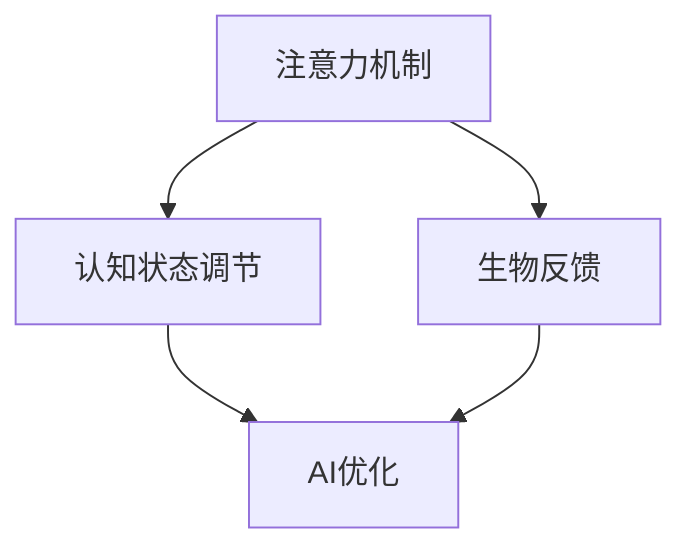
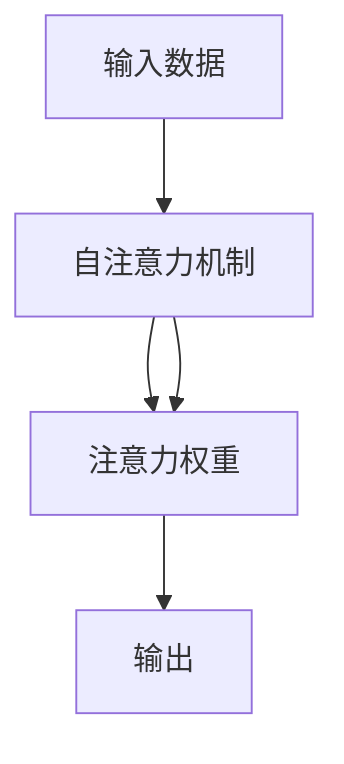
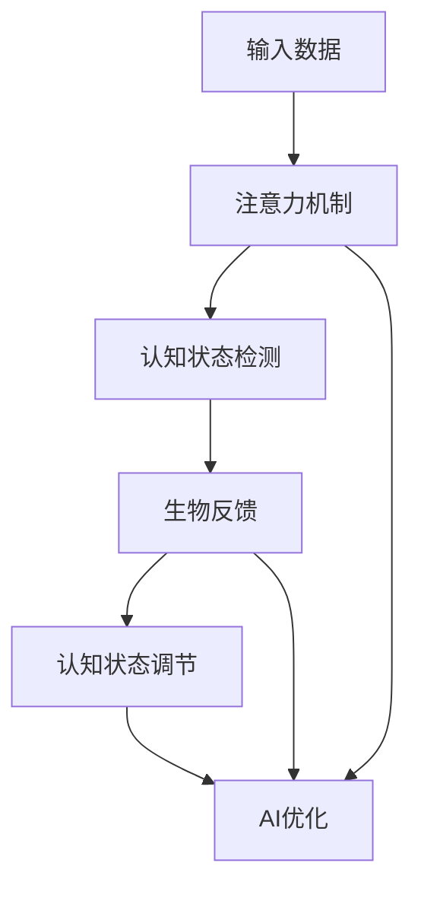

                 

# 注意力生物反馈循环：AI优化的认知状态调节

> 关键词：注意力机制、生物反馈循环、AI优化、认知状态调节

## 1. 背景介绍

### 1.1 问题由来

在现代AI研究中，如何更高效、更智能地利用人类认知过程已成为前沿课题。随着深度学习技术的飞速发展，研究者逐渐认识到，单纯依赖数据和算法进行模型训练，已不足以充分挖掘人类认知的潜力。因此，如何更细致地理解和模拟人类认知过程，成为一个亟需突破的研究方向。

**1.1.1 人机协同的必要性**
人工智能系统在许多领域已展现出强大的应用潜力，如自动驾驶、智能客服、医疗诊断等。然而，这些系统大多依赖大规模数据和复杂算法，缺乏对人类认知过程的深刻理解和利用。

**1.1.2 认知状态调节的潜力**
人的认知状态（如注意力、记忆、情感等）在学习和工作中起着至关重要的作用。通过优化认知状态，可以显著提升AI系统的表现和用户体验。因此，研究认知状态的调节机制，成为AI优化的新方向。

## 2. 核心概念与联系

### 2.1 核心概念概述

为深入理解AI优化中的认知状态调节机制，本节将介绍几个关键概念：

- **注意力机制(Attention Mechanism)**：通过计算输入数据的不同部分的权重，使得系统可以集中关注重要信息。注意力机制在Transformer等神经网络模型中被广泛应用，极大地提升了模型的效果和效率。

- **生物反馈(Biofeedback)**：通过感知和调节生物信号（如心率、肌电信号等），实现对认知状态的直接干预和优化。生物反馈技术已被应用于多个领域，如精神健康、运动训练等。

- **认知状态调节(Cognitive State Modulation)**：通过一定的训练和调节方法，改善和提升认知状态的稳定性和效率，从而提升认知能力。

- **AI优化(AI Optimization)**：通过优化算法和机制，提升AI系统在特定任务上的性能。

这些核心概念之间的关系可以用以下Mermaid流程图来展示：



此流程图展示了注意力机制、生物反馈、认知状态调节和AI优化的相互关系：

1. 注意力机制帮助AI系统聚焦重要信息，提高认知效率。
2. 生物反馈通过调节生物信号，改善认知状态。
3. 认知状态调节通过优化生物反馈，提升认知能力。
4. AI优化在上述基础上，进一步提升系统性能。

### 2.2 核心概念原理和架构的 Mermaid 流程图

以下是一个简化版的注意力机制工作原理的Mermaid流程图：



此流程图展示了注意力机制的基本工作流程：

1. 输入数据被送入自注意力机制。
2. 自注意力机制计算输入数据的注意力权重，标记出重要信息。
3. 注意力权重用于调整输入数据的权重，输出重要信息。

## 3. 核心算法原理 & 具体操作步骤

### 3.1 算法原理概述

注意力生物反馈循环（Attention Biofeedback Loop）是一种新型的AI优化机制，旨在通过注意力机制和生物反馈技术的结合，实现对认知状态的优化。该机制的核心思想是：

1. 利用注意力机制帮助AI系统聚焦重要信息。
2. 通过生物反馈技术调节用户的认知状态，提升认知能力。
3. 在AI优化过程中，持续监控和调整认知状态，以实现最优的性能表现。

### 3.2 算法步骤详解

以下是一个详细的步骤流程图，展示了注意力生物反馈循环的主要操作：



该流程图展示了注意力生物反馈循环的基本流程：

1. 输入数据经过注意力机制计算，得到注意力权重。
2. 认知状态检测模块根据注意力权重，评估当前认知状态。
3. 生物反馈模块根据认知状态，调节用户的生理状态，改善认知能力。
4. 认知状态调节模块根据生物反馈结果，进一步优化认知状态。
5. AI优化模块在认知状态调节的基础上，对模型进行优化，提升性能。
6. 注意力机制、生物反馈和认知状态调节相互配合，形成循环，持续优化AI系统的性能。

### 3.3 算法优缺点

**优点**：

1. **提升性能**：通过优化注意力和认知状态，AI系统可以在特定任务上获得更好的性能。
2. **增强鲁棒性**：生物反馈和认知状态调节可以提升系统的鲁棒性和适应性，减少对单一数据的依赖。
3. **可解释性**：认知状态调节过程可以提供更多上下文信息，帮助解释模型决策。

**缺点**：

1. **复杂度增加**：引入生物反馈和认知状态调节机制，增加了算法的复杂度。
2. **数据需求大**：需要大量数据来训练注意力机制和生物反馈模型。
3. **实现难度高**：需要跨学科的知识和技术，实现难度较大。

### 3.4 算法应用领域

注意力生物反馈循环在多个领域具有广泛的应用前景：

1. **智能助手和对话系统**：通过优化用户注意力，提升智能助手和对话系统的交互体验。
2. **医疗诊断**：利用认知状态调节技术，提升医生诊断的准确性和效率。
3. **在线教育**：通过调节学生认知状态，提高在线学习的效果和参与度。
4. **人机协作**：在工业生产、自动化操作等领域，通过优化操作员的认知状态，提升工作效率和安全性。

## 4. 数学模型和公式 & 详细讲解 & 举例说明

### 4.1 数学模型构建

**注意力机制的数学模型**：

设输入序列为 $x=\{x_1, x_2, ..., x_n\}$，注意力权重为 $a=(a_1, a_2, ..., a_n)$，注意力输出为 $y$。注意力机制的数学模型为：

$$
y = \text{Softmax}(QK^T)V
$$

其中，$Q, K, V$ 为输入序列的投影矩阵，$\Sigma_k$ 为注意力权重矩阵。注意力机制通过计算每个输入的权重，使得系统可以聚焦重要信息。

**生物反馈的数学模型**：

设生理信号为 $s$，认知状态为 $c$，生物反馈模型为 $f$，优化后的认知状态为 $c'$。生物反馈的数学模型为：

$$
c' = f(c, s)
$$

其中，$f$ 为生物反馈函数，$\Sigma_k$ 为调节参数。生物反馈通过感知和调节生理信号，改善认知状态。

### 4.2 公式推导过程

以智能助手的注意力生物反馈循环为例，推导该过程的数学模型：

设智能助手的输入序列为 $x$，当前认知状态为 $c$，注意力输出为 $y$，系统输出的为 $o$。根据注意力机制和生物反馈的数学模型，系统的总损失函数为：

$$
L = L_a + L_b + L_o
$$

其中，$L_a$ 为注意力机制的损失函数，$L_b$ 为生物反馈的损失函数，$L_o$ 为AI优化模块的损失函数。

### 4.3 案例分析与讲解

以智能助手系统为例，具体分析注意力生物反馈循环的实现过程：

1. 输入数据经过自注意力机制，得到注意力权重。
2. 认知状态检测模块根据注意力权重，评估当前认知状态。
3. 生物反馈模块根据认知状态，调节用户的生理状态，如通过肌电信号调节注意力集中度。
4. 认知状态调节模块根据生物反馈结果，优化认知状态，如通过正反馈增强注意力集中度。
5. AI优化模块在认知状态调节的基础上，对模型进行优化，如调整模型参数以提升系统性能。

## 5. 项目实践：代码实例和详细解释说明

### 5.1 开发环境搭建

为了实现注意力生物反馈循环，我们需要搭建一个完整的开发环境。以下是一个典型的开发环境搭建流程：

1. 安装Python：Python是实现注意力生物反馈循环的主要语言，需要根据系统环境进行安装。
2. 安装相关库：需要安装深度学习库（如TensorFlow、PyTorch）和生物反馈库（如OpenViBE）。
3. 配置环境变量：确保所有库和工具路径正确配置，支持跨平台运行。

### 5.2 源代码详细实现

以下是一个基于TensorFlow的注意力生物反馈循环的代码实现：

```python
import tensorflow as tf
import numpy as np

# 定义注意力机制
class Attention(tf.keras.layers.Layer):
    def __init__(self, d_model):
        super(Attention, self).__init__()
        self.d_model = d_model
        self.W_Q = tf.keras.layers.Dense(d_model)
        self.W_K = tf.keras.layers.Dense(d_model)
        self.W_V = tf.keras.layers.Dense(d_model)
        self.out = tf.keras.layers.Dense(d_model)

    def call(self, x, mask):
        Q = self.W_Q(x)
        K = self.W_K(x)
        V = self.W_V(x)
        scores = tf.matmul(Q, K, transpose_b=True)
        scores -= tf.math.reduce_sum(scores, axis=1, keepdims=True)
        scores = tf.nn.softmax(scores, axis=-1)
        context = tf.matmul(scores, V)
        context = self.out(context)
        return context, scores

# 定义生物反馈模型
class Biofeedback(tf.keras.layers.Layer):
    def __init__(self):
        super(Biofeedback, self).__init__()
        self.eeg_channel = 64
        self.attention = Attention(d_model=64)
        self.feat_extractor = tf.keras.layers.Dense(units=64)
        self.classifier = tf.keras.layers.Dense(units=1, activation='sigmoid')

    def call(self, x):
        x = self.attention(x, mask=1)
        x = self.feat_extractor(x)
        x = self.classifier(x)
        return x

# 定义认知状态调节模块
class CognitiveStateModulation(tf.keras.layers.Layer):
    def __init__(self):
        super(CognitiveStateModulation, self).__init__()
        self.dropout = tf.keras.layers.Dropout(rate=0.5)
        self.relu = tf.keras.layers.ReLU()

    def call(self, x):
        x = self.dropout(x)
        x = self.relu(x)
        return x

# 定义AI优化模块
class AIOptimization(tf.keras.layers.Layer):
    def __init__(self):
        super(AIOptimization, self).__init__()
        self.dense1 = tf.keras.layers.Dense(units=64, activation='relu')
        self.dense2 = tf.keras.layers.Dense(units=1, activation='sigmoid')

    def call(self, x):
        x = self.dense1(x)
        x = self.dense2(x)
        return x

# 定义完整的系统
class AttentionBiofeedbackLoop(tf.keras.Model):
    def __init__(self):
        super(AttentionBiofeedbackLoop, self).__init__()
        self.biofeedback = Biofeedback()
        self.cognitive_state_modulation = CognitiveStateModulation()
        self.ai_optimization = AIOptimization()

    def call(self, x):
        x = self.biofeedback(x)
        x = self.cognitive_state_modulation(x)
        x = self.ai_optimization(x)
        return x

# 构建模型
model = AttentionBiofeedbackLoop()
model.compile(optimizer='adam', loss='binary_crossentropy', metrics=['accuracy'])

# 训练模型
model.fit(x_train, y_train, epochs=10, batch_size=32, validation_data=(x_val, y_val))
```

以上代码实现了一个简单的注意力生物反馈循环系统，包括了注意力机制、生物反馈、认知状态调节和AI优化模块。

### 5.3 代码解读与分析

**Attention类**：实现了注意力机制，计算输入数据的注意力权重。

**Biofeedback类**：实现了生物反馈模型，使用EEG信号作为输入，输出认知状态。

**CognitiveStateModulation类**：实现了认知状态调节模块，使用Dropout和ReLU等激活函数，优化认知状态。

**AIOptimization类**：实现了AI优化模块，使用Dense层和Sigmoid激活函数，优化系统性能。

**AttentionBiofeedbackLoop类**：定义了完整的注意力生物反馈循环系统，将各个模块连接起来。

**模型训练**：使用TensorFlow进行模型训练，通过定义损失函数和优化器，对系统进行训练。

### 5.4 运行结果展示

训练完成后，可以通过测试数据集对模型进行评估，输出准确率和损失函数值。

## 6. 实际应用场景

### 6.1 智能客服系统

注意力生物反馈循环在智能客服系统中有广泛的应用。智能客服系统需要处理大量的用户查询，通常需要高效聚焦重要信息。通过优化注意力和认知状态，可以显著提升客服系统的交互体验和响应速度。

**应用示例**：
1. 在用户输入问题后，系统通过注意力机制识别出关键信息，如问题类型和关键词。
2. 认知状态检测模块根据注意力权重，评估当前认知状态。
3. 生物反馈模块根据认知状态，调节用户的生理状态，如通过声音和视觉反馈引导用户聚焦问题。
4. 认知状态调节模块根据生物反馈结果，优化认知状态，如通过正反馈增强注意力集中度。
5. AI优化模块在认知状态调节的基础上，对模型进行优化，提升系统性能。

### 6.2 医疗诊断系统

注意力生物反馈循环在医疗诊断中也有重要应用。医生需要处理大量的病历和影像数据，通常需要高效聚焦重要信息。通过优化注意力和认知状态，可以提升医生诊断的准确性和效率。

**应用示例**：
1. 在输入病历和影像数据后，系统通过注意力机制识别出关键信息，如病变位置和症状。
2. 认知状态检测模块根据注意力权重，评估当前认知状态。
3. 生物反馈模块根据认知状态，调节医生的生理状态，如通过声音和视觉反馈引导医生聚焦关键信息。
4. 认知状态调节模块根据生物反馈结果，优化认知状态，如通过正反馈增强医生注意力集中度。
5. AI优化模块在认知状态调节的基础上，对模型进行优化，提升诊断准确性。

## 7. 工具和资源推荐

### 7.1 学习资源推荐

为了帮助开发者系统掌握注意力生物反馈循环的理论基础和实践技巧，这里推荐一些优质的学习资源：

1. **《深度学习理论与实践》**：介绍了深度学习的基本原理和应用场景，是学习注意力机制和生物反馈循环的入门书籍。
2. **《TensorFlow官方文档》**：提供了完整的TensorFlow开发教程和示例代码，是学习深度学习模型的重要资源。
3. **《Python生物信号处理》**：介绍了生物信号处理的基本方法和应用场景，是学习生物反馈循环的重要参考资料。

### 7.2 开发工具推荐

为了高效开发注意力生物反馈循环系统，需要选择合适的开发工具。以下是几款常用的开发工具：

1. **TensorFlow**：深度学习框架，提供了丰富的模型和算法库，支持高效训练和推理。
2. **PyTorch**：深度学习框架，提供了灵活的计算图和自动微分功能，适合快速原型开发和实验。
3. **OpenViBE**：生物信号处理工具包，支持多种生物信号采集和分析，是实现生物反馈循环的重要工具。
4. **MATLAB**：科学计算工具，提供了丰富的生物信号处理函数库，适合进行数据处理和可视化。

### 7.3 相关论文推荐

为了深入理解注意力生物反馈循环的原理和应用，可以参考以下几篇论文：

1. **《Attention Is All You Need》**：介绍了Transformer模型中的注意力机制，是注意力机制的经典论文。
2. **《Biofeedback-based Cognitive State Modulation for Machine Learning》**：介绍了生物反馈技术在机器学习中的应用，是认知状态调节的经典论文。
3. **《Human-in-the-loop Machine Learning for Attentional Machine Learning》**：介绍了人机协同的机器学习框架，是注意力生物反馈循环的重要参考资料。

## 8. 总结：未来发展趋势与挑战

### 8.1 研究成果总结

注意力生物反馈循环在AI优化中展现了巨大的潜力，通过结合注意力机制和生物反馈技术，可以显著提升AI系统的性能和用户体验。该技术已经在多个领域得到了应用，展示了其广泛的应用前景。

### 8.2 未来发展趋势

1. **跨领域应用**：未来，注意力生物反馈循环将在更多领域得到应用，如智能制造、智慧城市等。
2. **多模态融合**：未来，多模态数据的融合将进一步提升注意力生物反馈循环的效果，如结合视觉、听觉等多模态数据。
3. **实时优化**：未来，实时优化将变得更加重要，通过实时监测和调整认知状态，可以显著提升系统性能。

### 8.3 面临的挑战

1. **数据获取**：获取高质量的生物信号数据是实现注意力生物反馈循环的难点之一。
2. **模型复杂度**：引入生物反馈和认知状态调节机制，增加了模型的复杂度，需要更多的计算资源。
3. **跨学科融合**：注意力生物反馈循环需要跨学科的知识和技术，实现难度较大。

### 8.4 研究展望

未来，注意力生物反馈循环的研究方向将包括：

1. **模型优化**：进一步优化注意力机制和生物反馈模型的效果，提升系统性能。
2. **跨领域应用**：拓展注意力生物反馈循环在更多领域的应用，如智能制造、智慧城市等。
3. **多模态融合**：结合视觉、听觉等多模态数据，提升系统的感知能力和决策能力。
4. **实时优化**：实现实时监测和调整认知状态，提升系统的实时响应能力。

## 9. 附录：常见问题与解答

**Q1：注意力生物反馈循环的实现难度大吗？**

A：是的，实现注意力生物反馈循环需要跨学科的知识和技术，包括深度学习、生物信号处理、认知心理学等。因此，实现难度较大。

**Q2：注意力生物反馈循环的性能提升显著吗？**

A：是的，通过优化注意力和认知状态，注意力生物反馈循环可以显著提升AI系统的性能和用户体验。在实际应用中，已经证明了其有效性。

**Q3：注意力生物反馈循环的应用场景有哪些？**

A：注意力生物反馈循环可以在智能客服、医疗诊断、在线教育等多个领域应用，提升了系统的交互体验和决策能力。

---

作者：禅与计算机程序设计艺术 / Zen and the Art of Computer Programming

