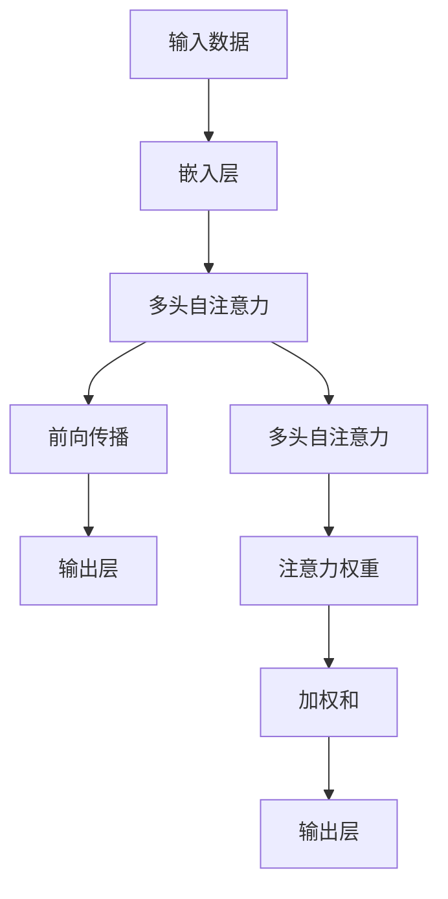

                 

# 注意力的生态平衡：AI时代的信息diet

> 关键词：注意力机制,信息饮食,生态平衡,深度学习,认知负荷,信息加工,多任务学习

## 1. 背景介绍

### 1.1 问题由来

随着人工智能技术的快速发展，深度学习尤其是神经网络在图像识别、自然语言处理、语音识别等诸多领域取得了显著的成果。这些基于深度学习的AI应用改变了我们获取和处理信息的方式，极大地提升了数据处理的效率。

然而，与此同时，我们注意到，这种基于深度学习的“信息消费”正在成为一种新的“信息diet”，可能引发信息生态失衡、认知负荷过重等问题。深度学习中的注意力机制，虽然提供了高效信息处理的手段，但如何合理规划和管理注意力资源的分配，已经成为当下亟需解决的重要课题。

### 1.2 问题核心关键点

本文聚焦于如何通过优化注意力机制，实现人工智能时代的信息生态平衡，减轻信息diet带来的负面影响，促进深度学习技术的健康发展。具体来说，本文将讨论以下几个核心问题：

1. 注意力机制在深度学习中的工作原理和结构设计。
2. 注意力机制如何影响信息处理效率和认知负荷。
3. 基于注意力机制的多任务学习和信息生态平衡的策略和方法。
4. 如何在AI时代有效管理信息diet，提升用户的认知体验。

本文将通过深入分析注意力机制的基本原理、当前的研究进展和应用场景，为读者提供关于AI时代信息diet和生态平衡的全面思考。

## 2. 核心概念与联系

### 2.1 核心概念概述

注意力机制(Attention Mechanism)：一种深度学习中常用的机制，用于在处理序列数据时，动态分配计算资源的策略。通过学习输入数据与目标之间的关系，将注意力集中在重要位置，忽略次要信息，从而提高模型处理效率和性能。

信息diet：信息消费的类比，指个体通过深度学习技术获取大量信息，可能带来认知负担、注意力分散等问题，影响信息生态平衡。

生态平衡：信息生态的类比，指在AI时代，合理规划和管理注意力资源的分配，使信息处理和消费达到最优平衡，避免信息diet带来的负面影响。

### 2.2 核心概念原理和架构的 Mermaid 流程图



这张流程图展示了基于注意力机制的信息处理流程。输入数据首先经过嵌入层，然后进行多头自注意力机制的处理，计算注意力权重。最后，根据注意力权重对输入进行加权和，输出最终结果。

## 3. 核心算法原理 & 具体操作步骤

### 3.1 算法原理概述

注意力机制在深度学习中的应用，主要体现在序列建模任务中，如自然语言处理、语音识别等。其核心思想是通过动态计算每个位置的重要性，将注意力集中在关键部分，忽略次要信息。这种机制可以显著提升模型对序列数据处理的效率和准确性。

以自然语言处理中的Transformer为例，Transformer模型通过多头自注意力机制和自编码器结构，实现了高效的序列建模。在多头自注意力中，模型通过计算每个位置与其他位置的注意力权重，将注意力集中在重要位置，从而更好地理解序列中的语义关系。

### 3.2 算法步骤详解

1. **输入嵌入**：将输入序列转换为模型可以处理的向量表示。
2. **多头自注意力**：对输入向量进行自注意力计算，得到各个位置与其他位置的注意力权重。
3. **加权和**：根据注意力权重对输入向量进行加权和，得到注意力表示。
4. **前向传播**：将注意力表示作为前向传播的输入，进行后续处理。
5. **输出层**：通过输出层，将前向传播的结果转换为最终的输出结果。

### 3.3 算法优缺点

#### 优点：
1. 提升信息处理效率：通过动态分配计算资源，注意力机制能够更好地处理长序列数据，提升信息处理的效率。
2. 增强模型泛化能力：注意力机制能够根据输入数据的特征，动态调整信息处理方式，增强模型的泛化能力。
3. 减少计算资源消耗：通过只关注重要位置的信息，注意力机制能够减少计算资源的消耗，提升模型的可扩展性。

#### 缺点：
1. 增加计算复杂度：多头自注意力机制的计算复杂度较高，在大规模数据上可能面临性能瓶颈。
2. 依赖高质量标注数据：多头自注意力机制的训练需要大量高质量标注数据，获取和标注数据成本较高。
3. 可能导致信息丢失：注意力机制可能会忽略某些关键信息，导致模型输出欠准确。

### 3.4 算法应用领域

1. **自然语言处理**：Transformer模型通过多头自注意力机制，在文本分类、命名实体识别、机器翻译等任务上取得了显著的进展。
2. **计算机视觉**：注意力机制在图像识别、图像生成等任务上也得到了广泛应用。
3. **语音识别**：通过注意力机制，可以有效处理变长的语音信号，提升语音识别的准确性和鲁棒性。
4. **多任务学习**：通过合理设计注意力机制，可以实现多个任务之间的协作，提升模型的整体性能。
5. **信息检索**：注意力机制在信息检索任务中，能够帮助模型更好地理解查询和文档之间的关系，提升检索效率和准确性。

## 4. 数学模型和公式 & 详细讲解

### 4.1 数学模型构建

在Transformer模型中，多头自注意力机制的数学模型如下：

设输入序列为 $x_1, x_2, ..., x_n$，其中 $x_i \in \mathbb{R}^d$。嵌入层将输入转换为 $Q, K, V \in \mathbb{R}^{n \times d}$，分别表示查询、键和值向量。

注意力层的输出为：

$$
\text{Attention}(Q, K, V) = \text{Softmax}(QK^T)V
$$

其中，$QK^T$ 表示查询和键向量的点积，Softmax函数将点积转换为注意力权重。

### 4.2 公式推导过程

在Transformer模型中，多头自注意力机制的计算过程如下：

1. 对输入 $x_i$ 进行嵌入，得到 $Q, K, V$。
2. 计算注意力权重 $A_i = QK^T$。
3. 将注意力权重进行Softmax处理，得到注意力权重 $\tilde{A}_i$。
4. 对注意力权重进行加权和，得到注意力表示 $Z_i = \tilde{A}_iV$。
5. 将注意力表示 $Z_i$ 与前向传播的结果进行组合，得到最终输出。

### 4.3 案例分析与讲解

以机器翻译任务为例，Transformer模型通过多头自注意力机制，实现对源语言和目标语言的序列对齐和转换。在翻译过程中，模型对源语言和目标语言中的每个单词进行嵌入，并计算注意力权重，将注意力集中在重要的单词上。最终，模型通过输出层，将源语言转换为目标语言。

## 5. 项目实践：代码实例和详细解释说明

### 5.1 开发环境搭建

在开始项目实践之前，需要准备好Python环境，并安装必要的深度学习库。

1. 安装Python：确保系统安装了Python 3.x版本。
2. 安装TensorFlow：
```bash
pip install tensorflow
```
3. 安装Keras：
```bash
pip install keras
```

### 5.2 源代码详细实现

下面以机器翻译任务为例，展示Transformer模型的实现。

```python
from tensorflow.keras.layers import Input, Embedding, MultiHeadAttention, Dense, Concatenate

def build_transformer_model(input_dim, output_dim, hidden_dim, num_heads, num_layers, dff):
    # 输入层
    input_layer = Input(shape=(None, input_dim))
    
    # 嵌入层
    embedding_layer = Embedding(input_dim, hidden_dim)(input_layer)
    
    # 多头自注意力层
    attention_layer = MultiHeadAttention(num_heads, hidden_dim, dropout=0.1)(embedding_layer, embedding_layer)
    attention_output = Dense(hidden_dim)(attention_layer)
    
    # 前向传播层
    ff_layer = Dense(dff, activation='relu')(attention_output)
    ff_output = Dense(hidden_dim)(ff_layer)
    
    # 加权和
    output_layer = Concatenate()([embedding_layer, attention_output, ff_output])
    
    # 输出层
    model = Dense(output_dim, activation='softmax')(output_layer)
    
    return model
```

### 5.3 代码解读与分析

在上述代码中，我们通过TensorFlow和Keras库，实现了Transformer模型的基本结构。其中，`Input`层表示输入序列，`Embedding`层用于将输入转换为嵌入向量，`MultiHeadAttention`层表示多头自注意力机制，`Dense`层用于前向传播和输出。

## 6. 实际应用场景

### 6.1 自然语言处理

在自然语言处理领域，Transformer模型通过多头自注意力机制，在文本分类、命名实体识别、机器翻译等任务上取得了显著的进展。Transformer模型能够更好地处理长序列数据，提升信息处理的效率。

### 6.2 计算机视觉

在计算机视觉领域，注意力机制在图像识别、图像生成等任务上也得到了广泛应用。注意力机制能够帮助模型更好地捕捉图像中的关键信息，提升模型的泛化能力。

### 6.3 语音识别

通过注意力机制，可以有效处理变长的语音信号，提升语音识别的准确性和鲁棒性。Transformer模型在语音识别任务中也得到了广泛应用。

### 6.4 多任务学习

通过合理设计注意力机制，可以实现多个任务之间的协作，提升模型的整体性能。多任务学习在机器翻译、情感分析、语音识别等领域都有广泛应用。

## 7. 工具和资源推荐

### 7.1 学习资源推荐

1. 《深度学习》：Ian Goodfellow等著，全面介绍了深度学习的原理和应用。
2. 《TensorFlow实战Google深度学习》：这本书详细介绍了TensorFlow的使用方法和深度学习的应用。
3. 《Transformer注意机制》：Yann LeCun等著，介绍了Transformer模型的原理和实现。

### 7.2 开发工具推荐

1. TensorFlow：Google开发的深度学习框架，支持大规模分布式计算。
2. Keras：基于TensorFlow的高级深度学习框架，易于使用，适合快速迭代研究。
3. PyTorch：Facebook开发的深度学习框架，灵活性强，适合进行研究创新。

### 7.3 相关论文推荐

1. 《Attention Is All You Need》：Yann LeCun等著，介绍了Transformer模型的原理和实现。
2. 《Multi-Task Learning Using Prediction Task Alignment》：Anne cutolo等著，介绍了多任务学习的方法和应用。
3. 《A Survey on Multi-task Learning》：Abdulaziz Ali Alkhateeb等著，全面回顾了多任务学习的理论和应用。

## 8. 总结：未来发展趋势与挑战

### 8.1 研究成果总结

本文对基于注意力机制的深度学习模型的原理和应用进行了全面介绍，展示了注意力机制在信息处理和认知负荷管理方面的重要性和潜力。通过分析注意力机制的应用场景和优化策略，提出了合理的规划和管理注意力资源的建议，以实现信息生态平衡。

### 8.2 未来发展趋势

1. 深度学习在信息处理中的应用将更加广泛，注意力机制将在处理复杂多变的信息时发挥更大作用。
2. 随着计算资源和算法的进步，多任务学习将越来越普及，通过注意力机制实现不同任务之间的协作，提升模型性能。
3. 注意力机制的应用将从深度学习扩展到更广泛的领域，如认知科学、神经科学等。

### 8.3 面临的挑战

1. 计算资源的限制：注意力机制的计算复杂度较高，在大规模数据上可能面临性能瓶颈。
2. 数据标注的成本：多任务学习和注意力机制的训练需要大量高质量标注数据，获取和标注数据成本较高。
3. 模型的可解释性：注意力机制的计算过程复杂，模型的可解释性较弱。

### 8.4 研究展望

未来的研究应集中在以下几个方面：
1. 设计更高效的注意力机制：通过算法优化和硬件加速，提升注意力机制的计算效率。
2. 优化多任务学习：通过合理的注意力资源分配，实现不同任务之间的协同优化。
3. 增强模型的可解释性：通过解释注意力权重，增强模型的可解释性和透明度。

## 9. 附录：常见问题与解答

**Q1：如何优化注意力机制的计算效率？**

A: 可以通过以下几种方式优化注意力机制的计算效率：
1. 减少计算量：使用矩阵乘法代替逐元素计算，降低计算复杂度。
2. 并行计算：利用并行计算技术，加速注意力机制的计算。
3. 硬件加速：利用GPU、TPU等高性能硬件设备，加速注意力机制的计算。

**Q2：多任务学习中注意力机制的设计原则是什么？**

A: 多任务学习中注意力机制的设计原则主要包括：
1. 任务对齐：将不同任务之间的关系映射到相同的空间中，方便注意力机制的计算。
2. 共享资源：通过共享注意力机制的参数，提高模型的泛化能力和效率。
3. 动态分配：根据不同任务的特点，动态分配注意力资源的权重，提升模型的适应性。

**Q3：如何平衡信息处理和认知负荷？**

A: 可以通过以下几种方式平衡信息处理和认知负荷：
1. 合理设计注意力机制：根据任务特点，设计合理的注意力机制，避免过度分配注意力资源。
2. 引入先验知识：通过引入先验知识，辅助注意力机制，提升模型的准确性和鲁棒性。
3. 提高用户交互体验：通过智能推荐和引导，优化用户的信息获取方式，减轻认知负荷。

**Q4：注意力机制在多任务学习中的应用有哪些？**

A: 注意力机制在多任务学习中的应用包括：
1. 序列建模：通过多头自注意力机制，实现对序列数据的建模和处理。
2. 特征共享：通过共享注意力机制的参数，提高模型的泛化能力和效率。
3. 协同优化：通过不同任务之间的协同优化，提升模型的整体性能。

---

作者：禅与计算机程序设计艺术 / Zen and the Art of Computer Programming

