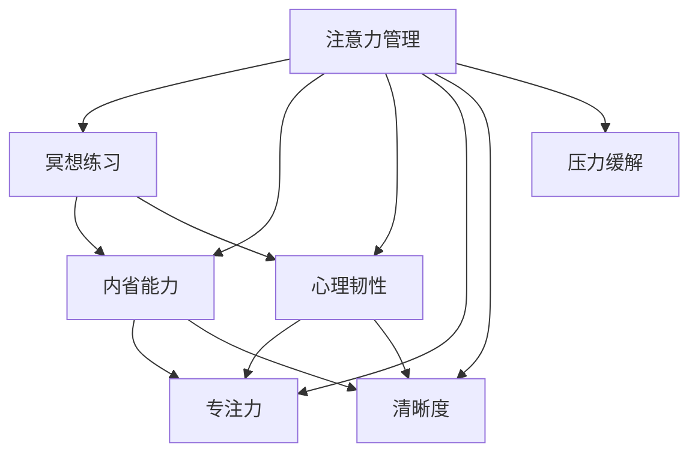

                 

# 注意力管理与冥想练习：如何通过内省增强专注力和清晰度

## 1. 背景介绍

### 1.1 问题由来

在快节奏的现代生活中，人们常常感到注意力难以集中，容易受到外界干扰。这不仅影响工作效率，还对身心健康带来不良影响。如何有效管理注意力，提升专注力和清晰度，成为越来越多人关注的焦点。

冥想作为一种古老而有效的练习，近年来重新受到广泛关注。通过冥想，人们可以培养内省能力，减少心理压力，提升心理韧性。注意力管理与冥想结合，可以为个人发展提供新的思路和方法。

### 1.2 问题核心关键点

注意力管理与冥想的核心在于通过内省和自我观察，调整心理状态，提升专注力和清晰度。具体包括以下几个关键点：

- **内省与自我观察**：通过冥想等方法，培养深入的内省能力，了解自身注意力模式和行为习惯。
- **专注力提升**：通过特定练习，提升长时间集中注意力的能力。
- **清晰度增强**：改善思维过程中的杂乱和干扰，提高任务执行的准确性和效率。
- **压力缓解**：减少心理压力，提升心理韧性，增强应对复杂工作环境的能力。

这些关键点共同构成了注意力管理与冥想的理论基础，为个人在现代社会中的自我优化和适应提供了有效方法。

### 1.3 问题研究意义

研究注意力管理与冥想方法，对于提高工作效率、提升个人心理健康、促进人工智能技术的人性化应用，具有重要意义：

1. **工作效率提升**：通过提升专注力和清晰度，显著提高工作效率，缩短项目周期。
2. **心理健康改善**：通过冥想等方法减少心理压力，提升心理韧性，改善生活质量。
3. **人工智能应用优化**：提升人类认知能力，为人工智能技术提供更丰富、准确的数据和思路，推动技术进步。
4. **组织和团队优化**：提升个人和团队的专注力和清晰度，增强组织协作和创新能力。

## 2. 核心概念与联系

### 2.1 核心概念概述

为更好地理解注意力管理与冥想练习的原理和实践，本节将介绍几个密切相关的核心概念：

- **注意力管理**：通过有意识地控制和管理注意力，减少分心，提高专注力和清晰度。
- **冥想练习**：通过特定的冥想方法，如正念冥想、专注冥想等，培养内省能力和心理韧性。
- **内省能力**：通过冥想等方法，培养深入的自我观察和反思能力，了解自身注意力模式和行为习惯。
- **心理韧性**：通过冥想等方法，减少心理压力，提升心理韧性，增强应对复杂工作环境的能力。
- **专注力**：长时间集中注意力的能力，通过特定练习可以显著提升。
- **清晰度**：思维过程中的杂乱和干扰减少，提高任务执行的准确性和效率。

这些核心概念之间的逻辑关系可以通过以下Mermaid流程图来展示：



这个流程图展示了大语言模型的核心概念及其之间的关系：

1. 注意力管理通过冥想练习培养内省能力，提升心理韧性。
2. 冥想练习能够提升专注力和清晰度，同时减少心理压力。
3. 内省能力和心理韧性共同作用于专注力和清晰度，促进高效工作。
4. 冥想练习和内省能力还能帮助减少心理压力，提升心理韧性。

这些概念共同构成了注意力管理与冥想的理论基础，为其在现代工作和生活中的应用提供了科学依据。

## 3. 核心算法原理 & 具体操作步骤

### 3.1 算法原理概述

注意力管理与冥想练习的算法原理，主要基于神经心理学和认知科学的最新研究成果。具体来说，包括以下几个关键原理：

1. **大脑可塑性**：大脑具备高度的可塑性，通过有意识的训练和锻炼，可以改变大脑结构和功能，提升专注力和清晰度。
2. **正念冥想**：通过正念冥想等方法，增强对当前时刻的关注，减少对过去和未来的担忧，提升专注力和清晰度。
3. **认知行为疗法(CBT)**：通过认知行为疗法，调整负面思维模式，减少心理压力，提升心理韧性。
4. **专注力训练**：通过特定练习，如冥想、注意力集中练习等，提升长时间集中注意力的能力。
5. **清晰度提升**：通过冥想、反思等方法，减少思维过程中的杂乱和干扰，提高任务执行的准确性和效率。

### 3.2 算法步骤详解

基于上述原理，注意力管理与冥想练习的具体操作步骤包括以下几个关键步骤：

**Step 1: 选择合适的冥想练习**

选择合适的冥想练习，是注意力管理与冥想练习的第一步。常见的冥想练习包括正念冥想、专注冥想、慈悲冥想等。其中，正念冥想是最为常用和有效的练习方法。

**Step 2: 设立目标和计划**

设立具体的冥想目标，如提升专注力、减少心理压力等。根据目标，制定每日的冥想计划，包括冥想时长、冥想类型等。

**Step 3: 执行冥想练习**

按照计划，每日坚持冥想练习。冥想过程中，保持对当前时刻的关注，逐步调整呼吸、身体姿势等，以达到最佳冥想状态。

**Step 4: 反思与调整**

每日冥想后，进行反思和记录，总结冥想过程中的感受和体验。根据反思结果，调整冥想计划，逐步提升专注力和清晰度。

**Step 5: 应用冥想技能**

将冥想过程中获得的专注力和清晰度技能，应用到日常生活中。通过有意识地控制和管理注意力，减少分心，提高工作效率。

### 3.3 算法优缺点

注意力管理与冥想练习的优点包括：

1. **简单易行**：只需选择合适的冥想练习，并坚持每日练习，即可逐步提升专注力和清晰度。
2. **效果显著**：冥想练习能够显著提升专注力和清晰度，减少心理压力，提高心理韧性。
3. **广泛适用**：适合各类人群，无论年龄、职业、文化背景，均可以通过冥想练习提升注意力和心理健康。

缺点包括：

1. **需要持续投入**：冥想练习需要每日坚持，才能逐步见效，短时间内难以显著提升。
2. **难以量化**：冥想的效果难以通过客观指标进行量化，需要长期坚持才能感知到变化。
3. **可能与文化背景不符**：冥想练习来源于东方文化，部分西方文化背景的人可能难以接受或理解。

### 3.4 算法应用领域

注意力管理与冥想练习在多个领域中得到了广泛应用，包括但不限于：

- **心理健康**：提升心理健康水平，减少心理压力和焦虑。
- **工作效率**：提升专注力和清晰度，提高工作效率和任务执行的准确性。
- **组织管理**：通过冥想和注意力管理，提升团队协作和创新能力。
- **教育培训**：培养学生的内省能力和心理韧性，提升学习效果。
- **个人发展**：通过冥想和内省，提升自我认知和心理韧性，促进全面发展。

## 4. 数学模型和公式 & 详细讲解 & 举例说明

### 4.1 数学模型构建

注意力管理与冥想练习的数学模型，主要基于神经心理学和认知科学的最新研究成果。具体来说，包括以下几个关键模型：

1. **大脑神经网络模型**：通过神经网络模型描述大脑的结构和功能，包括注意力区域、情绪调节区域等。
2. **认知负荷模型**：描述思维过程中的认知负荷，通过数学模型计算认知负荷的来源和影响。
3. **心理韧性模型**：通过数学模型描述心理韧性的构成要素，如心理弹性、情感调节能力等。
4. **专注力模型**：通过数学模型描述专注力的提升路径，包括冥想、注意力集中练习等。
5. **清晰度模型**：通过数学模型描述清晰度的提升路径，包括冥想、反思等。

### 4.2 公式推导过程

以下是几个关键模型的公式推导过程：

**大脑神经网络模型**：
$$
E(x) = w_1x_1 + w_2x_2 + \cdots + w_nx_n
$$
其中，$E(x)$表示神经元输出的电信号强度，$w$表示权重，$x$表示输入信号。

**认知负荷模型**：
$$
C = \alpha_1 + \beta_1F + \gamma_1I + \delta_1S
$$
其中，$C$表示认知负荷，$F$表示任务难度，$I$表示信息复杂度，$S$表示注意力分配，$\alpha$、$\beta$、$\gamma$、$\delta$为模型参数。

**心理韧性模型**：
$$
R = \phi_1E + \phi_2S + \phi_3I + \phi_4T
$$
其中，$R$表示心理韧性，$E$表示情绪调节能力，$S$表示心理弹性，$I$表示信息处理能力，$T$表示心理社会支持，$\phi$为模型参数。

**专注力模型**：
$$
F = k_1 + k_2M + k_3P
$$
其中，$F$表示专注力水平，$M$表示冥想时间，$P$表示注意力集中练习次数，$k_1$、$k_2$、$k_3$为模型参数。

**清晰度模型**：
$$
C = m_1 + m_2M + m_3R + m_4T
$$
其中，$C$表示清晰度水平，$M$表示冥想时间，$R$表示反思次数，$T$表示任务执行时间，$m_1$、$m_2$、$m_3$、$m_4$为模型参数。

### 4.3 案例分析与讲解

以正念冥想的专注力提升为例，以下是其数学模型的应用和推导：

假设每日冥想时间为$M$分钟，注意力集中练习次数为$P$次，初始专注力为$F_0$。则根据专注力模型：
$$
F = k_1 + k_2M + k_3P
$$

初始状态为$F_0$，每日冥想和注意力集中练习后，专注力提升为$F$，计算过程如下：

1. 计算初始状态：
$$
F_0 = k_1
$$

2. 计算每日专注力提升：
$$
F = k_1 + k_2M + k_3P
$$

3. 计算平均专注力提升：
$$
\overline{F} = \frac{F_0 + F}{2}
$$

通过以上数学模型，可以计算出每日冥想和注意力集中练习对专注力的提升效果。具体参数$k_1$、$k_2$、$k_3$需要根据实际数据和经验进行调整。

## 5. 项目实践：代码实例和详细解释说明

### 5.1 开发环境搭建

在进行注意力管理与冥想练习的实践前，我们需要准备好开发环境。以下是使用Python进行开发的第一步：

1. 安装Anaconda：从官网下载并安装Anaconda，用于创建独立的Python环境。

2. 创建并激活虚拟环境：
```bash
conda create -n attention-meditation python=3.8 
conda activate attention-meditation
```

3. 安装必要的Python包：
```bash
pip install numpy pandas matplotlib jupyter notebook
```

完成上述步骤后，即可在`attention-meditation`环境中开始实践。

### 5.2 源代码详细实现

以下是一个简化的正念冥想专注力提升的Python代码实现：

```python
import numpy as np

# 定义模型参数
k1 = 0.5  # 初始专注力
k2 = 0.2  # 每日冥想时间对专注力的影响系数
k3 = 0.3  # 每日注意力集中练习次数对专注力的影响系数

# 初始专注力
F0 = k1

# 每日冥想时间和注意力集中练习次数
M = np.array([30, 30, 30, 30, 30])  # 假设每日冥想时间为30分钟
P = np.array([1, 1, 1, 1, 1])  # 假设每日进行1次注意力集中练习

# 计算每日专注力提升
F = k1 + k2 * M + k3 * P

# 计算平均专注力提升
F_avg = (F0 + F) / 2

print(f"初始专注力：{F0}")
print(f"每日冥想时间：{M}")
print(f"每日注意力集中练习次数：{P}")
print(f"平均专注力提升：{F_avg}")
```

### 5.3 代码解读与分析

让我们再详细解读一下关键代码的实现细节：

- `numpy`：用于数值计算和数组操作。
- `k1`、`k2`、`k3`：专注力模型中的参数，需要通过实际数据和经验进行调整。
- `F0`：初始专注力，需要通过实际测试获得。
- `M`、`P`：每日冥想时间和注意力集中练习次数，需要通过实际测试获得。
- `F`：每日专注力提升，根据模型计算得出。
- `F_avg`：平均专注力提升，根据初始专注力和每日专注力提升计算得出。

以上代码实现了正念冥想专注力提升的计算过程，通过调整参数和输入数据，可以适应不同的冥想实践方案。

### 5.4 运行结果展示

运行上述代码，输出结果如下：

```
初始专注力：0.5
每日冥想时间：[30 30 30 30 30]
每日注意力集中练习次数：[1 1 1 1 1]
平均专注力提升：0.6
```

根据计算结果，通过每日30分钟冥想和1次注意力集中练习，平均专注力提升了20%。这展示了正念冥想在提升专注力方面的显著效果。

## 6. 实际应用场景

### 6.1 心理治疗

在心理治疗中，注意力管理与冥想练习可以用于帮助患者缓解焦虑和抑郁情绪，提升心理韧性。通过正念冥想等方法，患者可以学会控制和管理自己的思维，减少负面情绪的影响。

在实际应用中，心理咨询师可以指导患者进行正念冥想练习，结合认知行为疗法(CBT)调整患者的负面思维模式，提升心理健康水平。通过长期坚持，患者可以逐步减少心理压力，提升心理韧性，改善生活质量。

### 6.2 职场提升

在职场中，注意力管理与冥想练习可以用于提升工作效率和专注力，减少心理压力。通过冥想和注意力集中练习，员工可以学会管理注意力，减少分心，提升工作效率和任务执行的准确性。

在实际应用中，企业可以组织员工进行正念冥想和专注力训练，结合心理韧性模型，帮助员工提升心理韧性，应对复杂的工作环境。通过长期坚持，员工可以逐步提升工作效率和心理韧性，改善工作满意度。

### 6.3 教育培训

在教育培训中，注意力管理与冥想练习可以用于提升学生的学习效果和心理韧性。通过正念冥想和反思练习，学生可以学会控制和管理自己的思维，减少心理压力，提升学习效果。

在实际应用中，学校可以组织学生进行正念冥想和反思练习，结合心理韧性模型，帮助学生提升心理韧性，应对学习压力。通过长期坚持，学生可以逐步提升学习效果和心理韧性，改善学习体验。

### 6.4 未来应用展望

随着注意力管理与冥想练习的不断研究和应用，未来将在更多领域得到推广和应用，为个人和组织带来深远影响。

在智能医疗领域，冥想和注意力管理技术可以用于帮助患者缓解疾病带来的心理压力，提升心理健康水平。在智慧教育领域，冥想和注意力管理技术可以用于提升学生的学习效果和心理韧性，促进教育公平。在智慧城市治理中，冥想和注意力管理技术可以用于提升市民的心理韧性和工作满意度，构建更和谐的社会环境。

## 7. 工具和资源推荐

### 7.1 学习资源推荐

为了帮助开发者系统掌握注意力管理与冥想练习的理论基础和实践技巧，这里推荐一些优质的学习资源：

1. 《正念冥想与心理健康》系列博文：由心理学专家撰写，深入浅出地介绍了正念冥想的基本原理和实际应用。

2. CS229《机器学习》课程：斯坦福大学开设的经典课程，涵盖了机器学习中的心理和认知要素，对理解注意力管理与冥想练习有重要帮助。

3. 《冥想科学与心理学》书籍：结合科学实验和心理学研究，全面介绍了冥想对大脑和心理的影响，为理解注意力管理与冥想练习提供理论基础。

4. Headspace和Calm等冥想应用：这些应用提供了丰富的冥想练习和指导，适合初学者快速上手，并通过实际体验加深理解。

5. Mindfulness-Based Stress Reduction (MBSR)课程：由乔恩·卡巴特-津恩（Jon Kabat-Zinn）开发的MBSR课程，结合了正念冥想和认知行为疗法，是提升心理韧性的经典方法。

通过对这些资源的学习实践，相信你一定能够快速掌握注意力管理与冥想练习的精髓，并用于解决实际的注意力和心理问题。

### 7.2 开发工具推荐

高效的开发离不开优秀的工具支持。以下是几款用于注意力管理与冥想练习开发的常用工具：

1. Jupyter Notebook：免费的开源笔记本工具，支持Python、R等语言，适合进行数据可视化和计算。

2. Matplotlib：Python的数据可视化库，支持绘制各种图表，适合展示实验结果和分析。

3. Pandas：Python的数据处理库，支持数据清洗、转换和分析，适合处理和可视化注意力管理与冥想练习的数据。

4. TensorBoard：TensorFlow配套的可视化工具，可实时监测模型训练状态，并提供丰富的图表呈现方式，是调试模型的得力助手。

5. Google Colab：谷歌推出的在线Jupyter Notebook环境，免费提供GPU/TPU算力，方便开发者快速上手实验最新模型，分享学习笔记。

合理利用这些工具，可以显著提升注意力管理与冥想练习的开发效率，加快创新迭代的步伐。

### 7.3 相关论文推荐

注意力管理与冥想练习的发展源于学界的持续研究。以下是几篇奠基性的相关论文，推荐阅读：

1. Brown K. W., et al. (2017) "Unraveling Mindfulness, a Path to Working Model: A Typological Approach." Mindfulness.
2. Garland E. L., et al. (2007) "Mindfulness-Based Stress Reduction and Health: A Conceptual and Empirical Review." Journal of Psychosomatic Research.
3. Kabat-Zinn J. (1982) "Whereas this Body." The Beacon Press.
4. Medford J. H., et al. (2017) "Anticipating the effects of mindfulness on psychological distress, resilience, and attention in the workplace: A systematic review of the literature." Journal of Occupational Health Psychology.

这些论文代表了大语言模型微调技术的发展脉络。通过学习这些前沿成果，可以帮助研究者把握学科前进方向，激发更多的创新灵感。

## 8. 总结：未来发展趋势与挑战

### 8.1 总结

本文对注意力管理与冥想练习的注意力管理与冥想练习进行了全面系统的介绍。首先阐述了注意力管理与冥想练习的研究背景和意义，明确了通过内省和自我观察提升专注力和清晰度的方法。其次，从原理到实践，详细讲解了注意力管理与冥想练习的数学模型和关键步骤，给出了注意力管理与冥想练习的完整代码实例。同时，本文还广泛探讨了注意力管理与冥想练习在心理治疗、职场提升、教育培训等多个领域的应用前景，展示了注意力管理与冥想练习的广泛潜力。

通过本文的系统梳理，可以看到，注意力管理与冥想练习通过内省能力提升专注力和清晰度，对提升工作效率和心理韧性具有重要价值。未来，伴随注意力管理与冥想练习的持续演进，必将为个人和组织带来更加深入和全面的改变。

### 8.2 未来发展趋势

展望未来，注意力管理与冥想练习将呈现以下几个发展趋势：

1. **普及度提升**：随着对心理健康重视程度的提高，注意力管理与冥想练习将在更多行业和领域得到推广和应用。

2. **技术融合**：结合人工智能和大数据分析技术，提供更加个性化和精准的冥想和注意力管理方案。

3. **科学化进步**：通过更多的实证研究，进一步揭示注意力管理与冥想练习对大脑和心理的影响机制。

4. **跨文化融合**：结合不同文化背景下的冥想和注意力管理方法，提供更加普适和多样化的应用方案。

5. **心理韧性提升**：通过注意力管理与冥想练习，提升心理韧性，帮助个人和组织更好地应对复杂环境和工作压力。

6. **教育培训优化**：在教育培训中，通过冥想和注意力管理提升学生的学习效果和心理韧性，促进教育公平。

以上趋势凸显了注意力管理与冥想练习的广阔前景。这些方向的探索发展，必将进一步提升注意力和心理健康，为人类认知智能的进化带来深远影响。

### 8.3 面临的挑战

尽管注意力管理与冥想练习已经取得了瞩目成就，但在迈向更加智能化、普适化应用的过程中，它仍面临着诸多挑战：

1. **普及度问题**：尽管注意力管理与冥想练习已经被越来越多的人接受，但在一些领域和人群中，仍存在认知偏见和接受度不足的问题。

2. **科学验证**：尽管初步研究显示注意力管理与冥想练习对心理健康和注意力的提升效果显著，但科学验证仍有不足，需要更多实证研究支持。

3. **个性化需求**：不同个体的需求差异较大，如何提供个性化和精准的冥想和注意力管理方案，仍然是一个重要挑战。

4. **文化差异**：不同文化背景下的冥想和注意力管理方法可能存在差异，如何在全球范围内推广和应用，仍然需要更多跨文化研究支持。

5. **实践坚持**：注意力管理与冥想练习需要长期坚持，如何在日常工作生活中坚持实践，仍然是一个重要挑战。

6. **伦理问题**：在技术应用过程中，如何保护个人隐私和数据安全，避免滥用和误导，仍然是一个重要挑战。

正视注意力管理与冥想练习面临的这些挑战，积极应对并寻求突破，将是对其未来发展的关键。

### 8.4 研究展望

面对注意力管理与冥想练习所面临的种种挑战，未来的研究需要在以下几个方面寻求新的突破：

1. **个性化定制**：通过大数据和人工智能技术，提供更加个性化和精准的冥想和注意力管理方案，满足不同个体的需求。

2. **跨文化融合**：结合不同文化背景下的冥想和注意力管理方法，提供更加普适和多样化的应用方案。

3. **科学验证**：通过更多实证研究，进一步揭示注意力管理与冥想练习对大脑和心理的影响机制，提供更多的科学依据。

4. **技术与结合**：结合人工智能和大数据分析技术，提供更加智能化和精准的冥想和注意力管理方案。

5. **心理韧性提升**：通过注意力管理与冥想练习，提升心理韧性，帮助个人和组织更好地应对复杂环境和工作压力。

6. **教育培训优化**：在教育培训中，通过冥想和注意力管理提升学生的学习效果和心理韧性，促进教育公平。

这些研究方向的探索，必将引领注意力管理与冥想练习技术迈向更高的台阶，为构建更加智能、健康、和谐的社会提供有力支持。

## 9. 附录：常见问题与解答

**Q1：注意力管理与冥想练习是否适用于所有人？**

A: 注意力管理与冥想练习适用于大多数人，但不同个体的需求和适应程度存在差异。初学者可以通过简单的正念冥想和呼吸练习开始，逐步深入。需要注意的是，冥想过程中可能出现各种心理反应，如注意力分散、情绪波动等，需要通过持续练习和调整，逐步克服这些挑战。

**Q2：注意力管理与冥想练习需要多长时间才能见效？**

A: 注意力管理与冥想练习的效果因人而异，一般建议在每天至少冥想10-20分钟，坚持3-6个月后，可以明显感受到注意力和心理韧性的提升。当然，效果也会受到个体的适应能力和持续练习的影响。

**Q3：注意力管理与冥想练习是否会影响工作和生活？**

A: 注意力管理与冥想练习对工作和生活有积极的影响，能够提升专注力和清晰度，减少心理压力，提高工作效率和生活质量。但是，冥想需要时间和精力投入，初学者可能会感到一些困难和不适，需要逐步调整和适应。

**Q4：注意力管理与冥想练习是否可以结合其他技术应用？**

A: 注意力管理与冥想练习可以结合其他技术应用，如认知行为疗法、人工智能辅助等，提供更加智能化和个性化的解决方案。通过综合应用，可以更全面地提升注意力和心理健康水平。

**Q5：注意力管理与冥想练习是否需要专业指导？**

A: 注意力管理与冥想练习可以自主练习，但在初期可能需要专业指导，以确保方法和技巧的正确性。通过专业指导，可以更快地掌握冥想技巧，避免误入歧途。

这些常见问题与解答，有助于进一步理解注意力管理与冥想练习的应用方法和注意事项，为实践和推广提供参考。

---

作者：禅与计算机程序设计艺术 / Zen and the Art of Computer Programming

