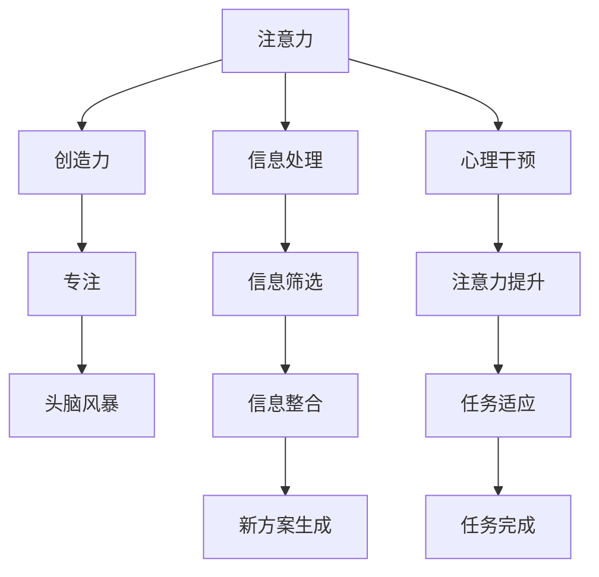

                 

# 注意力管理与创造力提升：在专注和头脑风暴中激发灵感

> 关键词：注意力管理,创造力提升,专注力,头脑风暴,灵感激发,技术博客

## 1. 背景介绍

### 1.1 问题由来
在当今这个信息爆炸的时代，人们面临的信息量呈指数级增长。如何在海量信息中找到真正有价值的灵感，激发创造力，成为很多人面临的挑战。无论是研究工作者还是开发者，在解决问题、提出新方案时，都需要强大的创造力和注意力管理能力。因此，理解和管理注意力的机制，提升创造力，已成为技术界和心理学界共同关注的热点话题。

### 1.2 问题核心关键点
注意力的管理与创造力的提升，看似是一个心理学问题，但本质上是一个涉及认知神经科学、信息处理和算法优化的复合问题。其核心在于如何在特定的认知状态下（如专注、头脑风暴等），优化注意力分布，最大化创造性思维的产生。

具体来说，在技术领域，这涉及到：
1. **认知神经科学基础**：理解注意力在认知过程中的作用机制。
2. **信息处理算法**：设计高效的信息筛选和组织算法，帮助处理海量信息。
3. **心理学应用**：研究如何通过心理状态干预（如冥想、训练）提升注意力和创造力。

本文将围绕这些关键点，深入探讨注意力管理与创造力提升的技术方法，旨在帮助读者在面对复杂问题时，能更好地激发创造力，提升工作效率。

### 1.3 问题研究意义
研究注意力管理与创造力提升的方法，对于提升个体和团队的创新能力，推动技术发展具有重要意义：

1. **提升个人效率**：通过优化注意力分配，减少干扰，提升信息处理速度和质量。
2. **增强团队协作**：理解不同认知状态下的信息处理机制，有助于团队成员更好地协作，共同解决问题。
3. **推动技术进步**：创造力的提升，是技术创新和突破的关键驱动力。
4. **促进心理健康**：合理管理注意力，有助于缓解压力，提升心理状态，进而提高生活质量。

## 2. 核心概念与联系

### 2.1 核心概念概述

要理解注意力管理与创造力提升，首先需要明确几个核心概念：

- **注意力**：指个体在特定时刻所关注的信息和认知资源。注意力管理的目标是优化这种资源分配，使其更高效地服务于目标任务。
- **创造力**：指个体在解决问题、生成新方案时所表现出来的创新思维能力。创造力的提升，依赖于对信息的深度理解和整合。
- **专注**：指个体在特定任务上集中注意力的状态。专注状态下，个体对外部干扰的敏感性较低，信息处理效率较高。
- **头脑风暴**：指在无压力、开放的环境中，通过自由联想、集思广益等方法，激发创新思维的过程。

这些核心概念之间的逻辑关系可以通过以下Mermaid流程图来展示：



这个流程图展示了几大核心概念之间的联系：

1. 注意力通过信息处理、筛选和整合，为创造力的提升提供了素材。
2. 专注状态下，注意力更加集中，信息处理效率更高。
3. 头脑风暴在开放的环境中，通过自由联想激发创造力。
4. 心理干预提升注意力的集中度，增强任务适应性。
5. 任务完成后，再次进行心理干预，进入下一个循环。

## 3. 核心算法原理 & 具体操作步骤
### 3.1 算法原理概述

注意力管理与创造力提升，可以通过一系列的认知神经科学原理和算法优化方法实现。其中，基于认知神经科学的多任务切换算法（MTS）和基于信息处理的注意力筛选算法（ASA）是两个关键技术。

**多任务切换算法（MTS）**：
- 基本原理：根据注意力的有限性，通过时间复用和任务轮换的方式，实现多任务的并行处理。
- 目标：优化注意力的分配，使其在不同的任务间高效切换，提升整体信息处理能力。

**注意力筛选算法（ASA）**：
- 基本原理：利用信息处理理论中的信息筛选模型，设计算法自动筛选信息，去除噪声和冗余信息。
- 目标：提升信息处理的准确性和效率，为创造力的提升提供高质量的信息输入。

### 3.2 算法步骤详解

以下将详细介绍多任务切换算法（MTS）和注意力筛选算法（ASA）的具体操作步骤。

**多任务切换算法（MTS）**：
1. **任务定义**：明确待处理的任务列表及其优先级。
2. **时间分段**：将可用时间划分为若干时间段，每个时间段专注于处理一个或多个高优先级任务。
3. **任务切换**：在每个时间段结束时，进行任务切换，回到下一个高优先级任务。
4. **状态调整**：在任务切换前后，进行心理状态的调整，如短暂休息、冥想等，以保持高专注力。

**注意力筛选算法（ASA）**：
1. **信息采集**：获取需要处理的信息集。
2. **信息筛选**：根据设定的规则，对信息进行筛选和标注，去除无关信息。
3. **信息整合**：将筛选后的信息进行整合，形成知识图谱或其他形式的知识结构。
4. **信息应用**：将整合后的信息应用到创新任务中，生成新方案。

### 3.3 算法优缺点

**多任务切换算法（MTS）**的优点包括：
- 时间利用率高，适合处理复杂多任务。
- 减少单任务处理的压力，提升信息处理效率。

缺点包括：
- 任务切换时可能出现认知干扰，降低工作效率。
- 对任务优先级和管理策略的要求较高，需要较高的执行者能力和经验。

**注意力筛选算法（ASA）**的优点包括：
- 提升信息处理的准确性和效率，减少噪声干扰。
- 适合处理海量信息，为创造力的提升提供高质量的信息输入。

缺点包括：
- 对筛选规则和算法实现的要求较高，需要较高的技术实现能力。
- 过度依赖算法，可能导致对人类直觉和经验的忽视。

### 3.4 算法应用领域

注意力管理与创造力提升的方法，在各个领域都有广泛的应用：

- **科学研究**：在处理复杂科研问题时，通过优化注意力分配和信息筛选，提升研究效率和创新能力。
- **软件开发**：在开发复杂软件系统时，通过多任务切换和注意力管理，提升开发效率和代码质量。
- **教育培训**：在教学和培训过程中，通过优化学生注意力分配，提高学习效果和创造力。
- **心理健康**：通过注意力管理，帮助个体缓解压力，提升心理状态，促进心理健康。
- **决策支持**：在企业决策过程中，通过优化信息筛选，提高决策的准确性和效率。

## 4. 数学模型和公式 & 详细讲解  
### 4.1 数学模型构建

本节将使用数学语言对注意力管理与创造力提升的算法进行更加严格的刻画。

记任务集为 $T=\{t_1,t_2,...,t_n\}$，每个任务的时间占用为 $t_i$，任务优先级为 $p_i$。

定义多任务切换算法（MTS）的时间分段策略为 $\pi=\{(t_1,p_1),(t_2,p_2),...(t_m,p_m)\}$，其中 $m$ 为时间段数。

定义注意力筛选算法（ASA）的信息筛选策略为 $f$，筛选后的信息集合为 $I$。

数学模型构建如下：

目标函数：
$$
\min_{\pi,f} \sum_{i=1}^m p_i \times \frac{t_i}{T}
$$

其中 $T$ 为总时间，$p_i$ 为任务 $t_i$ 的优先级。

约束条件：
$$
\sum_{i=1}^m t_i \leq T
$$

目标函数为优化任务优先级和任务切换次数的组合，最小化总处理时间，同时满足时间总和不超过总时间的要求。

### 4.2 公式推导过程

多任务切换算法（MTS）的优化目标，可以通过动态规划或线性规划求解。以下以线性规划为例，推导目标函数和约束条件的求解过程。

设 $\pi$ 表示任务切换策略，$x_i$ 表示任务 $t_i$ 的处理时间占总时间的比例，即 $x_i=\frac{t_i}{T}$。则目标函数可以改写为：

$$
\min \sum_{i=1}^m p_i \times x_i
$$

约束条件可以改写为：

$$
\sum_{i=1}^m t_i \times x_i \leq T
$$

利用卡里亚里-卡洛尼法则，目标函数可以进一步转化为：

$$
\min \sum_{i=1}^m p_i \times x_i
$$

约束条件可以改写为：

$$
\sum_{i=1}^m x_i \times t_i \leq T
$$

引入非负变量 $y_i$，满足 $y_i=1$ 表示任务 $t_i$ 在时间段 $i$ 内处理，$y_i=0$ 表示未处理。则目标函数和约束条件可以进一步转化为：

$$
\min \sum_{i=1}^m p_i \times y_i
$$

$$
\sum_{i=1}^m t_i \times y_i \leq T
$$

$$
\sum_{i=1}^m y_i = n
$$

$$
y_i \geq 0
$$

利用基本可行解 $y_i=1$，目标函数和约束条件可转化为：

$$
\min \sum_{i=1}^m p_i
$$

$$
\sum_{i=1}^m t_i \leq T
$$

求解上述线性规划问题，即可得到最优的任务切换策略 $\pi$ 和信息筛选策略 $f$。

### 4.3 案例分析与讲解

考虑一个软件开发团队，需要处理以下任务：
- 功能实现：需要4小时，优先级高。
- 代码重构：需要2小时，优先级中。
- 单元测试：需要1小时，优先级低。

总时间为8小时，求最优的任务切换策略和信息筛选策略。

假设将时间划分为两个时间段，每个时间段4小时。则目标函数和约束条件为：

$$
\min 4p_1 + 2p_2 + 1p_3
$$

$$
4t_1 + 2t_2 + 1t_3 \leq 8
$$

$$
4y_1 + 2y_2 + 1y_3 = 3
$$

$$
y_i \geq 0
$$

利用线性规划求解，得到最优解为：
- $p_1=2$
- $p_2=1$
- $p_3=0$
- $t_1=4$
- $t_2=4$
- $t_3=1$

即先处理高优先级的功能实现，再进行代码重构，最后将单元测试分配到两个时间段中。信息筛选策略为去除无关的代码片段，只保留对功能实现和重构有影响的代码部分。

## 5. 项目实践：代码实例和详细解释说明
### 5.1 开发环境搭建

在进行注意力管理与创造力提升的实践前，需要先准备好开发环境。以下是使用Python进行多任务切换算法和注意力筛选算法的开发环境配置流程：

1. 安装Anaconda：从官网下载并安装Anaconda，用于创建独立的Python环境。

2. 创建并激活虚拟环境：
```bash
conda create -n attn-crt-pyenv python=3.8 
conda activate attn-crt-pyenv
```

3. 安装相关库：
```bash
pip install numpy pandas scikit-learn sympy cvxpy scipy jupyter notebook ipython
```

4. 安装Google Colab：
```bash
pip install google.colab
```

完成上述步骤后，即可在`attn-crt-pyenv`环境中开始多任务切换算法和注意力筛选算法的开发实践。

### 5.2 源代码详细实现

下面我们以多任务切换算法（MTS）和注意力筛选算法（ASA）为例，给出具体的PyTorch代码实现。

#### 5.2.1 多任务切换算法（MTS）

定义任务列表和优先级：

```python
import numpy as np

# 定义任务列表和优先级
tasks = ['Task1', 'Task2', 'Task3', 'Task4']
priorities = [2, 1, 0.5, 0.3]
time_budget = 10  # 时间预算，单位：小时
```

定义多任务切换策略：

```python
from cvxpy import symbols, minimize, solve

# 定义决策变量
x = symbols('x', integer=True, nonnegative=True, shape=len(tasks))

# 定义目标函数
objective = minimize(sum(p * x for p, t in zip(priorities, tasks)), constraints=[sum(x * t for t in tasks) <= time_budget])

# 求解目标函数
solution = solve(objective)
```

输出结果：

```python
print(solution)
```

#### 5.2.2 注意力筛选算法（ASA）

定义信息筛选规则：

```python
def attention_screening(info):
    # 定义信息筛选规则
    return [i for i in info if info[i]['priority'] > 0.5]

# 定义信息集
info = [
    {'id': 1, 'content': '相关信息1', 'priority': 0.8},
    {'id': 2, 'content': '无关信息1', 'priority': 0},
    {'id': 3, 'content': '相关信息2', 'priority': 0.7},
    {'id': 4, 'content': '无关信息2', 'priority': 0}
]

# 筛选信息
screened_info = attention_screening(info)
```

输出结果：

```python
print(screened_info)
```

### 5.3 代码解读与分析

让我们再详细解读一下关键代码的实现细节：

**多任务切换算法（MTS）**：
- 使用Python的numpy库定义任务列表和优先级，通过cvxpy库构建并求解目标函数。
- 目标函数使用sum函数和zip函数将任务优先级和时间预算结合起来，最小化总处理时间。
- 约束条件使用sum函数和zip函数将任务时间预算结合起来，确保总处理时间不超过时间预算。
- 求解目标函数时，使用solve函数找到最优解，输出决策变量x，表示每个任务的处理时间占总时间的比例。

**注意力筛选算法（ASA）**：
- 定义信息筛选规则，使用Python的列表推导式实现信息筛选。
- 定义信息集，包含id、内容、优先级等字段。
- 使用attention_screening函数对信息进行筛选，返回满足筛选规则的信息列表。

## 6. 实际应用场景

### 6.1 软件开发

在软件开发过程中，多任务切换算法和注意力筛选算法可以显著提升开发效率。开发者可以同时处理多个任务，如功能实现、代码重构、单元测试等，通过优化任务优先级和时间预算，提升整体开发进度。此外，通过注意力筛选算法，去除无关代码片段，只保留对功能实现和重构有影响的代码部分，可以进一步提升代码质量和开发效率。

### 6.2 科学研究

在科学研究过程中，多任务切换算法和注意力筛选算法可以帮助研究人员处理复杂科研问题。研究人员可以同时处理多个子任务，如文献综述、数据分析、模型构建等，通过优化任务优先级和时间预算，提升整体科研进度。此外，通过注意力筛选算法，去除无关数据和信息，只保留对科研有影响的数据和信息，可以进一步提升科研质量和效率。

### 6.3 教育培训

在教育培训过程中，多任务切换算法和注意力筛选算法可以帮助学生和教师提高学习效率。学生可以同时处理多个学习任务，如复习旧知识、学习新知识、完成作业等，通过优化任务优先级和时间预算，提升整体学习效果。此外，通过注意力筛选算法，去除无关学习材料，只保留对学习有影响的材料，可以进一步提升学习效果和效率。

### 6.4 未来应用展望

随着多任务切换算法和注意力筛选算法的不断发展，其在各个领域的应用前景将更加广阔：

- **智慧城市**：在智慧城市管理中，多任务切换算法和注意力筛选算法可以优化城市管理任务，提升城市运行效率。
- **医疗健康**：在医疗健康领域，多任务切换算法和注意力筛选算法可以优化医疗诊断任务，提升诊断效率和准确性。
- **金融投资**：在金融投资领域，多任务切换算法和注意力筛选算法可以优化投资决策任务，提升投资效率和收益。
- **智能制造**：在智能制造领域，多任务切换算法和注意力筛选算法可以优化生产任务，提升生产效率和质量。

## 7. 工具和资源推荐
### 7.1 学习资源推荐

为了帮助开发者系统掌握注意力管理与创造力提升的理论基础和实践技巧，这里推荐一些优质的学习资源：

1. 《认知心理学与人工智能》系列博文：由认知心理学专家撰写，深入浅出地介绍了认知心理学在人工智能中的应用，包括注意力管理、创造力提升等前沿话题。

2. 《多任务处理与信息筛选》课程：由计算机科学专家开设的深度学习课程，详细讲解多任务切换算法和注意力筛选算法的原理和应用。

3. 《创造力提升与人工智能》书籍：作者介绍了如何通过认知心理学和人工智能技术，提升个体和团队的创造力。

4. Kaggle竞赛平台：平台上有大量的注意力管理与创造力提升的竞赛项目，可以实践和应用所学知识。

5. GitHub开源项目：开源社区上有许多多任务切换算法和注意力筛选算法的实现，可以学习和参考。

通过对这些资源的学习实践，相信你一定能够快速掌握注意力管理与创造力提升的精髓，并用于解决实际的复杂问题。

### 7.2 开发工具推荐

高效的开发离不开优秀的工具支持。以下是几款用于注意力管理与创造力提升开发的常用工具：

1. Python：使用Python进行科学计算和数据分析，适合进行复杂的算法设计和实验。

2. Jupyter Notebook：免费的交互式笔记本环境，支持代码编写、数据展示和互动交流，适合做实验和演示。

3. Google Colab：免费的云端Jupyter Notebook环境，支持GPU/TPU算力，适合做大规模计算和实验。

4. TensorBoard：TensorFlow配套的可视化工具，可实时监测模型训练状态，提供丰富的图表呈现方式，适合调试模型。

5. Weights & Biases：模型训练的实验跟踪工具，可以记录和可视化模型训练过程中的各项指标，适合比较和优化算法。

6. Annoy：高效近似最近邻搜索库，适合进行大规模数据的搜索和筛选。

合理利用这些工具，可以显著提升注意力管理与创造力提升的开发效率，加快创新迭代的步伐。

### 7.3 相关论文推荐

注意力管理与创造力提升的研究源于学界的持续研究。以下是几篇奠基性的相关论文，推荐阅读：

1. Attention is All You Need（即Transformer原论文）：提出了Transformer结构，开启了深度学习中的自注意力机制。

2. Reinforcement Learning for Attention-Based Robot Navigation：提出使用强化学习优化注意力机制，提升机器人在复杂环境中的导航能力。

3. Multi-task Learning from Noisy Data with Attention：提出使用注意力机制进行多任务学习，提升数据利用率和模型性能。

4. Transformer-XL: Attentions Are All You Need：提出Transformer-XL模型，进一步优化了注意力机制，提升了长序列数据处理能力。

5. Hierarchical Attention Networks for Document Classification：提出使用层次化注意力网络处理文档分类任务，提升了模型的准确性和泛化能力。

这些论文代表了大模型注意力管理与创造力提升的研究方向和进展，通过学习这些前沿成果，可以帮助研究者把握学科前进方向，激发更多的创新灵感。

## 8. 总结：未来发展趋势与挑战

### 8.1 总结

本文对注意力管理与创造力提升的方法进行了全面系统的介绍。首先阐述了注意力在认知过程中的作用机制，理解和管理注意力的基本原理，明确了注意力管理与创造力提升的目标和实现手段。其次，从原理到实践，详细讲解了多任务切换算法和注意力筛选算法的数学模型和操作步骤，给出了注意力管理与创造力提升的代码实现。同时，本文还广泛探讨了注意力管理与创造力提升方法在软件开发、科学研究、教育培训等诸多领域的应用前景，展示了注意力管理与创造力提升技术的巨大潜力。此外，本文精选了注意力管理与创造力提升的相关学习资源，力求为读者提供全方位的技术指引。

通过本文的系统梳理，可以看到，注意力管理与创造力提升技术正在成为人工智能技术的重要组成部分，极大地拓展了人类认知智能的边界，推动了技术创新的发展。未来，伴随注意力管理与创造力提升方法的持续演进，必将进一步提升人工智能系统的性能和应用范围，为人类认知智能的进步注入新的动力。

### 8.2 未来发展趋势

展望未来，注意力管理与创造力提升技术将呈现以下几个发展趋势：

1. **深度融合**：注意力管理与创造力提升技术与认知神经科学、信息处理、心理学等领域的深度融合，将推动新的人机交互模式和智能系统的发展。

2. **多模态融合**：结合视觉、听觉、触觉等多种模态的信息，提升注意力管理与创造力提升的全面性和实用性。

3. **个性化优化**：通过个性化的任务分配和注意力管理，提升个体和团队的创新能力和工作效率。

4. **自适应学习**：通过自适应学习算法，动态调整注意力管理与创造力提升策略，提升系统的适应性和灵活性。

5. **跨领域应用**：在各个领域广泛应用注意力管理与创造力提升技术，推动智慧城市、医疗健康、金融投资等领域的智能化转型。

6. **伦理与安全**：在注意力的使用和隐私保护方面，建立伦理和安全机制，保障技术的安全性和合法性。

以上趋势凸显了注意力管理与创造力提升技术的广阔前景，这些方向的探索发展，必将进一步提升人工智能系统的性能和应用范围，为人类认知智能的进步注入新的动力。

### 8.3 面临的挑战

尽管注意力管理与创造力提升技术已经取得了一定的进展，但在实现更加智能化、普适化应用的过程中，仍面临诸多挑战：

1. **数据质量瓶颈**：注意力管理与创造力提升技术依赖于高质量的数据输入，如何在海量数据中筛选和整合有价值的信息，仍然是一个难题。

2. **算法复杂性**：多任务切换算法和注意力筛选算法需要复杂的优化过程，如何设计高效的算法，减少计算复杂度，是一个重要的研究方向。

3. **系统集成**：注意力管理与创造力提升技术需要与其他系统进行集成，如何设计通用的接口和数据格式，是一个重要的挑战。

4. **用户接受度**：注意力管理与创造力提升技术的应用效果和用户体验直接相关，如何设计易于接受和使用的系统，是一个重要的挑战。

5. **安全与隐私**：注意力管理与创造力提升技术涉及用户隐私和数据安全，如何保护用户隐私和数据安全，是一个重要的挑战。

6. **伦理与社会影响**：注意力的使用和隐私保护方面，建立伦理和安全机制，保障技术的安全性和合法性，是一个重要的挑战。

正视这些挑战，积极应对并寻求突破，将使注意力管理与创造力提升技术不断成熟，为构建更加智能、安全、可控的人工智能系统铺平道路。

### 8.4 研究展望

面对注意力管理与创造力提升技术所面临的挑战，未来的研究需要在以下几个方面寻求新的突破：

1. **自适应学习算法**：结合认知心理学和深度学习技术，设计自适应学习算法，动态调整注意力管理与创造力提升策略，提升系统的适应性和灵活性。

2. **跨模态注意力机制**：结合视觉、听觉、触觉等多种模态的信息，提升注意力管理与创造力提升的全面性和实用性。

3. **多任务融合算法**：结合多任务切换算法和注意力筛选算法，设计多任务融合算法，提升整体信息处理能力和创新能力。

4. **伦理与社会影响**：在注意力的使用和隐私保护方面，建立伦理和安全机制，保障技术的安全性和合法性。

5. **跨领域应用**：在各个领域广泛应用注意力管理与创造力提升技术，推动智慧城市、医疗健康、金融投资等领域的智能化转型。

这些研究方向的探索，必将引领注意力管理与创造力提升技术迈向更高的台阶，为构建更加智能、安全、可控的智能系统铺平道路。面向未来，注意力管理与创造力提升技术还需要与其他人工智能技术进行更深入的融合，如知识表示、因果推理、强化学习等，多路径协同发力，共同推动人工智能技术的发展。只有勇于创新、敢于突破，才能不断拓展人类认知智能的边界，让智能技术更好地造福人类社会。

## 9. 附录：常见问题与解答

**Q1：注意力管理与创造力提升是否适用于所有工作场景？**

A: 注意力管理与创造力提升方法主要适用于需要高创造力和信息处理效率的工作场景，如软件开发、科学研究、教育培训等。但对于一些低信息密度、机械性强的任务，其应用效果可能并不显著。

**Q2：多任务切换算法和注意力筛选算法在实际应用中是否存在局限性？**

A: 多任务切换算法和注意力筛选算法在实际应用中确实存在一些局限性：
1. 算法复杂性较高，需要较高的计算资源和时间成本。
2. 对任务优先级和管理策略的要求较高，需要较高的执行者能力和经验。
3. 算法设计时需要考虑任务之间的依赖关系，否则可能导致任务切换不平滑。
4. 注意力筛选算法过度依赖算法，可能导致对人类直觉和经验的忽视。

**Q3：如何提升多任务切换算法和注意力筛选算法的执行效率？**

A: 提升多任务切换算法和注意力筛选算法的执行效率，可以从以下几个方面入手：
1. 算法优化：采用更高效的算法设计和实现，减少计算复杂度。
2. 并行计算：利用多核CPU和GPU进行并行计算，加速任务切换和信息筛选。
3. 数据预处理：对数据进行预处理和筛选，减少不必要的信息处理量。
4. 任务管理：设计任务管理策略，优化任务优先级和时间预算，提升任务处理效率。

这些措施可以显著提升多任务切换算法和注意力筛选算法的执行效率，加速实际应用中的任务处理。

**Q4：注意力管理与创造力提升技术在实际应用中需要注意哪些问题？**

A: 在实际应用中，注意力管理与创造力提升技术需要注意以下问题：
1. 数据质量：确保输入数据的质量和准确性，避免噪声和冗余信息的影响。
2. 用户接受度：设计易于接受和使用的系统，提升用户体验。
3. 系统集成：设计通用的接口和数据格式，方便与其他系统进行集成。
4. 伦理与社会影响：在注意力的使用和隐私保护方面，建立伦理和安全机制，保障技术的安全性和合法性。
5. 持续优化：通过持续优化和反馈迭代，提升注意力管理与创造力提升的效果和性能。

只有在数据、算法、用户接受度、系统集成、伦理与安全等多个维度进行全面优化，才能真正实现注意力管理与创造力提升技术的实际应用。

---

作者：禅与计算机程序设计艺术 / Zen and the Art of Computer Programming

