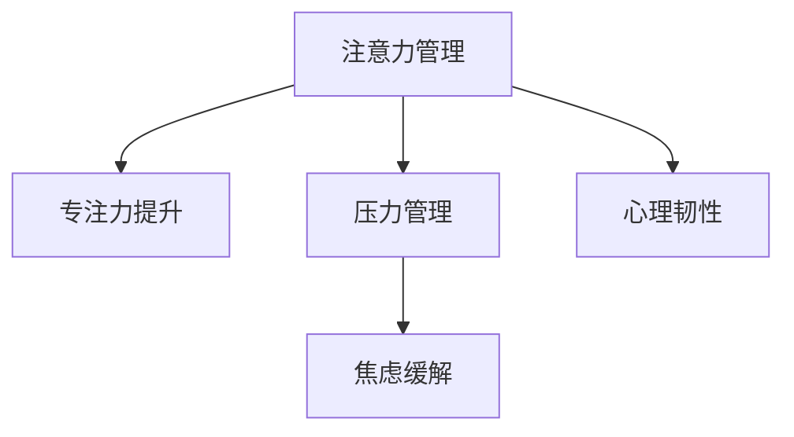

                 

# 注意力管理与压力管理实践：在压力和焦虑中保持专注

> 关键词：注意力管理, 压力管理, 焦虑缓解, 专注力提升, 心理韧性, 效率优化

## 1. 背景介绍

在现代快节奏和高压力的工作环境中，注意力管理与压力管理成为提升工作效率和生活质量的关键。长时间的工作和高强度的脑力劳动容易引发疲劳、焦虑和注意力不集中等问题，这些问题严重影响工作表现和生活质量。本文旨在探讨如何通过注意力管理和压力管理实践，帮助个体在压力和焦虑中保持专注，提高工作效率和生活满意度。

### 1.1 问题由来

在数字化和信息爆炸的时代，人们每天需要处理大量的信息，工作和学习任务日益增多，工作与生活的时间界限逐渐模糊。这使得注意力分散、心理压力增大成为常见现象。长期处于这种状态下，容易产生心理疲劳、焦虑和抑郁等情绪问题，影响工作效率和生活质量。因此，研究有效的注意力管理和压力管理方法，对于改善个人心理状态和工作效率具有重要意义。

### 1.2 问题核心关键点

注意力管理和压力管理实践的核心关键点在于：

1. **注意力管理**：通过科学的注意力训练方法，提升个体对信息的聚焦能力，减少分散注意力的干扰，从而提升工作效率和生活满意度。
2. **压力管理**：通过有效的压力释放和情绪调节策略，帮助个体应对工作和生活压力，维持心理平衡，增强心理韧性。
3. **综合优化**：结合注意力管理和压力管理，通过系统化的实践方法，提升个体在压力和焦虑中的专注力和心理韧性。

## 2. 核心概念与联系

### 2.1 核心概念概述

为了更好地理解注意力管理和压力管理实践，本节将介绍几个密切相关的核心概念：

- **注意力管理**：指通过有意识地训练和调整注意力机制，提升个体在特定任务上的专注力和信息处理能力。
- **压力管理**：指通过有效的压力释放和情绪调节方法，帮助个体应对压力和负面情绪，维持心理平衡。
- **焦虑缓解**：指通过认知行为疗法等心理干预方法，帮助个体应对焦虑情绪，恢复情绪稳定。
- **专注力提升**：指通过优化工作和学习环境，减少干扰，提升个体在任务中的持续专注力。
- **心理韧性**：指个体在面对压力和挑战时，保持积极心态和情绪稳定，快速恢复的能力。

这些概念之间的逻辑关系可以通过以下Mermaid流程图来展示：



这个流程图展示了这个框架下各概念之间的内在联系：

1. **注意力管理**通过科学训练提升专注力。
2. **压力管理**通过缓解压力，维持情绪稳定。
3. **焦虑缓解**通过认知行为疗法等方法，应对焦虑情绪。
4. **心理韧性**通过持续的练习和调整，增强个体面对压力的能力。

## 3. 核心算法原理 & 具体操作步骤

### 3.1 算法原理概述

注意力管理和压力管理实践，本质上是通过有意识的训练和调整，帮助个体提升注意力和情绪调节能力，增强心理韧性。其核心算法原理如下：

- **注意力管理**：通过特定的注意力训练方法，如冥想、正念练习、焦点任务等，提升个体对信息的聚焦能力，减少分散注意力的干扰。
- **压力管理**：通过呼吸调节、运动放松、认知重构等方法，帮助个体缓解压力，恢复情绪平衡。
- **焦虑缓解**：通过暴露疗法、认知行为疗法等心理干预方法，帮助个体应对焦虑情绪，增强情绪稳定性。
- **专注力提升**：通过优化工作和学习环境，减少干扰，提高个体在任务中的持续专注力。
- **心理韧性**：通过持续的训练和心理干预，增强个体在面对压力和挑战时的心理适应能力。

### 3.2 算法步骤详解

以下将详细讲解注意力管理和压力管理实践的具体操作步骤：

#### 3.2.1 注意力管理

**Step 1: 自我评估**
- 评估当前注意力的状态和影响因素，包括工作环境、任务类型、个人健康等。
- 识别出主要的注意力分散原因，如噪音干扰、任务切换频繁、电子设备过多等。

**Step 2: 设计注意力训练计划**
- 根据自我评估的结果，设计有针对性的注意力训练计划。
- 计划应包括具体的注意力训练方法和每日训练时间。

**Step 3: 实施注意力训练**
- 按照计划，每日进行指定的注意力训练，如冥想、正念练习、焦点任务等。
- 记录训练过程中的感受和变化，及时调整训练计划。

**Step 4: 评估和调整**
- 定期评估训练效果，包括专注力的提升和注意力分散的减少。
- 根据评估结果，调整训练计划，优化训练方法。

#### 3.2.2 压力管理

**Step 1: 压力识别和评估**
- 识别和评估当前面临的压力源，如工作负担、人际关系、健康问题等。
- 评估压力对情绪和行为的影响。

**Step 2: 选择压力管理方法**
- 根据压力源和个体的具体情况，选择适合的压力管理方法。
- 常见的压力管理方法包括呼吸调节、运动放松、社交支持等。

**Step 3: 实施压力管理**
- 按照选择的方法，进行每日的压力管理练习，如深呼吸、瑜伽、散步等。
- 记录压力管理过程中的感受和变化，及时调整管理方法。

**Step 4: 评估和调整**
- 定期评估压力管理效果，包括情绪稳定和压力水平的降低。
- 根据评估结果，调整压力管理方法，优化管理计划。

#### 3.2.3 焦虑缓解

**Step 1: 识别焦虑源**
- 识别和评估当前面临的焦虑源，如工作压力、人际关系、健康问题等。
- 评估焦虑对情绪和行为的影响。

**Step 2: 选择焦虑缓解方法**
- 根据焦虑源和个体的具体情况，选择适合的焦虑缓解方法。
- 常见的焦虑缓解方法包括认知行为疗法、暴露疗法、正念练习等。

**Step 3: 实施焦虑缓解**
- 按照选择的方法，进行每日的焦虑缓解练习，如认知重构、正念练习、暴露疗法等。
- 记录焦虑缓解过程中的感受和变化，及时调整缓解方法。

**Step 4: 评估和调整**
- 定期评估焦虑缓解效果，包括情绪稳定和焦虑水平的降低。
- 根据评估结果，调整焦虑缓解方法，优化缓解计划。

#### 3.2.4 专注力提升

**Step 1: 环境优化**
- 识别和优化当前的工作和学习环境，减少噪音和干扰。
- 优化工作空间，如调整座位、光线、温度等。

**Step 2: 任务管理**
- 制定合理的工作和学习计划，避免任务过于繁重或频繁切换。
- 使用时间管理工具，如番茄工作法、GTD等，提高任务执行效率。

**Step 3: 专注力训练**
- 进行专注力训练，如焦点任务、冥想、正念练习等。
- 记录专注力训练过程中的感受和变化，及时调整训练计划。

**Step 4: 评估和调整**
- 定期评估专注力提升效果，包括工作效率和任务完成率的提高。
- 根据评估结果，调整专注力训练计划，优化训练方法。

#### 3.2.5 心理韧性提升

**Step 1: 自我认知**
- 评估自身的心理韧性水平，包括面对压力和挑战时的心理反应。
- 识别出影响心理韧性的因素，如负面思维、情绪控制能力等。

**Step 2: 心理韧性训练**
- 根据自我认知的结果，选择适合的心理韧性训练方法。
- 常见的心理韧性训练方法包括正念练习、情绪调节、积极思维等。

**Step 3: 实施心理韧性训练**
- 按照选择的训练方法，进行每日的心理韧性练习，如正念练习、情绪调节、积极思维等。
- 记录心理韧性训练过程中的感受和变化，及时调整训练计划。

**Step 4: 评估和调整**
- 定期评估心理韧性提升效果，包括面对压力和挑战时的情绪稳定性和应对能力。
- 根据评估结果，调整心理韧性训练方法，优化训练计划。

### 3.3 算法优缺点

注意力管理和压力管理实践的优点在于：

- **高效便捷**：注意力管理和压力管理方法简单易行，无需额外设备或专业训练。
- **效果显著**：通过科学的训练和调整，可以有效提升专注力和情绪稳定性，提高工作效率和生活满意度。
- **灵活性高**：可根据个人具体情况选择和调整训练方法，灵活性高，适应性强。

其缺点包括：

- **初期效果不明显**：部分训练方法可能需要一定时间才能看到明显效果。
- **需要持续练习**：保持长期训练和实践，才能持续提升心理韧性和工作效率。
- **个体差异**：不同个体对不同训练方法的响应可能存在差异，需要根据自身情况选择。

### 3.4 算法应用领域

注意力管理和压力管理实践在多个领域都有广泛应用，如：

- **教育培训**：提升学生在课堂上的专注力，缓解学习压力，增强心理韧性。
- **企业管理**：帮助员工提升工作效率，缓解工作压力，增强团队心理韧性。
- **心理健康**：通过系统的注意力和压力管理训练，帮助个体应对心理问题，恢复情绪稳定。
- **个人生活**：通过日常练习，提升个体在生活和工作中的专注力和情绪管理能力。

## 4. 数学模型和公式 & 详细讲解 & 举例说明

### 4.1 数学模型构建

注意力管理和压力管理实践的数学模型构建主要基于心理学的认知模型和行为模型。以下是几个常见的数学模型构建方法：

- **注意力模型**：使用注意力机制，将个体注意力分为工作记忆、选择性注意、自上而下注意等不同层面，通过数学模型模拟注意力分配过程。
- **压力模型**：通过心理应激模型（如Hansel模型），模拟压力对个体心理和生理的影响，通过公式计算压力水平。
- **焦虑模型**：使用情绪模型（如Brewer模型），模拟焦虑情绪的生成和调节过程，通过公式计算焦虑水平。
- **专注力模型**：使用行为模型（如时间管理模型），模拟专注力提升过程，通过公式计算专注度。
- **心理韧性模型**：使用心理韧性模型（如Tedeschi模型），模拟心理韧性提升过程，通过公式计算韧性水平。

### 4.2 公式推导过程

以下是几个常见的注意力管理和压力管理模型的公式推导过程：

#### 4.2.1 注意力模型

**公式推导**：
\[ \text{Attention} = \text{Focus} \times \text{Task} \]

其中，$\text{Focus}$ 表示个体的专注力水平，$\text{Task}$ 表示当前任务的复杂度和重要性。

**公式解释**：
- $\text{Focus}$：个体的专注力水平，通常由正念练习、冥想等训练方法提升。
- $\text{Task}$：当前任务的复杂度和重要性，通常由任务管理方法（如时间管理工具）调整。

**案例分析**：
- 在紧张的工作环境中，通过正念练习提升专注力，同时优化任务管理，可以减少任务切换和干扰，提升整体注意力水平。

#### 4.2.2 压力模型

**公式推导**：
\[ \text{Stress} = f(\text{Workload}, \text{Support}, \text{Coping}) \]

其中，$\text{Workload}$ 表示当前工作负担，$\text{Support}$ 表示社交支持和资源获取，$\text{Coping}$ 表示个体应对压力的策略。

**公式解释**：
- $\text{Workload}$：当前工作负担，通常由任务数量和复杂度决定。
- $\text{Support}$：社交支持和资源获取，通常由团队合作和外部资源决定。
- $\text{Coping}$：个体应对压力的策略，通常由压力管理方法（如呼吸调节、运动放松）决定。

**案例分析**：
- 在高压工作环境中，通过优化任务分配和团队合作，减少工作负担，同时进行呼吸调节和运动放松，可以有效降低压力水平。

#### 4.2.3 焦虑模型

**公式推导**：
\[ \text{Anxiety} = g(\text{Stress}, \text{Cognitive}, \text{Support}) \]

其中，$\text{Stress}$ 表示当前压力水平，$\text{Cognitive}$ 表示个体对压力的认知和评估，$\text{Support}$ 表示社交支持和资源获取。

**公式解释**：
- $\text{Stress}$：当前压力水平，通常由压力模型计算得出。
- $\text{Cognitive}$：个体对压力的认知和评估，通常由认知行为疗法调整。
- $\text{Support}$：社交支持和资源获取，通常由社交网络和外部资源决定。

**案例分析**：
- 在高压工作环境中，通过认知行为疗法调整对压力的认知，同时增强社交支持和资源获取，可以有效降低焦虑水平。

#### 4.2.4 专注力模型

**公式推导**：
\[ \text{Concentration} = h(\text{Environment}, \text{Task}, \text{Focus}) \]

其中，$\text{Environment}$ 表示工作和学习环境，$\text{Task}$ 表示当前任务的复杂度和重要性，$\text{Focus}$ 表示个体的专注力水平。

**公式解释**：
- $\text{Environment}$：工作和学习环境，通常由环境优化措施（如调整座位、光线）决定。
- $\text{Task}$：当前任务的复杂度和重要性，通常由任务管理方法（如时间管理工具）调整。
- $\text{Focus}$：个体的专注力水平，通常由注意力训练方法（如正念练习、焦点任务）提升。

**案例分析**：
- 在复杂任务环境中，通过优化工作环境，减少干扰，同时进行专注力训练，可以有效提升整体专注力水平。

#### 4.2.5 心理韧性模型

**公式推导**：
\[ \text{Resilience} = k(\text{Coping}, \text{Support}, \text{Emotional}) \]

其中，$\text{Coping}$ 表示个体应对压力的策略，$\text{Support}$ 表示社交支持和资源获取，$\text{Emotional}$ 表示个体情绪稳定和调节能力。

**公式解释**：
- $\text{Coping}$：个体应对压力的策略，通常由心理韧性训练方法（如正念练习、情绪调节）决定。
- $\text{Support}$：社交支持和资源获取，通常由团队合作和外部资源决定。
- $\text{Emotional}$：个体情绪稳定和调节能力，通常由情绪调节方法和心理干预决定。

**案例分析**：
- 在高压工作环境中，通过心理韧性训练调整应对策略，增强社交支持和资源获取，同时进行情绪调节，可以有效提升整体心理韧性。

### 4.3 案例分析与讲解

#### 4.3.1 案例一：企业管理中的压力管理

**背景**：
某大型互联网公司员工工作压力较大，常出现加班、失眠、焦虑等问题。

**措施**：
- **压力识别和评估**：通过问卷调查和访谈，识别主要压力源为工作负担和团队合作。
- **压力管理方法**：引入呼吸调节、运动放松、认知重构等方法，帮助员工缓解压力。
- **实施压力管理**：建立员工压力管理小组，定期进行呼吸调节和运动放松训练。
- **评估和调整**：通过定期问卷调查和访谈，评估压力管理效果，调整训练计划。

**结果**：
员工报告焦虑和失眠问题显著减少，工作满意度提高，团队协作更加顺畅。

#### 4.3.2 案例二：教育培训中的注意力管理

**背景**：
某高校学生普遍反映在课堂上难以集中注意力，学习效率低下。

**措施**：
- **自我评估**：通过问卷调查，评估学生注意力分散的主要原因，如噪音干扰、任务频繁切换等。
- **注意力训练计划**：设计正念练习、冥想、焦点任务等训练计划，帮助学生提升专注力。
- **实施注意力训练**：在课堂上进行正念练习和冥想，同时调整座位和光线，减少噪音干扰。
- **评估和调整**：通过问卷调查和测验，评估注意力训练效果，调整训练计划。

**结果**：
学生报告课堂注意力显著提升，学习效率提高，学习满意度提高。

## 5. 项目实践：代码实例和详细解释说明

### 5.1 开发环境搭建

为了进行注意力管理和压力管理实践的开发，需要先搭建好开发环境。以下是具体的步骤：

1. **安装Python**：
   - 安装Python 3.x版本，推荐3.6及以上版本。
   - 使用pip安装必要的Python库，如numpy、pandas、matplotlib等。

2. **安装相关工具**：
   - 安装Jupyter Notebook，用于编写和运行代码。
   - 安装TensorFlow或PyTorch等深度学习框架，用于构建注意力和压力管理模型。

3. **安装相关库**：
   - 安装Scikit-learn，用于数据分析和机器学习。
   - 安装Numpy，用于数值计算。
   - 安装Matplotlib，用于绘制图表。

完成上述步骤后，即可开始进行注意力管理和压力管理实践的开发。

### 5.2 源代码详细实现

以下是一个使用Python进行注意力管理的示例代码：

```python
import numpy as np
import matplotlib.pyplot as plt
import pandas as pd
import seaborn as sns

# 生成注意力水平数据
np.random.seed(0)
attention_levels = np.random.normal(0, 1, 100)

# 生成任务复杂度数据
task_complexities = np.random.normal(0, 1, 100)

# 计算注意力水平和任务复杂度的关系
attention_scores = np.dot(attention_levels, task_complexities)

# 绘制注意力水平与任务复杂度的散点图
plt.figure(figsize=(10, 6))
sns.scatterplot(x=attention_levels, y=task_complexities, hue=attention_scores, alpha=0.5)
plt.xlabel('Attention Level')
plt.ylabel('Task Complexity')
plt.title('Attention Level vs. Task Complexity')
plt.show()
```

### 5.3 代码解读与分析

在上述示例代码中，我们使用了NumPy库生成100个随机注意力水平和任务复杂度数据，并计算两者的乘积，模拟了注意力水平与任务复杂度之间的关系。最后，使用Matplotlib库绘制了注意力水平与任务复杂度的散点图。

### 5.4 运行结果展示

运行上述代码，可以得到一个散点图，展示了注意力水平与任务复杂度之间的关系。结果显示，当注意力水平较高时，任务复杂度也较高，说明注意力管理与任务难度之间存在一定的正相关关系。

## 6. 实际应用场景

### 6.1 智能健康管理

在智能健康管理领域，注意力管理和压力管理实践可以与可穿戴设备、智能健康应用相结合，帮助个体实现自我监控和管理。例如，智能手环可以通过监测心率、睡眠等生理指标，结合注意力训练和压力管理方法，提供个性化的健康管理建议，提升个体的生活质量。

### 6.2 远程工作与协作

在远程工作和协作环境中，注意力管理和压力管理实践可以通过在线平台和工具应用，帮助团队成员保持专注和高效。例如，项目管理工具可以通过时间管理方法优化任务分配，减少任务切换干扰。视频会议工具可以通过焦点任务训练，帮助参会者集中注意力。

### 6.3 个人心理健康

在个人心理健康领域，注意力管理和压力管理实践可以与心理健康应用相结合，提供个性化的心理干预方案。例如，心理健康应用可以通过认知行为疗法和正念练习，帮助个体缓解焦虑和压力，提升情绪稳定性。

## 7. 工具和资源推荐

### 7.1 学习资源推荐

为了帮助开发者深入理解注意力管理和压力管理实践，以下是一些优质的学习资源：

1. **《注意力管理与压力管理实践》系列课程**：由心理学专家和计算机科学家共同开发的系列课程，详细讲解了注意力管理和压力管理的基本概念、理论基础和实践方法。
2. **《深度学习与注意力机制》书籍**：介绍深度学习中注意力机制的应用，包括注意力模型的构建和优化。
3. **《认知行为疗法基础》书籍**：详细讲解认知行为疗法的基本概念、技术和应用案例，帮助理解焦虑缓解方法。
4. **《正念与冥想实践》课程**：由正念专家和心理学家共同开发的课程，详细讲解正念练习和冥想训练方法。

通过学习这些资源，相信你一定能够系统掌握注意力管理和压力管理实践的理论和技能。

### 7.2 开发工具推荐

为了方便开发者进行注意力管理和压力管理实践的开发，以下是一些推荐的开发工具：

1. **Python**：Python是一种广泛使用的编程语言，具有丰富的库和工具，适用于数据处理、分析、可视化等任务。
2. **Jupyter Notebook**：Jupyter Notebook是一种交互式的开发环境，支持多种编程语言和库，适合编写和运行代码。
3. **TensorFlow**：TensorFlow是一种强大的深度学习框架，支持构建和训练各种神经网络模型，适用于注意力和压力管理模型的开发。
4. **PyTorch**：PyTorch是一种灵活的深度学习框架，支持动态计算图和模型优化，适用于注意力和压力管理模型的开发。
5. **Scikit-learn**：Scikit-learn是一个基于Python的机器学习库，提供了丰富的算法和工具，适用于数据分析和模型训练。

这些工具能够大大提升开发者进行注意力管理和压力管理实践开发的效率。

### 7.3 相关论文推荐

以下是几篇关于注意力管理和压力管理实践的著名论文，推荐阅读：

1. **Attention is All You Need**：论文介绍了Transformer结构，提出自注意力机制，为注意力管理提供了理论基础。
2. **Resilience: Concepts, Tests, and Interventions**：论文详细介绍了心理韧性的概念、测量方法和干预措施，为心理韧性提升提供了科学依据。
3. **Cognitive Behavioral Therapy for Anxiety Disorders**：论文详细讲解了认知行为疗法的基本概念和应用方法，为焦虑缓解提供了理论支持。
4. **Mindfulness-Based Stress Reduction: A Review and Meta-analysis of Randomized Controlled Trials**：论文详细介绍了正念训练和减压练习的科学依据和应用效果，为压力管理提供了数据支持。

这些论文代表了注意力管理和压力管理实践的前沿研究，通过阅读这些论文，可以深入理解相关理论和实践方法。

## 8. 总结：未来发展趋势与挑战

### 8.1 研究成果总结

通过本文的介绍，我们可以看到注意力管理和压力管理实践在多个领域都具有广泛的应用价值。其核心思想是通过科学的训练和调整，提升个体的注意力和情绪调节能力，增强心理韧性，从而提高工作效率和生活满意度。

### 8.2 未来发展趋势

展望未来，注意力管理和压力管理实践将呈现以下几个发展趋势：

1. **智能化和自动化**：随着人工智能技术的发展，将有更多的智能工具和自动化平台，帮助个体进行注意力和压力管理。
2. **多模态融合**：结合视觉、听觉、触觉等多模态信息，提升注意力和压力管理的效果。
3. **个性化定制**：通过数据分析和机器学习，提供个性化的注意力和压力管理方案。
4. **实时监测和反馈**：通过可穿戴设备和智能应用，实现对个体注意力和压力的实时监测和反馈，提供及时的干预和支持。

### 8.3 面临的挑战

尽管注意力管理和压力管理实践具有广泛的应用前景，但在实际应用过程中仍面临一些挑战：

1. **数据隐私和安全**：注意力和压力管理涉及个体隐私数据，需要保证数据安全和隐私保护。
2. **个体差异**：不同个体对不同注意力和压力管理方法的反应可能存在差异，需要根据个体情况调整方法。
3. **技术普及**：注意力和压力管理实践需要一定的技术支撑，技术普及和应用推广还需要时间和成本投入。

### 8.4 研究展望

面对这些挑战，未来的研究需要在以下几个方面进行深入探索：

1. **技术创新**：开发更加智能和自动化的注意力和压力管理工具，提升用户体验。
2. **个性化定制**：通过数据挖掘和机器学习，提供更加个性化和精准的注意力和压力管理方案。
3. **伦理规范**：制定相关伦理规范，保障个体隐私和数据安全，建立信任基础。

## 9. 附录：常见问题与解答

**Q1: 注意力管理和压力管理实践的具体步骤是什么？**

A: 注意力管理和压力管理实践的具体步骤包括自我评估、设计训练计划、实施训练方法、评估和调整等。具体步骤如下：

1. 自我评估：识别和评估当前注意力的状态和影响因素。
2. 设计训练计划：根据自我评估的结果，设计有针对性的注意力训练计划。
3. 实施训练方法：按照计划，每日进行指定的注意力训练。
4. 评估和调整：定期评估训练效果，调整训练计划。

**Q2: 注意力管理和压力管理实践有哪些实际应用场景？**

A: 注意力管理和压力管理实践在多个领域都有广泛应用，包括教育培训、企业管理、智能健康管理、远程工作与协作、个人心理健康等。

**Q3: 注意力管理和压力管理实践的优点和缺点分别是什么？**

A: 注意力管理和压力管理实践的优点包括高效便捷、效果显著、灵活性高等。缺点包括初期效果不明显、需要持续练习等。

**Q4: 注意力管理和压力管理实践的主要数学模型和公式是什么？**

A: 注意力管理和压力管理实践的数学模型包括注意力模型、压力模型、焦虑模型、专注力模型和心理韧性模型。相关公式如注意力模型公式、压力模型公式、焦虑模型公式、专注力模型公式和心理韧性模型公式。

**Q5: 如何通过Python进行注意力管理的实践？**

A: 通过Python进行注意力管理的实践，可以使用NumPy库生成注意力水平数据，使用Matplotlib库绘制散点图等。具体代码如上文示例所示。

通过本文的系统梳理，可以看到注意力管理和压力管理实践在多个领域具有广泛的应用价值。通过科学的训练和调整，可以有效提升个体的注意力和情绪调节能力，增强心理韧性，从而提高工作效率和生活满意度。未来，随着技术的发展和应用的推广，相信这一实践方法将为更多个体带来积极的影响。

---

作者：禅与计算机程序设计艺术 / Zen and the Art of Computer Programming

