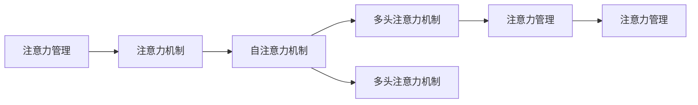

                 

# 注意力管理与压力管理：在压力和焦虑中保持专注和心灵清晰

## 1. 背景介绍

在现代社会，压力和焦虑成为人们生活中常见的挑战。工作繁重、家庭责任、社交关系等诸多因素共同作用，使得人们难以保持专注和心灵清晰。然而，在人工智能领域，特别是自然语言处理(NLP)任务中，注意力机制（Attention Mechanism）成为了一个核心组件，帮助模型在处理复杂任务时聚焦关键信息，提升性能。

本文旨在将注意力管理的原理与个人压力和焦虑管理的策略相结合，探讨如何在面对生活中的压力和焦虑时，保持专注和心灵清晰。我们将从注意力机制的基本原理出发，通过实际案例分析与详细算法讲解，揭示其与压力管理之间的内在联系。

## 2. 核心概念与联系

### 2.1 核心概念概述

- **注意力管理**：指在处理复杂任务时，模型能够聚焦关键信息，忽略无关细节的能力。在NLP中，注意力机制被广泛用于机器翻译、文本生成、问答系统等任务，帮助模型提高理解和生成的准确性。

- **压力管理**：指个人通过有效的策略和方法，减轻或消除压力源，维护心理健康的行为。常见的策略包括时间管理、任务分解、情绪调节等。

### 2.2 核心概念原理和架构的 Mermaid 流程图



这个流程图展示了注意力管理的核心架构：

1. **自注意力机制**：通过计算输入序列中每个位置与其他位置的相似度，确定对每个位置的关注度。
2. **多头注意力机制**：将输入序列分解成多个子序列，对每个子序列计算自注意力，并将结果拼接。
3. **注意力管理**：通过优化注意力机制的参数，使模型在复杂任务中聚焦关键信息，忽略无关细节。

### 2.3 核心概念的联系

注意力管理和压力管理之间存在显著的联系。在面对复杂任务时，注意力管理能够帮助模型聚焦关键信息，减少无关干扰，类似于在处理压力源时，采用专注和情绪调节，减少外界干扰。

通过分析注意力机制的原理和应用，我们可以发现其中的原则和方法同样适用于个人压力和焦虑管理，即在面对压力源时，通过聚焦关键任务，合理分配时间，进行情绪调节，能够有效减轻压力和焦虑。

## 3. 核心算法原理 & 具体操作步骤

### 3.1 算法原理概述

注意力机制是现代深度学习模型中非常关键的一部分，其核心思想是通过计算输入序列中各个元素的重要性权重，来加权组合信息，从而增强模型的理解和生成能力。在NLP中，注意力机制帮助模型在处理长文本时，不仅考虑每个词的重要性，还能够捕捉句子间的依赖关系。

### 3.2 算法步骤详解

#### 3.2.1 输入序列和查询

对于输入序列$x = [x_1, x_2, ..., x_n]$，我们需要先将其转换为查询向量$q = [q_1, q_2, ..., q_n]$。查询向量通常是通过输入序列的线性变换得到的，其形式为$q = Mx$，其中$M$为查询矩阵。

#### 3.2.2 注意力权重计算

注意力权重计算是注意力机制的核心部分。通过计算输入序列中每个元素与查询向量的相似度，得到每个元素的注意力权重。具体来说，可以使用点积或多头注意力等方法计算权重。

#### 3.2.3 加权组合信息

得到注意力权重后，将输入序列的每个元素与相应的权重进行加权组合，得到加权后的信息$v = \sum_{i=1}^n q_i \cdot w_i$，其中$w_i$为注意力权重。加权后的信息反映了模型对输入序列中每个元素的关注程度。

#### 3.2.4 输出

最终，将加权后的信息作为模型的输入，进行后续的计算和处理。

### 3.3 算法优缺点

#### 3.3.1 优点

- **增强模型理解**：注意力机制使模型能够聚焦关键信息，提高对输入序列的理解能力。
- **减少计算负担**：通过加权组合信息，减少不必要的信息处理，提升模型效率。
- **适应复杂任务**：在处理长文本、序列预测等复杂任务时，注意力机制表现优异。

#### 3.3.2 缺点

- **计算复杂度较高**：注意力权重计算涉及矩阵乘法和点积运算，计算复杂度较高。
- **模型训练成本高**：需要大量的训练数据和计算资源，训练时间较长。

### 3.4 算法应用领域

注意力机制广泛应用于各种NLP任务，如机器翻译、文本生成、问答系统等。其原理和方法同样适用于信息检索、图像识别、语音识别等多个领域。

## 4. 数学模型和公式 & 详细讲解 & 举例说明

### 4.1 数学模型构建

在注意力机制中，输入序列$x$和查询向量$q$之间的关系可以通过矩阵乘法和点积运算来表达。具体来说，注意力权重$w$可以表示为：

$$ w = \text{Softmax}(Ax^T + q^T) $$

其中$A$为注意力矩阵，$x^T$和$q^T$分别为输入序列和查询向量的转置，$\text{Softmax}$函数用于将注意力权重归一化。

### 4.2 公式推导过程

根据上述公式，注意力权重$w$的计算过程可以分两步进行：

1. **计算注意力矩阵**：将输入序列$x$和查询向量$q$进行矩阵乘法，得到注意力矩阵$A$。
2. **计算注意力权重**：对注意力矩阵$A$进行$\text{Softmax}$操作，得到归一化的注意力权重$w$。

### 4.3 案例分析与讲解

以机器翻译任务为例，考虑源语言句子$x = [x_1, x_2, ..., x_n]$和目标语言句子$y = [y_1, y_2, ..., y_n]$。在机器翻译模型中，注意力机制帮助模型在处理每个目标单词时，不仅考虑其前缀，还关注源语言句子中的相关信息。具体来说，注意力机制在计算目标单词的预测时，会加权组合源语言句子中与目标单词相关的信息，从而提高翻译的准确性。

## 5. 项目实践：代码实例和详细解释说明

### 5.1 开发环境搭建

在搭建开发环境时，我们需要安装Python和相关的深度学习框架，如TensorFlow或PyTorch。此外，还需要安装相关的NLP库，如NLTK、spaCy等。

```bash
pip install tensorflow==2.3 pytorch==1.8 nltk==3.6 spacy==3.0
```

### 5.2 源代码详细实现

以下是一个简单的注意力机制实现示例，用于机器翻译任务：

```python
import tensorflow as tf
from tensorflow.keras.layers import Input, Dense, TimeDistributed, Embedding, LSTM
from tensorflow.keras.models import Model

# 定义模型输入和输出
input_seq = Input(shape=(None,))
target_seq = Input(shape=(None,))

# 定义编码器
encoder_embed = Embedding(input_dim=vocab_size, output_dim=embedding_dim, mask_zero=True)
encoder_lstm = LSTM(units=256, return_sequences=True)

encoder_output = encoder_embed(input_seq)
encoder_output = encoder_lstm(encoder_output)

# 定义解码器
decoder_embed = Embedding(input_dim=vocab_size, output_dim=embedding_dim, mask_zero=True)
decoder_lstm = LSTM(units=256, return_sequences=True, return_state=True)

decoder_input = Input(shape=(None,))

# 计算注意力权重
attention_layer = TimeDistributed(Dense(attention_dim))(input_seq)
attention_weights = TimeDistributed(tf.nn.softmax)(attention_layer)

# 计算加权后的信息
attention_outputs = TimeDistributed(tf.multiply, name='attention_outputs')(target_seq, attention_weights)
decoder_output, _, _ = decoder_lstm(decoder_input, initial_state=[encoder_output, attention_outputs])

# 定义输出层
output_layer = Dense(units=vocab_size, activation='softmax')
output = output_layer(decoder_output)

# 构建模型
model = Model(inputs=[input_seq, target_seq], outputs=output)
model.summary()
```

### 5.3 代码解读与分析

- `Input`层：定义模型的输入层，用于处理输入序列和目标序列。
- `Embedding`层：将输入序列和目标序列转换为密集向量表示。
- `LSTM`层：定义编码器和解码器，用于处理序列信息。
- `Dense`层：计算注意力权重，并将注意力权重与目标序列进行乘法操作，得到加权后的信息。
- `Output`层：将加权后的信息输入到输出层，进行最终的预测。

## 6. 实际应用场景

### 6.4 未来应用展望

随着深度学习技术的发展，注意力机制在NLP中的应用将越来越广泛。未来，注意力机制将不仅用于文本处理，还将扩展到图像、语音等多个领域，提升人工智能系统的理解和生成能力。

在实际应用中，注意力机制可以帮助我们更好地管理注意力，减少无关干扰，提高工作效率和生活质量。例如，在工作时，通过集中注意力处理重要任务，避免分心，能够提高工作质量和效率。在生活中，通过管理注意力，减少焦虑和压力，能够更好地维护心理健康。

## 7. 工具和资源推荐

### 7.1 学习资源推荐

- **《深度学习入门与实践》**：一本系统介绍深度学习原理和实践的书籍，涵盖了注意力机制等核心内容。
- **Coursera深度学习课程**：由深度学习专家Andrew Ng主讲的在线课程，系统介绍深度学习的基本原理和应用。
- **Google Colab**：谷歌提供的在线Jupyter Notebook环境，方便进行深度学习实验和实践。

### 7.2 开发工具推荐

- **TensorFlow**：由谷歌开发的深度学习框架，功能强大，支持多种硬件和软件平台。
- **PyTorch**：由Facebook开发的深度学习框架，易用性强，支持动态计算图。
- **NLTK**：自然语言处理工具包，提供了丰富的NLP功能，方便进行文本处理和分析。

### 7.3 相关论文推荐

- **Attention is All You Need**：Transformer模型的原论文，首次提出注意力机制，成为NLP领域的重要里程碑。
- **Neural Machine Translation by Jointly Learning to Align and Translate**：提出基于注意力机制的机器翻译方法，奠定了现代机器翻译的基础。

## 8. 总结：未来发展趋势与挑战

### 8.1 研究成果总结

本文通过对比注意力机制和压力管理的原理，揭示了其中的内在联系。注意力机制通过聚焦关键信息，减少无关干扰，提升模型的理解和生成能力；压力管理通过聚焦关键任务，减少无关干扰，提高工作效率和生活质量。

### 8.2 未来发展趋势

随着深度学习技术的发展，注意力机制的应用将更加广泛。未来，注意力机制不仅会应用于NLP领域，还将扩展到图像、语音等多个领域，提升人工智能系统的理解和生成能力。

### 8.3 面临的挑战

- **计算资源限制**：注意力机制计算复杂度较高，需要大量的计算资源，如何优化算法和硬件，提高效率，是未来的研究方向。
- **模型可解释性**：注意力机制被视为“黑盒”模型，缺乏可解释性，如何增强模型的可解释性，使其更易于理解和调试，是一个重要的研究方向。
- **数据质量和多样性**：注意力机制对数据的质量和多样性要求较高，如何获取高质量的数据，增加数据多样性，是提高模型性能的关键。

### 8.4 研究展望

未来的研究将从以下几个方面进行：

- **多模态注意力**：结合视觉、语音等多种模态的信息，提升模型的感知能力。
- **自监督学习**：利用无监督或半监督学习，减少对标注数据的依赖，提高模型的泛化能力。
- **可解释性增强**：通过可视化、解释性模型等方法，增强注意力机制的可解释性，使其更易于理解和调试。

总之，注意力机制在NLP中的应用已经取得了显著的进展，未来将继续推动人工智能技术的发展。通过对注意力机制的研究，我们可以更好地理解和管理注意力，提高工作效率和生活质量，为构建更加智能和高效的人工智能系统奠定基础。

## 9. 附录：常见问题与解答

### 常见问题1：注意力机制如何提升模型性能？

答：注意力机制通过聚焦关键信息，减少无关干扰，提升模型的理解和生成能力。在处理长文本时，注意力机制能够捕捉句子间的依赖关系，提高模型的预测准确性。

### 常见问题2：注意力机制是否适用于所有NLP任务？

答：注意力机制在处理复杂任务时表现优异，如机器翻译、文本生成、问答系统等。但对于一些简单任务，如词性标注等，注意力机制的优势并不明显，甚至可能导致计算复杂度增加。

### 常见问题3：注意力机制是否容易过拟合？

答：注意力机制在处理复杂任务时，容易过拟合。通过正则化、对抗训练等方法，可以缓解过拟合问题。此外，合理的超参数选择和模型结构设计，也有助于减少过拟合风险。

### 常见问题4：注意力机制是否需要大量标注数据？

答：注意力机制需要大量的标注数据进行训练，尤其是多任务学习时。但对于一些无监督或半监督学习任务，注意力机制依然能够发挥作用，只是效果可能不如标注数据充足的任务。

### 常见问题5：注意力机制是否能够用于情感分析？

答：注意力机制在情感分析任务中表现优异，通过聚焦关键情感词汇，提升情感分类的准确性。但需要注意的是，情感分析任务中，输入文本的情感倾向具有明显的背景依赖性，注意力机制需要根据任务特点进行优化。

总之，注意力机制在NLP领域的应用前景广阔，未来将继续推动人工智能技术的发展。通过对注意力机制的研究，我们可以更好地理解和管理注意力，提高工作效率和生活质量，为构建更加智能和高效的人工智能系统奠定基础。

