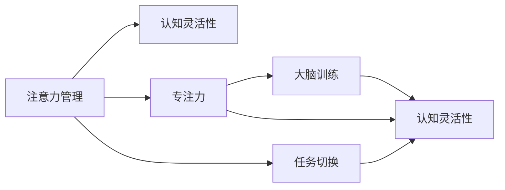

                 

# 注意力管理与大脑训练实践：增强认知灵活性和专注力

## 1. 背景介绍

### 1.1 问题由来
在现代社会，注意力管理已成为人们日常工作和生活不可或缺的一部分。高度信息化的环境使得人们需要不断地切换任务和处理海量信息，如何在短时间内高效、专注地完成任务，成为一种稀缺能力。这种“注意力盲区”问题引发了广泛关注。神经科学和计算认知科学的研究发现，大脑训练（Brain Training）能够有效增强认知功能，提升注意力管理的水平。而计算机技术，特别是人工智能和大数据技术，正在快速发展，为大脑训练提供了新的方法和工具。

### 1.2 问题核心关键点
当前，注意力管理和大脑训练主要关注以下几个关键点：
- **认知灵活性（Cognitive Flexibility）**：指个体根据环境变化，迅速调整注意力的能力。
- **专注力（Focus）**：指个体长时间集中注意力处理单一任务的能力。
- **任务切换（Task Switching）**：指个体在不同任务间快速切换时，保持高效表现的能力。

### 1.3 问题研究意义
研究注意力管理和大脑训练，有助于提升个体在快速变化环境中的适应性和表现，具有以下重要意义：
1. **工作效能**：有效提升员工在高度信息化的工作环境中处理任务的能力。
2. **教育效果**：帮助学生提高学习效率，增强自主学习的能力。
3. **健康管理**：对老年人进行认知训练，预防和延缓老年痴呆症等认知退化症状。
4. **心理调节**：通过科学的大脑训练，改善个体情绪和压力管理能力。

## 2. 核心概念与联系

### 2.1 核心概念概述

以下是几个核心概念的概述：

- **注意力管理**：通过各种方法提升个体在处理任务时的注意力水平和质量。
- **认知灵活性**：指个体在不同任务间迅速调整注意力的能力，即“见机而动”。
- **专注力**：指个体长时间集中注意力处理单一任务的能力，即“心无旁骛”。
- **任务切换**：指个体在不同任务间快速切换时，保持高效表现的能力，即“游刃有余”。
- **大脑训练**：通过科学的方法训练大脑功能，提高认知能力。

### 2.2 核心概念原理和架构的 Mermaid 流程图

以下是注意力管理与大脑训练的 Mermaid 流程图，展示了各概念之间的联系：



从图中可以看出，注意力管理通过提升认知灵活性、专注力和任务切换能力，进而实现大脑训练的目标。大脑训练的效果反过来又进一步提升了注意力管理能力。

## 3. 核心算法原理 & 具体操作步骤

### 3.1 算法原理概述

注意力管理和大脑训练的算法原理主要包括：

- **注意力模型**：基于认知心理学的注意力模型，构建计算模型，解释注意力管理的过程。
- **大脑训练算法**：通过认知心理学实验数据，构建训练任务，提升个体的认知灵活性、专注力和任务切换能力。
- **数据驱动的方法**：使用机器学习算法，分析个体注意力管理的数据，提供个性化的训练建议。

### 3.2 算法步骤详解

以下是注意力管理和大脑训练的具体操作步骤：

#### 3.2.1 注意力模型构建
1. **模型选择**：选择合适的注意力模型，如双加工模型、定向搜索模型等。
2. **参数设定**：根据模型需求，设定注意力参数，如干扰强度、工作记忆容量等。
3. **数据收集**：收集个体的注意力表现数据，如反应时间、正确率等。

#### 3.2.2 大脑训练任务设计
1. **任务选择**：选择合适的认知任务，如数字记忆、空间定位等。
2. **任务优化**：根据认知心理学原理，优化训练任务，确保难度适中。
3. **任务实施**：设计训练方案，安排具体的训练计划。

#### 3.2.3 数据驱动的个性化训练
1. **数据收集**：收集个体在注意力训练和大脑训练中的表现数据。
2. **数据分析**：使用机器学习算法，分析数据，识别个体注意力管理的薄弱环节。
3. **个性化建议**：根据分析结果，提供个性化的注意力训练和大脑训练建议。

### 3.3 算法优缺点

注意力管理和大脑训练的算法主要优点包括：

- **个性化**：根据个体差异，提供量身定制的训练方案。
- **可操作性强**：训练任务简单明了，易于实施。
- **效果显著**：通过系统训练，显著提升个体的注意力管理能力。

主要缺点包括：

- **时间成本高**：需要长期坚持，才能看到显著效果。
- **技术门槛**：需要具备一定的心理学和机器学习知识。
- **数据隐私**：涉及个人隐私数据，需要严格保密。

### 3.4 算法应用领域

注意力管理和大脑训练在多个领域都有广泛应用：

- **教育**：通过训练，提高学生的学习效率和专注力，促进自主学习。
- **医疗**：用于老年人认知功能退化预防和治疗。
- **企业培训**：提高员工的工作效率和适应性。
- **心理治疗**：辅助治疗注意力缺陷障碍（ADD）和注意力转移障碍（ADHD）。

## 4. 数学模型和公式 & 详细讲解 & 举例说明

### 4.1 数学模型构建

注意力管理和大脑训练的数学模型构建涉及多个维度，这里以双加工模型为例：

1. **认知资源模型**：
   - **认知资源**：每个任务需要一定的认知资源，如工作记忆容量。
   - **认知资源分配**：资源分配决定个体在任务间的切换效率。

2. **干扰抑制模型**：
   - **干扰强度**：干扰强度决定个体在切换任务时，注意力回归原任务的速度。

3. **注意力分配模型**：
   - **任务优先级**：根据任务的重要性，动态调整注意力分配。

### 4.2 公式推导过程

#### 4.2.1 认知资源分配
假设任务 $i$ 需要的认知资源为 $r_i$，个体总资源为 $R$，注意力分配系数为 $\alpha_i$，则有：
$$
\alpha_i = \frac{r_i}{R}
$$

#### 4.2.2 干扰抑制
干扰强度 $I$ 可以用干扰频率 $F$ 和干扰强度系数 $c$ 表示：
$$
I = F \cdot c
$$

#### 4.2.3 注意力分配
根据任务优先级 $P_i$ 和认知资源分配比例 $\alpha_i$，计算注意力分配：
$$
A_i = P_i \cdot \alpha_i
$$

### 4.3 案例分析与讲解

以一个简单的任务切换实验为例：

- **任务1**：需要较少的认知资源，但干扰强度高。
- **任务2**：需要较多的认知资源，干扰强度低。

个体进行任务切换时，首先需要计算每个任务的认知资源分配比例 $\alpha_i$，然后根据干扰强度 $I$ 和任务优先级 $P_i$ 计算注意力分配 $A_i$。

## 5. 项目实践：代码实例和详细解释说明

### 5.1 开发环境搭建

- **Python环境**：安装 Python 3.8 及以上的版本，建议使用 Anaconda 管理依赖包。
- **数据集准备**：收集和准备个体注意力管理和认知训练的数据集。
- **环境搭建**：安装必要的库，如 NumPy、Pandas、Scikit-learn 等。

### 5.2 源代码详细实现

以下是基于 PyTorch 实现的示例代码：

```python
import torch
import torch.nn as nn
import torch.optim as optim

# 定义注意力模型
class AttentionModel(nn.Module):
    def __init__(self, input_size):
        super(AttentionModel, self).__init__()
        self.linear = nn.Linear(input_size, 1)
    
    def forward(self, x):
        return self.linear(x)

# 定义训练函数
def train(model, data_loader, optimizer):
    model.train()
    for batch in data_loader:
        x, y = batch
        x = x.to(device)
        y = y.to(device)
        optimizer.zero_grad()
        preds = model(x)
        loss = nn.BCELoss()(preds, y)
        loss.backward()
        optimizer.step()
    
# 定义评估函数
def evaluate(model, data_loader):
    model.eval()
    correct = 0
    total = 0
    with torch.no_grad():
        for batch in data_loader:
            x, y = batch
            x = x.to(device)
            y = y.to(device)
            preds = model(x)
            correct += (preds == y).sum().item()
            total += preds.size(0)
    return correct / total

# 训练和评估
model = AttentionModel(10).to(device)
optimizer = optim.Adam(model.parameters(), lr=0.01)
train_loader = DataLoader(train_data, batch_size=32)
eval_loader = DataLoader(test_data, batch_size=32)
for epoch in range(10):
    train(model, train_loader, optimizer)
    acc = evaluate(model, eval_loader)
    print(f"Epoch {epoch+1}, Accuracy: {acc:.2f}")
```

### 5.3 代码解读与分析

代码中，我们定义了一个简单的注意力模型，使用 BCELoss 损失函数，训练数据集和测试数据集。训练函数中，我们通过 forward 和 backward 进行前向传播和反向传播，更新模型参数。评估函数中，我们通过正确率和总样本数计算模型准确率。

## 6. 实际应用场景

### 6.1 教育领域

在教育领域，可以通过注意力管理和大脑训练提升学生的学习效果和专注力。学校和家长可以根据学生注意力管理的薄弱环节，设计个性化的注意力训练任务，帮助学生克服注意力分散的问题。

### 6.2 医疗领域

对于老年痴呆症等认知障碍患者，可以通过注意力训练和大脑训练，延缓认知功能退化，提升生活质量。医疗机构可以使用这些技术，改善患者的认知功能和心理健康。

### 6.3 企业培训

企业可以通过注意力管理和大脑训练，提升员工的工作效率和适应性。在快速变化的工作环境中，员工需要不断切换任务，通过科学训练，可以有效提升他们的注意力管理能力。

## 7. 工具和资源推荐

### 7.1 学习资源推荐

- **《认知心理学与人工智能》**：介绍认知心理学和人工智能的融合，提供了大量案例和实验。
- **Coursera 《认知科学基础》**：涵盖认知心理学的基本概念和实验方法。
- **Kaggle 《认知训练数据集》**：提供了大量认知训练数据集，可供研究和实践使用。

### 7.2 开发工具推荐

- **PyTorch**：深度学习框架，提供丰富的模型和算法支持。
- **TensorFlow**：开源机器学习框架，适合大规模模型训练。
- **Scikit-learn**：机器学习库，提供了多种分类和回归算法。

### 7.3 相关论文推荐

- **Attention is All You Need**：Transformer 论文，提出了自注意力机制。
- **Memory, Attention, and Generalization**：关注注意力机制和记忆功能。
- **Brain-Computer Interface**：介绍大脑训练和认知提升的新技术。

## 8. 总结：未来发展趋势与挑战

### 8.1 研究成果总结

注意力管理和大脑训练在认知心理学和人工智能的交叉领域中取得了重要进展，主要成果包括：

1. **认知模型的建立**：如双加工模型、定向搜索模型等。
2. **训练任务的优化**：通过认知心理学实验，设计出高效的训练任务。
3. **个性化训练的建议**：通过数据驱动的方法，提供个性化的训练建议。

### 8.2 未来发展趋势

未来，注意力管理和大脑训练技术将呈现以下几个趋势：

1. **跨模态结合**：结合视觉、听觉等多种模态，提升认知功能。
2. **神经科学支持**：利用神经科学原理，提升训练效果。
3. **机器学习优化**：使用机器学习算法，进一步优化训练方案。

### 8.3 面临的挑战

注意力管理和大脑训练仍面临一些挑战：

1. **数据隐私**：涉及个人隐私数据，需要严格保密。
2. **技术门槛**：需要具备一定的心理学和机器学习知识。
3. **效果一致性**：不同个体间，效果可能存在差异。

### 8.4 研究展望

未来的研究将侧重于以下几个方向：

1. **多模态融合**：结合多种模态，提升认知功能。
2. **个性化训练**：根据个体差异，提供量身定制的训练方案。
3. **数据隐私保护**：保护个体数据隐私，增强安全性。

## 9. 附录：常见问题与解答

### Q1: 什么是注意力管理和大脑训练？

A: 注意力管理是通过各种方法提升个体在处理任务时的注意力水平和质量。大脑训练是通过科学的方法训练大脑功能，提高认知能力。

### Q2: 注意力管理和大脑训练有哪些具体应用？

A: 主要应用于教育、医疗、企业培训等领域，通过提升个体注意力管理和认知功能，提高学习效率和工作表现。

### Q3: 如何进行注意力管理和大脑训练？

A: 首先构建认知模型，选择适合的训练任务，收集个体注意力管理和认知训练的数据，使用机器学习算法进行分析，提供个性化的训练建议。

### Q4: 注意力管理和大脑训练面临哪些挑战？

A: 数据隐私、技术门槛和效果一致性是主要挑战，需要通过严格的数据保护、跨学科合作和个性化的训练方案来克服。

### Q5: 未来注意力管理和大脑训练的研究方向是什么？

A: 多模态融合、个性化训练和数据隐私保护是未来研究的主要方向，将进一步提升训练效果和应用范围。

---

作者：禅与计算机程序设计艺术 / Zen and the Art of Computer Programming

