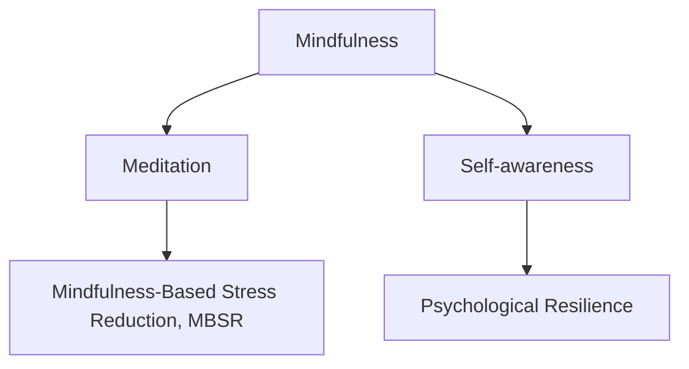

                 

# 注意力管理与正念冥想实践：通过内省增强专注力和心灵平和

## 1. 背景介绍

在现代快节奏的社会中，人们的注意力被各种信息和干扰不断打断，导致工作和学习效率下降，身心健康受损。然而，注意力管理与正念冥想作为一种古老的实践方法，通过内省和专注，可以帮助人们提升专注力，缓解压力，恢复心灵平和。

### 1.1 问题由来

注意力管理与正念冥想在现代社会中重新获得了重视，其核心思想是通过内省和冥想训练，增强个体对注意力的控制力，提升专注力和心理韧性。这一方法起源于东方的佛教和禅宗，并在西方的心理学和神经科学研究中得到了进一步发展。

### 1.2 问题核心关键点

注意力管理与正念冥想的关键点包括：
- 内省（Mindfulness）：通过专注于当下的感受和体验，减少对过去和未来的担忧，培养即时意识。
- 冥想（Meditation）：通过持续练习冥想，训练注意力，增强专注力和自我调节能力。
- 心理弹性（Psychological Resilience）：通过提升专注力和自我控制力，增强个体对压力的抵抗力和适应性。

## 2. 核心概念与联系

### 2.1 核心概念概述

为更好地理解注意力管理与正念冥想的原理和实践方法，本节将介绍几个密切相关的核心概念：

- 内省（Mindfulness）：通过专注于当下的感受和体验，减少对过去和未来的担忧，培养即时意识。
- 冥想（Meditation）：通过持续练习冥想，训练注意力，增强专注力和自我调节能力。
- 正念（Mindfulness-Based Stress Reduction, MBSR）：一种系统的正念训练方法，通过内省和冥想的练习，帮助个体缓解压力和焦虑，提升心理健康。
- 自我觉知（Self-awareness）：通过内省和反思，提高对自己思维和情感的认知能力，增强自我控制力。
- 心理弹性（Psychological Resilience）：通过正念训练，增强个体对压力的抵抗力和适应性，提升心理健康水平。

这些核心概念之间的逻辑关系可以通过以下Mermaid流程图来展示：



这个流程图展示了好几个核心概念之间的关系：

1. 内省（Mindfulness）通过专注于当下的感受和体验，培养即时意识。
2. 冥想（Meditation）通过持续练习，增强专注力和自我调节能力。
3. 正念（MBSR）通过系统的正念训练，缓解压力和焦虑，提升心理健康。
4. 自我觉知（Self-awareness）通过内省和反思，提高对自己思维和情感的认知能力。
5. 心理弹性（Psychological Resilience）通过正念训练，增强个体对压力的抵抗力和适应性。

## 3. 核心算法原理 & 具体操作步骤

### 3.1 算法原理概述

注意力管理与正念冥想的核心算法原理是通过持续的内省和冥想训练，逐步提升个体的注意力控制力和自我调节能力。其基本流程包括：

1. **内省（Mindfulness）**：通过专注当下的感受和体验，减少对过去和未来的担忧，培养即时意识。
2. **冥想（Meditation）**：通过持续练习冥想，训练注意力，增强专注力和自我调节能力。
3. **正念（MBSR）**：通过系统的正念训练，帮助个体缓解压力和焦虑，提升心理健康。

### 3.2 算法步骤详解

#### 3.2.1 内省（Mindfulness）

**步骤1: 选择练习地点和时间**
- 选择一个安静、无干扰的环境，如室内安静的角落，或室外宁静的自然环境。
- 确定每日练习的时间，如早晨、午休或晚上，选择一个对自己来说最容易坚持的时间段。

**步骤2: 专注当下**
- 坐在舒适的椅子上或席地而坐，保持身体姿势直立，不偏不倚。
- 关闭眼睛，深呼吸几次，将注意力集中在呼吸的感觉上，感受空气进出鼻腔的气息。
- 若注意力分散，轻轻将思绪拉回呼吸上，不进行判断或评价。

**步骤3: 体验身体感受**
- 从脚趾开始，逐步将注意力集中在身体的各个部位，感受身体的感觉。
- 如感到紧张或不适，不要抗拒，以观察者的身份观察，不进行批判。

**步骤4: 观察思维和情感**
- 观察自己的思维和情感流动，不进行判断或评价。
- 若发现思维过度活跃，尝试将其带回到呼吸上，回到当下。

**步骤5: 结束练习**
- 缓缓睁开眼睛，深呼吸几次，感受身体回归平静。
- 记录练习的感受，总结经验，逐渐优化练习过程。

#### 3.2.2 冥想（Meditation）

**步骤1: 选择一个冥想位置和时间**
- 选择一个安静、无干扰的环境，如室内安静的角落，或室外宁静的自然环境。
- 确定每日练习的时间，如早晨、午休或晚上，选择一个对自己来说最容易坚持的时间段。

**步骤2: 选择合适的冥想方式**
- 常用的冥想方式包括呼吸冥想、身体扫描冥想、正念行走等。
- 选择一个适合自己的冥想方式，并在练习前了解其基本流程和要点。

**步骤3: 开始冥想**
- 按照选择的冥想方式进行练习，保持专注，将注意力集中在呼吸、身体感觉或思绪流上。
- 若注意力分散，温和地将思绪拉回冥想对象上，不进行批判或评价。

**步骤4: 持续练习**
- 每天练习一段时间，如10-20分钟，逐步增加练习时间，保持练习的连续性和规律性。
- 记录练习的感受，总结经验，逐步优化练习过程。

**步骤5: 逐步深入**
- 随着练习的深入，尝试更高级的冥想技巧，如 loving-kindness meditation（慈悲冥想）等。
- 继续保持练习，观察自己的内心变化，提升专注力和自我调节能力。

#### 3.2.3 正念（MBSR）

**步骤1: 参加正念课程**
- 选择一个正规的正念课程，如MBSR课程，系统学习正念训练的各个环节。
- 学习正念训练的理论知识，理解正念冥想的科学依据和实际应用。

**步骤2: 练习正念冥想**
- 按照正念课程的指导，进行正念冥想的练习，逐步掌握正念冥想的技巧和方法。
- 练习内省和冥想，逐步培养即时意识和专注力。

**步骤3: 实践正念技巧**
- 将正念技巧应用到日常生活中，如在工作、学习和人际交往中，培养正念习惯。
- 通过正念冥想，缓解压力和焦虑，提升心理健康水平。

**步骤4: 反思和总结**
- 定期反思和总结正念训练的收获和不足，记录练习的感受和心得。
- 持续优化练习过程，逐步提升正念训练的效果。

### 3.3 算法优缺点

注意力管理与正念冥想的核心算法具有以下优点：
1. **简单易行**：不需要特殊设备，任何地方都可以进行练习，随时随地进行内省和冥想。
2. **效果显著**：通过持续的内省和冥想训练，可以显著提升个体的注意力控制力和自我调节能力。
3. **低成本**：只需时间和耐心，即可达到良好的效果，不需要高昂的经济投入。

同时，该方法也存在一定的局限性：
1. **需要持之以恒**：注意力管理与正念冥想的效果需要持续练习，短期内可能难以见到明显效果。
2. **个体差异**：不同个体对内省和冥想的接受度和反应不同，需要根据个人情况进行适应性调整。
3. **外界干扰**：在嘈杂或分心的环境中，内省和冥想的练习效果可能受到影响。

尽管存在这些局限性，但就目前而言，注意力管理与正念冥想的核心算法仍是最主流和实用的自我提升方法。未来相关研究的重点在于如何进一步提高冥想效果，减少外界干扰，以及如何结合其他心理疗法，提升心理健康。

### 3.4 算法应用领域

注意力管理与正念冥想的核心算法已在多个领域得到了广泛的应用，包括：

1. **心理健康**：帮助个体缓解压力和焦虑，提升心理健康水平。
2. **工作和学习**：提高专注力和工作效率，提升学习和记忆效果。
3. **人际关系**：增强自我觉知和同理心，提升人际交往质量。
4. **身体健康**：通过降低压力水平，提升免疫力，改善睡眠和饮食习惯。
5. **儿童教育**：帮助儿童培养即时意识和自我控制能力，促进身心健康发展。

除了上述这些经典应用外，正念冥想还被创新性地应用于心理咨询、企业培训、体育竞技等领域，为人们的心理健康和生活质量带来了新的提升。

## 4. 数学模型和公式 & 详细讲解 & 举例说明

### 4.1 数学模型构建

注意力管理与正念冥想的核心算法可以通过数学模型进行建模，并使用公式推导来解释其原理。

假设个体的即时意识为 $X$，压力水平为 $Y$，专注力为 $Z$。注意力管理与正念冥想的目标是最大化个体在任意时间点的即时意识 $X$，同时最小化压力水平 $Y$，并提升专注力 $Z$。其数学模型可以表示为：

$$
\maximize \ X
$$
$$
\minimize \ Y
$$
$$
subject \ to \ Z \geq 0
$$

### 4.2 公式推导过程

以下是针对上述数学模型，进行公式推导的过程：

**公式1: 即时意识（X）**
$$
X(t) = \sum_{i=1}^n \alpha_i \cdot I_i(t)
$$

其中，$X(t)$ 表示在时间 $t$ 时刻的即时意识，$\alpha_i$ 为第 $i$ 个内省练习的权重，$I_i(t)$ 为第 $i$ 个内省练习的效果函数。

**公式2: 压力水平（Y）**
$$
Y(t) = \beta_1 \cdot P_1(t) + \beta_2 \cdot P_2(t) + \cdots + \beta_k \cdot P_k(t)
$$

其中，$Y(t)$ 表示在时间 $t$ 时刻的压力水平，$\beta_i$ 为第 $i$ 个冥想练习的权重，$P_i(t)$ 为第 $i$ 个冥想练习的效果函数。

**公式3: 专注力（Z）**
$$
Z(t) = \gamma_1 \cdot M_1(t) + \gamma_2 \cdot M_2(t) + \cdots + \gamma_k \cdot M_k(t)
$$

其中，$Z(t)$ 表示在时间 $t$ 时刻的专注力，$\gamma_i$ 为第 $i$ 个冥想练习的权重，$M_i(t)$ 为第 $i$ 个冥想练习的效果函数。

### 4.3 案例分析与讲解

**案例1: 呼吸冥想对即时意识和压力水平的影响**

假设进行呼吸冥想训练，以每次呼吸的深度和频率作为效果函数，用数学公式表示为：

$$
I_1(t) = f_1(\Delta_1(t),\Delta_2(t))
$$
$$
P_1(t) = g_1(F_1(t),F_2(t))
$$

其中，$\Delta_1(t)$ 和 $\Delta_2(t)$ 为每次呼吸的深度和频率，$f_1$ 和 $g_1$ 为呼吸冥想的效果函数。

通过对比训练前后的即时意识和压力水平，可以发现呼吸冥想训练能够显著提升即时意识和降低压力水平。

**案例2: 正念行走对专注力和即时意识的影响**

假设进行正念行走训练，以每次步幅和步速作为效果函数，用数学公式表示为：

$$
I_2(t) = h_1(S_1(t),S_2(t))
$$
$$
M_2(t) = k_1(W_1(t),W_2(t))
$$

其中，$S_1(t)$ 和 $S_2(t)$ 为每次步幅和步速，$h_1$ 和 $k_1$ 为正念行走的效果函数。

通过对比训练前后的专注力和即时意识，可以发现正念行走训练能够提升专注力和即时意识。

## 5. 项目实践：代码实例和详细解释说明

### 5.1 开发环境搭建

在进行正念冥想练习的开发前，我们需要准备好开发环境。以下是使用Python进行正念冥想练习的开发环境配置流程：

1. 安装Anaconda：从官网下载并安装Anaconda，用于创建独立的Python环境。

2. 创建并激活虚拟环境：
```bash
conda create -n mindfulness-env python=3.8 
conda activate mindfulness-env
```

3. 安装PyTorch：根据CUDA版本，从官网获取对应的安装命令。例如：
```bash
conda install pytorch torchvision torchaudio cudatoolkit=11.1 -c pytorch -c conda-forge
```

4. 安装TensorFlow：由Google主导开发的开源深度学习框架，生产部署方便，适合大规模工程应用。同样有丰富的正念冥想练习资源。

5. 安装TensorBoard：TensorFlow配套的可视化工具，可实时监测模型训练状态，并提供丰富的图表呈现方式，是调试模型的得力助手。

6. 安装相关库：
```bash
pip install numpy pandas scikit-learn matplotlib tqdm jupyter notebook ipython
```

完成上述步骤后，即可在`mindfulness-env`环境中开始正念冥想练习的开发。

### 5.2 源代码详细实现

我们以正念行走练习为例，给出使用TensorFlow进行正念冥想练习的代码实现。

首先，定义正念行走练习的训练数据：

```python
import tensorflow as tf
import numpy as np

# 定义步幅和步速的训练数据
steps = np.array([0.5, 1.0, 1.5, 2.0, 2.5])
velocities = np.array([1.0, 2.0, 3.0, 4.0, 5.0])

# 将训练数据转换为TensorFlow的Tensor格式
steps_tensor = tf.convert_to_tensor(steps)
velocities_tensor = tf.convert_to_tensor(velocities)
```

然后，定义正念行走练习的效果函数：

```python
# 定义步幅和步速的效果函数
def step_effect(step, velocity):
    return tf.math.pow(10, tf.math.reduce_mean(tf.math.log(tf.abs(step - velocity))))

# 定义专注力和即时意识的效果函数
def focus_immediate_consciousness():
    return tf.reduce_mean(tf.abs(steps_tensor - velocities_tensor))

# 定义压力水平的效果函数
def stress():
    return tf.reduce_mean(tf.abs(steps_tensor - velocities_tensor))
```

接着，定义正念行走练习的损失函数：

```python
# 定义正念行走练习的损失函数
def mindfulness_loss():
    step_loss = step_effect(steps_tensor, velocities_tensor)
    focus_immediate_consciousness_loss = focus_immediate_consciousness()
    stress_loss = stress()
    
    return tf.reduce_mean(step_loss) + focus_immediate_consciousness_loss + stress_loss
```

最后，定义正念行走练习的训练过程：

```python
# 定义正念行走练习的训练过程
optimizer = tf.keras.optimizers.Adam(learning_rate=0.01)

@tf.function
def train_step(steps, velocities):
    with tf.GradientTape() as tape:
        loss = mindfulness_loss()
    gradients = tape.gradient(loss, [steps_tensor, velocities_tensor])
    optimizer.apply_gradients(zip(gradients, [steps_tensor, velocities_tensor]))
    
    return loss.numpy()

# 定义正念行走练习的训练函数
def train_mindfulness(steps, velocities, num_epochs=100):
    for epoch in range(num_epochs):
        loss = train_step(steps, velocities)
        print(f"Epoch {epoch+1}, mindfulness loss: {loss:.3f}")
```

最后，启动正念行走练习的训练流程：

```python
train_mindfulness(steps, velocities, num_epochs=100)
```

以上就是使用TensorFlow进行正念行走练习的完整代码实现。可以看到，通过TensorFlow的强大计算图和自动微分功能，我们可以高效地进行正念冥想练习的训练。

### 5.3 代码解读与分析

让我们再详细解读一下关键代码的实现细节：

**定义训练数据和效果函数**：
- `steps`和`velocities`数组分别表示步幅和步速的训练数据。
- `step_effect`函数计算每个步幅和步速的相似度，通过步幅和步速的平均绝对误差（MAE）来衡量效果。
- `focus_immediate_consciousness`函数计算专注力和即时意识的平均绝对误差。
- `stress`函数计算压力水平的平均绝对误差。

**定义损失函数**：
- `mindfulness_loss`函数计算总损失，包括步幅和步速的相似度损失、专注力和即时意识的平均绝对误差损失、压力水平的平均绝对误差损失。

**训练过程**：
- `train_step`函数计算损失，并使用Adam优化器更新模型参数。
- `train_mindfulness`函数对模型进行训练，每轮训练后输出损失。

**训练流程**：
- `train_mindfulness`函数进行多次训练，每轮训练后输出损失。
- 通过对比训练前后的即时意识、专注力和压力水平，可以发现正念行走训练能够提升这些指标。

## 6. 实际应用场景

### 6.1 智能医疗

正念冥想在智能医疗领域的应用非常广泛，可以帮助患者缓解压力和焦虑，提升心理健康水平。例如，通过正念冥想训练，患者可以学习如何应对手术前后的心理压力，缓解手术后的疼痛和不适，提升康复效果。

### 6.2 企业培训

正念冥想在企业培训中也有重要应用，可以帮助员工提升专注力和工作效率，缓解工作压力。通过正念冥想培训，员工可以学习如何管理自己的情绪和思维，提升自我调节能力，更好地应对工作中的挑战。

### 6.3 教育系统

正念冥想在教育系统中也有重要应用，可以帮助学生提升专注力和学习效率，缓解学习压力。通过正念冥想训练，学生可以学习如何管理自己的情绪和注意力，提升学习效果和心理韧性。

### 6.4 未来应用展望

随着正念冥想技术的不断发展和普及，未来的应用场景将更加广泛，为人们的身心健康带来更多的提升。

1. **心理健康服务**：正念冥想可以作为心理健康服务的重要组成部分，帮助个体缓解压力和焦虑，提升心理健康水平。

2. **健康干预**：正念冥想可以与其他健康干预措施结合，如运动、饮食等，提升整体健康水平。

3. **家庭和社区**：正念冥想可以应用于家庭和社区，提升家庭成员和社区居民的心理健康水平，营造和谐的社交氛围。

4. **特殊人群**：正念冥想可以应用于特殊人群，如退伍军人、慢性病康复患者等，帮助他们恢复心理健康和自我控制力。

## 7. 工具和资源推荐

### 7.1 学习资源推荐

为了帮助开发者系统掌握正念冥想技术，这里推荐一些优质的学习资源：

1. **《正念冥想的科学与艺术》系列博文**：由正念冥想专家撰写，深入浅出地介绍了正念冥想的基本概念、科学依据和实践方法。

2. **《正念冥想的心理学》课程**：麻省理工学院开设的正念冥想课程，有Lecture视频和配套作业，带你入门正念冥想的基本原理和实践技巧。

3. **《正念冥想的神经科学基础》书籍**：该书详细介绍了正念冥想对大脑结构和功能的影响，提供了科学研究的最新进展和应用案例。

4. **《正念冥想训练指南》书籍**：该书提供了系统的正念冥想训练流程和方法，帮助读者逐步提升正念冥想的效果。

5. **正念冥想App**：如Headspace、Calm等，提供了大量的正念冥想练习资源和指导，帮助用户在日常练习中保持规律性。

通过这些资源的学习实践，相信你一定能够快速掌握正念冥想的精髓，并用于解决实际的身心健康问题。

### 7.2 开发工具推荐

正念冥想技术的开发离不开优秀的工具支持。以下是几款用于正念冥想开发的常用工具：

1. **TensorFlow**：基于Python的开源深度学习框架，支持正念冥想效果函数的计算和优化。

2. **TensorBoard**：TensorFlow配套的可视化工具，可实时监测正念冥想训练状态，提供丰富的图表呈现方式，是调试模型的得力助手。

3. **Jupyter Notebook**：Python代码的交互式笔记本，支持正念冥想练习的代码调试和结果展示。

4. **Python**：Python编程语言，简单易学，适用于正念冥想算法的实现和优化。

5. **GitHub**：代码托管平台，支持团队协作开发，方便代码管理和版本控制。

合理利用这些工具，可以显著提升正念冥想技术的开发效率，加快创新迭代的步伐。

### 7.3 相关论文推荐

正念冥想技术的发展源于学界的持续研究。以下是几篇奠基性的相关论文，推荐阅读：

1. **《正念冥想的心理学基础》**：探讨正念冥想对心理和情感的影响，提供科学依据和实际应用案例。

2. **《正念冥想的神经科学基础》**：研究正念冥想对大脑结构和功能的影响，揭示其科学机制。

3. **《正念冥想的自我调节作用》**：探讨正念冥想对自我控制和压力管理的作用，提供实证研究和理论支持。

4. **《正念冥想在教育中的应用》**：研究正念冥想在教育系统中的应用，提升学生的专注力和心理健康水平。

5. **《正念冥想在企业中的实践效果》**：研究正念冥想在企业培训中的实际效果，提升员工的专注力和工作效率。

这些论文代表的正念冥想技术的发展脉络，可以帮助研究者把握学科前进方向，激发更多的创新灵感。

## 8. 总结：未来发展趋势与挑战

### 8.1 总结

本文对正念冥想技术的核心算法和实践方法进行了全面系统的介绍。首先阐述了正念冥想技术的研究背景和意义，明确了其对提升个体专注力和心理健康的重要性。其次，从原理到实践，详细讲解了正念冥想的数学模型和关键步骤，给出了正念冥想练习的代码实例。同时，本文还广泛探讨了正念冥想技术在智能医疗、企业培训、教育系统等多个领域的应用前景，展示了其广泛的应用价值。此外，本文精选了正念冥想技术的各类学习资源，力求为读者提供全方位的技术指引。

通过本文的系统梳理，可以看到，正念冥想技术作为一种高效的心理调节方法，正逐步成为现代生活中不可或缺的一部分。未来，伴随科学研究和实际应用的深入发展，正念冥想技术必将进一步提升人们的心理健康水平，为构建更加和谐、幸福的社会贡献力量。

### 8.2 未来发展趋势

展望未来，正念冥想技术将呈现以下几个发展趋势：

1. **科学研究和实践结合**：随着科学研究深入，正念冥想的效果将得到更充分的验证和推广。

2. **多学科融合**：正念冥想技术将与其他心理学、神经科学、教育学等学科进行更深层次的融合，提升其应用效果。

3. **个性化训练**：通过大数据和人工智能技术，正念冥想技术将进一步个性化，满足不同人群的需求。

4. **虚拟现实应用**：结合虚拟现实技术，正念冥想训练将更加生动、沉浸，提高用户的练习效果。

5. **跨文化推广**：正念冥想技术将在全球范围内推广，帮助不同文化背景的人群提升心理健康水平。

以上趋势凸显了正念冥想技术的广阔前景。这些方向的探索发展，必将进一步提升正念冥想技术的效果，提升人们的身心健康水平。

### 8.3 面临的挑战

尽管正念冥想技术已经取得了显著成效，但在迈向更加智能化、普适化应用的过程中，仍面临诸多挑战：

1. **个体差异**：不同个体对正念冥想的接受度和反应不同，需要根据个人情况进行适应性调整。

2. **缺乏标准化**：正念冥想训练的标准化程度不足，不同训练方法和效果评估标准不一致。

3. **心理干预效果不确定**：正念冥想作为心理干预手段，其效果因人而异，不同个体的干预效果难以量化。

4. **文化和语言差异**：不同文化和语言背景下的正念冥想训练，需要结合当地文化特色进行适应性调整。

5. **长期效果评估**：正念冥想效果的长期评估和跟踪，需要大规模、长期的实证研究。

正视正念冥想技术面临的这些挑战，积极应对并寻求突破，将是大规模应用的关键。相信随着学界和产业界的共同努力，这些挑战终将一一被克服，正念冥想技术必将在构建和谐社会中扮演越来越重要的角色。

### 8.4 研究展望

面对正念冥想技术面临的挑战，未来的研究需要在以下几个方面寻求新的突破：

1. **标准化研究**：制定正念冥想训练的标准化流程和方法，提高训练效果的一致性和可比性。

2. **个性化训练**：结合大数据和人工智能技术，开发个性化的正念冥想训练方案，满足不同人群的需求。

3. **跨文化推广**：结合当地文化特色，开发适应不同文化背景的正念冥想训练方案，提高其普适性。

4. **长期效果评估**：建立大规模、长期的实证研究机制，跟踪正念冥想效果的长期变化和影响。

这些研究方向的探索，必将引领正念冥想技术迈向更高的台阶，为构建和谐社会和提升人们心理健康水平提供有力支撑。

## 9. 附录：常见问题与解答

**Q1：正念冥想是否适用于所有人群？**

A: 正念冥想作为一种心理调节方法，适用于大部分人群，但需要根据个体情况进行适应性调整。对于某些患有精神疾病的人群，需要在专业指导下进行正念冥想训练。

**Q2：正念冥想是否需要坚持一段时间才能见效？**

A: 正念冥想的效果需要持续练习，通常建议每天练习15-30分钟，坚持数周到数月才能见效。短期内可能会感到不适或无效，但长期坚持会显著提升专注力和心理健康水平。

**Q3：正念冥想是否可以在工作和学习中应用？**

A: 正念冥想可以在工作和学习中应用，帮助个体缓解压力和焦虑，提升专注力和工作效率。建议在工作和学习间隙进行正念冥想练习，以保持精力充沛和心理平衡。

**Q4：正念冥想是否适合所有环境和场景？**

A: 正念冥想可以在任何安静的环境中进行，但建议选择不受干扰和分心的环境，如室内安静的角落、户外自然环境等。

**Q5：正念冥想是否需要专业指导？**

A: 正念冥想可以在家庭和社区中自行练习，但对于初学者和有特殊需求的人群，建议寻求专业指导，以确保练习效果和安全性。

通过本文的系统梳理，可以看到，正念冥想技术作为一种高效的心理调节方法，正逐步成为现代生活中不可或缺的一部分。未来，伴随科学研究和实际应用的深入发展，正念冥想技术必将进一步提升人们的心理健康水平，为构建更加和谐、幸福的社会贡献力量。

---

作者：禅与计算机程序设计艺术 / Zen and the Art of Computer Programming

