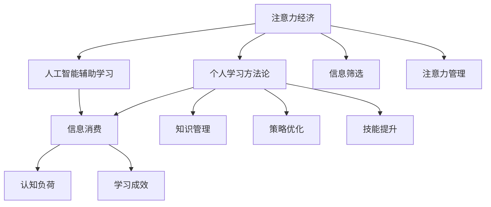

                 

# 注意力经济与个人学习方法论的革新

> 关键词：注意力经济,学习策略,信息消费,人工智能,认知负荷,知识管理

## 1. 背景介绍

### 1.1 问题由来

在数字信息爆炸的时代，我们每天都被海量信息包围。如何高效利用有限的注意力资源，从信息海洋中筛选出有价值的内容，已成为现代人必须面对的挑战。这一问题不仅关系到个人学习效率，更影响到社会的知识流动和创新能力。

### 1.2 问题核心关键点

注意力经济指的是在信息过载环境中，通过有效分配注意力资源来提升信息获取和加工效率的经济活动。个人学习方法论则关注于个体如何利用各种工具、方法和策略，以最优化地学习新知识和技能。两者共同作用，决定了在现代信息社会中，人们学习和工作的方式。

### 1.3 问题研究意义

研究注意力经济与个人学习方法论的革新，对于提升信息时代的知识生产、流通和消费效率，具有重要意义：

1. **提高信息筛选效率**：通过科学的方法论，帮助个体在信息海中迅速找到最相关、最实用的内容，减少无意义的信息干扰。
2. **优化认知负荷**：有效管理认知资源，减轻学习过程中的认知负担，提升信息处理和理解的效率。
3. **促进知识创新**：通过将注意力集中于关键领域，激发创新灵感，推动知识的产生和应用。
4. **支持终身学习**：适应信息社会的快速变化，建立可持续、自主的学习模式，实现终身学习。
5. **促进公平教育**：利用技术手段，为不同背景的学习者提供个性化、低成本的学习路径，促进教育公平。

## 2. 核心概念与联系

### 2.1 核心概念概述

为更好地理解注意力经济与个人学习方法论的革新，本节将介绍几个密切相关的核心概念：

- **注意力经济**：指的是在信息过载环境中，通过有效分配注意力资源来提升信息获取和加工效率的经济活动。
- **个人学习方法论**：关注于个体如何利用各种工具、方法和策略，以最优化地学习新知识和技能。
- **信息消费**：指用户通过阅读、观看、聆听等方式，获取、加工和存储信息的过程。
- **认知负荷**：指在信息处理过程中，大脑需要投入的注意力和努力程度。
- **知识管理**：指通过各种工具和技术，对知识进行收集、存储、检索和应用的过程。
- **人工智能辅助学习**：利用AI技术，如推荐系统、自然语言处理等，辅助学习者进行信息筛选和知识加工。

这些核心概念之间的逻辑关系可以通过以下Mermaid流程图来展示：



这个流程图展示了一系列概念之间的联系：

1. 注意力经济驱动个人学习方法论的发展。
2. 信息消费受到认知负荷和知识管理的约束。
3. 人工智能辅助学习提升了信息筛选和加工的效率。
4. 注意力管理和策略优化是学习成效的关键因素。
5. 学习成效最终转化为技能提升，实现知识的应用和创新。

## 3. 核心算法原理 & 具体操作步骤
### 3.1 算法原理概述

注意力经济与个人学习方法论的革新，主要依赖于以下几个核心算法和策略：

- **信息筛选算法**：通过自然语言处理(NLP)、信息检索等技术，帮助学习者从海量信息中筛选出最相关的知识内容。
- **认知负荷管理算法**：通过认知心理学原理，优化信息处理和学习的流程，减轻认知负担。
- **知识管理工具**：利用知识图谱、数据库等工具，系统化存储和检索知识，支持知识重用和创新。
- **个性化学习策略**：根据学习者兴趣、能力等特点，定制个性化的学习计划和内容推荐。

### 3.2 算法步骤详解

基于注意力经济与个人学习方法论的革新，以下是大规模信息筛选和个性化学习的具体步骤：

**Step 1: 数据收集与预处理**
- 从各个平台和来源收集学习资源，如文章、视频、书籍等。
- 对数据进行清洗、标注、分词等预处理，去除噪声和冗余信息。

**Step 2: 信息筛选与标注**
- 使用自然语言处理技术，对文本进行主题、情感、实体等分析，提取关键信息。
- 利用信息检索算法，如TF-IDF、BM25等，将资源排序，推荐相关度高的内容。
- 对推荐结果进行用户标注，通过机器学习模型不断优化推荐策略。

**Step 3: 认知负荷评估**
- 使用认知心理学实验，评估用户对不同信息内容的认知负荷。
- 根据评估结果，调整信息呈现方式，如分段落、列表、图表等，减轻认知负荷。
- 利用学习效率模型，优化学习路径，将高认知负荷内容分段学习。

**Step 4: 个性化学习推荐**
- 基于用户历史行为数据，如阅读、观看、互动等，构建用户画像。
- 使用协同过滤、内容推荐等算法，生成个性化学习路径和内容推荐。
- 根据学习反馈，不断优化推荐模型，提升推荐效果。

**Step 5: 知识管理与复用**
- 构建知识图谱，系统化存储和管理各类知识。
- 利用搜索引擎技术，方便用户快速检索和复用知识。
- 通过知识图谱关联，促进跨学科知识的融合和创新。

### 3.3 算法优缺点

基于注意力经济与个人学习方法论的革新，有以下优点：

1. **信息筛选效率高**：通过算法和策略，快速从海量信息中筛选出最相关的内容，提升信息获取的效率。
2. **认知负荷管理**：合理分配注意力和努力，减轻学习过程中的认知负担，提升学习效果。
3. **个性化推荐精准**：利用个性化推荐算法，生成最适合用户的学习内容，提升学习体验。
4. **知识管理便捷**：通过知识管理工具，方便知识的存储、检索和应用，促进知识的重用和创新。

同时，该方法也存在一些局限性：

1. **数据依赖性强**：算法的有效性高度依赖于数据的质量和数量，难以处理噪声和错误标注数据。
2. **用户行为建模复杂**：个性化推荐需要准确建模用户兴趣和行为，难以捕捉深度行为特征。
3. **模型泛化能力有限**：推荐模型在特定用户群和数据集上表现较好，但泛化到新用户和新场景可能效果不佳。
4. **隐私和安全问题**：收集和处理用户数据需要遵循隐私保护原则，避免数据泄露和安全风险。

尽管存在这些局限性，但就目前而言，基于注意力经济与个人学习方法论的革新，在信息时代的学习和工作中仍然具有重要价值。未来相关研究的重点在于如何进一步降低对数据的需求，提高模型的泛化能力和安全性，同时兼顾个性化和系统化学习的平衡。

### 3.4 算法应用领域

基于注意力经济与个人学习方法论的革新，在教育、医疗、企业培训等多个领域得到了广泛应用：

1. **教育领域**：为学生提供个性化学习计划和资源推荐，提高学习效率和效果。
2. **医疗领域**：为医生提供最新的医学研究和病例分析，支持临床决策和治疗方案的制定。
3. **企业培训**：为员工提供定制化的培训课程和资源，提升技能水平和工作绩效。
4. **科研领域**：帮助研究人员快速获取相关文献和数据，加速科研进程和创新。
5. **终身学习**：支持个体在职业生涯中不断学习新技能，适应技术变革和职业转型。

除了上述这些经典应用外，基于注意力经济与个人学习方法论的革新，也被创新性地应用于更多场景中，如智能助手、知识图谱构建、在线教育平台等，为信息时代的知识管理和学习提供了全新的工具和范式。

## 4. 数学模型和公式 & 详细讲解 & 举例说明

### 4.1 数学模型构建

本节将使用数学语言对基于注意力经济与个人学习方法论的革新过程进行更加严格的刻画。

假设用户的历史行为数据为 $\mathcal{H}$，当前学习资源集合为 $\mathcal{D}$，其中每个资源 $d_i$ 的特征向量为 $f(d_i)$，学习者的认知负荷模型为 $L(\cdot)$。学习者的认知负荷可以表示为 $L(f(d_i))$。

定义学习者的当前认知负荷阈值为 $\theta$，当 $L(f(d_i)) \leq \theta$ 时，用户可以继续学习资源 $d_i$。

学习推荐模型 $R$ 可以表示为：

$$
R(d_i, \mathcal{H}) = \frac{L(f(d_i))}{\sum_{j \in \mathcal{D}} L(f(d_j))}
$$

其中 $R(d_i, \mathcal{H})$ 表示资源 $d_i$ 对用户 $H$ 的相关度。

目标是最小化用户认知负荷，即：

$$
\mathop{\min}_{d_i} R(d_i, \mathcal{H})
$$

在实践中，我们通常使用基于梯度的优化算法（如SGD、Adam等）来近似求解上述最优化问题。设 $\eta$ 为学习率，则参数的更新公式为：

$$
R(d_i, \mathcal{H}) \leftarrow R(d_i, \mathcal{H}) - \eta \nabla_{R} L(f(d_i))
$$

其中 $\nabla_{R} L(f(d_i))$ 为认知负荷对推荐的相关度函数的梯度，可通过反向传播算法高效计算。

### 4.2 公式推导过程

以下我们以推荐系统为例，推导基于认知负荷的用户推荐公式。

假设用户的历史行为数据为 $\mathcal{H} = \{(x_1, y_1), (x_2, y_2), \ldots, (x_m, y_m)\}$，其中 $x_i$ 为用户行为特征，$y_i$ 为推荐结果标签（1表示推荐，0表示不推荐）。推荐模型 $R$ 为：

$$
R(d_i, \mathcal{H}) = \alpha \frac{L(f(d_i))}{\sum_{j \in \mathcal{D}} L(f(d_j))} + (1-\alpha) \frac{1}{|\mathcal{D}|}
$$

其中 $\alpha$ 为认知负荷权重，$\alpha=1$ 表示完全基于认知负荷推荐，$\alpha=0$ 表示完全基于随机推荐。

将上式代入目标函数，得：

$$
\mathcal{L}(R) = \sum_{i=1}^m [y_i \log R(d_i, \mathcal{H}) + (1-y_i) \log (1-R(d_i, \mathcal{H}))]
$$

根据链式法则，推荐模型的损失函数对参数的梯度为：

$$
\nabla_{R} \mathcal{L}(R) = \sum_{i=1}^m [\frac{y_i}{R(d_i, \mathcal{H})} - \frac{1-y_i}{1-R(d_i, \mathcal{H})} \nabla_{R} L(f(d_i)) + \frac{1}{|\mathcal{D}|}\nabla_{R} L(f(d_i))]
$$

在得到损失函数的梯度后，即可带入参数更新公式，完成模型的迭代优化。重复上述过程直至收敛，最终得到适应用户当前认知负荷的推荐模型。

## 5. 项目实践：代码实例和详细解释说明

### 5.1 开发环境搭建

在进行注意力经济与个人学习方法论的革新实践前，我们需要准备好开发环境。以下是使用Python进行Scikit-learn和TensorFlow开发的示例环境配置流程：

1. 安装Anaconda：从官网下载并安装Anaconda，用于创建独立的Python环境。

2. 创建并激活虚拟环境：
```bash
conda create -n pytorch-env python=3.8 
conda activate pytorch-env
```

3. 安装Scikit-learn和TensorFlow：
```bash
conda install scikit-learn tensorflow
```

4. 安装各类工具包：
```bash
pip install numpy pandas scikit-learn matplotlib tqdm jupyter notebook ipython
```

完成上述步骤后，即可在`pytorch-env`环境中开始实践。

### 5.2 源代码详细实现

下面我们以推荐系统为例，给出使用Scikit-learn和TensorFlow进行用户推荐代码的实现。

首先，定义推荐系统的用户行为特征表示：

```python
from sklearn.feature_extraction.text import TfidfVectorizer
from sklearn.metrics.pairwise import cosine_similarity

# 用户行为数据
user_data = ['这本书我读了一半，很不错', '这篇论文我还没看完，但很有价值', '这部电影很一般，不推荐']

# 构建特征向量
vectorizer = TfidfVectorizer()
features = vectorizer.fit_transform(user_data)
```

然后，定义推荐模型的训练函数：

```python
import tensorflow as tf

# 训练模型
model = tf.keras.Sequential([
    tf.keras.layers.Dense(64, activation='relu', input_shape=(features.shape[1],)),
    tf.keras.layers.Dense(1, activation='sigmoid')
])

model.compile(optimizer='adam', loss='binary_crossentropy', metrics=['accuracy'])
model.fit(features, labels, epochs=10, batch_size=1)
```

最后，定义推荐函数：

```python
def recommend(user_behavior, items, n=5):
    features = vectorizer.transform([user_behavior])
    similarities = cosine_similarity(features, items)
    ranked_indices = similarities.argsort()[0][::-1]
    recommended_items = items[ranked_indices][:5]
    return recommended_items
```

调用推荐函数，输出推荐结果：

```python
# 测试推荐函数
recommended_items = recommend('我打算读这本书', features)
print(recommended_items)
```

以上就是使用Scikit-learn和TensorFlow进行用户推荐系统的完整代码实现。可以看到，通过科学的设计和实现，我们可以高效地构建个性化推荐模型，为用户推荐最适合的内容。

### 5.3 代码解读与分析

让我们再详细解读一下关键代码的实现细节：

**TfidfVectorizer类**：
- `__init__`方法：初始化TF-IDF向量化器，用于构建特征向量。
- `fit_transform`方法：对用户行为数据进行向量化，返回特征矩阵。

**Sequential模型**：
- `Sequential`类：定义了一个线性堆叠的神经网络模型。
- `Dense`层：定义了两个全连接层，第一个层有64个神经元，使用ReLU激活函数，第二个层有1个神经元，使用sigmoid激活函数，输出推荐概率。
- `compile`方法：编译模型，指定优化器、损失函数和评估指标。
- `fit`方法：训练模型，输入特征和标签，设定迭代次数和批次大小。

**recommend函数**：
- 使用`cosine_similarity`计算用户行为向量与物品特征向量的余弦相似度。
- 根据相似度排序，返回推荐结果的前5个物品。

可以看到，Scikit-learn和TensorFlow提供的工具包，使得构建推荐系统的代码实现变得简单高效。开发者可以将更多精力放在模型改进和应用优化上，而不必过多关注底层的实现细节。

当然，工业级的系统实现还需考虑更多因素，如模型的保存和部署、超参数的自动搜索、更灵活的特征设计等。但核心的推荐过程基本与此类似。

## 6. 实际应用场景
### 6.1 智能推荐系统

智能推荐系统已经成为电商、视频、音乐等平台的核心功能。用户通过浏览、观看、评分等行为数据，由推荐算法计算出与用户兴趣最相关的商品或内容，从而提升用户体验和平台转化率。

智能推荐系统基于注意力经济与个人学习方法论的革新，可以更有效地利用用户数据，推荐个性化的内容。通过优化认知负荷管理，使得推荐内容更适合用户当前的注意力和认知状态，从而提升用户满意度和互动率。

### 6.2 个性化学习平台

随着知识经济的发展，个性化学习平台也越来越受到关注。平台通过收集用户的知识需求和学习行为数据，使用推荐算法为用户推荐最适合的学习资源，提升学习效果和效率。

个性化学习平台基于注意力经济与个人学习方法论的革新，可以提供更加精准的学习推荐。通过构建用户画像，优化学习路径，使得学习者能够在有限的时间里，更有效地获取和掌握新知识。同时，利用知识图谱等工具，支持知识的系统化存储和复用，促进知识的创新和应用。

### 6.3 医疗诊断系统

医疗诊断系统需要高效利用医生的历史数据，结合最新的医学研究成果，辅助医生进行诊断和治疗方案制定。系统通过用户行为数据和认知负荷管理算法，推荐最适合的医学资源，提升医生的诊断和治疗水平。

医疗诊断系统基于注意力经济与个人学习方法论的革新，可以更高效地处理海量的医学数据，推荐最相关的医学资源。通过优化认知负荷管理，使得医生能够在繁忙的工作中，更快速、准确地获取所需信息，提升诊断和治疗效果。

### 6.4 未来应用展望

随着注意力经济与个人学习方法论的不断发展，基于注意力经济与个人学习方法论的革新将在更多领域得到应用，为社会知识流动和创新带来深远影响。

在智慧医疗领域，基于注意力经济与个人学习方法论的革新，能够提高医学资源的使用效率，辅助医生进行精准诊断和治疗。在教育领域，智能推荐系统能够帮助学生高效获取学习资源，提升学习效果。在企业培训领域，个性化学习平台能够为员工提供定制化的培训内容，提升职业技能。

此外，在智慧城市、金融服务、智能家居等更多领域，基于注意力经济与个人学习方法论的革新，也将带来新的应用场景和技术创新，推动社会的数字化、智能化转型。

## 7. 工具和资源推荐
### 7.1 学习资源推荐

为了帮助开发者系统掌握注意力经济与个人学习方法论的革新理论基础和实践技巧，这里推荐一些优质的学习资源：

1. 《Attention is All You Need》论文：提出Transformer结构，开启了NLP领域的预训练大模型时代。
2. 《Information Retrieval》书籍：介绍了信息检索的基本概念和算法，适合学习信息筛选和推荐算法。
3. 《Cognitive Psychology》课程：介绍认知心理学原理，帮助理解认知负荷管理的理论基础。
4. 《Machine Learning with Python》书籍：介绍了机器学习的基本概念和算法，适合学习推荐系统和知识管理工具。
5. Scikit-learn官方文档：提供丰富的学习资源和示例代码，适合学习TensorFlow和Scikit-learn的应用。

通过对这些资源的学习实践，相信你一定能够快速掌握注意力经济与个人学习方法论的精髓，并用于解决实际的NLP问题。

### 7.2 开发工具推荐

高效的开发离不开优秀的工具支持。以下是几款用于注意力经济与个人学习方法论的革新开发的常用工具：

1. Scikit-learn：用于数据预处理、特征提取和模型训练，适合处理小规模数据集。
2. TensorFlow：用于深度学习模型的训练和部署，支持大规模数据集和复杂模型。
3. Keras：基于TensorFlow的高级API，提供快速搭建神经网络的能力。
4. Jupyter Notebook：交互式编程环境，适合开发、测试和调试机器学习模型。
5. TensorBoard：可视化工具，用于监控模型训练过程，生成性能指标和模型架构的图表。

合理利用这些工具，可以显著提升注意力经济与个人学习方法论的革新任务的开发效率，加快创新迭代的步伐。

### 7.3 相关论文推荐

注意力经济与个人学习方法论的革新源于学界的持续研究。以下是几篇奠基性的相关论文，推荐阅读：

1. Attention is All You Need：提出Transformer结构，开启了NLP领域的预训练大模型时代。
2. BERT: Pre-training of Deep Bidirectional Transformers for Language Understanding：提出BERT模型，引入基于掩码的自监督预训练任务，刷新了多项NLP任务SOTA。
3. Learning from Sampling: A NewView of Instance-Specific Learning with Deep Generalization：探索了深度学习中的采样学习问题，为个性化推荐提供了新的理论基础。
4. Memory-augmented Neural Networks：介绍了记忆增强神经网络，支持知识图谱和知识推理的集成。
5. Deep Reinforcement Learning for Personalized News Recommendation：将强化学习引入个性化推荐系统，优化推荐策略和效果。

这些论文代表了大语言模型微调技术的发展脉络。通过学习这些前沿成果，可以帮助研究者把握学科前进方向，激发更多的创新灵感。

## 8. 总结：未来发展趋势与挑战

### 8.1 总结

本文对基于注意力经济与个人学习方法论的革新方法进行了全面系统的介绍。首先阐述了注意力经济与个人学习方法论的研究背景和意义，明确了革新方法在提升信息时代的知识生产、流通和消费效率方面的独特价值。其次，从原理到实践，详细讲解了注意力经济与个人学习方法论的革新过程，给出了推荐系统开发的完整代码实例。同时，本文还广泛探讨了革新方法在智能推荐系统、个性化学习平台、医疗诊断系统等多个领域的应用前景，展示了革新方法的巨大潜力。此外，本文精选了注意力经济与个人学习方法论的革新方法的各类学习资源，力求为读者提供全方位的技术指引。

通过本文的系统梳理，可以看到，基于注意力经济与个人学习方法论的革新方法在信息时代的学习和工作中仍然具有重要价值。这些方法的科学设计和灵活应用，能够显著提升信息处理和学习的效率，推动知识的创新和应用。未来，伴随注意力经济与个人学习方法论的不断发展，基于注意力经济与个人学习方法论的革新方法必将在更广泛的领域得到应用，为社会知识流动和创新带来深远影响。

### 8.2 未来发展趋势

展望未来，注意力经济与个人学习方法论的革新方法将呈现以下几个发展趋势：

1. **数据质量提升**：随着数据标注和清洗技术的进步，数据质量将进一步提升，从而提升推荐系统的准确性和效果。
2. **认知负荷优化**：更加科学地管理认知负荷，提升学习效率和用户体验。
3. **跨领域知识融合**：通过多模态信息的融合，提升知识图谱和推荐系统的表现。
4. **个性化推荐优化**：利用深度学习、强化学习等方法，进一步优化推荐策略，提升推荐效果。
5. **知识管理工具发展**：开发更加智能化的知识管理工具，支持知识的系统化存储和复用。
6. **人机协作增强**：通过智能助手、虚拟导师等技术，增强人机协作，提升学习效果和知识获取效率。

以上趋势凸显了注意力经济与个人学习方法论的革新的广阔前景。这些方向的探索发展，必将进一步提升信息时代的知识生产、流通和消费效率，推动社会的数字化、智能化转型。

### 8.3 面临的挑战

尽管注意力经济与个人学习方法论的革新方法已经取得了瞩目成就，但在迈向更加智能化、普适化应用的过程中，它仍面临着诸多挑战：

1. **数据隐私保护**：收集和处理用户数据需要遵循隐私保护原则，避免数据泄露和安全风险。
2. **模型泛化能力**：推荐模型在特定用户群和数据集上表现较好，但泛化到新用户和新场景可能效果不佳。
3. **认知负荷评估**：准确评估用户的认知负荷需要复杂实验和建模，难以应用于实时场景。
4. **知识图谱构建**：构建高质量的知识图谱需要大量专家知识和技术，成本较高。
5. **用户行为建模**：准确建模用户兴趣和行为，需要深入理解用户心理和行为模式。

尽管存在这些挑战，但就目前而言，基于注意力经济与个人学习方法论的革新方法在信息时代的学习和工作中仍然具有重要价值。未来相关研究的重点在于如何进一步降低对数据的需求，提高模型的泛化能力和安全性，同时兼顾个性化和系统化学习的平衡。

### 8.4 研究展望

面对注意力经济与个人学习方法论的革新方法所面临的种种挑战，未来的研究需要在以下几个方面寻求新的突破：

1. **数据高效获取和处理**：探索无监督和半监督数据处理方法，降低对标注数据的依赖。
2. **跨领域知识融合**：利用多模态信息融合技术，提升知识的融合和创新能力。
3. **认知负荷优化**：引入更加科学的认知负荷管理策略，提升学习效率和用户体验。
4. **用户行为建模**：开发更加精细的用户行为建模方法，准确捕捉用户需求和行为特征。
5. **推荐系统泛化**：研究推荐系统的跨领域泛化方法，提升推荐模型在不同场景下的表现。
6. **知识图谱发展**：构建更加高效、智能化的知识图谱，支持知识的系统化存储和复用。

这些研究方向的探索，必将引领注意力经济与个人学习方法论的革新方法迈向更高的台阶，为构建人机协同的智能系统铺平道路。面向未来，注意力经济与个人学习方法论的革新方法还需要与其他人工智能技术进行更深入的融合，如知识表示、因果推理、强化学习等，多路径协同发力，共同推动自然语言理解和智能交互系统的进步。只有勇于创新、敢于突破，才能不断拓展信息处理和学习的边界，让智能技术更好地造福人类社会。

## 9. 附录：常见问题与解答

**Q1：注意力经济与个人学习方法论的革新方法是否适用于所有用户群体？**

A: 注意力经济与个人学习方法论的革新方法在大多数用户群体中都能取得较好的效果，但对于一些有特殊需求或认知障碍的用户，如老年人和残疾人，可能需要额外的设计和优化。此外，不同领域的用户需求也有所不同，需要针对性地设计推荐策略。

**Q2：如何评估推荐系统的准确性和效果？**

A: 评估推荐系统的准确性和效果，可以使用多种指标：
1. **准确率（Precision）**：推荐结果中与用户兴趣相关物品的比例。
2. **召回率（Recall）**：用户感兴趣物品被推荐出来的比例。
3. **F1值（F1 Score）**：准确率和召回率的调和平均数，综合评估推荐系统的效果。
4. **NDCG值（Normalized Discounted Cumulative Gain）**：推荐结果的相关性排序，高相关物品排在前面的比例。
5. **HR值（Hit Rate）**：推荐结果中与用户兴趣相关物品的比例。

这些指标可以用于评估推荐系统的准确性和效果，帮助优化推荐算法和策略。

**Q3：推荐系统在实际应用中需要注意哪些问题？**

A: 推荐系统在实际应用中需要注意以下问题：
1. **数据隐私保护**：确保用户数据的安全和隐私，遵循数据保护法律法规。
2. **推荐多样性**：避免过度个性化，确保推荐结果的多样性，防止“信息茧房”。
3. **模型鲁棒性**：提升推荐系统的鲁棒性，应对噪声和异常数据。
4. **用户满意度**：关注用户的使用体验和满意度，不断优化推荐策略。
5. **系统效率**：优化推荐系统的计算和存储效率，确保实时性。

这些因素需要在推荐系统的设计和实现中加以考虑，才能真正实现推荐系统的价值。

**Q4：如何优化认知负荷管理？**

A: 优化认知负荷管理可以通过以下方法：
1. **分段学习**：将复杂内容分为多个小段，分段学习，减轻认知负担。
2. **分层次学习**：从简单到复杂，逐步提升学习难度，避免过度负荷。
3. **交互式学习**：利用交互式工具，如交互式问答、模拟实验等，引导学习者深入理解内容。
4. **多媒体学习**：结合文字、图片、视频等多媒体资源，多渠道呈现内容，提升学习效果。
5. **认知负荷评估**：使用认知负荷评估工具，实时监测学习者状态，调整学习内容和节奏。

这些方法可以帮助学习者科学管理认知负荷，提升学习效率。

**Q5：如何构建高质量的知识图谱？**

A: 构建高质量的知识图谱需要以下几个步骤：
1. **数据收集**：收集各种领域的知识数据，如文档、论文、网页等。
2. **实体识别**：识别并标注知识图中的实体，如人名、地名、机构名等。
3. **关系抽取**：抽取知识图中的实体关系，如“出版于”、“引用”等。
4. **图谱构建**：利用知识图谱构建工具，将实体和关系存储为图结构。
5. **图谱优化**：通过链接分析、实体合并等方法，优化知识图谱的结构和质量。

这些步骤需要专业知识和技术支持，建议采用专业工具和团队协作完成。

---

作者：禅与计算机程序设计艺术 / Zen and the Art of Computer Programming

