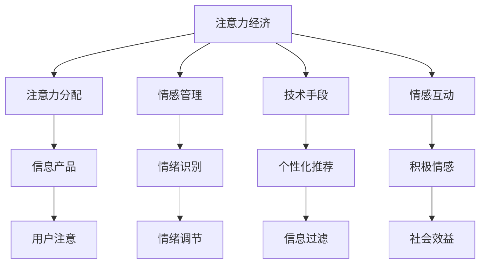

                 

# 注意力经济与个人情感管理的关系

在数字化时代，注意力经济日益成为推动商业模式和社会变革的关键力量。在个人层面，情感管理也愈发重要。二者之间的关系，以及如何利用技术手段进行优化，是值得深入探讨的话题。本文将通过系统的理论框架和实际案例，揭示注意力经济与个人情感管理的相互作用，并提出具体的技术策略。

## 1. 背景介绍

### 1.1 问题由来
随着数字技术的发展，信息过载成为了普遍现象。用户每天面临海量的信息轰炸，如何有效分配注意力资源，成为个体和社会关注的焦点。同时，个体情感管理的重要性也不断凸显，情感状态影响决策、行为和关系。注意力经济与个人情感管理的交织，成为了当前社会和商业发展的重要趋势。

### 1.2 问题核心关键点
注意力经济和情感管理的核心在于：
- **注意力分配**：用户在特定时间内的注意力资源有限，如何优化注意力分配以提升信息效用？
- **情感管理**：如何识别和管理个体情感，促进积极情感，缓解消极情感，提升生活质量？
- **技术手段**：如何借助技术手段，实现注意力和情感的高效互动和优化？
- **社会影响**：如何通过优化个体情感和注意力，促进社会进步和经济发展？

## 2. 核心概念与联系

### 2.1 核心概念概述

1. **注意力经济**：以注意力为稀缺资源，通过吸引和集中用户的注意力来创造价值。注意力在数字化时代成为了信息产品的核心货币。
2. **情感管理**：通过认知和调节，管理个体的情感状态，以达到积极情感与健康生活的目标。情感管理是个体心理健康的重要组成部分。
3. **技术手段**：指使用数字技术工具，如算法、数据挖掘、个性化推荐等，辅助注意力管理和情感调节。

### 2.2 核心概念原理和架构的 Mermaid 流程图



这个图表展示了注意力经济与个人情感管理的基本联系：
- **注意力分配**：用户注意力的分配直接影响信息产品的价值创造。
- **情感识别与调节**：个体情感状态影响注意力分配和信息吸收。
- **技术手段**：通过个性化推荐和信息过滤，优化注意力分配和情感管理。
- **情感互动**：积极的情感互动促进社会效益。

## 3. 核心算法原理 & 具体操作步骤

### 3.1 算法原理概述
注意力经济与情感管理的关系可以通过以下算法原理进行阐述：

1. **注意力分配算法**：通过机器学习和数据分析，预测和优化用户对信息产品的注意力分配。算法模型需考虑个体差异、时间、情感状态等因素。
2. **情感识别算法**：利用自然语言处理和情感分析技术，识别用户当前的情感状态。常见方法包括情感词典、深度学习模型等。
3. **情感调节算法**：基于认知行为学理论和算法模型，调节用户情感状态，促进积极情感的产生。常见技术包括情感游戏、虚拟现实等。
4. **技术手段优化算法**：结合个性化推荐和信息过滤算法，优化信息流，提高信息产品的用户满意度和情感共鸣。

### 3.2 算法步骤详解
具体来说，算法步骤包括：
1. **数据收集与预处理**：收集用户的互动数据、情感表达数据等，预处理为模型可用的格式。
2. **注意力分配模型训练**：使用历史数据训练模型，预测用户对信息产品的注意力分配。
3. **情感识别模型训练**：使用情感词典、深度学习模型等技术，训练情感识别模型。
4. **情感调节模型训练**：设计情感调节策略，训练情感调节模型。
5. **技术手段优化**：根据情感状态和注意力分布，优化个性化推荐和信息过滤算法。
6. **模型集成与评估**：将注意力分配、情感识别、情感调节和优化手段集成，在实际应用中持续评估和优化。

### 3.3 算法优缺点
#### 优点
- **个性化定制**：通过技术手段，实现个性化推荐，提升信息产品的用户满意度和情感共鸣。
- **高效互动**：优化注意力分配和情感管理，提高用户互动效率和质量。
- **实时调整**：能够根据用户实时反馈，动态调整注意力和情感管理策略。

#### 缺点
- **数据隐私**：需要收集大量用户数据，可能引发隐私保护问题。
- **模型复杂性**：算法模型涉及多个模块，构建和优化较为复杂。
- **用户干预**：用户可能对推荐内容不满，影响体验和情感状态。

### 3.4 算法应用领域
- **数字广告**：通过优化注意力分配和情感管理，提高广告投放的精准度和转化率。
- **内容推荐**：在新闻、社交媒体等平台上，优化信息流，提升用户满意度和情感共鸣。
- **在线教育**：通过个性化推荐和情感调节，提高学习效果和用户满意度。
- **心理健康**：开发情感管理应用，提供心理支持和情感调节建议。

## 4. 数学模型和公式 & 详细讲解 & 举例说明

### 4.1 数学模型构建
本节将使用数学语言对注意力经济与情感管理的模型进行刻画。

假设用户对信息产品 $i$ 的注意力分配为 $A_i$，情感状态为 $E$。模型目标是在给定情感状态 $E$ 下，最大化 $A_i$。

### 4.2 公式推导过程
首先，考虑注意力分配的线性模型：

$$
A_i = \sum_{j=1}^n w_{ij} E_j
$$

其中 $w_{ij}$ 为注意力分配系数，$E_j$ 为情感维度。

情感状态 $E$ 可以表示为一个向量：

$$
E = \begin{bmatrix} e_{1} \\ e_{2} \\ \vdots \\ e_{m} \end{bmatrix}
$$

注意力分配模型转化为优化问题：

$$
\max_{A_i} \sum_{i=1}^m A_i \\
s.t. \quad A_i \in [0,1], \sum_{i=1}^m A_i = 1
$$

通过拉格朗日乘子法，可以得到：

$$
A_i^* = \frac{\partial L}{\partial A_i} = \frac{\partial (\sum_{j=1}^n w_{ij} E_j)}{\partial A_i}
$$

### 4.3 案例分析与讲解
以社交媒体为例，用户对帖子 $i$ 的注意力分配可以表示为：

$$
A_i = \sum_{j=1}^n w_{ij} E_j
$$

其中 $w_{ij}$ 为帖子与用户兴趣的匹配度，$E_j$ 为用户情感状态。

社交媒体平台通过分析用户的互动数据、情感表达等，优化帖子推荐算法，使得推荐内容更能引发用户的积极情感，提升用户的参与度和满意度。

## 5. 项目实践：代码实例和详细解释说明

### 5.1 开发环境搭建
为了进行注意力经济与情感管理的实践，需要搭建相应的开发环境。

1. **安装Python**：下载并安装最新版本的Python，确保支持必要的库。
2. **安装Pandas**：使用pip安装Pandas，用于数据处理。
3. **安装Scikit-learn**：使用pip安装Scikit-learn，用于构建机器学习模型。
4. **安装TensorFlow**：安装TensorFlow，支持深度学习模型训练。
5. **安装PyTorch**：安装PyTorch，支持深度学习模型训练。

### 5.2 源代码详细实现
下面以情感识别模型为例，展示如何使用Scikit-learn进行情感分析。

```python
from sklearn.feature_extraction.text import CountVectorizer
from sklearn.model_selection import train_test_split
from sklearn.linear_model import LogisticRegression
from sklearn.metrics import accuracy_score

# 数据准备
data = pd.read_csv('sentiment_data.csv')
X = data['text']
y = data['label']

# 特征提取
vectorizer = CountVectorizer()
X_vec = vectorizer.fit_transform(X)

# 模型训练
X_train, X_test, y_train, y_test = train_test_split(X_vec, y, test_size=0.2)
model = LogisticRegression()
model.fit(X_train, y_train)

# 模型评估
y_pred = model.predict(X_test)
acc = accuracy_score(y_test, y_pred)
print('Accuracy:', acc)
```

### 5.3 代码解读与分析
- **数据准备**：使用Pandas读取情感数据集，提取文本和标签。
- **特征提取**：使用CountVectorizer将文本转换为词频向量，作为模型输入。
- **模型训练**：使用LogisticRegression进行情感二分类训练。
- **模型评估**：计算模型在测试集上的准确率。

### 5.4 运行结果展示
通过上述代码，可以训练一个简单的情感识别模型，并评估其准确率。结果表明，基于词频向量的情感分类器可以在一定程度上识别用户的情感状态。

## 6. 实际应用场景

### 6.1 数字广告

#### 背景
数字广告行业面临用户注意力分散和转化率低的问题。通过优化注意力分配和情感管理，可以提高广告效果。

#### 案例
某电商平台通过分析用户的历史浏览和购买数据，构建个性化推荐模型。同时，使用情感识别技术，识别用户的情感状态。对于负面情绪用户，平台推送“优惠活动”和“心情故事”等内容，缓解用户负面情绪，提升转化率。

### 6.2 内容推荐

#### 背景
社交媒体平台需要不断优化内容推荐算法，提高用户满意度和情感共鸣。

#### 案例
某视频平台通过分析用户的情感状态和注意力分配，调整推荐内容。对于情感低落的用户，推荐轻松愉快的视频内容；对于情感积极的用户，推荐深度剖析的内容。

### 6.3 在线教育

#### 背景
在线教育平台需要提高学生的学习效果和满意度。

#### 案例
某在线教育平台使用情感识别技术，识别学生的情感状态。对于焦虑和困惑的学生，推送心理辅导和课程预告；对于积极主动的学生，推荐进阶课程和挑战题目。

### 6.4 心理健康

#### 背景
心理健康领域需要高效识别和管理用户的情感状态。

#### 案例
某心理健康应用通过情感识别技术，监测用户的情绪变化。对于情绪异常用户，及时提供心理支持和情感调节建议。

## 7. 工具和资源推荐

### 7.1 学习资源推荐
为了深入了解注意力经济与情感管理的理论，推荐以下学习资源：

1. **《注意力经济》书籍**：全面介绍注意力经济的概念、历史和未来发展。
2. **《情感心理学》书籍**：深入研究情感认知和管理的基本原理和方法。
3. **Coursera情感分析课程**：学习情感分析的理论与实践，利用Python进行情感识别。
4. **Kaggle情感分析竞赛**：参与情感分析竞赛，实践情感识别技术。
5. **Ted Talks注意力经济演讲**：观看关于注意力经济的演讲，了解当前趋势和未来方向。

### 7.2 开发工具推荐
以下是一些常用的开发工具，用于注意力经济与情感管理的实践：

1. **Jupyter Notebook**：轻量级的数据分析和模型构建工具。
2. **Python**：常用的编程语言，支持Pandas、Scikit-learn、TensorFlow等库。
3. **TensorBoard**：可视化工具，用于监控和调试模型训练过程。
4. **Wealthfront**：在线金融投资管理平台，展示注意力经济的应用案例。
5. **Moodfit**：心理健康应用，提供情感管理支持。

### 7.3 相关论文推荐
以下是一些相关的学术论文，推荐阅读：

1. **Attention is All You Need**：Transformer模型的原始论文，奠定了注意力机制在NLP中的应用基础。
2. **Personalized Learning Analytics for K-12 in Educational Data Mining (EDM)**：探索个性化推荐在在线教育中的应用。
3. **Sentiment Analysis using LSTM and BERT**：介绍基于LSTM和BERT的情感识别模型。
4. **Practical Recommendation Systems**：推荐系统的经典书籍，涵盖推荐算法和实现细节。
5. **Crowdsourcing Content Aggregation for Content-Beyond-Content Applications**：探讨注意力经济在内容聚合中的应用。

## 8. 总结：未来发展趋势与挑战

### 8.1 研究成果总结
本文通过系统分析注意力经济与个人情感管理的联系，揭示了二者的相互作用。通过数学模型和案例分析，展示了注意力分配、情感识别和情感调节的算法原理和操作步骤。通过代码实例，演示了情感识别模型的实现。同时，介绍了注意力经济和情感管理在多个实际应用场景中的应用。

### 8.2 未来发展趋势
未来的发展趋势包括：
- **个性化推荐和内容生成**：结合生成对抗网络（GAN）和注意力机制，开发更加智能化的推荐系统和内容生成工具。
- **跨领域应用**：扩展注意力经济和情感管理的应用领域，涵盖更多行业和场景。
- **情感计算和认知科学**：结合认知科学和情感计算，进一步提升情感识别和调节的精度和效果。
- **多模态交互**：结合视觉、听觉等多模态数据，实现更加自然和智能的情感互动。

### 8.3 面临的挑战
尽管取得了一定的进展，但注意力经济与情感管理仍面临以下挑战：
- **数据隐私**：如何保护用户数据隐私，确保数据使用合规。
- **模型复杂性**：多模态、多场景的注意力分配和情感调节模型复杂，需要高效的算法和计算资源。
- **技术普及**：如何让更多人理解和使用注意力经济和情感管理技术，需要更多的教育和普及工作。
- **伦理和道德**：如何确保技术应用符合伦理和道德标准，避免负面影响。

### 8.4 研究展望
未来的研究应重点关注以下几个方向：
- **跨学科融合**：结合心理学、经济学、计算机科学等多个学科的理论和方法，推动注意力经济和情感管理的研究。
- **前沿技术**：引入最新的AI技术，如深度学习、强化学习、多模态学习等，提升模型效果和应用效果。
- **社会影响**：研究注意力经济和情感管理对社会行为、心理健康的长期影响，为政策制定提供科学依据。
- **技术伦理**：制定相关的技术伦理标准，确保技术应用符合社会价值观和道德规范。

## 9. 附录：常见问题与解答

### 9.1 问题1: 如何保护用户数据隐私？

**解答**：保护用户数据隐私是注意力经济和情感管理应用的核心问题。以下是几种保护用户数据隐私的策略：
- **数据匿名化**：对用户数据进行匿名化处理，去除敏感信息。
- **差分隐私**：使用差分隐私技术，对用户数据进行扰动，保护数据隐私。
- **数据分级**：根据用户隐私敏感度，对数据进行分级管理，限制高敏感数据的访问权限。

### 9.2 问题2: 注意力分配和情感管理如何结合？

**解答**：注意力分配和情感管理可以结合如下方式：
- **联合模型训练**：同时训练注意力分配和情感管理模型，使二者协同工作。
- **多模态数据融合**：结合用户的文本、语音、行为等多模态数据，综合优化注意力分配和情感管理策略。
- **实时反馈**：根据用户的实时反馈，动态调整注意力分配和情感管理策略。

### 9.3 问题3: 如何实现高效的用户情感管理？

**解答**：实现高效的用户情感管理，需要以下策略：
- **智能情感识别**：使用深度学习模型，提高情感识别的准确率。
- **个性化情感调节**：根据用户的情感状态，推送个性化的情感调节建议和内容。
- **用户参与**：鼓励用户参与情感管理过程，增强情感调节的效果。

---

作者：禅与计算机程序设计艺术 / Zen and the Art of Computer Programming

