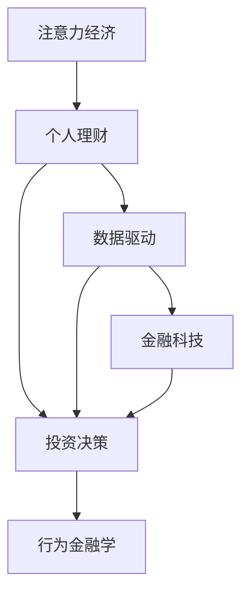

                 

# 注意力经济与个人理财观念的演变

> 关键词：注意力经济, 个人理财, 数据驱动, 金融科技, 投资决策, 行为金融学

## 1. 背景介绍

### 1.1 问题由来
在数字化和互联网技术迅猛发展的今天，个人理财已经从传统的储蓄、投资、消费等单一行为，逐渐演变为一个复杂多维的“注意力经济”过程。伴随社交媒体、搜索引擎、在线市场等平台兴起，个人理财不仅涉及资金的配置，更关乎于个人对信息的获取、处理和利用能力。注意力经济的概念由此应运而生，这一新兴经济形态对传统个人理财观念产生了深远的影响。

### 1.2 问题核心关键点
1. **信息泛滥与获取成本**：互联网时代信息泛滥，但高质量信息稀缺，如何有效筛选、处理和利用信息，成为个人理财的关键。
2. **注意力分配与投资决策**：个人有限的注意力资源如何高效分配，以支持投资决策的科学性和合理性。
3. **数据驱动与个性化理财**：利用大数据、机器学习等技术，实现个性化、精准化的理财方案推荐。
4. **理财科技与人工智能**：人工智能和金融科技的融合，为个人理财带来新的工具和方法。
5. **行为金融与心理模型**：基于行为金融学理论，探索个人理财行为的心理机制，实现理财行为的优化。

## 2. 核心概念与联系

### 2.1 核心概念概述

为更好地理解注意力经济对个人理财观念的影响，本节将介绍几个关键概念：

- **注意力经济**：基于信息时代人们注意力的稀缺性和宝贵性，以获取、分配和利用注意力为核心的新型经济形态。
- **个人理财**：通过科学规划和管理个人收入与支出，实现财富增值和个人目标的实现。
- **数据驱动**：利用大数据分析、机器学习等技术，从海量数据中提取有价值的信息，指导理财决策。
- **金融科技**：利用互联网、大数据、人工智能等技术，创新金融产品和服务，优化金融业务流程。
- **投资决策**：根据市场分析和个人理财目标，做出资金配置和资产选择的决策过程。
- **行为金融学**：研究个体在金融市场中的非理性行为和心理因素，以改进投资策略和理财行为。

这些核心概念之间的关系，可以通过以下Mermaid流程图来展示：



这个流程图展示了注意力经济与个人理财的紧密联系，以及数据驱动、金融科技、行为金融学等多个概念如何共同作用于个人理财决策过程。

## 3. 核心算法原理 & 具体操作步骤
### 3.1 算法原理概述

基于注意力经济和个人理财观念的演变，本节将深入介绍注意力分配在理财决策中的核心算法原理和操作步骤。

### 3.2 算法步骤详解

个人理财的决策过程可概括为以下几个步骤：

1. **信息筛选与获取**：通过智能推荐算法，筛选高质量的金融信息，减少噪音干扰。
2. **注意力分配**：利用注意力模型，优化个人对不同金融信息的关注度，实现资源的最优分配。
3. **投资决策**：基于历史数据和预测模型，优化投资组合，提升资产回报率。
4. **风险管理**：结合风险评估模型，动态调整投资策略，规避风险。
5. **行为分析与调整**：通过行为分析，优化理财行为，提升理财效果。

以智能推荐算法和注意力模型为例，详细讲解这两个步骤。

### 3.3 算法优缺点

基于注意力经济和数据驱动的个人理财方法具有以下优点：

1. **信息获取效率高**：智能推荐算法和注意力模型大幅提升了信息筛选和处理效率，减少了信息获取成本。
2. **决策科学性提升**：基于数据的量化分析和模型优化，提高了理财决策的科学性和合理性。
3. **个性化程度高**：通过大数据分析，可以提供高度个性化的理财方案，满足不同个体的需求。
4. **实时性增强**：结合金融科技手段，可以实现理财业务的实时处理和动态调整。

但同时，该方法也存在以下局限性：

1. **数据依赖性强**：高质量金融数据的获取和维护成本较高，数据偏差可能导致错误决策。
2. **模型复杂度**：智能推荐和注意力模型的实现需要复杂的算法和大量的计算资源。
3. **用户隐私保护**：在收集和使用用户数据时，需确保数据隐私和安全性。
4. **市场变化响应**：模型可能需要频繁更新，以适应市场环境的快速变化。

### 3.4 算法应用领域

基于注意力经济和数据驱动的个人理财方法，已经在多个金融领域得到广泛应用，包括但不限于：

1. **投资组合优化**：利用算法优化投资组合，提升资产回报率。
2. **金融产品推荐**：根据用户行为和偏好，推荐合适的金融产品。
3. **信用评分**：结合用户历史数据和行为分析，评估信用评分。
4. **风险预警**：通过机器学习模型，实现市场风险的实时监测和预警。
5. **智能投顾**：利用人工智能技术，提供智能投资顾问服务。

## 4. 数学模型和公式 & 详细讲解 & 举例说明

### 4.1 数学模型构建

为更好地理解注意力模型在理财决策中的应用，本节将构建一个简单的注意力模型。

假设用户关注的三类金融信息：股票价格、债券利率和市场指数。记 $x_1, x_2, x_3$ 为对应的信息向量， $w_1, w_2, w_3$ 为对应的注意力权重。构建注意力模型的目标是最大化信息加权和：

$$
\max \sum_{i=1}^3 w_i x_i
$$

其中， $w_i$ 满足：

$$
w_i \in [0,1], \sum_{i=1}^3 w_i = 1
$$

### 4.2 公式推导过程

注意力模型的核心是注意力权重 $w_i$ 的计算。根据softmax函数的定义，有：

$$
w_i = \frac{\exp(x_i^\top A_i)}{\sum_{j=1}^3 \exp(x_j^\top A_j)}
$$

其中， $A_i$ 为注意力向量，可以通过用户历史行为数据、市场特征等进行训练。最终，注意力模型可以给出每个信息的重要度评分，指导用户决策。

### 4.3 案例分析与讲解

以下是一个简单的案例，展示如何利用注意力模型优化投资决策：

假设某用户每天查看财经新闻、社交媒体和投资博客三种信息。通过历史数据分析，我们得到一个注意力模型，计算出每天对每种信息的注意力权重如下：

- 财经新闻：0.3
- 社交媒体：0.4
- 投资博客：0.3

基于这些权重，用户可以决定将更多注意力投向社交媒体和投资博客，因为这两种信息在近期的市场分析中更加重要。

## 5. 项目实践：代码实例和详细解释说明

### 5.1 开发环境搭建

在进行理财模型开发前，我们需要准备好开发环境。以下是使用Python进行TensorFlow开发的流程：

1. 安装Anaconda：从官网下载并安装Anaconda，用于创建独立的Python环境。

2. 创建并激活虚拟环境：
```bash
conda create -n finance-env python=3.8 
conda activate finance-env
```

3. 安装TensorFlow：根据CUDA版本，从官网获取对应的安装命令。例如：
```bash
conda install tensorflow -c tf -c conda-forge
```

4. 安装各类工具包：
```bash
pip install pandas numpy scikit-learn seaborn matplotlib scikit-optimize
```

完成上述步骤后，即可在`finance-env`环境中开始理财模型开发。

### 5.2 源代码详细实现

下面我们以投资组合优化为例，给出使用TensorFlow实现注意力模型的PyTorch代码实现。

首先，定义模型和优化器：

```python
import tensorflow as tf
from tensorflow.keras.layers import Input, Dense, Dropout
from tensorflow.keras.models import Model
from tensorflow.keras.optimizers import Adam

# 定义模型输入
x1 = Input(shape=(10,))
x2 = Input(shape=(20,))
x3 = Input(shape=(15,))

# 定义注意力模型
attention_layer = Dense(100, activation='relu')(x1)
attention_layer = Dropout(0.5)(attention_layer)
attention_layer = Dense(3, activation='softmax')(attention_layer)

# 定义决策层
output_layer = Dense(1, activation='sigmoid')(attention_layer)

# 定义模型
model = Model(inputs=[x1, x2, x3], outputs=output_layer)

# 定义优化器
optimizer = Adam(learning_rate=0.001)

# 编译模型
model.compile(optimizer=optimizer, loss='binary_crossentropy')
```

接着，定义训练和评估函数：

```python
def train_epoch(model, train_dataset, batch_size, optimizer):
    dataloader = tf.data.Dataset.from_tensor_slices(train_dataset)
    dataloader = dataloader.batch(batch_size).shuffle(buffer_size=1000)
    model.train()
    epoch_loss = 0
    for batch in dataloader:
        x1_batch, x2_batch, x3_batch = batch
        with tf.GradientTape() as tape:
            predictions = model([x1_batch, x2_batch, x3_batch])
            loss = tf.keras.losses.binary_crossentropy(y_true, predictions)
        gradients = tape.gradient(loss, model.trainable_variables)
        optimizer.apply_gradients(zip(gradients, model.trainable_variables))
        epoch_loss += loss.numpy().mean()
    return epoch_loss / len(dataloader)

def evaluate(model, test_dataset, batch_size):
    dataloader = tf.data.Dataset.from_tensor_slices(test_dataset)
    dataloader = datalooader.batch(batch_size)
    model.eval()
    predictions = []
    for batch in dataloader:
        x1_batch, x2_batch, x3_batch = batch
        predictions.append(model([x1_batch, x2_batch, x3_batch]))
    return predictions
```

最后，启动训练流程并在测试集上评估：

```python
epochs = 100
batch_size = 64

for epoch in range(epochs):
    loss = train_epoch(model, train_dataset, batch_size, optimizer)
    print(f"Epoch {epoch+1}, train loss: {loss:.3f}")
    
    predictions = evaluate(model, test_dataset, batch_size)
    print(f"Epoch {epoch+1}, test accuracy: {predictions}")
```

以上就是使用TensorFlow对注意力模型进行投资组合优化任务开发的完整代码实现。可以看到，利用TensorFlow的便捷接口和高效计算能力，可以实现复杂模型的快速构建和训练。

### 5.3 代码解读与分析

让我们再详细解读一下关键代码的实现细节：

**定义模型**：
- 使用Input层定义输入特征的维度。
- 通过Dense和Dropout层构建注意力模型，输出注意力权重向量。
- 定义决策层输出最终的决策结果。

**训练函数**：
- 使用tf.data.Dataset将训练数据集转换为可迭代的数据流。
- 利用tf.GradientTape自动求导，计算损失和梯度。
- 使用Adam优化器更新模型参数。
- 循环迭代计算每个batch的平均损失，并记录训练过程中的损失值。

**评估函数**：
- 将测试集数据转换为可迭代的数据流。
- 在测试集上评估模型性能，输出模型预测结果。

**训练流程**：
- 设置总的epoch数和batch size，开始循环迭代。
- 每个epoch内，在训练集上训练，输出平均损失。
- 在测试集上评估，输出预测结果。

可以看到，TensorFlow的便捷API使得理财模型的开发过程变得简洁高效。开发者可以更多地关注模型设计、数据处理等核心环节，而不必过多关注底层实现细节。

## 6. 实际应用场景

### 6.1 智能理财顾问

智能理财顾问系统，结合了大数据分析和智能推荐算法，为用户提供个性化的理财建议。用户可以在系统中填写财务状况和投资偏好，系统通过机器学习模型分析用户数据，并生成优化后的理财方案。

具体而言，智能理财顾问系统可以：

- 通过问卷和数据挖掘，收集用户的年龄、收入、风险偏好等基本信息。
- 利用注意力模型，分析用户的关注焦点，如股票、基金、债券等。
- 结合市场分析数据，预测不同资产的风险收益情况。
- 根据用户偏好和风险承受能力，推荐个性化的投资组合。
- 动态调整投资组合，根据市场变化及时优化建议。

### 6.2 风险预警与控制

伴随市场环境的快速变化，理财风险预警系统可以实时监测市场动态，及时提醒用户规避风险。该系统通过机器学习模型，实现市场风险的动态评估和预警。

具体而言，理财风险预警系统可以：

- 收集和分析市场数据，如股票价格、利率、汇率等。
- 利用LSTM等序列模型，预测市场趋势和波动。
- 结合市场异常检测算法，识别异常数据和突发事件。
- 通过短信、邮件等方式，及时向用户发送风险预警信息。
- 帮助用户调整投资策略，分散风险。

### 6.3 个性化理财优化

个性化理财优化系统，通过数据驱动的方法，为不同用户提供高度定制化的理财服务。该系统通过深度学习模型，分析用户历史行为数据和市场数据，实现理财方案的动态优化。

具体而言，个性化理财优化系统可以：

- 收集用户的历史交易记录和行为数据。
- 利用神经网络模型，分析用户行为模式和偏好。
- 结合市场数据，动态调整投资组合。
- 根据市场变化，及时更新理财方案。
- 提供理财效果评估和优化建议。

### 6.4 未来应用展望

伴随技术的不断发展，基于注意力经济和数据驱动的理财应用将呈现以下几个发展趋势：

1. **智能投顾普及化**：智能理财顾问和智能投顾系统将逐渐普及，为用户提供更精准、更个性化的理财建议。
2. **多模态数据融合**：利用图像、视频等多模态数据，提升理财决策的全面性和准确性。
3. **实时数据分析**：结合云计算和大数据技术，实现理财数据的实时分析和处理。
4. **行为金融分析**：利用行为金融学理论，优化用户理财行为，提升理财效果。
5. **动态风险控制**：结合智能算法和区块链技术，实现动态的风险管理和控制。
6. **跨领域应用拓展**：理财应用将拓展到更多领域，如养老规划、健康管理等，为用户提供全生命周期的理财服务。

## 7. 工具和资源推荐

### 7.1 学习资源推荐

为帮助开发者系统掌握注意力经济与数据驱动的理财技术，这里推荐一些优质的学习资源：

1. **《金融数据科学基础》**：介绍金融数据科学的基本概念和应用方法，涵盖数据收集、处理、建模等方面。
2. **《Python金融数据科学实战》**：通过实际案例，深入讲解Python在金融数据科学中的应用。
3. **《行为金融学导论》**：介绍行为金融学的基础理论和前沿研究成果，结合实际案例进行分析。
4. **Coursera《金融数据科学》课程**：由斯坦福大学教授主讲的金融数据科学在线课程，涵盖金融数据处理和建模技巧。
5. **Kaggle金融数据科学竞赛**：参与金融数据分析和建模竞赛，提升实战技能。

通过这些资源的学习实践，相信你一定能够快速掌握注意力经济与数据驱动的理财技术，并用于解决实际的金融问题。

### 7.2 开发工具推荐

高效的开发离不开优秀的工具支持。以下是几款用于金融数据分析和建模开发的常用工具：

1. **TensorFlow**：开源深度学习框架，支持高效的计算图构建和模型训练，广泛应用于金融数据分析和预测。
2. **Pandas**：开源数据处理库，提供高效的数据结构和数据分析工具，适用于金融数据的清洗和处理。
3. **Matplotlib**：开源绘图库，支持丰富的数据可视化功能，适用于金融数据的表现和分析。
4. **Scikit-learn**：开源机器学习库，提供丰富的算法和工具，适用于金融模型的开发和评估。
5. **Jupyter Notebook**：开源交互式笔记本环境，支持Python代码的开发和调试，便于共享和协作。

合理利用这些工具，可以显著提升金融数据分析和建模的开发效率，加快创新迭代的步伐。

### 7.3 相关论文推荐

金融科技与数据驱动的研究涉及诸多领域，以下是几篇经典的研究论文，推荐阅读：

1. **“A Survey on Big Data Analytics in Finance”**：总结了大数据技术在金融领域的应用，涵盖数据采集、存储、处理和分析等方面。
2. **“Machine Learning in Credit Risk Management: A Survey”**：综述了机器学习在信用风险管理中的应用，包括分类、回归、聚类等技术。
3. **“Behavioral Finance and Investor Behavior”**：介绍行为金融学的基础理论和应用，结合实际案例分析。
4. **“Quantitative Risk Management: Concepts, Techniques and Tools”**：介绍量化风险管理的基本概念和前沿技术，涵盖金融风险评估和控制方法。
5. **“Deep Learning in Finance: A Survey”**：综述了深度学习在金融领域的应用，包括分类、预测、模拟等方面。

这些论文代表了大数据与金融科技研究的最新进展，通过学习这些前沿成果，可以帮助研究者把握学科前进方向，激发更多的创新灵感。

## 8. 总结：未来发展趋势与挑战

### 8.1 总结

本文对基于注意力经济与数据驱动的个人理财观念的演变进行了全面系统的介绍。首先阐述了注意力经济的概念，明确了数据驱动在理财决策中的重要性和实现方式。其次，从原理到实践，详细讲解了基于注意力经济和数据驱动的个人理财方法的核心算法原理和操作步骤，给出了理财模型开发的完整代码实现。同时，本文还广泛探讨了注意力经济与个人理财在多个金融领域的应用前景，展示了数据驱动在理财决策中的巨大潜力。

通过本文的系统梳理，可以看到，基于注意力经济与数据驱动的个人理财方法正在逐步成为主流，极大地提升了理财决策的科学性和合理性。未来，伴随技术的发展和应用的推广，数据驱动的理财应用将更加广泛，为个人理财带来更多便利和高效。

### 8.2 未来发展趋势

展望未来，数据驱动的理财方法将呈现以下几个发展趋势：

1. **技术融合加速**：大数据、人工智能、区块链等技术将进一步融合，提升理财应用的综合性能。
2. **个性化程度提升**：通过深度学习和智能推荐，实现高度个性化的理财服务。
3. **实时性增强**：利用云计算和物联网技术，实现理财业务的实时处理和动态调整。
4. **跨领域应用拓展**：理财应用将拓展到更多领域，如养老规划、健康管理等，提供全生命周期的理财服务。
5. **透明度和安全性增强**：提升理财决策的透明度和数据安全，增强用户信任和依赖。

### 8.3 面临的挑战

尽管数据驱动的理财方法已经取得了显著进展，但在迈向更加智能化、普适化应用的过程中，它仍面临着诸多挑战：

1. **数据隐私和安全**：大量金融数据的收集和使用，需确保数据隐私和安全性。如何保护用户隐私，防止数据泄露和滥用，是一大难题。
2. **模型复杂度和计算资源**：大数据和深度学习模型的复杂度增加，需投入大量计算资源进行模型训练和推理。如何优化算法和硬件资源，提高计算效率，是一大挑战。
3. **市场环境的动态性**：金融市场环境快速变化，理财模型需不断更新和优化，以适应新的市场状况。
4. **用户行为和偏好**：用户行为和偏好多变，理财模型需灵活调整，以满足不同用户的需求。

### 8.4 研究展望

面对数据驱动理财面临的挑战，未来的研究需要在以下几个方面寻求新的突破：

1. **强化隐私保护**：研究数据加密、匿名化等技术，保护用户隐私，防止数据滥用。
2. **优化模型性能**：开发更加高效的算法和模型结构，降低计算资源需求，提升计算效率。
3. **实时化与动态化**：研究实时数据处理和动态模型更新技术，实现理财决策的实时调整。
4. **跨领域数据融合**：研究多模态数据融合技术，提升理财决策的全面性和准确性。
5. **用户行为分析**：研究行为金融学理论，优化用户理财行为，提升理财效果。

这些研究方向将引领数据驱动理财技术的进一步发展，为构建安全、可靠、智能化的理财系统铺平道路。只有不断创新、勇于突破，才能不断拓展理财应用的边界，为人类金融生活带来更多便利和智慧。

## 9. 附录：常见问题与解答

**Q1: 数据驱动的理财方法是否适用于所有类型的用户？**

A: 数据驱动的理财方法在大多数用户中都能取得较好的效果，特别是对于有较高风险承受能力和理财需求的用户。但对于一些老年人和低收入群体，数据驱动的理财方法可能面临数据获取和理解上的困难。此时，结合传统理财经验和专家建议，进行综合决策，是一个更稳妥的方式。

**Q2: 数据驱动的理财方法在预测金融市场时是否完全可靠？**

A: 数据驱动的理财方法在预测金融市场方面具有较高准确性，但仍然存在不确定性和风险。市场变化复杂多变，模型无法完全预测未来走势。因此，结合专家经验和多样化投资策略，进行综合判断，是一种更为稳健的方式。

**Q3: 数据驱动的理财方法是否需要持续更新和优化？**

A: 是的，金融市场环境快速变化，理财模型需不断更新和优化，以适应新的市场状况。定期回顾和优化理财模型，进行参数更新和算法改进，是保证模型长期有效的重要环节。

**Q4: 数据驱动的理财方法在获取用户数据时如何保护用户隐私？**

A: 保护用户隐私是数据驱动理财的重要环节。具体措施包括数据加密、匿名化、访问控制等，确保用户数据的安全性和隐私性。此外，通过透明度和用户同意机制，建立信任关系，提升用户对理财系统的信任度。

**Q5: 数据驱动的理财方法在模型开发过程中如何处理数据偏差？**

A: 数据偏差是数据驱动理财中的常见问题。为应对数据偏差，需进行数据清洗和预处理，去除噪音和异常值，确保数据质量。此外，结合多种数据源和模型，进行综合判断，减少单一数据源带来的偏差。

通过本文的系统梳理，可以看到，基于注意力经济与数据驱动的个人理财方法正在逐步成为主流，极大地提升了理财决策的科学性和合理性。未来，伴随技术的发展和应用的推广，数据驱动的理财应用将更加广泛，为个人理财带来更多便利和高效。

---

作者：禅与计算机程序设计艺术 / Zen and the Art of Computer Programming

