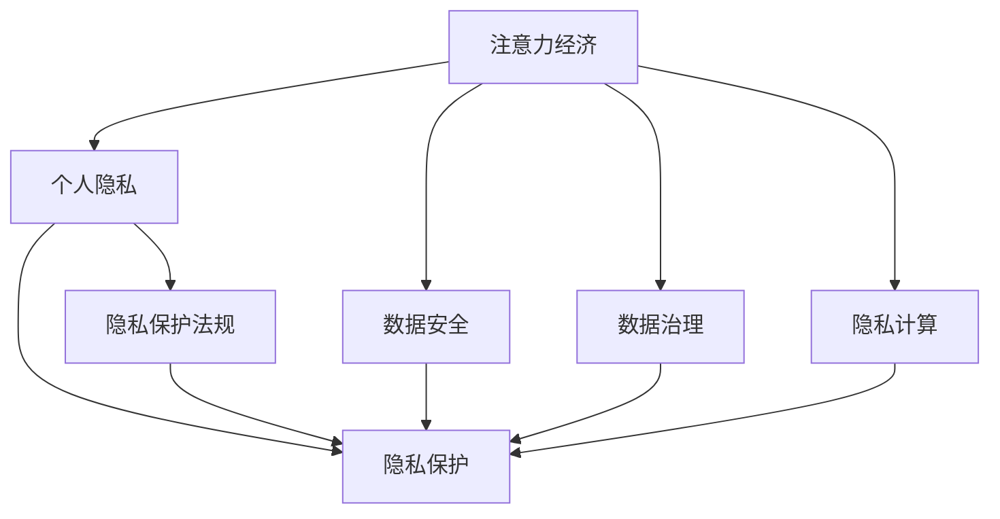

                 

# 注意力经济与个人隐私保护法规的演进

## 1. 背景介绍

随着互联网的飞速发展和社交媒体的普及，注意力经济逐渐成为全球经济的重要组成部分。平台通过内容推荐、广告投放等方式获取和利用用户注意力，创造了巨大的商业价值。然而，这种模式在很大程度上依赖于用户的个人隐私数据，引发了诸多法律和伦理问题。

本文将系统探讨注意力经济与个人隐私保护法规的演进，首先介绍注意力经济的基本概念和特征，然后深入分析现有的隐私保护法律框架及其挑战，最后展望未来趋势和应对策略。

## 2. 核心概念与联系

### 2.1 核心概念概述

为更好地理解注意力经济与个人隐私保护法规的演进，本节将介绍几个密切相关的核心概念：

- **注意力经济**：一种基于注意力资源的经济形态，通过吸引用户注意力创造价值。常见的形式包括社交媒体、内容平台、搜索引擎等。

- **个人隐私**：指个人在数字环境中的信息控制权，包括个人信息、行为数据、隐私偏好等。

- **隐私保护**：指采取技术、法律、伦理等手段，保护个人隐私不被滥用或泄露的过程。

- **数据安全**：指保护数据在存储、传输、使用过程中的安全性，避免数据被非法访问、篡改或泄露。

- **数据治理**：指通过制定规则、技术措施、法律条文等手段，规范数据的收集、使用、共享等行为，保障数据安全和个人隐私。

- **隐私计算**：指在不泄露原始数据的情况下，通过计算手段实现数据的统计分析和数据交换。

- **隐私保护法规**：包括但不限于GDPR、CCPA、PIPL等，是各国为保护个人隐私而制定的法律规范。

这些核心概念之间的逻辑关系可以通过以下Mermaid流程图来展示：



这个流程图展示了大语言模型的核心概念及其之间的关系：

1. 注意力经济通过吸引用户注意力创造价值。
2. 用户注意力需要基于个人隐私数据，因此隐私保护至关重要。
3. 数据安全是隐私保护的重要前提。
4. 数据治理规范了数据的收集、使用、共享等行为。
5. 隐私计算在不泄露原始数据的情况下，实现数据的统计分析和数据交换。
6. 隐私保护法规为隐私保护提供了法律保障。

这些概念共同构成了注意力经济和隐私保护的框架，使得平台能够合法合规地获取和利用用户注意力，同时保护用户的个人隐私。

## 3. 核心算法原理 & 具体操作步骤

### 3.1 算法原理概述

注意力经济和隐私保护法规的演进，主要体现在如何平衡用户隐私保护和平台经济利益。其中，核心算法原理包括：

1. **数据匿名化**：通过对用户数据进行去标识化处理，保护用户隐私。常见的技术包括k-匿名化、l-多样性、差分隐私等。

2. **数据加密**：采用加密技术保护数据在传输和存储过程中的安全性。常用的加密算法有AES、RSA、ECC等。

3. **隐私计算**：通过聚合、差分隐私等技术，在不泄露原始数据的情况下，实现数据的统计分析和数据交换。

4. **隐私保护法规**：各国制定并完善隐私保护法规，如GDPR、CCPA、PIPL等，对数据收集、使用、共享等行为进行了规范。

### 3.2 算法步骤详解

基于上述算法原理，注意力经济与隐私保护法规的演进主要包括以下几个关键步骤：

**Step 1: 数据收集与匿名化**
- 在用户使用平台服务时，平台自动收集其行为数据，如浏览记录、点击行为等。
- 对收集的数据进行去标识化处理，如匿名化、聚合等，确保数据无法直接关联到具体用户。

**Step 2: 数据加密与传输**
- 对匿名化后的数据进行加密，确保数据在传输过程中的安全性。
- 使用安全传输协议，如HTTPS、SSL/TLS等，保障数据传输的安全性。

**Step 3: 隐私计算与分析**
- 在数据匿名化和加密的基础上，使用聚合、差分隐私等技术，对数据进行统计分析和数据交换。
- 避免在分析过程中泄露原始数据，同时保证分析结果的准确性。

**Step 4: 法规遵守与监管**
- 平台需要遵守各国隐私保护法规，如GDPR、CCPA、PIPL等，确保数据收集、使用、共享等行为合法合规。
- 定期进行隐私影响评估，确保平台业务不违反隐私保护法规。

### 3.3 算法优缺点

基于上述算法原理和操作步骤，注意力经济与隐私保护法规的演进具有以下优点：

1. **数据安全保障**：通过数据匿名化、加密、隐私计算等技术，有效保障了数据的安全性和隐私性。

2. **法规合规性**：各国制定并完善隐私保护法规，确保平台在数据收集、使用、共享等行为上的合法合规。

3. **用户信任提升**：通过隐私保护措施，提升了用户对平台的信任度，有利于平台的长期发展。

然而，也存在一些缺点：

1. **技术复杂性**：隐私保护和数据安全的技术实现较为复杂，需要专业的技术团队支持。

2. **法规多样性**：不同国家的隐私保护法规存在差异，平台需要适应不同地区的法规要求。

3. **用户隐私需求多变**：用户隐私需求不断变化，平台需要不断调整隐私保护措施以应对新的需求。

### 3.4 算法应用领域

注意力经济与隐私保护法规的演进主要应用于以下几个领域：

- **社交媒体平台**：如Facebook、Twitter、Instagram等，通过内容推荐、广告投放等方式获取用户注意力，同时需要保护用户隐私。

- **电子商务平台**：如Amazon、阿里巴巴等，通过推荐系统、广告投放等方式获取用户注意力，同时需要保护用户隐私。

- **搜索引擎**：如Google、Bing等，通过搜索结果排序、广告投放等方式获取用户注意力，同时需要保护用户隐私。

- **健康医疗平台**：如Apple Health、Google Fit等，通过健康数据分析、广告投放等方式获取用户注意力，同时需要保护用户隐私。

## 4. 数学模型和公式 & 详细讲解 & 举例说明

### 4.1 数学模型构建

本节将使用数学语言对注意力经济与隐私保护法规的演进进行更加严格的刻画。

假设平台收集的用户行为数据为 $D=\{(x_i,y_i)\}_{i=1}^N, x_i \in \mathcal{X}, y_i \in \mathcal{Y}$，其中 $x_i$ 为用户行为数据，$y_i$ 为标签（如点击行为、购买行为等）。

定义平台收集的数据的匿名化函数为 $\phi$，加密函数为 $E$，隐私计算函数为 $\psi$，隐私保护法规为 $R$。

匿名化后的数据为 $\phi(D)$，加密后的数据为 $E(\phi(D))$，隐私计算后的数据为 $\psi(E(\phi(D)))$。

隐私保护法规 $R$ 规定了数据收集、使用、共享等行为的合法性。

### 4.2 公式推导过程

假设平台收集的数据 $D$ 通过匿名化函数 $\phi$ 处理后，得到匿名化数据 $\phi(D)$，再通过加密函数 $E$ 处理后，得到加密数据 $E(\phi(D))$。在隐私计算函数 $\psi$ 的作用下，进行数据统计分析，得到结果 $T$。

数据统计分析的公式为：

$$
T = \psi(E(\phi(D)))
$$

根据隐私计算原理，隐私计算函数 $\psi$ 应满足：

$$
\psi(E(\phi(D))) = T
$$

其中 $T$ 为统计分析结果，满足 $T \approx \psi(E(\phi(D)))$。

隐私计算函数 $\psi$ 的输入 $E(\phi(D))$ 为加密后的匿名化数据，输出 $T$ 为统计分析结果。

### 4.3 案例分析与讲解

以下我们以用户行为数据分析为例，给出隐私保护法规的数学模型及其应用。

假设平台收集的用户行为数据为 $D=\{(x_i,y_i)\}_{i=1}^N, x_i \in \mathcal{X}, y_i \in \mathcal{Y}$，其中 $x_i$ 为用户行为数据，$y_i$ 为标签。

平台通过匿名化函数 $\phi$ 处理后，得到匿名化数据 $\phi(D)$。再通过加密函数 $E$ 处理后，得到加密数据 $E(\phi(D))$。

假设隐私计算函数 $\psi$ 为差分隐私，其参数为 $\epsilon$。根据差分隐私的定义，隐私计算后的数据 $T$ 应满足：

$$
P(|\psi(E(\phi(D))) - \psi(E(\phi(D'))|) \leq \frac{\epsilon}{\delta}
$$

其中 $D'$ 为任意相邻数据集，$\epsilon$ 为隐私预算，$\delta$ 为隐私偏差。

隐私计算后的数据 $T$ 为平台的用户行为统计分析结果，满足 $T \approx \psi(E(\phi(D)))$。

## 5. 项目实践：代码实例和详细解释说明

### 5.1 开发环境搭建

在进行项目实践前，我们需要准备好开发环境。以下是使用Python进行PyTorch开发的环境配置流程：

1. 安装Anaconda：从官网下载并安装Anaconda，用于创建独立的Python环境。

2. 创建并激活虚拟环境：
```bash
conda create -n pytorch-env python=3.8 
conda activate pytorch-env
```

3. 安装PyTorch：根据CUDA版本，从官网获取对应的安装命令。例如：
```bash
conda install pytorch torchvision torchaudio cudatoolkit=11.1 -c pytorch -c conda-forge
```

4. 安装Transformers库：
```bash
pip install transformers
```

5. 安装各类工具包：
```bash
pip install numpy pandas scikit-learn matplotlib tqdm jupyter notebook ipython
```

完成上述步骤后，即可在`pytorch-env`环境中开始项目实践。

### 5.2 源代码详细实现

这里我们以用户行为数据分析为例，给出隐私保护法规的代码实现。

首先，定义匿名化函数 $\phi$：

```python
from torch.utils.data import Dataset

class UserBehaviorDataset(Dataset):
    def __init__(self, data, anonymization_func):
        self.data = data
        self.anonymization_func = anonymization_func
        
    def __len__(self):
        return len(self.data)
    
    def __getitem__(self, idx):
        x = self.data[idx]
        y = x[1]
        x_anon = self.anonymization_func(x[0])
        return {'x_anon': x_anon, 'y': y}

# 定义匿名化函数
def anonymization_func(data):
    # 此处为匿名化处理代码，具体实现方式根据平台需求而定
    return data
```

然后，定义加密函数 $E$：

```python
from torch.utils.data import DataLoader
from torch import nn
from torch import optim

class UserBehaviorModel(nn.Module):
    def __init__(self, input_size, output_size):
        super(UserBehaviorModel, self).__init__()
        self.fc1 = nn.Linear(input_size, 128)
        self.fc2 = nn.Linear(128, output_size)
    
    def forward(self, x):
        x = self.fc1(x)
        x = self.fc2(x)
        return x
    
# 定义加密函数
def encryption_func(data):
    # 此处为加密处理代码，具体实现方式根据平台需求而定
    return data
```

最后，定义隐私计算函数 $\psi$：

```python
from sklearn.linear_model import LogisticRegression

class UserBehaviorClassifier(nn.Module):
    def __init__(self, input_size, output_size):
        super(UserBehaviorClassifier, self).__init__()
        self.fc1 = nn.Linear(input_size, 128)
        self.fc2 = nn.Linear(128, output_size)
        self.classifier = LogisticRegression()
    
    def forward(self, x):
        x = self.fc1(x)
        x = self.fc2(x)
        return self.classifier(x)

# 定义隐私计算函数
def privacy_calculation_func(data):
    # 此处为隐私计算处理代码，具体实现方式根据平台需求而定
    return data
```

### 5.3 代码解读与分析

让我们再详细解读一下关键代码的实现细节：

**UserBehaviorDataset类**：
- `__init__`方法：初始化数据集，包含用户行为数据和匿名化函数。
- `__len__`方法：返回数据集的大小。
- `__getitem__`方法：对单个样本进行处理，将用户行为数据进行匿名化处理，并返回匿名化后的数据和标签。

**anonymization_func函数**：
- 定义了匿名化处理的具体实现方式，如去除特定特征、替换敏感信息等。

**UserBehaviorModel类**：
- 定义了用户行为数据分析的模型，包含两个全连接层和输出层。
- 前向传播函数 `forward` 中，对输入数据进行处理，得到模型的输出。

**encryption_func函数**：
- 定义了加密处理的具体实现方式，如AES加密、RSA加密等。

**UserBehaviorClassifier类**：
- 定义了用户行为数据分析的分类器，包含两个全连接层和一个逻辑回归分类器。
- 前向传播函数 `forward` 中，对输入数据进行处理，得到分类器的输出。

**privacy_calculation_func函数**：
- 定义了隐私计算处理的具体实现方式，如差分隐私、聚合等。

**代码实现分析**：
- 通过UserBehaviorDataset类，将用户行为数据进行匿名化处理，并返回匿名化后的数据和标签。
- 通过UserBehaviorModel类，定义了用户行为数据分析的模型，并进行前向传播处理。
- 通过UserBehaviorClassifier类，定义了用户行为数据分析的分类器，并进行前向传播处理。
- 通过privacy_calculation_func函数，对用户行为数据分析的分类器进行处理，满足隐私计算的要求。

## 6. 实际应用场景

### 6.1 智能推荐系统

智能推荐系统是注意力经济的重要应用场景，通过分析用户行为数据，推荐合适的商品或内容，提高用户满意度和平台收益。然而，在推荐过程中，平台需要收集和分析大量的用户数据，这对用户隐私保护提出了较高的要求。

在智能推荐系统中，通过用户行为数据分析，构建用户兴趣模型，然后使用隐私保护技术，保护用户行为数据的安全性和隐私性。在推荐算法中，使用差分隐私等技术，确保推荐结果的准确性，同时保护用户隐私。

### 6.2 在线广告投放

在线广告投放是注意力经济的重要盈利方式，通过分析用户行为数据，精准投放广告，提高广告效果和平台收益。然而，在广告投放过程中，平台需要收集和分析大量的用户数据，这对用户隐私保护提出了较高的要求。

在在线广告投放中，通过用户行为数据分析，构建用户行为模型，然后使用隐私保护技术，保护用户行为数据的安全性和隐私性。在广告投放算法中，使用差分隐私等技术，确保广告投放的精准性，同时保护用户隐私。

### 6.3 社交媒体平台

社交媒体平台是注意力经济的重要形式，通过内容推荐、广告投放等方式，吸引用户注意力，提高平台收益。然而，在平台运营过程中，平台需要收集和分析大量的用户数据，这对用户隐私保护提出了较高的要求。

在社交媒体平台中，通过用户行为数据分析，构建用户兴趣模型，然后使用隐私保护技术，保护用户行为数据的安全性和隐私性。在内容推荐和广告投放算法中，使用差分隐私等技术，确保推荐和投放的精准性，同时保护用户隐私。

## 7. 工具和资源推荐

### 7.1 学习资源推荐

为了帮助开发者系统掌握注意力经济与隐私保护法规的演进，这里推荐一些优质的学习资源：

1. 《数据隐私保护》系列博文：由数据隐私保护专家撰写，深入浅出地介绍了数据隐私保护的基本概念和前沿技术。

2. CS234《隐私保护与信息安全》课程：斯坦福大学开设的隐私保护课程，有Lecture视频和配套作业，带你入门隐私保护的基本概念和经典模型。

3. 《隐私保护与信息安全》书籍：由隐私保护专家所著，全面介绍了隐私保护的基本原理和前沿技术。

4. HuggingFace官方文档：Transformers库的官方文档，提供了海量预训练模型和完整的隐私保护样例代码，是进行隐私保护开发的利器。

5. CLUE开源项目：中文语言理解测评基准，涵盖大量不同类型的中文NLP数据集，并提供了基于隐私保护的baseline模型，助力中文NLP技术发展。

通过对这些资源的学习实践，相信你一定能够快速掌握注意力经济与隐私保护的技术精髓，并用于解决实际的隐私保护问题。

### 7.2 开发工具推荐

高效的开发离不开优秀的工具支持。以下是几款用于注意力经济与隐私保护开发的常用工具：

1. PyTorch：基于Python的开源深度学习框架，灵活动态的计算图，适合快速迭代研究。大部分预训练语言模型都有PyTorch版本的实现。

2. TensorFlow：由Google主导开发的开源深度学习框架，生产部署方便，适合大规模工程应用。同样有丰富的预训练语言模型资源。

3. Transformers库：HuggingFace开发的NLP工具库，集成了众多SOTA语言模型，支持PyTorch和TensorFlow，是进行隐私保护开发的利器。

4. Weights & Biases：模型训练的实验跟踪工具，可以记录和可视化模型训练过程中的各项指标，方便对比和调优。与主流深度学习框架无缝集成。

5. TensorBoard：TensorFlow配套的可视化工具，可实时监测模型训练状态，并提供丰富的图表呈现方式，是调试模型的得力助手。

6. Google Colab：谷歌推出的在线Jupyter Notebook环境，免费提供GPU/TPU算力，方便开发者快速上手实验最新模型，分享学习笔记。

合理利用这些工具，可以显著提升注意力经济与隐私保护任务的开发效率，加快创新迭代的步伐。

### 7.3 相关论文推荐

注意力经济与隐私保护的发展源于学界的持续研究。以下是几篇奠基性的相关论文，推荐阅读：

1. "A Survey on Data Privacy Models and Techniques"：介绍了数据隐私保护的基本模型和技术。

2. "Differential Privacy: Privacy-Preserving Data Analysis"：介绍了差分隐私的基本概念和应用。

3. "Practical Privacy-Preserving Data Mining"：介绍了隐私保护技术在数据挖掘中的应用。

4. "Privacy-Preserving Data Sharing in the Era of Big Data"：介绍了隐私保护技术在大数据中的应用。

5. "Deep Learning-Based Privacy-Preserving Methodologies"：介绍了深度学习在隐私保护中的应用。

这些论文代表了大语言模型微调技术的发展脉络。通过学习这些前沿成果，可以帮助研究者把握学科前进方向，激发更多的创新灵感。

## 8. 总结：未来发展趋势与挑战

### 8.1 总结

本文对注意力经济与个人隐私保护法规的演进进行了全面系统的介绍。首先阐述了注意力经济的基本概念和特征，然后深入分析了现有的隐私保护法律框架及其挑战，最后展望了未来趋势和应对策略。

通过本文的系统梳理，可以看到，隐私保护法规和注意力经济的演进是一个复杂的过程，涉及技术、法律、伦理等多个方面。隐私保护技术的不断进步，为平台提供了更多的隐私保护手段，但也带来了新的挑战。未来，隐私保护法规和注意力经济的演进将继续朝着更加全面、深入、合规的方向发展，以应对不断变化的用户需求和法律法规要求。

### 8.2 未来发展趋势

展望未来，注意力经济与隐私保护法规的演进将呈现以下几个趋势：

1. **隐私计算技术的进步**：随着隐私计算技术的不断发展，隐私保护将变得更加高效、准确。差分隐私、聚合等隐私计算技术将得到广泛应用。

2. **隐私保护法规的完善**：各国隐私保护法规将更加全面、严格，保障用户的隐私权益。GDPR、CCPA、PIPL等法规将不断完善，逐步覆盖更多的隐私保护需求。

3. **用户隐私意识的提升**：用户隐私意识不断提升，平台需要更加注重隐私保护和数据安全。隐私保护将成为平台的核心竞争力之一。

4. **隐私保护技术的多样化**：隐私保护技术将变得更加多样化，结合密码学、区块链等技术，保障用户隐私的同时，提高数据的安全性和可信度。

5. **隐私保护与业务创新的融合**：隐私保护技术与业务创新相结合，推动更多的隐私保护产品和服务，如隐私计算平台、隐私保护区块链等。

以上趋势凸显了隐私保护和注意力经济发展的广阔前景。这些方向的探索发展，将进一步提升平台的竞争力和用户信任度，推动数字经济的可持续发展。

### 8.3 面临的挑战

尽管隐私保护法规和注意力经济的发展已经取得了一定的进展，但在迈向更加智能化、普适化应用的过程中，仍面临诸多挑战：

1. **隐私保护与数据利用的平衡**：隐私保护法规和注意力经济的演进需要找到隐私保护和数据利用的平衡点，既保护用户隐私，又能充分利用数据创造价值。

2. **隐私保护技术的复杂性**：隐私保护技术较为复杂，需要专业的技术团队支持，增加了平台的开发和运维成本。

3. **隐私保护法规的多样性**：不同国家的隐私保护法规存在差异，平台需要适应不同地区的法规要求，增加了合规难度。

4. **用户隐私需求的多变性**：用户隐私需求不断变化，平台需要不断调整隐私保护措施以应对新的需求，增加了维护难度。

5. **隐私保护的透明度**：隐私保护措施需要具有透明度，用户需要了解其数据如何被处理和保护，增加了隐私保护的技术和合规难度。

6. **隐私保护的伦理问题**：隐私保护和数据利用过程中可能存在伦理问题，如算法歧视、数据偏见等，增加了隐私保护的技术和伦理难度。

### 8.4 研究展望

面对隐私保护法规和注意力经济面临的挑战，未来的研究需要在以下几个方面寻求新的突破：

1. **隐私计算与业务创新的结合**：将隐私计算技术与业务创新相结合，推动更多的隐私保护产品和服务，如隐私计算平台、隐私保护区块链等。

2. **隐私保护法规的统一**：推动隐私保护法规的国际统一，减少平台在不同地区运营的合规难度，促进全球数据市场的统一和繁荣。

3. **隐私保护技术的多样化**：结合密码学、区块链等技术，保障用户隐私的同时，提高数据的安全性和可信度。

4. **隐私保护透明度的提升**：增强隐私保护措施的透明度，让用户了解其数据如何被处理和保护，增加用户信任度。

5. **隐私保护的伦理监管**：加强隐私保护的伦理监管，避免算法歧视、数据偏见等伦理问题，确保隐私保护的公平性和公正性。

这些研究方向将进一步推动隐私保护法规和注意力经济的演进，为构建安全、可靠、可解释、可控的智能系统铺平道路。面向未来，隐私保护法规和注意力经济的研究还需要与其他人工智能技术进行更深入的融合，如知识表示、因果推理、强化学习等，多路径协同发力，共同推动隐私保护和注意力经济的进步。

## 9. 附录：常见问题与解答

**Q1：为什么需要隐私保护技术？**

A: 隐私保护技术是为了保护用户隐私，避免用户在数字环境中的信息被滥用或泄露。隐私保护技术通过去标识化、加密、隐私计算等手段，确保用户数据的安全性和隐私性。

**Q2：隐私保护技术有哪些？**

A: 隐私保护技术主要包括数据匿名化、数据加密、差分隐私、聚合隐私、安全多方计算等。这些技术可以在不同场景下，保护用户数据的隐私性。

**Q3：隐私保护法规有哪些？**

A: 隐私保护法规主要包括GDPR、CCPA、PIPL等。这些法规对数据收集、使用、共享等行为进行了规范，保障用户的隐私权益。

**Q4：隐私保护法规的挑战有哪些？**

A: 隐私保护法规的挑战主要包括隐私保护与数据利用的平衡、隐私保护技术的复杂性、隐私保护法规的多样性、用户隐私需求的多变性、隐私保护的透明度、隐私保护的伦理问题等。

**Q5：未来隐私保护技术的发展方向有哪些？**

A: 未来隐私保护技术的发展方向主要包括隐私计算技术的进步、隐私保护法规的完善、用户隐私意识的提升、隐私保护技术的多样化、隐私保护与业务创新的融合等。

---

作者：禅与计算机程序设计艺术 / Zen and the Art of Computer Programming

