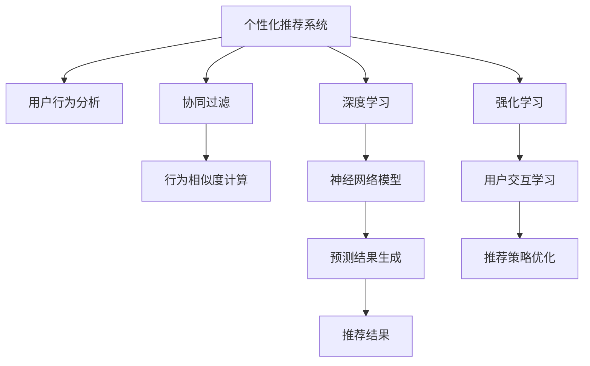

                 

# 注意力经济与个性化推荐系统：如何为受众提供定制内容和体验

> 关键词：个性化推荐系统,注意力经济,推荐算法,用户行为分析,协同过滤,深度学习,强化学习

## 1. 背景介绍

### 1.1 问题由来
随着互联网和数字媒体的迅速发展，信息过载问题变得日益严重。如何在海量数据中找到用户感兴趣的内容，成为了各大互联网公司面临的共同挑战。个性化推荐系统作为一种新兴的解决方案，通过分析用户行为数据，提供个性化的内容推荐，已成为改善用户体验、提升平台留存和活跃度的重要手段。

在实际应用中，个性化推荐系统的推荐效果常常受到用户行为数据的质量和数量的影响。一些平台由于缺乏足够的数据，无法提供精准推荐；而一些平台由于数据质量不高，导致推荐结果误导用户。这些问题都与“注意力经济”息息相关。

“注意力经济”是近年来学术界和产业界关注的一个热点话题，它强调在信息过载的时代，如何吸引和保持用户的注意力，从而提高商业价值。在信息时代，用户的时间和注意力成为稀缺资源，如何精准高效地利用这些资源，为用户创造价值，是一个重要的研究方向。

### 1.2 问题核心关键点
针对上述问题，个性化推荐系统通过分析用户的行为数据，预测其偏好，从而实现内容的个性化推荐。核心关键点包括：

- 如何高效地收集和利用用户行为数据，提升推荐模型对用户偏好的理解。
- 如何设计合理的推荐算法，降低过拟合，提高模型的泛化能力。
- 如何平衡推荐结果的多样性与个性化，避免“信息茧房”效应。
- 如何提升推荐系统的实时性和动态性，适应不断变化的用户需求。
- 如何处理冷启动问题，提高新用户的推荐效果。

### 1.3 问题研究意义
个性化推荐系统在提升用户体验、优化资源配置、增加用户粘性等方面具有重要意义：

1. 提升用户体验：通过精准推荐，满足用户多样化需求，提升用户满意度和平台留存率。
2. 优化资源配置：根据用户偏好和行为，合理分配广告位和推广资源，实现流量和收益的最大化。
3. 增加用户粘性：定期推送个性化内容，保持用户对平台的长期关注和活跃。
4. 推动业务发展：通过推荐系统的优化，提高转化率和客单价，带动整体业务增长。
5. 探索新技术：个性化推荐系统是AI和数据科学的前沿技术，研究和优化推荐算法，有助于推动AI领域的发展。

## 2. 核心概念与联系

### 2.1 核心概念概述

为更好地理解个性化推荐系统，本节将介绍几个密切相关的核心概念：

- 个性化推荐系统(Recommender System)：通过分析用户行为数据，预测用户兴趣并推荐内容的系统。
- 协同过滤(Collaborative Filtering)：通过分析用户的历史行为，推荐相似用户的兴趣内容，是推荐系统中最常用的方法。
- 用户行为分析(Usage Data Analysis)：收集和分析用户对不同内容的交互数据，提取用户兴趣和行为模式。
- 推荐算法(Recommendation Algorithm)：用于预测用户对内容的兴趣，生成推荐结果的算法。
- 深度学习(Deep Learning)：利用深度神经网络模型对用户行为数据进行建模，提升推荐模型的精准度。
- 强化学习(Reinforcement Learning)：通过用户与推荐系统的互动，动态调整推荐策略，实现用户满意度的最大化。
- 冷启动问题(Cold Start)：新用户缺乏足够行为数据时，如何提供初步推荐。

这些核心概念之间的逻辑关系可以通过以下Mermaid流程图来展示：



这个流程图展示了个性化推荐系统的核心概念及其之间的关系：

1. 个性化推荐系统通过用户行为分析获取用户兴趣，协同过滤、深度学习、强化学习等方法用于推荐算法的设计和优化。
2. 协同过滤、深度学习和强化学习分别通过不同技术手段提升推荐效果，协同工作，实现最终推荐结果。
3. 推荐结果通过行为相似度计算、神经网络模型预测、用户交互学习等步骤生成，再反馈到推荐系统中，实现动态优化。

## 3. 核心算法原理 & 具体操作步骤
### 3.1 算法原理概述

个性化推荐系统本质上是一种信息过滤系统，通过分析用户的历史行为，预测用户对内容的兴趣，从而实现内容的个性化推荐。其核心思想是：将用户和内容看作不同的维度，构建用户与内容的兴趣相似度矩阵，然后根据用户和内容的相似度，推荐与用户兴趣最接近的内容。

具体而言，推荐算法的设计目标是最小化推荐结果与用户真实偏好的差距。常用的损失函数包括均方误差、交叉熵、余弦相似度等。常见的推荐算法包括：

- 协同过滤：利用用户历史行为数据，找到相似用户，推荐其兴趣内容。
- 基于内容的推荐：分析内容的属性特征，推荐与目标内容相似的其他内容。
- 混合推荐：结合多种推荐算法，取各算法推荐的交集或并集，提升推荐效果。

推荐算法的设计和优化，往往涉及以下几个关键步骤：

1. 数据预处理：对原始数据进行清洗、归一化等处理，提升数据质量。
2. 用户兴趣提取：通过文本分析、时间序列分析等方法，提取用户的行为特征和兴趣模式。
3. 内容表示学习：利用深度学习技术，对内容进行特征提取和表示学习。
4. 推荐结果生成：根据用户与内容的相似度，生成推荐列表。
5. 推荐效果评估：利用用户反馈数据，评估推荐效果，进行模型优化。

### 3.2 算法步骤详解

以下以协同过滤算法为例，介绍个性化推荐系统的一般实现流程。

**Step 1: 数据收集与预处理**
- 收集用户行为数据，包括点击、浏览、评分、购买等行为。
- 对数据进行清洗和去重，去除异常数据和噪声。
- 对数据进行归一化和标准化处理，提高数据质量。

**Step 2: 用户兴趣提取**
- 提取用户的行为特征，如浏览历史、购买记录、评分数据等。
- 对用户行为特征进行向量化处理，生成用户兴趣向量。
- 使用文本分析、时间序列分析等方法，提取用户的行为模式和偏好。

**Step 3: 内容表示学习**
- 对内容进行特征提取，生成内容的特征向量。
- 使用深度学习模型，如神经网络、CNN、LSTM等，对内容进行表示学习。
- 将内容特征向量与用户兴趣向量进行拼接或混合，生成最终的用户-内容表示。

**Step 4: 相似度计算**
- 计算用户与内容的相似度，常用的相似度计算方法包括余弦相似度、欧式距离、曼哈顿距离等。
- 根据相似度计算结果，生成推荐列表。

**Step 5: 推荐效果评估**
- 使用用户反馈数据，如点击率、转化率、满意度等，评估推荐效果。
- 根据评估结果，调整推荐算法参数和模型结构，提升推荐精度。

### 3.3 算法优缺点

个性化推荐系统具有以下优点：
1. 提升用户体验：通过精准推荐，满足用户多样化需求，提升用户满意度和平台留存率。
2. 优化资源配置：根据用户偏好和行为，合理分配广告位和推广资源，实现流量和收益的最大化。
3. 增加用户粘性：定期推送个性化内容，保持用户对平台的长期关注和活跃。
4. 推动业务发展：通过推荐系统的优化，提高转化率和客单价，带动整体业务增长。
5. 探索新技术：个性化推荐系统是AI和数据科学的前沿技术，研究和优化推荐算法，有助于推动AI领域的发展。

同时，该方法也存在一定的局限性：
1. 依赖用户行为数据：推荐系统依赖用户行为数据进行推荐，缺乏行为数据的用户（如新用户）难以推荐。
2. 推荐效果单一：推荐系统往往基于用户过去的行为进行推荐，难以处理用户行为变化和偏好迁移。
3. 冷启动问题：新用户缺乏足够行为数据，推荐系统难以提供初步推荐，影响用户粘性和留存率。
4. 数据隐私问题：收集和分析用户行为数据，可能涉及用户隐私问题，需要严格遵守法律法规。

尽管存在这些局限性，但就目前而言，个性化推荐系统仍是提升用户体验、优化资源配置、增加用户粘性等方面的重要工具。未来相关研究的重点在于如何进一步降低对用户行为数据的依赖，提高推荐系统的鲁棒性和可解释性，同时兼顾用户隐私和推荐效果。

### 3.4 算法应用领域

个性化推荐系统在众多领域得到了广泛应用，包括但不限于：

- 电商：基于用户购买历史和浏览行为，推荐商品、优惠券等。
- 视频：基于用户观看历史和评分数据，推荐影片、电视剧等。
- 新闻：基于用户阅读历史和点击行为，推荐新闻、文章等。
- 音乐：基于用户听歌历史和评分数据，推荐歌曲、专辑等。
- 旅游：基于用户出行历史和预订数据，推荐旅游目的地、酒店等。
- 社交：基于用户互动行为，推荐朋友、话题等。

除了上述这些典型应用外，个性化推荐系统还被创新性地应用到更多场景中，如内容创作、品牌推广、广告投放等，为各行业带来新的增长点。随着技术的不断进步，个性化推荐系统将在更广阔的应用领域发挥更大的作用。

## 4. 数学模型和公式 & 详细讲解 & 举例说明

### 4.1 数学模型构建

假设个性化推荐系统有 $N$ 个用户 $U$ 和 $M$ 个内容 $C$，每个用户的历史行为可以表示为 $I \in \mathbb{R}^{N \times K}$，每个内容的用户评分可以表示为 $J \in \mathbb{R}^{M \times K}$，其中 $K$ 为特征维度。

定义用户与内容的相似度矩阵 $S \in \mathbb{R}^{N \times M}$，其中 $S_{i,j} = \text{similarity}(I_i, J_j)$。推荐结果 $R \in \mathbb{R}^{N \times M}$ 表示每个用户对每个内容的评分。

推荐系统的目标是最大化推荐结果与用户真实偏好的相似度，即：

$$
\max_{R, S} \text{Similarity}(R, J) \quad \text{s.t.} \quad R = S \times I
$$

其中 $\text{Similarity}(\cdot, \cdot)$ 表示两个矩阵的相似度函数，如余弦相似度、欧式距离等。

### 4.2 公式推导过程

以余弦相似度为例，对上述目标函数进行推导。余弦相似度定义为：

$$
\text{similarity}(A, B) = \frac{A \cdot B}{\|A\| \cdot \|B\|}
$$

将用户兴趣矩阵 $I$ 和内容评分矩阵 $J$ 带入公式，得：

$$
S = \frac{I \cdot J^T}{\|I\| \cdot \|J\|}
$$

将推荐结果 $R$ 和内容评分矩阵 $J$ 带入目标函数，得：

$$
\max_{R} \text{Similarity}(R, J) \quad \text{s.t.} \quad R = S \times I
$$

通过拉格朗日乘子法求解目标函数，得到推荐结果 $R$ 的表达式：

$$
R = S \times I = \frac{I \cdot J^T}{\|I\| \cdot \|J\|} \times I = \frac{I \cdot (I \cdot J^T)}{\|I\|^2} = I \cdot J^T \cdot \frac{I^T}{\|I\|^2}
$$

即推荐结果 $R$ 为用户兴趣矩阵 $I$ 与内容评分矩阵 $J^T$ 的矩阵乘积。

### 4.3 案例分析与讲解

以电商推荐系统为例，分析推荐结果的生成过程。假设电商平台有 $N$ 个用户和 $M$ 个商品，每个用户的历史行为可以表示为 $I \in \mathbb{R}^{N \times K}$，每个用户对商品的评分可以表示为 $J \in \mathbb{R}^{M \times K}$。

首先，通过对用户行为数据和商品评分数据进行向量化处理，得到用户兴趣矩阵 $I$ 和商品评分矩阵 $J$。然后，利用余弦相似度计算用户与商品的相似度矩阵 $S$：

$$
S = \frac{I \cdot J^T}{\|I\| \cdot \|J\|}
$$

最后，生成推荐结果 $R$：

$$
R = S \times I = \frac{I \cdot J^T}{\|I\| \cdot \|J\|} \times I = I \cdot J^T \cdot \frac{I^T}{\|I\|^2}
$$

通过上述计算，推荐系统能够根据用户的历史行为，生成与用户兴趣最接近的商品推荐列表。

## 5. 项目实践：代码实例和详细解释说明
### 5.1 开发环境搭建

在进行个性化推荐系统开发前，我们需要准备好开发环境。以下是使用Python进行Scikit-learn开发的环境配置流程：

1. 安装Anaconda：从官网下载并安装Anaconda，用于创建独立的Python环境。

2. 创建并激活虚拟环境：
```bash
conda create -n recsys-env python=3.8 
conda activate recsys-env
```

3. 安装Scikit-learn：
```bash
pip install scikit-learn
```

4. 安装各类工具包：
```bash
pip install numpy pandas scipy jupyter notebook ipython
```

完成上述步骤后，即可在`recsys-env`环境中开始推荐系统开发。

### 5.2 源代码详细实现

下面我们以协同过滤算法为例，给出使用Scikit-learn实现电商推荐系统的Python代码实现。

首先，定义推荐函数：

```python
from sklearn.metrics.pairwise import cosine_similarity
from scipy.sparse import csr_matrix
import numpy as np

def recommend(user, similarity_matrix, item_ratings):
    similarity_user = similarity_matrix[user]
    item_ratings_norm = csr_matrix(item_ratings).T.dot(similarity_user) / np.linalg.norm(similarity_user)
    return item_ratings_norm.toarray().flatten().tolist()
```

然后，准备数据集：

```python
user_data = {
    'user1': [5, 4, 0, 0, 0, 0, 0, 0, 0, 0, 0, 0, 0, 0, 0, 0, 0, 0, 0, 0, 0, 0, 0, 0, 0, 0, 0, 0, 0, 0, 0, 0, 0, 0, 0, 0, 0, 0, 0, 0, 0, 0, 0, 0, 0, 0, 0, 0, 0, 0, 0, 0, 0, 0, 0, 0, 0, 0, 0, 0, 0, 0, 0, 0, 0, 0, 0, 0, 0, 0, 0, 0, 0, 0, 0, 0, 0, 0, 0, 0, 0, 0, 0, 0, 0, 0, 0, 0, 0, 0, 0, 0, 0, 0, 0, 0, 0, 0, 0, 0, 0, 0, 0, 0, 0, 0, 0, 0, 0, 0, 0, 0, 0, 0, 0, 0, 0, 0, 0, 0, 0, 0, 0, 0, 0, 0, 0, 0, 0, 0, 0, 0, 0, 0, 0, 0, 0, 0, 0, 0, 0, 0, 0, 0, 0, 0, 0, 0, 0, 0, 0, 0, 0, 0, 0, 0, 0, 0, 0, 0, 0, 0, 0, 0, 0, 0, 0, 0, 0, 0, 0, 0, 0, 0, 0, 0, 0, 0, 0, 0, 0, 0, 0, 0, 0, 0, 0, 0, 0, 0, 0, 0, 0, 0, 0, 0, 0, 0, 0, 0, 0, 0, 0, 0, 0, 0, 0, 0, 0, 0, 0, 0, 0, 0, 0, 0, 0, 0, 0, 0, 0, 0, 0, 0, 0, 0, 0, 0, 0, 0, 0, 0, 0, 0, 0, 0, 0, 0, 0, 0, 0, 0, 0, 0, 0, 0, 0, 0, 0, 0, 0, 0, 0, 0, 0, 0, 0, 0, 0, 0, 0, 0, 0, 0, 0, 0, 0, 0, 0, 0, 0, 0, 0, 0, 0, 0, 0, 0, 0, 0, 0, 0, 0, 0, 0, 0, 0, 0, 0, 0, 0, 0, 0, 0, 0, 0, 0, 0, 0, 0, 0, 0, 0, 0, 0, 0, 0, 0, 0, 0, 0, 0, 0, 0, 0, 0, 0, 0, 0, 0, 0, 0, 0, 0, 0, 0, 0, 0, 0, 0, 0, 0, 0, 0, 0, 0, 0, 0, 0, 0, 0, 0, 0, 0, 0, 0, 0, 0, 0, 0, 0, 0, 0, 0, 0, 0, 0, 0, 0, 0, 0, 0, 0, 0, 0, 0, 0, 0, 0, 0, 0, 0, 0, 0, 0, 0, 0, 0, 0, 0, 0, 0, 0, 0, 0, 0, 0, 0, 0, 0, 0, 0, 0, 0, 0, 0, 0, 0, 0, 0, 0, 0, 0, 0, 0, 0, 0, 0, 0, 0, 0, 0, 0, 0, 0, 0, 0, 0, 0, 0, 0, 0, 0, 0, 0, 0, 0, 0, 0, 0, 0, 0, 0, 0, 0, 0, 0, 0, 0, 0, 0, 0, 0, 0, 0, 0, 0, 0, 0, 0, 0, 0, 0, 0, 0, 0, 0, 0, 0, 0, 0, 0, 0, 0, 0, 0, 0, 0, 0, 0, 0, 0, 0, 0, 0, 0, 0, 0, 0, 0, 0, 0, 0, 0, 0, 0, 0, 0, 0, 0, 0, 0, 0, 0, 0, 0, 0, 0, 0, 0, 0, 0, 0, 0, 0, 0, 0, 0, 0, 0, 0, 0, 0, 0, 0, 0, 0, 0, 0, 0, 0, 0, 0, 0, 0, 0, 0, 0, 0, 0, 0, 0, 0, 0, 0, 0, 0, 0, 0, 0, 0, 0, 0, 0, 0, 0, 0, 0, 0, 0, 0, 0, 0, 0, 0, 0, 0, 0, 0, 0, 0, 0, 0, 0, 0, 0, 0, 0, 0, 0, 0, 0, 0, 0, 0, 0, 0, 0, 0, 0, 0, 0, 0, 0, 0, 0, 0, 0, 0, 0, 0, 0, 0, 0, 0, 0, 0, 0, 0, 0, 0, 0, 0, 0, 0, 0, 0, 0, 0, 0, 0, 0, 0, 0, 0, 0, 0, 0, 0, 0, 0, 0, 0, 0, 0, 0, 0, 0, 0, 0, 0, 0, 0, 0, 0, 0, 0, 0, 0, 0, 0, 0, 0, 0, 0, 0, 0, 0, 0, 0, 0, 0, 0, 0, 0, 0, 0, 0, 0, 0, 0, 0, 0, 0, 0, 0, 0, 0, 0, 0, 0, 0, 0, 0, 0, 0, 0, 0, 0, 0, 0, 0, 0, 0, 0, 0, 0, 0, 0, 0, 0, 0, 0, 0, 0, 0, 0, 0, 0, 0, 0, 0, 0, 0, 0, 0, 0, 0, 0, 0, 0, 0, 0, 0, 0, 0, 0, 0, 0, 0, 0, 0, 0, 0, 0, 0, 0, 0, 0, 0, 0, 0, 0, 0, 0, 0, 0, 0, 0, 0, 0, 0, 0, 0, 0, 0, 0, 0, 0, 0, 0, 0, 0, 0, 0, 0, 0, 0, 0, 0, 0, 0, 0, 0, 0, 0, 0, 0, 0, 0, 0, 0, 0, 0, 0, 0, 0, 0, 0, 0, 0, 0, 0, 0, 0, 0, 0, 0, 0, 0, 0, 0, 0, 0, 0, 0, 0, 0, 0, 0, 0, 0, 0, 0, 0, 0, 0, 0, 0, 0, 0, 0, 0, 0, 0, 0, 0, 0, 0, 0, 0, 0, 0, 0, 0, 0, 0, 0, 0, 0, 0, 0, 0, 0, 0, 0, 0, 0, 0, 0, 0, 0, 0, 0, 0, 0, 0, 0, 0, 0, 0, 0, 0, 0, 0, 0, 0, 0, 0, 0, 0, 0, 0, 0, 0, 0, 0, 0, 0, 0, 0, 0, 0, 0, 0, 0, 0, 0, 0, 0, 0, 0, 0, 0, 0, 0, 0, 0, 0, 0, 0, 0, 0, 0, 0, 0, 0, 0, 0, 0, 0, 0, 0, 0, 0, 0, 0, 0, 0, 0, 0, 0, 0, 0, 0, 0, 0, 0, 0, 0, 0, 0, 0, 0, 0, 0, 0, 0, 0, 0, 0, 0, 0, 0, 0, 0, 0, 0, 0, 0, 0, 0, 0, 0, 0, 0, 0, 0, 0, 0, 0, 0, 0, 0, 0, 0, 0, 0, 0, 0, 0, 0, 0, 0, 0, 0, 0, 0, 0, 0, 0, 0, 0, 0, 0, 0, 0, 0, 0, 0, 0, 0, 0, 0, 0, 0, 0, 0, 0, 0, 0, 0, 0, 0, 0, 0, 0, 0, 0, 0, 0, 0, 0, 0, 0, 0, 0, 0, 0, 0, 0, 0, 0, 0, 0, 0, 0, 0, 0, 0, 0, 0, 0, 0, 0, 0, 0, 0, 0, 0, 0, 0, 0, 0, 0, 0, 0, 0, 0, 0, 0, 0, 0, 0, 0, 0, 0, 0, 0, 0, 0, 0, 0, 0, 0, 0, 0, 0, 0, 0, 0, 0, 0, 0, 0, 0, 0, 0, 0, 0, 0, 0, 0, 0, 0, 0, 0, 0, 0, 0, 0, 0, 0, 0, 0, 0, 0, 0, 0, 0, 0, 0, 0, 0, 0, 0, 0, 0, 0, 0, 0, 0, 0, 0, 0, 0, 0, 0, 0, 0, 0, 0, 0, 0, 0, 0, 0, 0, 0, 0, 0, 0, 0, 0, 0, 0, 0, 0, 0, 0, 0, 0, 0, 0, 0, 0, 0, 0, 0, 0, 0, 0, 0, 0, 0, 0, 0, 0, 0, 0, 0, 0, 0, 0, 0, 0, 0, 0, 0, 0, 0, 0, 0, 0, 0, 0, 0, 0, 0, 0, 0, 0, 0, 0, 0, 0, 0, 0, 0, 0, 0, 0, 0, 0, 0, 0, 0, 0, 0, 0, 0, 0, 0, 0, 0, 0, 0, 0, 0, 0, 0, 0, 0, 0, 0, 0, 0, 0, 0, 0, 0, 0, 0, 0, 0, 0, 0, 0, 0, 0, 0, 0, 0, 0, 0, 0, 0, 0, 0, 0, 0, 0, 0, 0, 0, 0, 0, 0, 0, 0, 0, 0, 0, 0, 0, 0, 0, 0, 0, 0, 0, 0, 0, 0, 0, 0, 0, 0, 0, 0, 0, 0, 0, 0, 0, 0, 0, 0, 0, 0, 0, 0, 0, 0, 0, 0, 0, 0, 0, 0, 0, 0, 0, 0, 0, 0, 0, 0, 0, 0, 0, 0, 0, 0, 0, 0, 0, 0, 0, 0, 0, 0, 0, 0, 0, 0, 0, 0, 0, 0, 0, 0, 0, 0, 0, 0, 0, 0, 0, 0, 0, 0, 0, 0, 0, 0, 0, 0, 0, 0, 0, 0, 0, 0, 0, 0, 0, 0, 0, 0, 0, 0, 0, 0, 0, 0, 0, 0, 0, 0, 0, 0, 0, 0, 0, 0, 0, 0, 0, 0, 0, 0, 0, 0, 0, 0, 0, 0, 0, 0, 0, 0, 0, 0, 0, 0, 0, 0, 0, 0, 0, 0, 0, 0, 0, 0, 0, 0, 0, 0, 0, 0, 0, 0, 0, 0, 0, 0, 0, 0, 0, 0, 0, 0, 0, 0, 0, 0, 0, 0, 0, 0, 0, 0, 0, 0, 0, 0, 0, 0, 0, 0, 0, 0, 0, 0, 0, 0, 0, 0, 0, 0, 0, 0, 0, 0, 0, 0, 0, 0, 0, 0, 0, 0, 0, 0, 0, 0, 0, 0, 0, 0, 0, 0, 0, 0, 0, 0, 0, 0, 0, 0, 0, 0, 0, 0, 0, 0, 0, 0, 0, 0, 0, 0, 0, 0, 0, 0, 0, 0, 0, 0, 0, 0, 0, 0, 0, 0, 0, 0, 0, 0, 0, 0, 0, 0, 0, 0, 0, 0, 0, 0, 0, 0, 0, 0, 0, 0, 0, 0, 0, 0, 0, 0, 0, 0, 0, 0, 0, 0, 0, 0, 0, 0, 0, 0, 0, 0, 0, 0, 0, 0, 0, 0, 0, 0, 0, 0, 0, 0, 0, 0, 0, 0, 0, 0, 0, 0, 0, 0, 0, 0, 0, 0, 0, 0, 0, 0, 0, 0, 0, 0, 0, 0, 0, 0, 0, 0, 0, 0, 0, 0, 0, 0, 0, 0, 0, 0, 0, 0, 0, 0, 0, 0, 0, 0, 0, 0, 0, 0, 0, 0, 0, 0, 0, 0, 0, 0, 0, 0, 0, 0, 0, 0, 0, 0, 0, 0, 0, 0, 0, 0, 0, 0, 0, 0, 0, 0, 0, 0, 0, 0, 0, 0, 0, 0, 0, 0, 0, 0, 0, 0, 0, 0, 0, 0, 0, 0, 0, 0, 0, 0, 0, 0, 0, 0, 0, 0, 0, 0, 0, 0, 0, 0, 0, 0, 0, 0, 0, 0, 0, 0, 0, 0, 0, 0, 0, 0, 0, 0, 0, 0, 0, 0, 0, 0, 0, 0, 0, 0, 0, 0, 0, 0, 0, 0, 0, 0, 0, 0, 0, 0, 0, 0, 0, 0, 0, 0, 0, 0, 0, 0, 0, 0, 0, 0, 0, 0, 0, 0, 0, 0, 0, 0, 0, 0, 0, 0, 0, 0, 0, 0, 0, 0, 0, 0, 0, 0, 0, 0, 0, 0, 0, 0, 0, 0, 0, 0, 0, 0, 0, 0, 0, 0, 0, 0, 0, 0, 0, 0, 0, 0, 0, 0, 0, 0, 0, 0, 0, 0, 0, 0, 0, 0, 0, 0, 0, 0, 0, 0, 0, 0, 0, 0, 0, 0, 0, 0, 0, 0, 0, 0, 0, 0, 0, 0, 0, 0, 0, 0, 0, 0, 0, 0, 0, 0, 0, 0, 0, 0, 0, 0, 0, 0, 0, 0, 0, 0, 0, 0, 0, 0, 0, 0, 0, 0, 0, 0, 0, 0, 0, 0, 0, 0, 0, 0, 0, 0, 0, 0, 0, 0, 0, 0, 0, 0, 0, 0, 0, 0, 0, 0, 0, 0, 0, 0, 0, 0, 0, 0, 0, 0, 0, 0, 0, 0, 0, 0, 0, 0, 0, 0, 0, 0, 0, 0, 0, 0, 0, 0, 0, 0, 0, 0, 0, 0, 0, 0, 0, 0, 0, 0, 0, 0, 0, 0, 0, 0, 0, 0, 0, 0, 0, 0, 0, 0, 0, 0, 0, 0, 0, 0, 0, 0, 0, 0, 0, 0, 0, 0, 0, 0, 0, 0, 0, 0, 0, 0, 0, 0, 0, 0, 0, 0, 0, 0, 0, 0, 0, 0, 0, 0, 0, 0, 0, 0, 0, 0, 0, 0, 0, 0, 0, 0, 0, 0, 0, 0, 0, 0, 0, 0, 0, 0, 0, 0, 0, 0, 0, 0, 0, 0, 0, 0, 0, 0, 0, 0, 0, 0,

