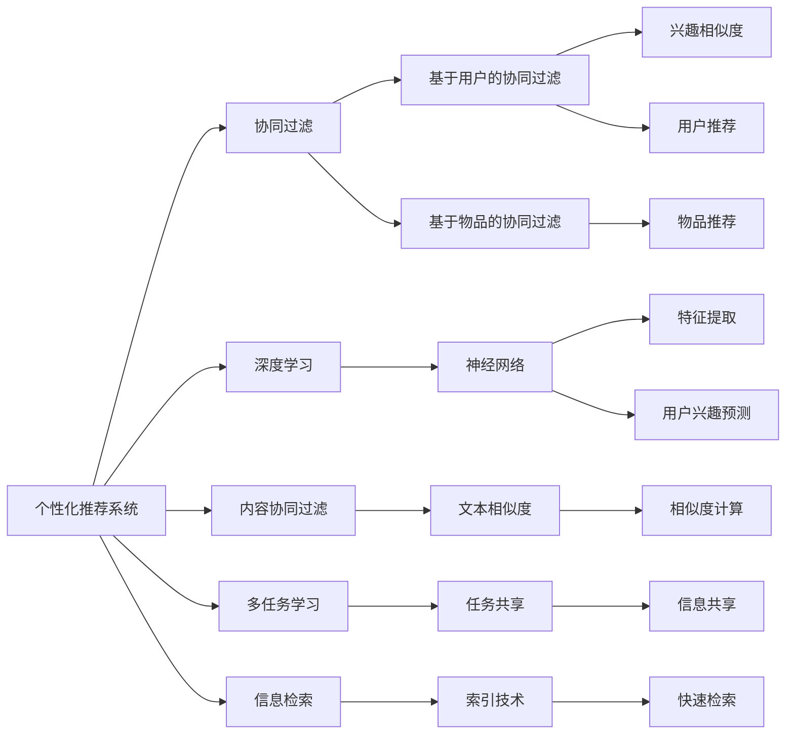

                 

# 注意力经济与个性化推荐系统：如何为受众提供定制内容和体验

> 关键词：注意力经济,个性化推荐系统,用户行为分析,协同过滤,深度学习,内容协同过滤,多任务学习,信息检索,用户体验

## 1. 背景介绍

### 1.1 问题由来

在信息爆炸的时代，海量内容让用户在追求个性化体验时陷入了"信息过载"的困境。而个性化推荐系统则以数据为基础，通过算法匹配，将最相关的信息精准推送给用户，帮助用户快速找到有价值的内容，极大提升了用户的满意度。

但现有的推荐系统在面向个体用户时，普遍存在"千人一面"的弊端，导致推荐结果泛化性差，个性化体验不足。同时，用户注意力资源的争夺也在加剧，如何高效利用用户注意力资源，提高推荐系统的转化率和用户体验，成为亟待解决的问题。

### 1.2 问题核心关键点

个性化推荐系统是通过分析用户行为和兴趣，为用户推荐最相关内容的技术。其核心在于理解用户兴趣，实现内容推荐与用户行为的无缝对接，提升用户满意度和转化率。

1. **用户兴趣建模**：通过对用户历史行为数据的分析，提炼用户兴趣特征，建模用户兴趣画像。
2. **内容推荐算法**：基于用户兴趣，匹配最相关的推荐内容，包括基于协同过滤、深度学习等推荐模型。
3. **用户注意力分析**：分析用户注意力资源在不同推荐内容上的分配，优化推荐算法，提高推荐效果。
4. **推荐效果评估**：通过量化指标评估推荐系统的性能，如点击率、转化率、用户满意度等。

### 1.3 问题研究意义

个性化推荐系统已经成为提升用户体验、提高业务转化率的关键技术，广泛应用于电商、媒体、社交网络等多个领域。研究高效、个性化的推荐方法，对构建优质的用户内容生态，推动企业商业价值增长，具有重要意义。

1. 提升用户体验：精准推荐内容，节省用户搜索时间，提高满意度。
2. 提高业务转化率：推荐高价值产品或服务，提高用户下单转化率。
3. 促进内容增长：针对不同兴趣群体推荐合适内容，增加平台内容曝光。
4. 驱动个性化服务：结合用户历史行为数据，实现全场景个性化推荐。
5. 推动产业升级：应用到垂直行业，提升行业服务水平和效率。

## 2. 核心概念与联系

### 2.1 核心概念概述

为更好地理解个性化推荐系统的原理和应用，本节将介绍几个关键概念：

- **个性化推荐系统**：通过分析用户历史行为数据，预测用户对推荐内容的可能兴趣，并按需推荐给用户，提升用户满意度和转化率。
- **协同过滤**：基于用户对物品的兴趣相似度，通过查找兴趣相似用户或物品，推荐潜在的推荐内容。
- **深度学习**：使用神经网络模型，自动学习用户兴趣和物品特征之间的复杂非线性关系。
- **内容协同过滤**：将推荐系统中的物品转化为文本表示，应用文本相似度计算，实现用户与物品之间的协同推荐。
- **多任务学习**：在推荐系统中，同时学习多个相关任务，如点击率预测、转化率预测、用户满意度预测等，实现任务间的信息共享。
- **信息检索**：使用索引技术，根据用户输入的查询，快速检索相关推荐内容。

这些概念通过以下Mermaid流程图进行连接：



## 3. 核心算法原理 & 具体操作步骤

### 3.1 算法原理概述

个性化推荐系统主要依赖两个基本组件：**用户兴趣建模**和**推荐算法**。其核心思想是：通过分析用户历史行为数据，构建用户兴趣模型；然后，根据模型预测用户对推荐内容的兴趣，选择最相关的推荐内容。

个性化推荐系统的具体流程如下：

1. **数据收集**：从不同渠道收集用户行为数据，包括浏览记录、点击行为、购买记录等。
2. **用户兴趣建模**：使用协同过滤、深度学习等方法，分析用户历史行为数据，提炼用户兴趣特征，构建用户兴趣模型。
3. **推荐算法**：基于用户兴趣模型，使用协同过滤、深度学习等推荐算法，预测用户对不同推荐内容的兴趣，选择最相关的推荐内容。
4. **用户交互**：将推荐内容展示给用户，根据用户点击、浏览、购买等行为，更新用户兴趣模型，优化推荐算法。

### 3.2 算法步骤详解

个性化推荐系统的具体实现步骤如下：

**Step 1: 数据准备**
- 收集用户行为数据，包括浏览记录、点击行为、购买记录等。
- 对数据进行清洗、去重、归一化处理，确保数据的准确性和一致性。

**Step 2: 用户兴趣建模**
- 使用协同过滤、深度学习等方法，分析用户历史行为数据，提炼用户兴趣特征。
- 构建用户兴趣模型，使用如SVD、TF-IDF、Word2Vec、BERT等工具。
- 根据用户行为数据更新兴趣模型，保证模型实时性。

**Step 3: 推荐算法选择**
- 根据推荐场景选择合适的推荐算法，如基于协同过滤的算法、基于深度学习的算法等。
- 根据不同场景，选择合适的推荐模型，如基于用户的协同过滤、基于物品的协同过滤、基于内容的推荐等。

**Step 4: 推荐结果排序**
- 对推荐结果进行排序，使用如Top-K推荐、最大相关度推荐等方法。
- 考虑用户对不同推荐内容的使用时间、点击次数等指标，进行排序优化。

**Step 5: 用户交互与反馈**
- 将推荐内容展示给用户，并记录用户点击、浏览、购买等行为。
- 根据用户反馈数据，更新用户兴趣模型，优化推荐算法。

### 3.3 算法优缺点

个性化推荐系统具有以下优点：
1. 提升用户体验：精准推荐内容，节省用户搜索时间，提高满意度。
2. 提高业务转化率：推荐高价值产品或服务，提高用户下单转化率。
3. 促进内容增长：针对不同兴趣群体推荐合适内容，增加平台内容曝光。
4. 驱动个性化服务：结合用户历史行为数据，实现全场景个性化推荐。
5. 推动产业升级：应用到垂直行业，提升行业服务水平和效率。

同时，个性化推荐系统也存在一些局限：
1. 数据质量要求高：推荐系统依赖于高质量的数据，数据收集和处理难度较大。
2. 模型复杂度高：深度学习等模型需要大量的训练数据和计算资源，对模型复杂度要求高。
3. 算法泛化性差：推荐算法对特定数据集具有较好的效果，跨数据集泛化性较差。
4. 冷启动问题：新用户或新物品难以获取足够的推荐信息，无法进行有效的推荐。
5. 隐私保护问题：用户行为数据的隐私保护是一个重要问题，需要合理设计数据收集和处理流程。

### 3.4 算法应用领域

个性化推荐系统已经在多个领域得到了广泛的应用，包括：

- **电商推荐**：根据用户浏览记录、购买历史等数据，推荐商品。
- **内容推荐**：如新闻、视频、音乐等，推荐个性化内容，提高用户粘性。
- **社交网络**：推荐好友、文章、视频等，提高用户活跃度和留存率。
- **旅游推荐**：推荐景点、酒店、美食等，提高用户旅行体验。
- **健康医疗**：推荐医生、医院、药品等，帮助用户快速获取医疗信息。

这些领域的应用，使得个性化推荐系统成为提升用户体验、提高业务转化的重要手段。

## 4. 数学模型和公式 & 详细讲解 & 举例说明

### 4.1 数学模型构建

假设用户集合为 $U$，物品集合为 $I$，用户对物品的评分矩阵为 $R$。推荐系统通过分析用户历史行为数据，预测用户对物品的评分，然后根据评分排序推荐物品。

模型构建如下：
- 用户兴趣模型：$P_u$，表示用户 $u$ 对物品的兴趣程度。
- 物品特征模型：$P_i$，表示物品 $i$ 的特征。
- 评分预测模型：$P_{ui}$，表示用户 $u$ 对物品 $i$ 的评分。

用户和物品的评分矩阵 $R$ 可以表示为：
$$
R = \left[ \begin{array}{ccc}
0 & 1 & 0 \\
0 & 0 & 1 \\
1 & 0 & 1
\end{array} \right]
$$

推荐系统的目标是最小化预测评分与实际评分之间的误差。可以使用均方误差（MSE）作为损失函数：
$$
\min_{\theta} \frac{1}{2|U||I|} \sum_{u \in U} \sum_{i \in I} (P_{ui} - R_{ui})^2
$$

### 4.2 公式推导过程

以下是基于矩阵分解的用户协同过滤推荐算法推导过程：

1. **用户兴趣矩阵分解**：将用户兴趣矩阵 $P_u$ 分解为两个低维矩阵 $U$ 和 $V$ 的乘积：
$$
P_u = U \cdot V^T
$$

2. **物品特征矩阵分解**：将物品特征矩阵 $P_i$ 分解为两个低维矩阵 $W$ 和 $X$ 的乘积：
$$
P_i = W \cdot X^T
$$

3. **评分预测矩阵分解**：将评分预测矩阵 $P_{ui}$ 分解为 $U$ 和 $W$ 的乘积：
$$
P_{ui} = U_u \cdot W_i
$$

其中 $U_u$ 和 $W_i$ 分别表示用户 $u$ 和物品 $i$ 的低维向量表示。

4. **损失函数推导**：
$$
\min_{U, V, W, X} \frac{1}{2|U||I|} \sum_{u \in U} \sum_{i \in I} (U_u \cdot W_i - R_{ui})^2
$$

使用梯度下降等优化算法求解上述损失函数，得到用户和物品的低维向量表示。最后，根据 $U$ 和 $W$ 的矩阵乘积，得到用户对物品的预测评分 $P_{ui}$。

### 4.3 案例分析与讲解

**案例：电商推荐系统**

电商推荐系统主要通过分析用户浏览记录、购买历史等数据，推荐用户感兴趣的商品。

1. **数据准备**：收集用户的历史行为数据，包括浏览记录、购买历史、评分记录等。
2. **用户兴趣建模**：使用协同过滤算法，对用户兴趣进行建模。
3. **推荐算法选择**：选择基于用户的协同过滤算法，使用用户兴趣模型预测用户对商品的评分。
4. **推荐结果排序**：对推荐结果进行排序，使用Top-K推荐方法。
5. **用户交互与反馈**：根据用户点击、购买等行为，更新用户兴趣模型，优化推荐算法。

## 5. 项目实践：代码实例和详细解释说明

### 5.1 开发环境搭建

在进行个性化推荐系统开发前，需要先准备好开发环境。以下是使用Python进行推荐系统开发的常见环境配置流程：

1. 安装Anaconda：从官网下载并安装Anaconda，用于创建独立的Python环境。
2. 创建并激活虚拟环境：
```bash
conda create -n recomm_system python=3.8 
conda activate recomm_system
```

3. 安装PyTorch：根据CUDA版本，从官网获取对应的安装命令。例如：
```bash
conda install pytorch torchvision torchaudio cudatoolkit=11.1 -c pytorch -c conda-forge
```

4. 安装TensorFlow：
```bash
conda install tensorflow -c pytorch
```

5. 安装Scikit-learn：
```bash
pip install scikit-learn
```

6. 安装Pandas和NumPy：
```bash
pip install pandas numpy
```

完成上述步骤后，即可在`recomm_system`环境中开始推荐系统开发。

### 5.2 源代码详细实现

这里我们以协同过滤推荐算法为例，给出使用Python实现电商推荐系统的代码。

首先，定义推荐系统数据结构：

```python
import pandas as pd
import numpy as np

# 用户和物品的评分矩阵
R = pd.DataFrame({
    'u1': [0, 0, 1],
    'u2': [0, 1, 0],
    'u3': [1, 0, 1]
}, index=['item1', 'item2', 'item3'])

# 用户兴趣矩阵
U = pd.DataFrame({
    'u1': [1, 0, 0, 0],
    'u2': [0, 1, 0, 0],
    'u3': [0, 0, 1, 1]
}, index=['item1', 'item2', 'item3', 'item4'])

# 物品特征矩阵
W = pd.DataFrame({
    'item1': [0, 1, 0, 0],
    'item2': [1, 0, 0, 0],
    'item3': [0, 0, 1, 0]
}, index=['item1', 'item2', 'item3', 'item4'])
```

然后，定义协同过滤推荐算法：

```python
from scipy.sparse.linalg import svds

def collaborative_filtering(R, U, W):
    # 矩阵分解
    U, singular_values, Vt = svds(R, k=4)
    
    # 预测评分
    P_hat = np.dot(U, np.dot(singular_values, W))
    
    # 推荐物品
    recommended_items = np.argsort(P_hat, axis=0)[-10:]
    
    return recommended_items
```

最后，进行推荐系统实现并展示推荐结果：

```python
# 数据准备
user_ids = ['u1', 'u2', 'u3']
item_ids = ['item1', 'item2', 'item3']

# 推荐系统
recommended_items = collaborative_filtering(R, U, W)

# 输出推荐结果
for user_id in user_ids:
    print(f'User {user_id} may like the following items:')
    print(recommended_items[user_id])
```

以上就是使用Python实现协同过滤推荐算法的完整代码实现。可以看到，通过简单的矩阵分解和排序操作，即可实现电商推荐系统的个性化推荐。

### 5.3 代码解读与分析

让我们再详细解读一下关键代码的实现细节：

**用户和物品评分矩阵R**：
- 表示用户对物品的评分，非零表示用户已经对该物品进行过评分。

**用户兴趣矩阵U**：
- 表示用户对不同物品的兴趣程度，非零表示用户对相应物品感兴趣。

**物品特征矩阵W**：
- 表示物品的特征，非零表示物品的相应特征。

**协同过滤推荐算法**：
- 使用SVD方法对用户和物品的评分矩阵进行矩阵分解，得到用户和物品的低维向量表示。
- 根据分解后的向量计算用户对物品的预测评分，并按照评分大小排序，输出推荐结果。

推荐系统的实现相对简单，但实际应用中需要考虑更多因素，如用户行为数据的多样性、冷启动问题、隐私保护等。

## 6. 实际应用场景

### 6.1 智能广告推荐

智能广告推荐系统通过分析用户的历史行为和兴趣，向用户推荐最相关的广告。广告推荐能够大幅提高广告点击率和转化率，提升广告投放效果。

广告推荐系统的具体流程如下：
1. **数据准备**：收集用户的历史广告行为数据，包括浏览记录、点击行为、购买行为等。
2. **用户兴趣建模**：使用协同过滤算法，对用户兴趣进行建模。
3. **推荐算法选择**：选择基于广告特征的推荐算法，使用用户兴趣模型预测用户对广告的兴趣。
4. **推荐结果排序**：对推荐结果进行排序，使用点击率-转化率（CTR）排序方法。
5. **用户交互与反馈**：根据用户点击、购买等行为，更新用户兴趣模型，优化推荐算法。

### 6.2 个性化视频推荐

个性化视频推荐系统通过分析用户的历史观看记录和评分数据，推荐用户感兴趣的视频内容。视频推荐能够提高用户观看视频的时长和频率，增加视频平台的用户粘性。

视频推荐系统的具体流程如下：
1. **数据准备**：收集用户的视频观看记录、评分记录等数据。
2. **用户兴趣建模**：使用协同过滤算法，对用户兴趣进行建模。
3. **推荐算法选择**：选择基于视频特征的推荐算法，使用用户兴趣模型预测用户对视频的兴趣。
4. **推荐结果排序**：对推荐结果进行排序，使用视频观看时长排序方法。
5. **用户交互与反馈**：根据用户观看时长、评分等行为，更新用户兴趣模型，优化推荐算法。

### 6.3 个性化新闻推荐

个性化新闻推荐系统通过分析用户的历史阅读记录和评分数据，推荐用户感兴趣的新闻内容。新闻推荐能够提高用户的新闻阅读量和粘性，增加新闻平台的用户留存率。

新闻推荐系统的具体流程如下：
1. **数据准备**：收集用户的新闻阅读记录、评分记录等数据。
2. **用户兴趣建模**：使用协同过滤算法，对用户兴趣进行建模。
3. **推荐算法选择**：选择基于新闻特征的推荐算法，使用用户兴趣模型预测用户对新闻的兴趣。
4. **推荐结果排序**：对推荐结果进行排序，使用新闻阅读时长排序方法。
5. **用户交互与反馈**：根据用户阅读时长、评分等行为，更新用户兴趣模型，优化推荐算法。

### 6.4 未来应用展望

随着个性化推荐技术的不断进步，未来将呈现以下趋势：

1. **深度学习和大模型应用**：未来将更多地应用深度学习和大模型技术，提高推荐系统的精度和泛化能力。
2. **用户行为理解**：更深入地理解用户行为背后的动机和情感，提供更加个性化的推荐内容。
3. **多模态信息融合**：结合图像、语音、视频等多模态信息，提升推荐系统的感知能力。
4. **跨领域推荐**：实现跨领域的推荐，如电商、社交网络、新闻等领域的无缝衔接。
5. **实时推荐系统**：构建实时推荐系统，动态调整推荐策略，提高推荐效果。
6. **隐私保护**：加强数据隐私保护，确保用户数据的安全和合规性。
7. **智能推荐引擎**：开发智能推荐引擎，自动优化推荐算法，提高推荐系统性能。

## 7. 工具和资源推荐

### 7.1 学习资源推荐

为帮助开发者系统掌握个性化推荐系统的理论基础和实践技巧，这里推荐一些优质的学习资源：

1. 《推荐系统实战》：彭跃刚等著，系统介绍了推荐系统基础和常见算法，适合入门学习。
2. 《深度学习与推荐系统》：黄伟等著，介绍了深度学习在推荐系统中的应用，涵盖协同过滤、深度学习、多任务学习等。
3. 《大规模推荐系统》：刘强等著，介绍了大规模推荐系统的设计、实现和优化方法，适合深度学习和大模型应用的开发者。
4. 《机器学习实战》：Peter Harrington著，介绍了多种机器学习算法，包括协同过滤、深度学习等。
5. Coursera《推荐系统》课程：斯坦福大学开设的推荐系统课程，涵盖协同过滤、深度学习、多任务学习等。

通过对这些资源的学习实践，相信你一定能够快速掌握个性化推荐系统的精髓，并用于解决实际的推荐问题。

### 7.2 开发工具推荐

高效的开发离不开优秀的工具支持。以下是几款用于个性化推荐系统开发的常用工具：

1. TensorFlow：由Google主导开发的开源深度学习框架，生产部署方便，适合大规模工程应用。
2. PyTorch：基于Python的开源深度学习框架，灵活易用，适合快速迭代研究。
3. Scikit-learn：Python中的机器学习库，提供了多种推荐算法和模型。
4. Apache Spark：分布式计算框架，适合大规模数据处理和推荐系统开发。
5. Hadoop：开源分布式计算平台，适合大数据处理和推荐系统开发。

合理利用这些工具，可以显著提升个性化推荐系统的开发效率，加快创新迭代的步伐。

### 7.3 相关论文推荐

个性化推荐系统的发展源于学界的持续研究。以下是几篇奠基性的相关论文，推荐阅读：

1. Personalized Recommendation by Matrix Factorization：SVD算法在推荐系统中的应用。
2. A New Recommender System Approach Based on Deep Learning：深度学习在推荐系统中的应用。
3. Adaptive Model-based Recommendations：多任务学习在推荐系统中的应用。
4. A Probabilistic Latent Semantic Analysis Model for Recommendation Systems：协同过滤在推荐系统中的应用。
5. Multi-task Learning for Recommendations：多任务学习在推荐系统中的应用。

这些论文代表了个性化推荐系统的发展脉络。通过学习这些前沿成果，可以帮助研究者把握学科前进方向，激发更多的创新灵感。

## 8. 总结：未来发展趋势与挑战

### 8.1 总结

本文对个性化推荐系统进行了全面系统的介绍。首先阐述了个性化推荐系统的研究背景和意义，明确了推荐系统在提升用户体验、提高业务转化率等方面的重要价值。其次，从原理到实践，详细讲解了推荐系统的数学模型和关键算法，给出了推荐系统开发的完整代码实例。同时，本文还广泛探讨了推荐系统在智能广告、个性化视频、个性化新闻等多个领域的应用前景，展示了推荐系统的广阔前景。最后，本文精选了推荐系统的各类学习资源，力求为读者提供全方位的技术指引。

通过本文的系统梳理，可以看到，个性化推荐系统已经成为提升用户体验、提高业务转化的重要技术，广泛应用于电商、媒体、社交网络等多个领域。未来，伴随深度学习、大模型等技术的不断发展，推荐系统必将在更多领域得到应用，为人类社会带来更深刻的影响。

### 8.2 未来发展趋势

展望未来，个性化推荐系统将呈现以下几个发展趋势：

1. **深度学习和大模型应用**：未来将更多地应用深度学习和大模型技术，提高推荐系统的精度和泛化能力。
2. **用户行为理解**：更深入地理解用户行为背后的动机和情感，提供更加个性化的推荐内容。
3. **多模态信息融合**：结合图像、语音、视频等多模态信息，提升推荐系统的感知能力。
4. **跨领域推荐**：实现跨领域的推荐，如电商、社交网络、新闻等领域的无缝衔接。
5. **实时推荐系统**：构建实时推荐系统，动态调整推荐策略，提高推荐效果。
6. **隐私保护**：加强数据隐私保护，确保用户数据的安全和合规性。
7. **智能推荐引擎**：开发智能推荐引擎，自动优化推荐算法，提高推荐系统性能。

这些趋势凸显了个性化推荐系统的广阔前景。这些方向的探索发展，必将进一步提升推荐系统的性能和应用范围，为人类社会带来更广泛的影响。

### 8.3 面临的挑战

尽管个性化推荐系统已经取得了显著成就，但在迈向更加智能化、普适化应用的过程中，它仍面临着诸多挑战：

1. **数据质量要求高**：推荐系统依赖于高质量的数据，数据收集和处理难度较大。
2. **模型复杂度高**：深度学习等模型需要大量的训练数据和计算资源，对模型复杂度要求高。
3. **算法泛化性差**：推荐算法对特定数据集具有较好的效果，跨数据集泛化性较差。
4. **冷启动问题**：新用户或新物品难以获取足够的推荐信息，无法进行有效的推荐。
5. **隐私保护问题**：用户行为数据的隐私保护是一个重要问题，需要合理设计数据收集和处理流程。
6. **推荐算法鲁棒性**：推荐算法对异常数据和噪声数据敏感，容易出现推荐结果不准确的情况。

正视推荐系统面临的这些挑战，积极应对并寻求突破，将是个性化推荐系统走向成熟的必由之路。相信随着学界和产业界的共同努力，这些挑战终将一一被克服，个性化推荐系统必将在构建优质的用户内容生态，推动企业商业价值增长，构建安全、可靠、可解释、可控的智能系统铺平道路。

### 8.4 研究展望

面对个性化推荐系统所面临的挑战，未来的研究需要在以下几个方面寻求新的突破：

1. **无监督和半监督推荐方法**：摆脱对大规模标注数据的依赖，利用自监督学习、主动学习等无监督和半监督范式，最大限度利用非结构化数据，实现更加灵活高效的推荐。
2. **参数高效和多任务学习**：开发更加参数高效的推荐方法，在固定大部分预训练参数的同时，只更新极少量的任务相关参数。同时，引入多任务学习技术，实现不同推荐任务间的信息共享。
3. **因果推理和博弈论**：将因果推断和博弈论思想引入推荐系统，增强推荐算法建立稳定因果关系的能力，学习更加普适、鲁棒的语言表征，从而提升推荐效果。
4. **知识表示和协同过滤**：将符号化的先验知识，如知识图谱、逻辑规则等，与神经网络模型进行巧妙融合，引导推荐过程学习更准确、合理的语言模型。
5. **跨领域推荐**：实现跨领域的推荐，如电商、社交网络、新闻等领域的无缝衔接。
6. **实时推荐系统**：构建实时推荐系统，动态调整推荐策略，提高推荐效果。
7. **隐私保护**：加强数据隐私保护，确保用户数据的安全和合规性。
8. **智能推荐引擎**：开发智能推荐引擎，自动优化推荐算法，提高推荐系统性能。

这些研究方向将引领个性化推荐系统技术迈向更高的台阶，为构建安全、可靠、可解释、可控的智能系统铺平道路。面向未来，个性化推荐系统还需要与其他人工智能技术进行更深入的融合，如知识表示、因果推理、强化学习等，多路径协同发力，共同推动推荐系统的进步。只有勇于创新、敢于突破，才能不断拓展推荐系统的边界，让智能技术更好地造福人类社会。

## 9. 附录：常见问题与解答

**Q1：如何缓解推荐系统中的冷启动问题？**

A: 缓解推荐系统中的冷启动问题，主要通过以下方法：
1. 引入用户兴趣初始化：使用用户的人口统计特征、历史行为等进行用户兴趣初始化。
2. 引入物品特征初始化：使用物品的元数据、历史评分等进行物品特征初始化。
3. 使用预训练模型：使用预训练模型对用户和物品进行嵌入，增加初始化信息的丰富度。
4. 使用深度学习：通过深度学习模型自动学习用户兴趣和物品特征，缓解冷启动问题。
5. 使用元学习：通过元学习技术，快速适应新用户或新物品的推荐需求。

这些方法可以通过合理设计推荐算法，有效缓解冷启动问题，提升推荐系统的效果。

**Q2：推荐系统如何处理多模态信息？**

A: 推荐系统可以通过以下方法处理多模态信息：
1. 特征融合：将不同模态的特征进行融合，使用如加权平均、拼接等方法。
2. 联合建模：使用联合学习技术，在不同模态间共享模型参数，实现联合建模。
3. 多任务学习：在推荐系统中，同时学习多个相关任务，如点击率预测、转化率预测、用户满意度预测等，实现任务间的信息共享。
4. 信息检索：使用索引技术，根据用户输入的查询，快速检索相关推荐内容。
5. 注意力机制：引入注意力机制，将用户对不同模态的关注程度纳入推荐模型。

这些方法可以通过合理设计推荐模型，充分利用多模态信息，提升推荐系统的性能。

**Q3：推荐系统如何处理用户隐私问题？**

A: 推荐系统可以通过以下方法处理用户隐私问题：
1. 数据匿名化：对用户数据进行匿名化处理，保护用户隐私。
2. 数据加密：使用数据加密技术，保护数据传输和存储过程中的隐私。
3. 差分隐私：使用差分隐私技术，保护用户隐私，同时保证推荐系统的效果。
4. 用户控制：赋予用户隐私控制权，让用户自主决定是否分享数据。
5. 数据访问控制：限制数据访问权限，保护用户数据安全。

这些方法可以通过合理设计推荐系统，保护用户隐私，确保用户数据的安全和合规性。

**Q4：推荐系统如何处理用户行为异常数据？**

A: 推荐系统可以通过以下方法处理用户行为异常数据：
1. 数据清洗：对数据进行清洗，去除异常数据和噪声数据。
2. 异常检测：使用异常检测算法，识别并处理异常数据。
3. 多模型融合：使用多个推荐模型，通过加权平均或投票方法，降低异常数据的影响。
4. 鲁棒优化：使用鲁棒优化技术，提高推荐系统的鲁棒性，减少异常数据对推荐结果的影响。
5. 动态调整：根据用户行为变化，动态调整推荐策略，避免异常数据对推荐效果的影响。

这些方法可以通过合理设计推荐算法，处理用户行为异常数据，提升推荐系统的效果。

---

作者：禅与计算机程序设计艺术 / Zen and the Art of Computer Programming

