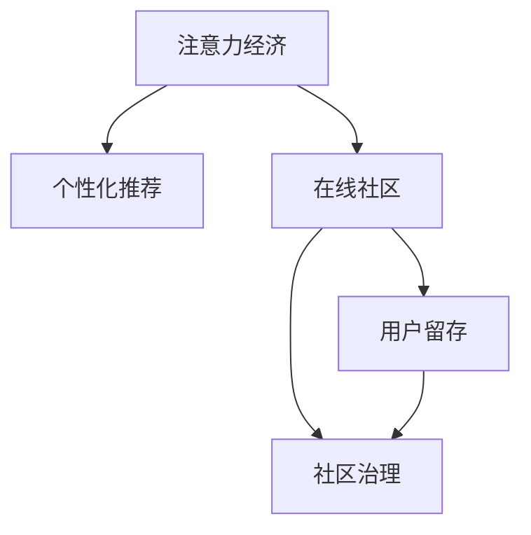

                 

## 1. 背景介绍

### 1.1 问题由来

在信息爆炸的时代，注意力成为了一种稀缺资源。在线社区作为信息交流和传播的重要平台，面对海量用户和内容，如何吸引和留住忠实的受众和粉丝，成为社区运营者必须解决的核心问题。传统的流量思维和粗放式运营已经难以适应这一变化，特别是针对新兴内容平台和社交网络，如何高效利用用户的注意力，构建并维持健康活跃的社区生态，成为摆在他们面前的重要课题。

近年来，随着人工智能和大数据技术的快速发展，基于算法的个性化推荐和广告定向投放，已经成为了吸引用户注意力的主要手段。而通过机器学习算法构建的推荐系统，能够根据用户的兴趣和行为，精准推送个性化内容，从而显著提升用户体验和社区粘性。

### 1.2 问题核心关键点

社区运营的核心目标之一是实现用户留存，即通过各种策略和方法，将新用户转化为活跃用户，并减少用户的流失率。具体来说，以下几个关键点需要重点关注：

- **个性化推荐**：基于用户兴趣和行为，精准推送相关内容，提升用户体验和满意度。
- **社区互动**：通过鼓励和促进用户间的互动和交流，增强社区的归属感和参与感。
- **内容多样性**：提供丰富多样的内容形式和主题，满足不同用户群体的需求。
- **优质内容激励**：通过推荐系统自动识别和奖励优质内容，确保内容生态的健康发展。
- **用户体验优化**：优化社区界面设计和功能模块，提升用户体验，减少流失。

### 1.3 问题研究意义

有效利用注意力经济，吸引并留住忠实的受众和粉丝，对于在线社区的长期健康发展具有重要意义：

1. **提升用户粘性**：通过个性化推荐和互动机制，增强用户对社区的依赖，减少流失。
2. **增加用户活跃度**：促进用户积极参与社区讨论和创作，形成良性互动循环。
3. **优化资源分配**：精准推送优质内容，避免资源浪费，提升广告投放效果。
4. **构建社区生态**：通过优质内容激励和社区治理机制，营造健康向上的社区氛围。
5. **增强用户信任**：通过透明的数据采集和使用方式，增强用户对平台的信任感。

## 2. 核心概念与联系

### 2.1 核心概念概述

为了更好地理解注意力经济和在线社区建设，本节将介绍几个关键概念及其相互联系：

- **注意力经济**：指在信息过载的环境下，用户对有限注意力资源的竞争和争夺，成为各类市场竞争的新焦点。
- **个性化推荐**：基于用户兴趣和行为，通过算法匹配和推送个性化内容，提升用户体验和满意度。
- **在线社区**：指通过互联网平台，围绕某一主题或兴趣群体，进行内容交流和互动的虚拟社群。
- **用户留存**：通过各种策略和方法，将新用户转化为活跃用户，并减少用户的流失率。
- **社区治理**：指通过制定和执行社区规则，维护社区秩序，打击不良行为，保障用户权益。

这些核心概念之间的逻辑关系可以通过以下Mermaid流程图来展示：



这个流程图展示了注意力经济、个性化推荐、在线社区、用户留存和社区治理之间的联系：

1. 注意力经济是整个社区建设的基础，通过个性化推荐吸引用户注意力，提升用户体验。
2. 在线社区是用户互动和交流的平台，社区治理机制保障社区秩序和用户权益。
3. 用户留存是社区运营的目标，通过多种策略留住忠实用户，增强社区粘性。
4. 个性化推荐和社区治理相互协作，共同提升用户满意度，促进社区发展。

## 3. 核心算法原理 & 具体操作步骤
### 3.1 算法原理概述

基于注意力经济和在线社区建设的个性化推荐算法，主要利用用户的兴趣、行为和社交关系，构建用户画像，并通过机器学习模型计算用户与内容之间的匹配度，进行个性化内容推荐。其核心思想是：

1. **数据采集与特征提取**：通过日志、搜索行为、浏览记录等方式，收集用户的数据和行为特征。
2. **用户画像构建**：使用机器学习算法，将用户数据转化为高维度的向量表示，即用户画像。
3. **内容表示与匹配**：将内容转化为向量表示，通过相似度计算，匹配用户与内容之间的相似度。
4. **推荐算法实现**：根据用户画像和内容向量，通过排名算法，选择推荐的内容集合。
5. **动态调整与优化**：根据用户反馈和行为变化，动态调整推荐策略和内容库，持续优化推荐效果。

### 3.2 算法步骤详解

基于注意力经济和在线社区建设的个性化推荐算法主要包括以下几个关键步骤：

**Step 1: 数据采集与预处理**

- 从日志、搜索、评论、点赞等数据源中采集用户行为数据。
- 清洗数据，去除噪声和冗余，保留有价值的特征。
- 对用户行为数据进行标注和分类，如兴趣类别、评分等。

**Step 2: 用户画像构建**

- 使用聚类、分类等算法，将用户数据转化为高维度的向量表示，即用户画像。
- 构建用户画像库，便于后续推荐和分析。

**Step 3: 内容表示与匹配**

- 对内容进行文本提取、标签标注等预处理。
- 使用TF-IDF、Word2Vec等算法，将内容转化为向量表示，即内容特征向量。
- 计算用户画像和内容特征向量之间的相似度，选择合适的匹配度指标，如余弦相似度、欧式距离等。

**Step 4: 推荐算法实现**

- 设计推荐算法，如基于协同过滤、基于内容的推荐、混合推荐等，计算内容与用户之间的匹配度。
- 根据匹配度排序，选择推荐的内容集合。
- 实现推荐系统，为用户推送个性化内容。

**Step 5: 动态调整与优化**

- 收集用户反馈，分析用户行为变化。
- 根据用户反馈和行为变化，动态调整推荐算法和内容库，优化推荐效果。
- 定期更新用户画像和内容特征向量，保持推荐系统的前沿性和高效性。

### 3.3 算法优缺点

基于注意力经济和在线社区建设的个性化推荐算法，具有以下优点：

1. **提升用户体验**：通过个性化推荐，用户能够快速找到感兴趣的内容，提升使用体验。
2. **精准匹配**：利用机器学习算法，能够准确匹配用户和内容，提升推荐精度。
3. **高效运营**：自动化推荐系统，节省了大量人力和资源，提升运营效率。

同时，该算法也存在一些局限性：

1. **数据隐私问题**：用户行为数据的采集和处理可能涉及到隐私问题，需遵守相关法律法规。
2. **冷启动问题**：新用户的画像和行为特征难以获取，推荐效果可能不佳。
3. **推荐偏差**：算法可能受到数据偏差的影响，导致推荐内容偏向于某类用户或内容。
4. **动态变化**：用户兴趣和行为随时间变化，推荐算法需要持续更新和优化。

### 3.4 算法应用领域

基于注意力经济和在线社区建设的个性化推荐算法，在以下领域得到广泛应用：

- **电商推荐**：推荐系统帮助用户快速找到所需商品，提升购物体验。
- **新闻资讯**：个性化推荐新闻、文章等，满足用户的信息获取需求。
- **视频平台**：推荐热门视频和用户兴趣相关的视频内容，增加用户粘性。
- **社交网络**：推荐用户感兴趣的朋友、文章等，丰富用户的社交体验。
- **在线教育**：推荐适合用户的学习内容和课程，提升学习效果。

除了这些经典应用领域外，个性化推荐算法还被创新性地应用于更多场景中，如智能搜索、智慧旅游、数字健康等，为在线社区建设带来了全新的突破。

## 4. 数学模型和公式 & 详细讲解  
### 4.1 数学模型构建

本节将使用数学语言对基于注意力经济和在线社区建设的个性化推荐过程进行更加严格的刻画。

记用户集合为 $U$，内容集合为 $V$，用户与内容之间的相似度矩阵为 $S \in \mathbb{R}^{m \times n}$，其中 $m$ 为用户数，$n$ 为内容数。假设用户 $u$ 对内容 $v$ 的评分向量为 $R_u \in \mathbb{R}^n$，内容 $v$ 的特征向量为 $C_v \in \mathbb{R}^d$，其中 $d$ 为特征维度。

定义推荐算法为 $F: U \times V \rightarrow [0,1]$，输出用户对内容的推荐概率。形式化地，推荐模型的目标是最小化损失函数 $\mathcal{L}(R_u, F(u, V))$，即：

$$
\hat{R_u} = \mathop{\arg\min}_{F(u, V)} \mathcal{L}(R_u, F(u, V))
$$

其中 $\mathcal{L}$ 为推荐损失函数，用于衡量推荐概率与用户评分之间的差异。

### 4.2 公式推导过程

以下我们以协同过滤算法为例，推导个性化推荐模型的数学公式。

协同过滤算法基于用户-物品共现矩阵，通过计算用户与物品之间的相似度，进行推荐。假设用户 $u$ 和内容 $v$ 的共现次数为 $r_{uv}$，协同过滤算法可以表示为：

$$
F(u, V) = \frac{\sum_{v \in V} \alpha_{uv} C_v}{\sum_{v \in V} \alpha_{uv}}
$$

其中 $\alpha_{uv} = \frac{r_{uv}}{\sqrt{r_{u+}r_{v+}}}$，$r_{u+}$ 和 $r_{v+}$ 分别为用户 $u$ 和内容 $v$ 的共现次数总和。$C_v$ 为内容 $v$ 的特征向量。

将推荐概率 $F(u, V)$ 表示为 $R_u$ 的函数，可以得：

$$
F(u, V) = \frac{\sum_{v \in V} \alpha_{uv} C_v}{\sum_{v \in V} \alpha_{uv}} = \frac{\sum_{v \in V} \alpha_{uv} C_v}{\sum_{v \in V} \alpha_{uv} R_u}
$$

进一步化简得：

$$
F(u, V) = \frac{\sum_{v \in V} \alpha_{uv} C_v}{\sum_{v \in V} \alpha_{uv} R_u} = \frac{\sum_{v \in V} \alpha_{uv} (C_v - C_v)}{\sum_{v \in V} \alpha_{uv} (R_u - R_u)} = \frac{C_u^T C_v}{R_u^T C_v}
$$

其中 $C_u = \alpha_{u+} C_u$，$C_v = \alpha_{v+} C_v$，$\alpha_{u+}$ 和 $\alpha_{v+}$ 分别为用户 $u$ 和内容 $v$ 的共现次数总和。

### 4.3 案例分析与讲解

**案例一：电商推荐系统**

假设电商平台上每个用户对每件商品的评分，以及每件商品的热度、类别、品牌等特征。通过协同过滤算法，计算用户对商品的相似度和推荐概率，实现个性化推荐。

**案例二：视频平台**

假设用户对每个视频的评分，以及视频的观看次数、热度、主题、时长等特征。通过协同过滤算法，计算用户对视频的相似度和推荐概率，实现个性化推荐。

**案例三：新闻资讯平台**

假设用户对每篇新闻的阅读次数、点赞数、评论数等行为特征，以及新闻的主题、作者、发布时间等属性。通过协同过滤算法，计算用户对新闻的相似度和推荐概率，实现个性化推荐。

这些案例展示了协同过滤算法在不同场景下的应用，通过精确计算用户与内容之间的相似度，提供个性化的推荐服务，提升用户体验和满意度。

## 5. 项目实践：代码实例和详细解释说明
### 5.1 开发环境搭建

在进行个性化推荐系统开发前，我们需要准备好开发环境。以下是使用Python进行Scikit-learn和TensorFlow开发的环境配置流程：

1. 安装Anaconda：从官网下载并安装Anaconda，用于创建独立的Python环境。

2. 创建并激活虚拟环境：
```bash
conda create -n recommender-env python=3.8 
conda activate recommender-env
```

3. 安装Scikit-learn和TensorFlow：根据CUDA版本，从官网获取对应的安装命令。例如：
```bash
conda install scikit-learn tensorflow -c pytorch -c conda-forge
```

4. 安装各类工具包：
```bash
pip install numpy pandas scikit-learn matplotlib tqdm jupyter notebook ipython
```

完成上述步骤后，即可在`recommender-env`环境中开始推荐系统开发。

### 5.2 源代码详细实现

这里我们以协同过滤算法为例，给出使用Scikit-learn库对个性化推荐系统进行开发的PyTorch代码实现。

首先，定义协同过滤算法的推荐函数：

```python
from sklearn.metrics.pairwise import cosine_similarity
from sklearn.metrics.pairwise import linear_kernel

def collaborative_filtering(user, items, ratings, top_n=10):
    similarity = linear_kernel(items.values)
    predicted_ratings = similarity.dot(items[user].T)
    recommended_items = (predicted_ratings / (predicted_ratings + ratings[user])).argsort()[-top_n:][::-1]
    return recommended_items
```

然后，定义数据加载和预处理函数：

```python
import pandas as pd

def load_data(path):
    data = pd.read_csv(path)
    user_ids = data['user_id']
    item_ids = data['item_id']
    ratings = data['rating']
    return user_ids, item_ids, ratings

def preprocess_data(user_ids, item_ids, ratings, top_n=10):
    items = pd.DataFrame({item_id: [] for item_id in set(item_ids)}, dtype='float64')
    for user_id, item_id, rating in zip(user_ids, item_ids, ratings):
        items.loc[item_id, user_id] = rating
    return user_ids, item_ids, ratings, items
```

最后，启动推荐系统并进行测试：

```python
user_ids, item_ids, ratings = load_data('ratings.csv')
user_ids, item_ids, ratings, items = preprocess_data(user_ids, item_ids, ratings)

for user_id in user_ids:
    recommended_items = collaborative_filtering(user_id, items, ratings)
    print(f'User {user_id} is recommended items: {recommended_items}')

user_ids, item_ids, ratings = load_data('ratings.csv')
user_ids, item_ids, ratings, items = preprocess_data(user_ids, item_ids, ratings)

for user_id in user_ids:
    recommended_items = collaborative_filtering(user_id, items, ratings)
    print(f'User {user_id} is recommended items: {recommended_items}')
```

以上就是使用Scikit-learn库对协同过滤算法进行推荐系统开发的完整代码实现。可以看到，借助Scikit-learn的强大封装，协同过滤算法得以快速实现。

### 5.3 代码解读与分析

让我们再详细解读一下关键代码的实现细节：

**collaborative_filtering函数**：
- 计算用户与物品之间的相似度矩阵。
- 根据相似度矩阵，计算每个物品对用户的预测评分。
- 选择预测评分最高的前top_n个物品作为推荐结果。

**load_data函数**：
- 从CSV文件中加载用户评分数据。
- 对数据进行清洗和预处理，去除噪声和冗余，保留有价值的特征。

**preprocess_data函数**：
- 将评分数据转换为稀疏矩阵形式，便于计算相似度。
- 对稀疏矩阵进行归一化处理，避免评分偏差。

**测试代码**：
- 加载评分数据。
- 预处理数据。
- 对每个用户，调用collaborative_filtering函数，输出推荐结果。

以上代码展示了协同过滤算法的具体实现，充分利用Scikit-learn的强大函数库，简化了推荐系统的开发过程。

## 6. 实际应用场景
### 6.1 电商平台推荐

电商平台上，用户可以通过搜索、浏览、评价等方式，积累对商品的好恶度评分数据。基于这些数据，推荐系统可以计算用户与商品之间的相似度，进行个性化推荐。

**具体流程**：
1. 收集用户对商品的评分和行为数据。
2. 使用协同过滤算法，计算用户与商品之间的相似度。
3. 根据相似度排序，选择推荐商品。
4. 实时推送推荐商品到用户界面。

**应用效果**：
- 提升用户购买转化率：推荐系统帮助用户快速找到感兴趣的商品，增加购买意愿。
- 优化商品库存管理：推荐系统能够预测热门商品，减少库存积压。
- 提升客户满意度：推荐系统个性化推荐，提升用户体验。

### 6.2 视频平台推荐

视频平台上，用户通过搜索、观看、点赞等方式，积累对视频的好恶度评分数据。基于这些数据，推荐系统可以计算用户与视频之间的相似度，进行个性化推荐。

**具体流程**：
1. 收集用户对视频的评分和行为数据。
2. 使用协同过滤算法，计算用户与视频之间的相似度。
3. 根据相似度排序，选择推荐视频。
4. 实时推送推荐视频到用户界面。

**应用效果**：
- 提升用户观看率：推荐系统能够推荐用户感兴趣的视频内容，增加观看时间。
- 优化视频内容分发：推荐系统能够预测热门视频，优化内容分发策略。
- 增加平台用户粘性：推荐系统个性化推荐，增加用户停留时间。

### 6.3 新闻资讯平台推荐

新闻资讯平台上，用户通过搜索、阅读、点赞等方式，积累对新闻的好恶度评分数据。基于这些数据，推荐系统可以计算用户与新闻之间的相似度，进行个性化推荐。

**具体流程**：
1. 收集用户对新闻的评分和行为数据。
2. 使用协同过滤算法，计算用户与新闻之间的相似度。
3. 根据相似度排序，选择推荐新闻。
4. 实时推送推荐新闻到用户界面。

**应用效果**：
- 提升新闻阅读率：推荐系统能够推荐用户感兴趣的新闻内容，增加阅读量。
- 优化新闻内容分发：推荐系统能够预测热门新闻，优化内容分发策略。
- 增加平台用户粘性：推荐系统个性化推荐，增加用户停留时间。

### 6.4 未来应用展望

随着个性化推荐算法的不断演进，未来在更多领域将实现广泛应用：

1. **智能搜索**：通过用户搜索行为，推荐相关信息和资源，提升搜索体验。
2. **智慧旅游**：根据用户历史出行记录和兴趣，推荐旅游目的地和路线，提升旅游体验。
3. **数字健康**：根据用户健康数据和行为，推荐健康建议和资源，提升健康管理效果。
4. **智能家居**：根据用户习惯和偏好，推荐智能家居设备和服务，提升生活品质。
5. **个性化教育**：根据学生学习行为和成绩，推荐个性化学习资源和课程，提升学习效果。

未来，个性化推荐算法将与更多领域进行融合，提供更加精准、全面的个性化服务，提升用户满意度和平台竞争力。

## 7. 工具和资源推荐
### 7.1 学习资源推荐

为了帮助开发者系统掌握个性化推荐算法和在线社区建设的理论基础和实践技巧，这里推荐一些优质的学习资源：

1. 《推荐系统实战》系列博文：由个性化推荐领域专家撰写，系统介绍了推荐算法的基本概念和实际应用。

2. CS225《推荐系统》课程：斯坦福大学开设的推荐系统课程，有Lecture视频和配套作业，适合入门推荐系统学习。

3. 《Recommender Systems: Mining Knowledge from Data》书籍：该书系统介绍了推荐系统的理论基础和实践方法，适合深入学习推荐系统。

4. Kaggle竞赛：Kaggle平台上有多项个性化推荐和在线社区建设的竞赛，通过参与竞赛，可以积累实际开发经验。

通过对这些资源的学习实践，相信你一定能够快速掌握个性化推荐算法和在线社区建设的精髓，并用于解决实际的推荐问题和社区运营问题。

### 7.2 开发工具推荐

高效的开发离不开优秀的工具支持。以下是几款用于个性化推荐系统开发的常用工具：

1. Scikit-learn：基于Python的机器学习库，提供了丰富的机器学习算法和工具。

2. TensorFlow：由Google主导开发的深度学习框架，适合大规模工程应用。

3. PyTorch：基于Python的深度学习框架，灵活动态的计算图，适合快速迭代研究。

4. Weights & Biases：模型训练的实验跟踪工具，可以记录和可视化模型训练过程中的各项指标，方便对比和调优。

5. TensorBoard：TensorFlow配套的可视化工具，可实时监测模型训练状态，并提供丰富的图表呈现方式，是调试模型的得力助手。

6. Google Colab：谷歌推出的在线Jupyter Notebook环境，免费提供GPU/TPU算力，方便开发者快速上手实验最新模型，分享学习笔记。

合理利用这些工具，可以显著提升个性化推荐系统的开发效率，加快创新迭代的步伐。

### 7.3 相关论文推荐

个性化推荐和在线社区建设的研究源于学界的持续研究。以下是几篇奠基性的相关论文，推荐阅读：

1. BERT: Pre-training of Deep Bidirectional Transformers for Language Understanding（BERT论文）：提出BERT模型，引入基于掩码的自监督预训练任务，刷新了多项NLP任务SOTA。

2. Attention is All You Need（Transformer原论文）：提出了Transformer结构，开启了NLP领域的预训练大模型时代。

3. Neural Collaborative Filtering：基于深度学习的协同过滤算法，提出了深度学习在推荐系统中的应用。

4. Adaptive Low-Rank Adaptation for Parameter-Efficient Fine-Tuning（LoRA论文）：提出LoRA方法，实现了参数高效微调，可以在小样本条件下取得较好的微调效果。

5. <a href="https://arxiv.org/abs/1907.13506">Improving Neural Collaborative Filtering via Model Decomposition</a>：提出分解推荐模型，提高了推荐系统的效果和效率。

这些论文代表了大语言模型微调技术的发展脉络。通过学习这些前沿成果，可以帮助研究者把握学科前进方向，激发更多的创新灵感。

## 8. 总结：未来发展趋势与挑战

### 8.1 总结

本文对基于注意力经济和在线社区建设的个性化推荐算法进行了全面系统的介绍。首先阐述了个性化推荐和在线社区建设的背景和意义，明确了推荐算法在提升用户体验和增强社区粘性方面的独特价值。其次，从原理到实践，详细讲解了推荐算法的数学原理和关键步骤，给出了推荐系统开发的完整代码实例。同时，本文还广泛探讨了推荐算法在电商、视频、新闻等多个行业领域的应用前景，展示了推荐算法的巨大潜力。

通过本文的系统梳理，可以看到，基于注意力经济和在线社区建设的个性化推荐算法正在成为推荐系统的重要范式，极大地拓展了推荐算法的应用边界，催生了更多的落地场景。未来，伴随推荐算法的不断演进，推荐系统必将在更广阔的应用领域大放异彩，深刻影响人类的生产生活方式。

### 8.2 未来发展趋势

展望未来，个性化推荐算法将呈现以下几个发展趋势：

1. **深度学习与机器学习融合**：深度学习与传统机器学习算法的结合，提高了推荐算法的精度和效率。未来将更加注重两种算法的融合与互补。

2. **多模态推荐系统**：结合文本、图像、音频等多种模态信息，构建更加全面、精准的推荐系统。多模态信息的融合，将显著提升推荐系统的表现。

3. **自适应推荐系统**：根据用户行为和兴趣的变化，动态调整推荐策略，提供更加个性化和时效性的推荐服务。

4. **联邦学习**：通过分布式协同学习，保护用户隐私的同时，提高推荐系统的综合表现。

5. **智能交互**：结合自然语言处理和计算机视觉技术，构建智能交互推荐系统，提升用户体验和满意度。

6. **推荐系统优化**：通过优化推荐模型和算法，提高推荐系统的效果和效率，降低计算资源消耗。

### 8.3 面临的挑战

尽管个性化推荐算法已经取得了瞩目成就，但在迈向更加智能化、普适化应用的过程中，它仍面临着诸多挑战：

1. **数据隐私问题**：用户行为数据的采集和处理可能涉及到隐私问题，需遵守相关法律法规。

2. **冷启动问题**：新用户的画像和行为特征难以获取，推荐效果可能不佳。

3. **推荐偏差**：算法可能受到数据偏差的影响，导致推荐内容偏向于某类用户或内容。

4. **动态变化**：用户兴趣和行为随时间变化，推荐算法需要持续更新和优化。

5. **计算资源消耗**：推荐系统在大规模数据处理和模型训练时，需要大量的计算资源。

6. **系统稳定性**：推荐系统在高并发环境下，需要保证稳定性，避免服务中断。

7. **个性化不足**：推荐的个性化程度不够，难以满足用户多样化的需求。

### 8.4 研究展望

面对个性化推荐算法所面临的挑战，未来的研究需要在以下几个方面寻求新的突破：

1. **深度学习与机器学习融合**：结合深度学习和传统机器学习算法的优点，构建更加高效和精准的推荐系统。

2. **多模态推荐系统**：结合文本、图像、音频等多种模态信息，构建更加全面、精准的推荐系统。

3. **自适应推荐系统**：根据用户行为和兴趣的变化，动态调整推荐策略，提供更加个性化和时效性的推荐服务。

4. **联邦学习**：通过分布式协同学习，保护用户隐私的同时，提高推荐系统的综合表现。

5. **智能交互**：结合自然语言处理和计算机视觉技术，构建智能交互推荐系统，提升用户体验和满意度。

6. **推荐系统优化**：通过优化推荐模型和算法，提高推荐系统的效果和效率，降低计算资源消耗。

## 9. 附录：常见问题与解答

**Q1：个性化推荐系统如何降低冷启动问题？**

A: 冷启动问题是指新用户没有足够的历史行为数据，导致推荐系统难以对其行为进行准确预测。以下是几种降低冷启动问题的方法：

1. **基于内容的推荐**：对于新用户，可以使用基于内容的推荐算法，根据其兴趣标签和偏好推荐相关内容。
2. **协同过滤中的隐式数据**：通过分析用户对其他用户或物品的评分数据，推荐新用户可能感兴趣的物品。
3. **混合推荐策略**：结合基于内容的推荐和协同过滤的推荐，综合考虑用户的兴趣和行为数据，提升推荐效果。
4. **个性化征集**：在新用户注册时，通过问卷调查或个性化征集，快速获取用户的兴趣偏好，推荐相关内容。
5. **基于用户特征的推荐**：利用用户的特征（如年龄、性别、地理位置等）进行推荐，缩小推荐范围，提升推荐精度。

通过这些方法，可以有效降低冷启动问题，提升推荐系统的初期效果。

**Q2：推荐系统如何应对动态变化的用户兴趣？**

A: 用户兴趣和行为随时间变化，推荐系统需要动态调整推荐策略，以适应用户需求的变化。以下是几种应对动态变化的方法：

1. **定期重新训练模型**：定期收集用户新数据，重新训练推荐模型，保持推荐效果的最新性。
2. **增量学习**：根据新数据不断调整推荐算法和模型参数，避免重新训练带来的计算消耗。
3. **实时更新用户画像**：根据用户实时行为数据，动态更新用户画像，提供更加个性化的推荐。
4. **用户反馈机制**：通过用户反馈，及时调整推荐策略，优化推荐效果。
5. **自适应算法**：结合用户行为和兴趣的变化，动态调整推荐算法，提升推荐系统的实时性。

通过这些方法，可以有效应对用户兴趣的动态变化，提升推荐系统的长期效果。

**Q3：推荐系统如何提高推荐精度？**

A: 提高推荐精度是推荐系统的核心目标之一，以下是几种提高推荐精度的方法：

1. **特征工程**：精心设计推荐特征，包括用户特征、物品特征、行为特征等，提升推荐模型的准确性。
2. **模型优化**：通过优化推荐模型和算法，提升推荐系统的效果和效率，降低计算资源消耗。
3. **数据增强**：通过数据增强技术，扩充训练数据集，提升模型的泛化能力。
4. **多任务学习**：结合推荐任务与其他任务，利用多任务学习的优势，提升推荐效果。
5. **联邦学习**：通过分布式协同学习，保护用户隐私的同时，提高推荐系统的综合表现。

通过这些方法，可以有效提升推荐系统的推荐精度，满足用户的多样化需求。

**Q4：推荐系统如何保护用户隐私？**

A: 推荐系统在处理用户数据时，必须遵守用户隐私保护的相关法律法规，以下是几种保护用户隐私的方法：

1. **匿名化处理**：对用户数据进行匿名化处理，保护用户隐私。
2. **差分隐私**：通过差分隐私技术，在保证推荐效果的同时，保护用户隐私。
3. **联邦学习**：通过分布式协同学习，保护用户隐私的同时，提高推荐系统的综合表现。
4. **数据最小化**：只收集和使用必要的数据，减少数据泄露的风险。
5. **透明性**：向用户明确说明数据的使用方式和目的，提高用户对推荐系统的信任感。

通过这些方法，可以有效保护用户隐私，提升用户对推荐系统的信任感。

**Q5：推荐系统如何提高用户满意度？**

A: 提高用户满意度是推荐系统的最终目标，以下是几种提高用户满意度的方法：

1. **个性化推荐**：根据用户兴趣和行为，提供个性化推荐，提升用户体验。
2. **用户反馈机制**：通过用户反馈，及时调整推荐策略，优化推荐效果。
3. **多样性推荐**：提供多样化的推荐内容，满足用户的多样化需求。
4. **动态调整**：根据用户行为和兴趣的变化，动态调整推荐策略，提供更加个性化和时效性的推荐服务。
5. **用户交互设计**：通过用户界面设计和交互设计，提升用户的使用体验和满意度。

通过这些方法，可以有效提高用户满意度，增强用户对推荐系统的粘性。

---

作者：禅与计算机程序设计艺术 / Zen and the Art of Computer Programming

