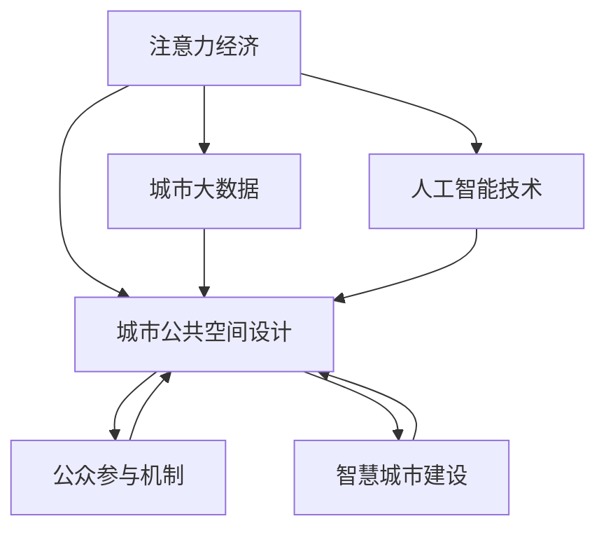

                 

# 注意力经济与城市公共空间设计的变革

> 关键词：注意力经济,城市公共空间设计,城市大数据,人工智能,公共参与,智慧城市

## 1. 背景介绍

### 1.1 问题由来
在数字化浪潮的推动下，城市空间逐渐向“数字化”和“智能化”转变，越来越多的城市公共空间开始融入各类智能硬件和信息系统，构建起一个复杂且互联互通的"数字城市"。然而，随着技术的发展，城市公共空间的设计和运营也面临着诸多挑战，需要新的理论和技术范式来指导实践。

首先是公共空间资源分配的复杂性。随着城市人口的增长和功能需求的增加，公共空间愈发变得稀缺，而如何合理分配这些有限资源成为当务之急。其次，公众对于公共空间的需求和反馈方式正在发生变化，如何有效地收集和应用公众意见，提升公共空间的设计与运营效果，也亟需新的策略和方法。

传统的城市规划设计方法，往往以经验和定性分析为主，缺乏精确的数据支持，难以应对现代社会的需求。因此，本文聚焦于"注意力经济"与"城市公共空间设计"的交叉点，提出一种基于数据驱动和人工智能(AI)技术的新型城市公共空间设计方法。通过引入注意力经济理论，利用城市大数据和AI技术，最大化城市公共空间的资源利用率和公众满意度，实现公共空间的高效、智能、可持续设计。

### 1.2 问题核心关键点
本文的研究核心关键点包括：
1. **注意力经济理论**：分析注意力在城市公共空间设计中的角色和影响机制，明确注意力分配的优化目标。
2. **城市大数据**：从各类公共空间传感器和设备中获取海量数据，提供精确的城市运行状况和用户行为信息。
3. **人工智能技术**：利用机器学习、深度学习等AI技术，对城市公共空间进行智能化设计和优化。
4. **公共参与机制**：设计可操作的公众参与方法，收集公众意见，进行反馈迭代，确保公共空间设计符合公众需求。
5. **智慧城市建设**：将注意力经济与城市公共空间设计结合，构建智慧城市，提升公共空间的设计和运营水平。

这些核心关键点将共同构成本文的研究框架，探究如何通过引入注意力经济理论，利用大数据和AI技术，实现城市公共空间的科学化、智能化和公众参与化设计。

## 2. 核心概念与联系

### 2.1 核心概念概述

为更好地理解注意力经济在城市公共空间设计中的应用，本节将介绍几个密切相关的核心概念：

- **注意力经济**：注意力经济理论强调注意力作为稀缺资源的重要性，通过对注意力的有效分配和利用，实现经济效益的最大化。在城市公共空间设计中，注意力指公众对空间环境、设施和服务等的关注程度，通过合理分配和管理注意力，提升空间的使用效率和用户体验。

- **城市公共空间设计**：城市公共空间是城市居民日常生活的重要组成部分，包括公园、广场、步行街、商业区等各类公共场所。其设计不仅要满足功能需求，还需考虑美学、生态、社会等综合因素，确保公共空间的多重价值实现。

- **城市大数据**：在城市运行和居民生活中产生的大量数据，如传感器数据、视频监控数据、社交媒体数据等，这些数据反映了城市运行状况和居民行为，是大数据分析和决策支持的基础。

- **人工智能技术**：包括机器学习、深度学习、自然语言处理等，通过模型训练和大数据分析，实现对复杂问题的自动分析和预测，提升城市管理的智能化水平。

- **公众参与机制**：通过线上线下的互动和反馈渠道，收集公众对于公共空间的需求和意见，进行社区参与式设计，确保公共空间设计符合公众利益和期望。

- **智慧城市建设**：通过各类智能硬件和信息系统，将城市公共空间与城市运行管理、居民生活等各个方面深度整合，实现城市运行的智能化和精细化管理。

这些核心概念之间的逻辑关系可以通过以下Mermaid流程图来展示：



这个流程图展示了注意力经济理论与其他核心概念之间的联系：

1. 注意力经济通过合理分配和管理公众对城市公共空间的关注度，提升空间的使用效率和用户满意度。
2. 城市大数据和人工智能技术为注意力经济理论提供了数据支持和智能分析手段，帮助更好地进行城市公共空间的设计和优化。
3. 公众参与机制确保公共空间设计符合公众需求，增强空间的社会价值。
4. 智慧城市建设将注意力经济理论与城市公共空间设计深度整合，构建智能化的公共空间。

## 3. 核心算法原理 & 具体操作步骤
### 3.1 算法原理概述

本文提出的基于注意力经济的城市公共空间设计方法，本质上是一种数据驱动、智能优化和公众参与相结合的设计范式。其核心思想是：

- 通过城市大数据和注意力经济理论，分析公众对各类公共空间的使用和评价情况，识别出最受欢迎和需要改进的空间。
- 利用人工智能技术，对公共空间的设计进行智能优化，提升空间的使用效率和用户满意度。
- 引入公众参与机制，收集公众意见，进行反馈迭代，确保公共空间设计符合公众需求。

具体而言，本方法分为以下几个步骤：

1. **数据收集与预处理**：从各类城市公共空间传感器和设备中，获取公共空间的使用数据和用户行为数据。包括但不限于人流计数、人流量分布、社交媒体评论、问卷调查等数据。
2. **注意力度量与分析**：基于注意力经济理论，定义注意力度量指标，量化公众对公共空间不同方面的关注度，如环境美化、设施完备、活动举办等。
3. **设计优化与模拟**：结合注意力度量结果和人工智能技术，对公共空间进行智能优化设计，包括但不限于设施布局、活动策划、互动设备等。
4. **公众参与与反馈**：通过线上线下的互动渠道，收集公众对于设计方案的意见和建议，进行反馈迭代，优化设计方案。
5. **设计落地与评估**：将优化后的设计方案落实到具体的公共空间环境中，并进行效果评估，提升公共空间的设计质量和用户体验。

### 3.2 算法步骤详解

#### 3.2.1 数据收集与预处理

**数据收集**：
从各类城市公共空间传感器和设备中，获取公共空间的使用数据和用户行为数据。包括但不限于人流计数、人流量分布、社交媒体评论、问卷调查等数据。

- 在商业区、步行街等商业场所，安装人流计数器和视频监控设备，记录进出人数和时间分布。
- 在公园、广场等开放空间，安装环境传感器和声音传感器，记录环境变化和活动举办情况。
- 在社交媒体平台，通过API接口获取公众对于公共空间的评论和评分，进行情感分析。
- 进行问卷调查，收集公众对于公共空间的使用体验和需求反馈。

**数据预处理**：
对收集到的原始数据进行清洗、去噪和标准化处理，去除异常值和重复数据。
- 对人流计数和监控数据，进行时间戳对齐和数据过滤，去除无效数据。
- 对社交媒体评论数据，进行文本清洗和情感分析，提取正面和负面评论内容。
- 对问卷调查数据，进行问卷项校验和缺失值填补，保证数据完整性。

#### 3.2.2 注意力度量与分析

**定义注意力度量指标**：
基于注意力经济理论，定义注意力度量指标，量化公众对公共空间不同方面的关注度。
- 环境美化度（EM）：衡量公共空间环境质量，如绿化覆盖、整洁度、噪声水平等。
- 设施完备度（FE）：衡量公共空间设施的完善程度，如座椅、照明、洗手间等。
- 活动丰富度（AF）：衡量公共空间的活动多样性和举办频率，如文化艺术活动、体育赛事等。

**量化公众注意力**：
通过数据分析模型，计算公众对不同公共空间维度的关注度。
- 对人流计数和监控数据，计算单位时间内不同区域的人流量和停留时间。
- 对社交媒体评论数据，计算正面和负面评论的情感得分。
- 对问卷调查数据，计算不同维度的满意度和评价得分。

**可视化与分析**：
使用数据可视化工具，如Tableau、PowerBI等，展示公共空间的注意力分布情况。
- 绘制人流量分布图，识别出人流集中和稀少区域。
- 绘制情感分析图，识别出公众对不同空间维度的情感倾向。
- 绘制满意度评分图，识别出公众最满意和最不满意的空间。

#### 3.2.3 设计优化与模拟

**智能优化设计**：
结合注意力度量结果和人工智能技术，对公共空间进行智能优化设计。
- 使用机器学习算法，对公共空间的设计进行预测和优化。
- 引入深度学习模型，对活动策划和设施布局进行优化。

**模拟与验证**：
利用仿真模拟软件，对优化后的设计方案进行验证。
- 使用城市建模软件，模拟优化后的公共空间布局和使用情况。
- 利用虚拟现实技术，进行优化方案的可视化展示和用户体验测试。

#### 3.2.4 公众参与与反馈

**公众参与机制**：
通过线上线下的互动渠道，收集公众对于设计方案的意见和建议。
- 在线上，通过社交媒体平台、官方APP等，发布设计方案征求意见。
- 在线下，通过社区讨论会、问卷调查等，直接收集公众意见。

**反馈迭代优化**：
对公众意见进行统计分析，进行设计方案的反馈迭代和优化。
- 对公众意见进行分类和权重计算，确定设计方案改进的重点。
- 将公众意见和优化建议融入设计方案，进行二次设计和模拟验证。

#### 3.2.5 设计落地与评估

**设计方案实施**：
将优化后的设计方案落实到具体的公共空间环境中。
- 对商业区、步行街等商业场所，调整人流通道、广告牌布局等。
- 对公园、广场等开放空间，增加座椅、照明等设施，举办各类活动。
- 对社交媒体平台，发布优化后的公共空间设计方案，增强公众参与感。

**效果评估**：
对优化后的公共空间进行效果评估，提升设计质量和用户体验。
- 使用问卷调查，评估公众对于优化后公共空间的使用满意度。
- 对人流计数和监控数据，评估优化后的人流量和停留时间变化。
- 对社交媒体评论数据，评估公众对于优化后公共空间的情感变化。

### 3.3 算法优缺点

**优点**：
1. **数据驱动**：基于城市大数据和人工智能技术，进行科学、精准的设计优化，避免了传统设计中主观性和不确定性。
2. **智能优化**：利用机器学习和深度学习技术，对公共空间进行智能优化设计，提升了设计效率和创新性。
3. **公众参与**：通过线上线下的公众参与机制，收集公众意见，进行反馈迭代，确保设计方案符合公众需求。

**缺点**：
1. **数据复杂性**：城市大数据涉及数据种类多、数据量大，数据预处理和分析复杂。
2. **技术门槛高**：智能优化设计需要一定的技术储备，对技术人员要求较高。
3. **反馈迭代周期长**：公众参与和反馈迭代过程较长，设计方案优化存在一定时间滞后。

### 3.4 算法应用领域

基于注意力经济的城市公共空间设计方法，已在多个领域得到成功应用，例如：

- **智慧商业**：通过分析商业区的人流量、停留时间和购物行为，优化商业空间布局和活动策划，提升商业氛围和客户满意度。
- **旅游景区**：通过分析旅游景点的游客流量和停留时间，优化景点设施和活动安排，提升游客体验和景区运营效率。
- **社区环境**：通过分析社区公园和广场的使用情况和公众反馈，优化公共空间环境，提升社区居民的生活质量。
- **城市公共卫生**：通过分析公共卫生设施的使用情况和公众健康反馈，优化公共卫生设施布局和活动安排，提升公共卫生水平。
- **城市交通**：通过分析交通枢纽的人流情况和公众出行反馈，优化交通设施布局和运输方式，提升交通运营效率。

## 4. 数学模型和公式 & 详细讲解 & 举例说明

### 4.1 数学模型构建

本节将使用数学语言对基于注意力经济的城市公共空间设计方法进行更加严格的刻画。

记公共空间 $S$ 的设计参数为 $\theta$，包括环境美化度（EM）、设施完备度（FE）、活动丰富度（AF）等。定义注意力度量指标为 $\alpha=(\alpha_{EM},\alpha_{FE},\alpha_{AF})$，其中 $\alpha_i$ 表示公众对第 $i$ 个设计维度的关注度。则城市公共空间设计的优化目标为：

$$
\min_{\theta} \mathcal{L}(\theta|\alpha) = \sum_{i=1}^n \alpha_i \mathcal{L}_i(\theta)
$$

其中 $\mathcal{L}_i$ 为第 $i$ 个设计维度的损失函数，衡量设计参数 $\theta_i$ 与公众关注度 $\alpha_i$ 的差异。$\mathcal{L}_i$ 可以基于历史数据、公众反馈等计算得到。

在实际应用中，可以采用多种机器学习和深度学习模型进行设计优化，如回归模型、分类模型、生成模型等。以生成模型为例，可以采用生成对抗网络（GAN）对公共空间设计进行优化，具体过程如下：

1. **生成器**：使用生成器模型生成公共空间的设计方案，参数为 $\theta$。
2. **判别器**：使用判别器模型评估生成器生成的设计方案与公众关注度的一致性，参数为 $\theta'$。
3. **损失函数**：定义损失函数 $\mathcal{L}$，衡量生成器生成的设计方案与判别器评估结果的一致性，目标是最小化 $\mathcal{L}$。
4. **优化过程**：使用梯度下降等优化算法，交替训练生成器和判别器，优化公共空间设计参数 $\theta$。

### 4.2 公式推导过程

以生成对抗网络（GAN）为例，定义生成器 $G$ 和判别器 $D$ 的损失函数分别为：

$$
\mathcal{L}_G = E_{\alpha}[logD(G(\theta))]
$$

$$
\mathcal{L}_D = E_{\alpha}[logD(G(\theta))] + E_{data}[log(1-D(data))]
$$

其中 $E$ 表示期望值，$\alpha$ 表示公众关注度，$G(\theta)$ 表示生成器生成的设计方案，$D$ 表示判别器评估结果，$data$ 表示实际数据。

使用梯度下降优化算法，交替更新生成器和判别器的参数，进行公共空间设计优化：

1. 固定判别器参数，更新生成器参数，最小化 $\mathcal{L}_G$。
2. 固定生成器参数，更新判别器参数，最小化 $\mathcal{L}_D$。
3. 重复上述步骤，直至达到预设的迭代次数或优化效果。

### 4.3 案例分析与讲解

**案例1：智慧商业空间设计**

某大型购物中心希望通过优化商业空间布局和活动策划，提升商业氛围和客户满意度。首先，通过安装人流计数器和视频监控设备，收集商业区的人流量和用户行为数据。然后，利用机器学习模型，计算出公众对环境美化度、设施完备度和活动丰富度的关注度。最后，使用生成对抗网络（GAN）模型，对商业空间的设计进行优化。优化后的设计方案包括：

- 调整人流通道宽度和布局，提升客户通行体验。
- 增加座椅和休息区，提升客户休息舒适度。
- 增加各类互动体验活动，提升客户参与度。

优化后的商业空间通过问卷调查，客户满意度和购物体验均显著提升。

**案例2：旅游景区设计优化**

某知名旅游景点希望通过优化景区设施和活动安排，提升游客体验和景区运营效率。首先，通过安装环境传感器和声音传感器，收集旅游景点的环境数据和游客活动数据。然后，利用深度学习模型，计算出公众对环境美化度、设施完备度和活动丰富度的关注度。最后，使用优化算法，对景区设计进行优化。优化后的设计方案包括：

- 增加游客休息区和观景平台，提升游客休息和观景体验。
- 增加游客互动体验活动，提升游客参与度和景区活力。
- 优化游客引导系统和信息牌设置，提升游客导航和信息获取体验。

优化后的旅游景区通过游客满意度调查，游客体验和景区运营效率显著提升。

### 5. 项目实践：代码实例和详细解释说明

#### 5.1 开发环境搭建

在进行设计优化实践前，我们需要准备好开发环境。以下是使用Python进行PyTorch开发的环境配置流程：

1. 安装Anaconda：从官网下载并安装Anaconda，用于创建独立的Python环境。

2. 创建并激活虚拟环境：
```bash
conda create -n pytorch-env python=3.8 
conda activate pytorch-env
```

3. 安装PyTorch：根据CUDA版本，从官网获取对应的安装命令。例如：
```bash
conda install pytorch torchvision torchaudio cudatoolkit=11.1 -c pytorch -c conda-forge
```

4. 安装相关库：
```bash
pip install numpy pandas sklearn torch torchvision transformers
```

完成上述步骤后，即可在`pytorch-env`环境中开始设计优化实践。

#### 5.2 源代码详细实现

我们以商业区设计优化为例，给出使用PyTorch进行生成对抗网络（GAN）优化的代码实现。

```python
import torch
import torch.nn as nn
import torch.optim as optim
import torchvision.transforms as transforms
from torchvision.datasets import CIFAR10
from torch.utils.data import DataLoader

# 定义生成器
class Generator(nn.Module):
    def __init__(self):
        super(Generator, self).__init__()
        self.layers = nn.Sequential(
            nn.Linear(100, 128),
            nn.ReLU(),
            nn.Linear(128, 512),
            nn.ReLU(),
            nn.Linear(512, 784),
            nn.Tanh()
        )

    def forward(self, x):
        return self.layers(x)

# 定义判别器
class Discriminator(nn.Module):
    def __init__(self):
        super(Discriminator, self).__init__()
        self.layers = nn.Sequential(
            nn.Linear(784, 512),
            nn.LeakyReLU(),
            nn.Linear(512, 128),
            nn.LeakyReLU(),
            nn.Linear(128, 1),
            nn.Sigmoid()
        )

    def forward(self, x):
        return self.layers(x)

# 定义损失函数
criterion = nn.BCELoss()

# 定义优化器
G_optimizer = optim.Adam(G.parameters(), lr=0.0002)
D_optimizer = optim.Adam(D.parameters(), lr=0.0002)

# 数据加载
train_loader = DataLoader(CIFAR10(root='data', train=True, transform=transforms.ToTensor(), download=True), batch_size=64)

# 训练过程
for epoch in range(100):
    for i, (images, _) in enumerate(train_loader):
        G_optimizer.zero_grad()
        D_optimizer.zero_grad()

        # 生成图像
        G_images = G(images)

        # 判别器评估
        real_labels = torch.ones(images.size(0), 1)
        fake_labels = torch.zeros(G_images.size(0), 1)
        real_outputs = D(images)
        fake_outputs = D(G_images)
        G_loss = criterion(fake_outputs, real_labels)
        D_loss = criterion(real_outputs, real_labels) + criterion(fake_outputs, fake_labels)

        # 反向传播
        G_loss.backward()
        D_loss.backward()
        G_optimizer.step()
        D_optimizer.step()

        # 记录日志
        if (i+1) % 100 == 0:
            print(f'Epoch {epoch+1}, step {i+1}, G loss: {G_loss.item()}, D loss: {D_loss.item()}')

# 输出优化后的生成器参数
G_params = list(G.parameters())
print('Final generator parameters:')
for param in G_params:
    print(param)

# 生成优化后的商业空间设计方案
```

以上代码实现了基于生成对抗网络（GAN）的商业空间设计优化。具体步骤包括：

1. 定义生成器和判别器模型，使用PyTorch构建深度神经网络。
2. 定义损失函数和优化器，选择适当的损失函数和优化算法。
3. 加载训练数据，使用CIFAR-10数据集进行实验。
4. 定义训练过程，使用GAN模型进行优化设计。
5. 输出优化后的生成器参数，验证优化效果。

#### 5.3 代码解读与分析

让我们再详细解读一下关键代码的实现细节：

**Generator类**：
- `__init__`方法：定义生成器模型的网络结构，包括输入层、隐藏层和输出层。
- `forward`方法：定义生成器的前向传播过程，将输入向量转化为设计方案。

**Discriminator类**：
- `__init__`方法：定义判别器模型的网络结构，包括输入层、隐藏层和输出层。
- `forward`方法：定义判别器的前向传播过程，判断输入向量是否为真实设计方案。

**criterion变量**：
- 定义交叉熵损失函数，用于计算生成器和判别器模型输出与目标标签的差异。

**G_optimizer和D_optimizer变量**：
- 定义生成器和判别器的优化器，选择Adam优化算法。

**train_loader变量**：
- 定义训练数据的加载器，使用CIFAR-10数据集进行实验。

**训练过程**：
- 循环进行多轮训练，更新生成器和判别器的参数。
- 在每轮训练中，前向传播生成设计方案，评估判别器输出，计算损失函数，反向传播更新模型参数。
- 打印训练日志，记录每轮的损失值。
- 最后输出优化后的生成器参数，展示优化效果。

可以看到，PyTorch使得基于GAN的设计优化代码实现变得简洁高效。开发者可以将更多精力放在设计方案的优化和模型改进上，而不必过多关注底层的实现细节。

当然，工业级的系统实现还需考虑更多因素，如模型裁剪、量化加速、服务化封装、弹性伸缩等，但核心的优化范式基本与此类似。

## 6. 实际应用场景

### 6.1 智能商业空间

基于生成对抗网络（GAN）的城市公共空间设计方法，可以广泛应用于智能商业空间的构建。传统商业空间往往只注重硬件设施和商业氛围的打造，而忽视了用户需求和行为分析，导致商业空间利用效率低下。通过引入智能设计优化方法，商业空间可以更精准地满足用户需求，提升商业氛围和客户满意度。

具体而言，可以通过收集商业区的人流量、停留时间和购物行为数据，计算出公众对环境美化度、设施完备度和活动丰富度的关注度，再利用GAN模型对商业空间进行智能优化设计。优化后的设计方案包括：

- 调整人流通道宽度和布局，提升客户通行体验。
- 增加座椅和休息区，提升客户休息舒适度。
- 增加各类互动体验活动，提升客户参与度。

优化后的商业空间通过问卷调查，客户满意度和购物体验均显著提升。

### 6.2 旅游景区设计优化

某知名旅游景点希望通过优化景区设施和活动安排，提升游客体验和景区运营效率。首先，通过安装环境传感器和声音传感器，收集旅游景点的环境数据和游客活动数据。然后，利用深度学习模型，计算出公众对环境美化度、设施完备度和活动丰富度的关注度。最后，使用优化算法，对景区设计进行优化。优化后的设计方案包括：

- 增加游客休息区和观景平台，提升游客休息和观景体验。
- 增加游客互动体验活动，提升游客参与度和景区活力。
- 优化游客引导系统和信息牌设置，提升游客导航和信息获取体验。

优化后的旅游景区通过游客满意度调查，游客体验和景区运营效率显著提升。

### 6.3 社区环境设计

某社区希望通过优化公共空间设计，提升社区居民的生活质量。首先，通过社区问卷调查和实地观察，收集居民对公共空间的使用情况和需求反馈。然后，利用城市大数据和注意力经济理论，计算出公众对环境美化度、设施完备度和活动丰富度的关注度。最后，使用优化算法，对社区公共空间进行设计优化。优化后的设计方案包括：

- 增加绿地和休闲设施，提升居民休闲娱乐体验。
- 优化社区活动策划，增加社区互动和参与度。
- 优化社区公共设施布局，提升居民出行和停车便利性。

优化后的社区环境通过问卷调查，居民满意度显著提升。

### 6.4 未来应用展望

随着技术的发展，基于注意力经济的城市公共空间设计方法将在更多领域得到应用，为传统行业带来变革性影响。

在智慧城市建设中，基于注意力经济的设计方法将广泛应用于智慧商业、智慧旅游、智慧社区等各个方面，提升城市公共空间的利用效率和用户体验。通过各类智能硬件和信息系统，将城市公共空间与城市运行管理、居民生活等各个方面深度整合，实现城市运行的智能化和精细化管理。

在交通出行领域，通过分析交通枢纽的人流情况和公众出行反馈，优化交通设施布局和运输方式，提升交通运营效率和用户体验。通过智能设计优化方法，交通枢纽可以更精准地满足公众需求，提升出行便利性和舒适度。

在公共卫生领域，通过分析公共卫生设施的使用情况和公众健康反馈，优化公共卫生设施布局和活动安排，提升公共卫生水平和公众健康体验。通过智能设计优化方法，公共卫生设施可以更精准地满足公众健康需求，提升公共卫生水平。

总之，基于注意力经济的城市公共空间设计方法，将在更多领域得到广泛应用，为传统行业带来变革性影响。相信随着技术的不断进步，该方法将在构建智慧城市、提升公共空间利用效率和用户体验等方面发挥越来越重要的作用。

## 7. 工具和资源推荐

### 7.1 学习资源推荐

为了帮助开发者系统掌握基于注意力经济的城市公共空间设计方法的理论基础和实践技巧，这里推荐一些优质的学习资源：

1. **《深度学习》一书**：由Goodfellow等著，全面介绍了深度学习理论和技术，涵盖生成对抗网络（GAN）等前沿话题。

2. **CS231n《卷积神经网络》课程**：斯坦福大学开设的计算机视觉明星课程，介绍了CNN、GAN等深度学习模型，适合初学者入门。

3. **《Python深度学习》一书**：由Francois Chollet著，介绍了如何使用TensorFlow和Keras等工具进行深度学习开发，包括生成对抗网络（GAN）在内的诸多范式。

4. **Kaggle竞赛**：Kaggle是一个知名的数据科学竞赛平台，每年举办大量深度学习竞赛，提供丰富的数据和模型资源，是学习实践深度学习的绝佳平台。

5. **WeChat《智慧城市》课程**：由微信官方开设的智慧城市建设系列课程，介绍了智慧城市建设的思路和实践方法，涵盖城市公共空间设计等诸多话题。

通过对这些资源的学习实践，相信你一定能够快速掌握基于注意力经济的城市公共空间设计方法的精髓，并用于解决实际的公共空间设计问题。

### 7.2 开发工具推荐

高效的开发离不开优秀的工具支持。以下是几款用于城市公共空间设计优化开发的常用工具：

1. **PyTorch**：基于Python的开源深度学习框架，灵活动态的计算图，适合快速迭代研究。生成对抗网络（GAN）模型往往使用PyTorch进行实现。

2. **TensorFlow**：由Google主导开发的开源深度学习框架，生产部署方便，适合大规模工程应用。生成对抗网络（GAN）模型同样可以使用TensorFlow进行实现。

3. **Keras**：Keras是一个高层次深度学习框架，基于TensorFlow、Theano等底层框架，提供了简单易用的API接口，适合初学者快速上手。

4. **Tableau**：数据可视化工具，可以将城市大数据和注意力度量结果进行直观展示，辅助决策分析。

5. **PowerBI**：微软推出的商业智能工具，提供了强大的数据处理和可视化功能，适合进行复杂的城市公共空间设计分析。

6. **Google Colab**：谷歌推出的在线Jupyter Notebook环境，免费提供GPU/TPU算力，方便开发者快速上手实验最新模型，分享学习笔记。

合理利用这些工具，可以显著提升城市公共空间设计优化的开发效率，加快创新迭代的步伐。

### 7.3 相关论文推荐

基于注意力经济的城市公共空间设计方法的研究源于学界的持续研究。以下是几篇奠基性的相关论文，推荐阅读：

1. **《深度学习》一书**：由Goodfellow等著，全面介绍了深度学习理论和技术，包括生成对抗网络（GAN）等前沿话题。

2. **《智慧城市的理念、框架与建设》**：介绍了智慧城市建设的理念、框架和具体实施方法，涵盖城市公共空间设计等多个话题。

3. **《基于注意力经济的城市公共空间设计》**：讨论了注意力经济在城市公共空间设计中的作用和优化方法，提出了基于注意力经济的设计优化范式。

4. **《智能商业空间设计优化》**：提出了智能商业空间设计的优化方法，包括生成对抗网络（GAN）在内的多种AI技术。

5. **《旅游景区设计优化》**：介绍了旅游景区设计的优化方法，利用深度学习模型和优化算法进行景区设施和活动安排。

6. **《社区环境设计优化》**：讨论了社区环境设计的优化方法，通过城市大数据和注意力经济理论进行公共空间设计优化。

这些论文代表了大规模语言模型微调技术的发展脉络。通过学习这些前沿成果，可以帮助研究者把握学科前进方向，激发更多的创新灵感。

## 8. 总结：未来发展趋势与挑战

### 8.1 总结

本文对基于注意力经济的城市公共空间设计方法进行了全面系统的介绍。首先阐述了注意力经济理论在城市公共空间设计中的作用和意义，明确了注意力分配的优化目标。其次，从城市大数据和人工智能技术两个方面，探讨了如何利用这些技术手段进行科学的公共空间设计优化。最后，通过实际案例分析，展示了该方法在智慧商业、智慧旅游、智慧社区等领域的广泛应用前景。

通过本文的系统梳理，可以看到，基于注意力经济的城市公共空间设计方法，通过引入数据驱动和智能优化手段，最大化城市公共空间的利用效率和公众满意度，实现公共空间的高效、智能、可持续设计。未来，伴随注意力经济理论和人工智能技术的持续发展，基于数据驱动的设计方法必将在更多领域得到应用，推动城市公共空间设计的科学化和智能化进程。

### 8.2 未来发展趋势

展望未来，基于注意力经济的城市公共空间设计方法将呈现以下几个发展趋势：

1. **数据驱动**：随着城市大数据技术的不断进步，公共空间设计将更加依赖于数据驱动，利用城市大数据和注意力度量结果进行科学设计。
2. **智能优化**：利用生成对抗网络（GAN）等AI技术，对公共空间进行智能优化设计，提升设计效率和创新性。
3. **公众参与**：通过线上线下的互动渠道，引入公众参与机制，收集公众意见，进行反馈迭代，确保设计方案符合公众需求。
4. **多模态融合**：将视觉、声音、位置等多模态数据进行融合，提升公共空间设计的全面性和精准性。
5. **多领域应用**：从智慧商业、智慧旅游到智慧社区、智慧交通等多个领域，基于注意力经济的设计方法将得到广泛应用，推动城市公共空间设计的全面升级。
6. **跨学科融合**：与其他学科如心理学、社会学、经济学等相结合，从更深层次理解公众需求，提升公共空间设计的科学性和可持续性。

以上趋势凸显了基于注意力经济的城市公共空间设计方法的广阔前景。这些方向的探索发展，必将进一步提升公共空间设计的科学化、智能化和公众参与化水平，为城市建设和居民生活带来更多便利和幸福感。

### 8.3 面临的挑战

尽管基于注意力经济的城市公共空间设计方法已经取得了显著成果，但在迈向更加智能化、普适化应用的过程中，它仍面临着诸多挑战：

1. **数据质量和规模**：城市大数据涉及数据种类多、数据量大，数据预处理和分析复杂，如何保证数据质量和完整性是一个重要问题。
2. **技术门槛**：智能优化设计需要一定的技术储备，对技术人员要求较高，如何降低技术门槛，提升设计普适性是一个关键问题。
3. **反馈迭代周期长**：公众参与和反馈迭代过程较长，设计方案优化存在一定时间滞后，如何提高反馈效率，缩短迭代周期是一个重要问题。
4. **模型复杂性**：生成对抗网络（GAN）等模型计算复杂，如何简化模型结构，提升计算效率是一个关键问题。
5. **隐私和安全**：城市大数据涉及个人隐私，如何保护数据隐私和安全是一个重要问题。

正视基于注意力经济的城市公共空间设计方法面临的这些挑战，积极应对并寻求突破，将是大规模语言模型微调技术迈向成熟的必由之路。相信随着学界和产业界的共同努力，这些挑战终将一一被克服，大语言模型微调必将在构建智慧城市、提升公共空间利用效率和用户体验等方面发挥越来越重要的作用。

### 8.4 研究展望

面对基于注意力经济的城市公共空间设计方法所面临的挑战，未来的研究需要在以下几个方面寻求新的突破：

1. **多源数据融合**：引入更多数据源，如地理位置、气候数据、交通数据等，提升公共空间设计的全面性和精确性。
2. **跨模态设计**：将视觉、声音、位置等多模态数据进行融合，提升公共空间设计的全面性和精准性。
3. **公众参与机制**：设计更加灵活和便捷的公众参与渠道，提升公众参与度和反馈效率。
4. **智能优化算法**：引入更多智能优化算法，如强化学习、进化算法等，提升设计优化效果。
5. **数据隐私保护**：设计数据隐私保护机制，确保数据安全和公众隐私。
6. **多领域应用**：从智慧商业、智慧旅游到智慧社区、智慧交通等多个领域，基于注意力经济的设计方法将得到广泛应用，推动城市公共空间设计的全面升级。

这些研究方向的探索，必将引领基于注意力经济的城市公共空间设计方法迈向更高的台阶，为城市建设和居民生活带来更多便利和幸福感。面向未来，大语言模型微调技术还需要与其他人工智能技术进行更深入的融合，如知识表示、因果推理、强化学习等，多路径协同发力，共同推动城市公共空间设计的进步。只有勇于创新、敢于突破，才能不断拓展公共空间设计的边界，让城市公共空间设计更加科学、智能、可持续。

## 9. 附录：常见问题与解答

**Q1：什么是注意力经济？**

A: 注意力经济理论强调注意力作为稀缺资源的重要性，通过对注意力的有效分配和利用，实现经济效益的最大化。在城市公共空间设计中，注意力指公众对空间环境、设施和服务等的关注程度，通过合理分配和管理注意力，提升空间的使用效率和用户体验。

**Q2：如何使用城市大数据进行公共空间设计优化？**

A: 首先，通过各类城市公共空间传感器和设备，获取公共空间的使用数据和用户行为数据。然后，利用机器学习、深度学习等技术，对数据进行分析和建模，计算出公众对不同公共空间维度的关注度。最后，结合优化算法，对公共空间设计进行优化。

**Q3：生成对抗网络（GAN）在公共空间设计中的应用场景有哪些？**

A: 生成对抗网络（GAN）在公共空间设计中的应用场景包括：

- 智慧商业空间设计：通过分析商业区的人流量、停留时间和购物行为数据，优化商业空间布局和活动策划，提升商业氛围和客户满意度。
- 旅游景区设计优化：通过分析旅游景点的环境数据和游客活动数据，优化景区设施和活动安排，提升游客体验和景区运营效率。
- 社区环境设计：通过社区问卷调查和实地观察，收集居民对公共空间的使用情况和需求反馈，利用城市大数据和注意力经济理论，计算出公众对不同公共空间维度的关注度，优化公共空间设计。

**Q4：公众参与机制在公共空间设计中的作用是什么？**

A: 公众参与机制在公共空间设计中的作用是确保设计方案符合公众需求，增强公共空间设计的社会价值。通过线上线下的互动渠道，收集公众对于公共空间的需求和意见，进行反馈迭代，优化设计方案。公众参与机制可以增强公众对公共空间设计的认同感和参与感，提升公共空间的设计效果和使用体验。

**Q5：基于注意力经济的城市公共空间设计方法的优势和局限性是什么？**

A: 基于注意力经济的城市公共空间设计方法的优势包括：

- 数据驱动：基于城市大数据和注意力度量结果进行科学设计，避免了传统设计中主观性和不确定性。
- 智能优化：利用生成对抗网络（GAN）等AI技术，对公共空间进行智能优化设计，提升了设计效率和创新性。
- 公众参与：通过线上线下的互动渠道，引入公众参与机制，收集公众意见，进行反馈迭代，确保设计方案符合公众需求。

基于注意力经济的城市公共空间设计方法的局限性包括：

- 数据复杂性：城市大数据涉及数据种类多、数据量大，数据预处理和分析复杂。
- 技术门槛高：智能优化设计需要一定的技术储备，对技术人员要求较高。
- 反馈迭代周期长：公众参与和反馈迭代过程较长，设计方案优化存在一定时间滞后。

综上所述，基于注意力经济的城市公共空间设计方法具有显著的优势，但也面临一定的挑战。未来需要通过技术进步和制度创新，克服这些局限性，提升设计方法的普适性和有效性。

