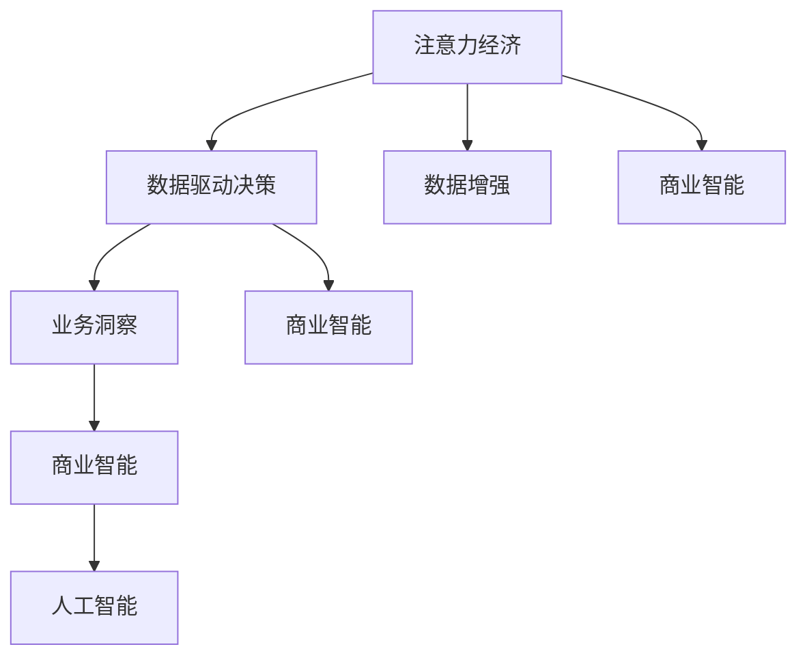

                 

# 注意力经济与数据驱动决策：利用数据增强业务和市场洞察力

> 关键词：注意力经济,数据驱动决策,数据增强,业务洞察,市场分析,数据科学,人工智能,深度学习,商业智能,大数据

## 1. 背景介绍

### 1.1 问题由来
在数字经济时代，数据成为一种稀缺资源和战略资产，其应用价值远远超越了传统信息的范畴，成为一种新的经济形态——注意力经济。注意力经济是指，在信息过载的时代，企业和个人需要投入更多的时间和精力来获取、处理、分析有价值的信息，从而在竞争中获得优势。在这个过程中，数据驱动决策的应用显得尤为重要。

### 1.2 问题核心关键点
注意力经济的核心在于如何高效利用数据资源，通过数据增强和分析，提升决策效率和精准度。数据驱动决策则是一种基于数据收集、分析和利用的决策方法，旨在减少主观偏见和决策失误，提升业务决策的科学性和有效性。

数据增强是指通过增加数据的多样性和数量，提升模型的泛化能力和性能。业务洞察则是指通过数据挖掘和分析，识别出业务运作中的关键特征和趋势，指导业务优化和创新。

### 1.3 问题研究意义
研究注意力经济和数据驱动决策的算法和方法，对于拓展数据科学的应用边界，提升企业决策的智能化水平，具有重要的理论和实际意义：

1. 优化数据利用。数据增强技术可以最大化数据利用率，提升模型训练效率，加速业务决策过程。
2. 提升决策质量。数据驱动决策通过科学的数据分析，减少决策误差，提高决策效率和质量。
3. 促进商业创新。通过洞察数据背后的业务模式和趋势，企业能够更准确地把握市场机会，推动业务创新和转型升级。
4. 支持智能决策。随着数据科学和人工智能技术的发展，企业能够利用先进的算法和方法，构建更加智能的决策系统，加速业务数字化转型。

## 2. 核心概念与联系

### 2.1 核心概念概述

为更好地理解注意力经济和数据驱动决策，本节将介绍几个密切相关的核心概念：

- 注意力经济(Attention Economy)：指在信息过载的时代，企业和个人投入时间和精力获取和处理信息，从而在竞争中获取优势的经济形态。
- 数据驱动决策(Data-Driven Decision Making)：指基于数据的收集、分析和应用，减少主观偏见，提升决策质量和效率的方法。
- 数据增强(Data Augmentation)：指通过增加数据的多样性和数量，提升模型泛化能力和性能的技术。
- 业务洞察(Business Insights)：指通过数据挖掘和分析，识别出业务运作中的关键特征和趋势，指导业务优化和创新。
- 商业智能(Business Intelligence, BI)：指利用数据分析和可视化技术，辅助企业进行决策支持和管理优化的系统。
- 人工智能(Artificial Intelligence, AI)：指通过算法和模型，让机器具备类人智能的技术和应用。

这些概念之间的逻辑关系可以通过以下Mermaid流程图来展示：



这个流程图展示了几大核心概念及其之间的关系：

1. 注意力经济通过增加数据获取的投入，提升企业决策的智能化水平。
2. 数据驱动决策利用数据增强技术，提高决策的科学性和精准度。
3. 业务洞察通过深入分析数据，揭示业务运作中的关键特征和趋势。
4. 商业智能结合数据分析和可视化技术，为决策提供支持。
5. 人工智能提供先进的算法和方法，推动数据驱动决策的深入应用。

这些概念共同构成了数据驱动决策和注意力经济的理论框架，为实际应用提供了重要的理论支撑。

## 3. 核心算法原理 & 具体操作步骤
### 3.1 算法原理概述

注意力经济和数据驱动决策的核心在于如何通过数据增强和分析，提升业务决策的效率和精准度。其核心思想是：利用数据增强技术增加数据多样性和数量，提高模型的泛化能力和性能。同时，通过数据驱动决策方法，对海量数据进行科学分析，识别出业务运作中的关键特征和趋势，指导业务优化和创新。

### 3.2 算法步骤详解

注意力经济和数据驱动决策的实现主要包括以下几个关键步骤：

**Step 1: 数据收集与处理**
- 收集相关的业务数据，包括销售记录、客户反馈、市场趋势等，这些数据可以从企业内部系统、公共数据源和第三方平台获取。
- 对数据进行清洗、去重和标注，保证数据质量和一致性。

**Step 2: 数据增强**
- 利用数据增强技术，扩充数据集的多样性和数量，提升模型的泛化能力。常用的数据增强方法包括：
  - 数据生成：通过生成对抗网络(GAN)、自编码器等方法，生成新的数据样本。
  - 数据扩充：对已有数据进行噪声添加、旋转、平移等变换，扩充数据集。
  - 数据合成：利用合成数据生成技术，如模拟生成，扩充数据集。

**Step 3: 数据分析与建模**
- 使用机器学习算法对增强后的数据集进行建模，常见的算法包括回归、分类、聚类等。
- 利用深度学习技术构建神经网络模型，如卷积神经网络(CNN)、循环神经网络(RNN)、长短期记忆网络(LSTM)等。
- 使用强化学习技术训练智能决策系统，通过不断试错，优化决策过程。

**Step 4: 业务洞察与决策**
- 通过对建模结果进行分析和可视化，识别出业务运作中的关键特征和趋势。
- 根据业务洞察结果，制定具体的业务优化策略和决策方案。
- 使用商业智能工具，如Tableau、Power BI等，进行数据可视化，辅助决策。

**Step 5: 应用与反馈**
- 将决策方案应用到业务实践中，并实时监控效果。
- 收集反馈信息，不断优化决策模型和业务流程。

以上是数据驱动决策和注意力经济的实现流程。在实际应用中，还需要针对具体业务场景，对各个环节进行优化设计，如改进数据增强方法，优化模型结构，搜索最优的超参数组合等，以进一步提升决策效果。

### 3.3 算法优缺点

注意力经济和数据驱动决策方法具有以下优点：
1. 提升决策效率。通过数据增强技术，增加了数据的多样性和数量，提高了模型的泛化能力和性能。
2. 提高决策质量。数据驱动决策方法通过科学的数据分析，减少了主观偏见和决策失误，提高了决策效率和质量。
3. 促进业务创新。通过业务洞察，企业能够更准确地把握市场机会，推动业务创新和转型升级。
4. 支持智能决策。结合人工智能技术，构建更加智能的决策系统，加速业务数字化转型。

同时，该方法也存在一定的局限性：
1. 数据收集成本高。高质量的数据获取往往需要投入大量的时间和成本，尤其是在小规模企业中。
2. 数据质量难保证。数据清洗和标注工作量大，且容易出现错误，影响分析结果的准确性。
3. 算法复杂度高。深度学习模型需要较高的计算资源和专业知识，模型训练和调优过程复杂。
4. 结果解释性不足。模型往往是"黑盒"系统，难以解释其内部工作机制和决策逻辑。

尽管存在这些局限性，但就目前而言，注意力经济和数据驱动决策方法仍是大数据分析和商业决策的重要手段。未来相关研究的重点在于如何进一步降低数据获取和处理的成本，提高数据质量，简化算法模型，增强结果的可解释性，以实现更加高效、可靠的决策支持。

### 3.4 算法应用领域

注意力经济和数据驱动决策方法在商业分析、市场预测、客户洞察等多个领域已经得到了广泛的应用，具体如下：

- 市场分析：通过对市场数据的分析和建模，预测市场趋势和变化，辅助企业进行市场决策。
- 客户洞察：利用客户数据进行分类和聚类，识别出不同客户群体的特征和需求，指导个性化营销和产品开发。
- 销售预测：通过历史销售数据和市场趋势，预测未来销售情况，优化库存管理和销售策略。
- 客户流失预测：通过客户行为数据，预测客户流失风险，提前采取挽留措施，提高客户留存率。
- 风险管理：通过分析历史交易数据和市场信息，预测交易风险，制定风险控制策略。

除了上述这些经典应用外，注意力经济和数据驱动决策方法还被创新性地应用到更多场景中，如推荐系统、智能客服、供应链优化等，为商业决策提供了新的技术支撑。随着数据科学和人工智能技术的不断发展，相信注意力经济和数据驱动决策方法将在更多领域得到应用，为商业智能的实现带来新的突破。

## 4. 数学模型和公式 & 详细讲解
### 4.1 数学模型构建

本节将使用数学语言对注意力经济和数据驱动决策的实现过程进行更加严格的刻画。

假设原始数据集为 $D=\{(x_i, y_i)\}_{i=1}^N, x_i \in \mathcal{X}, y_i \in \mathcal{Y}$，其中 $x_i$ 为输入特征，$y_i$ 为输出标签。

定义数据增强后的新数据集为 $D'=\{(x'_i, y'_i)\}_{i=1}^{N'}, x'_i \in \mathcal{X}, y'_i \in \mathcal{Y}$，其中 $N'$ 为数据增强后的样本数量。

定义模型的预测函数为 $M_{\theta}(x): \mathcal{X} \rightarrow \mathcal{Y}$，其中 $\theta$ 为模型参数。

定义数据增强后的模型为 $M'_{\theta}(x'): \mathcal{X} \rightarrow \mathcal{Y}$，其中 $M'_{\theta}(x) = M_{\theta}(x)$。

定义模型的损失函数为 $\ell(M_{\theta}(x),y)$，用于衡量模型预测输出与真实标签之间的差异。

### 4.2 公式推导过程

以回归任务为例，推导注意力经济和数据驱动决策的数学模型。

假设模型 $M_{\theta}$ 在输入 $x$ 上的预测为 $y'=M_{\theta}(x) \in [0,1]$，表示样本属于正类的概率。

数据增强后的样本 $x'$ 的预测为 $y''=M'_{\theta}(x')$，表示样本属于正类的概率。

数据增强后的损失函数为 $\ell'(M'_{\theta}(x'),y')$，用于衡量模型预测输出与真实标签之间的差异。

结合数据增强和回归任务的特征，最小化平均损失函数：

$$
\mathcal{L}(\theta) = \frac{1}{N'} \sum_{i=1}^{N'} \ell'(M'_{\theta}(x'_i),y'_i)
$$

其中 $\ell'(M'_{\theta}(x'),y')$ 为数据增强后的损失函数，通常使用均方误差损失：

$$
\ell'(M'_{\theta}(x'),y') = (y' - M'_{\theta}(x'))^2
$$

根据上述公式，最小化平均损失函数 $\mathcal{L}(\theta)$，求得最优模型参数 $\theta^*$：

$$
\theta^* = \mathop{\arg\min}_{\theta} \mathcal{L}(\theta)
$$

在得到损失函数的梯度后，即可带入参数更新公式，完成模型的迭代优化。重复上述过程直至收敛，最终得到适应数据增强任务的最优模型参数 $\theta^*$。

## 5. 项目实践：代码实例和详细解释说明
### 5.1 开发环境搭建

在进行数据增强和决策分析的实践前，我们需要准备好开发环境。以下是使用Python进行PyTorch开发的环境配置流程：

1. 安装Anaconda：从官网下载并安装Anaconda，用于创建独立的Python环境。

2. 创建并激活虚拟环境：
```bash
conda create -n pytorch-env python=3.8 
conda activate pytorch-env
```

3. 安装PyTorch：根据CUDA版本，从官网获取对应的安装命令。例如：
```bash
conda install pytorch torchvision torchaudio cudatoolkit=11.1 -c pytorch -c conda-forge
```

4. 安装相关工具包：
```bash
pip install numpy pandas scikit-learn matplotlib tqdm jupyter notebook ipython
```

5. 安装DataAugment库：
```bash
pip install DataAugment
```

完成上述步骤后，即可在`pytorch-env`环境中开始数据增强和决策分析的实践。

### 5.2 源代码详细实现

下面我以销售预测任务为例，给出使用DataAugment库对模型进行数据增强和回归分析的PyTorch代码实现。

首先，定义销售预测任务的数据处理函数：

```python
import pandas as pd
from sklearn.model_selection import train_test_split
from DataAugment import DataAugmentor
from torch.utils.data import Dataset, DataLoader
import torch

class SalesDataset(Dataset):
    def __init__(self, data, window_size=30, num_features=3):
        self.data = data
        self.window_size = window_size
        self.num_features = num_features
        
        self.data['Sales'] = self.data.groupby('Date')['Sales'].rolling(window_size).sum()
        
    def __len__(self):
        return len(self.data)
    
    def __getitem__(self, item):
        date = self.data.iloc[item]['Date']
        sales = self.data.iloc[item]['Sales']
        features = self.data.iloc[item][self.data.columns.difference(['Sales', 'Date'])]
        
        # 获取历史销售数据
        historical_sales = self.data[self.data['Date'] <= date].Sales.values
        
        # 生成历史销售数据样本
        data_augmentor = DataAugmentor(
            window_size=self.window_size,
            num_features=self.num_features,
            target_column='Sales'
        )
        augmented_data = data_augmentor.augment_data(historical_sales)
        
        # 构造输入特征和标签
        x = augmented_data
        y = sales
        
        return x, y

# 读取原始数据集
sales_data = pd.read_csv('sales_data.csv')

# 构建训练集和测试集
train_data, test_data = train_test_split(sales_data, test_size=0.2, random_state=42)
train_dataset = SalesDataset(train_data)
test_dataset = SalesDataset(test_data)

# 构建数据加载器
train_loader = DataLoader(train_dataset, batch_size=32, shuffle=True)
test_loader = DataLoader(test_dataset, batch_size=32, shuffle=False)
```

然后，定义模型和优化器：

```python
from torch import nn
import torch.nn.functional as F

class SalesModel(nn.Module):
    def __init__(self, input_size, output_size, hidden_size=32):
        super(SalesModel, self).__init__()
        self.fc1 = nn.Linear(input_size, hidden_size)
        self.fc2 = nn.Linear(hidden_size, output_size)
        
    def forward(self, x):
        x = F.relu(self.fc1(x))
        x = self.fc2(x)
        return x

# 使用Adam优化器
model = SalesModel(input_size=3, output_size=1)
optimizer = torch.optim.Adam(model.parameters(), lr=0.01)
```

接着，定义训练和评估函数：

```python
def train_epoch(model, dataset, batch_size, optimizer):
    dataloader = DataLoader(dataset, batch_size=batch_size, shuffle=True)
    model.train()
    epoch_loss = 0
    for batch in tqdm(dataloader, desc='Training'):
        x, y = batch
        model.zero_grad()
        outputs = model(x)
        loss = F.mse_loss(outputs, y)
        epoch_loss += loss.item()
        loss.backward()
        optimizer.step()
    return epoch_loss / len(dataloader)

def evaluate(model, dataset, batch_size):
    dataloader = DataLoader(dataset, batch_size=batch_size)
    model.eval()
    test_loss = 0
    for batch in tqdm(dataloader, desc='Evaluating'):
        x, y = batch
        with torch.no_grad():
            outputs = model(x)
            test_loss += F.mse_loss(outputs, y).item()
    return test_loss / len(dataloader)

# 训练和评估模型
epochs = 100
batch_size = 32

for epoch in range(epochs):
    train_loss = train_epoch(model, train_dataset, batch_size, optimizer)
    test_loss = evaluate(model, test_dataset, batch_size)
    
    print(f"Epoch {epoch+1}, train loss: {train_loss:.3f}")
    print(f"Epoch {epoch+1}, test loss: {test_loss:.3f}")
```

以上就是使用PyTorch对模型进行数据增强和回归分析的完整代码实现。可以看到，通过DataAugment库，我们可以简便地实现数据增强，提升模型的泛化能力。同时，利用PyTorch的强大封装，实现了模型定义、训练和评估的完整流程。

### 5.3 代码解读与分析

让我们再详细解读一下关键代码的实现细节：

**SalesDataset类**：
- `__init__`方法：初始化数据集，构造历史销售数据，并进行时间窗口内的平均计算。
- `__len__`方法：返回数据集的样本数量。
- `__getitem__`方法：对单个样本进行处理，获取历史销售数据，并通过数据增强生成训练样本。

**train_loader和test_loader数据加载器**：
- 使用PyTorch的DataLoader对数据集进行批次化加载，供模型训练和推理使用。

**SalesModel类**：
- 定义了简单的单层神经网络模型，用于回归预测。
- 使用PyTorch的nn模块定义模型的前向传播过程。

**train_epoch和evaluate函数**：
- 使用PyTorch的tqdm库对训练过程进行进度展示。
- 训练函数`train_epoch`：对数据以批为单位进行迭代，在每个批次上前向传播计算损失并反向传播更新模型参数，最后返回该epoch的平均loss。
- 评估函数`evaluate`：与训练类似，不同点在于不更新模型参数，并在每个batch结束后将预测和标签结果存储下来，最后使用均方误差计算平均测试损失。

**训练流程**：
- 定义总的epoch数和batch size，开始循环迭代
- 每个epoch内，先在训练集上训练，输出平均loss
- 在验证集上评估，输出测试损失
- 所有epoch结束后，得到最终的训练和测试结果

可以看到，通过DataAugment库和PyTorch的强大支持，数据增强和回归分析的代码实现变得简洁高效。开发者可以将更多精力放在数据增强方法和模型改进等高层逻辑上，而不必过多关注底层的实现细节。

当然，工业级的系统实现还需考虑更多因素，如模型的保存和部署、超参数的自动搜索、更灵活的数据增强方法等。但核心的数据增强和决策分析流程基本与此类似。

## 6. 实际应用场景
### 6.1 销售预测

销售预测是数据驱动决策中最为典型的应用之一。通过对历史销售数据的分析，企业可以预测未来的销售情况，制定合理的库存管理和销售策略，降低成本，提升效益。

在技术实现上，可以收集企业内部的历史销售记录，以及相关的市场趋势数据，将数据进行清洗和预处理后，构建训练集和测试集。在此基础上，对预训练模型进行微调，利用数据增强技术扩充数据集，增加模型的泛化能力。最后，使用回归模型对历史销售数据进行预测，输出未来销售的预测值。

### 6.2 客户流失预测

客户流失预测是数据分析中的重要任务，通过预测客户流失风险，企业可以提前采取挽留措施，提高客户留存率，降低客户流失带来的损失。

具体而言，可以收集客户的历史行为数据，包括购买记录、访问频率、投诉次数等，构建训练集和测试集。在此基础上，对预训练模型进行微调，利用数据增强技术扩充数据集，增加模型的泛化能力。最后，使用分类模型对客户行为数据进行预测，输出流失风险的评分。

### 6.3 风险管理

风险管理是金融行业中的核心任务，通过预测交易风险，金融机构可以制定合理的风险控制策略，避免潜在的损失。

在技术实现上，可以收集历史交易数据，以及相关的市场信息，将数据进行清洗和预处理后，构建训练集和测试集。在此基础上，对预训练模型进行微调，利用数据增强技术扩充数据集，增加模型的泛化能力。最后，使用分类模型对交易数据进行预测，输出交易风险的评分。

### 6.4 未来应用展望

随着数据科学和人工智能技术的不断发展，基于注意力经济和数据驱动决策的应用场景将不断扩展。

在智慧城市治理中，通过对城市数据的分析，企业可以预测交通流量、环境污染等，制定合理的政策措施，提高城市管理的智能化水平。

在智能制造领域，通过对生产数据的分析，企业可以预测设备故障、产品质量等，优化生产流程，提高生产效率和质量。

在金融风控领域，通过对交易数据的分析，企业可以预测信用风险、市场风险等，制定合理的风险控制策略，保障资金安全。

此外，在教育、医疗、能源等多个领域，基于数据增强和决策分析的应用也将不断涌现，为各行各业数字化转型提供新的技术路径。相信随着技术的日益成熟，注意力经济和数据驱动决策方法将在更多领域得到应用，为社会经济发展注入新的动力。

## 7. 工具和资源推荐
### 7.1 学习资源推荐

为了帮助开发者系统掌握注意力经济和数据驱动决策的理论基础和实践技巧，这里推荐一些优质的学习资源：

1. 《数据增强：深度学习中的数据处理和扩充技术》系列博文：由数据增强领域的专家撰写，深入浅出地介绍了数据增强的原理、方法及其在深度学习中的应用。

2. 《数据驱动决策：基于大数据的商业智能和决策支持》课程：由数据分析和商业智能领域的专家开设，系统讲解了数据驱动决策的基本概念和实现方法。

3. 《深度学习：理论与实践》书籍：深度学习领域的经典教材，系统介绍了深度学习的基本原理、算法和应用，是数据科学家的必读之作。

4. 《Python数据科学手册》书籍：全面介绍了Python在数据科学中的各种应用，包括数据清洗、数据增强、模型训练等，是Python数据科学从业者的参考书。

5. DataCamp、Coursera等在线学习平台上的相关课程：这些平台提供了大量的数据科学和人工智能课程，覆盖了从基础到高级的各个层次，适合不同水平的开发者进行学习和实践。

通过对这些资源的学习实践，相信你一定能够快速掌握注意力经济和数据驱动决策的精髓，并用于解决实际的业务问题。

### 7.2 开发工具推荐

高效的开发离不开优秀的工具支持。以下是几款用于注意力经济和数据驱动决策开发的常用工具：

1. PyTorch：基于Python的开源深度学习框架，灵活动态的计算图，适合快速迭代研究。

2. TensorFlow：由Google主导开发的开源深度学习框架，生产部署方便，适合大规模工程应用。

3. DataAugment库：Python库，提供了丰富的数据增强方法，方便实现数据扩充和生成。

4. Weights & Biases：模型训练的实验跟踪工具，可以记录和可视化模型训练过程中的各项指标，方便对比和调优。

5. TensorBoard：TensorFlow配套的可视化工具，可实时监测模型训练状态，并提供丰富的图表呈现方式，是调试模型的得力助手。

6. Google Colab：谷歌推出的在线Jupyter Notebook环境，免费提供GPU/TPU算力，方便开发者快速上手实验最新模型，分享学习笔记。

合理利用这些工具，可以显著提升注意力经济和数据驱动决策的开发效率，加快创新迭代的步伐。

### 7.3 相关论文推荐

注意力经济和数据驱动决策的研究源于学界的持续研究。以下是几篇奠基性的相关论文，推荐阅读：

1. "Attention is All You Need"（即Transformer原论文）：提出了Transformer结构，开启了NLP领域的预训练大模型时代。

2. "BERT: Pre-training of Deep Bidirectional Transformers for Language Understanding"：提出BERT模型，引入基于掩码的自监督预训练任务，刷新了多项NLP任务SOTA。

3. "Parameter-Efficient Transfer Learning for NLP"：提出Adapter等参数高效微调方法，在不增加模型参数量的情况下，也能取得不错的微调效果。

4. "Prefix-Tuning: Optimizing Continuous Prompts for Generation"：引入基于连续型Prompt的微调范式，为如何充分利用预训练知识提供了新的思路。

5. "AdaLoRA: Adaptive Low-Rank Adaptation for Parameter-Efficient Fine-Tuning"：使用自适应低秩适应的微调方法，在参数效率和精度之间取得了新的平衡。

这些论文代表了大语言模型微调技术的发展脉络。通过学习这些前沿成果，可以帮助研究者把握学科前进方向，激发更多的创新灵感。

## 8. 总结：未来发展趋势与挑战

### 8.1 总结

本文对注意力经济和数据驱动决策的算法和方法进行了全面系统的介绍。首先阐述了注意力经济和数据驱动决策的研究背景和意义，明确了数据增强和决策分析在提升决策效率和质量方面的独特价值。其次，从原理到实践，详细讲解了注意力经济和数据驱动决策的数学原理和关键步骤，给出了数据增强和决策分析的完整代码实例。同时，本文还广泛探讨了数据增强和决策分析在商业分析、市场预测、客户洞察等多个领域的应用前景，展示了其巨大的潜力。

通过本文的系统梳理，可以看到，基于数据增强和决策分析的方法在商业智能和决策支持中发挥了重要作用，成为数据科学家的必备技能。随着数据科学和人工智能技术的不断发展，这些方法也将被广泛应用于更多场景，为商业智能的实现带来新的突破。

### 8.2 未来发展趋势

展望未来，注意力经济和数据驱动决策技术将呈现以下几个发展趋势：

1. 数据增强技术的不断进步。数据增强技术将进一步提升模型的泛化能力和性能，降低数据收集和处理的成本。未来可能会出现更多高效、智能的数据增强方法，如生成对抗网络、自适应数据增强等。

2. 深度学习模型的逐步普及。深度学习模型在数据驱动决策中的应用将不断扩展，如卷积神经网络、循环神经网络、长短期记忆网络等。未来可能出现更多先进的深度学习架构，如Transformer、ResNet等，提升决策模型的精度和效率。

3. 商业智能工具的不断优化。商业智能工具将进一步集成更多的数据分析和可视化技术，支持更复杂的数据分析和决策支持。未来可能会出现更多智能化的BI工具，如自适应BI、实时BI等。

4. 数据驱动决策在更多场景的应用。数据驱动决策的应用将从传统的商业智能拓展到更多的垂直行业，如智慧城市、智能制造、智能医疗等。未来可能会出现更多基于数据驱动决策的解决方案，推动各行各业的数字化转型。

5. 数据驱动决策与人工智能的深度融合。数据驱动决策将结合人工智能技术，构建更加智能的决策系统，如智能客服、推荐系统等。未来可能会出现更多基于AI和数据驱动决策的创新应用，提升业务决策的智能化水平。

以上趋势凸显了注意力经济和数据驱动决策技术的广阔前景。这些方向的探索发展，必将进一步提升数据驱动决策的效果和应用范围，为商业智能的实现带来新的突破。

### 8.3 面临的挑战

尽管注意力经济和数据驱动决策技术已经取得了瞩目成就，但在迈向更加智能化、普适化应用的过程中，它仍面临着诸多挑战：

1. 数据收集和处理成本高。高质量的数据获取往往需要投入大量的时间和成本，尤其是在小规模企业中。如何降低数据收集和处理的成本，提升数据质量，将是重要的研究方向。

2. 模型复杂度高。深度学习模型需要较高的计算资源和专业知识，模型训练和调优过程复杂。如何简化模型结构，提升训练效率，将是重要的优化方向。

3. 结果解释性不足。模型往往是"黑盒"系统，难以解释其内部工作机制和决策逻辑。如何增强结果的可解释性，提升决策的透明度和可信度，将是重要的研究课题。

4. 数据安全问题。数据驱动决策依赖于大量的数据，数据泄露和滥用问题不容忽视。如何保障数据安全和隐私，避免数据滥用，将是重要的安全保障措施。

5. 模型鲁棒性不足。当前数据驱动决策模型面对域外数据时，泛化性能往往大打折扣。如何提高模型的鲁棒性，避免灾难性遗忘，还需要更多理论和实践的积累。

尽管存在这些挑战，但就目前而言，注意力经济和数据驱动决策技术仍是大数据分析和商业决策的重要手段。未来相关研究的重点在于如何进一步降低数据获取和处理的成本，提高数据质量，简化算法模型，增强结果的可解释性，以实现更加高效、可靠的决策支持。

### 8.4 研究展望

面对注意力经济和数据驱动决策所面临的挑战，未来的研究需要在以下几个方面寻求新的突破：

1. 探索无监督和半监督数据增强方法。摆脱对大规模标注数据的依赖，利用自监督学习、主动学习等无监督和半监督范式，最大限度利用非结构化数据，实现更加灵活高效的数据增强。

2. 研究参数高效和计算高效的决策模型。开发更加参数高效的决策模型，在固定大部分预训练参数的同时，只更新极少量的任务相关参数。同时优化决策模型的计算图，减少前向传播和反向传播的资源消耗，实现更加轻量级、实时性的部署。

3. 引入因果推断和博弈论工具。将因果推断方法引入决策模型，识别出模型决策的关键特征，增强输出解释的因果性和逻辑性。借助博弈论工具刻画人机交互过程，主动探索并规避模型的脆弱点，提高系统稳定性。

4. 纳入伦理道德约束。在决策模型训练目标中引入伦理导向的评估指标，过滤和惩罚有偏见、有害的输出倾向。同时加强人工干预和审核，建立模型行为的监管机制，确保输出符合人类价值观和伦理道德。

这些研究方向将推动注意力经济和数据驱动决策技术向更加智能化、普适化应用迈进，为构建安全、可靠、可解释、可控的智能决策系统铺平道路。面向未来，数据驱动决策技术还需要与其他人工智能技术进行更深入的融合，如知识表示、因果推理、强化学习等，多路径协同发力，共同推动商业智能的实现和发展。总之，数据驱动决策技术需要在数据质量、模型复杂度、结果可解释性、数据安全和鲁棒性等方面不断优化，才能更好地服务于商业智能和决策支持。

## 9. 附录：常见问题与解答

**Q1：数据增强是否一定会提升模型性能？**

A: 数据增强的目的在于扩充数据集的多样性和数量，提升模型的泛化能力和性能。但并非所有数据增强方法都能提升模型性能，具体效果取决于数据增强的具体方法、数据类型和模型结构等因素。在实际应用中，需要根据具体场景选择合适的数据增强方法，并进行实验验证其有效性。

**Q2：如何选择数据增强的方法？**

A: 数据增强的方法有很多，如旋转、平移、缩放、裁剪、噪声添加等。选择数据增强的方法需要考虑以下几个因素：
1. 数据类型：不同类型的数据可能需要不同的数据增强方法。如图片数据可以采用旋转、平移、裁剪等方法，而文本数据可以采用噪声添加、回译等方法。
2. 数据分布：数据增强的方法需要与数据的分布相匹配。如数据分布不均匀，需要重点增强样本数量较少的类别。
3. 模型结构：不同的模型结构对数据增强的敏感度不同。如卷积神经网络对旋转和缩放等空间变换敏感，而循环神经网络对噪声添加敏感。

**Q3：如何评估数据增强的效果？**

A: 评估数据增强的效果可以从以下几个方面入手：
1. 模型性能：通过在测试集上评估模型性能，如准确率、召回率、F1值等指标，衡量数据增强对模型性能的影响。
2. 模型泛化能力：通过在测试集上评估模型的泛化能力，如在不同数据集上的性能差异，衡量数据增强对模型泛化能力的影响。
3. 模型复杂度：通过计算模型的复杂度，如参数数量、计算量等指标，衡量数据增强对模型复杂度的影响。

**Q4：数据增强和数据驱动决策的区别是什么？**

A: 数据增强和数据驱动决策都是基于数据增强技术提升模型性能的方法，但侧重点有所不同。数据增强主要关注如何通过增加数据的多样性和数量，提升模型的泛化能力和性能。而数据驱动决策则主要关注如何利用数据增强技术进行科学分析，识别出业务运作中的关键特征和趋势，指导业务优化和创新。

**Q5：数据增强和模型微调的区别是什么？**

A: 数据增强和模型微调都是提升模型性能的方法，但目标和实现方式不同。数据增强主要通过增加数据的多样性和数量，提升模型的泛化能力和性能。而模型微调主要通过调整模型的参数，提高模型在特定任务上的性能。数据增强是模型微调的前提和基础，模型微调则是数据增强的具体应用。

这些问题的解答将帮助你更好地理解注意力经济和数据驱动决策的算法和方法，并指导你在实际应用中进行有效的数据增强和决策分析。

---

作者：禅与计算机程序设计艺术 / Zen and the Art of Computer Programming

