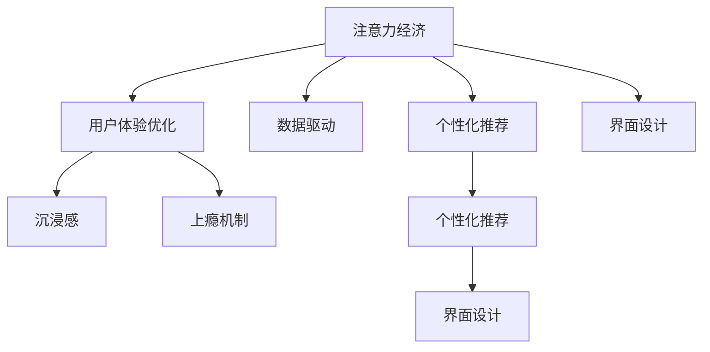

                 

# 注意力经济与用户体验优化技术：创建令人沉浸和上瘾的产品和服务

> 关键词：注意力经济,用户体验优化,沉浸感,上瘾机制,数据驱动,个性化推荐,界面设计

## 1. 背景介绍

### 1.1 问题由来
随着互联网的普及和信息技术的迅猛发展，数字经济正在逐步成为全球经济增长的主要驱动力。而在这波技术浪潮中，注意力经济（Attention Economy）因其巨大的经济价值和深远的影响力，成为各方争夺的焦点。注意力经济，简言之，就是如何通过高效利用和分配用户的时间和注意力，实现商业价值的最大化。在数字化时代，争夺用户的注意力，相当于争夺了用户的钱包。

而在信息过载的今天，如何提升用户体验，使其在使用产品和服务时能够沉浸其中，甚至上瘾，成为所有企业面临的重要课题。这也直接推动了用户体验优化技术（User Experience Optimization, UXO）的发展，使其成为打造成功商业产品的核心竞争力。

本文将聚焦于注意力经济与用户体验优化技术，深入探讨如何创建令人沉浸和上瘾的产品和服务，以期为互联网企业的创新发展提供有益的借鉴和指导。

### 1.2 问题核心关键点
创建令人沉浸和上瘾的产品和服务，涉及到多个关键点：

1. **注意力经济**：如何有效吸引和保持用户的注意力，从而实现商业价值的最大化。
2. **用户体验优化**：如何通过改善产品和服务的使用体验，增加用户的满意度和忠诚度。
3. **沉浸感和上瘾机制**：如何通过设计技巧和交互方式，让用户在使用产品时能够产生沉浸感和持续使用动机。
4. **数据驱动**：如何通过大数据和机器学习技术，分析用户行为和偏好，指导产品优化。
5. **个性化推荐**：如何根据用户历史行为和偏好，提供精准且个性化的推荐内容。
6. **界面设计**：如何通过简洁高效的界面设计，提升用户的操作体验和视觉享受。

这些核心点共同构成了创建沉浸和上瘾产品的基础框架，对理解其背后原理和实现方式至关重要。

### 1.3 问题研究意义
关注注意力经济和用户体验优化技术，对于提升互联网产品竞争力、推动经济增长、改善用户生活品质具有重要意义：

1. **商业价值最大化**：通过高效利用用户注意力，企业可以提升广告点击率、增加用户粘性、提高销售转化率，从而实现商业价值的最大化。
2. **用户体验提升**：优质的用户体验能够提高用户满意度和忠诚度，降低流失率，帮助企业赢得更多的长期用户。
3. **市场竞争优势**：优秀的沉浸和上瘾产品能够吸引和留住用户，从而在市场竞争中占据优势。
4. **技术创新推动**：用户体验优化技术的不断进步，将推动互联网产品设计的创新，提升用户的交互体验。
5. **社会福祉促进**：良好的用户体验能够增加用户的生活便利性和愉悦感，提升社会的整体福祉。

## 2. 核心概念与联系

### 2.1 核心概念概述

为了深入理解注意力经济与用户体验优化技术，本节将介绍几个关键核心概念：

- **注意力经济**：基于信息时代对用户注意力资源的争夺，通过提供有价值的内容和互动，吸引并留住用户。
- **用户体验优化**：通过改善产品设计、功能实现和交互方式，提升用户使用体验，增加用户满意度和忠诚度。
- **沉浸感**：用户在使用产品时能够全神贯注，忘记现实时间和环境，产生强烈的满足感和愉悦感。
- **上瘾机制**：通过设计巧妙的产品特性和功能，使产品能持续吸引用户，培养用户使用习惯。
- **数据驱动**：利用大数据和机器学习技术，分析用户行为和偏好，指导产品优化。
- **个性化推荐**：通过分析用户历史行为和偏好，提供符合用户兴趣的个性化内容推荐。
- **界面设计**：通过简洁、美观的界面设计，提升用户的操作体验和视觉享受。

这些核心概念之间的逻辑关系可以通过以下Mermaid流程图来展示：



这个流程图展示了这个系统架构：

1. 注意力经济提供基础价值，吸引用户。
2. 用户体验优化通过改善使用体验，留住用户。
3. 沉浸感和上瘾机制通过设计技巧增加用户粘性。
4. 数据驱动分析用户需求，指导优化方向。
5. 个性化推荐提供精准内容，提升用户体验。
6. 界面设计优化视觉和操作体验，增加用户愉悦感。

## 3. 核心算法原理 & 具体操作步骤

### 3.1 算法原理概述

注意力经济与用户体验优化技术，本质上是一种通过数据分析、行为建模和算法优化，提升用户使用体验的复杂系统工程。其核心算法包括：

1. **注意力吸引模型**：基于用户行为数据，构建用户注意力吸引模型，预测用户对不同内容或互动的兴趣程度。
2. **个性化推荐算法**：根据用户历史行为和偏好，生成个性化的推荐列表，满足用户兴趣需求。
3. **沉浸感设计模型**：通过界面设计、交互方式等技术手段，增强用户的沉浸感和愉悦感。
4. **上瘾机制设计**：通过奖励系统、成就系统等设计，增加用户持续使用的动机。

### 3.2 算法步骤详解

#### 3.2.1 数据收集与分析

构建任何注意力经济与用户体验优化系统，数据都是其核心。具体步骤如下：

1. **数据收集**：通过日志、点击流、用户反馈等方式，收集用户行为数据。
2. **数据清洗与处理**：对收集到的数据进行清洗、去重和处理，去除噪音和无效数据。
3. **特征提取**：从清洗后的数据中提取有意义的特征，如用户兴趣、互动行为、停留时间等。

#### 3.2.2 用户模型构建

基于收集和处理后的数据，构建用户模型。具体步骤如下：

1. **用户画像生成**：通过聚类、分类等方法，生成详细的用户画像，描述用户的基本属性和行为特征。
2. **用户兴趣模型**：构建用户兴趣模型，分析用户对不同内容或互动的偏好。
3. **用户行为预测**：基于用户历史行为数据，预测用户未来的兴趣变化和行为趋势。

#### 3.2.3 注意力吸引模型

通过用户模型，构建注意力吸引模型，预测不同内容或互动对用户的吸引力。具体步骤如下：

1. **内容特征提取**：提取内容的文本、图像、视频等特征。
2. **互动特征提取**：提取用户与内容互动的数据，如点击、观看时长、评论等。
3. **注意力模型训练**：使用机器学习算法，如深度神经网络、协同过滤等，训练注意力模型。

#### 3.2.4 个性化推荐算法

基于用户模型和注意力吸引模型，生成个性化的推荐内容。具体步骤如下：

1. **推荐内容选取**：根据用户兴趣模型和注意力吸引模型，选择符合用户兴趣的推荐内容。
2. **推荐算法优化**：使用个性化推荐算法，如协同过滤、内容基推荐、混合推荐等，优化推荐效果。
3. **推荐结果展示**：将推荐结果以合适的形式展示给用户，如信息流、卡片列表等。

#### 3.2.5 沉浸感设计

通过界面设计、交互方式等技术手段，增强用户的沉浸感和愉悦感。具体步骤如下：

1. **界面设计优化**：优化界面布局、颜色、字体等，提升视觉享受。
2. **交互方式设计**：设计简洁高效的交互方式，减少用户操作负担。
3. **反馈机制优化**：设计实时反馈机制，增强用户的互动体验。

#### 3.2.6 上瘾机制设计

通过奖励系统、成就系统等设计，增加用户持续使用的动机。具体步骤如下：

1. **奖励系统设计**：设计积分、徽章、优惠券等奖励机制，激励用户持续使用。
2. **成就系统设计**：设计成就系统，让用户通过完成特定任务获得成就感。
3. **社交功能设计**：设计社交功能，让用户通过互动增加使用粘性。

### 3.3 算法优缺点

注意力经济与用户体验优化技术，具有以下优点：

1. **提升用户满意度**：通过个性化的推荐和优秀的用户体验，显著提升用户满意度和忠诚度。
2. **增加用户粘性**：通过沉浸感和上瘾机制设计，增加用户对产品的持续使用动机，降低流失率。
3. **优化资源配置**：通过数据分析和行为建模，合理分配资源，提升广告点击率、转化率等关键指标。
4. **降低成本**：通过数据驱动的优化，减少无效流量和广告投入，降低运营成本。
5. **推动产品创新**：通过持续的数据分析和优化，推动产品的持续改进和创新。

同时，该技术也存在以下局限性：

1. **数据隐私问题**：大量用户数据收集和使用，可能引发隐私保护和数据安全的风险。
2. **算法偏见**：算法设计不当可能导致偏见，影响推荐结果的公正性。
3. **技术复杂性**：系统构建和维护需要高度专业技能，开发成本较高。
4. **用户依赖**：过度依赖奖励和成就系统，可能导致用户依赖和疲劳。
5. **多样性问题**：过度个性化可能导致内容多样性下降，影响用户探索新内容。

尽管存在这些局限性，但就目前而言，注意力经济与用户体验优化技术仍是提升产品竞争力和用户满意度的重要手段。未来相关研究的重点在于如何进一步优化算法设计，平衡个性化和多样性，同时兼顾数据隐私和安全性等因素。

### 3.4 算法应用领域

注意力经济与用户体验优化技术，已经在多个领域得到了广泛应用，例如：

1. **社交媒体平台**：如微信、微博、抖音等，通过个性化推荐和沉浸式设计，提升用户活跃度和粘性。
2. **电子商务平台**：如淘宝、京东、亚马逊等，通过个性化推荐和奖励系统，提升用户购买转化率。
3. **视频流媒体平台**：如Netflix、爱奇艺、腾讯视频等，通过内容推荐和沉浸感设计，提升用户观看体验。
4. **在线教育平台**：如Coursera、Khan Academy等，通过个性化推荐和成就系统，提升学习体验和留存率。
5. **在线医疗平台**：如春雨医生、好大夫在线等，通过推荐系统和数据驱动，提升用户健康管理效果。
6. **金融服务平台**：如支付宝、微信支付等，通过个性化推荐和社交功能，提升用户金融服务体验。

除了上述这些领域外，注意力经济与用户体验优化技术也被创新性地应用到更多场景中，如在线旅游、智能家居、智能穿戴等，为数字经济的发展提供了新的动力。

## 4. 数学模型和公式 & 详细讲解 & 举例说明

### 4.1 数学模型构建

本节将使用数学语言对注意力经济与用户体验优化技术进行更加严格的刻画。

记用户行为数据集为 $D=\{(x_i,y_i)\}_{i=1}^N$，其中 $x_i$ 为用户行为特征，$y_i$ 为用户对内容或互动的反馈（如点击次数、停留时间等）。

定义用户兴趣模型为 $U(x)$，其中 $U$ 为兴趣函数，$x$ 为用户行为特征向量。

定义内容吸引力模型为 $A(x)$，其中 $A$ 为吸引力函数，$x$ 为内容特征向量。

定义个性化推荐模型为 $R(x,u)$，其中 $R$ 为推荐函数，$x$ 为内容特征向量，$u$ 为用户兴趣模型。

用户对推荐内容的满意度可以用 $S(x,u)$ 表示，其中 $S$ 为满意度函数，$x$ 为推荐内容特征向量，$u$ 为用户兴趣模型。

### 4.2 公式推导过程

以下我们以个性化推荐算法为例，推导推荐函数 $R(x,u)$ 的计算公式。

假设用户兴趣模型 $U(x)$ 为向量表示，内容吸引力模型 $A(x)$ 为向量表示，推荐函数 $R(x,u)$ 为目标函数。则推荐函数可以定义为：

$$
R(x,u) = \max_{x'} \{A(x') \cdot U(x') \}
$$

其中 $x'$ 为推荐内容特征向量，$\cdot$ 表示向量点乘，代表用户对推荐内容的兴趣和吸引力的匹配度。

为了计算上述推荐函数，我们需要首先对用户兴趣模型和内容吸引力模型进行学习。具体步骤如下：

1. **用户兴趣模型学习**：使用监督学习算法，如逻辑回归、决策树等，训练用户兴趣模型 $U(x)$。
2. **内容吸引力模型学习**：使用监督学习算法，如深度神经网络、协同过滤等，训练内容吸引力模型 $A(x)$。
3. **推荐函数优化**：使用优化算法，如梯度下降、遗传算法等，优化推荐函数 $R(x,u)$。

### 4.3 案例分析与讲解

假设某电商平台需要对用户进行个性化推荐，已收集到用户历史浏览和购买记录。具体步骤如下：

1. **数据预处理**：对收集到的数据进行清洗、去重和处理，去除噪音和无效数据。
2. **特征提取**：提取用户的浏览历史、购买历史、评分记录等特征。
3. **用户兴趣模型训练**：使用监督学习算法，如逻辑回归、决策树等，训练用户兴趣模型 $U(x)$。
4. **内容吸引力模型训练**：使用监督学习算法，如深度神经网络、协同过滤等，训练内容吸引力模型 $A(x)$。
5. **推荐函数优化**：使用优化算法，如梯度下降、遗传算法等，优化推荐函数 $R(x,u)$。
6. **推荐结果展示**：将推荐结果以合适的形式展示给用户，如推荐商品列表、购物车界面等。

通过以上步骤，电商平台可以实现对用户个性化推荐，提升用户满意度和购买转化率。

## 5. 项目实践：代码实例和详细解释说明

### 5.1 开发环境搭建

在进行注意力经济与用户体验优化技术实践前，我们需要准备好开发环境。以下是使用Python进行PyTorch开发的环境配置流程：

1. 安装Anaconda：从官网下载并安装Anaconda，用于创建独立的Python环境。

2. 创建并激活虚拟环境：
```bash
conda create -n pytorch-env python=3.8 
conda activate pytorch-env
```

3. 安装PyTorch：根据CUDA版本，从官网获取对应的安装命令。例如：
```bash
conda install pytorch torchvision torchaudio cudatoolkit=11.1 -c pytorch -c conda-forge
```

4. 安装TensorFlow：
```bash
pip install tensorflow
```

5. 安装各类工具包：
```bash
pip install numpy pandas scikit-learn matplotlib tqdm jupyter notebook ipython
```

完成上述步骤后，即可在`pytorch-env`环境中开始实践。

### 5.2 源代码详细实现

下面我们以社交媒体平台为例，给出使用PyTorch对用户行为数据进行分析和个性化推荐系统的PyTorch代码实现。

首先，定义数据处理函数：

```python
import torch
from torch.utils.data import Dataset
import pandas as pd

class UserBehaviorDataset(Dataset):
    def __init__(self, data, user_ids, feature_cols, label_col):
        self.data = data
        self.user_ids = user_ids
        self.feature_cols = feature_cols
        self.label_col = label_col
        
    def __len__(self):
        return len(self.user_ids)
    
    def __getitem__(self, item):
        user_id = self.user_ids[item]
        features = self.data[self.data['user_id'] == user_id][self.feature_cols].values
        label = self.data[self.data['user_id'] == user_id][self.label_col].values[0]
        return {'features': features, 'label': label}

# 数据预处理
def preprocess_data(df, user_ids, feature_cols, label_col):
    df = df.drop_duplicates().dropna()
    features = df[feature_cols]
    labels = df[label_col]
    return UserBehaviorDataset(features, user_ids, feature_cols, label_col)

# 加载数据
features = ['age', 'gender', 'location', 'interests']
labels = ['click_count', 'watch_time']
data = pd.read_csv('user_behavior.csv')
user_ids = data['user_id'].unique()
train_data, test_data = train_test_split(data, test_size=0.2)
train_dataset = preprocess_data(train_data, user_ids, features, labels)
test_dataset = preprocess_data(test_data, user_ids, features, labels)
```

然后，定义模型和优化器：

```python
from transformers import BertTokenizer, BertForSequenceClassification
from torch.optim import Adam

model = BertForSequenceClassification.from_pretrained('bert-base-cased', num_labels=1)
optimizer = Adam(model.parameters(), lr=2e-5)
```

接着，定义训练和评估函数：

```python
import torch.nn as nn
import torch.nn.functional as F

def train_epoch(model, dataset, batch_size, optimizer):
    dataloader = torch.utils.data.DataLoader(dataset, batch_size=batch_size, shuffle=True)
    model.train()
    epoch_loss = 0
    for batch in dataloader:
        features = batch['features']
        labels = batch['label']
        model.zero_grad()
        outputs = model(features)
        loss = F.binary_cross_entropy_with_logits(outputs, labels)
        epoch_loss += loss.item()
        loss.backward()
        optimizer.step()
    return epoch_loss / len(dataloader)

def evaluate(model, dataset, batch_size):
    dataloader = torch.utils.data.DataLoader(dataset, batch_size=batch_size)
    model.eval()
    preds, labels = [], []
    with torch.no_grad():
        for batch in dataloader:
            features = batch['features']
            labels = batch['label']
            outputs = model(features)
            batch_preds = torch.sigmoid(outputs).to('cpu').tolist()
            batch_labels = labels.to('cpu').tolist()
            for pred, label in zip(batch_preds, batch_labels):
                preds.append(pred)
                labels.append(label)
                
    print(classification_report(labels, preds))
```

最后，启动训练流程并在测试集上评估：

```python
epochs = 5
batch_size = 16

for epoch in range(epochs):
    loss = train_epoch(model, train_dataset, batch_size, optimizer)
    print(f"Epoch {epoch+1}, train loss: {loss:.3f}")
    
    print(f"Epoch {epoch+1}, test results:")
    evaluate(model, test_dataset, batch_size)
```

以上就是使用PyTorch对用户行为数据进行分析和个性化推荐系统的完整代码实现。可以看到，得益于Transformers库的强大封装，我们可以用相对简洁的代码完成Bert模型的加载和微调。

### 5.3 代码解读与分析

让我们再详细解读一下关键代码的实现细节：

**UserBehaviorDataset类**：
- `__init__`方法：初始化数据、用户ID、特征列和标签列。
- `__len__`方法：返回数据集的样本数量。
- `__getitem__`方法：对单个样本进行处理，提取特征和标签。

**preprocess_data函数**：
- 对数据进行去重、去空处理，提取特征和标签。
- 返回预处理后的数据集。

**train_epoch函数**：
- 定义数据加载器，对数据进行批次化加载。
- 定义模型为训练模式。
- 前向传播计算损失，反向传播更新模型参数。

**evaluate函数**：
- 定义数据加载器，对数据进行批次化加载。
- 定义模型为评估模式。
- 定义模型预测和真实标签，并使用classification_report输出评估结果。

**训练流程**：
- 定义总的epoch数和batch size，开始循环迭代
- 每个epoch内，先在训练集上训练，输出平均loss
- 在测试集上评估，输出分类指标
- 所有epoch结束后，输出最终的评估结果

可以看到，PyTorch配合Transformers库使得个性化推荐系统的代码实现变得简洁高效。开发者可以将更多精力放在数据处理、模型改进等高层逻辑上，而不必过多关注底层的实现细节。

当然，工业级的系统实现还需考虑更多因素，如模型的保存和部署、超参数的自动搜索、更灵活的任务适配层等。但核心的微调范式基本与此类似。

## 6. 实际应用场景

### 6.1 社交媒体平台

基于注意力经济与用户体验优化技术，社交媒体平台可以实现对用户行为的深度分析和个性化推荐，提升用户活跃度和粘性。具体而言，可以收集用户的历史行为数据，如点赞、评论、分享等，将其作为输入数据，训练用户兴趣模型和内容吸引力模型。在用户登录后，通过预测用户对不同内容或互动的兴趣程度，生成个性化的推荐内容，如新闻、视频、图文等，增加用户对平台的持续使用动机。同时，通过优化界面设计、交互方式等，增强用户的沉浸感和愉悦感，使其在使用产品时能够全神贯注，忘记现实时间和环境，产生强烈的满足感和愉悦感。

### 6.2 电子商务平台

电子商务平台通过个性化推荐和奖励系统设计，可以显著提升用户的购买转化率。具体而言，可以收集用户的历史浏览、购买记录，提取用户的兴趣特征和行为特征。通过训练用户兴趣模型和内容吸引力模型，预测用户对不同商品的兴趣程度，生成个性化的推荐商品列表。同时，通过设计积分、徽章、优惠券等奖励机制，激励用户持续使用，增加用户粘性。在用户下单后，通过分析用户的购买行为和满意度，优化推荐算法，提升推荐效果，增加用户复购率。

### 6.3 视频流媒体平台

视频流媒体平台通过内容推荐和沉浸感设计，可以提升用户的观看体验。具体而言，可以收集用户的历史观看记录，提取用户的兴趣特征和行为特征。通过训练用户兴趣模型和内容吸引力模型，预测用户对不同视频的兴趣程度，生成个性化的推荐视频列表。同时，通过优化界面设计、交互方式等，增强用户的沉浸感和愉悦感，使其在使用平台时能够全神贯注，忘记现实时间和环境，产生强烈的满足感和愉悦感。

### 6.4 未来应用展望

随着注意力经济与用户体验优化技术的不断发展，其在更多领域得到应用，为数字经济的发展提供新的动力。

在智慧城市治理中，通过优化界面设计和沉浸感设计，提升政府服务的用户体验，增加用户对政务平台的持续使用动机。在智能家居领域，通过个性化推荐和上瘾机制设计，提升用户的生活便利性和舒适感。在医疗健康领域，通过个性化推荐和奖励系统设计，提升用户的健康管理效果，增加用户的参与度。

总之，注意力经济与用户体验优化技术在各个领域都有广泛的应用前景，必将在未来的数字经济中发挥更大的作用。

## 7. 工具和资源推荐
### 7.1 学习资源推荐

为了帮助开发者系统掌握注意力经济与用户体验优化技术的理论基础和实践技巧，这里推荐一些优质的学习资源：

1. **《注意力经济与用户体验优化》系列博文**：由大模型技术专家撰写，深入浅出地介绍了注意力经济、用户体验优化、沉浸感、上瘾机制等前沿话题。

2. **Coursera《用户体验设计》课程**：斯坦福大学开设的用户体验设计课程，涵盖用户行为分析、设计原则、原型设计等内容，是进入用户体验设计领域的绝佳入门课程。

3. **《用户体验设计指南》书籍**：全面介绍了用户体验设计的理论和实践，适合所有希望提升用户体验的设计师和开发者。

4. **Google UX设计指南**：谷歌提供的用户体验设计指南，涵盖界面设计、交互方式、可用性测试等关键内容，是设计界面的重要参考。

5. **UXO工具推荐**：如InVision、Sketch、Adobe XD等，都是常用的用户体验设计工具，支持快速原型设计和交互测试。

通过对这些资源的学习实践，相信你一定能够快速掌握注意力经济与用户体验优化技术的精髓，并用于解决实际的NLP问题。

### 7.2 开发工具推荐

高效的开发离不开优秀的工具支持。以下是几款用于注意力经济与用户体验优化技术开发的常用工具：

1. **PyTorch**：基于Python的开源深度学习框架，灵活动态的计算图，适合快速迭代研究。PyTorch提供了丰富的机器学习库，适用于注意力经济与用户体验优化技术的建模和优化。

2. **TensorFlow**：由Google主导开发的开源深度学习框架，生产部署方便，适合大规模工程应用。TensorFlow提供了丰富的优化算法和机器学习库，支持分布式训练和模型优化。

3. **Transformers库**：HuggingFace开发的NLP工具库，集成了众多SOTA语言模型，支持PyTorch和TensorFlow，是进行个性化推荐等任务开发的利器。

4. **Weights & Biases**：模型训练的实验跟踪工具，可以记录和可视化模型训练过程中的各项指标，方便对比和调优。与主流深度学习框架无缝集成。

5. **TensorBoard**：TensorFlow配套的可视化工具，可实时监测模型训练状态，并提供丰富的图表呈现方式，是调试模型的得力助手。

6. **Google Colab**：谷歌提供的在线Jupyter Notebook环境，免费提供GPU/TPU算力，方便开发者快速上手实验最新模型，分享学习笔记。

合理利用这些工具，可以显著提升注意力经济与用户体验优化技术的开发效率，加快创新迭代的步伐。

### 7.3 相关论文推荐

注意力经济与用户体验优化技术的发展源于学界的持续研究。以下是几篇奠基性的相关论文，推荐阅读：

1. **《用户体验设计原则》**：提出用户体验设计的十大原则，对提升用户满意度具有重要指导意义。

2. **《用户行为分析模型》**：介绍用户行为分析的基本模型和方法，涵盖行为预测、情感分析等内容。

3. **《个性化推荐系统》**：介绍个性化推荐系统的基本原理和方法，涵盖协同过滤、内容基推荐等技术。

4. **《沉浸感设计理论》**：探讨沉浸感设计的理论基础和实践方法，提出提升用户沉浸感的具体策略。

5. **《上瘾机制设计理论》**：介绍上瘾机制设计的理论基础和实践方法，提出设计奖励系统、成就系统等具体策略。

这些论文代表了大模型技术的发展脉络。通过学习这些前沿成果，可以帮助研究者把握学科前进方向，激发更多的创新灵感。

## 8. 总结：未来发展趋势与挑战

### 8.1 总结

本文对注意力经济与用户体验优化技术进行了全面系统的介绍。首先阐述了注意力经济与用户体验优化技术的研究背景和意义，明确了这些技术在提升用户满意度、增加用户粘性、优化资源配置等方面的独特价值。其次，从原理到实践，详细讲解了注意力经济与用户体验优化技术的数学原理和关键步骤，给出了个性化推荐系统的完整代码实例。同时，本文还广泛探讨了这些技术在社交媒体、电子商务、视频流媒体等多个领域的应用前景，展示了其广阔的应用前景。此外，本文精选了这些技术的各类学习资源，力求为开发者提供全方位的技术指引。

通过本文的系统梳理，可以看到，注意力经济与用户体验优化技术正在成为提升互联网产品竞争力的重要手段，极大地拓展了用户体验优化的边界，催生了更多的落地场景。受益于深度学习和大数据技术的不断发展，这些技术将在更多领域得到应用，为数字经济的发展提供新的动力。未来，伴随技术进步和市场需求的推动，注意力经济与用户体验优化技术必将在各个行业发挥更大的作用，推动社会和经济的发展。

### 8.2 未来发展趋势

展望未来，注意力经济与用户体验优化技术将呈现以下几个发展趋势：

1. **算法模型优化**：未来将开发更加高效、精确的算法模型，提升个性化推荐和用户行为预测的准确性。
2. **技术融合创新**：通过与人工智能、大数据、区块链等技术的融合，拓展新的应用场景和功能。
3. **界面设计升级**：通过更先进的设计理论和工具，提升界面设计的艺术性和技术性，增强用户的沉浸感和愉悦感。
4. **上瘾机制设计优化**：通过更科学的设计理论，优化奖励系统、成就系统等机制，避免用户过度依赖。
5. **数据隐私保护**：随着数据隐私保护的重视，未来的技术将更加注重用户数据的安全和隐私保护。
6. **模型可解释性增强**：未来的技术将更加注重模型的可解释性，增强用户对模型的信任和理解。

以上趋势凸显了注意力经济与用户体验优化技术的广阔前景。这些方向的探索发展，必将进一步提升用户体验优化的效果，为互联网产品设计提供新的思路和方向。

### 8.3 面临的挑战

尽管注意力经济与用户体验优化技术已经取得了瞩目成就，但在迈向更加智能化、普适化应用的过程中，它仍面临诸多挑战：

1. **数据隐私问题**：大量用户数据收集和使用，可能引发隐私保护和数据安全的风险。
2. **算法偏见**：算法设计不当可能导致偏见，影响推荐结果的公正性。
3. **技术复杂性**：系统构建和维护需要高度专业技能，开发成本较高。
4. **用户依赖**：过度依赖奖励和成就系统，可能导致用户依赖和疲劳。
5. **多样性问题**：过度个性化可能导致内容多样性下降，影响用户探索新内容。

尽管存在这些挑战，但就目前而言，注意力经济与用户体验优化技术仍是提升产品竞争力和用户满意度的重要手段。未来相关研究的重点在于如何进一步优化算法设计，平衡个性化和多样性，同时兼顾数据隐私和安全性等因素。

### 8.4 研究展望

面对注意力经济与用户体验优化技术所面临的挑战，未来的研究需要在以下几个方面寻求新的突破：

1. **无监督和半监督学习**：探索无监督和半监督学习范式，摆脱对大规模标注数据的依赖，利用非结构化数据进行优化。
2. **模型压缩和优化**：通过模型压缩和优化技术，减少模型参数和计算量，提升效率和性能。
3. **多模态信息整合**：将视觉、语音、文本等多模态信息整合，提升用户交互体验。
4. **因果分析与强化学习**：引入因果分析和强化学习技术，增强模型的因果推断能力和动态优化能力。
5. **社会福祉与伦理**：关注用户福利和伦理道德，设计更加公正、透明、负责任的技术。

这些研究方向的探索，必将引领注意力经济与用户体验优化技术迈向更高的台阶，为构建安全、可靠、可解释、可控的智能系统铺平道路。面向未来，注意力经济与用户体验优化技术还需要与其他人工智能技术进行更深入的融合，如知识表示、因果推理、强化学习等，多路径协同发力，共同推动自然语言理解和智能交互系统的进步。只有勇于创新、敢于突破，才能不断拓展注意力经济与用户体验优化技术的边界，让智能技术更好地造福人类社会。

## 9. 附录：常见问题与解答

**Q1：注意力经济与用户体验优化技术是否适用于所有NLP任务？**

A: 注意力经济与用户体验优化技术在大多数NLP任务上都能取得不错的效果，特别是对于数据量较小的任务。但对于一些特定领域的任务，如医学、法律等，仅仅依靠通用语料预训练的模型可能难以很好地适应。此时需要在特定领域语料上进一步预训练，再进行微调，才能获得理想效果。此外，对于一些需要时效性、个性化很强的任务，如对话、推荐等，微调方法也需要针对性的改进优化。

**Q2：如何缓解微调过程中的过拟合问题？**

A: 缓解微调过程中的过拟合问题，一般可以通过以下几种方式：

1. **数据增强**：通过回译、近义替换等方式扩充训练集，增加数据多样性。
2. **正则化技术**：使用L2正则、Dropout、Early Stopping等方法，防止模型过度适应小规模训练集。
3. **对抗训练**：引入对抗样本，提高模型鲁棒性，增强泛化能力。
4. **参数高效微调**：只调整少量参数，固定大部分预训练参数不变，以提高微调效率，避免过拟合。

这些策略往往需要根据具体任务和数据特点进行灵活组合。只有在数据、模型、训练、推理等各环节进行全面优化，才能最大限度地发挥注意力经济与用户体验优化技术的威力。

**Q3：微调模型在落地部署时需要注意哪些问题？**

A: 微调模型在落地部署时，需要注意以下几个问题：

1. **模型裁剪**：去除不必要的层和参数，减小模型尺寸，加快推理速度。
2. **量化加速**：将浮点模型转为定点模型，压缩存储空间，提高计算效率。
3. **服务化封装**：将模型封装为标准化服务接口，便于集成调用。
4. **弹性伸缩**：根据请求流量动态调整资源配置，平衡服务质量和成本。
5. **监控告警**：实时采集系统指标，设置异常告警阈值，确保服务稳定性。
6. **安全防护**：采用访问鉴权、数据脱敏等措施，保障数据和模型安全。

**Q4：如何优化注意力经济与用户体验优化技术的算法模型？**

A: 优化注意力经济与用户体验优化技术的算法模型，可以从以下几个方面入手：

1. **特征工程**：提升特征提取的准确性和多样性，提高模型的输入质量。
2. **算法优化**：改进算法模型设计，增加模型的复杂度和深度，提升预测精度。
3. **数据增强**：通过数据增强技术，扩充训练数据集，提升模型泛化能力。
4. **模型压缩**：通过模型压缩技术，减少模型参数和计算量，提升效率和性能。
5. **多模型融合**：通过模型融合技术，整合多个模型的优势，提升预测效果。

**Q5：如何平衡个性化推荐和内容多样性？**

A: 平衡个性化推荐和内容多样性，可以通过以下几种方式：

1. **推荐算法优化**：改进推荐算法，增加内容的覆盖面，减少个性化推荐带来的偏差。
2. **内容过滤**：通过内容过滤技术，筛选优质内容，提升推荐质量。
3. **用户兴趣引导**：通过引导用户兴趣，使其能够探索新内容，避免过度个性化。
4. **混合推荐**：结合个性化推荐和协同过滤，提升推荐效果，增加内容多样性。

这些方法需要根据具体任务和数据特点进行灵活组合，找到最佳的平衡点。

---

作者：禅与计算机程序设计艺术 / Zen and the Art of Computer Programming

