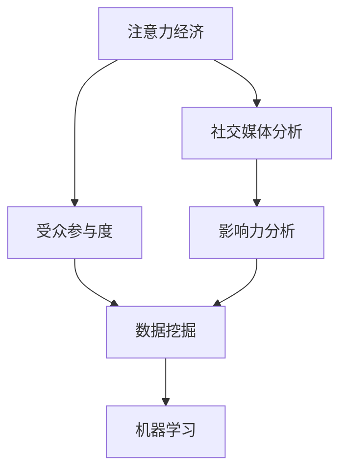

                 

# 注意力经济与社交媒体分析：了解受众参与度和影响力的洞察力

> 关键词：注意力经济,社交媒体分析,受众参与度,影响力分析,数据挖掘,社交网络

## 1. 背景介绍

### 1.1 问题由来

随着数字经济和互联网技术的快速发展，注意力资源成为新时代的核心经济要素。社交媒体作为信息传播的重要平台，不仅改变了人们的日常生活和社交方式，也为广告商、企业、政府等机构提供了丰富的用户数据。如何利用这些数据，深入挖掘用户的行为特征和心理需求，洞察用户参与度和影响力，是当前互联网和数据科学领域的热点研究话题。

社交媒体分析作为一门交叉学科，结合了社交网络分析、数据挖掘、自然语言处理、机器学习等多个技术领域，旨在从海量数据中提取有价值的信息，帮助用户、企业和组织做出更明智的决策。在广告投放、品牌管理、舆情监测、社交网络治理等方面，社交媒体分析扮演着越来越重要的角色。

然而，随着用户隐私保护意识的提高，严格的隐私法律（如GDPR）不断出台，获取用户数据的难度日益增大。同时，社交媒体平台的算法推荐系统，往往根据用户的浏览行为、点赞、评论等互动信息进行个性化推荐，导致用户的注意力分布越来越分散，增加了数据挖掘的复杂性。这些挑战促使我们重新审视注意力经济和社交媒体分析的理论和方法，探索如何从用户的关注行为中提取有用的洞察力。

### 1.2 问题核心关键点

当前社交媒体分析的研究主要集中在以下几个关键点：

- **注意力分布**：分析用户的关注行为，挖掘热门话题和热门账号，理解用户注意力流向。
- **受众分析**：通过文本分析、情感分析等方法，评估用户对某个话题、账号或广告的情感倾向和态度。
- **影响力和扩散**：识别关键意见领袖（KOL），分析信息传播的路径和影响力，预测热门趋势和话题的扩散范围。
- **隐私保护**：在获取用户数据的同时，确保用户隐私权益得到保障，避免不当使用。

本文将全面系统地介绍注意力经济和社交媒体分析的相关理论和实践方法，重点聚焦于理解用户参与度和影响力，并提出未来可能的研究方向。

## 2. 核心概念与联系

### 2.1 核心概念概述

本节将介绍几个密切相关的核心概念：

- **注意力经济**：利用互联网平台的用户注意力资源，实现商业价值最大化的一种新型经济模式。注意力经济的核心在于如何获取、利用和转化用户注意力，以提升品牌知名度、产品销售和用户体验。

- **社交媒体分析**：通过分析社交媒体上的文本、图片、视频等数据，挖掘用户行为、情感、关系等有用信息，帮助用户、企业和组织洞察用户需求、市场趋势和社交网络特征。

- **受众参与度**：指用户在社交媒体上与特定内容、账号或话题的互动程度，包括点赞、评论、分享、收藏等行为，以及这些行为的数量、频率和质量。

- **影响力分析**：评估用户或账号对其他用户的影响力和号召力，衡量其在社交媒体上的话语权和传播力。

- **数据挖掘**：从大规模数据中发现有用的模式、规律和知识，应用于用户行为预测、社交网络分析等任务。

- **机器学习**：通过数据驱动的算法模型，自动学习数据中的复杂关系，实现预测、分类、聚类等任务。

这些概念之间的逻辑关系可以通过以下Mermaid流程图来展示：



这个流程图展示了几大核心概念之间的关系：

1. 注意力经济通过社交媒体分析，获取和利用用户注意力。
2. 社交媒体分析包含受众参与度和影响力分析，通过数据挖掘和机器学习实现。
3. 数据挖掘和机器学习是实现社交媒体分析的基础技术手段。

## 3. 核心算法原理 & 具体操作步骤

### 3.1 算法原理概述

社交媒体分析的核心在于从用户的关注行为中提取有用的洞察力。为了全面理解用户参与度和影响力，我们通常需要综合使用多种技术和方法，包括文本分析、情感分析、用户行为建模等。

社交媒体分析的方法大致可以分为三类：

- **基于规则的方法**：通过设定一些规则和指标，自动标注和分类文本数据。
- **基于机器学习的方法**：利用标注数据训练分类器或回归器，自动识别和预测用户行为和情感。
- **混合方法**：结合规则方法和机器学习技术，提高预测和分类的准确性和鲁棒性。

在处理海量数据时，通常需要借助分布式计算平台，如Hadoop、Spark等，来加速计算和存储。同时，为了提高算法效率，还需要对数据进行预处理和特征工程，提取和构造有助于模型学习的重要特征。

### 3.2 算法步骤详解

社交媒体分析的算法步骤大致包括以下几个关键环节：

**Step 1: 数据收集与清洗**

- 从社交媒体平台（如微博、微信、Instagram等）收集用户数据，包括用户的关注行为、评论、点赞、分享等互动信息。
- 清洗数据，去除无关信息，如图片、链接、广告等，保留文本、时间戳、账号ID等关键信息。
- 标注数据，如情感极性、主题、用户类型等，以便后续建模和分析。

**Step 2: 特征提取与建模**

- 提取文本特征，如TF-IDF、词频、情感词等，作为模型输入。
- 选择适当的机器学习算法，如朴素贝叶斯、支持向量机、深度神经网络等，对用户行为和情感进行建模。
- 训练和评估模型，优化模型参数，提高预测和分类的准确性。

**Step 3: 数据可视化与分析**

- 使用数据可视化工具，如Tableau、PowerBI等，将分析结果直观展示。
- 分析用户行为和情感趋势，识别热点话题和关键账号，理解用户参与度和影响力。
- 根据分析结果，制定有效的广告投放策略、品牌管理方案或社交网络治理措施。

**Step 4: 用户隐私保护**

- 在数据收集和处理过程中，确保用户隐私权益得到保障，避免不当使用。
- 对用户数据进行匿名化和去标识化处理，保护用户隐私。
- 遵守GDPR等隐私保护法律法规，确保数据使用的合法性和合规性。

### 3.3 算法优缺点

基于机器学习的社交媒体分析方法具有以下优点：

- **高效性**：可以利用标注数据自动学习模型，处理海量数据，实现快速分析。
- **灵活性**：可以根据不同任务和数据特点，灵活选择和调整算法模型。
- **准确性**：通过深度学习和机器学习，可以提高预测和分类的准确性，实现更精确的洞察力。

然而，这些方法也存在一些局限性：

- **数据依赖**：需要大量标注数据进行训练，获取高质量标注数据成本较高。
- **模型复杂性**：深度学习模型需要较多的计算资源，对硬件要求较高。
- **可解释性不足**：许多深度学习模型被视为"黑盒"，难以解释其内部工作机制。
- **隐私风险**：在数据挖掘过程中，可能存在用户隐私泄露的风险。

尽管如此，机器学习仍然是目前最先进和高效的社交媒体分析技术，未来仍有广泛应用前景。

### 3.4 算法应用领域

社交媒体分析在多个领域都有广泛应用，包括但不限于以下几个方面：

- **广告投放**：分析用户行为和情感，评估广告效果，制定精准投放策略。
- **品牌管理**：监测品牌声誉，分析用户情感，优化品牌形象和市场策略。
- **舆情监测**：实时监测舆情动态，识别热点事件和敏感话题，预测未来趋势。
- **社交网络治理**：识别恶意账号和行为，维护网络安全，促进健康互动。
- **消费者行为分析**：了解消费者需求和偏好，指导产品设计和营销策略。
- **内容推荐**：根据用户行为和兴趣，推荐相关内容和广告，提升用户体验。

此外，社交媒体分析还可以应用于市场研究、情感分析、舆情预警等多个领域，为各类应用场景提供有价值的信息支持。

## 4. 数学模型和公式 & 详细讲解 & 举例说明

### 4.1 数学模型构建

社交媒体分析的数学模型通常包括文本表示模型、情感分析模型、用户行为建模等。下面以情感分析为例，介绍其数学模型构建过程。

假设社交媒体上的一条文本为 $X$，其情感极性为 $Y$，则情感分析的目标是建立一个模型 $M$，使得：

$$
\hat{Y} = M(X)
$$

其中 $\hat{Y}$ 表示模型对文本情感的预测结果。

### 4.2 公式推导过程

情感分析的常用算法包括朴素贝叶斯、支持向量机、深度神经网络等。这里以深度神经网络为例，介绍其模型构建和训练过程。

假设使用深度神经网络模型 $M$，包含一个嵌入层 $E$、一个或多个隐藏层 $H$ 和一个输出层 $O$。设嵌入层的维度为 $d$，隐藏层的维度为 $n$，输出层的维度为 $m$，其中 $m=2$ 表示情感极性为二分类任务。

模型的前向传播过程如下：

1. 嵌入层 $E$ 将文本 $X$ 映射为向量 $X_E$：

$$
X_E = E(X)
$$

2. 隐藏层 $H$ 对嵌入向量 $X_E$ 进行处理，得到中间表示 $X_H$：

$$
X_H = H(X_E)
$$

3. 输出层 $O$ 对中间表示 $X_H$ 进行分类，得到情感预测结果 $\hat{Y}$：

$$
\hat{Y} = O(X_H)
$$

模型的损失函数通常采用交叉熵损失：

$$
L(M) = -\frac{1}{N} \sum_{i=1}^N \ell(X_i, \hat{Y}_i)
$$

其中 $\ell(X_i, \hat{Y}_i)$ 为交叉熵损失函数，可以进一步展开为：

$$
\ell(X_i, \hat{Y}_i) = -[y_i \log \hat{y}_i + (1-y_i) \log (1-\hat{y}_i)]
$$

其中 $y_i$ 为文本 $X_i$ 的真实情感极性，$\hat{y}_i$ 为模型预测的情感极性。

模型的后向传播过程如下：

1. 计算预测结果与真实结果的误差 $\delta_Y$：

$$
\delta_Y = \nabla_{\hat{Y}} L(M)
$$

2. 通过链式法则，计算隐藏层 $H$ 的误差 $\delta_H$：

$$
\delta_H = \nabla_{X_H} \delta_Y
$$

3. 通过链式法则，计算嵌入层 $E$ 的误差 $\delta_E$：

$$
\delta_E = \nabla_{X_E} \delta_H
$$

4. 使用误差 $\delta_E$ 更新嵌入层 $E$ 的权重 $w_E$：

$$
w_E \leftarrow w_E - \eta \nabla_{w_E} L(M)
$$

其中 $\eta$ 为学习率。

5. 重复以上过程，直到收敛。

### 4.3 案例分析与讲解

以Twitter上的情感分析为例，我们收集了1000条用户的推文及其情感极性标签，使用朴素贝叶斯模型进行训练和测试。

首先，将推文文本分词，去除停用词和标点符号，得到词向量表示 $X$。然后，使用朴素贝叶斯模型对词向量进行分类，得到情感极性预测结果 $\hat{Y}$。

计算模型在测试集上的准确率、召回率和F1值：

$$
Accuracy = \frac{TP}{TP+FP+FN}
$$

$$
Recall = \frac{TP}{TP+FN}
$$

$$
F1 = 2 \times \frac{Precision \times Recall}{Precision+Recall}
$$

其中 $TP$ 表示正确预测的正样本数量，$FP$ 表示误判为正样本的负样本数量，$FN$ 表示漏判的正样本数量。

使用训练集和测试集对模型进行交叉验证，评估模型的性能。

## 5. 项目实践：代码实例和详细解释说明

### 5.1 开发环境搭建

在进行社交媒体分析实践前，我们需要准备好开发环境。以下是使用Python进行Scikit-Learn开发的环境配置流程：

1. 安装Anaconda：从官网下载并安装Anaconda，用于创建独立的Python环境。

2. 创建并激活虚拟环境：
```bash
conda create -n scikit-learn-env python=3.8 
conda activate scikit-learn-env
```

3. 安装Scikit-Learn：
```bash
pip install scikit-learn
```

4. 安装各类工具包：
```bash
pip install numpy pandas scikit-learn matplotlib tqdm jupyter notebook ipython
```

完成上述步骤后，即可在`scikit-learn-env`环境中开始社交媒体分析实践。

### 5.2 源代码详细实现

这里我们以情感分析任务为例，给出使用Scikit-Learn进行Twitter数据情感分析的Python代码实现。

首先，定义情感分析任务的数据处理函数：

```python
import pandas as pd
import numpy as np
from sklearn.feature_extraction.text import CountVectorizer
from sklearn.model_selection import train_test_split
from sklearn.naive_bayes import MultinomialNB
from sklearn.metrics import accuracy_score, precision_score, recall_score, f1_score

def load_data(file_path):
    df = pd.read_csv(file_path)
    return df

def preprocess_data(df):
    # 分词，去除停用词和标点符号
    vectorizer = CountVectorizer(stop_words='english', punctuation='!?', lower=True)
    X = vectorizer.fit_transform(df['text'])
    y = df['label']
    return X, y

def train_model(X_train, y_train):
    # 训练朴素贝叶斯模型
    clf = MultinomialNB()
    clf.fit(X_train, y_train)
    return clf

def evaluate_model(model, X_test, y_test):
    # 评估模型性能
    y_pred = model.predict(X_test)
    accuracy = accuracy_score(y_test, y_pred)
    precision = precision_score(y_test, y_pred, pos_label='positive')
    recall = recall_score(y_test, y_pred, pos_label='positive')
    f1 = f1_score(y_test, y_pred, pos_label='positive')
    return accuracy, precision, recall, f1
```

然后，定义数据加载、模型训练和评估函数：

```python
# 加载数据
df = load_data('tweet_data.csv')

# 数据预处理
X, y = preprocess_data(df)

# 划分训练集和测试集
X_train, X_test, y_train, y_test = train_test_split(X, y, test_size=0.2, random_state=42)

# 训练模型
model = train_model(X_train, y_train)

# 评估模型
accuracy, precision, recall, f1 = evaluate_model(model, X_test, y_test)
print('Accuracy:', accuracy)
print('Precision:', precision)
print('Recall:', recall)
print('F1:', f1)
```

最后，输出模型性能评估结果：

```python
# 输出评估结果
print('Accuracy:', accuracy)
print('Precision:', precision)
print('Recall:', recall)
print('F1:', f1)
```

以上就是使用Scikit-Learn对Twitter数据进行情感分析的完整代码实现。可以看到，借助Scikit-Learn，社交媒体分析的实现变得简洁高效。

### 5.3 代码解读与分析

让我们再详细解读一下关键代码的实现细节：

**load_data函数**：
- 使用pandas库读取CSV文件，返回DataFrame格式的数据集。

**preprocess_data函数**：
- 使用CountVectorizer对文本数据进行分词和向量化处理。
- 将文本数据转换为词向量表示，并返回特征矩阵X和标签y。

**train_model函数**：
- 使用MultinomialNB朴素贝叶斯模型训练情感分类器。
- 返回训练好的模型对象。

**evaluate_model函数**：
- 在测试集上评估模型性能，计算准确率、精确率、召回率和F1值。
- 返回评估结果。

**训练流程**：
- 使用load_data函数加载数据集。
- 使用preprocess_data函数对数据进行预处理，得到特征矩阵X和标签y。
- 使用train_test_split函数将数据集划分为训练集和测试集。
- 使用train_model函数训练朴素贝叶斯模型。
- 使用evaluate_model函数评估模型性能。

## 6. 实际应用场景

### 6.1 智能广告投放

智能广告投放是社交媒体分析的一个重要应用场景。通过分析用户行为和情感，可以精准识别目标用户，优化广告投放策略，提升广告效果。

在实践中，可以收集用户的历史行为数据，包括浏览、点击、购买等行为，以及其对广告的情感反应（如点赞、评论、分享等）。利用这些数据，训练情感分析模型，识别用户的积极情感，并将该用户作为广告投放的目标受众。同时，分析用户行为数据，识别用户的兴趣偏好，制定个性化的广告推荐方案，提高广告的点击率和转化率。

### 6.2 品牌管理

品牌管理是企业社交媒体分析的重要应用领域。通过分析品牌在社交媒体上的表现，企业可以及时发现品牌声誉变化，优化品牌形象和市场策略。

在实践中，可以收集品牌在社交媒体上的评论、讨论、品牌标签等数据，进行情感分析，评估品牌声誉。利用文本分类模型，将品牌相关的讨论进行分类，识别品牌相关的热门话题和负面反馈。通过分析用户对品牌的情感，制定品牌传播策略，提升品牌形象和用户满意度。

### 6.3 舆情监测

舆情监测是社交媒体分析的重要应用之一，帮助政府和组织及时了解舆情动态，预测热点事件，防范网络安全风险。

在实践中，可以收集社交媒体上的用户评论、帖子、话题标签等数据，进行情感分析，评估舆情变化。利用文本聚类算法，将舆情数据进行聚类，识别热点事件和敏感话题。通过分析舆情数据，预测未来趋势，制定应对措施，防范网络安全风险。

### 6.4 未来应用展望

随着社交媒体分析技术的不断进步，其应用场景将不断拓展，为各类组织和个人提供更加智能、高效、全面的洞察力。

在未来的应用中，社交媒体分析将更加注重用户隐私保护，采用去标识化和匿名化技术，保障用户隐私权益。同时，社交媒体分析将更加注重深度学习和机器学习技术，提升模型精度和鲁棒性。

此外，社交媒体分析还将与其他技术进行更加深入的融合，如知识图谱、因果推理、强化学习等，实现更加全面、精准的信息挖掘和预测。

## 7. 工具和资源推荐

### 7.1 学习资源推荐

为了帮助开发者系统掌握社交媒体分析的理论基础和实践技巧，这里推荐一些优质的学习资源：

1. 《社交媒体分析导论》系列博文：由社交媒体分析专家撰写，深入浅出地介绍了社交媒体分析的基本概念和经典模型。

2. 《网络分析和数据挖掘》课程：斯坦福大学开设的课程，介绍了网络分析、数据挖掘、机器学习等技术，是学习社交媒体分析的重要资源。

3. 《数据科学与机器学习》书籍：详细介绍了数据科学和机器学习的基本原理和实践方法，适用于初学者和进阶读者。

4. Coursera《数据科学与机器学习》专业课程：由Coursera与知名大学合作，提供系统的数据科学和机器学习课程，涵盖社交媒体分析等多个主题。

5. Kaggle社交媒体分析竞赛：通过参与Kaggle竞赛，实践社交媒体分析的算法和技术，提高实际应用能力。

通过对这些资源的学习实践，相信你一定能够快速掌握社交媒体分析的理论和实践方法，解决实际问题。

### 7.2 开发工具推荐

高效的开发离不开优秀的工具支持。以下是几款用于社交媒体分析开发的常用工具：

1. Python：作为目前最流行的编程语言之一，Python具有简洁、易读、高效的特点，适合社交媒体分析的算法实现。

2. Scikit-Learn：用于数据挖掘和机器学习的Python库，提供了丰富的机器学习算法和工具，适合进行情感分析、文本分类等任务。

3. Jupyter Notebook：开源的交互式计算环境，支持Python、R等语言，方便编写、执行和分享代码。

4. Pandas：用于数据处理和分析的Python库，支持数据清洗、转换、统计等操作，适合处理社交媒体数据。

5. Matplotlib和Seaborn：用于数据可视化的Python库，支持生成各种图表，方便展示分析结果。

合理利用这些工具，可以显著提升社交媒体分析的开发效率，加快创新迭代的步伐。

### 7.3 相关论文推荐

社交媒体分析的研究源于学界的持续研究。以下是几篇奠基性的相关论文，推荐阅读：

1. **“Social Media Analysis: A Survey”**：全面介绍了社交媒体分析的基本概念、方法和应用，是学习社交媒体分析的重要资源。

2. **“Twitter Emotion Analysis: A Comparative Study”**：通过比较不同情感分析算法，展示了Twitter情感分析的最新进展和应用效果。

3. **“Modeling Social Media Sentiment with Deep Learning”**：利用深度学习技术，实现了社交媒体情感分析的高级应用，展示了深度学习的强大能力。

4. **“A Survey on Social Media Sentiment Analysis”**：从多个角度介绍了社交媒体情感分析的研究进展，为学习社交媒体分析提供了全面的视角。

5. **“Social Media Sentiment Analysis: A Review and Future Directions”**：详细总结了社交媒体情感分析的研究现状和未来发展方向，为未来的研究提供了有价值的参考。

这些论文代表了大语言模型微调技术的发展脉络。通过学习这些前沿成果，可以帮助研究者把握学科前进方向，激发更多的创新灵感。

## 8. 总结：未来发展趋势与挑战

### 8.1 总结

本文对社交媒体分析的相关理论和实践方法进行了全面系统的介绍。首先阐述了社交媒体分析的研究背景和意义，明确了其在广告投放、品牌管理、舆情监测等众多领域的重要价值。其次，从原理到实践，详细讲解了社交媒体分析的数学模型和算法流程，给出了Python代码实例和详细解释。最后，提出了未来可能的研究方向和面临的挑战。

通过本文的系统梳理，可以看到，社交媒体分析技术正在成为互联网和数据科学领域的重要范式，极大地拓展了用户在社交媒体上的洞察力，推动了数字经济的快速发展。未来，伴随技术的不断进步，社交媒体分析必将在更多领域发挥更加重要的作用，带来更深远的影响。

### 8.2 未来发展趋势

展望未来，社交媒体分析技术将呈现以下几个发展趋势：

1. **深度学习技术的广泛应用**：随着深度学习技术的不断成熟，深度神经网络将广泛应用于情感分析、文本分类等任务，提升模型的精度和鲁棒性。

2. **多模态数据的整合**：社交媒体分析不仅限于文本数据，未来的研究将进一步整合视觉、音频等多模态数据，实现更加全面、精准的信息挖掘。

3. **隐私保护的加强**：在获取用户数据的同时，如何保障用户隐私权益，成为社交媒体分析的重要研究方向。未来的研究将更加注重用户隐私保护，采用去标识化和匿名化技术。

4. **模型的实时性和效率**：社交媒体数据具有实时性强的特点，未来的研究将更加注重模型的实时性和计算效率，以适应大规模数据处理的需求。

5. **跨平台和跨文化的分析**：社交媒体分析不仅限于某一平台或某一文化，未来的研究将更加注重跨平台和跨文化的分析，提高模型的普适性和可解释性。

以上趋势凸显了社交媒体分析技术的广阔前景。这些方向的探索发展，必将进一步提升社交媒体分析的性能和应用范围，为各类组织和个人提供更加智能、高效、全面的洞察力。

### 8.3 面临的挑战

尽管社交媒体分析技术已经取得了瞩目成就，但在迈向更加智能化、普适化应用的过程中，它仍面临诸多挑战：

1. **数据质量**：社交媒体数据的噪音和噪声数据较多，数据质量参差不齐，如何从大量数据中提取有用的信息，是技术难点之一。

2. **模型鲁棒性**：模型对异常数据和对抗样本的鲁棒性不足，容易受到攻击和干扰。如何在保证模型精度的同时，提高模型的鲁棒性，是一个重要的研究方向。

3. **隐私保护**：社交媒体分析涉及大量的个人隐私数据，如何在获取用户数据的同时，保障用户隐私权益，避免不当使用，是一个亟待解决的问题。

4. **跨领域应用**：社交媒体分析在不同领域的应用中，如何实现跨领域知识的整合和迁移，是一个重要的研究方向。

5. **模型复杂性**：深度学习模型往往参数较多、计算资源消耗较大，如何在提高模型精度的同时，降低模型的复杂性和计算成本，是一个重要的研究方向。

6. **可解释性**：许多深度学习模型被视为"黑盒"，难以解释其内部工作机制和决策逻辑，如何在保证模型性能的同时，提高模型的可解释性，是一个亟待解决的问题。

正视社交媒体分析面临的这些挑战，积极应对并寻求突破，将有助于技术进一步成熟和落地应用。相信随着学界和产业界的共同努力，这些挑战终将一一被克服，社交媒体分析技术必将在构建智能、高效、安全的社交媒体平台上发挥更大的作用。

### 8.4 研究展望

面对社交媒体分析面临的挑战，未来的研究需要在以下几个方面寻求新的突破：

1. **无监督学习和半监督学习**：摆脱对大量标注数据的依赖，利用无监督学习和半监督学习技术，从非结构化数据中提取有用的信息。

2. **多模态数据融合**：整合视觉、音频、文本等多模态数据，提升模型的全面性和精度。

3. **跨平台和跨文化分析**：实现跨平台和跨文化的数据整合和分析，提高模型的普适性和可解释性。

4. **隐私保护技术**：采用去标识化和匿名化技术，保护用户隐私权益。

5. **实时化和分布式计算**：利用分布式计算平台，实现实时化和高效化的数据分析。

6. **深度学习模型的优化**：采用深度学习模型的压缩和优化技术，降低模型的复杂性和计算成本。

7. **模型的可解释性**：开发可解释的深度学习模型，提高模型的可解释性和可信度。

这些研究方向的探索，必将引领社交媒体分析技术迈向更高的台阶，为各类组织和个人提供更加智能、高效、安全的洞察力。面向未来，社交媒体分析技术还需要与其他人工智能技术进行更深入的融合，如知识图谱、因果推理、强化学习等，多路径协同发力，共同推动社交媒体分析技术的进步。

## 9. 附录：常见问题与解答

**Q1: 如何获取高质量的社交媒体数据？**

A: 获取高质量的社交媒体数据是进行社交媒体分析的前提。可以通过以下几种方式获取数据：

1. **公开数据集**：许多社交媒体平台提供公开数据集，如Twitter API、Instagram API等，可以通过API接口获取数据。

2. **数据爬虫**：使用Python爬虫工具，如Scrapy、BeautifulSoup等，从社交媒体平台获取数据。

3. **第三方数据平台**：使用如Kaggle、Google Dataset Search等第三方数据平台，获取已标注的数据集。

4. **众包平台**：使用如Amazon Mechanical Turk等众包平台，获取人工标注的数据集。

以上方法需要根据具体需求和数据质量要求进行选择。

**Q2: 如何进行文本预处理？**

A: 文本预处理是社交媒体分析的重要步骤，包括以下几个关键步骤：

1. **分词**：将文本分割成单词或短语，去除停用词和标点符号。

2. **去除噪音**：去除无意义或低质量的文本，如广告、链接等。

3. **标准化**：将文本转换为统一格式，如统一大小写、去除特殊字符等。

4. **向量化**：将文本转换为向量表示，如TF-IDF、词向量等。

使用Python中的NLTK、SpaCy等工具，可以快速进行文本预处理。

**Q3: 如何选择合适的机器学习算法？**

A: 选择合适的机器学习算法是进行社交媒体分析的关键。常用的算法包括朴素贝叶斯、支持向量机、决策树、随机森林、深度神经网络等。

需要根据具体任务和数据特点，选择适合的算法。例如，文本分类任务可以使用朴素贝叶斯、支持向量机等；情感分析任务可以使用深度神经网络。

同时，可以使用交叉验证等方法，评估不同算法的效果，选择最优算法。

**Q4: 如何处理类别不平衡问题？**

A: 类别不平衡问题是社交媒体分析中常见的挑战之一。可以通过以下几种方式处理：

1. **过采样**：对少数类数据进行过采样，增加少数类的训练样本数量。

2. **欠采样**：对多数类数据进行欠采样，减少多数类的训练样本数量。

3. **类别权重**：在训练过程中，对不同类别的样本设置不同的权重，提高少数类样本的影响力。

4. **生成对抗网络（GAN）**：使用GAN生成新的少数类样本，增加数据的多样性。

**Q5: 如何提高模型的可解释性？**

A: 提高模型的可解释性是社交媒体分析的重要目标之一。可以使用以下几种方法：

1. **模型可视化**：使用工具如TensorBoard、ONNX等，可视化模型的结构和参数，理解模型内部工作机制。

2. **特征重要性分析**：使用工具如SHAP、LIME等，分析模型的特征重要性，理解模型对不同特征的依赖程度。

3. **规则学习**：使用规则学习算法，如决策树、规则集等，生成可解释的规则模型。

**Q6: 如何保护用户隐私？**

A: 保护用户隐私是社交媒体分析中不可忽视的重要问题。可以通过以下几种方式保护用户隐私：

1. **数据去标识化**：使用匿名化和去标识化技术，保护用户身份信息。

2. **数据加密**：在数据传输和存储过程中，使用加密技术保护数据安全。

3. **合规性**：遵守GDPR等隐私保护法律法规，确保数据使用的合法性和合规性。

4. **隐私政策透明**：在收集和使用数据时，向用户明确说明隐私政策，获取用户同意。

**Q7: 如何进行情感分析？**

A: 情感分析是社交媒体分析的重要任务之一，可以通过以下几种方式进行：

1. **词典法**：使用情感词典，提取文本中的情感词，进行情感分类。

2. **机器学习方法**：使用机器学习算法，如朴素贝叶斯、支持向量机、深度神经网络等，对情感进行分类。

3. **混合方法**：结合词典法和机器学习方法，提高情感分类的准确性和鲁棒性。

使用Python中的Scikit-Learn、NLTK等工具，可以快速进行情感分析。

**Q8: 如何进行文本分类？**

A: 文本分类是社交媒体分析的重要任务之一，可以通过以下几种方式进行：

1. **朴素贝叶斯**：使用朴素贝叶斯算法，对文本进行分类。

2. **支持向量机**：使用支持向量机算法，对文本进行分类。

3. **深度神经网络**：使用深度神经网络算法，对文本进行分类。

使用Python中的Scikit-Learn、TensorFlow等工具，可以快速进行文本分类。

---

作者：禅与计算机程序设计艺术 / Zen and the Art of Computer Programming

