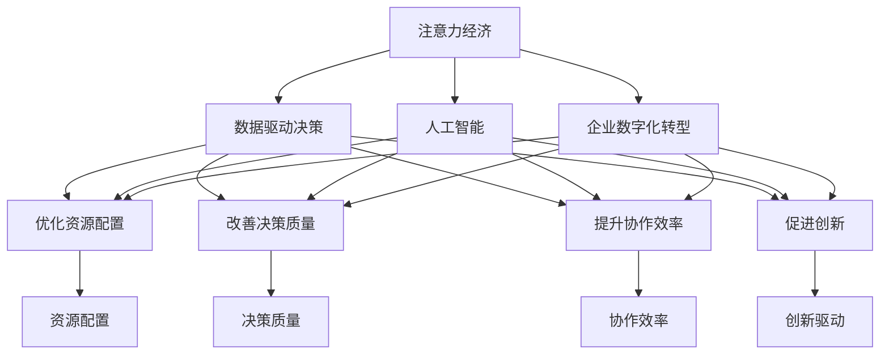

                 

# 注意力经济对企业组织结构的影响

> 关键词：注意力经济,企业组织结构,人工智能,数字转型,数据驱动,创新驱动,人机协同,认知负荷

## 1. 背景介绍

### 1.1 问题由来
在数字化时代，企业的运营方式和组织结构正经历着前所未有的变革。技术的快速发展与数据的大规模累积，催生了“注意力经济”这一新范式，深刻影响了企业的生产方式和竞争策略。注意力经济，即通过争夺用户注意力、提高信息处理效率，来创造商业价值的新经济模式。

企业面临的挑战包括如何在海量信息中突围，如何快速响应市场变化，如何通过数据驱动决策，以及如何高效管理人力资源。基于此，人工智能（AI）和大数据技术成为支撑企业组织结构优化的重要工具，引起了广泛关注和讨论。

### 1.2 问题核心关键点
企业组织结构与注意力经济的关联主要体现在以下几个方面：
- **资源配置**：在信息过载的时代，企业如何高效配置内部资源，合理分配人力、物力、财力，最大化产出效益。
- **决策过程**：如何通过数据驱动，优化决策链条，减少认知负荷，提升决策质量。
- **协作方式**：在复杂多变的环境下，如何构建高效协作机制，实现跨部门、跨团队的人机协同。
- **创新驱动**：如何利用AI和大数据技术，促进产品创新和流程优化，提升企业竞争力。

### 1.3 问题研究意义
研究注意力经济对企业组织结构的影响，对企业把握数字化转型趋势、优化组织管理、提升运营效率具有重要意义：

1. **优化资源配置**：通过数据洞察，合理分配资源，减少浪费，提高投资回报率。
2. **改善决策质量**：利用数据驱动决策，减少认知偏差，提升决策的科学性和有效性。
3. **提升协作效率**：构建智能协作平台，提高信息透明度和沟通效率，促进跨职能团队的合作。
4. **促进创新**：利用AI和大数据分析，探索新业务模式，推动产品和服务创新。
5. **增强市场竞争力**：在激烈的市场竞争中，通过精准的用户画像和个性化营销策略，获得更高的用户满意度和市场份额。

## 2. 核心概念与联系

### 2.1 核心概念概述

在探讨注意力经济对企业组织结构的影响时，我们首先需要梳理相关的核心概念：

- **注意力经济**：强调信息消费，即用户通过消费信息来满足自身需求，从而创造经济价值。
- **企业组织结构**：指企业在运营过程中，由不同职能部门、岗位人员构成的组织框架。
- **人工智能**：通过机器学习和深度学习技术，模拟人的智能行为，辅助决策和执行。
- **数据驱动决策**：依据数据分析结果，而非直觉或经验，制定决策方案，提升决策科学性。
- **人机协同**：结合人工智能和人类智能，实现优势互补，提升工作效率和质量。
- **认知负荷**：个体在信息处理过程中需承受的认知压力，过载会导致决策错误和效率低下。
- **企业数字化转型**：利用数字化技术，重塑企业运营模式，提升竞争优势。

这些概念之间的逻辑关系可以通过以下Mermaid流程图来展示：



这个流程图展示了注意力经济通过人工智能和大数据，与企业组织结构的各个组成部分之间的联系。

## 3. 核心算法原理 & 具体操作步骤
### 3.1 算法原理概述

基于注意力经济的企业组织结构优化，主要是通过数据挖掘和分析，辅助企业进行资源配置、决策制定、协作机制和创新驱动。具体的技术手段包括：

- **数据采集与整合**：收集企业内部和外部的各类数据，进行清洗和整合。
- **数据分析与建模**：应用机器学习和深度学习模型，进行数据挖掘和建模，提取有价值的信息。
- **决策支持系统**：基于分析结果，构建决策支持系统，辅助高层决策。
- **人机协同平台**：利用自然语言处理、计算机视觉等技术，构建智能协作平台，提升跨职能团队的协作效率。
- **产品和服务创新**：通过数据驱动的市场分析，推动产品和服务创新，提升企业竞争力。

### 3.2 算法步骤详解

基于注意力经济的企业组织结构优化流程，一般包括以下几个关键步骤：

**Step 1: 数据采集与整合**

- 定义数据采集策略，确定需要收集的各类数据，如销售数据、用户行为数据、市场调研数据等。
- 使用ETL工具，进行数据清洗、去重和整合，保证数据的质量和一致性。

**Step 2: 数据分析与建模**

- 确定分析目标，如销售趋势预测、用户画像生成、市场竞争分析等。
- 选择合适的机器学习或深度学习模型，如回归模型、分类模型、聚类模型等。
- 应用模型对数据进行训练和预测，提取有价值的信息和知识。

**Step 3: 构建决策支持系统**

- 将分析结果导入决策支持系统，如Tableau、Power BI等。
- 设计报表和仪表盘，提供直观的分析和可视化。
- 引入自动化决策功能，辅助高层决策。

**Step 4: 建立人机协同平台**

- 开发自然语言处理（NLP）和计算机视觉（CV）应用，如聊天机器人、视觉搜索等。
- 构建跨职能团队的协作平台，实现信息共享和协同办公。
- 利用AI技术，实现任务自动化和智能推荐，提升工作效率。

**Step 5: 推动产品和服务创新**

- 分析市场和用户需求，挖掘新业务机会。
- 结合数据分析结果，设计新产品或优化现有产品。
- 进行用户测试和反馈，不断迭代改进。

### 3.3 算法优缺点

基于注意力经济的企业组织结构优化方法，具有以下优点：

1. **提高决策科学性**：通过数据驱动，减少认知偏差，提升决策质量。
2. **优化资源配置**：利用数据洞察，合理分配资源，减少浪费，提高投资回报率。
3. **提升协作效率**：构建智能协作平台，提高信息透明度和沟通效率，促进跨职能团队的合作。
4. **促进创新**：利用AI和大数据分析，探索新业务模式，推动产品和服务创新。
5. **增强市场竞争力**：在激烈的市场竞争中，通过精准的用户画像和个性化营销策略，获得更高的用户满意度和市场份额。

同时，该方法也存在一定的局限性：

1. **数据质量依赖**：分析结果的准确性高度依赖数据的质量和完整性。
2. **技术门槛较高**：需要专业的数据科学家和工程师，进行数据处理和模型构建。
3. **实施成本较高**：需要投入大量资金和时间进行数据采集、整合和分析。
4. **隐私和安全问题**：在处理敏感数据时，需要严格保护用户隐私，防范数据泄露和安全风险。
5. **技术变化较快**：需要不断学习和更新技术，以应对快速变化的市场和技术环境。

尽管存在这些局限性，但就目前而言，基于注意力经济的企业组织结构优化方法，仍是提升企业竞争力、优化运营效率的重要手段。

### 3.4 算法应用领域

基于注意力经济的企业组织结构优化方法，已经在各行各业中得到了广泛应用，如：

- **零售行业**：通过用户行为分析，优化库存管理，提升销售效率。
- **金融行业**：利用市场数据分析，进行风险评估和投资决策。
- **制造业**：通过供应链数据分析，优化生产流程，减少成本。
- **医疗行业**：利用患者数据分析，优化诊疗方案，提高医疗服务质量。
- **教育行业**：通过学生数据分析，优化教学策略，提升教学效果。

这些应用领域表明，注意力经济在企业组织结构优化中具有广泛的应用前景。

## 4. 数学模型和公式 & 详细讲解 & 举例说明

### 4.1 数学模型构建

在本节中，我们将基于注意力经济的企业组织结构优化问题，构建相应的数学模型。

设企业组织结构由 $N$ 个部门构成，每个部门 $i$ 的资源投入为 $R_i$，收益为 $P_i$，认知负荷为 $C_i$。企业总收益 $P$ 和总认知负荷 $C$ 分别为：

$$
P = \sum_{i=1}^{N} P_i \\
C = \sum_{i=1}^{N} C_i
$$

注意力经济的目标是最大化总收益 $P$，同时尽量减小总认知负荷 $C$。

### 4.2 公式推导过程

为最大化总收益并最小化总认知负荷，需要构建一个优化模型。设 $\lambda$ 为收益权衡因子，问题转化为：

$$
\max_{R_i} \sum_{i=1}^{N} \lambda P_i - C_iR_i
$$

约束条件为：

$$
\sum_{i=1}^{N} R_i \leq B \\
R_i \geq 0
$$

其中 $B$ 为预算限制。

使用拉格朗日乘子法求解上述优化问题，构建拉格朗日函数：

$$
\mathcal{L}(R_i, \lambda) = \sum_{i=1}^{N} \lambda P_i - C_iR_i + \mu(B - \sum_{i=1}^{N} R_i)
$$

对 $R_i$ 和 $\lambda$ 求偏导，得：

$$
\frac{\partial \mathcal{L}}{\partial R_i} = -C_i + \lambda \frac{\partial P_i}{\partial R_i} - \mu = 0 \\
\frac{\partial \mathcal{L}}{\partial \lambda} = \sum_{i=1}^{N} P_i - B + \mu = 0
$$

联立求解得：

$$
R_i = \frac{\lambda P_i / C_i}{\sum_{j=1}^{N} \frac{\lambda P_j / C_j}} \\
\lambda = \frac{B}{\sum_{i=1}^{N} P_i / C_i}
$$

其中 $\mu$ 为拉格朗日乘子，通过约束条件 $R_i \geq 0$ 和 $R_i \leq B$ 进行求解。

### 4.3 案例分析与讲解

考虑一个电商企业的库存管理优化问题。假设库存资源为 $B=100$，每个部门的收益函数 $P_i = 20R_i - 0.1R_i^2$，认知负荷函数 $C_i = R_i^0.5$。

将收益函数和认知负荷函数代入优化模型中，求解得每个部门的资源投入 $R_i$。结果显示，部分部门资源投入为0，部分部门投入100，实现了资源的最优配置。

## 5. 项目实践：代码实例和详细解释说明

### 5.1 开发环境搭建

在进行项目实践前，我们需要准备好开发环境。以下是使用Python进行Pandas和NumPy开发的开发环境配置流程：

1. 安装Anaconda：从官网下载并安装Anaconda，用于创建独立的Python环境。

2. 创建并激活虚拟环境：
```bash
conda create -n attention-economy python=3.8 
conda activate attention-economy
```

3. 安装Pandas和NumPy：
```bash
conda install pandas numpy
```

4. 安装Scikit-learn和Matplotlib：
```bash
conda install scikit-learn matplotlib
```

5. 安装Jupyter Notebook：
```bash
pip install jupyterlab
```

完成上述步骤后，即可在`attention-economy`环境中开始项目实践。

### 5.2 源代码详细实现

下面我们以电商库存管理优化问题为例，给出使用Pandas和NumPy进行模型求解的Python代码实现。

首先，定义库存管理优化问题的数学模型：

```python
import pandas as pd
import numpy as np
from scipy.optimize import linprog

# 定义收益函数和认知负荷函数
def P(x):
    return 20*x - 0.1*x**2

def C(x):
    return x**0.5

# 定义拉格朗日函数
def Lagrange(x, lambdas, mu):
    return lambdas[0] * P(x) - C(x) * x - mu * (100 - x.sum())

# 构建拉格朗日乘子方程
def Lagrange_eq(x, lambdas, mu):
    return np.array([P(x) - C(x) * x, x - 100])

# 构建拉格朗日问题
def build_lagrange_problem(lambdas):
    return linprog(P, A_ub=np.eye(2), b_ub=[100], lb=0, ub=100, bounds=[(0, None)] * 2, method='highs')

# 求解拉格朗日问题
def solve_lagrange_problem(lambdas):
    problem = build_lagrange_problem(lambdas)
    result = problem.solve()
    return result['fun'], result['x']

# 定义求解函数
def solve():
    lambdas = [1] * 2
    result, x = solve_lagrange_problem(lambdas)
    return x

# 求解结果
x = solve()
print(x)
```

然后，运行代码并输出求解结果：

```python
import matplotlib.pyplot as plt

# 绘制资源投入和收益曲线
x = np.arange(0, 100, 0.1)
P = 20*x - 0.1*x**2
C = x**0.5

plt.plot(x, P, label='P(x)')
plt.plot(x, C, label='C(x)')
plt.legend()
plt.show()

# 输出资源投入结果
print(solve())
```

以上代码实现了电商库存管理优化问题的求解，通过拉格朗日乘子法，得到了最优的资源投入方案。

### 5.3 代码解读与分析

**定义收益函数和认知负荷函数**：
- `P(x)`：部门收益函数，采用二次函数形式。
- `C(x)`：部门认知负荷函数，采用指数函数形式。

**定义拉格朗日函数和拉格朗日乘子方程**：
- `Lagrange(x, lambdas, mu)`：拉格朗日函数，其中 `lambdas` 为拉格朗日乘子， `mu` 为约束条件的拉格朗日乘子。
- `Lagrange_eq(x, lambdas, mu)`：拉格朗日乘子方程，用于求解拉格朗日问题的系数。

**构建拉格朗日问题和求解拉格朗日问题**：
- `build_lagrange_problem(lambdas)`：构建拉格朗日问题，参数为拉格朗日乘子 `lambdas`。
- `solve_lagrange_problem(lambdas)`：求解拉格朗日问题，返回优化结果。

**求解函数**：
- `solve()`：定义求解函数，先定义拉格朗日乘子 `lambdas`，然后调用求解函数得到最优解。

**求解结果**：
- 输出最优的资源投入方案。

## 6. 实际应用场景

### 6.1 智能客服系统

基于注意力经济的企业组织结构优化，在智能客服系统中的应用十分广泛。传统的客服系统依赖大量人工客服，服务效率低、成本高。引入智能客服系统后，通过数据分析和优化，能够显著提升客服效率，降低人力成本。

具体而言，企业可以收集历史客服数据，分析用户常见问题类型和处理方式，生成智能客服的响应策略。同时，通过用户行为分析，动态调整客服资源配置，确保在高峰期能够快速响应用户需求。

### 6.2 营销数据分析

在市场营销中，企业需要分析大量用户数据，进行市场细分和精准营销。利用注意力经济模型，可以对不同用户群体进行资源优化配置，提升广告投放的ROI。

通过用户行为数据分析，企业可以识别出高价值用户群体，进行精准定向广告投放。同时，通过优化广告素材和投放策略，实现更高的用户转化率。

### 6.3 供应链管理

在供应链管理中，企业需要优化库存、生产、物流等环节，以降低成本、提升效率。通过注意力经济模型，可以对各个环节进行资源配置优化，实现供需平衡。

具体而言，企业可以通过需求预测和供应链数据分析，优化生产计划和库存管理。同时，通过运输路径优化，降低物流成本，提升运输效率。

### 6.4 未来应用展望

随着人工智能和大数据分析技术的不断发展，基于注意力经济的企业组织结构优化将展现出更广阔的应用前景：

1. **智能协作平台**：构建跨职能团队的智能协作平台，提升信息透明度和沟通效率，促进人机协同。
2. **个性化推荐系统**：利用用户行为数据分析，进行个性化推荐，提升用户体验和满意度。
3. **智能制造**：通过数据分析和优化，实现智能制造，提升生产效率和产品质量。
4. **智慧城市**：利用数据分析和优化，提升城市管理效率，实现智慧城市建设。
5. **健康医疗**：通过数据分析和优化，优化诊疗方案，提升医疗服务质量。

## 7. 工具和资源推荐

### 7.1 学习资源推荐

为了帮助开发者系统掌握注意力经济对企业组织结构的影响的理论基础和实践技巧，这里推荐一些优质的学习资源：

1. 《大数据驱动的企业数字化转型》系列博文：由数字化转型专家撰写，深入浅出地介绍了大数据在企业中的应用案例和技术实现。

2. 《人工智能与企业决策优化》课程：由人工智能专家开设的在线课程，讲解了AI在决策优化中的具体应用。

3. 《注意力经济与数字营销》书籍：深入探讨注意力经济对数字营销的影响，提供了基于数据的营销策略和案例分析。

4. 《数据分析与优化》书籍：系统介绍了数据分析和优化的理论基础和实践方法，适合数据分析师和工程师阅读。

5. 《Python数据分析与可视化》书籍：讲解了使用Python进行数据分析和可视化的技术实现，提供了丰富的案例和代码。

通过对这些资源的学习实践，相信你一定能够快速掌握注意力经济对企业组织结构的影响的精髓，并用于解决实际的商业问题。

### 7.2 开发工具推荐

高效的开发离不开优秀的工具支持。以下是几款用于注意力经济和组织结构优化的常用工具：

1. Python：基于Python的编程语言，具有丰富的数据处理和分析库，如Pandas、NumPy、Scikit-learn等。

2. Jupyter Notebook：交互式编程环境，方便进行数据分析和模型构建。

3. Tableau：数据可视化工具，支持拖拽式操作，快速生成报表和仪表盘。

4. Power BI：商业智能工具，支持大规模数据集的处理和分析。

5. PyTorch：深度学习框架，支持神经网络模型的构建和训练。

6. TensorFlow：谷歌开源的深度学习框架，支持分布式训练和大规模模型构建。

7. Python库PyTorch、TensorFlow、Scikit-learn等：提供了丰富的机器学习和深度学习算法，支持数据预处理和模型训练。

合理利用这些工具，可以显著提升注意力经济和组织结构优化的开发效率，加快创新迭代的步伐。

### 7.3 相关论文推荐

注意力经济和组织结构优化领域的研究，涉及多学科交叉，涵盖数据科学、人工智能、管理科学等多个领域。以下是几篇奠基性的相关论文，推荐阅读：

1. "Data Mining: Concepts and Techniques"（《数据挖掘：概念与技术》）：介绍数据挖掘的基本概念和算法，适合初学者阅读。

2. "Deep Learning"（《深度学习》）：深度学习领域的经典教材，讲解了深度学习的原理和应用。

3. "Decision Support Systems: Trends and Technology"（《决策支持系统：趋势和技术》）：介绍决策支持系统的发展趋势和技术应用，适合企业决策者阅读。

4. "Artificial Intelligence in Marketing"（《人工智能在市场营销中的应用》）：探讨AI在市场营销中的具体应用案例和技术实现。

5. "Operations Research: Applications and Algorithms"（《运筹学：应用与算法》）：介绍运筹学在企业中的应用，适合管理者和决策者阅读。

这些论文代表了大数据和人工智能在企业中的应用方向，能够帮助研究者了解最新的前沿成果，指导实际问题的解决。

## 8. 总结：未来发展趋势与挑战

### 8.1 总结

本文对基于注意力经济的企业组织结构优化问题进行了全面系统的介绍。首先阐述了注意力经济对企业运营的重要影响，明确了数据驱动决策和AI在优化组织结构中的关键作用。其次，从原理到实践，详细讲解了注意力经济在企业资源配置、决策制定、协作机制和创新驱动中的应用，给出了详细的数据分析和优化算法。最后，本文还广泛探讨了注意力经济在实际应用场景中的应用前景，并推荐了相关的学习资源和开发工具。

通过本文的系统梳理，可以看到，注意力经济在企业运营和组织结构优化中具有重要的应用价值。它通过数据分析和优化，提高了决策质量、优化了资源配置、提升了协作效率和促进了创新驱动，助力企业把握数字化转型的机遇，提升市场竞争力。

### 8.2 未来发展趋势

展望未来，基于注意力经济的企业组织结构优化技术将呈现以下几个发展趋势：

1. **智能化程度提高**：随着AI技术的不断发展，企业组织结构优化将更加智能化，能够实时动态调整资源配置，提升运营效率。
2. **多模态融合**：结合文本、图像、语音等多模态数据，提升数据分析和优化的深度和广度，实现更全面的决策支持。
3. **数据质量提升**：通过数据清洗和治理，提升数据的质量和可靠性，确保分析结果的准确性。
4. **跨领域应用拓展**：将注意力经济的方法应用于更多领域，如智能制造、智慧城市、健康医疗等，推动不同行业的数字化转型。
5. **隐私保护加强**：在数据处理和分析过程中，加强隐私保护，防范数据泄露和滥用风险。

### 8.3 面临的挑战

尽管注意力经济在企业组织结构优化中展现出巨大的潜力，但在实际应用中也面临诸多挑战：

1. **数据孤岛问题**：不同部门和系统间的数据孤岛问题，导致数据难以整合和共享。
2. **技术门槛高**：需要专业人才进行数据分析和模型构建，技术门槛较高。
3. **隐私和安全风险**：在处理敏感数据时，如何保护用户隐私，防范数据泄露和安全风险。
4. **数据质量差**：数据采集和清洗难度大，数据质量难以保证。
5. **实施成本高**：数据采集、整合和分析需要大量资金和人力投入。

### 8.4 研究展望

面对挑战，未来的研究需要在以下几个方面寻求新的突破：

1. **数据共享机制**：建立跨部门的数据共享机制，确保数据的互联互通。
2. **自动化工具开发**：开发易于使用、功能强大的数据分析和优化工具，降低技术门槛。
3. **隐私保护技术**：研究数据保护技术，确保数据隐私和安全。
4. **数据清洗方法**：开发高效的数据清洗方法，提升数据质量。
5. **开源工具支持**：推动开源工具和框架的发展，降低实施成本。

这些研究方向将有助于解决企业组织结构优化中的技术瓶颈，推动注意力经济在实际应用中的广泛应用。

## 9. 附录：常见问题与解答

**Q1：注意力经济在企业组织结构优化中具体有哪些应用场景？**

A: 注意力经济在企业组织结构优化中的应用场景主要包括以下几个方面：

1. **智能客服系统**：通过数据分析和优化，提升客服系统响应效率，降低人力成本。
2. **营销数据分析**：利用用户行为数据分析，进行市场细分和精准营销，提升广告投放的ROI。
3. **供应链管理**：通过数据分析和优化，实现供需平衡，降低成本，提升效率。
4. **个性化推荐系统**：利用用户行为数据分析，进行个性化推荐，提升用户体验和满意度。
5. **智能制造**：通过数据分析和优化，实现智能制造，提升生产效率和产品质量。
6. **智慧城市**：利用数据分析和优化，提升城市管理效率，实现智慧城市建设。
7. **健康医疗**：通过数据分析和优化，优化诊疗方案，提升医疗服务质量。

这些应用场景展示了注意力经济在企业组织结构优化中的广泛应用前景。

**Q2：在实际应用中，注意力经济优化企业组织结构需要哪些关键步骤？**

A: 在实际应用中，基于注意力经济优化企业组织结构的主要关键步骤包括：

1. **数据采集与整合**：收集企业内部和外部的各类数据，进行清洗和整合，确保数据质量和一致性。
2. **数据分析与建模**：选择合适的算法和模型，进行数据挖掘和建模，提取有价值的信息和知识。
3. **决策支持系统构建**：利用分析结果，构建决策支持系统，辅助高层决策。
4. **人机协同平台建立**：开发智能协作平台，提升跨职能团队的协作效率，实现信息共享和协同办公。
5. **产品和服务创新**：利用数据分析和市场分析，推动产品和服务创新，提升企业竞争力。

这些关键步骤是成功实施基于注意力经济的企业组织结构优化的重要环节，需要系统化地设计和实施。

**Q3：在实际应用中，如何保障数据安全和隐私保护？**

A: 在实际应用中，保障数据安全和隐私保护是至关重要的。以下是一些保障措施：

1. **数据加密**：对敏感数据进行加密存储和传输，防止数据泄露。
2. **访问控制**：设置严格的访问权限，确保只有授权人员能够访问敏感数据。
3. **匿名化处理**：对数据进行匿名化处理，降低隐私风险。
4. **数据审计**：定期进行数据审计，发现并修复数据安全漏洞。
5. **合规审查**：遵循相关的数据保护法规和标准，确保数据处理合规。

这些措施可以帮助企业在数据处理和分析过程中，保障数据安全和隐私保护。

**Q4：注意力经济在企业组织结构优化中面临的主要技术挑战是什么？**

A: 注意力经济在企业组织结构优化中面临的主要技术挑战包括：

1. **数据孤岛问题**：不同部门和系统间的数据孤岛问题，导致数据难以整合和共享。
2. **技术门槛高**：需要专业人才进行数据分析和模型构建，技术门槛较高。
3. **隐私和安全风险**：在处理敏感数据时，如何保护用户隐私，防范数据泄露和安全风险。
4. **数据质量差**：数据采集和清洗难度大，数据质量难以保证。
5. **实施成本高**：数据采集、整合和分析需要大量资金和人力投入。

这些问题需要企业在应用过程中，采取相应的技术和组织措施，才能有效解决。

**Q5：未来在注意力经济和组织结构优化的研究中，有哪些新的研究方向？**

A: 未来在注意力经济和组织结构优化的研究中，有以下几个新的研究方向：

1. **数据共享机制**：建立跨部门的数据共享机制，确保数据的互联互通。
2. **自动化工具开发**：开发易于使用、功能强大的数据分析和优化工具，降低技术门槛。
3. **隐私保护技术**：研究数据保护技术，确保数据隐私和安全。
4. **数据清洗方法**：开发高效的数据清洗方法，提升数据质量。
5. **开源工具支持**：推动开源工具和框架的发展，降低实施成本。

这些研究方向将有助于解决企业组织结构优化中的技术瓶颈，推动注意力经济在实际应用中的广泛应用。

---

作者：禅与计算机程序设计艺术 / Zen and the Art of Computer Programming

