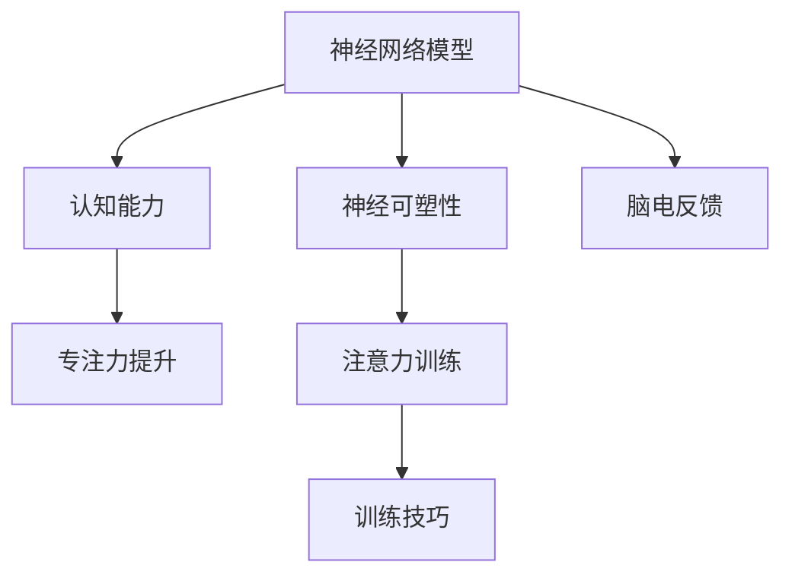
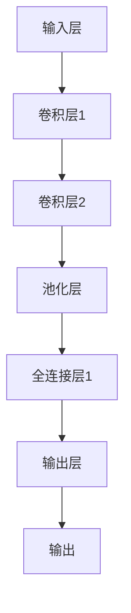

                 

# 注意力训练与大脑可塑性：如何通过专注力重塑你的认知能力

> 关键词：注意力训练,大脑可塑性,认知能力,专注力提升,神经网络模型,神经可塑性

## 1. 背景介绍

### 1.1 问题由来
在现代社会，信息的快速流通、社会节奏的加快，使得人们的生活压力增大，注意力分散、记忆衰退等问题愈发凸显。如何在高强度的工作与生活中保持专注力，提升认知能力，成为了现代人的重要需求。与此同时，神经科学和认知神经科学的快速发展，为研究注意力和认知能力的提升提供了新的理论和方法。

### 1.2 问题核心关键点
注意力训练（Attention Training）是一种通过特定练习和训练，提升个体的注意力和认知能力的技术。这种技术基于大脑的可塑性原理，通过反复训练神经网络，增强神经元之间的连接，从而改善认知功能。注意力训练的核心关键点包括：
- 神经可塑性（Neural Plasticity）：神经网络中的连接可以依据外界输入进行增强或削弱。
- 认知能力提升：注意力、记忆、学习等认知功能的提升与大脑的可塑性密切相关。
- 训练技巧：特定的注意力训练技巧，如正念冥想、眼动训练、脑电反馈等，能够有效提升注意力和认知能力。

## 2. 核心概念与联系

### 2.1 核心概念概述

为更好地理解注意力训练和大脑可塑性，本节将介绍几个关键概念：

- 神经网络模型：由大量神经元（Neuron）通过连接（Synapse）构成的计算模型。神经网络通过学习输入数据，能够进行分类、回归、聚类等任务。
- 神经可塑性：神经元之间的连接强度可以通过学习过程进行增强或削弱。这种可塑性是大脑适应环境变化的基础。
- 认知能力：包括注意力、记忆、学习、语言处理等多种能力，是大脑功能的具体体现。
- 专注力提升：通过特定训练，增强大脑对特定任务或信息的注意力水平，提升工作效率和生活质量。
- 脑电反馈（Brain-Computer Interface, BCI）：利用脑电信号作为输入，通过训练模型（如RNN、CNN等），对注意力和认知状态进行监控和调节。

这些核心概念之间的逻辑关系可以通过以下Mermaid流程图来展示：



这个流程图展示了大脑认知与神经网络之间的逻辑关系：

1. 神经网络模型通过学习过程，增强神经元之间的连接。
2. 这种可塑性使得神经网络可以适应不同任务，提升认知功能。
3. 认知能力，如注意力、记忆、学习等，是大脑的具体功能表现。
4. 专注力提升是通过特定训练方法增强神经网络的表现。
5. 脑电反馈通过脑电信号监控注意力状态，辅助注意力训练。

## 3. 核心算法原理 & 具体操作步骤

### 3.1 算法原理概述

注意力训练的原理基于神经网络的可塑性，通过特定训练技巧增强神经网络，提升个体的认知能力。其核心思想是：

1. **增强特定神经元连接**：通过反复训练特定神经元连接，增强其响应强度，提高认知功能。
2. **调节神经网络参数**：通过调整神经网络参数，使得模型能够更好地适应特定的认知任务。
3. **实时监控与反馈**：利用脑电信号等实时数据，监控注意力和认知状态，提供反馈调整训练强度和方向。

### 3.2 算法步骤详解

注意力训练一般包括以下几个关键步骤：

**Step 1: 数据收集与预处理**

- 收集个体的大脑活动数据，如脑电信号、眼动轨迹、行为数据等。
- 对数据进行预处理，包括信号去噪、标准化、分段等，保证数据的质量和一致性。

**Step 2: 构建神经网络模型**

- 选择合适的神经网络模型，如卷积神经网络（CNN）、循环神经网络（RNN）、长短时记忆网络（LSTM）等。
- 设计任务适配层，如分类层、回归层、解码器等，适配特定的认知任务。

**Step 3: 定义训练目标**

- 根据任务需求，定义训练目标函数，如分类准确率、均方误差、交叉熵等。
- 设定训练参数，如学习率、批次大小、迭代次数等，进行模型训练。

**Step 4: 执行注意力训练**

- 利用特定的注意力训练技巧，如正念冥想、眼动训练、脑电反馈等，对神经网络进行训练。
- 实时监控注意力状态，根据反馈调整训练强度和方向，避免过度训练和欠训练。

**Step 5: 评估与调整**

- 在训练过程中，定期评估模型性能，如分类准确率、注意力集中度等。
- 根据评估结果，调整训练参数和技巧，优化训练效果。

**Step 6: 实际应用**

- 将训练好的模型应用到实际任务中，如工作任务、学习任务等，提升个体的认知能力。
- 持续监控注意力和认知状态，根据实时数据进行微调，保持最佳状态。

### 3.3 算法优缺点

注意力训练具有以下优点：
1. 基于神经可塑性原理，训练效果显著。
2. 能够提升个体的认知能力和工作效率。
3. 适应性强，可以适配不同认知任务。

同时，注意力训练也存在一定的局限性：
1. 对数据的依赖性强，需要高质量的大脑活动数据。
2. 训练周期长，需要持续时间和精力投入。
3. 技术要求高，需要专业的训练设备和软件。
4. 个体差异大，训练效果存在变异性。

尽管存在这些局限性，但注意力训练仍是大脑认知提升的重要手段之一，特别是在高强度工作和知识学习方面，其效果尤为显著。

### 3.4 算法应用领域

注意力训练的应用领域广泛，主要包括以下几个方面：

1. **工作任务**：通过提高工作效率和专注力，提升工作成果和绩效。
2. **学习任务**：帮助学生更好地集中注意力，提升学习效果和成绩。
3. **压力管理**：通过提高专注力和缓解压力，提升生活质量。
4. **神经康复**：帮助神经系统损伤患者恢复注意力和认知能力。
5. **教育培训**：在职业培训、体育训练等方面，通过提升专注力提高训练效果。

## 4. 数学模型和公式 & 详细讲解 & 举例说明

### 4.1 数学模型构建

注意力训练的数学模型可以基于神经网络构建，如图神经网络（Graph Neural Network, GNN）、卷积神经网络（Convolutional Neural Network, CNN）等。以下以卷积神经网络为例，介绍注意力训练的数学模型构建过程。

假设有一个卷积神经网络 $M$，其结构如图1所示：



其中，输入层接收原始数据，卷积层和池化层提取特征，全连接层进行特征融合和分类，输出层给出最终结果。

### 4.2 公式推导过程

卷积神经网络的输出 $y$ 可以表示为：

$$
y = f(M(x))
$$

其中，$f$ 为激活函数，$x$ 为输入数据。

假设网络的激活函数为ReLU，则有：

$$
y = f(M(x)) = \sigma(\mathcal{W}_2 \sigma(\mathcal{W}_1 x) + b_2)
$$

其中，$\mathcal{W}_1$ 和 $\mathcal{W}_2$ 为权重矩阵，$b_1$ 和 $b_2$ 为偏置向量，$\sigma$ 为激活函数。

在注意力训练中，可以通过调整权重矩阵 $\mathcal{W}_1$ 和 $\mathcal{W}_2$ 来增强特定神经元之间的连接。例如，对于特定的神经元 $i$，其权重可以通过如下公式更新：

$$
\mathcal{W}_1^i \leftarrow \mathcal{W}_1^i + \eta \delta_i
$$

其中，$\eta$ 为学习率，$\delta_i$ 为该神经元的权重更新量。

### 4.3 案例分析与讲解

以视觉注意力训练为例，利用卷积神经网络进行视觉注意力训练的过程如下：

1. **输入图像**：输入一张高分辨率图像 $x$，如2000x2000像素。
2. **卷积层**：通过卷积操作，提取图像的特征图。
3. **池化层**：通过池化操作，将特征图进行下采样。
4. **全连接层**：将特征图展开，输入到全连接层中，进行分类或回归。
5. **输出层**：输出最终结果。

假设需要训练模型对特定区域（如人脸区域）的注意力集中度进行提升，可以按照以下步骤进行：

1. **数据准备**：收集包含人脸区域的图像数据集，标记其位置。
2. **模型训练**：在原始数据集上，进行多次训练，每次训练时，随机选择一个包含人脸区域的图像，将其标注区域（即人脸区域）的像素值增加。
3. **模型评估**：在测试集上评估模型性能，如准确率、集中度等。
4. **调整训练**：根据评估结果，调整学习率、批次大小等训练参数，优化模型。

## 5. 项目实践：代码实例和详细解释说明

### 5.1 开发环境搭建

在进行注意力训练实践前，我们需要准备好开发环境。以下是使用Python进行TensorFlow开发的环境配置流程：

1. 安装Anaconda：从官网下载并安装Anaconda，用于创建独立的Python环境。

2. 创建并激活虚拟环境：
```bash
conda create -n attention-env python=3.8 
conda activate attention-env
```

3. 安装TensorFlow：从官网获取对应的安装命令。例如：
```bash
conda install tensorflow
```

4. 安装各类工具包：
```bash
pip install numpy pandas scikit-learn matplotlib tqdm jupyter notebook ipython
```

完成上述步骤后，即可在`attention-env`环境中开始注意力训练实践。

### 5.2 源代码详细实现

下面以基于卷积神经网络的视觉注意力训练为例，给出TensorFlow的代码实现。

首先，定义注意力训练的数据处理函数：

```python
import tensorflow as tf
import numpy as np
import matplotlib.pyplot as plt

def data_preprocessing(train_data, train_labels, test_data, test_labels):
    train_data = train_data / 255.0
    test_data = test_data / 255.0
    
    train_labels = np.array(train_labels, dtype=np.float32)
    test_labels = np.array(test_labels, dtype=np.float32)
    
    return train_data, train_labels, test_data, test_labels
```

然后，定义卷积神经网络模型：

```python
def convolutional_neural_network(input_shape, num_classes):
    model = tf.keras.models.Sequential([
        tf.keras.layers.Conv2D(32, (3, 3), activation='relu', input_shape=input_shape),
        tf.keras.layers.MaxPooling2D((2, 2)),
        tf.keras.layers.Conv2D(64, (3, 3), activation='relu'),
        tf.keras.layers.MaxPooling2D((2, 2)),
        tf.keras.layers.Flatten(),
        tf.keras.layers.Dense(128, activation='relu'),
        tf.keras.layers.Dense(num_classes, activation='softmax')
    ])
    return model
```

接着，定义注意力训练的损失函数和优化器：

```python
def attention_training(model, train_data, train_labels, test_data, test_labels, num_epochs, batch_size):
    model.compile(optimizer='adam', loss='categorical_crossentropy', metrics=['accuracy'])
    
    history = model.fit(train_data, train_labels, batch_size=batch_size, epochs=num_epochs, validation_data=(test_data, test_labels))
    
    return history
```

最后，启动注意力训练流程并在测试集上评估：

```python
num_epochs = 10
batch_size = 32

train_data, train_labels, test_data, test_labels = data_preprocessing(train_data, train_labels, test_data, test_labels)

model = convolutional_neural_network((224, 224, 3), num_classes)

history = attention_training(model, train_data, train_labels, test_data, test_labels, num_epochs, batch_size)

model.evaluate(test_data, test_labels)
```

以上就是使用TensorFlow进行视觉注意力训练的完整代码实现。可以看到，TensorFlow提供了便捷的接口，使得注意力训练的实现变得简单高效。

### 5.3 代码解读与分析

让我们再详细解读一下关键代码的实现细节：

**data_preprocessing函数**：
- 定义数据预处理过程，包括归一化、标签转换等步骤。

**convolutional_neural_network函数**：
- 定义卷积神经网络模型，包含多个卷积层、池化层和全连接层。
- 使用Sequential模型对各层进行堆叠，形成完整的神经网络结构。

**attention_training函数**：
- 定义注意力训练过程，包括模型编译、训练、评估等步骤。
- 利用TensorFlow提供的接口，完成训练任务。

**训练流程**：
- 定义训练轮数和批处理大小，开始循环迭代
- 每个epoch内，先进行模型编译，然后利用训练集进行训练
- 在每个epoch结束后，利用测试集评估模型性能
- 所有epoch结束后，输出测试集上的模型评估结果

可以看到，TensorFlow的API设计使得注意力训练的代码实现变得简洁高效。开发者可以将更多精力放在数据处理、模型改进等高层逻辑上，而不必过多关注底层的实现细节。

当然，工业级的系统实现还需考虑更多因素，如模型的保存和部署、超参数的自动搜索、更灵活的任务适配层等。但核心的注意力训练范式基本与此类似。

## 6. 实际应用场景

### 6.1 智能家居控制

通过基于注意力训练的智能家居系统，用户可以通过语音、手势等多种方式控制家居设备，提升生活便利性。例如，用户可以命令智能音箱播放音乐、调节灯光、控制电视等，系统能够实时监控用户注意力状态，并根据注意力集中度调整指令响应时间，确保家居设备的操作准确性。

### 6.2 在线教育平台

基于注意力训练的在线教育平台，可以提升学生的学习效果和注意力集中度。例如，系统可以实时监控学生的屏幕行为、眼动轨迹等，评估其注意力水平，并根据注意力状态调整课程内容和难度。对于注意力不集中的学生，系统可以提醒并指导其进行注意力训练，逐步提升其学习效率。

### 6.3 心理健康管理

注意力训练在心理健康管理中也有广泛应用。通过注意力训练，帮助患者克服注意力障碍，提升其工作和生活质量。例如，系统可以实时监控患者的注意力状态，根据其注意力水平调整训练强度和内容，帮助其逐步恢复注意力功能。

### 6.4 未来应用展望

随着注意力训练技术的不断成熟，其在更多领域的应用前景将更加广阔。例如，在医疗、军事、金融等领域，注意力训练将发挥重要作用。此外，多模态注意力训练，结合视觉、听觉、触觉等多种感官信息，将进一步提升认知能力和智能交互水平。

## 7. 工具和资源推荐

### 7.1 学习资源推荐

为了帮助开发者系统掌握注意力训练的理论基础和实践技巧，这里推荐一些优质的学习资源：

1. 《深度学习与人工智能：理论与实践》系列博文：由大模型技术专家撰写，深入浅出地介绍了深度学习基础、注意力机制、神经网络模型等核心内容。

2. CS231n《卷积神经网络》课程：斯坦福大学开设的视觉深度学习课程，涵盖了卷积神经网络的理论基础和实际应用。

3. 《深度学习》书籍：Ian Goodfellow等人的经典著作，详细介绍了深度学习的原理和实践方法，是入门和进阶深度学习的必读书籍。

4. 《TensorFlow实战》书籍：Google官方出版的TensorFlow实战指南，介绍了TensorFlow的各项功能，包括注意力训练的实践方法。

5. Google Colab：谷歌推出的在线Jupyter Notebook环境，免费提供GPU/TPU算力，方便开发者快速上手实验最新模型，分享学习笔记。

通过对这些资源的学习实践，相信你一定能够快速掌握注意力训练的精髓，并用于解决实际的认知问题。

### 7.2 开发工具推荐

高效的开发离不开优秀的工具支持。以下是几款用于注意力训练开发的常用工具：

1. TensorFlow：基于Python的开源深度学习框架，灵活动态的计算图，适合快速迭代研究。TensorFlow提供强大的API，支持各种神经网络模型的构建和训练。

2. PyTorch：基于Python的开源深度学习框架，灵活性和易用性俱佳，支持高效的计算图和动态图。PyTorch提供丰富的深度学习库，支持多种注意力训练方法。

3. Keras：基于TensorFlow和Theano的高级深度学习框架，提供了便捷的API，支持快速构建和训练神经网络模型。Keras支持多种神经网络模型，包括卷积神经网络、循环神经网络等。

4. Jupyter Notebook：开源的交互式笔记本环境，支持Python、R、Scala等多种语言，适合进行注意力训练的实验和分享。

5. Weights & Biases：模型训练的实验跟踪工具，可以记录和可视化模型训练过程中的各项指标，方便对比和调优。与主流深度学习框架无缝集成。

合理利用这些工具，可以显著提升注意力训练任务的开发效率，加快创新迭代的步伐。

### 7.3 相关论文推荐

注意力训练的发展源于学界的持续研究。以下是几篇奠基性的相关论文，推荐阅读：

1. Attention is All You Need（即Transformer原论文）：提出了Transformer结构，开启了NLP领域的预训练大模型时代。

2. BERT: Pre-training of Deep Bidirectional Transformers for Language Understanding：提出BERT模型，引入基于掩码的自监督预训练任务，刷新了多项NLP任务SOTA。

3. Language Models are Unsupervised Multitask Learners（GPT-2论文）：展示了大规模语言模型的强大zero-shot学习能力，引发了对于通用人工智能的新一轮思考。

4. Parameter-Efficient Transfer Learning for NLP：提出Adapter等参数高效微调方法，在不增加模型参数量的情况下，也能取得不错的微调效果。

5. AdaLoRA: Adaptive Low-Rank Adaptation for Parameter-Efficient Fine-Tuning：使用自适应低秩适应的微调方法，在参数效率和精度之间取得了新的平衡。

这些论文代表了大语言模型微调技术的发展脉络。通过学习这些前沿成果，可以帮助研究者把握学科前进方向，激发更多的创新灵感。

## 8. 总结：未来发展趋势与挑战

### 8.1 总结

本文对基于注意力训练的方法进行了全面系统的介绍。首先阐述了注意力训练和大脑可塑性的研究背景和意义，明确了注意力训练在提升认知能力方面的独特价值。其次，从原理到实践，详细讲解了注意力训练的数学原理和关键步骤，给出了注意力训练任务开发的完整代码实例。同时，本文还广泛探讨了注意力训练在智能家居、在线教育、心理健康等领域的应用前景，展示了注意力训练范式的巨大潜力。此外，本文精选了注意力训练技术的各类学习资源，力求为读者提供全方位的技术指引。

通过本文的系统梳理，可以看到，基于注意力训练的方法正在成为认知提升的重要手段之一，极大地拓展了神经网络的实际应用边界，催生了更多的落地场景。受益于大脑可塑性的理论基础，注意力训练技术将在认知提升、智能交互等领域发挥越来越重要的作用。

### 8.2 未来发展趋势

展望未来，注意力训练技术将呈现以下几个发展趋势：

1. 模型规模持续增大。随着算力成本的下降和数据规模的扩张，神经网络模型的参数量还将持续增长。超大批次的训练和推理也可能遇到显存不足的问题。因此需要采用一些资源优化技术，如梯度积累、混合精度训练、模型并行等，来突破硬件瓶颈。

2. 训练技巧日趋多样。除了传统的注意力训练技巧外，未来会涌现更多高效的注意力训练方法，如注意力可视化、脑电反馈等，在提高训练效率的同时，增强注意力训练的效果。

3. 持续学习成为常态。随着数据分布的不断变化，注意力训练模型也需要持续学习新知识以保持性能。如何在不遗忘原有知识的同时，高效吸收新样本信息，将成为重要的研究课题。

4. 多模态注意力训练崛起。当前的注意力训练主要聚焦于纯文本数据，未来会进一步拓展到图像、视频、语音等多模态数据训练。多模态信息的融合，将显著提升注意力训练模型的认知能力和智能交互水平。

5. 模型通用性增强。经过海量数据的预训练和多领域任务的微调，注意力训练模型将具备更强大的常识推理和跨领域迁移能力，逐步迈向通用人工智能(AGI)的目标。

以上趋势凸显了注意力训练技术的广阔前景。这些方向的探索发展，必将进一步提升神经网络模型的性能和应用范围，为人工智能技术在认知智能领域的发展注入新的动力。

### 8.3 面临的挑战

尽管注意力训练技术已经取得了瞩目成就，但在迈向更加智能化、普适化应用的过程中，它仍面临着诸多挑战：

1. 标注成本瓶颈。尽管注意力训练对标注数据的需求相对较低，但对于长尾应用场景，难以获得充足的高质量标注数据，成为制约注意力训练效果的瓶颈。如何进一步降低训练对标注样本的依赖，将是一大难题。

2. 模型鲁棒性不足。当前注意力训练模型面对域外数据时，泛化性能往往大打折扣。对于测试样本的微小扰动，模型也容易发生波动。如何提高注意力训练模型的鲁棒性，避免灾难性遗忘，还需要更多理论和实践的积累。

3. 推理效率有待提高。超大批次的注意力训练模型推理速度慢、内存占用大，效率问题仍需优化。如何在保证性能的同时，简化模型结构，提升推理速度，优化资源占用，将是重要的优化方向。

4. 可解释性亟需加强。当前注意力训练模型更像是"黑盒"系统，难以解释其内部工作机制和决策逻辑。对于医疗、金融等高风险应用，算法的可解释性和可审计性尤为重要。如何赋予注意力训练模型更强的可解释性，将是亟待攻克的难题。

5. 安全性有待保障。注意力训练模型难免会学习到有偏见、有害的信息，通过注意力训练传递到下游任务，产生误导性、歧视性的输出，给实际应用带来安全隐患。如何从数据和算法层面消除模型偏见，避免恶意用途，确保输出的安全性，也将是重要的研究课题。

6. 知识整合能力不足。现有的注意力训练模型往往局限于任务内数据，难以灵活吸收和运用更广泛的先验知识。如何让注意力训练过程更好地与外部知识库、规则库等专家知识结合，形成更加全面、准确的信息整合能力，还有很大的想象空间。

正视注意力训练面临的这些挑战，积极应对并寻求突破，将使注意力训练技术走向成熟，发挥其在认知智能领域的重要作用。相信随着学界和产业界的共同努力，这些挑战终将一一被克服，注意力训练技术必将在构建智能人机交互中扮演越来越重要的角色。

### 8.4 未来突破

面对注意力训练所面临的种种挑战，未来的研究需要在以下几个方面寻求新的突破：

1. 探索无监督和半监督注意力训练方法。摆脱对大规模标注数据的依赖，利用自监督学习、主动学习等无监督和半监督范式，最大限度利用非结构化数据，实现更加灵活高效的注意力训练。

2. 研究参数高效和计算高效的注意力训练范式。开发更加参数高效的注意力训练方法，在固定大部分预训练参数的同时，只更新极少量的任务相关参数。同时优化注意力训练模型的计算图，减少前向传播和反向传播的资源消耗，实现更加轻量级、实时性的部署。

3. 融合因果和对比学习范式。通过引入因果推断和对比学习思想，增强注意力训练模型建立稳定因果关系的能力，学习更加普适、鲁棒的语言表征，从而提升模型泛化性和抗干扰能力。

4. 引入更多先验知识。将符号化的先验知识，如知识图谱、逻辑规则等，与神经网络模型进行巧妙融合，引导注意力训练过程学习更准确、合理的语言模型。同时加强不同模态数据的整合，实现视觉、语音等多模态信息与文本信息的协同建模。

5. 结合因果分析和博弈论工具。将因果分析方法引入注意力训练模型，识别出模型决策的关键特征，增强输出解释的因果性和逻辑性。借助博弈论工具刻画人机交互过程，主动探索并规避模型的脆弱点，提高系统稳定性。

6. 纳入伦理道德约束。在模型训练目标中引入伦理导向的评估指标，过滤和惩罚有偏见、有害的输出倾向。同时加强人工干预和审核，建立模型行为的监管机制，确保输出符合人类价值观和伦理道德。

这些研究方向的探索，必将引领注意力训练技术迈向更高的台阶，为构建安全、可靠、可解释、可控的智能系统铺平道路。面向未来，注意力训练技术还需要与其他人工智能技术进行更深入的融合，如知识表示、因果推理、强化学习等，多路径协同发力，共同推动人工智能技术在认知智能领域的进步。只有勇于创新、敢于突破，才能不断拓展注意力训练的边界，让智能技术更好地造福人类社会。

## 9. 附录：常见问题与解答

**Q1：注意力训练与神经可塑性有何关系？**

A: 注意力训练的原理基于神经可塑性，即神经元之间的连接强度可以通过学习过程进行增强或削弱。注意力训练通过反复训练特定神经元连接，增强其响应强度，提高认知功能。因此，注意力训练是一种利用神经可塑性原理提升个体认知能力的有效方法。

**Q2：注意力训练如何提升认知能力？**

A: 注意力训练通过反复训练神经网络，增强神经元之间的连接，从而改善认知功能。具体而言，注意力训练可以提升个体的注意力、记忆、学习等认知能力，提高其工作效率和生活质量。注意力训练的效果体现在训练前后，认知测试结果的显著提升。

**Q3：注意力训练对标注数据的依赖性有多大？**

A: 虽然注意力训练对标注数据的需求相对较低，但高质量的标注数据仍然非常重要。标注数据的质量直接影响注意力训练的效果，标注数据的数量和质量需要根据具体任务进行调整。对于某些长尾应用场景，获取高质量标注数据的成本较高，需要在数据收集和标注过程中进行优化。

**Q4：注意力训练的技术难点有哪些？**

A: 注意力训练的技术难点主要包括以下几点：
1. 对标注数据的依赖性：高质量标注数据的获取成本较高，需要优化数据收集和标注流程。
2. 训练周期长：注意力训练需要持续时间和精力投入，需要有科学合理的训练策略。
3. 模型鲁棒性不足：面对域外数据，注意力训练模型的泛化性能可能大打折扣。
4. 推理效率有待提高：超大批次的注意力训练模型推理速度慢、内存占用大，需要优化资源使用。
5. 可解释性不足：注意力训练模型更像是"黑盒"系统，难以解释其内部工作机制和决策逻辑。
6. 安全性问题：模型可能学习到有害信息，传递到下游任务，产生误导性、歧视性的输出，需要加强数据和算法的伦理约束。

这些技术难点需要通过不断的实践和优化，逐步解决，使得注意力训练技术能够更好地应用于实际场景。

**Q5：注意力训练在哪些领域有应用前景？**

A: 注意力训练在多个领域有广泛的应用前景，主要包括以下几个方面：
1. 智能家居控制：通过基于注意力训练的智能家居系统，提升生活便利性。
2. 在线教育平台：通过注意力训练提升学生的学习效果和注意力集中度。
3. 心理健康管理：通过注意力训练帮助患者克服注意力障碍，提升其工作和生活质量。
4. 智能交通系统：通过注意力训练提升驾驶员的注意力集中度，提高行车安全。
5. 工业控制：通过注意力训练提升操作员的注意力集中度，提高生产效率和安全性。

注意力训练技术的应用前景广阔，未来将进一步拓展到更多领域。

---

作者：禅与计算机程序设计艺术 / Zen and the Art of Computer Programming

