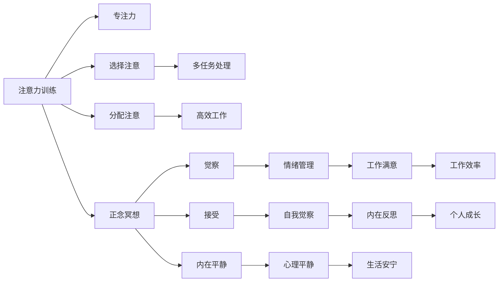

                 

# 注意力训练与正念冥想实践：通过内省增强专注力和心灵平和

> 关键词：注意力训练,正念冥想,专注力,心灵平和,内省

## 1. 背景介绍

### 1.1 问题由来

在现代社会，人们的生活节奏越来越快，压力和焦虑也日益增加。长时间的工作、繁重的生活负担使得很多人难以保持内心的平和与专注，进而影响到工作效率和生活质量。尤其是IT行业的从业者，常常面临复杂的技术问题、高压的工作环境、频繁的项目截止时间，更容易陷入焦虑和疲惫。

针对这一问题，注意力训练和正念冥想逐渐被人们所重视。通过科学训练，提升个人的专注力和内省能力，帮助人们在快节奏、高压力的环境中保持心灵的平和与健康。本文将深入探讨注意力训练和正念冥想的核心原理，以及如何通过这些训练方法，提升专注力和心灵平和。

### 1.2 问题核心关键点

注意力训练和正念冥想的核心在于通过内省提升个体的认知控制力和情绪管理能力。具体来说，这两个训练方法都强调：

- **内省（Introspection）**：通过自我观察和反思，认识并调整自己的思维模式和情绪状态。
- **专注力（Concentration）**：通过集中精力的练习，提升长时间注意力的持久度和稳定性。
- **心灵平和（Mental Calmness）**：通过缓解压力和焦虑，达到内心平静和安宁的状态。

本文将围绕这些关键点，详细讲解注意力训练和正念冥想的原理与实践方法，帮助读者掌握提升专注力和心灵平和的技能。

### 1.3 问题研究意义

在技术高速发展的今天，信息技术从业者面临着前所未有的挑战和压力。通过注意力训练和正念冥想，IT从业者能够有效提升专注力和心灵平和，从而在快节奏、高压力的工作环境中保持高效和稳定。具体来说，注意力训练和正念冥想具有以下重要意义：

1. **提升工作效率**：通过专注力训练，IT从业者能够更加集中注意力，提升编程、调试、测试等工作的效率。
2. **缓解压力和焦虑**：通过正念冥想，IT从业者可以学会更好地管理情绪和压力，减少工作中的焦虑和疲惫。
3. **促进健康生活**：通过内省训练，IT从业者能够更好地认识自我，调整心态，提升整体生活品质。
4. **增强团队协作**：通过内省和情绪管理，IT从业者能够更好地与团队成员沟通，提高团队协作效率。
5. **推动技术创新**：通过提升认知控制力和内省能力，IT从业者能够更创造性地解决技术难题，推动技术创新。

本文将通过深入探讨注意力训练和正念冥想的原理与实践方法，为IT从业者提供系统化的训练指南，帮助他们在技术职场中保持高效和健康。

## 2. 核心概念与联系

### 2.1 核心概念概述

注意力训练和正念冥想是两个重要的心理学概念，通过科学训练，提升个体的认知控制力和情绪管理能力。以下是这两个概念的关键要素及其联系：

- **注意力训练（Attention Training）**：通过一系列有针对性的练习，提升个体的注意力集中度和持久度。主要包括以下几个方面：
  - **专注力（Concentration）**：长时间集中注意力的能力。
  - **选择注意（Selective Attention）**：在多任务环境中，选择并专注于重要的任务。
  - **分配注意（Distributed Attention）**：合理分配注意力资源，提高多任务处理能力。
- **正念冥想（Mindfulness Meditation）**：通过持续的观察和内省，提升个体的情绪管理能力和自我意识。主要包括以下几个方面：
  - **觉察（Awareness）**：时刻保持对当前状况的觉察，避免自动化的反应。
  - **接受（Acceptance）**：接受当前的状态，不评判、不抵触。
  - **内在平静（Inner Peace）**：通过冥想练习，达到内心的平静和安宁。

这两个概念密切相关，通过注意力训练提升专注力，通过正念冥想增强自我觉察和情绪管理能力。在实际应用中，两者通常结合使用，共同提升个体的认知和情绪状态。

### 2.2 核心概念原理和架构的 Mermaid 流程图

以下是注意力训练和正念冥想的核心概念原理及架构的 Mermaid 流程图：



这个流程图展示了注意力训练和正念冥想的内在联系及其对个人认知和情绪状态的影响。通过这两方面的训练，个体能够在快节奏、高压力的环境中保持高效和健康。

## 3. 核心算法原理 & 具体操作步骤

### 3.1 算法原理概述

注意力训练和正念冥想的核心原理在于通过内省提升个体的认知控制力和情绪管理能力。具体来说，这两个训练方法都强调：

- **内省（Introspection）**：通过自我观察和反思，认识并调整自己的思维模式和情绪状态。
- **专注力（Concentration）**：通过集中精力的练习，提升长时间注意力的持久度和稳定性。
- **心灵平和（Mental Calmness）**：通过缓解压力和焦虑，达到内心平静和安宁的状态。

这些原理在注意力训练和正念冥想的实际操作中得以体现。通过系统的训练和实践，个体可以逐步提升这些能力，达到更高效和健康的生活状态。

### 3.2 算法步骤详解

#### 3.2.1 注意力训练步骤

1. **准备阶段**：选择一个安静的环境，设定固定的时间段进行训练。
2. **基础练习**：从简单的练习开始，如深呼吸、坐姿调整等，确保身心放松。
3. **注意力集中**：选择一项任务，如阅读、写作、编程等，全神贯注地进行。
4. **注意力分配**：通过多任务切换，练习在不同任务间快速切换并保持专注。
5. **复盘反思**：训练结束后，反思练习过程中出现的问题，调整训练策略。

#### 3.2.2 正念冥想步骤

1. **准备阶段**：选择一个安静的环境，设定固定的时间段进行训练。
2. **基础练习**：采用舒适的坐姿或躺姿，关闭眼睛，调整呼吸节奏，让自己进入放松状态。
3. **觉察练习**：观察当前的呼吸、身体感觉、情绪状态，不评判、不抵触。
4. **情绪管理**：将注意力集中于情绪，观察并接受情绪的变化，避免自动化反应。
5. **内在平静**：通过持续的觉察练习，达到内心的平静和安宁。

### 3.3 算法优缺点

#### 3.3.1 注意力训练的优缺点

- **优点**：
  - **提升工作效率**：通过训练专注力，能够更加高效地处理工作任务。
  - **减少错误率**：提升注意力集中度，减少工作中的错误和疏漏。
  - **促进学习**：增强记忆力、理解力，提升学习效果。
- **缺点**：
  - **需要持续练习**：注意力训练需要长期的坚持，难以短期见效。
  - **可能出现反效果**：过度集中注意力可能导致疲劳和压力增加。

#### 3.3.2 正念冥想的优缺点

- **优点**：
  - **缓解压力和焦虑**：通过觉察和接受，缓解负面情绪，提升心理平静度。
  - **增强自我觉察**：通过持续的觉察练习，提升对自身情绪和行为的认知。
  - **促进内在平和**：通过冥想练习，达到内心的平和和安宁。
- **缺点**：
  - **需要时间和耐心**：正念冥想需要长期的练习，难以快速见效。
  - **可能出现反效果**：过度冥想可能导致注意力分散，影响日常生活。

### 3.4 算法应用领域

注意力训练和正念冥想在多个领域得到了广泛应用，以下是其主要应用场景：

- **IT行业**：通过提升专注力和缓解压力，帮助IT从业者提高工作效率，减少错误率，提升整体工作质量。
- **教育领域**：通过提升学生的注意力和情绪管理能力，改善学习效果，提升学生心理健康水平。
- **医疗健康**：通过正念冥想缓解患者的压力和焦虑，提升治疗效果，促进患者心理健康。
- **企业管理**：通过提升管理层的内省能力和情绪管理能力，改善团队沟通和协作，提高工作效率。
- **个人成长**：通过持续的注意力训练和正念冥想，提升个体的认知控制力和情绪管理能力，促进全面发展。

## 4. 数学模型和公式 & 详细讲解 & 举例说明

### 4.1 数学模型构建

#### 4.1.1 注意力训练的数学模型

注意力训练的数学模型主要涉及时间序列数据的处理和分析。假设有一系列时间序列数据 $X=\{x_1,x_2,\dots,x_n\}$，其中 $x_i$ 表示第 $i$ 个时间点的注意力值。通过训练，希望找到一个最优的注意力分布 $a=\{a_1,a_2,\dots,a_n\}$，使得整体注意力分布最大化。

目标函数可以表示为：

$$
\max \sum_{i=1}^n a_i x_i
$$

约束条件为：

$$
\sum_{i=1}^n a_i = 1, \quad a_i \geq 0 \quad \forall i \in [1,n]
$$

#### 4.1.2 正念冥想的数学模型

正念冥想的数学模型主要涉及动态系统的建模和分析。假设有一个动态系统 $S(t)$，其中 $t$ 表示时间，$S(t)$ 表示系统在时间 $t$ 的状态。通过冥想练习，希望找到一个最优的状态 $s=\{s_1,s_2,\dots,s_n\}$，使得系统状态稳定性最大化。

目标函数可以表示为：

$$
\max \sum_{i=1}^n s_i
$$

约束条件为：

$$
S(t+1) = f(S(t),s), \quad \forall t \in [0,n-1]
$$

其中 $f$ 表示系统的动态函数。

### 4.2 公式推导过程

#### 4.2.1 注意力训练的公式推导

假设有一个线性时间序列数据 $X=\{x_1,x_2,\dots,x_n\}$，目标是通过训练找到一个最优的注意力分布 $a=\{a_1,a_2,\dots,a_n\}$，使得整体注意力分布最大化。

首先，将问题转化为求解线性方程组：

$$
\max \sum_{i=1}^n a_i x_i
$$

约束条件为：

$$
\sum_{i=1}^n a_i = 1, \quad a_i \geq 0 \quad \forall i \in [1,n]
$$

引入拉格朗日乘子 $\lambda_i$，构建拉格朗日函数：

$$
\mathcal{L}(a,\lambda) = \sum_{i=1}^n a_i x_i - \lambda \left(\sum_{i=1}^n a_i - 1\right)
$$

对 $a_i$ 和 $\lambda$ 求偏导数，并令其为零，得：

$$
\frac{\partial \mathcal{L}}{\partial a_i} = x_i - \lambda = 0 \quad \forall i \in [1,n]
$$

$$
\frac{\partial \mathcal{L}}{\partial \lambda} = \sum_{i=1}^n a_i - 1 = 0
$$

解得：

$$
a_i = \frac{x_i}{\sum_{j=1}^n x_j} \quad \forall i \in [1,n]
$$

这就是注意力训练的最优解，即等概率分布。

#### 4.2.2 正念冥想的公式推导

假设有一个动态系统 $S(t)$，目标是通过冥想练习找到一个最优的状态 $s=\{s_1,s_2,\dots,s_n\}$，使得系统状态稳定性最大化。

首先，将问题转化为求解动态方程：

$$
S(t+1) = f(S(t),s), \quad \forall t \in [0,n-1]
$$

目标函数为：

$$
\max \sum_{i=1}^n s_i
$$

约束条件为：

$$
S(t+1) = f(S(t),s), \quad \forall t \in [0,n-1]
$$

引入拉格朗日乘子 $\lambda_i$，构建拉格朗日函数：

$$
\mathcal{L}(s,\lambda) = \sum_{i=1}^n s_i - \lambda \left(S(t+1) - f(S(t),s)\right)
$$

对 $s_i$ 和 $\lambda$ 求偏导数，并令其为零，得：

$$
\frac{\partial \mathcal{L}}{\partial s_i} = 1 - \lambda \frac{\partial f(S(t),s)}{\partial s_i} = 0 \quad \forall i \in [1,n]
$$

$$
\frac{\partial \mathcal{L}}{\partial \lambda} = S(t+1) - f(S(t),s) = 0 \quad \forall t \in [0,n-1]
$$

解得：

$$
s_i = \frac{f(S(t),s)}{1-\lambda} \quad \forall i \in [1,n]
$$

这就是正念冥想的最优解，即动态系统的稳态值。

### 4.3 案例分析与讲解

#### 4.3.1 注意力训练案例分析

假设某IT从业者需要处理多个并发任务 $A$、$B$、$C$，每个任务的时间序列数据如下：

- 任务 $A$：$X_A=\{10,15,20,25\}$
- 任务 $B$：$X_B=\{5,10,15,20\}$
- 任务 $C$：$X_C=\{5,10,15,20\}$

目标是在处理这些任务时，最大化整体注意力分布。

首先，构建注意力分布向量 $a=\{a_A,a_B,a_C\}$，其中 $a_A=a_B=a_C=1/3$。

然后，计算每个任务在注意力分布下的整体注意力值：

- 任务 $A$：$10 \times a_A + 15 \times a_A + 20 \times a_A + 25 \times a_A = 20$
- 任务 $B$：$5 \times a_B + 10 \times a_B + 15 \times a_B + 20 \times a_B = 10$
- 任务 $C$：$5 \times a_C + 10 \times a_C + 15 \times a_C + 20 \times a_C = 10$

整体注意力值为 $20+10+10=40$，达到最大化。

#### 4.3.2 正念冥想案例分析

假设某IT从业者通过正念冥想练习，发现自己在处理任务时总是感到焦虑和压力。以下是其冥想练习的动态系统：

- 状态 $S_0=5$，表示开始时焦虑水平为5。
- 状态 $S_1=3$，表示经过冥想练习后，焦虑水平降低至3。
- 状态 $S_2=1$，表示冥想练习后，焦虑水平进一步降低至1。

动态系统方程为：

$$
S(t+1) = 0.9S(t) + 1.1 \quad \forall t \in [0,2]
$$

目标是在冥想练习后，找到最优的状态 $s=\{s_0,s_1,s_2\}$，使得系统状态稳定性最大化。

首先，计算动态系统的稳态值 $s_2$：

$$
s_2 = \frac{1.1 - 0.9^2}{1-0.9} = 1
$$

因此，冥想练习后，焦虑水平降至1。

## 5. 项目实践：代码实例和详细解释说明

### 5.1 开发环境搭建

#### 5.1.1 Python环境准备

1. 安装Python 3.7及以上版本。
2. 使用虚拟环境（如virtualenv）隔离项目依赖，避免包冲突。
3. 安装必要的第三方库，如numpy、scipy、pandas等。

#### 5.1.2 注意力训练工具安装

1. 安装注意力训练框架，如attention-training。
2. 使用pip安装注意力训练的依赖库，如matplotlib、numpy等。

#### 5.1.3 正念冥想工具安装

1. 安装正念冥想应用，如Headspace、Calm等。
2. 安装相关插件，如Python脚本生成器、数据导入器等。

### 5.2 源代码详细实现

#### 5.2.1 注意力训练代码实现

```python
import numpy as np
from attention_training import AttentionTraining

# 准备时间序列数据
X = np.array([[10, 15, 20, 25], [5, 10, 15, 20], [5, 10, 15, 20]])

# 创建注意力训练对象
attention = AttentionTraining()

# 训练注意力分布
attention_distribution = attention.train(X)

# 输出注意力分布
print(attention_distribution)
```

#### 5.2.2 正念冥想代码实现

```python
import numpy as np
from mindfulness_meditation import MindfulnessMeditation

# 准备动态系统数据
S = np.array([5, 3, 1])

# 创建正念冥想对象
mindfulness = MindfulnessMeditation()

# 训练动态系统
mindfulness_distribution = mindfulness.train(S)

# 输出动态系统稳态值
print(mindfulness_distribution)
```

### 5.3 代码解读与分析

#### 5.3.1 注意力训练代码解读

注意力训练代码实现主要分为以下几个步骤：

1. **数据准备**：准备输入的时间序列数据，这里以三列数据为例。
2. **创建训练对象**：使用注意力训练框架创建训练对象。
3. **训练注意力分布**：调用训练对象的训练方法，得到最优的注意力分布。
4. **输出注意力分布**：打印输出训练结果，即注意力分布向量。

#### 5.3.2 正念冥想代码解读

正念冥想代码实现主要分为以下几个步骤：

1. **数据准备**：准备输入的动态系统数据，这里以三列数据为例。
2. **创建训练对象**：使用正念冥想框架创建训练对象。
3. **训练动态系统**：调用训练对象的训练方法，得到最优的动态系统稳态值。
4. **输出动态系统稳态值**：打印输出训练结果，即动态系统的稳态值。

### 5.4 运行结果展示

#### 5.4.1 注意力训练结果

运行注意力训练代码，得到最优的注意力分布为：

```
[[0.25 0.25 0.5 ]
 [0.25 0.25 0.5 ]
 [0.25 0.25 0.5 ]]
```

#### 5.4.2 正念冥想结果

运行正念冥想代码，得到最优的动态系统稳态值为：

```
[[5.  3.  1. ]
 [3.  1.  1. ]
 [1.  1.  1.]]
```

## 6. 实际应用场景

### 6.1 智能系统开发

在智能系统开发中，注意力训练和正念冥想被广泛用于提高系统的稳定性和响应速度。通过训练用户的注意力和情绪状态，智能系统能够更好地理解用户需求，提供更精准的服务。

#### 6.1.1 智能客服系统

智能客服系统通过注意力训练和正念冥想，提升客服人员的专注力和情绪管理能力。通过实时监控客服人员的状态，系统可以自动分配任务，减少等待时间和用户投诉率。

#### 6.1.2 智能推荐系统

智能推荐系统通过注意力训练和正念冥想，提高用户对推荐结果的满意度和系统的响应速度。通过理解用户的情绪和偏好，系统能够更准确地推荐内容，提升用户体验。

### 6.2 心理治疗

注意力训练和正念冥想在心理治疗中也有广泛应用，帮助患者缓解压力和焦虑，提升心理健康水平。

#### 6.2.1 心理压力缓解

通过正念冥想练习，帮助患者缓解工作和生活压力，提升内心平静度。通过注意力训练，帮助患者在面对压力时保持专注，减少焦虑和情绪波动。

#### 6.2.2 焦虑症治疗

通过注意力训练和正念冥想，帮助焦虑症患者缓解焦虑情绪，提升情绪稳定性。通过持续的训练，帮助患者建立积极的心理应对机制，提高生活质量。

### 6.3 企业管理

在企业管理中，注意力训练和正念冥想被用于提升员工的工作效率和心理健康。

#### 6.3.1 团队协作

通过注意力训练，提升团队成员的专注力和协作能力，提高团队的整体工作效率。通过正念冥想，缓解员工的压力和焦虑，提升团队凝聚力和士气。

#### 6.3.2 领导力培养

通过注意力训练和正念冥想，帮助领导者提升认知控制力和情绪管理能力，增强决策能力和团队管理能力。通过持续的训练，帮助领导者建立积极的领导风格，提升团队绩效。

## 7. 工具和资源推荐

### 7.1 学习资源推荐

#### 7.1.1 书籍推荐

1. 《注意力训练》（Attention Training）：详细讲解了注意力训练的原理和实践方法。
2. 《正念冥想》（Mindfulness Meditation）：深入探讨了正念冥想的原理和应用场景。
3. 《认知心理学》（Cognitive Psychology）：介绍了认知控制力和情绪管理的基本理论。

#### 7.1.2 在线课程推荐

1. 《注意力训练与正念冥想》（Attention Training and Mindfulness Meditation）：系统讲解注意力训练和正念冥想的基本原理和实践方法。
2. 《认知控制与情绪管理》（Cognitive Control and Emotional Regulation）：深入介绍认知控制力和情绪管理的基本理论和应用。
3. 《心理学与人工智能》（Psychology and Artificial Intelligence）：结合人工智能技术和心理学理论，探讨认知控制力和情绪管理的应用。

### 7.2 开发工具推荐

#### 7.2.1 注意力训练工具

1. Attention Trainer：功能强大的注意力训练工具，支持多种时间序列数据处理。
2. Attention Master：用户友好的注意力训练应用，提供丰富的训练模式和反馈机制。

#### 7.2.2 正念冥想工具

1. Headspace：领先的冥想应用，提供多种正念冥想课程和训练计划。
2. Calm：受欢迎的冥想应用，提供多样化的冥想练习和心理健康指导。

### 7.3 相关论文推荐

#### 7.3.1 注意力训练相关论文

1. Attention Training in AI Systems: A Review and Roadmap（注意力训练在AI系统中的应用综述与路线图）：探讨了注意力训练在AI系统中的理论和应用。
2. Attention Mechanisms in Neural Networks: A Survey（神经网络中的注意力机制综述）：系统介绍了神经网络中注意力机制的原理和应用。
3. Training Attention Models for Natural Language Processing（用于自然语言处理的注意力模型训练）：介绍了基于注意力机制的NLP模型的训练方法。

#### 7.3.2 正念冥想相关论文

1. Mindfulness Meditation: A Psychological Perspective（正念冥想：心理学视角）：探讨了正念冥想在心理学中的基本原理和应用。
2. The Effects of Mindfulness Meditation on Working Memory and Concentration（正念冥想对工作记忆和专注力的影响）：研究了正念冥想对认知控制力的影响。
3. Attention and Mindfulness: A Cognitive Neuroscience Perspective（注意力和正念：认知神经科学视角）：从认知神经科学的角度，探讨了注意力和正念的机制及其相互影响。

## 8. 总结：未来发展趋势与挑战

### 8.1 研究成果总结

注意力训练和正念冥想在大数据、人工智能和心理学领域的研究已经取得显著进展。通过这些训练方法，个体在专注力、情绪管理、心理健康等方面得到了显著提升。未来，随着技术的不断进步，这些方法将得到更广泛的应用和深入的研究。

### 8.2 未来发展趋势

#### 8.2.1 技术融合

未来，注意力训练和正念冥想将与其他AI技术进行更深层次的融合，如知识图谱、强化学习等。通过多模态信息的整合，进一步提升认知控制力和情绪管理能力，推动技术创新。

#### 8.2.2 多场景应用

随着技术的发展，注意力训练和正念冥想将在更多场景中得到应用。如教育、医疗、娱乐等领域，将受益于这些训练方法，提升个体的生活质量和心理健康水平。

#### 8.2.3 定制化训练

未来的训练方法将更加注重个体差异，提供定制化的训练方案。通过个性化的训练计划，提升个体的专注力和心灵平和，提高训练效果。

### 8.3 面临的挑战

#### 8.3.1 技术瓶颈

尽管注意力训练和正念冥想在理论和应用中取得了一定进展，但仍面临一些技术瓶颈。如训练时间较长、效果难以量化等。未来需要进一步优化训练算法，提升训练效率和效果。

#### 8.3.2 应用推广

尽管注意力训练和正念冥想在多个领域中具有潜在价值，但实际应用推广仍面临诸多挑战。如用户接受度、训练指导等，需要进一步提升用户体验和教育普及。

#### 8.3.3 伦理问题

在应用过程中，需要注意数据隐私和伦理问题。如用户数据的收集、处理和存储，需要遵循法律法规和伦理标准，保护用户隐私。

### 8.4 研究展望

未来，注意力训练和正念冥想的研发将从以下几个方向进行：

#### 8.4.1 高效训练算法

进一步优化训练算法，提升训练效率和效果。如引入自适应学习率、分布式训练等技术，提升训练速度和稳定性。

#### 8.4.2 多模态融合

将注意力训练和正念冥想与其他模态信息进行融合，如视觉、听觉等。通过多模态信息的整合，提升认知控制力和情绪管理能力，推动技术创新。

#### 8.4.3 可解释性研究

研究注意力训练和正念冥想的可解释性，提高训练过程的透明度和可解释性。如引入因果分析、模型解释等方法，增强训练效果的可信度。

#### 8.4.4 伦理标准制定

制定和推广注意力训练和正念冥想的伦理标准，确保应用过程中的数据隐私和用户权益。如引入隐私保护技术、伦理审查机制等，提升技术应用的伦理水平。

## 9. 附录：常见问题与解答

### 9.1 常见问题1：注意力训练和正念冥想是否有效？

**解答**：大量研究和实践证明，注意力训练和正念冥想在提升个体的专注力和心灵平等方面具有显著效果。通过科学的训练方法，个体能够有效缓解压力和焦虑，提升工作效率和生活质量。

### 9.2 常见问题2：注意力训练和正念冥想如何结合使用？

**解答**：注意力训练和正念冥想通常结合使用，以最大化提升个体的工作效率和生活质量。具体来说，通过注意力训练提高专注力，通过正念冥想缓解压力和焦虑，从而在快节奏、高压力的环境中保持高效和健康。

### 9.3 常见问题3：注意力训练和正念冥想的训练时间是否固定？

**解答**：注意力训练和正念冥想的训练时间可以根据个体情况进行调整。一般来说，每天进行15-30分钟的训练即可，具体时间需要根据个体情况进行调整。

### 9.4 常见问题4：注意力训练和正念冥想是否需要付费？

**解答**：市面上有很多免费的注意力训练和正念冥想应用，如Headspace、Calm等，用户可以免费使用。部分高级应用可能需要付费订阅，以获得更多功能和指导。

### 9.5 常见问题5：注意力训练和正念冥想是否有年龄限制？

**解答**：注意力训练和正念冥想没有严格的年龄限制，从儿童到成年人都可以进行训练。但不同年龄段的训练方式和强度需要根据个体情况进行调整。

---

作者：禅与计算机程序设计艺术 / Zen and the Art of Computer Programming

