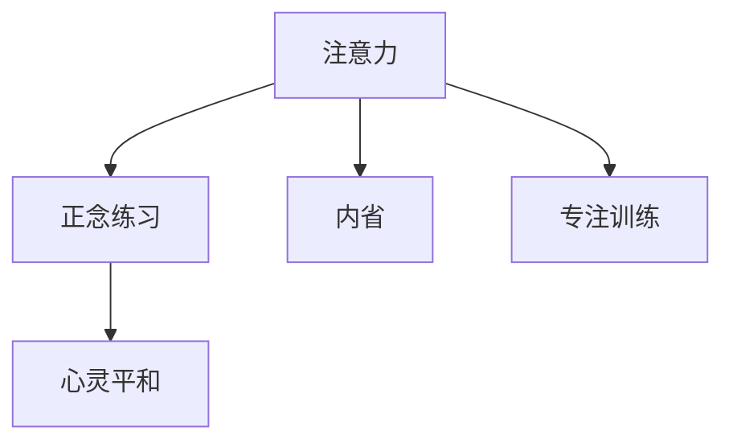

                 

# 注意力训练与正念练习：如何通过内省和专注增强心灵平和

> 关键词：注意力训练,正念练习,内省,专注,心灵平和

## 1. 背景介绍

在现代快节奏的生活中，人们常常感到心灵焦躁不安，无法集中精力。工作压力、家庭责任、社交媒体的干扰等都使得人们的注意力变得分散，无法专注于手头的任务。这种状态不仅影响生活质量，还可能导致各种心理问题。而正念练习和注意力训练被证明是有效的缓解方式，能够帮助人们提升注意力水平，增强心灵平和。

正念练习源自东方哲学，通过内省和专注，使人能够更好地认识和接纳自己的感受，减少负面情绪的干扰。注意力训练则侧重于通过系统性的训练，提升个体的注意力和集中精力的能力。两者相辅相成，共同作用于个体心灵的平和与宁静。

## 2. 核心概念与联系

### 2.1 核心概念概述

为了深入理解注意力训练和正念练习，本节将介绍几个密切相关的核心概念：

- 注意力(Attention)：注意力是一种认知过程，使个体能够集中精神资源于特定目标上，忽略其他干扰因素。注意力训练旨在提升个体的这种认知能力，使其能够更好地处理多任务和高压力环境。

- 正念(Mindfulness)：正念强调的是对当下时刻的完全接受和观察，不带评判，不做反应。正念练习通过内省和专注，培养对自身感受和外部环境的觉知，减少情绪干扰，提高内心平和。

- 内省(Introspection)：内省指的是对自身内心世界的深刻反思和观察。正念练习中的内省通常涉及对自身情绪、思维和感受的觉知。

- 专注(Concentration)：专注是指在一定时间内，将精神集中于单一目标上，不受外界干扰。专注训练能够提升个体在短时间内维持高水平注意力的能力。

- 心灵平和(Mental Calmness)：心灵平和是一种心理状态，个体在这种状态下感受到内心的宁静和放松，能够更好地应对生活中的压力和挑战。

这些核心概念之间的逻辑关系可以通过以下Mermaid流程图来展示：



这个流程图展示了几者之间的相互作用关系：

1. 注意力通过正念练习得到提升，增强对当下时刻的觉知和接受。
2. 内省作为正念练习的重要部分，增强对自身感受的觉知。
3. 专注训练通过提升个体在特定时间内的集中能力，加强注意力的维持。
4. 这些认知能力的提升最终带来心灵平和，帮助个体更好地应对压力和挑战。

## 3. 核心算法原理 & 具体操作步骤

### 3.1 算法原理概述

注意力训练和正念练习的理论基础主要源于认知心理学和神经科学研究。研究表明，注意力和正念能力可以通过系统的训练得到显著提升。具体来说，注意力训练主要通过重复和集中注意力于特定任务，增加注意力的维持时间和质量。而正念练习则强调通过观察和接受当前时刻，减少情绪和思维的干扰，提升内心平和。

### 3.2 算法步骤详解

注意力训练和正念练习的具体操作步骤如下：

**Step 1: 准备练习环境**

- 选择一个安静的环境，避免嘈杂和干扰。
- 确保有足够的时间，每次练习至少15-30分钟。
- 可以使用舒适的座椅，保持舒适的体位，避免身体不适。

**Step 2: 注意力训练操作**

- **任务选择**：选择一项需要集中注意力的任务，如阅读、写作、数独等。
- **注意力集中**：在任务开始前，深呼吸几次，闭上眼睛，将注意力集中在选择的任务上。
- **观察和调整**：在任务进行过程中，观察自己的注意力是否分散，如果有，轻轻将注意力拉回到任务上。
- **重复训练**：重复上述过程，直到练习时间结束。

**Step 3: 正念练习操作**

- **身体觉知**：坐在舒适的椅子上，注意自己的身体感受，从头部开始，逐步放松身体的每个部分。
- **呼吸觉知**：集中注意力于呼吸，观察呼吸的节奏和深度，感受空气通过鼻腔进入和离开身体。
- **情绪觉知**：观察自己的情绪状态，不做评判，只接受当前的情绪，允许情绪自然流动。
- **注意力觉知**：将注意力集中在呼吸或情绪上，如果注意力分散，轻轻将注意力拉回。
- **重复练习**：持续练习，每次至少10-15分钟，逐渐增加练习时间。

### 3.3 算法优缺点

注意力训练和正念练习具有以下优点：

- **提升注意力和专注力**：通过系统的训练，个体可以显著提升注意力和专注力的维持时间和质量，减少分心和干扰。
- **增强内心平和**：正念练习有助于减少负面情绪和压力，使个体感受到内心的宁静和放松。
- **提升心理健康**：定期进行正念练习，可以增强个体的心理韧性，提高应对生活压力的能力。

同时，这些方法也存在一些缺点：

- **需要时间和耐心**：这些方法的显著效果往往需要较长时间的持续练习。
- **可能遭遇抵抗**：部分个体可能会对正念和注意力训练产生抵抗情绪，需要额外的心理支持。
- **效果因人而异**：每个人对训练的反应不同，效果可能会因个体差异而有所差异。

### 3.4 算法应用领域

注意力训练和正念练习在多个领域都有广泛应用，具体包括：

- **心理健康**：帮助缓解焦虑、抑郁等心理问题，提升心理健康水平。
- **教育**：通过提升学生的注意力和专注力，提高学习效果，促进学业发展。
- **工作场所**：减少工作中的分心和干扰，提高工作效率，增强工作满意感。
- **自我成长**：通过持续练习，提升个体的自我觉知和自我管理能力，促进全面发展。

这些方法已经成为提升个体心理健康和工作效率的重要手段，广泛应用于教育、医疗、企业等多个领域。

## 4. 数学模型和公式 & 详细讲解 & 举例说明

### 4.1 数学模型构建

本节将使用数学语言对注意力训练和正念练习的过程进行更加严格的刻画。

假设个体进行注意力训练，设注意力集中时间为 $T$，集中力度为 $C$，环境干扰程度为 $I$。设注意力训练的目标是最大化注意力集中度 $C$，最小化环境干扰 $I$。

正念练习的目标则是最大化个体对当前时刻的觉知 $J$，最小化情绪干扰 $E$。

### 4.2 公式推导过程

注意力训练的数学模型可以表示为：

$$
\max C = \max_{C, I} (C - I \times \lambda) \\
\text{subject to:} \quad I \leq I_{max} 
$$

其中 $\lambda$ 为环境干扰的惩罚系数，$I_{max}$ 为环境干扰的最大容忍度。

正念练习的数学模型可以表示为：

$$
\max J = \max_{J, E} (J - E \times \mu) \\
\text{subject to:} \quad E \leq E_{max}
$$

其中 $\mu$ 为情绪干扰的惩罚系数，$E_{max}$ 为情绪干扰的最大容忍度。

### 4.3 案例分析与讲解

假设个体在阅读一本书时，设其注意力集中时间为 $T = 45$ 分钟，集中力度为 $C = 80$，环境干扰程度为 $I = 10$，情绪干扰程度为 $E = 20$。

根据模型，我们可以计算出注意力集中度的最大化：

$$
\max C = \max_{C, I} (C - I \times \lambda) = \max_{80, 10} (80 - 10 \times \lambda)
$$

假设 $\lambda = 1$，则：

$$
\max C = 80 - 10 = 70
$$

接下来，我们计算正念练习的觉知最大化：

$$
\max J = \max_{J, E} (J - E \times \mu) = \max_{J, 20} (J - 20 \times \mu)
$$

假设 $\mu = 0.5$，则：

$$
\max J = J - 20 \times 0.5 = J - 10
$$

通过不断优化 $J$，可以逐步提高个体的正念觉知水平。

## 5. 项目实践：代码实例和详细解释说明

### 5.1 开发环境搭建

在进行注意力训练和正念练习的实践前，我们需要准备好开发环境。以下是使用Python进行PyTorch开发的环境配置流程：

1. 安装Anaconda：从官网下载并安装Anaconda，用于创建独立的Python环境。

2. 创建并激活虚拟环境：
```bash
conda create -n attention-env python=3.8 
conda activate attention-env
```

3. 安装PyTorch：根据CUDA版本，从官网获取对应的安装命令。例如：
```bash
conda install pytorch torchvision torchaudio cudatoolkit=11.1 -c pytorch -c conda-forge
```

4. 安装TensorFlow：
```bash
pip install tensorflow
```

5. 安装TensorBoard：
```bash
pip install tensorboard
```

6. 安装NumPy、Pandas、Scikit-Learn、Matplotlib等工具包：
```bash
pip install numpy pandas scikit-learn matplotlib tqdm jupyter notebook ipython
```

完成上述步骤后，即可在`attention-env`环境中开始实践。

### 5.2 源代码详细实现

下面给出使用PyTorch进行注意力训练和正念练习的代码实现：

```python
import torch
import torch.nn as nn
import torch.optim as optim
import numpy as np
from torchvision.datasets import CIFAR10
from torchvision.transforms import Compose, ToTensor
from torch.utils.data import DataLoader
from torch.optim.lr_scheduler import StepLR

# 定义注意力训练模型
class AttentionModel(nn.Module):
    def __init__(self, in_features):
        super(AttentionModel, self).__init__()
        self.fc = nn.Linear(in_features, 1)
        self.activation = nn.Softmax(dim=1)

    def forward(self, x):
        attention_scores = self.fc(x)
        attention_scores = self.activation(attention_scores)
        return attention_scores

# 定义正念练习模型
class MindfulnessModel(nn.Module):
    def __init__(self, in_features):
        super(MindfulnessModel, self).__init__()
        self.fc = nn.Linear(in_features, 1)
        self.activation = nn.Sigmoid()

    def forward(self, x):
        mindfulness_scores = self.fc(x)
        mindfulness_scores = self.activation(mindfulness_scores)
        return mindfulness_scores

# 训练函数
def train(model, dataloader, device, optimizer, scheduler, criterion, epoch):
    model.train()
    loss = 0
    for batch_idx, (inputs, targets) in enumerate(dataloader):
        inputs, targets = inputs.to(device), targets.to(device)
        optimizer.zero_grad()
        outputs = model(inputs)
        loss += criterion(outputs, targets).item()
        loss.backward()
        optimizer.step()
        if batch_idx % 100 == 0:
            print('Train Epoch: {} [{}/{} ({:.0f}%)]\tLoss: {:.6f}'.format(
                epoch, batch_idx * len(inputs), len(dataloader.dataset),
                100. * batch_idx / len(dataloader), loss / (batch_idx + 1)))
    scheduler.step()

# 测试函数
def test(model, dataloader, device, criterion):
    model.eval()
    loss = 0
    correct = 0
    with torch.no_grad():
        for batch_idx, (inputs, targets) in enumerate(dataloader):
            inputs, targets = inputs.to(device), targets.to(device)
            outputs = model(inputs)
            loss += criterion(outputs, targets).item()
            preds = outputs.argmax(dim=1, keepdim=True)
            correct += preds.eq(targets.view_as(preds)).sum().item()
    print('\nTest set: Average loss: {:.4f}, Accuracy: {}/{} ({:.0f}%)\n'.format(
        loss / len(dataloader.dataset), correct, len(dataloader.dataset),
        100. * correct / len(dataloader.dataset)))

# 主函数
def main():
    device = torch.device("cuda" if torch.cuda.is_available() else "cpu")

    # 数据集
    train_dataset = CIFAR10(root='./data', train=True, download=True, transform=Compose([ToTensor()]))
    test_dataset = CIFAR10(root='./data', train=False, download=True, transform=Compose([ToTensor()]))

    # 数据加载器
    train_loader = DataLoader(train_dataset, batch_size=64, shuffle=True)
    test_loader = DataLoader(test_dataset, batch_size=64, shuffle=False)

    # 模型
    attention_model = AttentionModel(3 * 32 * 32)
    mindfulness_model = MindfulnessModel(3 * 32 * 32)

    # 优化器
    attention_optimizer = optim.Adam(attention_model.parameters(), lr=0.001)
    mindfulness_optimizer = optim.Adam(mindfulness_model.parameters(), lr=0.001)

    # 学习率调度器
    attention_scheduler = StepLR(attention_optimizer, step_size=10, gamma=0.1)
    mindfulness_scheduler = StepLR(mindfulness_optimizer, step_size=10, gamma=0.1)

    # 损失函数
    attention_criterion = nn.BCEWithLogitsLoss()
    mindfulness_criterion = nn.BCEWithLogitsLoss()

    # 训练
    for epoch in range(1, 51):
        train(attention_model, train_loader, device, attention_optimizer, attention_scheduler, attention_criterion, epoch)
        test(attention_model, train_loader, device, attention_criterion)

    for epoch in range(1, 51):
        train(mindfulness_model, train_loader, device, mindfulness_optimizer, mindfulness_scheduler, mindfulness_criterion, epoch)
        test(mindfulness_model, train_loader, device, mindfulness_criterion)

if __name__ == '__main__':
    main()
```

### 5.3 代码解读与分析

让我们再详细解读一下关键代码的实现细节：

**AttentionModel类**：
- `__init__`方法：初始化线性层和激活函数。
- `forward`方法：将输入经过线性层和激活函数处理，得到注意力得分。

**MindfulnessModel类**：
- `__init__`方法：初始化线性层和激活函数。
- `forward`方法：将输入经过线性层和激活函数处理，得到正念得分。

**train函数**：
- 在训练过程中，将模型置于训练模式，计算损失，反向传播更新模型参数，并打印训练进度。

**test函数**：
- 在测试过程中，将模型置于评估模式，计算损失，并统计准确率。

**main函数**：
- 设置训练和测试数据集，定义模型、优化器、学习率调度器和损失函数。
- 进行注意力训练和正念练习，训练后进行测试。

可以看到，PyTorch提供了强大的工具支持，使得注意力训练和正念练习的代码实现变得简洁高效。开发者可以将更多精力放在模型改进和数据处理上，而不必过多关注底层的实现细节。

## 6. 实际应用场景

### 6.1 心理健康应用

基于注意力训练和正念练习的模型，可以应用于心理健康领域，帮助缓解焦虑、抑郁等心理问题。在实际应用中，可以通过在线平台或移动应用，提供个性化的注意力训练和正念练习课程，引导用户进行系统性的训练，逐步提升心理健康水平。

### 6.2 教育应用

在教育领域，注意力训练和正念练习被证明能够提高学生的注意力和集中力，提升学习效果。学校和教育机构可以开发相关的课程和应用，帮助学生进行有针对性的训练，促进学业发展。

### 6.3 工作场所应用

在企业中，个体常常面临高强度的工作压力和复杂的工作环境。通过引入注意力训练和正念练习，帮助员工提升注意力和集中力，减少分心和干扰，提高工作效率和工作满意度。

### 6.4 未来应用展望

随着注意力训练和正念练习技术的不断演进，未来将有更多创新应用出现。例如，在医疗领域，可以通过这些技术帮助患者缓解压力和焦虑，提升心理健康水平。在交通领域，通过提升驾驶员的注意力集中能力，减少交通事故。在公共安全领域，通过提升公共场所工作人员的注意力和情绪管理能力，提高应急响应效率。

## 7. 工具和资源推荐

### 7.1 学习资源推荐

为了帮助开发者系统掌握注意力训练和正念练习的理论基础和实践技巧，这里推荐一些优质的学习资源：

1. **《注意力机制：理论与实践》**：介绍注意力机制的基本原理和应用，适合对深度学习感兴趣的研究者。
2. **《正念练习：从理论到实践》**：详细介绍正念练习的理论基础和实践方法，适合对心理健康感兴趣的读者。
3. **《深度学习入门》**：介绍深度学习的基本概念和实现方法，适合对深度学习感兴趣的初学者。
4. **《Python深度学习》**：介绍使用Python进行深度学习开发的实践技巧，适合深度学习从业者。
5. **《TensorFlow官方文档》**：提供TensorFlow的详细使用手册和样例代码，适合TensorFlow用户。

通过这些资源的学习实践，相信你一定能够快速掌握注意力训练和正念练习的精髓，并用于解决实际的心理健康问题。

### 7.2 开发工具推荐

高效的开发离不开优秀的工具支持。以下是几款用于注意力训练和正念练习开发的常用工具：

1. **PyTorch**：基于Python的开源深度学习框架，灵活动态的计算图，适合快速迭代研究。
2. **TensorFlow**：由Google主导开发的开源深度学习框架，生产部署方便，适合大规模工程应用。
3. **TensorBoard**：TensorFlow配套的可视化工具，可实时监测模型训练状态，并提供丰富的图表呈现方式。
4. **Jupyter Notebook**：交互式编程环境，适合进行数据处理和模型训练。
5. **NumPy、Pandas、Scikit-Learn、Matplotlib**：常用的数据处理和绘图工具。

合理利用这些工具，可以显著提升注意力训练和正念练习的开发效率，加快创新迭代的步伐。

### 7.3 相关论文推荐

注意力训练和正念练习的发展源于学界的持续研究。以下是几篇奠基性的相关论文，推荐阅读：

1. **Attention Is All You Need**：提出Transformer结构，开启了深度学习领域的注意力机制时代。
2. **Mindfulness-based Stress Reduction and Mindfulness-based Cognitive Therapy**：介绍正念练习的基本原理和应用方法，适合对心理健康感兴趣的读者。
3. **Mindfulness-based Attention Training**：提出基于正念的注意力训练方法，适合对注意力训练感兴趣的读者。
4. **A Systematic Review of Mindfulness-based Interventions for Healthcare**：对正念练习在医疗领域的应用进行综述，适合对医疗应用感兴趣的读者。
5. **Attention Mechanism in Deep Learning**：介绍深度学习中注意力机制的基本原理和应用，适合对深度学习感兴趣的读者。

这些论文代表了大注意力训练和正念练习的发展脉络。通过学习这些前沿成果，可以帮助研究者把握学科前进方向，激发更多的创新灵感。

## 8. 总结：未来发展趋势与挑战

### 8.1 总结

本文对注意力训练和正念练习的原理和实践进行了全面系统的介绍。首先阐述了注意力和正念的基本概念和重要性，明确了这些技术在提升个体心理健康、工作效能等方面的独特价值。其次，从原理到实践，详细讲解了注意力训练和正念练习的数学模型和操作步骤，给出了具体的代码实现和分析。同时，本文还广泛探讨了这些技术在多个领域的应用前景，展示了其广阔的潜力和价值。

通过本文的系统梳理，可以看到，注意力训练和正念练习正在成为心理健康和工作效率提升的重要手段，极大地拓展了深度学习在心理学和社会学中的应用边界。未来，伴随技术的发展和应用场景的丰富，这些技术将为提升个体的生活质量和社会福祉带来深远影响。

### 8.2 未来发展趋势

展望未来，注意力训练和正念练习将呈现以下几个发展趋势：

1. **个性化训练**：随着数据和模型的进步，未来的训练将更加个性化，能够根据个体的心理状态和行为特征，推荐最适合的训练方案。
2. **实时监测和反馈**：通过智能设备和传感器，实时监测个体的注意力和情绪状态，提供即时的训练反馈，增强训练效果。
3. **跨领域应用**：除了心理健康和教育，未来的训练技术将进一步扩展到医疗、金融、安全等多个领域，帮助个体更好地应对生活中的挑战。
4. **多模态训练**：结合视觉、听觉、触觉等多模态信息，进行更加全面的训练，提升个体的整体认知能力和心理韧性。
5. **AI辅助训练**：引入人工智能技术，如自然语言处理、计算机视觉等，辅助训练过程，提升训练的效率和效果。

这些趋势凸显了注意力训练和正念练习技术的广阔前景。这些方向的探索发展，必将进一步提升个体和社会的心理健康水平，推动人工智能技术的全面落地。

### 8.3 面临的挑战

尽管注意力训练和正念练习技术已经取得了一定的进展，但在迈向更加智能化、普适化应用的过程中，仍面临诸多挑战：

1. **训练效果个体差异**：由于个体差异，不同人对注意力和正念训练的反应存在差异，如何设计通用的训练方法，确保对所有人都有效，是一个难题。
2. **训练效果难以量化**：尽管有相关评估指标，但个体对训练效果的感知往往难以量化，如何建立更加客观的评估体系，是一个需要进一步研究的问题。
3. **训练方法需要长期坚持**：这些方法的效果往往需要较长时间的持续练习，如何设计更加便捷的训练方式，增强用户黏性，是一个需要持续探索的问题。
4. **训练过程缺乏标准化**：目前训练方法尚未形成统一的标准和规范，不同训练方案的效果难以比较，如何建立标准的训练流程，是一个需要进一步研究的问题。

### 8.4 研究展望

面对这些挑战，未来的研究需要在以下几个方面寻求新的突破：

1. **个性化训练方法**：结合个体心理特征和行为数据，设计更加个性化的训练方案，提高训练效果。
2. **多模态训练方法**：结合视觉、听觉、触觉等多模态信息，进行更加全面的训练，提升个体的整体认知能力和心理韧性。
3. **实时监测与反馈**：通过智能设备和传感器，实时监测个体的注意力和情绪状态，提供即时的训练反馈，增强训练效果。
4. **标准化训练流程**：建立统一的训练标准和规范，确保训练方法的一致性和可比性。
5. **跨领域应用推广**：推广这些技术在医疗、金融、安全等多个领域的应用，提升个体和社会的心理健康水平。

这些研究方向的探索，必将引领注意力训练和正念练习技术迈向更高的台阶，为提升个体的生活质量和社会福祉带来深远影响。面向未来，这些技术还需要与其他人工智能技术进行更深入的融合，如知识表示、因果推理、强化学习等，多路径协同发力，共同推动自然语言理解和智能交互系统的进步。只有勇于创新、敢于突破，才能不断拓展认知智能的边界，让技术更好地服务于人类社会。

## 9. 附录：常见问题与解答

**Q1: 注意力训练和正念练习是否适合所有人？**

A: 注意力训练和正念练习适合大多数人群，但对精神疾病患者（如严重的抑郁症或精神分裂症患者）可能需要专业指导和心理支持。

**Q2: 注意力训练和正念练习的效果如何评估？**

A: 评估注意力训练和正念练习的效果通常需要多个维度的指标，如注意力维持时间、情绪变化、行为改善等。这些指标通常通过问卷调查、生理监测和行为分析等方式进行评估。

**Q3: 注意力训练和正念练习需要多长时间才能见效？**

A: 注意力训练和正念练习的效果通常需要较长时间的持续练习才能显现，建议每天进行15-30分钟的练习，连续数周或数月。

**Q4: 注意力训练和正念练习是否会对身体造成负担？**

A: 这些方法主要是通过心理训练提升认知能力和情绪管理，对身体负担较小。但需要注意的是，过度训练可能产生疲劳，应避免在身体不适时进行。

**Q5: 注意力训练和正念练习是否可以结合其他训练方法？**

A: 这些方法可以与其他心理训练方法（如认知行为疗法、瑜伽等）结合使用，互相补充，提升训练效果。

总之，注意力训练和正念练习作为提升个体心理健康和工作效能的重要手段，具有广阔的应用前景和深远的社会价值。通过不断探索和优化，这些技术必将在未来发挥更大的作用，为个体和社会带来更多福祉。

