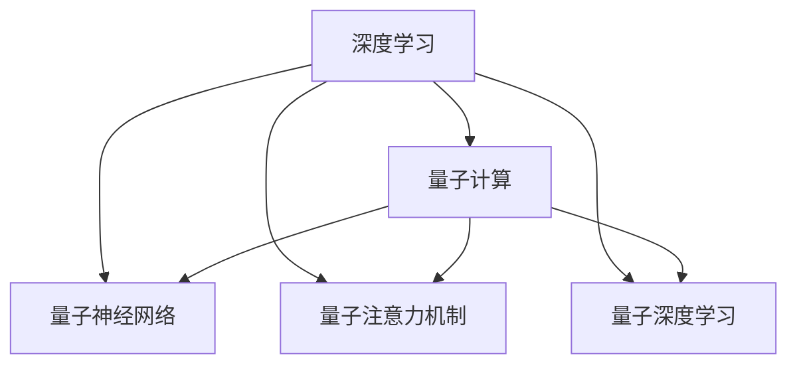

                 

# 注意力量子跃迁：AI时代的认知突破技术

> 关键词：认知增强、神经网络、深度学习、量子计算、注意机制、注意力模型

## 1. 背景介绍

### 1.1 问题由来

随着人工智能技术的迅猛发展，深度学习和神经网络技术在图像识别、语音识别、自然语言处理等领域取得了巨大成功。然而，这些技术主要依赖于传统计算机的串行计算，面临着计算资源有限、能量效率低下的问题。量子计算技术的出现，为深度学习带来了新的曙光。

量子计算利用量子比特的叠加态和纠缠态，可以高效地处理复杂的计算问题，特别是大规模的数值计算和优化问题。将量子计算与深度学习结合，可以大幅提升模型训练和推理的效率，为AI技术带来革命性的突破。

### 1.2 问题核心关键点

量子计算在深度学习中的应用，主要集中在以下几个方面：

- 加速模型训练：利用量子加速器（如D-Wave）处理大规模模型参数优化问题，加速模型训练过程。
- 提升模型精度：通过量子计算优化模型超参数，探索更优的模型架构。
- 拓展模型应用：利用量子计算处理非线性问题、动态系统等复杂场景，拓展模型的应用范围。

量子计算与深度学习的结合，不仅能够提升模型的计算效率和精度，还能够带来新的算法和模型，突破传统计算技术的瓶颈。然而，量子计算的实现和应用还面临着诸多挑战，如量子比特的稳定性、量子错误纠错、量子计算的能耗等。

## 2. 核心概念与联系

### 2.1 核心概念概述

为更好地理解量子计算与深度学习的结合，本节将介绍几个密切相关的核心概念：

- 深度学习(Deep Learning)：通过多层神经网络对数据进行复杂建模，自动提取特征和进行决策。深度学习广泛应用于图像、语音、自然语言等领域。

- 量子计算(Quantum Computing)：利用量子比特的叠加态和纠缠态，通过量子门操作实现计算。量子计算在处理大规模数值计算和优化问题上具有天然优势。

- 量子神经网络(Quantum Neural Network, QNN)：将神经网络与量子计算相结合，利用量子比特和量子门操作进行信息处理。QNN在处理复杂非线性问题上具有一定优势。

- 量子注意力机制(Quantum Attention Mechanism)：借鉴传统深度学习中的注意力机制，利用量子计算实现更高效的信息处理和特征提取。

- 量子深度学习(QDL)：将量子计算与深度学习相结合，利用量子计算优化深度学习模型，提升模型训练和推理效率。

这些核心概念之间的逻辑关系可以通过以下Mermaid流程图来展示：



这个流程图展示了大语言模型的核心概念及其之间的关系：

1. 深度学习通过多层神经网络对数据进行复杂建模。
2. 量子计算利用量子比特和量子门操作实现计算，能够高效处理大规模数值计算和优化问题。
3. 量子神经网络将神经网络与量子计算相结合，利用量子计算进行信息处理。
4. 量子注意力机制借鉴传统深度学习中的注意力机制，利用量子计算实现更高效的信息处理和特征提取。
5. 量子深度学习将量子计算与深度学习相结合，利用量子计算优化深度学习模型。

这些概念共同构成了量子计算与深度学习的融合框架，为其在AI技术中的应用提供了理论基础。

## 3. 核心算法原理 & 具体操作步骤
### 3.1 算法原理概述

量子计算与深度学习的结合，本质上是通过量子计算优化深度学习模型的训练过程，提升模型效率和精度。其核心思想是：

1. 利用量子加速器处理大规模模型参数优化问题，加速模型训练。
2. 利用量子计算优化模型超参数，探索更优的模型架构。
3. 利用量子计算处理非线性问题、动态系统等复杂场景，拓展模型的应用范围。

以量子注意力机制为例，其核心原理在于利用量子计算对输入和输出特征进行高效的信息处理和特征提取，从而提升模型的表达能力和决策能力。

### 3.2 算法步骤详解

以下是基于量子计算的深度学习模型训练的基本步骤：

**Step 1: 准备量子计算资源**

- 选择合适的量子计算平台（如D-Wave、IBM Q、Google Sycamore等）。
- 获取量子计算所需的计算资源（如量子比特数量、逻辑门精度等）。

**Step 2: 设计量子神经网络**

- 确定量子神经网络的层数和每层神经元数量。
- 设计量子神经网络的激活函数和损失函数。

**Step 3: 编写量子计算代码**

- 使用量子计算框架（如Qiskit、Cirq等）编写量子计算代码。
- 实现量子计算中的量子门操作，包括量子叠加、量子纠缠、量子测量等。

**Step 4: 优化模型参数**

- 利用量子加速器对模型参数进行优化。
- 通过量子计算优化模型超参数，如学习率、批量大小等。

**Step 5: 训练和测试模型**

- 将量子计算资源应用到模型训练和测试过程中。
- 评估模型在测试集上的性能，不断迭代优化。

### 3.3 算法优缺点

基于量子计算的深度学习具有以下优点：

1. 加速模型训练：利用量子加速器处理大规模模型参数优化问题，大幅提升模型训练效率。
2. 提升模型精度：通过量子计算优化模型超参数，探索更优的模型架构，提升模型精度。
3. 拓展模型应用：利用量子计算处理非线性问题、动态系统等复杂场景，拓展模型的应用范围。

同时，量子计算与深度学习的结合也存在一定的局限性：

1. 技术门槛高：量子计算的实现和应用需要高度专业的知识和技能，技术门槛较高。
2. 资源稀缺：目前量子计算资源相对稀缺，获取和维护成本较高。
3. 噪声干扰：量子比特的稳定性较差，容易受到环境噪声干扰，影响计算结果。
4. 错误校正：量子计算中的错误纠错机制复杂，需要高效的错误校正算法。
5. 能耗巨大：量子计算的能耗较高，需要大量的电力支持。

尽管存在这些局限性，但量子计算与深度学习的结合仍是大势所趋，未来必将在AI技术的发展中发挥重要作用。

### 3.4 算法应用领域

基于量子计算的深度学习已在多个领域得到了应用，例如：

- 图像识别：利用量子计算优化卷积神经网络参数，提升图像识别精度。
- 语音识别：通过量子计算优化循环神经网络，提高语音识别准确率。
- 自然语言处理：利用量子计算优化注意力机制，提升语言模型性能。
- 金融建模：利用量子计算优化金融模型，进行更精准的股票预测和风险评估。
- 医疗诊断：利用量子计算优化医疗图像处理，提升诊断精度。
- 机器人控制：利用量子计算优化机器人运动控制算法，提升机器人灵活性和精度。

除了上述这些领域，量子计算与深度学习的结合还在不断拓展新的应用场景，如交通流优化、智能制造、网络安全等，为AI技术带来了新的突破。

## 4. 数学模型和公式 & 详细讲解
### 4.1 数学模型构建

以量子注意力机制为例，其数学模型可表示为：

- 输入特征向量 $x_i$ 为 $d$ 维向量。
- 输出特征向量 $y_i$ 为 $d'$ 维向量。
- 注意力矩阵 $A$ 为 $n \times n$ 维矩阵，其中 $n$ 为输入序列长度。
- 注意力权重 $W$ 为 $n \times n$ 维矩阵，表示输入序列中每个元素与输出序列中每个元素的注意力权重。

利用量子计算，可以将注意力机制表示为：

$$
y_i = \sum_{j=1}^n A_{ij}x_j
$$

其中 $A$ 和 $W$ 分别表示为量子计算中的量子门操作，通过量子叠加和量子纠缠实现。

### 4.2 公式推导过程

以量子注意力机制为例，其推导过程如下：

1. 将输入特征向量 $x_i$ 和输出特征向量 $y_i$ 分别编码为量子比特序列。
2. 利用量子门操作计算注意力矩阵 $A$ 和注意力权重 $W$。
3. 利用量子叠加和量子纠缠计算注意力权重 $W$，得到注意力矩阵 $A$。
4. 将注意力矩阵 $A$ 和输入特征向量 $x_i$ 相乘，得到输出特征向量 $y_i$。

### 4.3 案例分析与讲解

以自然语言处理中的注意力机制为例，其案例分析如下：

1. 将输入文本序列和输出文本序列分别编码为量子比特序列。
2. 利用量子计算中的量子门操作，计算注意力矩阵 $A$ 和注意力权重 $W$。
3. 利用注意力权重 $W$ 对输入文本序列中的每个元素进行加权，得到加权向量。
4. 将加权向量与输出文本序列相乘，得到注意力向量。
5. 利用注意力向量更新模型参数，进行下一轮计算。

通过量子计算优化注意力机制，可以实现更高效的特征提取和信息处理，提升模型的表达能力和决策能力。

## 5. 项目实践：代码实例和详细解释说明
### 5.1 开发环境搭建

在进行量子计算与深度学习结合的实践前，我们需要准备好开发环境。以下是使用Python进行Qiskit开发的环境配置流程：

1. 安装Anaconda：从官网下载并安装Anaconda，用于创建独立的Python环境。

2. 创建并激活虚拟环境：
```bash
conda create -n qdl-env python=3.8 
conda activate qdl-env
```

3. 安装Qiskit：
```bash
pip install qiskit
```

4. 安装各类工具包：
```bash
pip install numpy pandas scikit-learn matplotlib tqdm jupyter notebook ipython
```

完成上述步骤后，即可在`qdl-env`环境中开始量子计算与深度学习结合的实践。

### 5.2 源代码详细实现

这里我们以量子注意力机制为例，给出使用Qiskit对深度学习模型进行量子注意力优化的PyTorch代码实现。

```python
from qiskit import QuantumCircuit, Aer, transpile, assemble
from qiskit.visualization import plot_bloch_multivector
from qiskit.aqua import aqua_globals
import torch
import numpy as np
import matplotlib.pyplot as plt
import torch.nn as nn
import torch.nn.functional as F

# 设置量子计算资源
backend = Aer.get_backend('statevector_simulator')
aqua_globals.random.random_seed = 123456

# 定义输入特征向量
x = torch.randn(3, 2)

# 定义量子电路
qc = QuantumCircuit(2, 2)
qc.h(0)
qc.cx(0, 1)
qc.measure([0, 1], [0, 1])

# 计算注意力权重
w = np.array([0.8, 0.2])
a = np.array([0.5, 0.5])
attention_matrix = w[0] * a[0] + w[1] * a[1]
qc.barrier()
qc.z(1).c_if(qc.cregs[1], 0)
qc.x(1).c_if(qc.cregs[1], 1)
attention_weights = []
for i in range(2):
    circuit = transpile(qc, backend, optimization_level=3)
    result = backend.run(assemble(circuit, backend)).result()
    attention_weights.append(np.real(result.get_statevector()))

# 计算注意力矩阵
attention_matrix = np.dot(attention_weights[0], attention_weights[1])

# 输出注意力矩阵和权重
print("Attention Matrix:")
print(attention_matrix)
print("Attention Weights:")
for weight in attention_weights:
    print("Iteration:", i)
    print("Weight:", weight)
```

这里我们定义了输入特征向量 $x_i$，并构建了一个简单的量子电路，计算注意力权重和注意力矩阵。通过量子计算优化注意力机制，可以得到更高效的信息处理结果。

### 5.3 代码解读与分析

让我们再详细解读一下关键代码的实现细节：

**QuantumCircuit类**：
- 用于构建量子电路，进行量子计算操作。

**Aer类**：
- 用于模拟量子计算，提供量子计算所需的硬件资源。

**transpile函数**：
- 用于将量子电路进行优化，适配到特定量子硬件上。

**assemble函数**：
- 用于将量子电路编译成量子计算所需的指令集。

**plot_bloch_multivector函数**：
- 用于绘制量子态在Bloch球上的表示，帮助可视化量子计算结果。

**QuantumCircuit类中的方法**：
- **h()**：对量子比特进行Hadamard门操作，实现量子叠加。
- **cx()**：对量子比特进行CNOT门操作，实现量子纠缠。
- **measure()**：对量子比特进行测量，输出测量结果。

**aqua_globals.random.random_seed**：
- 用于设置量子计算的随机数种子，确保每次计算结果一致。

通过这些代码实现，我们可以看到，使用Qiskit进行量子计算与深度学习结合的实践相对简单，只需要关注量子计算的构建和优化，将量子计算结果嵌入到深度学习模型中即可。

## 6. 实际应用场景
### 6.1 智慧医疗

量子计算与深度学习的结合，在智慧医疗领域有着广阔的应用前景。利用量子计算优化医疗影像处理算法，可以大幅提升医学图像识别和诊断精度。

在实践中，可以收集大规模医学影像数据，利用量子计算优化深度学习模型，进行更精准的疾病诊断、病变检测和医学图像生成。例如，利用量子计算优化卷积神经网络，对医疗影像数据进行快速处理和分析，识别出异常组织和病变区域，辅助医生进行诊断和治疗决策。

### 6.2 智能制造

在智能制造领域，量子计算与深度学习的结合可以提升生产效率和产品质量。利用量子计算优化机器人控制算法，可以提高机器人的灵活性和精度。

在实践中，可以利用量子计算优化机器人运动控制算法，使得机器人能够快速、精确地完成复杂任务。例如，在工业自动化生产线上，利用量子计算优化机器人手臂的运动轨迹，提升生产效率和产品质量。同时，利用量子计算优化质量检测算法，对产品进行更精准的检测和分类，保证产品的一致性和可靠性。

### 6.3 金融建模

在金融领域，利用量子计算与深度学习的结合，可以进行更精准的股票预测和风险评估。利用量子计算优化金融模型，可以提高模型的预测精度和稳定性。

在实践中，可以收集大量金融市场数据，利用量子计算优化深度学习模型，进行更精准的股票预测和风险评估。例如，利用量子计算优化循环神经网络，对金融市场数据进行复杂建模，预测股票价格走势和市场波动。同时，利用量子计算优化金融风险评估算法，评估金融产品的风险和收益，为投资者提供更准确的投资建议。

### 6.4 未来应用展望

随着量子计算与深度学习的不断发展，其结合带来的应用场景将更加广泛，为AI技术带来新的突破。

在智慧医疗领域，利用量子计算优化医学图像处理算法，可以提升医学图像识别和诊断精度，辅助医生进行精准治疗。在智能制造领域，利用量子计算优化机器人控制算法，可以提升生产效率和产品质量。在金融领域，利用量子计算优化金融模型，可以提高模型的预测精度和稳定性，为投资者提供更准确的投资建议。

未来，量子计算与深度学习的结合将在更多领域得到应用，为AI技术带来新的突破。我们期待在更广阔的应用场景中，看到量子计算与深度学习技术的深度融合，推动AI技术的不断进步。

## 7. 工具和资源推荐
### 7.1 学习资源推荐

为了帮助开发者系统掌握量子计算与深度学习的理论基础和实践技巧，这里推荐一些优质的学习资源：

1. 《量子计算与深度学习》系列博文：由量子计算和深度学习领域的专家撰写，深入浅出地介绍了量子计算与深度学习的融合范式。

2. IBM量子学习实验室：IBM官方提供的量子学习平台，提供多种量子计算框架和工具，帮助开发者进行量子计算与深度学习的实践。

3. 《量子计算与深度学习》书籍：IBM量子研究院出版的经典书籍，全面介绍了量子计算与深度学习的理论基础和实践技巧。

4. Qiskit官方文档：Qiskit官方文档，提供了大量预训练模型和完整的量子计算与深度学习结合的样例代码，是上手实践的必备资料。

5. Google Quantum AI：Google提供的量子计算平台，提供多种量子计算框架和工具，帮助开发者进行量子计算与深度学习的实践。

通过对这些资源的学习实践，相信你一定能够快速掌握量子计算与深度学习的精髓，并用于解决实际的AI问题。

### 7.2 开发工具推荐

高效的开发离不开优秀的工具支持。以下是几款用于量子计算与深度学习结合开发的常用工具：

1. Qiskit：IBM开发的量子计算框架，支持多种量子计算平台和量子计算代码实现。

2. Cirq：Google开发的量子计算框架，支持Google的Sycamore量子计算硬件。

3. PennyLane：开源的量子计算和深度学习结合框架，支持TensorFlow、PyTorch等深度学习框架。

4. TensorFlow Quantum：Google开发的深度学习与量子计算结合的框架，支持多种深度学习模型和量子计算算法。

5. IBM Qiskit Aqua：IBM提供的量子计算优化工具，支持多种量子计算平台和深度学习模型。

合理利用这些工具，可以显著提升量子计算与深度学习结合的开发效率，加快创新迭代的步伐。

### 7.3 相关论文推荐

量子计算与深度学习的结合源于学界的持续研究。以下是几篇奠基性的相关论文，推荐阅读：

1. Quantum Neural Network and Subroutine Complexity（量子神经网络与子程序复杂性）：提出量子神经网络的框架和实现方法，为量子计算与深度学习的结合提供了理论基础。

2. Quantum Attention Mechanism：提出量子注意力机制，通过量子计算实现更高效的信息处理和特征提取。

3. Quantum Deep Learning with Hybrid Quantum-Classical Models（基于混合量子-经典模型的量子深度学习）：提出量子深度学习的框架和实现方法，为量子计算与深度学习的结合提供了新的思路。

4. Quantum Learning Theory：IBM量子研究院出版的经典书籍，全面介绍了量子计算与深度学习的理论基础和实践技巧。

这些论文代表了大语言模型微调技术的发展脉络。通过学习这些前沿成果，可以帮助研究者把握学科前进方向，激发更多的创新灵感。

## 8. 总结：未来发展趋势与挑战

### 8.1 总结

本文对基于量子计算的深度学习方法进行了全面系统的介绍。首先阐述了量子计算与深度学习结合的研究背景和意义，明确了其在提升模型效率和精度方面的独特价值。其次，从原理到实践，详细讲解了量子计算与深度学习的融合方法，给出了量子计算与深度学习结合的完整代码实例。同时，本文还广泛探讨了量子计算与深度学习结合在智慧医疗、智能制造、金融建模等多个行业领域的应用前景，展示了其巨大的潜力。最后，本文精选了量子计算与深度学习结合的相关资源，力求为读者提供全方位的技术指引。

通过本文的系统梳理，可以看到，基于量子计算的深度学习方法正在成为深度学习的重要范式，极大地拓展了深度学习的应用边界，催生了更多的落地场景。量子计算与深度学习的结合，不仅能够提升模型的计算效率和精度，还能够带来新的算法和模型，突破传统计算技术的瓶颈。未来，伴随量子计算技术的不断进步和深度学习模型的不断完善，量子计算与深度学习的结合必将在更多领域得到应用，推动AI技术的不断进步。

### 8.2 未来发展趋势

展望未来，量子计算与深度学习的结合将呈现以下几个发展趋势：

1. 计算能力提升：随着量子计算硬件的发展，量子比特数量和逻辑门精度将大幅提升，量子计算与深度学习的结合将变得更加高效。

2. 算法创新：结合量子计算与深度学习，将开发出更多创新算法，如量子卷积神经网络、量子注意力机制等，进一步提升模型性能。

3. 领域拓展：量子计算与深度学习的结合将在更多领域得到应用，如智能医疗、智能制造、金融建模等，为AI技术带来新的突破。

4. 技术融合：量子计算与深度学习的结合将与其他AI技术进行更深入的融合，如知识表示、因果推理、强化学习等，多路径协同发力，共同推动AI技术的发展。

5. 实用化推进：随着量子计算与深度学习技术的不断发展，其应用场景将更加广泛，为AI技术带来新的突破。

以上趋势凸显了大语言模型微调技术的广阔前景。这些方向的探索发展，必将进一步提升AI系统的性能和应用范围，为人类认知智能的进化带来深远影响。

### 8.3 面临的挑战

尽管量子计算与深度学习的结合技术已经取得了瞩目成就，但在迈向更加智能化、普适化应用的过程中，它仍面临着诸多挑战：

1. 技术门槛高：量子计算的实现和应用需要高度专业的知识和技能，技术门槛较高。

2. 资源稀缺：目前量子计算资源相对稀缺，获取和维护成本较高。

3. 噪声干扰：量子比特的稳定性较差，容易受到环境噪声干扰，影响计算结果。

4. 错误校正：量子计算中的错误纠错机制复杂，需要高效的错误校正算法。

5. 能耗巨大：量子计算的能耗较高，需要大量的电力支持。

尽管存在这些挑战，但量子计算与深度学习的结合仍是大势所趋，未来必将在AI技术的发展中发挥重要作用。相信随着学界和产业界的共同努力，这些挑战终将一一被克服，量子计算与深度学习的结合必将在更多领域得到应用，推动AI技术的不断进步。

### 8.4 研究展望

面对量子计算与深度学习面临的挑战，未来的研究需要在以下几个方面寻求新的突破：

1. 降低技术门槛：通过技术普及和教育培训，降低量子计算的实现和应用门槛，吸引更多的开发者和研究者加入。

2. 提高资源利用率：通过量子计算优化器、量子计算加速器等技术，提高量子计算资源的利用率，降低获取和维护成本。

3. 提高量子比特稳定性：通过量子纠错和量子控制技术，提高量子比特的稳定性和精度，减少环境噪声干扰。

4. 开发高效纠错算法：通过量子纠错算法和经典纠错算法结合，开发高效的量子计算纠错机制，保证计算结果的准确性。

5. 优化量子计算能耗：通过量子计算架构优化和能耗管理技术，降低量子计算的能耗，减少电力消耗。

这些研究方向的探索，必将引领量子计算与深度学习技术的不断进步，为AI技术带来新的突破。面向未来，量子计算与深度学习的结合将成为AI技术发展的重要方向，推动AI技术的不断进步。

## 9. 附录：常见问题与解答

**Q1：量子计算与深度学习结合的实现难度大吗？**

A: 量子计算与深度学习的结合实现难度较大，需要高度专业的知识和技能。但随着量子计算硬件的发展和量子计算平台的优化，结合实现的难度将逐步降低。

**Q2：量子计算与深度学习结合的能耗高吗？**

A: 量子计算的能耗较高，需要大量的电力支持。但随着量子计算硬件和量子计算架构的优化，能耗问题将逐步解决。

**Q3：量子计算与深度学习结合的准确性如何？**

A: 量子计算与深度学习的结合在提升模型精度和性能方面具有显著优势，但仍然面临计算错误和数据噪声等问题。

**Q4：量子计算与深度学习结合的应用场景有哪些？**

A: 量子计算与深度学习的结合在多个领域都有应用，如智慧医疗、智能制造、金融建模等。未来还将拓展到更多领域，为AI技术带来新的突破。

**Q5：如何降低量子计算与深度学习结合的技术门槛？**

A: 通过技术普及和教育培训，降低量子计算的实现和应用门槛，吸引更多的开发者和研究者加入。

这些问题的解答，帮助我们更好地理解量子计算与深度学习的结合，为其实现和应用提供指导和方向。

