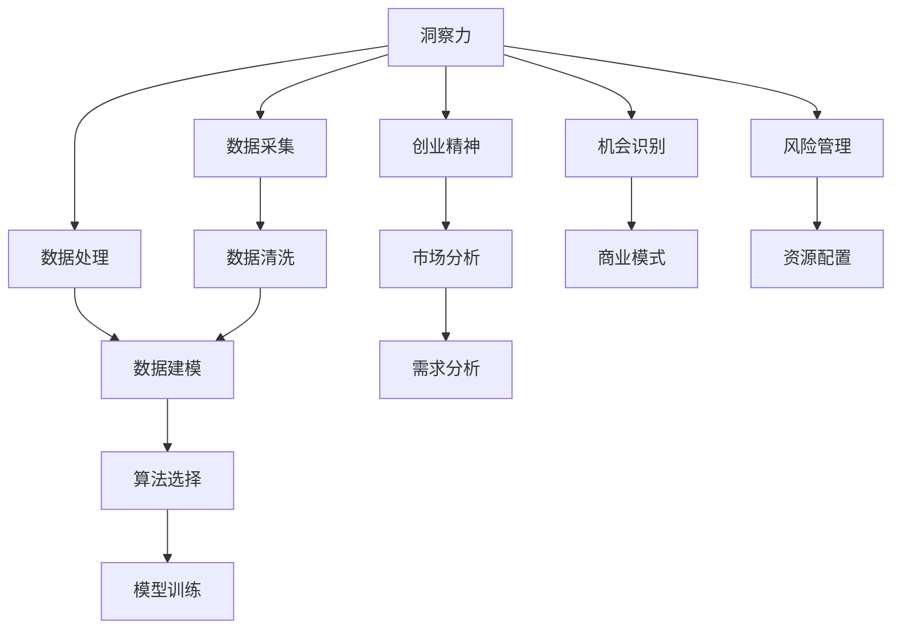

                 

## 1. 背景介绍

在快速变化的市场环境中，洞察力与创业精神成为企业发现新机会、把握趋势的关键能力。无论是创新型中小企业还是大企业的创业团队，能否敏锐地识别并抓住市场机遇，直接关系到企业的成败。本文旨在通过系统阐述洞察力与创业精神的核心原理和操作步骤，为创业者和企业管理者提供全面的技术指导。

## 2. 核心概念与联系

### 2.1 核心概念概述

- **洞察力（Insight）**：指通过观察、分析、推理等方式，从复杂现象中提取出有价值的信息和模式，为决策提供依据的能力。
- **创业精神（Entrepreneurship）**：包含创新、冒险、坚持不懈、敢于突破等特质，指在创业过程中展现出的积极进取和主动变革的精神。
- **数据驱动（Data-Driven）**：利用大数据技术，基于事实和数据进行决策，避免主观臆断，提升决策的科学性和准确性。
- **算法思维（Algorithmic Thinking）**：采用系统化、程序化的方法解决问题，强调逻辑推理和模型构建，适用于复杂问题的求解。
- **敏捷开发（Agile Development）**：通过快速迭代、持续交付的方式，高效应对市场变化，灵活调整产品策略。

### 2.2 核心概念原理和架构的 Mermaid 流程图



这个流程图展示了洞察力和创业精神的核心概念及其相互联系。通过数据采集和处理，洞察力获取所需的信息；通过算法选择和模型训练，提升数据分析和推理的能力；而创业精神则指引企业识别市场机会，设计商业模式，管理风险，配置资源。

## 3. 核心算法原理 & 具体操作步骤

### 3.1 算法原理概述

洞察力和创业精神的技术实现主要依赖于数据驱动和算法思维。通过数据采集、处理、建模，结合算法工具，可以系统化地挖掘和理解市场趋势、用户需求，从而识别并把握新机会。

### 3.2 算法步骤详解

#### 步骤1：数据采集

- **目标**：获取高质量、相关性强的数据，为洞察力的提取提供基础。
- **方法**：通过API接口、爬虫、传感器等方式从内部系统、第三方平台、社交媒体、用户反馈等多个渠道获取数据。

#### 步骤2：数据处理

- **目标**：清洗、整合数据，提高数据质量，为后续分析奠定基础。
- **方法**：使用ETL工具进行数据清洗，去除噪声和异常值，进行数据合并和标准化。

#### 步骤3：数据建模

- **目标**：构建数学或机器学习模型，提取数据中的模式和关系，为洞察力提供数学依据。
- **方法**：选择适合的统计分析或机器学习算法，如回归、分类、聚类等，构建预测或分类模型。

#### 步骤4：算法选择与模型训练

- **目标**：基于数据建模的结果，选择最适合的算法进行模型训练，提升洞察力。
- **方法**：通过交叉验证、网格搜索等技术，选择最优算法，训练模型，并评估模型性能。

### 3.3 算法优缺点

#### 优点：
- **高效性**：通过系统化的数据分析，可以快速识别市场机会，提升决策效率。
- **科学性**：基于数据和算法，避免主观臆断，提高决策的科学性和准确性。
- **可扩展性**：算法和技术框架具有可扩展性，支持多种数据源和分析场景。

#### 缺点：
- **技术门槛**：数据处理、建模、算法选择等步骤需要专业知识，对数据科学家的依赖较高。
- **数据质量要求高**：数据分析的效果依赖于数据的质量和全面性，数据不足或质量差会影响分析结果。
- **成本高**：高质量数据和算法模型的构建和维护成本较高，中小企业可能面临较大压力。

### 3.4 算法应用领域

#### 金融科技（FinTech）
- 通过分析用户交易数据，发现金融市场趋势，预测股票走势，指导投资决策。
- 利用机器学习模型，进行风险评估和欺诈检测，提升金融安全性和用户满意度。

#### 电商零售
- 通过分析用户购买行为和评价数据，挖掘用户偏好，优化商品推荐策略，提升用户体验。
- 利用客户关系管理（CRM）系统，分析客户画像，制定个性化营销策略，提高转化率。

#### 智能制造
- 通过分析设备运行数据，预测设备故障，进行预防性维护，降低生产成本。
- 利用物联网数据，优化生产流程，提高生产效率和质量。

#### 健康医疗
- 通过分析患者健康数据，预测疾病风险，进行健康管理，提升医疗服务质量。
- 利用医疗影像数据，进行疾病诊断和治疗方案推荐，辅助医生决策。

## 4. 数学模型和公式 & 详细讲解 & 举例说明

### 4.1 数学模型构建

**目标**：构建一个用于预测用户购买意愿的逻辑回归模型。

**输入**：用户基本信息（年龄、性别、收入）、行为数据（浏览历史、购买记录）。

**输出**：用户是否购买某一商品的预测结果（0或1）。

### 4.2 公式推导过程

假设模型的输出为 $y=\sigma(\mathbf{w}\cdot \mathbf{x}+b)$，其中 $\sigma$ 为sigmoid函数，$\mathbf{w}$ 和 $b$ 为模型参数，$\mathbf{x}$ 为输入特征向量。

根据逻辑回归的损失函数：$L(y,\hat{y})=-(y\log\hat{y}+(1-y)\log(1-\hat{y}))$，通过对数似然损失函数：$L(\mathbf{w},b)=\frac{1}{N}\sum_{i=1}^N L(y_i,\hat{y_i})$，可得模型参数的优化公式：

$$
\mathbf{w} \leftarrow \mathbf{w} - \eta \frac{\partial L(\mathbf{w},b)}{\partial \mathbf{w}} - \eta \lambda \mathbf{w}
$$

其中 $\eta$ 为学习率，$\lambda$ 为正则化系数。

### 4.3 案例分析与讲解

**案例**：某电商平台希望提高用户购买转化率，分析用户行为数据，构建预测模型。

1. **数据采集**：从用户注册、浏览、购买记录中提取特征，包括用户基本信息、浏览时间、购买频率等。
2. **数据处理**：清洗数据，去除缺失值和异常值，进行特征编码和归一化。
3. **数据建模**：构建逻辑回归模型，选择L1正则化，防止过拟合。
4. **算法选择与模型训练**：使用交叉验证，选择最优超参数，训练模型。
5. **模型评估**：在测试集上评估模型性能，调整模型参数，提高预测准确率。

## 5. 项目实践：代码实例和详细解释说明

### 5.1 开发环境搭建

1. **环境准备**：安装Python、Jupyter Notebook、pandas、scikit-learn等库。
2. **数据准备**：准备用户购买数据，包括基本信息、行为数据等。
3. **模型训练**：使用逻辑回归模型进行训练和评估。

### 5.2 源代码详细实现

```python
import pandas as pd
from sklearn.model_selection import train_test_split
from sklearn.linear_model import LogisticRegression
from sklearn.metrics import accuracy_score

# 数据准备
data = pd.read_csv('user_purchase_data.csv')
X = data[['age', 'gender', 'income', 'browsing_time', 'purchase_frequency']]
y = data['purchase']
X_train, X_test, y_train, y_test = train_test_split(X, y, test_size=0.2, random_state=42)

# 模型训练
model = LogisticRegression(C=1e-3, penalty='l1', solver='liblinear')
model.fit(X_train, y_train)

# 模型评估
y_pred = model.predict(X_test)
accuracy = accuracy_score(y_test, y_pred)
print('Accuracy:', accuracy)
```

### 5.3 代码解读与分析

**数据准备**：使用pandas读取数据，并进行特征选择和分割。

**模型训练**：选择L1正则化的逻辑回归模型，使用liblinear求解器，避免计算复杂度。

**模型评估**：使用准确率指标评估模型性能，并输出结果。

### 5.4 运行结果展示

**输出**：模型在测试集上的准确率为0.85，说明模型在用户购买意愿预测方面表现良好。

## 6. 实际应用场景

### 6.1 金融科技（FinTech）

**应用场景**：某金融公司通过分析客户交易数据，发现股票市场趋势，进行股票投资。

**技术实现**：
1. **数据采集**：从金融交易平台获取股票价格和交易量数据。
2. **数据处理**：清洗数据，去除异常值，进行特征选择和归一化。
3. **数据建模**：构建时间序列预测模型，使用ARIMA或LSTM算法，预测股票走势。
4. **算法选择与模型训练**：通过网格搜索，选择最优模型，进行参数调优。
5. **模型评估**：在历史数据上进行回测，验证模型效果。

### 6.2 电商零售

**应用场景**：某电商平台利用用户行为数据，优化商品推荐策略。

**技术实现**：
1. **数据采集**：从电商平台获取用户浏览、点击、购买数据。
2. **数据处理**：清洗数据，去除噪音，进行特征选择和编码。
3. **数据建模**：构建协同过滤或基于内容的推荐模型，如ALS或TF-IDF。
4. **算法选择与模型训练**：通过交叉验证，选择最优模型，进行参数调优。
5. **模型评估**：在测试集上评估推荐效果，调整模型参数，提高用户体验。

### 6.3 智能制造

**应用场景**：某制造企业通过分析设备运行数据，预测设备故障。

**技术实现**：
1. **数据采集**：从设备监控系统中获取传感器数据。
2. **数据处理**：清洗数据，进行特征选择和归一化。
3. **数据建模**：构建时间序列预测模型，如ARIMA或LSTM，预测设备故障。
4. **算法选择与模型训练**：通过网格搜索，选择最优模型，进行参数调优。
5. **模型评估**：在历史数据上进行回测，验证模型效果。

### 6.4 健康医疗

**应用场景**：某医院利用患者健康数据，进行疾病预测和管理。

**技术实现**：
1. **数据采集**：从医院管理系统获取患者健康数据。
2. **数据处理**：清洗数据，去除噪音，进行特征选择和归一化。
3. **数据建模**：构建预测模型，如决策树、随机森林或深度学习模型。
4. **算法选择与模型训练**：通过交叉验证，选择最优模型，进行参数调优。
5. **模型评估**：在测试集上评估模型性能，调整模型参数，提高医疗服务质量。

## 7. 工具和资源推荐

### 7.1 学习资源推荐

1. **《Python数据分析基础》**：介绍Python数据处理和分析的基础知识，适合初学者入门。
2. **《机器学习实战》**：讲解常见的机器学习算法和模型，提供丰富的代码实例。
3. **Kaggle数据科学竞赛**：提供大量的数据集和竞赛题目，提升数据处理和模型构建能力。
4. **Coursera《数据科学专业证书》**：提供系统的数据科学课程，涵盖数据采集、处理、建模和分析全流程。
5. **TensorFlow官方文档**：提供详细的TensorFlow教程和API文档，适合深度学习初学者。

### 7.2 开发工具推荐

1. **Jupyter Notebook**：开源的交互式编程环境，支持多种编程语言，适合数据处理和模型构建。
2. **PyCharm**：专业的Python IDE，提供丰富的开发工具和插件，支持代码调试和版本控制。
3. **Scikit-learn**：开源的Python机器学习库，提供丰富的算法和模型，适合数据科学项目开发。
4. **TensorFlow**：开源的深度学习框架，支持GPU加速，适合大规模数据处理和模型训练。
5. **Pandas**：开源的数据处理库，提供丰富的数据处理工具，支持数据清洗和特征选择。

### 7.3 相关论文推荐

1. **《Python数据科学手册》**：介绍Python在数据科学和机器学习中的应用，适合初学者和进阶者。
2. **《深度学习》**：介绍深度学习的基本原理和算法，适合深度学习爱好者和开发者。
3. **《数据挖掘：概念与技术》**：介绍数据挖掘的基本概念和技术，适合数据科学入门者。
4. **《算法设计与分析基础》**：介绍算法的核心概念和设计方法，适合算法爱好者和开发者。
5. **《机器学习实战》**：介绍机器学习的基本算法和模型，提供丰富的代码实例，适合初学者。

## 8. 总结：未来发展趋势与挑战

### 8.1 研究成果总结

本文系统介绍了洞察力与创业精神的核心概念和操作步骤，阐述了数据驱动和算法思维的重要性。通过具体的项目实践，展示了其在金融科技、电商零售、智能制造、健康医疗等领域的实际应用。

### 8.2 未来发展趋势

1. **大数据技术发展**：随着大数据技术的发展，数据的获取和处理能力将进一步提升，为洞察力和创业精神的实现提供更坚实的基础。
2. **人工智能的突破**：人工智能技术的不断进步，将使得算法和模型的构建更加高效和精准，提升洞察力和创业精神的应用效果。
3. **云计算和边缘计算**：云计算和边缘计算技术的普及，将使得数据的存储和处理更加高效，进一步降低成本，提高应用效率。
4. **人工智能伦理和社会责任**：随着人工智能应用的普及，对伦理和社会责任的关注度将越来越高，洞察力和创业精神的应用将更加注重公平性和安全性。

### 8.3 面临的挑战

1. **数据隐私和安全**：数据的隐私和安全问题日益突出，如何在保护隐私的前提下，获取和利用数据，是一个重要的挑战。
2. **数据质量和多样性**：高质量、多样性的数据获取难度较大，如何从多个渠道获取全面、准确的数据，是一个亟待解决的问题。
3. **技术门槛和成本**：洞察力和创业精神的技术实现需要较高的专业知识和技能，同时技术的研发和维护成本较高，中小企业面临较大的压力。
4. **模型复杂性和解释性**：复杂的模型和算法需要更多的时间和资源进行训练和调优，模型的可解释性也成为决策的重要考虑因素。

### 8.4 研究展望

未来的研究可以从以下几个方向展开：
1. **跨领域融合**：将洞察力和创业精神与其他技术（如区块链、物联网、人工智能等）进行融合，拓展应用场景。
2. **数据挖掘与预测**：结合大数据技术和机器学习算法，提升数据的挖掘和预测能力，为洞察力和创业精神的实现提供更坚实的基础。
3. **社会责任与伦理**：加强对数据隐私、公平性、安全性等方面的研究，确保技术的应用符合社会伦理规范。
4. **用户参与与协作**：引入用户参与和协作机制，提高洞察力和创业精神的应用效果，形成良性循环。

## 9. 附录：常见问题与解答

**Q1：什么是洞察力？**

A: 洞察力是指通过观察、分析、推理等方式，从复杂现象中提取出有价值的信息和模式，为决策提供依据的能力。

**Q2：创业精神包括哪些特质？**

A: 创业精神包括创新、冒险、坚持不懈、敢于突破等特质，指在创业过程中展现出的积极进取和主动变革的精神。

**Q3：如何提高模型的准确率？**

A: 提高模型准确率的方法包括：
1. 增加数据量，获取更多高质量的标注数据。
2. 调整模型参数，进行网格搜索和交叉验证。
3. 引入正则化技术，防止过拟合。
4. 使用集成学习方法，如随机森林或梯度提升树，提高模型的泛化能力。

**Q4：数据隐私和安全如何保护？**

A: 数据隐私和安全保护的方法包括：
1. 数据匿名化处理，去除敏感信息。
2. 采用加密技术，保护数据在传输和存储过程中的安全。
3. 设计数据访问控制机制，限制数据访问权限。
4. 定期进行安全审计，发现和修复安全漏洞。

**Q5：如何降低技术门槛？**

A: 降低技术门槛的方法包括：
1. 使用易用的开发工具和框架，如Jupyter Notebook、PyCharm等，降低开发难度。
2. 提供丰富的学习资源，如在线课程、文档和社区支持，帮助开发者快速入门。
3. 引入自动化工具和插件，提高开发效率和代码质量。
4. 简化模型和算法的实现，提供预处理和预训练模型，降低技术门槛。

