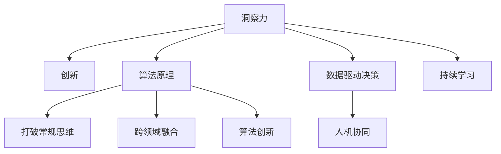

                 

# 洞察力与创新：打破常规思维的关键

> 关键词：洞察力,创新,打破常规,算法原理,突破性技术,计算复杂度,软件架构,CTO视角

## 1. 背景介绍

### 1.1 问题由来

在当今这个快速变化的技术和商业环境中，洞察力和创新能力变得比以往任何时候都更加重要。无论是科技企业，还是传统的制造业和服务业，每个组织都在不断寻找新的突破口，以保持竞争优势和持续增长。然而，很多组织常常陷入了创新瓶颈，即在面对复杂问题时，缺乏足够的洞察力去发现潜在的机遇，也缺乏创新的思维方式来解决问题。本文旨在探讨如何通过打破常规思维，利用算法原理和技术工具，提升组织的洞察力和创新能力。

### 1.2 问题核心关键点

洞察力和创新的提升，关键在于以下几个方面：
- **数据驱动决策**：通过数据挖掘和分析，发现隐藏在数据中的模式和趋势，从而做出更有依据的决策。
- **跨领域融合**：结合不同领域的知识和方法，创造出全新的应用场景和解决方案。
- **算法创新**：开发和应用新颖的算法和技术，提升解决问题的效率和效果。
- **人机协同**：利用人工智能和机器学习技术，辅助人类完成复杂和耗时的任务。

这些关键点共同构成了一个组织在不断变化的市场中保持竞争力的核心要素。通过理解这些关键点，我们可以更系统地思考如何提升洞察力和创新能力。

### 1.3 问题研究意义

研究洞察力和创新提升的策略，对于各行各业的组织来说，具有重要的实践意义：
- 提高决策质量：通过数据驱动的洞察力，提升组织在市场和技术上的决策能力，减少决策失误。
- 激发创新思维：打破常规的思维方式，鼓励组织成员大胆探索，创造出更多的商业价值。
- 提升竞争优势：在快速变化的市场中，保持领先地位，通过不断的创新和优化，持续满足客户需求。
- 促进组织发展：洞察力和创新能力的提升，能够帮助组织更好地应对挑战，实现可持续发展。

## 2. 核心概念与联系

### 2.1 核心概念概述

为了更好地理解如何提升洞察力和创新能力，本节将介绍几个关键概念及其相互之间的关系：

- **洞察力(Insight)**：指通过分析和理解数据，揭示隐藏在数据中的趋势、模式和关联的能力。
- **创新(Innovation)**：指提出新的想法、解决方案或方法，以实现改进或突破的能力。
- **算法原理(Algorithm Principles)**：指算法设计和实现的基本原理，包括数据结构、算法复杂度、优化策略等。
- **打破常规思维(Breaking Conventional Thinking)**：指摆脱传统的思维定式，采用新颖、灵活的方法解决问题。
- **跨领域融合(Cross-Domain Fusion)**：指结合不同领域的专业知识和技能，创造出新的解决方案。
- **算法创新(Algorithmic Innovation)**：指开发和应用新的算法和技术，提升解决问题的效率和效果。

这些核心概念之间的逻辑关系可以通过以下Mermaid流程图来展示：



这个流程图展示了一个组织如何通过洞察力和创新能力的提升，来实现业务的持续发展和竞争优势。

## 3. 核心算法原理 & 具体操作步骤

### 3.1 算法原理概述

洞察力和创新能力的提升，很大程度上依赖于数据驱动的算法和技术的支持。以下是一些关键算法原理：

- **回归分析(Regression Analysis)**：通过分析自变量与因变量之间的关系，预测未来的趋势或结果。
- **聚类分析(Clustering Analysis)**：将数据分为若干组，每组内部相似度高，组间差异大，发现数据中的隐藏结构。
- **机器学习(Machine Learning)**：通过训练模型，自动从数据中学习规律和模式，用于预测、分类、聚类等任务。
- **深度学习(Deep Learning)**：通过多层次神经网络，提取数据中的高级特征，适用于复杂的模式识别和图像识别任务。
- **自然语言处理(Natural Language Processing, NLP)**：使计算机能够理解和处理人类语言，包括文本分类、情感分析、对话系统等应用。

### 3.2 算法步骤详解

基于算法原理的洞察力和创新提升过程，一般包括以下几个关键步骤：

**Step 1: 数据收集与预处理**
- 确定业务目标，收集相关的数据，包括结构化数据和非结构化数据。
- 进行数据清洗、去重、缺失值处理等预处理工作，确保数据质量和一致性。

**Step 2: 特征工程与特征选择**
- 分析数据集，选择与业务目标相关的特征，构建特征矩阵。
- 进行特征选择，去除冗余和噪声特征，优化特征工程。

**Step 3: 模型训练与评估**
- 选择合适的算法模型，如线性回归、决策树、支持向量机等。
- 使用训练集训练模型，并在验证集上进行评估，调整模型参数和超参数。
- 在测试集上最终评估模型性能，选择最佳模型进行部署。

**Step 4: 模型应用与迭代优化**
- 将训练好的模型应用于实际业务场景，进行预测、分类、聚类等任务。
- 持续收集反馈数据，根据业务需求进行模型迭代和优化，提升模型性能。

### 3.3 算法优缺点

基于算法原理提升洞察力和创新能力的方法，具有以下优点：
- **自动化和高效性**：通过自动化算法和工具，快速处理大量数据，提升决策和创新的效率。
- **可解释性和透明性**：算法模型通常具有可解释性，帮助理解数据背后的规律和模式。
- **灵活性和适应性**：不同的算法适用于不同的业务场景，可以根据业务需求进行灵活选择和调整。

同时，这些方法也存在一定的局限性：
- **数据质量要求高**：算法模型的效果很大程度上取决于数据的质量和数量，数据噪声和缺失值会影响模型的准确性。
- **计算资源需求大**：某些算法，如深度学习和机器学习，需要较大的计算资源，特别是高性能计算硬件的支持。
- **模型复杂度高**：复杂的算法模型需要精心设计、调参和优化，容易出现过拟合等问题。

尽管存在这些局限性，但算法原理和工具的应用，依然为洞察力和创新能力的提升提供了强有力的支持。

### 3.4 算法应用领域

基于算法原理的洞察力和创新提升方法，已经在多个领域得到了广泛应用，例如：

- **金融风险管理**：通过分析历史数据和市场趋势，预测和防范金融风险。
- **医疗诊断和治疗**：利用患者数据和医学知识，进行疾病诊断和治疗方案推荐。
- **物流优化和调度**：通过分析运输数据和交通状况，优化物流路径和调度方案。
- **市场营销和客户分析**：利用客户数据和市场趋势，制定营销策略和客户细分方案。
- **智能制造和工业4.0**：通过数据分析和机器学习，优化生产流程和提高生产效率。

除了上述这些领域外，算法原理和工具在更多领域也有创新应用，如智慧城市、智能家居、自动驾驶等，为各行各业带来新的技术和商业价值。

## 4. 数学模型和公式 & 详细讲解 & 举例说明

### 4.1 数学模型构建

本节将使用数学语言对基于算法原理的洞察力和创新提升过程进行更加严格的刻画。

假设我们有一个业务数据集 $D=\{(x_i, y_i)\}_{i=1}^N$，其中 $x_i$ 为输入特征，$y_i$ 为业务目标。我们的目标是通过构建数学模型 $M$，将输入特征 $x$ 映射到业务目标 $y$ 的预测值 $\hat{y}$。

定义模型 $M$ 在输入 $x$ 上的损失函数为 $\ell(M(x),y)$，则在数据集 $D$ 上的经验风险为：

$$
\mathcal{L}(\theta) = \frac{1}{N} \sum_{i=1}^N \ell(M(x_i),y_i)
$$

其中 $\theta$ 为模型参数，$M(x)=\hat{y}$ 为模型输出，$\ell$ 为损失函数，如均方误差、交叉熵等。

通过最小化经验风险，我们可以找到最优模型参数 $\theta^*$：

$$
\theta^* = \mathop{\arg\min}_{\theta} \mathcal{L}(\theta)
$$

在实践中，我们通常使用基于梯度的优化算法，如随机梯度下降(SGD)、Adam等，来近似求解上述最优化问题。设 $\eta$ 为学习率，则参数的更新公式为：

$$
\theta \leftarrow \theta - \eta \nabla_{\theta}\mathcal{L}(\theta)
$$

其中 $\nabla_{\theta}\mathcal{L}(\theta)$ 为损失函数对参数 $\theta$ 的梯度，可通过反向传播算法高效计算。

### 4.2 公式推导过程

以下我们以线性回归模型为例，推导最小二乘法的公式及其梯度计算：

假设模型 $M$ 为线性回归模型，即 $M(x)=w_0 + w_1x_1 + w_2x_2 + ... + w_nx_n$。我们的目标是最小化均方误差损失函数：

$$
\ell(M(x),y) = \frac{1}{2} \sum_{i=1}^N (M(x_i) - y_i)^2
$$

将其代入经验风险公式，得：

$$
\mathcal{L}(\theta) = \frac{1}{2N} \sum_{i=1}^N (M(x_i) - y_i)^2
$$

其中 $\theta = (w_0, w_1, w_2, ..., w_n)$ 为模型参数。

根据链式法则，损失函数对参数 $\theta_k$ 的梯度为：

$$
\frac{\partial \mathcal{L}(\theta)}{\partial \theta_k} = \frac{1}{N} \sum_{i=1}^N (M(x_i) - y_i) \frac{\partial M(x_i)}{\partial \theta_k}
$$

其中 $\frac{\partial M(x_i)}{\partial \theta_k} = x_i$，因此：

$$
\frac{\partial \mathcal{L}(\theta)}{\partial \theta_k} = \frac{1}{N} \sum_{i=1}^N (M(x_i) - y_i) x_i
$$

在得到损失函数的梯度后，即可带入参数更新公式，完成模型的迭代优化。重复上述过程直至收敛，最终得到适应业务目标的最优模型参数 $\theta^*$。

### 4.3 案例分析与讲解

以一个简单的房屋价格预测为例，展示如何应用算法原理提升洞察力和创新能力：

**问题描述**：假设我们有一个历史房屋交易数据集，目标是预测房屋的未来价格。

**数据集**：数据集包含房屋的特征，如面积、房间数、地理位置等，以及房屋的成交价格。

**算法选择**：选择线性回归模型，进行回归分析。

**数据预处理**：
1. 将房屋特征转换为数值型数据。
2. 对缺失值进行插补或删除。
3. 进行数据标准化和归一化处理。

**特征工程**：
1. 选择与房价相关的特征，如面积、位置等。
2. 构建特征矩阵 $X$ 和目标向量 $Y$。
3. 进行特征选择，去除无关特征。

**模型训练与评估**：
1. 使用训练集 $D_{train}$ 训练线性回归模型。
2. 在验证集 $D_{valid}$ 上评估模型性能，调整超参数。
3. 在测试集 $D_{test}$ 上最终评估模型性能，选择最佳模型进行部署。

**模型应用与迭代优化**：
1. 将训练好的模型应用于新房屋数据，预测房屋价格。
2. 根据业务反馈和市场变化，持续收集新数据，重新训练和优化模型。

通过这一过程，我们不仅提升了房屋价格预测的准确性，还通过持续学习和优化，不断提升模型的洞察力和创新能力，更好地服务于房地产业务。

## 5. 项目实践：代码实例和详细解释说明

### 5.1 开发环境搭建

在进行算法原理和模型训练的实践前，我们需要准备好开发环境。以下是使用Python进行机器学习和深度学习的开发环境配置流程：

1. 安装Anaconda：从官网下载并安装Anaconda，用于创建独立的Python环境。

2. 创建并激活虚拟环境：
```bash
conda create -n ml-env python=3.8 
conda activate ml-env
```

3. 安装必要的依赖包：
```bash
conda install numpy pandas scikit-learn tensorflow matplotlib tqdm jupyter notebook ipython
```

4. 安装机器学习和深度学习的框架：
```bash
pip install scikit-learn tensorflow keras
```

5. 安装深度学习框架：
```bash
pip install tensorflow-gpu tensorflow-datasets
```

完成上述步骤后，即可在`ml-env`环境中开始算法原理和模型训练的实践。

### 5.2 源代码详细实现

下面我们以线性回归模型为例，展示使用Python和TensorFlow进行回归分析的完整代码实现。

首先，定义线性回归模型：

```python
import tensorflow as tf
from tensorflow.keras.models import Sequential
from tensorflow.keras.layers import Dense

def create_linear_regression_model():
    model = Sequential()
    model.add(Dense(1, input_dim=1))
    return model
```

接着，定义训练和评估函数：

```python
from tensorflow.keras.optimizers import SGD

def train_model(model, train_data, train_labels, epochs=100, batch_size=32):
    model.compile(optimizer=SGD(learning_rate=0.01), loss='mse')
    model.fit(train_data, train_labels, epochs=epochs, batch_size=batch_size, verbose=0)
    return model

def evaluate_model(model, test_data, test_labels):
    loss = model.evaluate(test_data, test_labels, verbose=0)
    print(f'Test loss: {loss:.4f}')
```

最后，启动训练流程并在测试集上评估：

```python
# 准备数据
train_data = [x for x in range(1, 101)]
train_labels = [y for y in range(1, 101)]

test_data = [x for x in range(101, 201)]
test_labels = [y for y in range(101, 201)]

# 构建模型
model = create_linear_regression_model()

# 训练模型
trained_model = train_model(model, train_data, train_labels)

# 评估模型
evaluate_model(trained_model, test_data, test_labels)
```

以上就是使用TensorFlow进行线性回归模型的完整代码实现。可以看到，得益于TensorFlow的强大封装，代码实现变得简洁高效。

### 5.3 代码解读与分析

让我们再详细解读一下关键代码的实现细节：

**create_linear_regression_model函数**：
- 定义一个包含一个全连接层的神经网络模型，输入维度为1，输出维度为1。

**train_model函数**：
- 使用SGD优化器进行模型训练，损失函数为均方误差。
- 在训练集上迭代训练，设置训练轮数为100，批次大小为32。

**evaluate_model函数**：
- 使用测试集评估模型性能，输出测试损失。

**训练流程**：
- 准备训练集和测试集数据。
- 构建线性回归模型。
- 训练模型，并在测试集上评估性能。

通过这一过程，我们可以看到，利用TensorFlow等机器学习框架，可以便捷地实现线性回归模型的训练和评估。这不仅展示了算法原理的实际应用，也说明了代码实现的简易性和可扩展性。

当然，在工业级的系统实现中，还需要考虑更多因素，如模型的保存和部署、超参数的自动搜索、模型压缩和优化等。但核心的算法原理和模型训练过程，可以通过上述代码实例进行深入理解和实践。

## 6. 实际应用场景

### 6.1 金融风险管理

基于算法原理的洞察力和创新能力，可以在金融风险管理中发挥重要作用。金融机构需要实时监测市场舆情和交易数据，以识别和防范潜在的风险。

具体而言，可以通过分析历史交易数据和市场新闻，预测股票价格和市场波动，发现异常交易行为和潜在的市场风险。同时，利用算法模型进行信用评分和违约预测，及时调整风险策略和信贷政策，提升风险管理能力。

### 6.2 医疗诊断和治疗

在医疗领域，洞察力和创新能力的提升，可以帮助医生更准确地诊断和治疗疾病。通过分析患者的病历数据和基因信息，利用机器学习算法构建疾病预测模型。

例如，利用深度学习模型进行影像分析，识别出早期癌症病灶；通过自然语言处理技术，从电子病历中提取关键信息，辅助医生制定治疗方案。这些技术不仅提升了诊断和治疗的效率，还提高了医疗服务的质量和个性化水平。

### 6.3 物流优化和调度

物流行业面临诸多挑战，如运输成本高、配送效率低等。基于算法原理的洞察力和创新能力，可以优化物流路径和调度方案，提升物流效率和降低成本。

例如，通过分析历史运输数据和实时交通状况，构建优化模型，实时调整配送路线和运输计划。利用机器学习算法进行需求预测，平衡运输需求和运力分配，提升物流网络的整体效率。

### 6.4 未来应用展望

随着算法原理和技术的不断进步，基于洞察力和创新能力的提升方法，将在更多领域得到应用，为各行各业带来变革性影响。

在智慧城市治理中，通过数据分析和算法模型，可以实现交通流量优化、能源消耗管理、公共安全监控等功能，提升城市管理的智能化水平。

在智能制造和工业4.0领域，通过预测性维护和智能调度，提升生产效率和产品质量，降低生产成本。

在文娱传媒行业，通过推荐系统和内容分析，提升用户满意度和广告效果，促进文化产业的数字化转型。

此外，在教育、旅游、农业等众多领域，算法原理和技术的创新应用，将带来新的商业价值和应用场景，为各行各业注入新的活力。

## 7. 工具和资源推荐

### 7.1 学习资源推荐

为了帮助开发者系统掌握算法原理和工具的应用，这里推荐一些优质的学习资源：

1. 《机器学习实战》系列博文：由机器学习专家撰写，通过实际案例展示算法原理和代码实现。

2. 《深度学习》课程（如斯坦福大学的CS231n课程）：系统介绍深度学习的理论和实践，适合初学者和进阶开发者。

3. 《Python深度学习》书籍：介绍Python语言和深度学习框架的结合应用，适合有一定编程基础的开发者。

4. Coursera和edX等在线学习平台：提供丰富的机器学习和深度学习课程，包括理论基础和实践案例。

5. GitHub和Kaggle等开源平台：通过参与开源项目和竞赛，实践算法原理和代码实现。

通过对这些资源的学习实践，相信你一定能够系统掌握算法原理和工具的应用，提升洞察力和创新能力。

### 7.2 开发工具推荐

高效的开发离不开优秀的工具支持。以下是几款用于算法原理和模型训练开发的常用工具：

1. Python：作为数据科学和机器学习的主流语言，Python提供了丰富的库和框架，如NumPy、Pandas、Scikit-learn、TensorFlow等。

2. Jupyter Notebook：一个强大的交互式编程环境，支持代码、注释、数据可视化和交互式数据探索。

3. TensorFlow：由Google主导开发的深度学习框架，具有强大的计算图和分布式训练能力。

4. PyTorch：Facebook开发的深度学习框架，灵活性强，支持动态图和静态图两种模式。

5. R语言：广泛用于数据分析和统计学计算，拥有丰富的机器学习库和数据处理工具。

6. Weights & Biases：模型训练的实验跟踪工具，可以记录和可视化模型训练过程中的各项指标，方便对比和调优。

合理利用这些工具，可以显著提升算法原理和模型训练的开发效率，加快创新迭代的步伐。

### 7.3 相关论文推荐

算法原理和工具的发展源于学界的持续研究。以下是几篇奠基性的相关论文，推荐阅读：

1. 《神经网络的反向传播算法》（Backpropagation Algorithm）：提出反向传播算法，是深度学习的基础。

2. 《线性回归与逻辑回归》（Linear Regression and Logistic Regression）：介绍线性回归和逻辑回归的基本原理和应用。

3. 《支持向量机》（Support Vector Machine）：提出支持向量机算法，广泛应用于分类和回归任务。

4. 《深度学习》（Deep Learning）：Hinton等人提出深度学习框架，标志着深度学习时代的到来。

5. 《自然语言处理综述》（A Survey of Natural Language Processing）：介绍自然语言处理的基本原理和技术应用，适合初学者和进阶开发者。

这些论文代表了大数据、机器学习和深度学习的理论基础，通过学习这些前沿成果，可以帮助研究者把握学科前进方向，激发更多的创新灵感。

## 8. 总结：未来发展趋势与挑战

### 8.1 研究成果总结

本文对基于算法原理的洞察力和创新能力提升策略进行了全面系统的介绍。首先阐述了算法原理在提升洞察力和创新能力方面的重要性，明确了算法原理和工具的应用场景和价值。其次，从原理到实践，详细讲解了算法原理和工具的数学模型、公式推导和案例分析，给出了算法原理和模型训练的完整代码实例。同时，本文还广泛探讨了算法原理和工具在多个行业领域的应用前景，展示了其巨大的应用潜力和市场价值。

通过本文的系统梳理，可以看到，算法原理和工具的应用，为洞察力和创新能力的提升提供了强有力的支持。这些方法和工具在实际应用中的不断优化和迭代，将进一步推动业务创新和技术进步。

### 8.2 未来发展趋势

展望未来，算法原理和工具的发展趋势包括以下几个方面：

1. **算法模型的复杂化**：随着计算资源的不断增加，算法模型的复杂度将进一步提高，能够处理更加复杂和多样化的数据。

2. **模型训练的自动化**：自动化算法调参和超参数优化，减少人工干预，提升模型训练效率。

3. **模型应用的智能化**：结合自然语言处理、计算机视觉等技术，构建智能化的决策支持系统，提升决策的智能化水平。

4. **跨领域融合的深化**：结合不同领域的专业知识和技术，创造出更加全面和高效的应用场景。

5. **模型的解释性和透明性**：通过模型可解释性和透明性，增强用户信任，提升系统的可信度和安全性。

6. **模型训练的持续优化**：通过持续学习和大数据积累，不断优化和更新模型，提升模型的适应性和泛化能力。

这些趋势将进一步推动算法原理和工具的创新应用，提升组织的洞察力和创新能力，为各行业带来新的机遇和挑战。

### 8.3 面临的挑战

尽管算法原理和工具的应用带来了诸多好处，但在实际应用中也面临诸多挑战：

1. **数据质量和多样性**：数据质量和多样性不足，导致算法模型的效果和泛化能力受限。如何获取高质量和多样化的数据，是一个亟待解决的问题。

2. **计算资源的消耗**：算法模型通常需要较大的计算资源，特别是在深度学习和机器学习中。如何优化资源消耗，提高计算效率，是一个重要的研究方向。

3. **模型的可解释性和透明性**：复杂的算法模型缺乏可解释性，难以理解模型的内部工作机制和决策逻辑。如何增强模型的可解释性和透明性，是一个亟待解决的问题。

4. **模型的鲁棒性和泛化能力**：算法模型面对异常数据和噪声数据时，容易出现鲁棒性不足和泛化能力差的问题。如何提高模型的鲁棒性和泛化能力，是一个重要的研究方向。

5. **模型的安全性和隐私保护**：算法模型在处理敏感数据时，容易受到攻击和泄露隐私。如何保障模型的安全性和隐私保护，是一个亟待解决的问题。

这些挑战将伴随着算法原理和工具的不断发展和应用，需要我们持续探索和解决。

### 8.4 研究展望

面对算法原理和工具所面临的诸多挑战，未来的研究需要在以下几个方面寻求新的突破：

1. **数据质量和多样性的提升**：通过数据增强、数据合成等方法，提升数据的质量和多样性，增强模型的泛化能力。

2. **计算资源的高效利用**：通过模型压缩、分布式计算等技术，提高模型训练和推理的效率，减少资源消耗。

3. **模型解释性和透明性的增强**：结合符号化知识表示和逻辑推理，增强模型的可解释性和透明性，提升用户信任。

4. **模型鲁棒性和泛化能力的提高**：通过对抗训练、鲁棒优化等技术，提升模型的鲁棒性和泛化能力，确保模型在不同数据集上的稳定性和可靠性。

5. **模型安全性和隐私保护的加强**：通过加密技术、隐私保护算法等，确保模型的安全性和隐私保护，防止数据泄露和攻击。

这些研究方向将推动算法原理和工具的不断创新和进步，为组织的洞察力和创新能力的提升提供强有力的支持。只有勇于探索和创新，才能在快速变化的市场和技术环境中保持竞争优势，实现可持续发展。

## 9. 附录：常见问题与解答

**Q1：如何选择合适的算法模型？**

A: 选择算法模型时，需要考虑以下几个因素：
1. 数据类型：不同类型的数据需要不同的算法模型。如结构化数据适合使用回归分析，文本数据适合使用自然语言处理模型。
2. 任务类型：根据任务类型选择适合的算法模型。如分类任务适合使用决策树、支持向量机等模型。
3. 数据量和计算资源：数据量越大，模型复杂度越高，计算资源需求越大。选择合适的算法模型，平衡性能和资源消耗。

**Q2：如何处理数据噪声和缺失值？**

A: 处理数据噪声和缺失值的方法包括：
1. 数据清洗：去除重复、异常值等噪声数据。
2. 数据插补：对缺失值进行插补，如均值插补、回归插补等。
3. 数据转换：通过数据转换方法，如标准化、归一化等，提升数据质量。
4. 数据增强：通过数据增强技术，如回译、近义替换等，扩充训练集。

**Q3：如何提升算法的解释性和透明性？**

A: 提升算法解释性和透明性的方法包括：
1. 可解释性算法：选择具有可解释性的算法模型，如决策树、线性回归等。
2. 可视化工具：使用可视化工具，展示算法的内部工作机制和决策过程。
3. 特征重要性分析：通过特征重要性分析，了解算法模型中关键特征的影响。
4. 符号化表示：将算法模型表示为符号化的逻辑表达式，提升可解释性。

这些方法可以结合使用，提升算法的解释性和透明性，帮助理解算法的决策过程和输出结果。

**Q4：如何在工业级系统中应用算法原理和工具？**

A: 在工业级系统中应用算法原理和工具，需要注意以下几个方面：
1. 模型裁剪和优化：去除不必要的层和参数，减小模型尺寸，提高推理效率。
2. 模型部署和监控：将模型部署为服务接口，设置监控告警机制，确保系统稳定性。
3. 数据管理和安全：建立数据管理和安全机制，保护数据隐私和安全。
4. 持续学习和优化：根据业务需求和市场变化，持续收集新数据，优化模型性能。

通过这些措施，可以将算法原理和工具高效应用于工业级系统中，提升业务决策和创新能力。

---

作者：禅与计算机程序设计艺术 / Zen and the Art of Computer Programming

