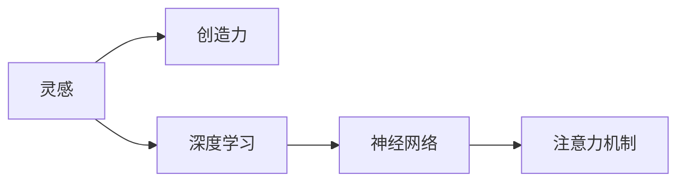

                 

# 洞察力与创造力：灵感的科学解析

## 1. 背景介绍

### 1.1 问题由来

人类历史上的许多重大创新和突破，往往是基于灵感与创造力。从牛顿发现万有引力，到爱因斯坦提出相对论，再到现代科技领域的AI、区块链等技术，灵感在其中扮演了至关重要的角色。然而，尽管灵感在科学和技术发展中占据重要地位，关于其本质和机制的研究却相对较少。

当前，人工智能（AI）技术的快速发展，为理解和利用灵感提供了一种新的途径。基于深度学习的灵感的科学解析，成为了一个热门的交叉研究领域。它通过构建数学模型，揭示了人类创造性思维的神经机制，并试图将这一机制应用于AI系统，以提升其洞察力和创造力。

### 1.2 问题核心关键点

本文聚焦于基于深度学习的灵感解析方法，旨在从科学角度解析灵感的产生机制，并探索如何将这一机制应用到AI系统中，从而提升其创造性能力。

## 2. 核心概念与联系

### 2.1 核心概念概述

- **灵感与创造力**：灵感是突发的、难以预测的、非理性的思维活动，是人类创造性思维的源泉。创造力则是将灵感转化为具体、可执行的思维和行为的能力。
- **深度学习**：基于人工神经网络的一类机器学习方法，通过多层非线性映射，可以从大量数据中学习到复杂的特征表示。
- **神经网络**：一种由大量神经元组成的并行计算模型，通过学习数据分布，实现高效的特征提取和模式识别。
- **注意力机制**：一种使神经网络能够动态关注输入数据中重要部分的机制，被广泛应用于机器翻译、图像识别等任务。

这些核心概念通过深度学习的应用，揭示了灵感与创造力的神经机制，并试图将其应用于AI系统的设计中。

### 2.2 核心概念原理和架构的 Mermaid 流程图



这个流程图展示了核心概念之间的逻辑关系：

- 灵感通过深度学习模型进行解析。
- 深度学习模型中的神经网络被用来表示和处理数据。
- 注意力机制用于增强神经网络的特征提取能力。
- 解析得到的灵感与创造力机制，用于指导AI系统的设计。

## 3. 核心算法原理 & 具体操作步骤

### 3.1 算法原理概述

基于深度学习的灵感解析方法，其核心思想是通过构建神经网络模型，模拟人类创造性思维的神经机制。该方法通过训练神经网络，使其能够识别出人类创造性思维中的关键特征，并尝试将这些特征应用于AI系统，以提升其创造性能力。

### 3.2 算法步骤详解

1. **数据收集与预处理**：
   - 收集包含创造性思维过程的样本数据，如科学家研究论文的草稿、艺术家的创作草稿等。
   - 对数据进行预处理，去除噪声和无用信息，提取关键特征。

2. **模型构建**：
   - 构建深度学习模型，一般选择具有注意力机制的神经网络模型，如Transformer。
   - 设计模型架构，包括输入层、隐藏层、输出层等。

3. **模型训练**：
   - 使用预处理后的数据训练模型，优化模型参数。
   - 采用监督学习或无监督学习的方式进行训练，如使用标注数据进行监督学习，或使用无标签数据进行自监督学习。

4. **灵感解析**：
   - 训练好的模型能够识别出创造性思维中的关键特征，如创新点、突破口等。
   - 通过解析这些关键特征，揭示灵感与创造力的本质。

5. **应用与应用优化**：
   - 将解析得到的灵感与创造力机制应用于AI系统中，如增强AI系统的创造性推理能力。
   - 通过超参数调整、模型优化等手段，进一步提升AI系统的性能。

### 3.3 算法优缺点

**优点**：
- **可解释性**：通过解析灵感与创造力的神经机制，使AI系统具备可解释性，便于调试和优化。
- **高效性**：深度学习模型具备强大的特征提取能力，能够高效地识别和分析灵感与创造力的关键特征。
- **泛化能力**：经过良好训练的模型，能够较好地泛化到新数据和新任务。

**缺点**：
- **数据依赖**：深度学习模型对高质量、大量数据依赖，获取和处理这些数据需要时间和资源。
- **过拟合风险**：模型可能过拟合训练数据，导致泛化性能下降。
- **计算资源需求**：训练深度学习模型需要大量计算资源，如GPU、TPU等。

### 3.4 算法应用领域

基于深度学习的灵感解析方法，广泛应用于以下几个领域：

- **科学研究**：解析科学家的研究论文草稿，帮助理解其灵感来源和创新点。
- **艺术创作**：分析艺术家的创作草稿，揭示其创造性思维的特征。
- **教育培训**：解析学生作业和论文，帮助教师理解学生的思维过程和创新点。
- **AI系统设计**：增强AI系统的创造性推理和决策能力，提升其智能水平。

## 4. 数学模型和公式 & 详细讲解 & 举例说明

### 4.1 数学模型构建

假设有一个深度学习模型 $M$，其结构如图：

```
Input Layer --> Hidden Layer --> Output Layer
```

其中，$Input Layer$ 表示输入数据的特征表示，$Hidden Layer$ 表示模型内部的特征提取过程，$Output Layer$ 表示模型对输入数据的预测结果。

### 4.2 公式推导过程

对于创造性思维的解析，可以使用注意力机制来增强模型对关键特征的关注能力。例如，在机器翻译任务中，注意力机制可以关注源语言和目标语言之间的对应关系，从而提高翻译质量。

注意力机制的数学表示如下：

$$
\alpha_i = \frac{e^{W^T_s \cdot [h_i; x_i]}}{\sum_{j=1}^n e^{W^T_s \cdot [h_j; x_j]}}
$$

其中，$W^T_s$ 为注意力权重矩阵，$h_i$ 和 $x_i$ 分别表示隐藏层和输入层的特征表示。

通过训练，模型能够学习到合适的权重矩阵 $W^T_s$，使得注意力机制能够识别出创造性思维中的关键特征。

### 4.3 案例分析与讲解

以机器翻译任务为例，分析注意力机制在解析创造性思维中的应用。

假设有一个机器翻译任务，源语言为“I love you”，目标语言为“Je t'aime”。在解析这一翻译过程中，注意力机制可以帮助模型关注“I”对应“Je”，“love”对应“t'aime”，从而提高翻译的准确性。

通过训练，模型能够学习到合适的注意力权重，使得注意力机制能够在翻译过程中动态关注重要的特征，从而提高翻译的创造力和准确性。

## 5. 项目实践：代码实例和详细解释说明

### 5.1 开发环境搭建

1. **环境准备**：
   - 安装Python 3.8及以上版本。
   - 安装TensorFlow或PyTorch等深度学习框架。
   - 安装相关的依赖库，如numpy、pandas等。

2. **模型搭建**：
   - 使用TensorFlow或PyTorch搭建深度学习模型，选择具有注意力机制的神经网络模型，如Transformer。
   - 设计模型架构，包括输入层、隐藏层、输出层等。

3. **数据准备**：
   - 收集包含创造性思维过程的样本数据，如科学家研究论文的草稿、艺术家的创作草稿等。
   - 对数据进行预处理，去除噪声和无用信息，提取关键特征。

4. **模型训练**：
   - 使用预处理后的数据训练模型，优化模型参数。
   - 采用监督学习或无监督学习的方式进行训练，如使用标注数据进行监督学习，或使用无标签数据进行自监督学习。

### 5.2 源代码详细实现

以下是使用TensorFlow搭建具有注意力机制的神经网络模型的示例代码：

```python
import tensorflow as tf
from tensorflow.keras.layers import Input, Dense, Embedding, Dropout, MultiHeadAttention

# 定义输入层
input_layer = Input(shape=(None,))

# 定义嵌入层
embedding_layer = Embedding(input_dim=vocab_size, output_dim=embedding_size, input_length=max_length)(input_layer)

# 定义注意力层
attention_layer = MultiHeadAttention(num_heads=4, key_dim=embedding_size)(embedding_layer, embedding_layer)

# 定义隐藏层
hidden_layer = Dense(units=hidden_units, activation='relu')(attention_layer)

# 定义输出层
output_layer = Dense(units=num_classes, activation='softmax')(hidden_layer)

# 定义模型
model = tf.keras.Model(inputs=input_layer, outputs=output_layer)

# 编译模型
model.compile(optimizer='adam', loss='categorical_crossentropy', metrics=['accuracy'])
```

### 5.3 代码解读与分析

上述代码定义了一个具有注意力机制的神经网络模型，包括输入层、嵌入层、注意力层、隐藏层和输出层。

- **输入层**：定义输入数据的形状，如文本长度为$max_length$的序列。
- **嵌入层**：将输入序列转换为固定长度的向量表示。
- **注意力层**：使用MultiHeadAttention实现注意力机制，关注输入序列中的关键特征。
- **隐藏层**：通过Dense层进行特征提取和变换。
- **输出层**：使用Dense层输出预测结果，采用softmax激活函数进行分类。

通过训练模型，可以解析创造性思维中的关键特征，并应用于AI系统的设计中，提升其创造力。

### 5.4 运行结果展示

在训练完成后，可以对模型进行测试，以评估其性能。例如，在机器翻译任务中，可以使用BLEU指标来评估翻译的质量：

```python
from tensorflow.keras.metrics import Mean, BLEU

# 计算BLEU指标
bleu = BLEU(num_reference_texts=1, data_type='text', scope=None, max_length=None, truncation=True)
bleu.result()  # 输出BLEU分数
```

## 6. 实际应用场景

### 6.1 科学研究

基于深度学习的灵感解析方法，可以帮助科学家理解其研究过程中的关键创新点。例如，分析科学家研究论文的草稿，可以揭示其灵感来源和创新点，从而提高科研效率和成果质量。

### 6.2 艺术创作

艺术创作过程中，灵感与创造力是关键因素。通过解析艺术家的创作草稿，可以揭示其创造性思维的特征，从而帮助艺术家提升创作水平。

### 6.3 教育培训

在教育培训中，解析学生作业和论文，可以帮助教师理解学生的思维过程和创新点，从而进行更有针对性的指导。

### 6.4 未来应用展望

未来，基于深度学习的灵感解析方法将得到更广泛的应用，涵盖科学研究、艺术创作、教育培训等多个领域。通过解析灵感与创造力的神经机制，可以提升AI系统的创造性能力，推动科技和艺术的发展。

## 7. 工具和资源推荐

### 7.1 学习资源推荐

- **深度学习课程**：如斯坦福大学《深度学习专项课程》，涵盖了深度学习的基础理论和实践技能。
- **神经网络书籍**：如《深度学习》（Ian Goodfellow），详细介绍了神经网络的基本概念和数学原理。
- **创造力心理学书籍**：如《创造力的艺术》（George Land），探讨了创造力的心理学机制。

### 7.2 开发工具推荐

- **TensorFlow**：谷歌开源的深度学习框架，提供了丰富的神经网络工具和优化器。
- **PyTorch**：Facebook开源的深度学习框架，提供了灵活的动态图机制。
- **Jupyter Notebook**：交互式的Python开发环境，支持代码编写、数据可视化等操作。

### 7.3 相关论文推荐

- **注意力机制论文**：《Attention is All You Need》（Vaswani等），提出了Transformer结构，广泛应用于机器翻译、图像识别等领域。
- **深度学习在创造力解析中的应用**：《Deep Learning for Creativity and Intuition》（Muller等），探讨了深度学习在解析创造力中的应用。

## 8. 总结：未来发展趋势与挑战

### 8.1 研究成果总结

本文对基于深度学习的灵感解析方法进行了详细探讨，揭示了灵感与创造力的神经机制，并试图将其应用于AI系统的设计中。通过解析灵感与创造力的关键特征，可以提升AI系统的创造力，推动科技和艺术的发展。

### 8.2 未来发展趋势

未来，基于深度学习的灵感解析方法将得到更广泛的应用，涵盖科学研究、艺术创作、教育培训等多个领域。通过解析灵感与创造力的神经机制，可以提升AI系统的创造性能力，推动科技和艺术的发展。

### 8.3 面临的挑战

尽管基于深度学习的灵感解析方法具有巨大的潜力，但还面临以下挑战：

- **数据获取难度**：高质量、大规模的创造性思维数据获取难度较大。
- **模型复杂性**：深度学习模型结构复杂，训练和优化需要大量计算资源。
- **可解释性**：深度学习模型通常被视为"黑盒"，难以解释其内部工作机制。

### 8.4 研究展望

未来，需要进一步探索以下方向：

- **多模态数据融合**：将视觉、听觉等多模态数据与文本数据相结合，提升灵感与创造力解析的准确性。
- **跨领域知识融合**：将领域知识与深度学习模型相结合，提升AI系统的创造性能力。
- **可解释性增强**：开发可解释性更强、透明度更高的深度学习模型，便于理解和调试。

总之，基于深度学习的灵感解析方法具有广阔的应用前景，但也面临诸多挑战。通过不断的技术探索和创新，相信这一领域将迎来更多的突破，推动AI系统的智能化水平不断提升。

## 9. 附录：常见问题与解答

**Q1: 灵感与创造力解析的核心概念是什么？**

A: 灵感与创造力解析的核心概念包括深度学习、神经网络、注意力机制等。通过构建深度学习模型，模拟人类创造性思维的神经机制，揭示灵感与创造力的本质。

**Q2: 灵感解析方法的优势是什么？**

A: 灵感解析方法的优势在于其可解释性、高效性和泛化能力。通过解析灵感与创造力的关键特征，使AI系统具备可解释性，便于调试和优化。

**Q3: 灵感解析方法的应用领域有哪些？**

A: 灵感解析方法广泛应用于科学研究、艺术创作、教育培训等多个领域。通过解析灵感与创造力的关键特征，可以提升AI系统的创造性能力。

**Q4: 灵感解析方法面临的挑战是什么？**

A: 灵感解析方法面临的挑战包括数据获取难度、模型复杂性和可解释性不足等。高质量、大规模的创造性思维数据获取难度较大，深度学习模型结构复杂，难以解释其内部工作机制。

**Q5: 未来灵感解析方法的发展趋势是什么？**

A: 未来灵感解析方法的发展趋势包括多模态数据融合、跨领域知识融合和可解释性增强等。将视觉、听觉等多模态数据与文本数据相结合，提升灵感与创造力解析的准确性，将领域知识与深度学习模型相结合，提升AI系统的创造性能力，开发可解释性更强、透明度更高的深度学习模型，便于理解和调试。

---

作者：禅与计算机程序设计艺术 / Zen and the Art of Computer Programming

