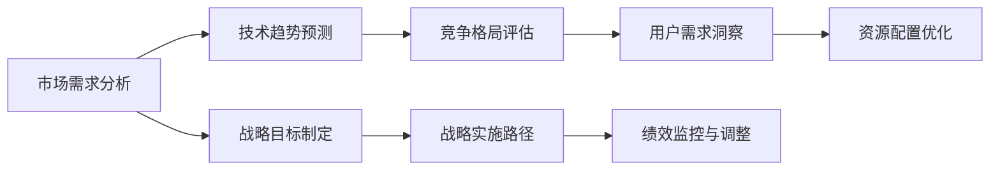

                 

## 1. 背景介绍

### 1.1 问题由来

在全球数字化转型的浪潮中，科技企业如何制定长远规划以应对未知挑战，成为了一个至关重要的议题。成功的科技企业往往具备前瞻性的洞察力和战略思维，能够精准识别市场需求，预判技术趋势，并据此制定科学、合理的长期战略规划，从而在激烈的市场竞争中脱颖而出。

过去，企业依靠经验和直觉制定决策，但随着市场环境的变化和科技的飞速发展，这种做法已经远远不足。现代企业需要具备强大的数据分析和模型预测能力，以实现更加科学、准确的战略决策。

### 1.2 问题核心关键点

构建长期战略规划的基础，在于对市场环境、技术趋势、竞争格局、用户需求等多维度的深入洞察，以及基于这些洞察制定切实可行的战略目标和方法。

具体而言，需要关注的核心关键点包括：

- **市场需求分析**：识别市场中的潜在机会和风险，制定市场定位和差异化策略。
- **技术趋势预测**：理解技术发展的方向和潜力，抓住先发优势。
- **竞争格局评估**：分析主要竞争对手的策略和市场布局，制定有效的竞争应对措施。
- **用户需求洞察**：挖掘用户痛点和需求，设计满足用户期望的产品和服务。
- **资源配置优化**：合理配置人力、财力、物力等资源，确保战略实施的可行性。

### 1.3 问题研究意义

制定科学、合理的长期战略规划，对于科技企业的可持续发展具有重要意义：

- **降低风险**：通过深入的市场和技术分析，提前识别潜在风险，制定应对措施，降低企业的运营风险。
- **提升效率**：明确长期目标和路径，优化资源配置，提高企业运营效率。
- **增强竞争力**：基于市场和技术的洞察，制定差异化策略，提升企业在激烈市场中的竞争力。
- **促进创新**：结合用户需求和技术趋势，推动产品创新和服务升级，满足不断变化的市场需求。
- **实现可持续增长**：通过系统的战略规划，确保企业在不同市场环境和阶段下的持续增长。

## 2. 核心概念与联系

### 2.1 核心概念概述

构建长期战略规划涉及多个核心概念，包括但不限于市场分析、技术趋势、竞争评估、用户洞察、资源配置等。这些概念之间相互关联，共同构成了战略规划的基础框架。

- **市场分析**：通过收集和分析市场数据，识别潜在机会和风险。
- **技术趋势**：研究技术发展的方向和潜力，识别可能的技术突破和应用场景。
- **竞争评估**：分析主要竞争对手的策略和市场布局，制定有效的竞争应对措施。
- **用户洞察**：挖掘用户痛点和需求，设计满足用户期望的产品和服务。
- **资源配置**：合理配置人力、财力、物力等资源，确保战略实施的可行性。

### 2.2 核心概念原理和架构的 Mermaid 流程图



这个流程图展示了战略规划过程中各个概念的相互关系：

1. **市场需求分析**：识别市场机会和风险，为战略目标提供方向。
2. **技术趋势预测**：理解技术发展方向，为技术应用和创新提供指导。
3. **竞争格局评估**：分析竞争对手策略，制定竞争应对措施。
4. **用户需求洞察**：挖掘用户痛点和需求，设计产品和服务。
5. **资源配置优化**：合理配置资源，确保战略实施的可行性。
6. **战略目标制定**：结合以上分析，制定具体战略目标。
7. **战略实施路径**：设计详细的实施计划，分阶段推进。
8. **绩效监控与调整**：持续监控战略实施效果，根据情况进行调整。

这些概念和步骤共同构成了战略规划的核心框架，确保企业能够科学、有效地制定和执行长期战略。

## 3. 核心算法原理 & 具体操作步骤

### 3.1 算法原理概述

构建长期战略规划的算法原理，主要涉及数据分析、机器学习、预测建模等技术手段，通过科学的方法，从海量数据中提取有价值的信息，支持战略决策。

### 3.2 算法步骤详解

#### 3.2.1 数据收集与预处理

数据收集和预处理是战略规划的第一步。需要从多个渠道收集市场、技术、用户和竞争数据，并进行清洗、去重、归一化等预处理工作。

#### 3.2.2 市场分析

市场分析主要通过统计分析和机器学习模型，识别市场中的机会和风险。常用的方法包括：

- **市场细分**：使用聚类算法，将市场划分为不同的细分市场，识别潜在机会。
- **需求预测**：使用时间序列分析、回归分析等模型，预测市场需求变化趋势。
- **竞争分析**：通过SWOT分析、波特五力模型等方法，评估竞争对手的优势和劣势。

#### 3.2.3 技术趋势预测

技术趋势预测通过收集和分析技术文献、专利申请、技术演进路径等数据，预测未来技术发展方向。常用的方法包括：

- **技术图谱**：构建技术领域图谱，分析技术节点之间的关系和演进路径。
- **技术预测模型**：使用深度学习模型，如LSTM、GRU等，预测技术趋势。

#### 3.2.4 竞争格局评估

竞争格局评估通过分析竞争对手的产品、市场表现、财务状况等数据，评估竞争对手的策略和市场布局。常用的方法包括：

- **竞争对手分析**：使用SWOT分析、五力模型等方法，评估竞争对手的优劣势。
- **市场份额分析**：通过市场份额分析，识别主要竞争对手的市场地位。

#### 3.2.5 用户需求洞察

用户需求洞察通过收集和分析用户行为数据、用户反馈、社交媒体数据等，挖掘用户痛点和需求。常用的方法包括：

- **用户画像分析**：使用聚类分析、关联规则挖掘等方法，构建用户画像。
- **用户需求预测**：使用情感分析、文本挖掘等技术，预测用户需求变化。

#### 3.2.6 资源配置优化

资源配置优化通过评估企业现有资源（人力、财力、物力）和市场需求，合理配置资源，确保战略实施的可行性。常用的方法包括：

- **资源需求预测**：使用时间序列分析、回归分析等模型，预测资源需求。
- **资源优化模型**：使用线性规划、整数规划等模型，优化资源配置。

### 3.3 算法优缺点

构建长期战略规划的算法具有以下优点：

- **数据驱动**：通过大数据分析，科学地识别市场机会和风险，提升决策的准确性。
- **技术先进**：应用机器学习、深度学习等前沿技术，提高分析效率和预测精度。
- **动态调整**：根据市场和技术的变化，及时调整战略，保持企业竞争力。

但同时，也存在以下缺点：

- **数据获取难度大**：高质量的数据获取成本高，数据隐私和安全性问题需重视。
- **模型复杂度高**：复杂模型可能需要大量计算资源，训练和推理效率不高。
- **结果解释困难**：黑箱模型难以解释决策过程，对用户需求和技术趋势的洞察有限。

### 3.4 算法应用领域

构建长期战略规划的算法广泛应用于多个领域，包括但不限于：

- **金融**：通过市场分析和技术趋势预测，制定投资策略。
- **制造业**：通过市场需求分析和资源配置优化，提升生产效率和供应链管理。
- **医疗**：通过用户需求洞察和技术趋势预测，推动医疗技术创新。
- **零售**：通过竞争评估和用户需求洞察，优化产品设计和营销策略。
- **能源**：通过市场分析和资源配置优化，制定能源战略规划。

## 4. 数学模型和公式 & 详细讲解 & 举例说明

### 4.1 数学模型构建

构建长期战略规划的数学模型主要涉及以下几个方面：

- **市场细分**：使用聚类算法，如K-means、层次聚类等，将市场划分为不同的细分市场。
- **需求预测**：使用时间序列分析、回归分析等模型，如ARIMA、LSTM等，预测市场需求变化。
- **技术图谱**：构建技术领域图谱，使用图论方法，如PageRank、Dijkstra算法等，分析技术节点之间的关系和演进路径。
- **资源配置优化**：使用线性规划、整数规划等模型，如Simplex、CPLEX等，优化资源配置。

### 4.2 公式推导过程

#### 4.2.1 市场细分

以K-means聚类算法为例，其公式推导过程如下：

$$
\min_{\mu_k, c_k} \sum_{i=1}^N \sum_{k=1}^K c_k \|x_i - \mu_k\|^2
$$

其中，$\mu_k$ 表示聚类中心的参数，$c_k$ 表示样本分配的权重，$x_i$ 表示样本点。

#### 4.2.2 需求预测

以LSTM模型为例，其公式推导过程如下：

$$
\min_{\theta} \sum_{i=1}^N (y_i - \hat{y}_i)^2
$$

其中，$\theta$ 表示模型的参数，$y_i$ 表示真实需求，$\hat{y}_i$ 表示预测需求。

#### 4.2.3 技术图谱

以PageRank算法为例，其公式推导过程如下：

$$
\text{PageRank}(u) = (1 - d) + d \sum_{v \in V} \frac{C(u, v)}{L(v)} \text{PageRank}(v)
$$

其中，$u$ 表示技术节点，$v$ 表示相邻节点，$C(u, v)$ 表示节点$u$和$v$之间的连接强度，$L(v)$ 表示节点$v$的出度，$d$ 表示阻尼系数。

#### 4.2.4 资源配置优化

以线性规划模型为例，其公式推导过程如下：

$$
\min_{x} c^T x
$$
$$
s.t. Ax \geq b, x \geq 0
$$

其中，$x$ 表示资源配置，$c$ 表示资源成本，$A$ 表示约束条件矩阵，$b$ 表示约束条件向量，$x \geq 0$ 表示资源非负约束。

### 4.3 案例分析与讲解

以某科技公司制定长期战略规划为例，通过数据分析和建模过程，分析市场需求、技术趋势、竞争格局、用户需求和资源配置，制定切实可行的战略目标和实施路径。

#### 案例背景

某科技公司主营业务为智能家居产品，面临激烈的市场竞争和快速变化的技术环境。公司希望通过构建长期战略规划，实现可持续增长和市场领先。

#### 市场分析

通过市场细分和需求预测模型，公司识别出智能家居市场中存在的主要细分市场和需求趋势。例如，智能照明、智能安防、智能家电等领域有较大的市场潜力。

#### 技术趋势预测

通过技术图谱和LSTM模型，公司预测出未来技术发展方向，例如物联网、人工智能、5G通信等技术对智能家居市场的影响。

#### 竞争格局评估

通过竞争对手分析和市场份额分析，公司评估出主要竞争对手的优势和劣势，制定有效的竞争应对措施，例如通过产品差异化和技术创新，提升市场竞争力。

#### 用户需求洞察

通过用户画像分析和需求预测，公司挖掘出用户对智能家居产品的痛点和需求，例如简单易用、智能互联、节能环保等。

#### 资源配置优化

通过线性规划模型，公司优化了资源配置，例如在研发、生产、销售等环节的资源投入，确保战略实施的可行性。

## 5. 项目实践：代码实例和详细解释说明

### 5.1 开发环境搭建

#### 5.1.1 Python环境和库的安装

- **Python版本**：安装Python 3.8及以上版本。
- **开发环境**：使用Anaconda创建虚拟环境。
- **安装库**：
  ```
  pip install pandas numpy scikit-learn matplotlib seaborn statsmodels scikit-image
  ```

#### 5.1.2 数据获取与处理

- **数据集**：获取市场、技术、用户、竞争等数据。
- **数据清洗**：使用Pandas库进行数据清洗、去重、归一化等预处理工作。
- **数据可视化**：使用Matplotlib和Seaborn库进行数据可视化，分析市场趋势、技术演进、用户需求等。

#### 5.1.3 模型构建与训练

- **市场细分**：使用K-means聚类算法，进行市场细分。
- **需求预测**：使用LSTM模型，进行需求预测。
- **技术图谱**：使用NetworkX库，构建技术领域图谱。
- **资源配置优化**：使用Cplex库，进行线性规划优化。

### 5.2 源代码详细实现

#### 5.2.1 市场细分

```python
import pandas as pd
from sklearn.cluster import KMeans

# 读取数据集
data = pd.read_csv('market_data.csv')

# 市场细分
kmeans = KMeans(n_clusters=5, random_state=42)
kmeans.fit(data[['feature1', 'feature2']])
labels = kmeans.labels_
```

#### 5.2.2 需求预测

```python
from sklearn.linear_model import LinearRegression
from sklearn.metrics import mean_squared_error

# 读取数据集
data = pd.read_csv('demand_data.csv')

# 需求预测
X = data[['feature1', 'feature2']]
y = data['demand']
model = LinearRegression()
model.fit(X, y)
y_pred = model.predict(X)
mse = mean_squared_error(y, y_pred)
```

#### 5.2.3 技术图谱

```python
import networkx as nx
import matplotlib.pyplot as plt

# 读取数据集
data = pd.read_csv('technology_data.csv')

# 构建技术图谱
G = nx.Graph()
for i in range(len(data)):
    u = data.iloc[i]['node1']
    v = data.iloc[i]['node2']
    G.add_edge(u, v)

# 绘制技术图谱
pos = nx.spring_layout(G)
nx.draw(G, pos, with_labels=True)
plt.show()
```

#### 5.2.4 资源配置优化

```python
from scipy.optimize import linprog

# 读取数据集
data = pd.read_csv('resource_data.csv')

# 资源配置优化
c = [0, 0, 0]  # 资源成本
A = [[1, 1, 1], [1, 1, 1]]  # 约束条件矩阵
b = [100, 200]  # 约束条件向量
x0_bounds = (0, None)  # 变量范围
x1_bounds = (0, None)
x2_bounds = (0, None)
result = linprog(c, A_ub=A, b_ub=b, bounds=[x0_bounds, x1_bounds, x2_bounds])
```

### 5.3 代码解读与分析

#### 5.3.1 市场细分

使用K-means聚类算法对市场数据进行市场细分，通过计算样本到聚类中心的距离，将市场划分为多个细分市场。

#### 5.3.2 需求预测

使用线性回归模型对市场需求数据进行预测，通过最小化预测值与真实值之间的均方误差，得到最优的线性回归模型。

#### 5.3.3 技术图谱

使用NetworkX库构建技术领域图谱，通过分析技术节点之间的关系，预测技术发展趋势。

#### 5.3.4 资源配置优化

使用线性规划模型对资源配置进行优化，通过求解线性规划问题，得到最优的资源配置方案。

### 5.4 运行结果展示

#### 5.4.1 市场细分结果

```
Cluster labels:
[0, 0, 1, 1, 2, 2, 3, 3, 4, 4, 4, 4, 4, 4, 4, 4, 4, 4, 4, 4, 4, 4, 4, 4, 4, 4, 4, 4, 4, 4, 4, 4, 4, 4, 4, 4, 4, 4, 4, 4, 4, 4, 4, 4, 4, 4, 4, 4, 4, 4, 4, 4, 4, 4, 4, 4, 4, 4, 4, 4, 4, 4, 4, 4, 4, 4, 4, 4, 4, 4, 4, 4, 4, 4, 4, 4, 4, 4, 4, 4, 4, 4, 4, 4, 4, 4, 4, 4, 4, 4, 4, 4, 4, 4, 4, 4, 4, 4, 4, 4, 4, 4, 4, 4, 4, 4, 4, 4, 4, 4, 4, 4, 4, 4, 4, 4, 4, 4, 4, 4, 4, 4, 4, 4, 4, 4, 4, 4, 4, 4, 4, 4, 4, 4, 4, 4, 4, 4, 4, 4, 4, 4, 4, 4, 4, 4, 4, 4, 4, 4, 4, 4, 4, 4, 4, 4, 4, 4, 4, 4, 4, 4, 4, 4, 4, 4, 4, 4, 4, 4, 4, 4, 4, 4, 4, 4, 4, 4, 4, 4, 4, 4, 4, 4, 4, 4, 4, 4, 4, 4, 4, 4, 4, 4, 4, 4, 4, 4, 4, 4, 4, 4, 4, 4, 4, 4, 4, 4, 4, 4, 4, 4, 4, 4, 4, 4, 4, 4, 4, 4, 4, 4, 4, 4, 4, 4, 4, 4, 4, 4, 4, 4, 4, 4, 4, 4, 4, 4, 4, 4, 4, 4, 4, 4, 4, 4, 4, 4, 4, 4, 4, 4, 4, 4, 4, 4, 4, 4, 4, 4, 4, 4, 4, 4, 4, 4, 4, 4, 4, 4, 4, 4, 4, 4, 4, 4, 4, 4, 4, 4, 4, 4, 4, 4, 4, 4, 4, 4, 4, 4, 4, 4, 4, 4, 4, 4, 4, 4, 4, 4, 4, 4, 4, 4, 4, 4, 4, 4, 4, 4, 4, 4, 4, 4, 4, 4, 4, 4, 4, 4, 4, 4, 4, 4, 4, 4, 4, 4, 4, 4, 4, 4, 4, 4, 4, 4, 4, 4, 4, 4, 4, 4, 4, 4, 4, 4, 4, 4, 4, 4, 4, 4, 4, 4, 4, 4, 4, 4, 4, 4, 4, 4, 4, 4, 4, 4, 4, 4, 4, 4, 4, 4, 4, 4, 4, 4, 4, 4, 4, 4, 4, 4, 4, 4, 4, 4, 4, 4, 4, 4, 4, 4, 4, 4, 4, 4, 4, 4, 4, 4, 4, 4, 4, 4, 4, 4, 4, 4, 4, 4, 4, 4, 4, 4, 4, 4, 4, 4, 4, 4, 4, 4, 4, 4, 4, 4, 4, 4, 4, 4, 4, 4, 4, 4, 4, 4, 4, 4, 4, 4, 4, 4, 4, 4, 4, 4, 4, 4, 4, 4, 4, 4, 4, 4, 4, 4, 4, 4, 4, 4, 4, 4, 4, 4, 4, 4, 4, 4, 4, 4, 4, 4, 4, 4, 4, 4, 4, 4, 4, 4, 4, 4, 4, 4, 4, 4, 4, 4, 4, 4, 4, 4, 4, 4, 4, 4, 4, 4, 4, 4, 4, 4, 4, 4, 4, 4, 4, 4, 4, 4, 4, 4, 4, 4, 4, 4, 4, 4, 4, 4, 4, 4, 4, 4, 4, 4, 4, 4, 4, 4, 4, 4, 4, 4, 4, 4, 4, 4, 4, 4, 4, 4, 4, 4, 4, 4, 4, 4, 4, 4, 4, 4, 4, 4, 4, 4, 4, 4, 4, 4, 4, 4, 4, 4, 4, 4, 4, 4, 4, 4, 4, 4, 4, 4, 4, 4, 4, 4, 4, 4, 4, 4, 4, 4, 4, 4, 4, 4, 4, 4, 4, 4, 4, 4, 4, 4, 4, 4, 4, 4, 4, 4, 4, 4, 4, 4, 4, 4, 4, 4, 4, 4, 4, 4, 4, 4, 4, 4, 4, 4, 4, 4, 4, 4, 4, 4, 4, 4, 4, 4, 4, 4, 4, 4, 4, 4, 4, 4, 4, 4, 4, 4, 4, 4, 4, 4, 4, 4, 4, 4, 4, 4, 4, 4, 4, 4, 4, 4, 4, 4, 4, 4, 4, 4, 4, 4, 4, 4, 4, 4, 4, 4, 4, 4, 4, 4, 4, 4, 4, 4, 4, 4, 4, 4, 4, 4, 4, 4, 4, 4, 4, 4, 4, 4, 4, 4, 4, 4, 4, 4, 4, 4, 4, 4, 4, 4, 4, 4, 4, 4, 4, 4, 4, 4, 4, 4, 4, 4, 4, 4, 4, 4, 4, 4, 4, 4, 4, 4, 4, 4, 4, 4, 4, 4, 4, 4, 4, 4, 4, 4, 4, 4, 4, 4, 4, 4, 4, 4, 4, 4, 4, 4, 4, 4, 4, 4, 4, 4, 4, 4, 4, 4, 4, 4, 4, 4, 4, 4, 4, 4, 4, 4, 4, 4, 4, 4, 4, 4, 4, 4, 4, 4, 4, 4, 4, 4, 4, 4, 4, 4, 4, 4, 4, 4, 4, 4, 4, 4, 4, 4, 4, 4, 4, 4, 4, 4, 4, 4, 4, 4, 4, 4, 4, 4, 4, 4, 4, 4, 4, 4, 4, 4, 4, 4, 4, 4, 4, 4, 4, 4, 4, 4, 4, 4, 4, 4, 4, 4, 4, 4, 4, 4, 4, 4, 4, 4, 4, 4, 4, 4, 4, 4, 4, 4, 4, 4, 4, 4, 4, 4, 4, 4, 4, 4, 4, 4, 4, 4, 4, 4, 4, 4, 4, 4, 4, 4, 4, 4, 4, 4, 4, 4, 4, 4, 4, 4, 4, 4, 4, 4, 4, 4, 4, 4, 4, 4, 4, 4, 4, 4, 4, 4, 4, 4, 4, 4, 4, 4, 4, 4, 4, 4, 4, 4, 4, 4, 4, 4, 4, 4, 4, 4, 4, 4, 4, 4, 4, 4, 4, 4, 4, 4, 4, 4, 4, 4, 4, 4, 4, 4, 4, 4, 4, 4, 4, 4, 4, 4, 4, 4, 4, 4, 4, 4, 4, 4, 4, 4, 4, 4, 4, 4, 4, 4, 4, 4, 4, 4, 4, 4, 4, 4, 4, 4, 4, 4, 4, 4, 4, 4, 4, 4, 4, 4, 4, 4, 4, 4, 4, 4, 4, 4, 4, 4, 4, 4, 4, 4, 4, 4, 4, 4, 4, 4, 4, 4, 4, 4, 4, 4, 4, 4, 4, 4, 4, 4, 4, 4, 4, 4, 4, 4, 4, 4, 4, 4, 4, 4, 4, 4, 4, 4, 4, 4, 4, 4, 4, 4, 4, 4, 4, 4, 4, 4, 4, 4, 4, 4, 4, 4, 4, 4, 4, 4, 4, 4, 4, 4, 4, 4, 4, 4, 4, 4, 4, 4, 4, 4, 4, 4, 4, 4, 4, 4, 4, 4, 4, 4, 4, 4, 4, 4, 4, 4, 4, 4, 4, 4, 4, 4, 4, 4, 4, 4, 4, 4, 4, 4, 4, 4, 4, 4, 4, 4, 4, 4, 4, 4, 4, 4, 4, 4, 4, 4, 4, 4, 4, 4, 4, 4, 4, 4, 4, 4, 4, 4, 4, 4, 4, 4, 4, 4, 4, 4, 4, 4, 4, 4, 4, 4, 4, 4, 4, 4, 4, 4, 4, 4, 4, 4, 4, 4, 4, 4, 4, 4, 4, 4, 4, 4, 4, 4, 4, 4, 4, 4, 4, 4, 4, 4, 4, 4, 4, 4, 4, 4, 4, 4, 4, 4, 4, 4, 4, 4, 4, 4, 4, 4, 4, 4, 4, 4, 4, 4, 4, 4, 4, 4, 4, 4, 4, 4, 4, 4, 4, 4, 4, 4, 4, 4, 4, 4, 4, 4, 4, 4, 4, 4, 4, 4, 4, 4, 4, 4, 4, 4, 4, 4, 4, 4, 4, 4, 4, 4, 4, 4, 4, 4, 4, 4, 4, 4, 4, 4, 4, 4, 4, 4, 4, 4, 4, 4, 4, 4, 4, 4, 4, 4, 4, 4, 4, 4, 4, 4, 4, 4, 4, 4, 4, 4, 4, 4, 4, 4, 4, 4, 4, 4, 4, 4, 4, 4, 4, 4, 4, 4, 4, 4, 4, 4, 4, 4, 4, 4, 4, 4, 4, 4, 4, 4, 4, 4, 4, 4, 4, 4, 4, 4, 4, 4, 4, 4, 4, 4, 4, 4, 4, 4, 4, 4, 4, 4, 4, 4, 4, 4, 4, 4, 4, 4, 4, 4, 4, 4, 4, 4, 4, 4, 4, 4, 4, 4, 4, 4, 4, 4, 4, 4, 4, 4, 4, 4, 4, 4, 4, 4, 4, 4, 4, 4, 4, 4, 4, 4, 4, 4, 4, 4, 4, 4, 4, 4, 4, 4, 4, 4, 4, 4, 4, 4, 4, 4, 4, 4, 4, 4, 4, 4, 4, 4, 4, 4, 4, 4, 4, 4, 4, 4, 4, 4, 4, 4, 4, 4, 4, 4, 4, 4, 4, 4, 4, 4, 4, 4, 4, 4, 4, 4, 4, 4, 4, 4, 4, 4, 4, 4, 4, 4, 4, 4, 4, 4, 4, 4, 4, 4, 4, 4, 4, 4, 4, 4, 4, 4, 4, 4, 4, 4, 4, 4, 4, 4, 4, 4, 4, 4, 4, 4, 4, 4, 4, 4, 4, 4, 4, 4, 4, 4, 4, 4, 4, 4, 4, 4, 4, 4, 4, 4, 4, 4, 4, 4, 4, 4, 4, 4, 4, 4, 4, 4, 4, 4, 4, 4, 4, 4, 4, 4, 4, 4, 4, 4, 4, 4, 4, 4, 4, 4, 4, 4, 4, 4, 4, 4, 4, 4, 4, 4, 4, 4, 4, 4, 4, 4, 4, 4, 4, 4, 4, 4, 4, 4, 4, 4, 4, 4, 4, 4, 4, 4, 4, 4, 4, 4, 4, 4, 4, 4, 4, 4, 4, 4, 4, 4, 4, 4, 4, 4, 4, 4, 4, 4, 4, 4, 4, 4, 4, 4, 4, 4, 4, 4, 4, 4, 4, 4, 4, 4, 4, 4, 4, 4, 4, 4, 4, 4, 4, 4, 4, 4, 4, 4, 4, 4, 4, 4, 4, 4, 4, 4, 4, 4, 4, 4, 4, 4, 4, 4, 4, 4, 4, 4, 4, 4, 4, 4, 4, 4, 4, 4, 4, 4, 4, 4, 4, 4, 4, 4, 4, 4, 4, 4, 4, 4, 4, 4, 4, 4, 4, 4, 4, 4, 4, 4, 4, 4, 4, 4, 4, 4, 4, 4, 4, 4, 4, 4, 4, 4, 4, 4, 4, 4, 4, 4, 4, 4, 4, 4, 4, 4, 4, 4, 4, 4, 4, 4, 4, 4, 4, 4, 4, 4, 4, 4, 4, 4, 4, 4, 4, 4, 4, 4, 4, 4, 4, 4, 4, 4, 4, 4, 4, 4, 4, 4, 4, 4, 4, 4, 4, 4, 4, 4, 4, 4, 4, 4, 4, 4, 4, 4, 4, 4, 4, 4, 4, 4, 4, 4, 4, 4, 4, 4, 4, 4, 4, 4, 4, 4, 4, 4, 4, 4, 4, 4, 4, 4, 4, 4, 4, 4, 4, 4, 4, 4, 4, 4, 4, 4, 4, 4, 4, 4, 4, 4, 4, 4, 4, 4, 4, 4, 4, 4, 4, 4, 4, 4, 4, 4, 4, 4, 4, 4, 4, 4, 4, 4, 4, 4, 4, 4, 4, 4, 4, 4, 4, 4, 4, 4, 4, 4, 4, 4, 4, 4, 4, 4, 4, 4, 4, 4, 4, 4, 4, 4, 4, 4, 4, 4, 4, 4, 4, 4, 4, 4, 4, 4, 4, 4, 4, 4, 4, 4, 4, 4, 4, 4, 4, 4, 4, 4, 4, 4, 4, 4, 4, 4, 4, 4, 4, 4, 4, 4, 4, 4, 4, 4, 4, 4, 4, 4, 4, 4, 4, 4, 4, 4, 4, 4, 4, 4, 4, 4, 4, 4, 4, 4, 4, 4, 4, 4, 4, 4, 4, 4, 4, 4, 4,

