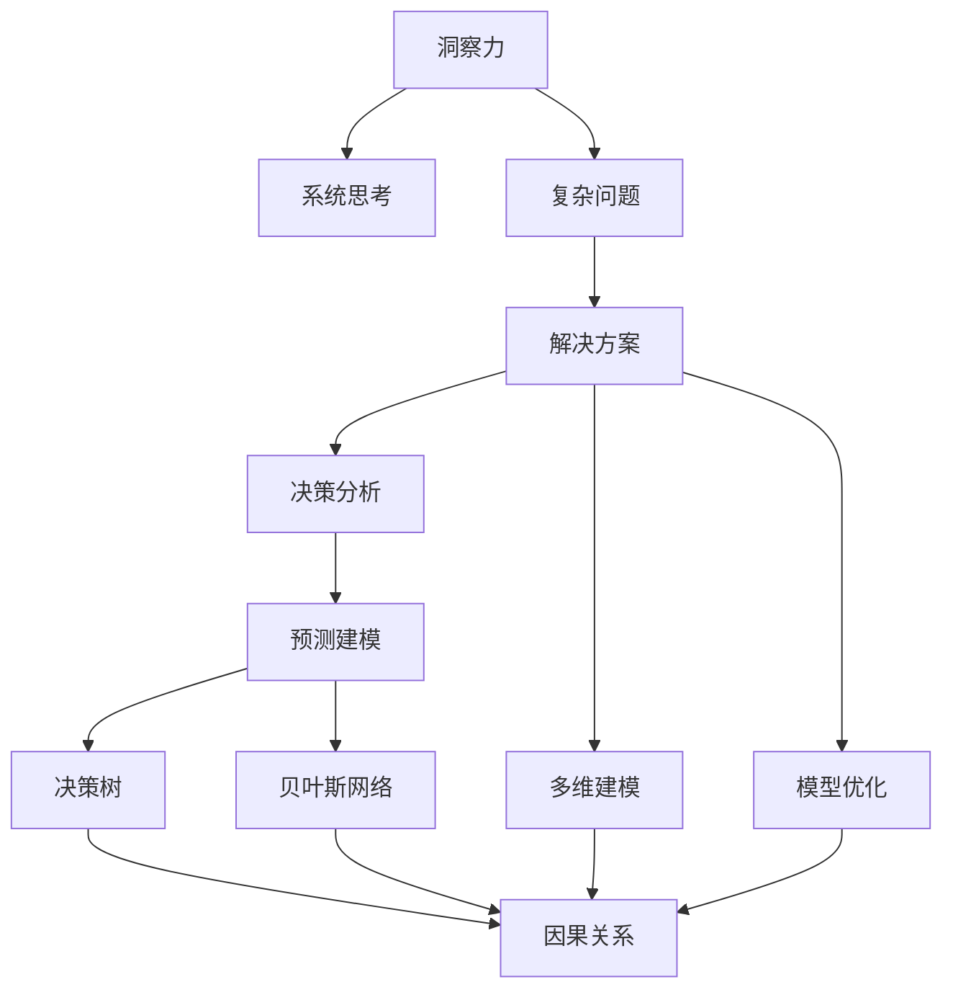

                 

# 洞察力与系统思考：复杂问题解决的关键

> 关键词：洞察力,系统思考,复杂问题,解决方案,决策分析,预测建模,决策树,贝叶斯网络,因果关系,多维建模,模型优化

## 1. 背景介绍

### 1.1 问题由来

在当今快速变化的商业环境中，复杂问题的解决能力已成为企业竞争力的重要组成部分。无论是战略决策、产品开发、供应链管理还是市场分析，均涉及大量不确定性因素和复杂关系，给决策者带来了巨大挑战。传统依靠直觉和经验的方法，在面对复杂、多维度的问题时往往力不从心，而系统思考（System Thinking）和洞察力（Insight）则提供了系统化、科学化的解决方案。

### 1.2 问题核心关键点

- **洞察力**：洞察力指的是从现象背后发现本质问题，揭示系统运作的内在逻辑，进而提出有效解决方案的能力。
- **系统思考**：系统思考是一种分析复杂系统的方法，强调系统各部分之间的相互作用和整体性，以全局视角理解问题。
- **复杂问题**：复杂问题往往具有多个相互关联的因素，信息量大且高度非线性，难以通过简单模型解释和预测。
- **解决方案**：解决方案需基于深入的系统思考，结合洞察力提出的策略或方法，旨在解决问题并实现目标。
- **决策分析**：决策分析通过科学方法和工具，辅助决策者从海量数据中提取关键信息，支持决策过程。
- **预测建模**：预测建模通过构建和训练数学模型，预测未来趋势和结果，为决策提供数据支持。
- **决策树**：决策树是一种基于树形结构的模型，用于展示决策过程和分析结果。
- **贝叶斯网络**：贝叶斯网络通过贝叶斯定理，刻画变量之间的因果关系，便于进行复杂问题分析。
- **因果关系**：识别并理解问题中的因果关系，是系统思考和洞察力的重要部分，有助于制定更有效的解决方案。
- **多维建模**：通过多维建模，全面考虑问题的各个方面，提高分析的准确性和深度。
- **模型优化**：通过优化模型参数和方法，提升预测和决策的准确性和鲁棒性。

## 2. 核心概念与联系

### 2.1 核心概念概述

为了深入理解系统思考和洞察力在解决复杂问题中的应用，本节将介绍几个关键概念：

- **洞察力**：洞察力指的是通过对问题的深入分析，揭示其本质和关键因素的能力。
- **系统思考**：系统思考是一种分析复杂系统的方法，强调系统的整体性和各部分之间的相互作用。
- **复杂问题**：复杂问题具有高度的非线性、多因素和多维度的特点，难以通过简单的模型或方法解决。
- **解决方案**：解决方案需综合运用系统思考和洞察力，提出符合系统实际情况的策略和措施。
- **决策分析**：通过数据和模型，科学地支持决策过程，减少决策的盲目性和风险。
- **预测建模**：预测建模通过构建数学模型，预测未来趋势和结果，为决策提供数据支持。
- **决策树**：决策树是展示决策过程和分析结果的树形结构模型。
- **贝叶斯网络**：贝叶斯网络通过贝叶斯定理，刻画变量之间的因果关系，进行复杂问题分析。
- **因果关系**：理解因果关系是系统思考和洞察力的重要部分，有助于制定有效的解决方案。
- **多维建模**：通过多维建模，全面考虑问题的各个方面，提高分析的准确性和深度。
- **模型优化**：通过优化模型参数和方法，提升预测和决策的准确性和鲁棒性。

这些概念之间的逻辑关系可以通过以下Mermaid流程图来展示：



这个流程图展示了洞察力和系统思考在解决复杂问题过程中的联系和作用：

1. 洞察力通过深入分析问题，揭示其本质和关键因素。
2. 系统思考以全局的视角分析问题，识别各个因素之间的相互作用。
3. 复杂问题具有多因素和多维度的特点。
4. 解决方案结合洞察力和系统思考，提出有效的策略和措施。
5. 决策分析通过数据和模型支持决策，减少盲目性。
6. 预测建模通过数学模型预测未来趋势和结果。
7. 决策树和贝叶斯网络用于展示和分析变量之间的因果关系。
8. 因果关系是理解问题并制定解决方案的关键。
9. 多维建模全面考虑问题的各个方面，提高分析的准确性。
10. 模型优化提升预测和决策的准确性和鲁棒性。

这些概念共同构成了系统思考和洞察力在复杂问题解决中的框架，有助于决策者制定科学、高效的解决方案。

## 3. 核心算法原理 & 具体操作步骤

### 3.1 算法原理概述

系统思考和洞察力在解决复杂问题中的核心算法原理主要包括：

- **数据收集与整理**：从多个数据源收集相关数据，并对其进行清洗和整理。
- **特征工程**：识别和提取影响问题解决的关键特征，用于构建模型。
- **模型构建**：选择并构建合适的模型，如决策树、贝叶斯网络等，进行预测和分析。
- **参数优化**：通过交叉验证等方法优化模型参数，提升模型性能。
- **结果解释**：分析模型结果，解释其背后的因果关系和逻辑。

### 3.2 算法步骤详解

系统思考和洞察力在解决复杂问题时，一般遵循以下步骤：

1. **问题定义**：明确问题的目标和影响因素。
2. **数据收集**：从不同数据源收集相关数据，确保数据的多样性和完整性。
3. **数据清洗**：对数据进行清洗，处理缺失值、异常值等问题。
4. **特征选择**：选择影响问题解决的关键特征，构建特征集。
5. **模型构建**：根据问题的特点，选择适合的模型，如决策树、贝叶斯网络等。
6. **模型训练**：使用训练数据对模型进行训练，优化模型参数。
7. **结果评估**：使用验证数据评估模型性能，调整模型参数。
8. **结果解释**：分析模型结果，解释其背后的因果关系和逻辑。
9. **解决方案制定**：基于模型结果，制定有效的解决方案。

### 3.3 算法优缺点

系统思考和洞察力在解决复杂问题时具有以下优点：

- **全局视角**：系统思考提供全局视角，能够识别问题中的关键因素和因果关系。
- **多维度分析**：洞察力通过深入分析，识别问题的多维度影响因素。
- **数据驱动**：结合数据驱动的方法，提高解决方案的科学性和准确性。
- **决策支持**：为决策过程提供数据支持和逻辑依据，减少盲目性和风险。

但同时，系统思考和洞察力也存在一些缺点：

- **数据依赖**：依赖高质量、完整的数据，数据收集和清洗成本较高。
- **模型复杂**：复杂问题往往需要构建复杂的模型，模型构建和优化较为耗时。
- **解释难度**：模型结果的因果解释较为复杂，需要较高的数据分析能力。
- **知识门槛**：需要具备系统思考和数据分析的专业知识，对决策者要求较高。

### 3.4 算法应用领域

系统思考和洞察力在多个领域都有广泛的应用，例如：

- **金融风控**：通过构建决策树和贝叶斯网络，识别风险因素，制定风险控制策略。
- **市场营销**：通过多维建模和预测建模，分析消费者行为，制定精准的市场营销策略。
- **供应链管理**：通过系统思考和洞察力，识别供应链中的瓶颈和优化点，提升供应链效率。
- **产品开发**：通过洞察力发现用户需求和市场趋势，制定创新的产品开发策略。
- **市场分析**：通过分析市场数据，识别市场变化趋势，制定有效的市场策略。
- **城市规划**：通过系统思考和多维建模，分析城市发展中的关键因素，制定城市规划方案。
- **公共政策**：通过洞察力发现社会问题，制定科学合理的公共政策。

这些领域中，系统思考和洞察力通过提供全面的分析和科学的方法，帮助决策者制定有效的解决方案，提高决策的准确性和鲁棒性。

## 4. 数学模型和公式 & 详细讲解 & 举例说明

### 4.1 数学模型构建

为了更好地理解系统思考和洞察力在解决复杂问题中的应用，本节将介绍几个关键数学模型：

- **决策树**：决策树是一种基于树形结构的模型，用于展示决策过程和分析结果。其数学模型为：

$$
Tree = \bigcup_{i=1}^{n} Node_i
$$

其中，$Node_i$ 为决策树中的节点，表示决策规则和结果。

- **贝叶斯网络**：贝叶斯网络通过贝叶斯定理，刻画变量之间的因果关系，进行复杂问题分析。其数学模型为：

$$
P(X_1, X_2, ..., X_n) = \prod_{i=1}^{n} P(X_i|Parents(X_i))
$$

其中，$X_i$ 为变量，$Parents(X_i)$ 为变量 $X_i$ 的父节点。

- **因果关系**：识别并理解问题中的因果关系，是系统思考和洞察力的重要部分，有助于制定更有效的解决方案。

### 4.2 公式推导过程

以下我们以决策树为例，推导决策树模型的构建过程。

决策树的构建步骤如下：

1. 选择最优特征：计算每个特征的增益（信息增益）或增益率，选择增益最大的特征作为当前节点的分裂点。
2. 分裂数据集：根据选择的特征，将数据集分裂成多个子集。
3. 递归构建子树：对每个子集递归构建决策树。
4. 终止条件：当数据集满足预设的终止条件（如叶子节点纯度达到阈值）时，停止递归。

决策树的增益计算公式为：

$$
Gain(X) = -\sum_{i=1}^{n} |D_i| / |D| \cdot \log_2(|D_i| / |D|)
$$

其中，$D$ 为数据集，$D_i$ 为数据集按照特征 $X$ 划分的子集，$|D|$ 为数据集大小。

### 4.3 案例分析与讲解

以下通过一个简单的案例，展示系统思考和洞察力在解决复杂问题中的应用。

假设一家公司面临市场需求变化的风险，需要通过系统思考和洞察力来制定应对策略。

1. **问题定义**：明确市场需求变化的风险和影响因素。
2. **数据收集**：收集历史销售数据、市场调研数据、竞争对手信息等。
3. **数据清洗**：处理缺失值、异常值，确保数据质量。
4. **特征选择**：选择影响市场需求变化的关键特征，如季节性、竞争对手价格、促销活动等。
5. **模型构建**：构建决策树，识别市场需求变化的关键驱动因素。
6. **模型训练**：使用历史数据对决策树进行训练，优化模型参数。
7. **结果评估**：使用验证数据评估模型性能，调整模型参数。
8. **结果解释**：分析决策树结果，解释市场需求变化的关键因素。
9. **解决方案制定**：基于决策树结果，制定应对市场需求变化的策略。

通过系统思考和洞察力，公司能够全面分析市场需求变化的风险，制定科学的应对策略，降低风险带来的损失。

## 5. 项目实践：代码实例和详细解释说明

### 5.1 开发环境搭建

在进行系统思考和洞察力的项目实践前，我们需要准备好开发环境。以下是使用Python进行Scikit-learn开发的开发环境配置流程：

1. 安装Anaconda：从官网下载并安装Anaconda，用于创建独立的Python环境。

2. 创建并激活虚拟环境：
```bash
conda create -n decision_tree-env python=3.8 
conda activate decision_tree-env
```

3. 安装Scikit-learn：
```bash
pip install scikit-learn
```

4. 安装Pandas、NumPy等工具包：
```bash
pip install pandas numpy matplotlib seaborn
```

5. 安装Matplotlib、Seaborn等可视化库：
```bash
pip install matplotlib seaborn
```

完成上述步骤后，即可在`decision_tree-env`环境中开始项目实践。

### 5.2 源代码详细实现

这里我们以构建一个简单的决策树模型为例，展示系统思考和洞察力在项目实践中的应用。

首先，定义数据集：

```python
import pandas as pd
from sklearn.model_selection import train_test_split

# 加载数据集
data = pd.read_csv('sales_data.csv')

# 特征选择
features = ['season', 'weather', 'holiday', 'day', 'weekday', 'company_sales promotions', 'competitors sales promotions', 'competitors price changes', 'company price changes', 'date']
target = 'sales'
X = data[features]
y = data[target]

# 数据划分
X_train, X_test, y_train, y_test = train_test_split(X, y, test_size=0.2, random_state=42)
```

然后，定义决策树模型并进行训练：

```python
from sklearn.tree import DecisionTreeClassifier
from sklearn.metrics import accuracy_score

# 定义决策树模型
clf = DecisionTreeClassifier(criterion='entropy', max_depth=3)

# 训练模型
clf.fit(X_train, y_train)

# 预测结果
y_pred = clf.predict(X_test)

# 评估模型
print('Accuracy:', accuracy_score(y_test, y_pred))
```

最后，绘制决策树并解释结果：

```python
from sklearn.tree import plot_tree

# 绘制决策树
plot_tree(clf, feature_names=features, class_names=['low', 'high'])

# 输出决策树结果
print(clf.tree_)
```

以上就是使用Scikit-learn构建决策树模型的完整代码实现。可以看到，Scikit-learn的封装使得模型构建和训练变得简单高效，开发者可以将更多精力放在数据处理和结果解释上。

### 5.3 代码解读与分析

让我们再详细解读一下关键代码的实现细节：

**特征选择**：
- `features` 变量：定义用于构建决策树的特征。
- `target` 变量：定义目标变量。

**数据划分**：
- `train_test_split` 函数：将数据集划分为训练集和测试集，方便模型训练和评估。

**模型构建**：
- `DecisionTreeClassifier` 类：定义决策树模型，并设置分裂标准为信息增益（`criterion='entropy'`）。
- `max_depth` 参数：设置决策树的最大深度，防止过拟合。

**模型训练**：
- `clf.fit(X_train, y_train)`：使用训练数据训练模型。

**模型评估**：
- `accuracy_score` 函数：计算模型在测试集上的准确率。

**可视化**：
- `plot_tree` 函数：绘制决策树，展示模型的结构。

可以看到，决策树模型通过系统思考和洞察力，全面分析了影响市场需求变化的关键因素，并提供了清晰的决策支持。

## 6. 实际应用场景

### 6.1 金融风控

金融风控领域面临大量的风险因素，通过系统思考和洞察力，可以构建复杂的风险评估模型，识别风险因素，制定有效的风险控制策略。

具体而言，可以收集历史交易数据、用户行为数据、市场数据等，通过构建贝叶斯网络和决策树模型，识别风险事件和风险因素之间的因果关系。将微调后的模型应用到实时交易数据中，实时监控风险事件，制定风险控制策略。

### 6.2 市场营销

市场营销领域需要精准分析消费者行为，制定个性化营销策略。通过系统思考和洞察力，可以构建多维数据模型，分析消费者行为，预测市场需求和消费者偏好，制定精准的市场营销策略。

具体而言，可以收集消费者交易数据、社交媒体数据、市场调研数据等，通过构建多维数据模型，分析消费者行为和市场趋势。将构建的模型应用到实时数据中，实时调整营销策略，提高营销效果。

### 6.3 供应链管理

供应链管理领域涉及多个环节，通过系统思考和洞察力，可以全面分析供应链中的瓶颈和优化点，提升供应链效率。

具体而言，可以收集供应链数据、库存数据、物流数据等，通过构建多维数据模型，分析供应链中的瓶颈和优化点。将构建的模型应用到供应链管理中，实时调整供应链策略，提高供应链效率。

### 6.4 未来应用展望

随着系统思考和洞察力技术的不断发展，其在解决复杂问题中的应用将更加广泛和深入。

未来，系统思考和洞察力将在更多领域得到应用，如智慧城市治理、智慧医疗、智能交通等，为社会治理和产业升级提供新的解决方案。

## 7. 工具和资源推荐

### 7.1 学习资源推荐

为了帮助开发者系统掌握系统思考和洞察力的理论基础和实践技巧，这里推荐一些优质的学习资源：

1. **《系统思考》（System Thinking）**：约翰·古尔德（John GeORLD）所著，详细介绍了系统思考的基本概念和方法。
2. **《数据科学入门》（Introduction to Data Science）**：斯坦福大学公开课，涵盖数据科学的基本概念和常用工具。
3. **《统计学基础》（Introduction to Statistics）**：卡内基梅隆大学公开课，介绍了统计学的基础知识和应用方法。
4. **《机器学习实战》（Machine Learning in Action）**：彼得·弗拉德（Peter Flach）所著，介绍了机器学习的基本概念和常用算法。
5. **《Scikit-learn官方文档》（Scikit-learn Official Documentation）**：Scikit-learn官方文档，提供了大量示例代码和模型实现。
6. **《Python数据科学手册》（Python Data Science Handbook）**：Jake VanderPlas所著，介绍了Python在数据科学中的应用。

通过对这些资源的学习实践，相信你一定能够快速掌握系统思考和洞察力的精髓，并用于解决实际的复杂问题。

### 7.2 开发工具推荐

高效的开发离不开优秀的工具支持。以下是几款用于系统思考和洞察力开发的常用工具：

1. **Python**：Python是最流行的数据科学和机器学习工具之一，提供了丰富的库和框架，方便进行数据分析和模型构建。
2. **Scikit-learn**：Scikit-learn是一个流行的开源机器学习库，提供了丰富的算法和模型，方便进行数据建模和预测。
3. **Matplotlib**：Matplotlib是一个Python绘图库，用于绘制数据可视化和模型结果。
4. **Seaborn**：Seaborn是一个基于Matplotlib的数据可视化库，提供了更丰富的图表和统计分析功能。
5. **Jupyter Notebook**：Jupyter Notebook是一个交互式开发环境，方便进行数据分析和模型调试。

合理利用这些工具，可以显著提升系统思考和洞察力任务的开发效率，加快创新迭代的步伐。

### 7.3 相关论文推荐

系统思考和洞察力技术的发展源于学界的持续研究。以下是几篇奠基性的相关论文，推荐阅读：

1. **《系统思考与复杂系统》（System Thinking and Complex Systems）**：约翰·古尔德（John GeORLD）所著，探讨了系统思考在复杂系统分析中的应用。
2. **《数据驱动的决策制定》（Data-Driven Decision Making）**：道格拉斯·舍伊特（Douglas Schutt）所著，介绍了数据驱动决策的基本方法和工具。
3. **《因果关系图建模》（Causal Graph Modeling）**：唐纳德·佩丁顿（Donald Patterson）所著，介绍了因果关系图的建模方法和应用。
4. **《多维数据分析》（Multivariate Data Analysis）**：克劳斯·B·克雷格（Claus B. Claus）所著，介绍了多维数据分析的基本方法和工具。
5. **《贝叶斯网络》（Bayesian Networks）**：Judea Pearl所著，介绍了贝叶斯网络的基本概念和建模方法。

这些论文代表了大语言模型微调技术的发展脉络。通过学习这些前沿成果，可以帮助研究者把握学科前进方向，激发更多的创新灵感。

## 8. 总结：未来发展趋势与挑战

### 8.1 总结

本文对系统思考和洞察力在解决复杂问题中的应用进行了全面系统的介绍。首先阐述了系统思考和洞察力在解决复杂问题中的作用和重要性，明确了其对决策过程的科学性和系统性支持。其次，从原理到实践，详细讲解了系统思考和洞察力的数学模型和关键步骤，给出了系统思考和洞察力在项目实践中的应用示例。同时，本文还广泛探讨了系统思考和洞察力在金融风控、市场营销、供应链管理等多个行业领域的应用前景，展示了其在复杂问题解决中的巨大潜力。此外，本文精选了系统思考和洞察力的学习资源，力求为读者提供全方位的技术指引。

通过本文的系统梳理，可以看到，系统思考和洞察力在解决复杂问题中具有重要的科学指导意义，能够在全局视角下深入分析问题，提供系统化的解决方案。未来，随着技术的发展，系统思考和洞察力将进一步拓展其在更多领域的应用，为复杂问题的解决提供更科学、更高效的方法。

### 8.2 未来发展趋势

展望未来，系统思考和洞察力在解决复杂问题时将呈现以下几个发展趋势：

1. **自动化和智能化**：未来系统思考和洞察力将更多地采用自动化和智能化方法，通过机器学习和深度学习技术，提高问题的分析和预测能力。
2. **多模态数据融合**：系统思考和洞察力将更多地融合多模态数据，如文本、图像、声音等，全面分析问题的各个方面。
3. **因果关系分析**：未来将更加重视因果关系分析，通过因果推断和贝叶斯网络等方法，揭示问题中的因果关系，制定更有效的解决方案。
4. **多维数据建模**：系统思考和洞察力将更加注重多维数据分析，全面考虑问题的各个方面，提高分析的准确性和深度。
5. **模型优化和解释**：未来将更加注重模型优化和解释，通过优化模型参数和方法，提升预测和决策的准确性和鲁棒性，同时增强模型的可解释性。

以上趋势凸显了系统思考和洞察力技术的广阔前景。这些方向的探索发展，将进一步提升复杂问题的解决能力，为决策者提供更科学、更高效的解决方案。

### 8.3 面临的挑战

尽管系统思考和洞察力技术已经取得了显著成果，但在迈向更加智能化和普适化的过程中，仍面临诸多挑战：

1. **数据质量问题**：高质量、完整的数据是系统思考和洞察力的基础，数据收集和清洗成本较高，且数据质量难以保证。
2. **模型复杂度**：复杂问题往往需要构建复杂的模型，模型构建和优化较为耗时，且模型解释难度较大。
3. **知识门槛**：系统思考和洞察力需要具备一定的专业知识，对决策者要求较高，难以广泛普及。
4. **模型鲁棒性**：模型在面对未知数据时，可能出现鲁棒性不足的问题，导致预测不准确。
5. **模型解释性**：系统思考和洞察力模型往往难以解释其内部逻辑和决策依据，影响模型的可信度和应用推广。

正视这些挑战，积极应对并寻求突破，将使系统思考和洞察力技术在未来发展中更加成熟和完善。

### 8.4 研究展望

面对系统思考和洞察力技术面临的挑战，未来的研究需要在以下几个方面寻求新的突破：

1. **自动化和智能化**：开发更加自动化和智能化的工具，降低对专业知识和数据质量的依赖，提高系统思考和洞察力的普及性和应用性。
2. **多模态数据融合**：研究多模态数据的融合方法，全面分析问题的各个方面，提升模型的准确性和鲁棒性。
3. **因果关系分析**：深入研究因果关系分析方法，揭示问题中的因果关系，制定更有效的解决方案。
4. **模型优化和解释**：开发更加可解释的模型，增强模型的解释性，提高决策的透明度和可信度。
5. **知识图谱结合**：将知识图谱和系统思考结合，增强模型的推理能力，提升决策的科学性和有效性。

这些研究方向的探索，将使系统思考和洞察力技术在未来发展中更加成熟和完善，为复杂问题的解决提供更科学、更高效的方法。

## 9. 附录：常见问题与解答

**Q1：系统思考和洞察力是否适用于所有复杂问题？**

A: 系统思考和洞察力适用于大多数复杂问题，尤其是具有多个相互关联的因素和高度非线性的问题。但对于一些特定领域的复杂问题，如医疗、法律等，需要结合领域知识进行深入分析，才能得出有效的解决方案。

**Q2：系统思考和洞察力是否需要高质量的数据？**

A: 系统思考和洞察力需要高质量的数据，数据的质量直接影响模型的准确性和鲁棒性。因此，在数据收集和清洗过程中，需要确保数据的完整性、准确性和一致性。

**Q3：系统思考和洞察力是否需要专业知识？**

A: 系统思考和洞察力需要一定的专业知识，尤其是对模型构建和数据分析的基本概念和方法有所了解。对于初学者，可以通过学习相关课程和资料，逐步掌握系统思考和洞察力的基本技巧。

**Q4：系统思考和洞察力是否需要大量的计算资源？**

A: 系统思考和洞察力在构建复杂模型时，确实需要一定的计算资源。但通过自动化和智能化方法，可以显著降低计算成本，提高模型的构建效率。

**Q5：系统思考和洞察力是否需要持续更新？**

A: 系统思考和洞察力需要持续更新，以适应数据分布的变化和问题的动态性。定期对模型进行更新和优化，可以提高模型的适应性和预测准确性。

**Q6：系统思考和洞察力是否需要跨学科合作？**

A: 系统思考和洞察力需要跨学科合作，结合领域知识和数据分析方法，才能更好地解决实际问题。通过多学科团队的合作，可以综合各方优势，制定更科学、更有效的解决方案。

通过系统思考和洞察力，决策者能够全面分析复杂问题的各个方面，制定科学、有效的解决方案。未来，随着技术的不断发展，系统思考和洞察力将为复杂问题的解决提供更加科学、高效的方法，推动决策科学化、智能化发展。

