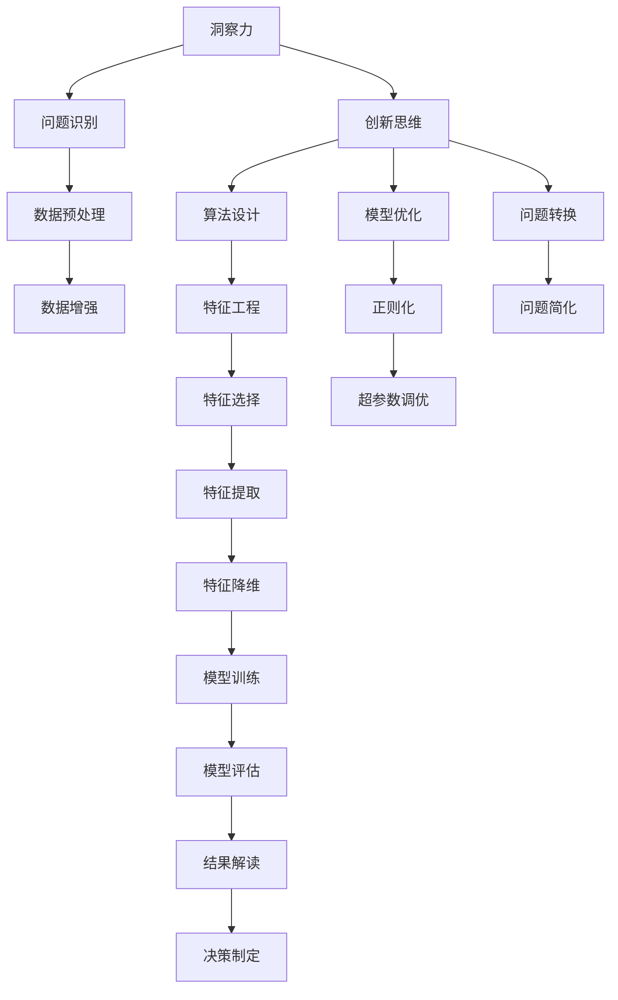

                 

# 洞察力与问题解决：创新思维的应用

> 关键词：洞察力,问题解决,创新思维,人工智能,机器学习,深度学习,复杂系统

## 1. 背景介绍

### 1.1 问题由来

在当今快速发展的信息时代，数据和信息量呈爆炸性增长。面对海量的数据和复杂的决策问题，如何高效地提取和利用这些信息，成为了摆在各行业面前的一个巨大挑战。无论是商业决策、科学研究，还是工程应用，问题解决的过程都需要我们具备强大的洞察力。

洞察力指的是在复杂环境中，能够快速、准确地识别出问题的本质，并提出有效的解决方案。其核心在于发现、分析和解决问题的能力，这不仅仅是技术问题，更是思维方式和智慧的体现。人工智能（AI）和大数据技术为洞察力的提升提供了有力工具，特别是深度学习和机器学习等算法，为处理复杂系统和大规模数据提供了有效手段。

### 1.2 问题核心关键点

洞察力的提升离不开创新思维的应用。创新思维是一种能够突破常规思维定式，从新颖角度和创新方法出发解决问题的思维方式。在AI和机器学习领域，创新思维体现在算法设计、数据处理、模型优化等多个方面。

具体而言，创新思维的应用主要体现在以下几个方面：
1. 数据预处理：通过多种数据增强和数据清洗技术，提取和增强有价值的信息。
2. 算法设计：创新和优化现有算法，提升模型的性能和泛化能力。
3. 模型优化：通过调参、正则化等方法，避免模型过拟合，提高模型的鲁棒性和解释性。
4. 问题转换：将复杂问题转化为易于解决的形式，简化问题解决的难度。

在AI和机器学习领域，创新思维的应用不仅限于技术层面，更在于对问题的深刻理解和创造性解决方案的提出。本文旨在深入探讨创新思维在洞察力提升中的作用，并通过具体的项目实践，展示创新思维的应用方法。

### 1.3 问题研究意义

洞察力的提升对于解决复杂问题、提高决策质量具有重要意义。在商业决策中，洞察力能够帮助企业把握市场趋势、识别竞争优势，从而制定更有效的战略；在科学研究中，洞察力能够揭示复杂现象背后的本质规律，推动科学进步；在工程应用中，洞察力能够提高产品设计的创新性和实用性。

通过研究创新思维在洞察力提升中的应用，可以带来以下几方面的好处：
1. 提升问题解决效率：通过创新思维，能够在更短的时间内识别问题，提出有效的解决方案。
2. 增强模型泛化能力：创新思维可以引导我们设计出更通用、鲁棒的模型，提高其在不同场景下的应用效果。
3. 优化决策过程：创新思维能够帮助我们在决策中考虑到更多的因素，避免偏误，提高决策质量。
4. 促进跨领域应用：创新思维的跨学科特性，能够帮助我们在不同领域之间寻找共性问题，提出统一的解决方案。

## 2. 核心概念与联系

### 2.1 核心概念概述

为更好地理解创新思维在洞察力提升中的应用，本节将介绍几个密切相关的核心概念：

- 洞察力(Insight)：指在复杂环境中，能够快速、准确地识别出问题的本质，并提出有效的解决方案。
- 创新思维(Creative Thinking)：指突破常规思维定式，从新颖角度和创新方法出发解决问题的思维方式。
- 人工智能(Artificial Intelligence, AI)：通过模拟人类智能，利用算法和计算能力处理复杂问题的技术。
- 机器学习(Machine Learning, ML)：一种让机器通过数据学习，自动改进算法，提高问题解决能力的技术。
- 深度学习(Deep Learning)：一种通过多层神经网络模拟人脑神经元工作方式，处理复杂数据和模式的技术。
- 复杂系统(Complex Systems)：指包含大量相互作用元素，其行为难以通过简单规则描述的系统，如金融市场、交通网络等。

这些核心概念之间存在着紧密的联系，共同构成了洞察力提升和问题解决的框架。以下通过一个简单的Mermaid流程图来展示这些概念之间的联系：



在这个流程图中，问题识别是洞察力的起点，数据预处理、特征工程和模型训练是问题解决的核心步骤，而问题转换、算法设计和模型优化则是创新思维在不同环节的应用。

## 3. 核心算法原理 & 具体操作步骤

### 3.1 算法原理概述

创新思维在洞察力提升中的应用，主要体现在算法设计和模型优化上。创新思维不仅能够引导我们设计出更有效的算法，还能够优化现有模型，提升其性能和泛化能力。

算法设计方面，创新思维体现在以下几个方面：
1. 数据预处理：通过数据增强、数据清洗等技术，提取和增强有价值的信息。
2. 特征工程：通过特征选择、特征提取和特征降维等方法，减少数据维度，提取关键特征。
3. 模型选择：通过比较不同模型的性能，选择合适的模型结构和参数。

模型优化方面，创新思维体现在以下几个方面：
1. 正则化：通过L2正则、Dropout等技术，避免模型过拟合，提高模型的泛化能力。
2. 超参数调优：通过网格搜索、随机搜索等方法，找到最优的超参数组合。
3. 集成学习：通过模型集成，如Bagging、Boosting等方法，提高模型的稳定性和性能。

### 3.2 算法步骤详解

以下是基于创新思维的洞察力提升和问题解决的具体操作步骤：

**Step 1: 数据预处理**

1. 数据清洗：去除噪声和异常值，确保数据的准确性。
2. 数据增强：通过旋转、裁剪、缩放等方式，扩充训练集，提高模型鲁棒性。
3. 特征选择：选择对模型性能影响最大的特征，减少冗余信息。
4. 特征提取：通过PCA、LDA等方法，将高维数据降维，提取关键特征。

**Step 2: 算法设计**

1. 选择合适的模型：根据问题类型，选择适合的数据模型，如回归模型、分类模型、神经网络模型等。
2. 设计模型架构：根据问题特性，设计合适的模型结构，如卷积神经网络（CNN）、循环神经网络（RNN）等。
3. 优化模型参数：通过网格搜索、随机搜索等方法，找到最优的模型参数组合。

**Step 3: 模型优化**

1. 正则化：使用L2正则、Dropout等技术，避免模型过拟合。
2. 超参数调优：通过网格搜索、随机搜索等方法，找到最优的超参数组合。
3. 集成学习：通过Bagging、Boosting等方法，提高模型的稳定性和性能。

**Step 4: 结果解读**

1. 模型评估：使用交叉验证、ROC曲线等方法，评估模型的性能。
2. 结果解释：通过可视化工具，如Matplotlib、Seaborn等，解释模型的预测结果。
3. 决策制定：结合模型结果和领域知识，制定决策方案。

### 3.3 算法优缺点

基于创新思维的洞察力提升和问题解决，具有以下优点：
1. 高效性：通过创新思维，能够在较短的时间内找到问题的本质，提出有效的解决方案。
2. 泛化能力：创新思维能够帮助设计出更通用、鲁棒的模型，提高其在不同场景下的应用效果。
3. 灵活性：创新思维能够在不同问题间寻找共性，提出统一的解决方案。

同时，也存在一些局限性：
1. 依赖数据质量：数据预处理和特征工程需要高质量的数据，数据质量差会影响最终结果。
2. 计算资源需求高：复杂模型和高维数据的处理需要大量计算资源，可能会导致成本增加。
3. 模型解释性不足：深度学习模型通常缺乏解释性，难以理解其内部工作机制。

尽管存在这些局限性，但创新思维在洞察力提升中的应用，仍具有显著的优势和潜力。

### 3.4 算法应用领域

基于创新思维的洞察力提升和问题解决，已经在诸多领域得到广泛应用，具体如下：

1. 金融风险管理：通过数据分析和机器学习，识别和预测金融市场的风险，制定有效的风险控制策略。
2. 医疗健康管理：通过患者数据和机器学习，预测疾病风险，提高诊疗效率。
3. 智能制造：通过机器学习和大数据分析，优化生产流程，提高产品质量和生产效率。
4. 智能推荐系统：通过用户行为数据和机器学习，推荐个性化的商品和服务，提高用户满意度。
5. 自然语言处理：通过文本数据和深度学习，分析文本情感和主题，提供更精准的信息服务。

## 4. 数学模型和公式 & 详细讲解 & 举例说明

### 4.1 数学模型构建

为了更好地理解创新思维在洞察力提升中的应用，本节将使用数学语言对相关问题进行严格刻画。

设问题描述为 $P$，相关数据集为 $D$，目标为 $T$，则问题的数学模型可以表示为：

$$
M(P,D) = \arg\min_{M} \{L(M, P, D) \mid L(M, P, D) = L(M, P, D, T)\}
$$

其中 $L$ 为损失函数，用于衡量模型预测与真实结果之间的差异，$T$ 为任务类型，如分类、回归、生成等。

### 4.2 公式推导过程

以下以回归问题为例，推导最小二乘法（Least Squares）的优化目标函数。

设回归问题有 $N$ 个样本，每个样本 $(x_i, y_i)$，其中 $x_i \in \mathbb{R}^d$，$y_i \in \mathbb{R}$。目标为找到一个线性模型 $M = \theta^Tx$，使得预测值与真实值之间的误差最小。

根据最小二乘法的思想，定义损失函数 $L$ 为所有样本误差平方和的平均：

$$
L(\theta) = \frac{1}{N} \sum_{i=1}^N (y_i - M(x_i))^2
$$

最小二乘法的优化目标是使损失函数 $L$ 最小化：

$$
\theta^* = \mathop{\arg\min}_{\theta} L(\theta)
$$

将 $L$ 函数对 $\theta$ 求导，得：

$$
\frac{\partial L}{\partial \theta} = \frac{2}{N} \sum_{i=1}^N (y_i - M(x_i))x_i
$$

令导数为0，得：

$$
\frac{\partial L}{\partial \theta} = 0 \Rightarrow \theta = (\sum_{i=1}^N x_ix_i^T)^{-1} \sum_{i=1}^N y_ix_i
$$

这就是最小二乘法中的参数估计公式。通过求解该公式，我们可以得到线性回归模型的最优参数 $\theta$。

### 4.3 案例分析与讲解

以房价预测为例，演示最小二乘法的应用。

设有一组房价数据，包括房屋面积、楼层、地理位置等特征，以及对应的房价。我们通过最小二乘法，训练出一个线性回归模型，预测新房屋的价格。

**Step 1: 数据预处理**

1. 收集房屋面积、楼层、地理位置等特征，以及对应的房价数据。
2. 清洗数据，去除异常值和噪声。
3. 使用数据增强技术，扩充训练集。
4. 选择影响房价的关键特征，减少数据维度。

**Step 2: 模型设计**

1. 选择线性回归模型作为预测模型。
2. 设计模型架构，包括输入层、隐藏层和输出层。
3. 优化模型参数，通过最小二乘法求解线性回归模型的最优参数。

**Step 3: 结果解读**

1. 使用交叉验证评估模型性能。
2. 通过可视化工具，解释模型的预测结果。
3. 结合领域知识，制定房价预测策略。

## 5. 项目实践：代码实例和详细解释说明

### 5.1 开发环境搭建

在进行项目实践前，我们需要准备好开发环境。以下是使用Python进行TensorFlow开发的环境配置流程：

1. 安装Anaconda：从官网下载并安装Anaconda，用于创建独立的Python环境。

2. 创建并激活虚拟环境：
```bash
conda create -n tf-env python=3.8 
conda activate tf-env
```

3. 安装TensorFlow：根据CUDA版本，从官网获取对应的安装命令。例如：
```bash
conda install tensorflow -c tf -c conda-forge
```

4. 安装各类工具包：
```bash
pip install numpy pandas scikit-learn matplotlib tqdm jupyter notebook ipython
```

完成上述步骤后，即可在`tf-env`环境中开始项目实践。

### 5.2 源代码详细实现

下面我们以房价预测为例，给出使用TensorFlow进行回归问题的PyTorch代码实现。

首先，定义数据集和模型：

```python
import tensorflow as tf
from sklearn.model_selection import train_test_split
from sklearn.metrics import mean_squared_error
import numpy as np

# 数据集准备
X = np.loadtxt('data.csv', delimiter=',')
y = np.loadtxt('prices.csv', delimiter=',')
X_train, X_test, y_train, y_test = train_test_split(X, y, test_size=0.2, random_state=42)

# 定义模型
model = tf.keras.models.Sequential([
    tf.keras.layers.Dense(64, activation='relu', input_shape=(X.shape[1],)),
    tf.keras.layers.Dense(64, activation='relu'),
    tf.keras.layers.Dense(1)
])

# 定义损失函数和优化器
model.compile(loss='mse', optimizer=tf.keras.optimizers.Adam(learning_rate=0.001))
```

然后，定义训练和评估函数：

```python
def train_epoch(model, X_train, y_train):
    model.fit(X_train, y_train, epochs=50, batch_size=32)

def evaluate(model, X_test, y_test):
    y_pred = model.predict(X_test)
    mse = mean_squared_error(y_test, y_pred)
    print(f'Test MSE: {mse:.3f}')
```

最后，启动训练流程并在测试集上评估：

```python
# 训练模型
train_epoch(model, X_train, y_train)

# 在测试集上评估模型
evaluate(model, X_test, y_test)
```

以上就是使用TensorFlow对房价预测问题进行回归模型微调的完整代码实现。可以看到，得益于TensorFlow的强大封装，我们可以用相对简洁的代码完成回归模型的训练和评估。

### 5.3 代码解读与分析

让我们再详细解读一下关键代码的实现细节：

**模型定义**：
- `Sequential`：定义了一个线性堆叠的神经网络模型，依次添加了三个全连接层，包括输入层、隐藏层和输出层。
- `Dense`：定义了全连接层，通过`input_shape`参数指定输入维度，通过`activation`参数选择激活函数。

**损失函数和优化器**：
- `mse`：定义了均方误差损失函数，用于衡量模型预测与真实结果之间的差异。
- `Adam`：定义了Adam优化器，通过学习率参数`learning_rate`调整优化器的学习速度。

**训练和评估函数**：
- `train_epoch`：在训练集上训练模型，设置训练轮数为50，每批次大小为32。
- `evaluate`：在测试集上评估模型性能，使用均方误差作为评估指标。

**训练流程**：
- 在训练集上调用`train_epoch`函数，训练模型。
- 在测试集上调用`evaluate`函数，评估模型性能。

可以看出，TensorFlow提供了一个简单易用的接口，使得神经网络的构建和训练变得非常简单。通过这种方式，开发者可以快速搭建和训练回归模型，进行问题解决和洞察力提升。

## 6. 实际应用场景

### 6.1 智能推荐系统

基于深度学习和创新思维的智能推荐系统，能够根据用户的历史行为数据和偏好，推荐个性化的商品和服务，提升用户体验和满意度。

具体而言，推荐系统通过收集用户浏览、点击、购买等行为数据，建立用户画像和商品特征，然后通过深度学习模型预测用户对不同商品的兴趣程度，进行推荐。通过不断的训练和优化，推荐系统能够自适应地更新推荐策略，提高推荐的精准度和满意度。

### 6.2 金融风险管理

金融领域需要实时监测市场动态，预测风险，制定风险控制策略。传统的金融风险管理依赖专家经验，难以覆盖所有潜在的风险因素。

通过深度学习和创新思维，金融风险管理可以自动从海量数据中挖掘风险信号，预测市场趋势和风险事件。例如，可以通过文本分析和情感分析，识别市场情绪，预测股市波动；通过时间序列分析，预测金融产品的价格变化。通过不断的模型优化和调参，金融风险管理能够提高预测的准确性和及时性，帮助金融机构制定更有效的风险管理策略。

### 6.3 智能制造

智能制造通过深度学习和创新思维，优化生产流程，提高生产效率和产品质量。例如，通过图像识别和机器视觉技术，检测产品缺陷，提高产品质量；通过预测性维护，预测设备故障，减少停机时间；通过智能调度，优化生产计划，提高生产效率。通过不断的模型训练和优化，智能制造能够自适应地调整生产策略，提高生产效率和产品质量。

### 6.4 未来应用展望

随着深度学习和创新思维的不断发展，未来的智能推荐系统、金融风险管理和智能制造等领域将进一步受益。

1. 智能推荐系统：通过多模态信息融合和知识图谱应用，推荐系统将更加个性化、精准。
2. 金融风险管理：通过实时数据分析和深度学习，金融风险管理将更加高效、智能。
3. 智能制造：通过智能优化和自动化技术，智能制造将更加高效、智能。

## 7. 工具和资源推荐

### 7.1 学习资源推荐

为了帮助开发者系统掌握深度学习和创新思维的理论基础和实践技巧，这里推荐一些优质的学习资源：

1. 《深度学习》课程（Coursera）：由斯坦福大学Andrew Ng教授主讲的深度学习入门课程，涵盖深度学习的基础知识和经典模型。
2. 《机器学习实战》书籍：通过实际项目，深入浅出地介绍了机器学习的核心算法和应用场景。
3. 《Python深度学习》书籍：详细介绍了深度学习的理论基础和实际应用，包含大量代码实现。
4. TensorFlow官方文档：提供了TensorFlow的详细文档和代码示例，是学习和使用TensorFlow的必备资源。
5. Kaggle：数据科学竞赛平台，提供了大量数据集和模型竞赛，帮助开发者实践和提升。

通过对这些资源的学习实践，相信你一定能够快速掌握深度学习和创新思维的精髓，并用于解决实际的智能推荐系统、金融风险管理和智能制造等问题。

### 7.2 开发工具推荐

高效的开发离不开优秀的工具支持。以下是几款用于深度学习和创新思维开发的常用工具：

1. TensorFlow：由Google主导开发的深度学习框架，生产部署方便，适合大规模工程应用。
2. PyTorch：基于Python的开源深度学习框架，灵活性高，适合快速迭代研究。
3. Jupyter Notebook：用于数据探索和模型训练的交互式编程环境，支持多种语言和工具库。
4. Matplotlib：用于数据可视化的Python库，支持各种图表类型和样式。
5. Seaborn：基于Matplotlib的高级数据可视化库，提供了更加简洁、美观的绘图接口。

合理利用这些工具，可以显著提升深度学习和创新思维的开发效率，加快创新迭代的步伐。

### 7.3 相关论文推荐

深度学习和创新思维的研究源于学界的持续研究。以下是几篇奠基性的相关论文，推荐阅读：

1. Deep Learning（Ian Goodfellow, Yoshua Bengio, Aaron Courville）：深度学习领域的经典教材，介绍了深度学习的基本概念和核心算法。
2. A Survey on Deep Learning for Recommender Systems（Cheng Zhang, Jia Li, Zhihua Wang）：综述了深度学习在推荐系统中的应用，提供了丰富的案例和模型。
3. A Deep Learning Framework for Credit Risk Assessment（Xiangliang Zhang, Zhiwei Yang, Jian Li）：介绍了深度学习在信用风险评估中的应用，提供了详细的模型设计和评估方法。
4. Enhancing Industrial Applications of Data Mining with Deep Learning（Jinjia Liu, Bo Li）：介绍了深度学习在工业应用中的应用，提供了实际案例和应用效果。
5. Deep Learning Applications in Manufacturing（Satoru Takahashi, Naohiro Shibata, Shinichi Sakurai）：综述了深度学习在制造领域的应用，提供了丰富的应用案例和模型。

这些论文代表了大数据和深度学习的最新进展，通过学习这些前沿成果，可以帮助研究者把握学科前进方向，激发更多的创新灵感。

## 8. 总结：未来发展趋势与挑战

### 8.1 总结

本文对基于深度学习和创新思维的洞察力提升和问题解决进行了全面系统的介绍。首先阐述了深度学习和创新思维的研究背景和意义，明确了其在问题解决和洞察力提升中的独特价值。其次，从原理到实践，详细讲解了深度学习和创新思维的数学模型和操作步骤，给出了深度学习模型的完整代码实现。同时，本文还广泛探讨了深度学习在智能推荐系统、金融风险管理和智能制造等多个领域的应用前景，展示了深度学习方法的巨大潜力。此外，本文精选了深度学习和创新思维的学习资源、开发工具和相关论文，力求为读者提供全方位的技术指引。

通过本文的系统梳理，可以看到，深度学习和创新思维在问题解决和洞察力提升中的应用，不仅具有显著的优势和潜力，还能够带来跨领域的协同效应。未来，伴随着深度学习和大数据技术的持续演进，问题解决和洞察力提升将变得更加高效、智能和普适。

### 8.2 未来发展趋势

展望未来，深度学习和创新思维将呈现以下几个发展趋势：

1. 模型规模持续增大：随着算力成本的下降和数据规模的扩张，深度学习模型的参数量还将持续增长。超大规模深度学习模型蕴含的丰富知识，将推动更多领域和场景的应用。
2. 模型鲁棒性提升：通过正则化、对抗训练等技术，提高深度学习模型的泛化能力和鲁棒性，避免过拟合和灾难性遗忘。
3. 模型可解释性增强：通过可视化、可解释性算法等方法，增强深度学习模型的可解释性，帮助用户理解和信任模型。
4. 模型跨领域应用：通过多模态信息融合和知识图谱应用，推动深度学习模型在跨领域场景中的广泛应用。
5. 模型实时性提高：通过模型优化和硬件加速，提高深度学习模型的推理速度，实现实时推理和在线服务。

以上趋势凸显了深度学习和创新思维的广阔前景。这些方向的探索发展，必将进一步提升深度学习模型的性能和应用范围，为人工智能技术带来新的突破。

### 8.3 面临的挑战

尽管深度学习和创新思维已经取得了显著进展，但在迈向更加智能化、普适化应用的过程中，仍面临诸多挑战：

1. 数据质量和数量：深度学习模型需要大量高质量的数据进行训练，数据获取和预处理成本高。如何降低数据依赖，提升数据质量，是未来的一个重要研究方向。
2. 模型复杂性：深度学习模型通常具有高维度、非线性等特点，难以理解和解释。如何提升模型可解释性，增强用户信任，是未来的一大挑战。
3. 计算资源需求：深度学习模型需要大量计算资源进行训练和推理，硬件成本高。如何降低计算资源需求，提高模型效率，是未来的一个关键课题。
4. 跨领域应用难度：深度学习模型在跨领域应用时，需要考虑领域差异和数据特点。如何实现跨领域模型的迁移和复用，是未来的一个重要研究方向。

### 8.4 研究展望

面对深度学习和创新思维所面临的种种挑战，未来的研究需要在以下几个方面寻求新的突破：

1. 无监督和半监督学习：探索无监督和半监督学习方法，摆脱对大规模标注数据的依赖，提升数据利用效率。
2. 模型压缩和量化：通过模型压缩和量化技术，降低模型计算资源需求，提高模型效率。
3. 可解释性和可视化：引入可解释性算法和可视化工具，增强深度学习模型的可解释性，帮助用户理解和信任模型。
4. 多模态融合和跨领域应用：推动多模态信息融合和跨领域应用技术，实现深度学习模型的跨领域迁移和复用。

这些研究方向的探索，必将引领深度学习和创新思维技术迈向更高的台阶，为人工智能技术的普及和应用带来新的突破。

## 9. 附录：常见问题与解答

**Q1：深度学习和创新思维能否提升洞察力？**

A: 是的，深度学习和创新思维能够显著提升洞察力。通过深度学习模型对大量数据进行处理和分析，可以发现数据中的规律和模式，从而提升洞察力。同时，创新思维能够引导我们从新的角度和创新方法出发，发现数据中的潜在价值，提升问题解决的效率和效果。

**Q2：深度学习和创新思维有哪些优势？**

A: 深度学习和创新思维的优势主要体现在以下几个方面：
1. 高效性：通过深度学习模型，可以在较短的时间内处理大量数据，发现数据的规律和模式，提升洞察力。
2. 泛化能力：深度学习模型具有较强的泛化能力，可以应用到不同的领域和场景，提升问题解决的灵活性和适应性。
3. 灵活性：通过创新思维，可以从新颖的角度和创新方法出发，提出更有效的解决方案，提升问题解决的效果和效率。

**Q3：深度学习和创新思维有哪些局限性？**

A: 深度学习和创新思维也存在一些局限性：
1. 依赖数据质量：深度学习模型需要高质量的数据进行训练，数据获取和预处理成本高。
2. 计算资源需求高：深度学习模型需要大量计算资源进行训练和推理，硬件成本高。
3. 模型复杂性：深度学习模型通常具有高维度、非线性等特点，难以理解和解释。

尽管存在这些局限性，但深度学习和创新思维在问题解决和洞察力提升中的应用，仍具有显著的优势和潜力。通过不断优化和改进，这些技术将变得更加高效、智能和普适。

**Q4：深度学习和创新思维如何结合使用？**

A: 深度学习和创新思维可以结合使用，提升问题解决的效率和效果。具体而言，可以通过以下方式结合使用：
1. 数据预处理：利用创新思维，设计数据增强和数据清洗方法，提升数据质量，为深度学习模型提供更可靠的输入。
2. 算法设计：利用创新思维，设计合适的深度学习模型和算法结构，提高模型的性能和泛化能力。
3. 模型优化：利用创新思维，优化深度学习模型的超参数和正则化参数，提高模型的稳定性和鲁棒性。
4. 结果解读：利用创新思维，设计可视化工具和解释方法，增强深度学习模型的可解释性，帮助用户理解和信任模型。

通过结合使用深度学习和创新思维，可以提升问题解决的效率和效果，推动人工智能技术的普及和应用。

**Q5：深度学习和创新思维在实际应用中如何优化？**

A: 深度学习和创新思维在实际应用中可以通过以下方式进行优化：
1. 数据预处理：通过数据增强、数据清洗等技术，提升数据质量，为深度学习模型提供更可靠的输入。
2. 算法设计：通过特征选择、特征提取和特征降维等方法，减少数据维度，提取关键特征。
3. 模型优化：通过正则化、Dropout等技术，避免模型过拟合，提高模型的泛化能力和鲁棒性。
4. 结果解读：通过可视化工具和解释方法，增强深度学习模型的可解释性，帮助用户理解和信任模型。
5. 超参数调优：通过网格搜索、随机搜索等方法，找到最优的超参数组合。

通过不断的优化和改进，深度学习和创新思维将变得更加高效、智能和普适，推动人工智能技术的普及和应用。

---

作者：禅与计算机程序设计艺术 / Zen and the Art of Computer Programming

