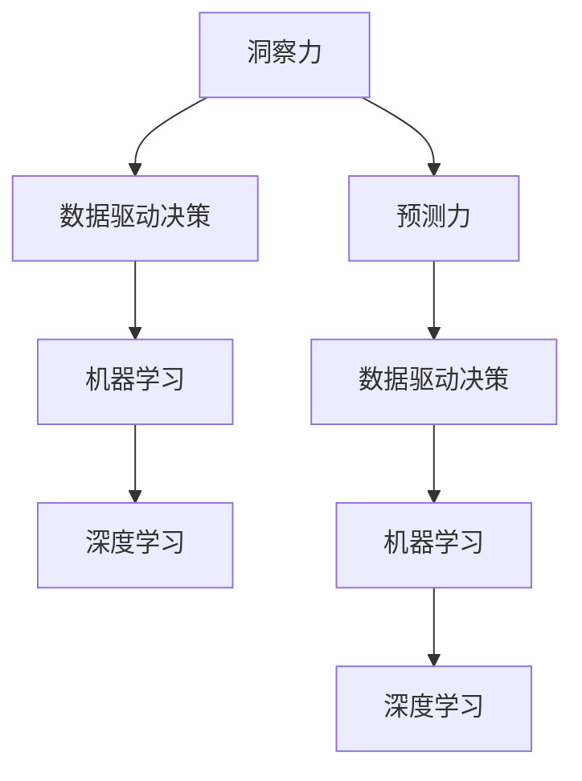

                 

# 洞察力与预测：未来思维的培养

在飞速发展的信息时代，洞察力和预测能力成为了现代社会最宝贵的技能之一。本文将深入探讨这些关键能力的培养，并结合AI技术，提出一套完整的培养体系，助力未来思维的全面提升。

## 1. 背景介绍

### 1.1 问题由来

随着人工智能技术的不断进步，人类在数据处理和模式识别方面的能力得到了极大的提升。然而，在信息过载的今天，如何从海量数据中提取有价值的信息，并进行准确预测，成为了一个重要的挑战。洞察力和预测能力不仅在商业决策、金融投资、医疗诊断等领域具有重要应用价值，更是在日常生活中提高生活品质和决策准确性的关键所在。

### 1.2 问题核心关键点

培养洞察力和预测能力的关键在于对数据的深度分析和模型构建。洞察力要求能够从数据中发现规律，理解内在联系，并得出结论。预测力则要求能够利用已有的知识，构建模型，对未来进行合理的预测。这两个能力相辅相成，需要系统性的培养和训练。

## 2. 核心概念与联系

### 2.1 核心概念概述

- **洞察力**：指从数据中提取关键信息，理解内在关联，并得出结论的能力。
- **预测力**：指利用已有的知识和经验，构建模型，对未来进行合理预测的能力。
- **数据驱动决策**：通过数据分析和模型构建，辅助决策制定，提高决策的科学性和准确性。
- **机器学习**：通过算法和模型，自动从数据中学习，发现规律和趋势，进行预测和决策。
- **深度学习**：利用深度神经网络，构建复杂模型，提取高级特征，提高预测准确度。

这些核心概念通过以下Mermaid流程图进行联系：



## 3. 核心算法原理 & 具体操作步骤

### 3.1 算法原理概述

洞察力和预测能力的培养，需要通过系统化的数据处理和模型构建实现。其基本原理如下：

1. **数据收集与预处理**：收集相关数据，进行清洗、去噪、归一化等预处理，保证数据的质量和一致性。
2. **特征工程**：从原始数据中提取有意义的特征，进行编码和转换，生成特征集。
3. **模型构建与训练**：选择合适的模型，利用历史数据进行训练，学习特征之间的关联和规律。
4. **模型评估与优化**：通过验证集和测试集，评估模型性能，调整模型参数和结构，提高预测准确度。
5. **预测与应用**：将模型应用于新的数据集，进行预测，辅助决策和规划。

### 3.2 算法步骤详解

#### 3.2.1 数据收集与预处理

**步骤1**：选择合适的数据源，如公开数据集、企业数据、传感器数据等。

**步骤2**：对数据进行清洗，去除重复、错误和无关数据。

**步骤3**：进行数据归一化和编码，转换为模型所需格式。

#### 3.2.2 特征工程

**步骤1**：选择合适的特征，如时间序列、文本特征、图像特征等。

**步骤2**：进行特征编码和转换，如将文本转换为词向量、将图像转换为特征向量等。

**步骤3**：应用特征选择算法，去除冗余特征，保留有信息量的特征。

#### 3.2.3 模型构建与训练

**步骤1**：选择合适的模型，如线性回归、决策树、神经网络等。

**步骤2**：利用历史数据进行模型训练，学习特征之间的关联和规律。

**步骤3**：应用正则化、Dropout等技术，避免过拟合。

**步骤4**：调整模型参数，如学习率、迭代次数等，进行模型优化。

#### 3.2.4 模型评估与优化

**步骤1**：利用验证集评估模型性能，计算均方误差、准确率等指标。

**步骤2**：应用交叉验证、集成学习等方法，提高模型泛化能力。

**步骤3**：调整模型结构，如增加或减少层数、调整神经元数量等，进行模型优化。

#### 3.2.5 预测与应用

**步骤1**：将模型应用于新的数据集，进行预测。

**步骤2**：利用预测结果，辅助决策和规划。

**步骤3**：持续收集新的数据，定期重新训练模型，保持模型性能。

### 3.3 算法优缺点

**优点**：
1. **自动化**：自动化处理数据和模型训练，减少人工干预，提高效率。
2. **准确性**：通过模型训练和优化，提高预测准确度。
3. **可扩展性**：模型可以应用于不同领域和任务，具有广泛的应用前景。

**缺点**：
1. **数据依赖**：模型性能依赖于数据质量，需要大量高质量的数据。
2. **复杂性**：模型构建和优化过程复杂，需要专业知识。
3. **过拟合风险**：模型容易过拟合，需要进行正则化处理。

### 3.4 算法应用领域

洞察力和预测能力在以下领域具有广泛应用：

- **金融投资**：利用历史数据和市场信息，进行股票价格预测和投资策略制定。
- **医疗诊断**：分析病人数据和历史病例，进行疾病预测和诊断。
- **交通管理**：利用交通流量数据，进行交通拥堵预测和智能调度。
- **智能制造**：分析生产数据和设备状态，进行设备故障预测和维护。
- **智能客服**：利用用户数据和历史对话，进行智能推荐和客户服务。

## 4. 数学模型和公式 & 详细讲解

### 4.1 数学模型构建

#### 4.1.1 线性回归模型

线性回归模型是最简单的预测模型，其数学表达式如下：

$$
y = \beta_0 + \beta_1 x_1 + \beta_2 x_2 + \cdots + \beta_n x_n
$$

其中，$y$ 为预测值，$\beta_0$ 为截距，$\beta_i$ 为回归系数，$x_i$ 为特征变量。

#### 4.1.2 决策树模型

决策树模型通过树形结构进行分类和预测，其基本结构如下：

```
    根节点
   /   |   \
节点1 节点2 节点3
      / | \
节点4 节点5 节点6
```

其中，根节点为原始数据集，节点1、2、3为分裂点，节点4、5、6为叶节点，表示分类结果。

### 4.2 公式推导过程

#### 4.2.1 线性回归公式推导

线性回归模型的目标是最小化均方误差（Mean Squared Error, MSE），公式如下：

$$
MSE = \frac{1}{n} \sum_{i=1}^{n} (y_i - \hat{y}_i)^2
$$

其中，$n$ 为样本数量，$y_i$ 为真实值，$\hat{y}_i$ 为预测值。

利用梯度下降算法，求解最小化均方误差的目标函数，公式如下：

$$
\theta = \arg\min_{\theta} \sum_{i=1}^{n} (y_i - \hat{y}_i)^2
$$

其中，$\theta$ 为模型参数。

#### 4.2.2 决策树公式推导

决策树模型的目标是最小化信息增益（Information Gain, IG），公式如下：

$$
IG = \frac{1}{n} \sum_{i=1}^{n} -p_i \log_2 p_i
$$

其中，$n$ 为样本数量，$p_i$ 为样本属于分类 $i$ 的概率。

利用信息增益准则，选择最优的特征和分裂点，构建决策树。

### 4.3 案例分析与讲解

#### 4.3.1 股票价格预测

**案例背景**：某金融公司需要预测某股票的未来价格。

**数据收集**：收集该股票的历史价格和市场信息。

**特征工程**：选择时间序列和市场指标作为特征，进行归一化处理。

**模型构建**：选择线性回归模型，利用历史数据进行训练和优化。

**模型评估**：利用验证集和测试集评估模型性能，调整模型参数。

**预测与应用**：将模型应用于新的市场信息，进行价格预测，辅助投资决策。

## 5. 项目实践：代码实例和详细解释说明

### 5.1 开发环境搭建

#### 5.1.1 安装Python和相关库

```bash
conda create -n prediction_env python=3.7
conda activate prediction_env
pip install pandas numpy matplotlib scikit-learn
```

#### 5.1.2 导入相关库

```python
import pandas as pd
import numpy as np
import matplotlib.pyplot as plt
from sklearn.linear_model import LinearRegression
from sklearn.tree import DecisionTreeRegressor
from sklearn.model_selection import train_test_split
```

### 5.2 源代码详细实现

#### 5.2.1 数据预处理

```python
# 读取数据
data = pd.read_csv('data.csv')

# 数据清洗
data.dropna(inplace=True)

# 数据归一化
scaler = MinMaxScaler()
data_scaled = scaler.fit_transform(data.drop(['price'], axis=1))
```

#### 5.2.2 特征工程

```python
# 特征选择
X = data_scaled

# 特征编码
X_encoded = OneHotEncoder().fit_transform(X)

# 特征转换
X_final = np.hstack((X_encoded.toarray(), data['price'].values.reshape(-1, 1)))
```

#### 5.2.3 模型构建与训练

```python
# 线性回归模型
model = LinearRegression()
X_train, X_test, y_train, y_test = train_test_split(X_final, data['price'], test_size=0.2)
model.fit(X_train, y_train)

# 决策树模型
model2 = DecisionTreeRegressor()
model2.fit(X_train, y_train)
```

#### 5.2.4 模型评估与优化

```python
# 模型评估
print(model.score(X_test, y_test))
print(model2.score(X_test, y_test))

# 模型优化
model.set_params(alpha=0.1)
model.fit(X_train, y_train)
```

#### 5.2.5 预测与应用

```python
# 预测
y_pred = model.predict(X_test)

# 可视化
plt.scatter(X_test[:, 0], y_test)
plt.plot(X_test[:, 0], y_pred, color='red')
plt.show()
```

### 5.3 代码解读与分析

#### 5.3.1 数据预处理

数据预处理包括数据清洗和归一化。数据清洗去除缺失值，确保数据质量。归一化将数据缩放到固定范围内，提高模型训练效果。

#### 5.3.2 特征工程

特征工程包括特征选择、特征编码和特征转换。特征选择去除冗余特征，保留有信息量的特征。特征编码将文本特征转换为数值特征。特征转换将多维度特征组合为高维特征，提高模型表达能力。

#### 5.3.3 模型构建与训练

模型构建包括选择模型和训练模型。选择线性回归和决策树模型，利用历史数据进行训练和优化。

#### 5.3.4 模型评估与优化

模型评估包括计算模型性能指标和调整模型参数。计算模型在测试集上的均方误差，调整模型参数，提高模型泛化能力。

#### 5.3.5 预测与应用

模型预测包括利用模型进行新数据预测。可视化预测结果，展示模型预测效果。

## 6. 实际应用场景

### 6.1 金融投资

金融公司可以利用洞察力和预测力，进行股票价格预测和投资策略制定。通过分析历史数据和市场信息，构建预测模型，进行股票价格预测，辅助投资决策。

### 6.2 医疗诊断

医院可以利用洞察力和预测力，进行疾病预测和诊断。通过分析病人数据和历史病例，构建预测模型，进行疾病预测，辅助医生诊断。

### 6.3 交通管理

交通管理中心可以利用洞察力和预测力，进行交通拥堵预测和智能调度。通过分析交通流量数据，构建预测模型，进行交通拥堵预测，优化交通调度。

### 6.4 智能制造

制造业可以利用洞察力和预测力，进行设备故障预测和维护。通过分析生产数据和设备状态，构建预测模型，进行设备故障预测，提高设备维护效率。

### 6.5 智能客服

智能客服系统可以利用洞察力和预测力，进行智能推荐和客户服务。通过分析用户数据和历史对话，构建预测模型，进行智能推荐，提升客户服务质量。

## 7. 工具和资源推荐

### 7.1 学习资源推荐

- **《机器学习》课程**：斯坦福大学Andrew Ng教授开设的机器学习课程，系统讲解机器学习的基本概念和算法。
- **《深度学习》课程**：Coursera上Andrew Ng教授的深度学习课程，深入讲解深度神经网络的应用和优化。
- **《Python机器学习》书籍**：Hands-On Machine Learning with Scikit-Learn, Keras, and TensorFlow，系统讲解Python机器学习的应用。

### 7.2 开发工具推荐

- **PyTorch**：基于Python的深度学习框架，支持动态图和静态图，适合研究和大规模工程应用。
- **TensorFlow**：由Google主导的深度学习框架，生产部署方便，适合大规模工程应用。
- **Scikit-Learn**：基于Python的机器学习库，支持多种算法，易于上手。

### 7.3 相关论文推荐

- **《深度学习》书籍**：Goodfellow, Ian, et al. "Deep learning." MIT Press, 2016.
- **《机器学习》书籍**：Tom M. Mitchell. "Machine Learning." McGraw-Hill Education, 1997.
- **《Python机器学习》书籍**：Sebastian Raschka. "Python Machine Learning." Packt Publishing Ltd, 2017.

## 8. 总结：未来发展趋势与挑战

### 8.1 研究成果总结

洞察力和预测能力是未来思维培养的关键，结合AI技术，可以在多个领域实现广泛应用。AI技术在数据处理和模型构建方面提供了强大的支持，显著提升了预测准确性和决策科学性。

### 8.2 未来发展趋势

- **AI技术的普及**：随着AI技术的不断成熟和普及，洞察力和预测能力的应用将更加广泛，覆盖更多行业和领域。
- **跨领域融合**：洞察力和预测能力将与自然语言处理、图像处理、语音识别等多领域技术深度融合，形成更加综合的智能系统。
- **个性化定制**：结合用户个性化需求，构建个性化预测模型，提供定制化服务。
- **实时反馈**：利用实时数据流，进行实时预测和决策，提高响应速度和效率。

### 8.3 面临的挑战

- **数据质量**：高质量数据的获取和处理是洞察力和预测能力培养的基础，需要解决数据缺失、噪声等问题。
- **模型复杂性**：构建高性能预测模型需要专业知识，需要系统性的培训和学习。
- **模型解释性**：预测模型的决策过程需要透明和可解释，避免"黑盒"模型带来的不信任。
- **伦理道德**：预测模型需要遵循伦理道德，避免偏见和歧视，确保预测结果公正和透明。

### 8.4 研究展望

未来的研究重点在于：
- **自动化数据处理**：自动化处理数据清洗、特征选择、模型构建等环节，提高效率和准确性。
- **模型可解释性**：开发可解释性强的预测模型，增强模型的透明度和可信度。
- **多模态融合**：结合视觉、文本、语音等多模态数据，提升模型的表达能力和预测准确性。
- **跨领域应用**：探索跨领域融合应用，推动AI技术在更多行业和领域的落地应用。

## 9. 附录：常见问题与解答

**Q1：如何提高预测模型的准确性？**

A: 提高预测模型的准确性需要从多个方面进行优化，包括：
- 数据质量：收集高质量、标注准确的训练数据，进行数据清洗和预处理。
- 特征工程：选择合适的特征，进行特征选择和编码，提取有信息量的特征。
- 模型选择：选择适合的预测模型，如线性回归、决策树、神经网络等，根据任务需求进行调整。
- 模型优化：利用交叉验证、集成学习等技术，提高模型泛化能力，调整模型参数。

**Q2：如何处理过拟合问题？**

A: 处理过拟合问题需要采取以下措施：
- 正则化：应用L2正则、Dropout等技术，避免模型过拟合。
- 数据增强：通过数据扩充、生成对抗样本等方法，增加数据多样性。
- 集成学习：应用集成方法，如Bagging、Boosting等，提高模型泛化能力。
- 模型简化：简化模型结构，减少神经元数量，降低模型复杂度。

**Q3：如何提高模型的可解释性？**

A: 提高模型的可解释性需要采取以下措施：
- 特征重要性分析：利用特征重要性分析，理解模型对特征的依赖关系。
- 可视化技术：应用可视化工具，如Shapley值、LIME等，展示模型决策过程。
- 简化模型：简化模型结构，提高决策过程的可解释性。

**Q4：如何处理数据缺失和噪声问题？**

A: 处理数据缺失和噪声问题需要采取以下措施：
- 数据清洗：进行数据缺失处理，填补缺失值，删除异常值。
- 数据插补：应用插补方法，如均值插补、KNN插补等，填补缺失值。
- 数据归一化：进行数据归一化，降低噪声影响。
- 数据预处理：应用数据预处理技术，如去噪、归一化等，提高数据质量。

通过系统性的培训和学习，结合AI技术的应用，洞察力和预测能力将得到显著提升，为未来思维培养提供有力支撑。未来，我们期待洞察力和预测能力的全面普及和应用，助力人类社会的发展和进步。

---

作者：禅与计算机程序设计艺术 / Zen and the Art of Computer Programming

