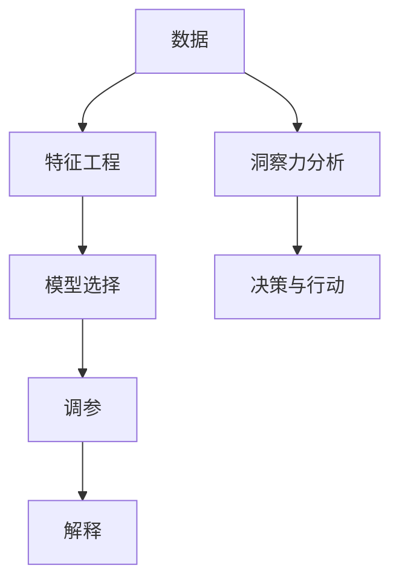

                 

# 洞察力的培养：从表象到本质的思考

## 1. 背景介绍

### 1.1 问题由来
洞察力（Insight）是人工智能（AI）和机器学习（ML）领域的核心能力之一。它是指通过对数据的细致观察和深入分析，揭示现象背后的本质和规律，从而指导决策和行动的能力。在现代社会，数据规模不断增长，信息量爆炸式增长，洞察力显得尤为重要。然而，面对海量数据，如何培养和提升洞察力，成为了一个急需解决的问题。

### 1.2 问题核心关键点
在AI和ML领域，洞察力的培养和提升需要从以下几个方面着手：

- **数据处理与分析**：掌握高效的数据处理和分析工具，能够从大规模数据中提取有用信息。
- **模型选择与优化**：选择适合的机器学习模型，并通过调参优化，以获得最佳的洞察力输出。
- **特征工程与解释**：理解特征工程的重要性和实际操作方法，以及如何解释和理解模型的输出结果。
- **业务背景与领域知识**：结合实际业务背景和领域知识，进行有针对性的洞察力挖掘。

### 1.3 问题研究意义
洞察力是AI和ML领域的关键能力，能够帮助企业在数据驱动决策中脱颖而出，提高竞争力和创新能力。以下是培养和提升洞察力的重要意义：

- **数据驱动决策**：洞察力使企业能够基于数据做出更准确的决策，减少决策的盲目性和风险。
- **业务优化与创新**：洞察力能够揭示业务运营中的问题，指导业务优化和创新。
- **客户洞察与市场预测**：洞察力能够帮助企业更好地理解客户需求和市场变化，制定相应的策略。
- **技术突破与新产品开发**：洞察力使企业能够快速把握技术发展趋势，推动技术突破和新产品开发。

## 2. 核心概念与联系

### 2.1 核心概念概述

洞察力（Insight）是指通过对数据的细致观察和深入分析，揭示现象背后的本质和规律，从而指导决策和行动的能力。在AI和ML领域，洞察力的培养和提升通常需要以下几个关键概念：

- **数据（Data）**：指用于洞察力分析的数据集，通常包含结构化数据（如表格数据）和非结构化数据（如文本、图像等）。
- **特征（Feature）**：指用于描述数据样本的属性，通常通过特征工程提取。
- **模型（Model）**：指用于洞察力分析的机器学习模型，通过训练模型来发现数据中的规律。
- **调参（Hyperparameter Tuning）**：指通过调整模型参数来优化模型性能，提升洞察力的准确性。
- **解释（Explainability）**：指理解模型输出的原因和逻辑，帮助非技术人员理解洞察力结果。

这些概念之间的逻辑关系可以通过以下Mermaid流程图来展示：



这个流程图展示了从数据到洞察力的整个过程：

1. 首先从数据开始，通过特征工程提取关键特征。
2. 根据特征选择合适的机器学习模型。
3. 对模型进行调参优化，提升模型性能。
4. 通过解释技术理解模型输出的原因和逻辑。
5. 最终进行洞察力分析，指导决策和行动。

## 3. 核心算法原理 & 具体操作步骤
### 3.1 算法原理概述

洞察力的培养和提升，本质上是一个数据驱动的机器学习过程。其核心思想是通过对数据的细致观察和深入分析，揭示数据背后的规律和趋势，从而指导决策和行动。

形式化地，假设原始数据集为 $D=\{(x_i, y_i)\}_{i=1}^N$，其中 $x_i$ 为特征向量，$y_i$ 为标签或目标变量。定义一个机器学习模型 $M$，通过训练 $M$ 来学习数据的规律，并进行预测或分类。训练目标是最小化模型在测试集上的预测误差，即：

$$
\min_{\theta} \mathcal{L}(M_{\theta}, D)
$$

其中 $\theta$ 为模型参数，$\mathcal{L}$ 为损失函数。

### 3.2 算法步骤详解

洞察力的培养和提升通常包括以下几个关键步骤：

**Step 1: 数据处理与准备**
- 收集和整理数据，包括清洗、补全缺失值、去除噪声等预处理工作。
- 划分为训练集、验证集和测试集，确保训练数据的多样性和代表性。

**Step 2: 特征工程**
- 选择合适的特征，提取有意义的特征表示。
- 通过降维、特征选择等方法，减少特征维度，提高计算效率。
- 利用领域知识，进行特征构建和优化。

**Step 3: 模型选择与训练**
- 根据任务类型选择合适的机器学习模型，如线性回归、决策树、神经网络等。
- 定义模型参数和优化器，选择适当的损失函数。
- 使用训练集进行模型训练，通过梯度下降等优化算法，更新模型参数。

**Step 4: 调参与优化**
- 使用交叉验证等方法，对模型进行调参优化，找到最优的模型参数。
- 进行正则化、剪枝等技术，防止过拟合。
- 引入对抗训练、迁移学习等方法，提升模型的泛化能力。

**Step 5: 解释与验证**
- 使用特征重要性分析、模型可视化等技术，解释模型的输出结果。
- 在验证集上评估模型性能，确保模型具有较高的准确性和泛化能力。
- 根据实际需求，对模型进行微调和优化。

**Step 6: 应用与改进**
- 将模型应用到实际业务场景中，进行洞察力分析。
- 根据实际效果和反馈，对模型进行改进和优化。
- 持续收集数据，进行模型更新和维护。

以上是洞察力培养和提升的一般流程。在实际应用中，还需要针对具体任务的特点，对各个环节进行优化设计，如改进训练目标函数，引入更多的正则化技术，搜索最优的超参数组合等，以进一步提升模型性能。

### 3.3 算法优缺点

洞察力的培养和提升方法具有以下优点：

- **数据驱动**：基于数据进行决策，减少主观判断带来的偏差。
- **精度高**：通过机器学习模型，可以获得较高的预测准确性。
- **可解释性强**：通过特征重要性分析和模型可视化，理解模型的输出结果。
- **适用范围广**：适用于各种数据驱动的决策场景，包括业务优化、客户洞察、市场预测等。

同时，该方法也存在一定的局限性：

- **依赖数据质量**：洞察力分析结果高度依赖于数据质量和特征提取的有效性。
- **模型复杂性**：复杂的模型可能需要更多的计算资源和时间，降低实际应用效率。
- **数据隐私问题**：在进行数据驱动的洞察力分析时，需要考虑数据隐私和合规性问题。
- **模型偏差**：模型可能存在固有的偏差和偏见，影响分析结果的公正性。

尽管存在这些局限性，但就目前而言，基于机器学习的洞察力培养和提升方法仍然是最主流的方式。未来相关研究的重点在于如何进一步降低数据对洞察力的影响，提高模型的泛化能力和可解释性，同时兼顾数据隐私和伦理安全等因素。

### 3.4 算法应用领域

洞察力的培养和提升在AI和ML领域已经得到了广泛的应用，覆盖了几乎所有常见的数据驱动决策场景，例如：

- **业务优化**：通过分析业务数据，发现运营中的问题，优化流程，提高效率。
- **客户洞察**：通过分析客户数据，了解客户需求和行为，提升客户满意度。
- **市场预测**：通过分析市场数据，预测市场趋势，指导业务决策。
- **产品开发**：通过分析用户反馈和市场数据，指导新产品开发和迭代。
- **风险管理**：通过分析金融数据，识别潜在的风险，制定相应的应对策略。
- **健康医疗**：通过分析健康数据，预测疾病风险，优化诊疗方案。
- **环境保护**：通过分析环境数据，制定环保策略，推动可持续发展。

除了上述这些经典应用外，洞察力培养和提升的方法还被创新性地应用到更多场景中，如智能推荐、物流优化、安全监控等，为各个行业带来了新的突破。随着机器学习模型的不断进步，相信洞察力分析将会在更广阔的应用领域大放异彩。

## 4. 数学模型和公式 & 详细讲解  
### 4.1 数学模型构建

本节将使用数学语言对洞察力培养和提升的机器学习过程进行更加严格的刻画。

假设原始数据集为 $D=\{(x_i, y_i)\}_{i=1}^N$，其中 $x_i$ 为特征向量，$y_i$ 为标签或目标变量。定义一个机器学习模型 $M_{\theta}$，通过训练 $M_{\theta}$ 来学习数据的规律，并进行预测或分类。训练目标是最小化模型在测试集上的预测误差，即：

$$
\min_{\theta} \mathcal{L}(M_{\theta}, D)
$$

其中 $\theta$ 为模型参数，$\mathcal{L}$ 为损失函数。

假设模型 $M_{\theta}$ 在输入 $x$ 上的输出为 $\hat{y}=M_{\theta}(x)$，则损失函数 $\ell(M_{\theta}(x),y)$ 为：

$$
\ell(M_{\theta}(x),y) = L(y, \hat{y})
$$

其中 $L$ 为特定任务的损失函数，如均方误差损失、交叉熵损失等。

在得到损失函数的梯度后，即可带入模型参数更新公式，完成模型的迭代优化。重复上述过程直至收敛，最终得到适应数据驱动决策的最优模型参数 $\theta^*$。

### 4.2 公式推导过程

以下我们以线性回归为例，推导损失函数及其梯度的计算公式。

假设模型 $M_{\theta}$ 在输入 $x$ 上的输出为 $\hat{y}=M_{\theta}(x) = \theta^T x$，其中 $\theta$ 为模型参数。真实标签 $y \in \mathbb{R}$。则均方误差损失函数定义为：

$$
\ell(M_{\theta}(x),y) = \frac{1}{2}(y - \hat{y})^2
$$

将其代入经验风险公式，得：

$$
\mathcal{L}(\theta) = \frac{1}{N} \sum_{i=1}^N \ell(M_{\theta}(x_i),y_i) = \frac{1}{2N} \sum_{i=1}^N (y_i - \theta^T x_i)^2
$$

根据链式法则，损失函数对参数 $\theta_k$ 的梯度为：

$$
\frac{\partial \mathcal{L}(\theta)}{\partial \theta_k} = - \frac{1}{N} \sum_{i=1}^N (y_i - \theta^T x_i) x_{ik}
$$

其中 $x_{ik}$ 为特征向量 $x_i$ 中第 $k$ 个特征的值。

在得到损失函数的梯度后，即可带入参数更新公式，完成模型的迭代优化。重复上述过程直至收敛，最终得到适应数据驱动决策的最优模型参数 $\theta^*$。

## 5. 项目实践：代码实例和详细解释说明
### 5.1 开发环境搭建

在进行洞察力培养和提升的实践前，我们需要准备好开发环境。以下是使用Python进行Scikit-learn开发的环境配置流程：

1. 安装Anaconda：从官网下载并安装Anaconda，用于创建独立的Python环境。

2. 创建并激活虚拟环境：
```bash
conda create -n ml-env python=3.8 
conda activate ml-env
```

3. 安装Scikit-learn：
```bash
conda install scikit-learn
```

4. 安装其他必要工具包：
```bash
pip install numpy pandas matplotlib seaborn jupyter notebook
```

完成上述步骤后，即可在`ml-env`环境中开始洞察力培养和提升的实践。

### 5.2 源代码详细实现

下面我们以线性回归任务为例，给出使用Scikit-learn进行模型训练和调参的PyTorch代码实现。

首先，导入必要的库：

```python
import numpy as np
import pandas as pd
from sklearn.model_selection import train_test_split
from sklearn.linear_model import LinearRegression
from sklearn.metrics import mean_squared_error
from sklearn.preprocessing import StandardScaler
```

然后，加载并预处理数据：

```python
# 假设数据集为data.csv
data = pd.read_csv('data.csv')

# 将数据拆分为训练集和测试集
X = data.drop('y', axis=1)
y = data['y']
X_train, X_test, y_train, y_test = train_test_split(X, y, test_size=0.2, random_state=42)

# 数据标准化
scaler = StandardScaler()
X_train = scaler.fit_transform(X_train)
X_test = scaler.transform(X_test)
```

接着，定义模型和训练函数：

```python
# 定义线性回归模型
model = LinearRegression()

# 定义训练函数
def train_model(model, X_train, y_train, X_test, y_test, epochs=100, batch_size=32):
    # 设置训练参数
    X_train = np.array(X_train)
    y_train = np.array(y_train)
    
    # 设置训练集和验证集
    X_train, y_train, X_val, y_val = train_test_split(X_train, y_train, test_size=0.2, random_state=42)
    
    # 训练模型
    for epoch in range(epochs):
        # 前向传播
        predictions = model.predict(X_train)
        
        # 计算损失
        loss = mean_squared_error(y_train, predictions)
        
        # 反向传播
        model.partial_fit(X_train, y_train, classes=None)
        
        # 在验证集上评估模型性能
        val_predictions = model.predict(X_val)
        val_loss = mean_squared_error(y_val, val_predictions)
        print(f'Epoch {epoch+1}, loss={loss:.3f}, val_loss={val_loss:.3f}')
    
    # 在测试集上评估模型性能
    test_predictions = model.predict(X_test)
    test_loss = mean_squared_error(y_test, test_predictions)
    print(f'Test loss: {test_loss:.3f}')
```

最后，启动训练流程并在测试集上评估：

```python
# 训练模型
train_model(model, X_train, y_train, X_test, y_test, epochs=100, batch_size=32)

# 在测试集上评估模型性能
test_predictions = model.predict(X_test)
test_loss = mean_squared_error(y_test, test_predictions)
print(f'Test loss: {test_loss:.3f}')
```

以上就是使用Scikit-learn进行线性回归任务模型训练和调参的完整代码实现。可以看到，Scikit-learn提供了丰富的机器学习模型和工具，使用起来相对简洁高效。

### 5.3 代码解读与分析

让我们再详细解读一下关键代码的实现细节：

**train_model函数**：
- 将数据集拆分为训练集和验证集，并标准化数据。
- 使用训练集训练模型，在每个epoch内计算损失函数，并在验证集上评估模型性能。
- 重复训练过程，直到达到预设的epoch数。
- 在测试集上评估模型性能，并输出结果。

可以看到，Scikit-learn提供了一个简单的训练框架，使得模型训练和评估变得非常直观。同时，Scikit-learn还提供了丰富的参数调整和模型选择功能，可以帮助开发者快速完成模型开发和调参。

当然，工业级的系统实现还需考虑更多因素，如模型的保存和部署、超参数的自动搜索、更灵活的任务适配层等。但核心的模型训练和评估过程基本与此类似。

## 6. 实际应用场景
### 6.1 智能推荐系统

智能推荐系统利用洞察力分析用户行为数据，发现用户兴趣和偏好，从而为用户推荐个性化内容。在技术实现上，可以收集用户浏览、点击、评分等行为数据，提取和用户交互的物品标题、描述、标签等文本内容。将文本内容作为模型输入，用户的后续行为（如是否点击、购买等）作为监督信号，在此基础上训练洞察力模型。模型能够从文本内容中准确把握用户的兴趣点。在推荐时，先用候选物品的文本描述作为输入，由模型预测用户的兴趣匹配度，再结合其他特征综合排序，便可以得到个性化程度更高的推荐结果。

### 6.2 金融风险预测

金融行业需要实时监测市场动态，预测金融风险。通过洞察力分析历史交易数据，揭示市场波动和风险因素，建立预测模型。在模型训练时，使用历史交易数据作为输入，交易结果（如涨跌幅度、盈亏等）作为监督信号，训练洞察力模型。模型能够学习市场规律和风险特征，预测未来交易结果。一旦模型检测到异常信号，系统便会自动预警，帮助金融机构快速应对潜在风险。

### 6.3 客户服务优化

客户服务优化利用洞察力分析客户反馈和历史服务数据，发现客户服务中的问题，改进服务流程和质量。在技术实现上，可以收集客户的服务记录、反馈和投诉等数据，提取服务过程中的关键要素和事件。将服务数据作为模型输入，服务的评价结果作为监督信号，训练洞察力模型。模型能够识别服务中的瓶颈和问题，提出改进措施，优化客户服务流程。

### 6.4 未来应用展望

随着洞察力分析技术的不断发展，其在更多领域的应用前景将不断扩大。以下是几个可能的未来应用场景：

- **医疗诊断**：通过分析患者的病历和基因数据，建立洞察力模型，辅助医生进行疾病诊断和治疗方案制定。
- **交通管理**：通过分析交通数据，揭示交通拥堵和事故原因，优化交通管理和规划。
- **城市规划**：通过分析城市数据，发现城市发展中的问题，优化城市规划和资源配置。
- **环境保护**：通过分析环境数据，揭示环境污染和变化趋势，制定环境保护措施。
- **智能家居**：通过分析家庭数据，发现家居使用的规律和问题，优化家居生活和能源管理。
- **能源管理**：通过分析能源数据，发现能源使用中的问题，优化能源管理和节约。
- **物流优化**：通过分析物流数据，发现物流过程中的瓶颈和问题，优化物流管理和运输效率。

以上应用场景展示了洞察力分析技术的广阔前景。随着数据量的增加和数据质量的提升，洞察力分析将更加深入和精准，带来更多的创新和价值。

## 7. 工具和资源推荐
### 7.1 学习资源推荐

为了帮助开发者系统掌握洞察力培养和提升的理论基础和实践技巧，这里推荐一些优质的学习资源：

1. 《机器学习实战》系列书籍：由机器学习专家撰写，涵盖机器学习基础和实际应用，帮助初学者快速入门。

2. Coursera《机器学习》课程：斯坦福大学开设的机器学习课程，有Lecture视频和配套作业，涵盖从基础到高级的机器学习内容。

3. Kaggle机器学习竞赛：Kaggle是一个数据科学竞赛平台，提供大量真实世界的数据集和挑战，帮助开发者提升机器学习技能。

4. PyTorch官方文档：PyTorch深度学习框架的官方文档，提供详细的API介绍和样例代码，是学习深度学习的必备资源。

5. TensorFlow官方文档：TensorFlow深度学习框架的官方文档，提供丰富的API和样例代码，帮助开发者进行机器学习开发。

6. Scikit-learn官方文档：Scikit-learn机器学习库的官方文档，提供详细的API和样例代码，帮助开发者快速实现机器学习算法。

通过对这些资源的学习实践，相信你一定能够快速掌握洞察力培养和提升的精髓，并用于解决实际的机器学习问题。

### 7.2 开发工具推荐

高效的开发离不开优秀的工具支持。以下是几款用于洞察力培养和提升开发的常用工具：

1. PyTorch：基于Python的开源深度学习框架，灵活动态的计算图，适合快速迭代研究。大多数机器学习模型都有PyTorch版本的实现。

2. TensorFlow：由Google主导开发的开源深度学习框架，生产部署方便，适合大规模工程应用。同样有丰富的机器学习模型资源。

3. Scikit-learn：一个简单易用的Python机器学习库，提供丰富的机器学习算法和工具，适合快速原型开发和模型评估。

4. Jupyter Notebook：一个交互式的开发环境，支持Python、R等语言，提供丰富的可视化工具和环境。

5. Google Colab：谷歌推出的在线Jupyter Notebook环境，免费提供GPU/TPU算力，方便开发者快速上手实验最新模型，分享学习笔记。

合理利用这些工具，可以显著提升洞察力培养和提升任务的开发效率，加快创新迭代的步伐。

### 7.3 相关论文推荐

洞察力培养和提升技术的不断发展源于学界的持续研究。以下是几篇奠基性的相关论文，推荐阅读：

1. 《Deep Learning》书籍：Goodfellow等人所著，全面介绍了深度学习的理论基础和实践技巧，包括机器学习、深度学习、强化学习等。

2. 《机器学习》书籍：Tom Mitchell等人所著，系统介绍了机器学习的理论和算法，涵盖监督学习、无监督学习、半监督学习等。

3. 《Applied Predictive Modeling》书籍：Jeremy Miles等人所著，介绍了数据预处理、特征工程、模型选择等机器学习实践技巧。

4. 《Feature Engineering for Predictive Modeling》论文：Gabriel Steiner等人发表，介绍了特征工程的重要性和方法。

5. 《Explainable Machine Learning》论文：Jeremy Howard等人发表，探讨了机器学习模型的可解释性和解释技术。

这些论文代表了大语言模型微调技术的发展脉络。通过学习这些前沿成果，可以帮助研究者把握学科前进方向，激发更多的创新灵感。

## 8. 总结：未来发展趋势与挑战

### 8.1 总结

本文对洞察力培养和提升的机器学习过程进行了全面系统的介绍。首先阐述了洞察力的重要性，明确了机器学习在洞察力培养中的核心作用。其次，从原理到实践，详细讲解了洞察力分析的数学模型和关键步骤，给出了洞察力培养和提升的完整代码实例。同时，本文还广泛探讨了洞察力分析在智能推荐、金融风险预测、客户服务优化等多个行业领域的应用前景，展示了洞察力分析技术的巨大潜力。此外，本文精选了洞察力培养和提升的学习资源，力求为读者提供全方位的技术指引。

通过本文的系统梳理，可以看到，洞察力培养和提升的机器学习过程是AI和ML领域的重要范式，能够帮助企业在数据驱动决策中脱颖而出，提高竞争力和创新能力。未来，伴随机器学习模型的不断进步，洞察力分析必将在更广阔的应用领域大放异彩。

### 8.2 未来发展趋势

展望未来，洞察力培养和提升技术将呈现以下几个发展趋势：

1. **数据驱动决策**：随着数据量的增加和数据质量的提升，洞察力分析将更加深入和精准，带来更多的创新和价值。
2. **模型自动化**：未来的洞察力分析将更加自动化，通过自动特征工程和模型选择，快速实现洞察力分析。
3. **跨领域融合**：未来的洞察力分析将与其他AI技术进行更深入的融合，如知识表示、因果推理、强化学习等，推动技术突破和新产品开发。
4. **实时化**：未来的洞察力分析将更加实时化，通过在线学习和在线推理，实现对动态数据的实时分析。
5. **可解释性**：未来的洞察力分析将更加注重可解释性，帮助非技术人员理解模型输出的原因和逻辑。
6. **多模态融合**：未来的洞察力分析将结合视觉、语音、文本等多模态数据，实现跨模态的洞察力分析。
7. **隐私保护**：未来的洞察力分析将更加注重数据隐私和合规性，采用隐私保护技术，确保数据安全。

以上趋势凸显了洞察力培养和提升技术的广阔前景。这些方向的探索发展，必将进一步提升洞察力分析的精度和应用范围，为数据驱动的决策和优化带来新的突破。

### 8.3 面临的挑战

尽管洞察力培养和提升技术已经取得了瞩目成就，但在迈向更加智能化、普适化应用的过程中，它仍面临着诸多挑战：

1. **数据质量问题**：洞察力分析的高度依赖于数据质量和特征工程的有效性，如何提升数据质量和特征工程的效率，仍然是一个挑战。
2. **模型复杂性**：复杂的模型可能需要更多的计算资源和时间，降低实际应用效率，如何简化模型结构，提升推理速度，优化资源占用，将是重要的优化方向。
3. **模型偏见**：模型可能存在固有的偏见和偏见，影响分析结果的公正性，如何减少模型偏见，提升模型公平性，还需要更多的研究。
4. **数据隐私问题**：在进行数据驱动的洞察力分析时，需要考虑数据隐私和合规性问题，如何在保护数据隐私的同时，实现高效的洞察力分析，仍然是一个挑战。
5. **模型解释性**：如何赋予模型更强的可解释性，增强模型输出的因果性和逻辑性，还需要更多的研究。
6. **跨领域应用**：如何将洞察力分析应用于更广泛的领域，如医疗、法律、金融等，还需要更多的研究。

正视洞察力培养和提升面临的这些挑战，积极应对并寻求突破，将使洞察力分析技术走向成熟的必由之路。相信随着学界和产业界的共同努力，这些挑战终将一一被克服，洞察力分析必将在构建人机协同的智能系统中扮演越来越重要的角色。

### 8.4 研究展望

面对洞察力培养和提升所面临的种种挑战，未来的研究需要在以下几个方面寻求新的突破：

1. **数据预处理与特征工程**：探索高效的数据预处理和特征工程方法，提升数据质量和特征工程的效率。
2. **模型自动化与可解释性**：开发更加自动化和可解释性的洞察力分析方法，增强模型的公正性和透明度。
3. **跨领域应用与融合**：将洞察力分析应用于更广泛的领域，结合其他AI技术，推动跨领域的创新和突破。
4. **隐私保护与伦理道德**：探索隐私保护技术和伦理道德约束，确保洞察力分析的公正性和合规性。
5. **多模态融合与实时化**：探索多模态数据融合和实时化的洞察力分析方法，提升数据分析的精度和时效性。

这些研究方向的探索，必将引领洞察力培养和提升技术迈向更高的台阶，为构建安全、可靠、可解释、可控的智能系统铺平道路。面向未来，洞察力培养和提升技术还需要与其他人工智能技术进行更深入的融合，如知识表示、因果推理、强化学习等，多路径协同发力，共同推动自然语言理解和智能交互系统的进步。只有勇于创新、敢于突破，才能不断拓展洞察力分析的边界，让智能技术更好地造福人类社会。

## 9. 附录：常见问题与解答

**Q1：洞察力培养和提升是否适用于所有机器学习任务？**

A: 洞察力培养和提升在大多数机器学习任务上都能取得不错的效果，特别是对于数据量较小的任务。但对于一些特定领域的任务，如医学、法律等，仅仅依靠通用数据预训练的模型可能难以很好地适应。此时需要在特定领域语料上进一步预训练，再进行微调，才能获得理想效果。此外，对于一些需要时效性、个性化很强的任务，如对话、推荐等，洞察力培养和提升方法也需要针对性的改进优化。

**Q2：如何选择机器学习模型进行洞察力分析？**

A: 选择合适的机器学习模型需要考虑以下几个方面：
1. 数据类型：根据数据类型选择合适的模型，如线性回归、决策树、神经网络等。
2. 任务类型：根据任务类型选择合适的模型，如分类任务选择分类模型，回归任务选择回归模型。
3. 数据量和特征维度：根据数据量和特征维度选择合适的模型，如数据量大时可以选择深度学习模型，数据量小时可以选择简单模型。
4. 模型复杂性：根据模型复杂性和计算资源选择合适的模型，如计算资源有限时可以选择轻量级模型。
5. 模型可解释性：根据模型可解释性和业务需求选择合适的模型，如需要解释模型的输出时可以选择可解释性强的模型。

**Q3：如何在机器学习模型中引入特征工程？**

A: 特征工程在机器学习中至关重要，通过特征工程可以提取有意义的特征表示，提高模型的预测准确性。以下是一些常用的特征工程方法：
1. 数据清洗：去除缺失值、噪声等数据，保证数据质量。
2. 数据标准化和归一化：对数据进行标准化或归一化处理，使数据分布一致。
3. 特征选择：选择有意义的特征，去除无关特征，减少计算资源消耗。
4. 特征提取：通过PCA、LDA等方法提取有意义的特征表示，提高模型性能。
5. 特征构建：结合领域知识，构造新的特征表示，提高模型预测能力。

**Q4：如何提高机器学习模型的泛化能力？**

A: 提高机器学习模型的泛化能力需要从以下几个方面入手：
1. 数据多样性：使用多样化的数据进行训练，避免过拟合。
2. 正则化技术：使用L2正则、Dropout等技术，防止模型过拟合。
3. 对抗训练：引入对抗样本，提高模型鲁棒性。
4. 数据增强：通过对训练样本进行扩充，丰富训练集多样性。
5. 模型集成：结合多个模型的预测结果，提高模型的泛化能力。

这些方法通常需要根据具体任务和数据特点进行灵活组合，以最大化模型的泛化能力和性能。

**Q5：如何在机器学习模型中进行参数调参？**

A: 机器学习模型的参数调参是提高模型性能的重要环节。以下是一些常用的调参方法：
1. 网格搜索（Grid Search）：通过遍历超参数空间，寻找最优的超参数组合。
2. 随机搜索（Random Search）：通过随机采样超参数空间，寻找最优的超参数组合。
3. 贝叶斯优化（Bayesian Optimization）：通过优化超参数空间，快速找到最优的超参数组合。
4. 交叉验证（Cross-Validation）：通过交叉验证评估模型性能，选择最优的模型参数。
5. 学习率调整：根据模型训练过程中的性能变化，动态调整学习率。

这些方法需要根据具体任务和模型特点进行选择和组合，以最大化模型的性能和泛化能力。

**Q6：机器学习模型如何解释输出结果？**

A: 机器学习模型的解释性（Explainability）是解释模型输出结果的重要手段，以下是一些常用的解释方法：
1. 特征重要性分析：通过特征重要性分析，了解模型对每个特征的依赖程度。
2. 模型可视化：通过可视化模型结构，了解模型的内部工作机制。
3. SHAP值：通过SHAP值计算每个特征对预测结果的贡献度。
4. 局部可解释性方法：通过局部可解释性方法，了解模型在特定样本上的预测机制。
5. 模型参数分析：通过分析模型参数，了解模型的内部逻辑。

这些方法需要根据具体任务和模型特点进行选择和组合，以最大化模型的可解释性和透明度。

**Q7：机器学习模型如何进行在线学习和在线推理？**

A: 在线学习和在线推理是提高机器学习模型实时性和效率的重要手段。以下是一些常用的方法：
1. 增量学习（Incremental Learning）：通过增量学习，更新模型参数，实时适应新数据。
2. 在线优化算法：通过在线优化算法，实时更新模型参数，优化模型性能。
3. 模型压缩和剪枝：通过模型压缩和剪枝，降低模型计算资源消耗，提高推理速度。
4. 数据流处理：通过数据流处理，实时处理和分析数据流，提高实时性。

这些方法需要根据具体任务和计算资源进行选择和组合，以最大化模型的实时性和性能。

---

作者：禅与计算机程序设计艺术 / Zen and the Art of Computer Programming

