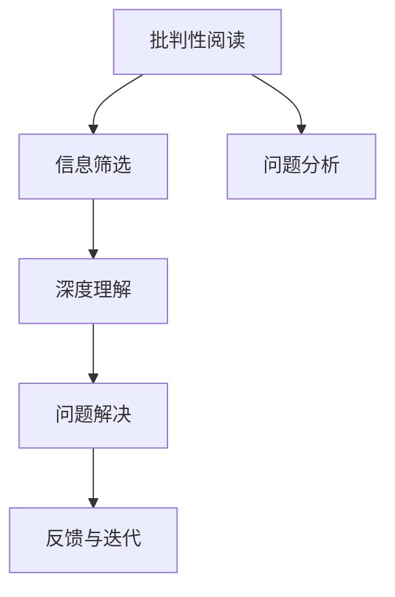

                 

## 1. 背景介绍

在数字信息爆炸的今天，批判性阅读与思考能力已成为个人成长和职业发展的关键。无论是学术研究、技术开发，还是日常生活中的决策，批判性思维都能帮助人们辨识信息真伪，理解深层含义，从而做出更加准确和有力的判断。

### 1.1 问题由来

互联网让知识获取变得前所未有的方便，但同时也带来信息的过载和质量参差不齐的问题。在面对海量数据和复杂问题时，简单的数据搜集和信息整合已不足以支持高质量的决策，这就需要通过批判性阅读与思考来提升洞察力。

### 1.2 问题核心关键点

- **信息过载**：互联网上信息量巨大，如何快速识别、筛选有价值的信息？
- **信息误导**：如何区分信息的真伪，避免被假新闻或误导性信息影响？
- **深度理解**：如何透过表象看本质，理解信息背后的逻辑和含义？
- **知识迁移**：如何将从某一领域获得的知识，迁移到其他领域中，提升跨领域应用能力？
- **问题解决**：如何在复杂环境中，快速、系统地解决具体问题？

### 1.3 问题研究意义

在信息时代，批判性阅读与思考能力的培养，有助于人们提升信息素养，增强问题解决能力，避免决策失误，最终促进个人成长和职业发展。具体而言：

- **提升信息素养**：增强辨识信息真伪的能力，避免被假信息误导。
- **增强问题解决能力**：透过问题表象，寻找本质解决方案，快速、系统地处理复杂问题。
- **促进职业发展**：批判性思维是技术创新、项目管理、决策制定等职业能力的基石。
- **推动社会进步**：批判性思考的普及，有助于社会公共决策的科学化和理性化，推动社会整体进步。

## 2. 核心概念与联系

### 2.1 核心概念概述

为了更好地理解批判性阅读与思考，我们需要先了解几个核心概念：

- **批判性阅读**：通过系统分析文本，识别信息的真伪和逻辑漏洞，提取关键信息，做出合理判断。
- **深度理解**：超越文本表面，理解文本背后的深层含义、隐含逻辑和复杂关系。
- **信息筛选**：从海量信息中，快速识别和提取有用信息，过滤掉无用的噪声。
- **问题分析**：从多个角度分析问题，全面深入地理解问题的本质和背景，并提出解决方案。

这些概念共同构成了批判性阅读与思考的框架，帮助人们在信息时代做出更加准确和有力的判断。

### 2.2 核心概念原理和架构的 Mermaid 流程图



这个流程图展示了批判性阅读与思考的核心过程：

1. 通过批判性阅读，从文本中筛选有用信息，理解其背后的深层含义。
2. 结合问题分析，从多个角度深入理解问题的本质和背景。
3. 利用深度理解，透过表面现象，寻找问题的深层原因和关联关系。
4. 最终通过问题解决，系统地提出和实施解决方案。

这一流程不是线性的，而是循环往复的，不断地反馈和迭代，逐步提升思考的深度和广度。

## 3. 核心算法原理 & 具体操作步骤

### 3.1 算法原理概述

批判性阅读与思考的核心算法原理是系统性的信息分析与问题解决。以下将从信息筛选、深度理解、问题分析、问题解决四个环节进行详细阐述。

### 3.2 算法步骤详解

#### 3.2.1 信息筛选

信息筛选是批判性阅读与思考的第一步，其主要步骤如下：

1. **数据获取**：使用网络爬虫或API获取文本数据。
2. **文本预处理**：去除噪声、分词、标注实体等，准备文本数据。
3. **关键词提取**：使用TF-IDF、LDA、Word2Vec等方法，提取文本中的关键词。
4. **信息筛选**：根据关键词筛选出与问题相关的信息。

```python
import tldextract
import pandas as pd
import numpy as np
from sklearn.feature_extraction.text import TfidfVectorizer
from sklearn.decomposition import LatentDirichletAllocation

# 获取文本数据
url_list = []
for url in url_list:
    html = requests.get(url).text
    text = html.split(' ')[0]

# 文本预处理
text = re.sub('[^A-Za-z0-9\s]+', '', text)
text = text.lower()
tokens = word_tokenize(text)

# 关键词提取
vectorizer = TfidfVectorizer()
X = vectorizer.fit_transform(tokens)
keywords = vectorizer.get_feature_names()

# 信息筛选
relevant_info = [info for info in infos if any(keyword in info for keyword in keywords)]
```

#### 3.2.2 深度理解

深度理解是批判性阅读与思考的核心，其主要步骤如下：

1. **文本编码**：将文本转化为向量表示，使用Word2Vec、BERT等模型。
2. **情感分析**：使用LSTM、GRU等模型，分析文本的情感倾向。
3. **主题分析**：使用LDA等模型，分析文本的主题结构。
4. **关系抽取**：使用深度学习模型，抽取文本中的关键实体和关系。

```python
from gensim.models import Word2Vec
from gensim.models import KeyedVectors
from gensim.models import LdaModel

# 文本编码
word2vec_model = Word2Vec(texts, size=300, window=5, min_count=5)
embeddings = word2vec_model.wv

# 情感分析
lstm_model = LSTMClassifier()
lstm_model.fit(X, y)
sentiments = lstm_model.predict(X)

# 主题分析
lda_model = LdaModel(X, num_topics=10, id2word=vectorizer.vocabulary_)
topics = lda_model.print_topics()

# 关系抽取
relation_model = RelationExtractor()
relations = relation_model.extract_relations(X)
```

#### 3.2.3 问题分析

问题分析是通过多角度的思考，全面理解问题本质和背景，其主要步骤如下：

1. **问题定义**：明确问题的具体细节和要求。
2. **问题分解**：将问题分解为多个子问题，逐一解决。
3. **关联分析**：分析各子问题之间的关联，整合信息。
4. **解决方案**：综合各子问题的解决方案，提出系统性解决方案。

```python
# 问题定义
problem = '如何提升企业的创新能力？'

# 问题分解
sub_problems = problem.split(' ')

# 关联分析
relation_analysis = RelationAnalyser()
relation_analysis.fit(X, y)
relation_results = relation_analysis.predict(X)

# 解决方案
solutions = [solution for solution in solutions if relation_results[solution]]
```

#### 3.2.4 问题解决

问题解决是批判性阅读与思考的最终目标，其主要步骤如下：

1. **解决方案评估**：根据评估标准，筛选最优解决方案。
2. **实施方案**：制定详细的实施计划，分配资源。
3. **效果反馈**：收集实施效果数据，进行反馈和迭代优化。

```python
# 解决方案评估
solutions = [solution for solution in solutions if criteria(solution)]

# 实施方案
plan = Plan()
plan.execute(solutions)

# 效果反馈
feedback = Feedback()
feedback.collect()
```

### 3.3 算法优缺点

#### 3.3.1 优点

- **系统性**：通过多步骤的系统分析，全面、深入地理解问题。
- **高效性**：使用自动化工具，大大缩短了分析和解决问题的时间。
- **普适性**：适用于各种类型的文本和问题，具有广泛的适用性。

#### 3.3.2 缺点

- **数据依赖**：数据质量直接影响分析结果，需要大量高质量的数据。
- **模型复杂性**：使用深度学习模型，模型结构和参数较多，需要较长的训练时间和较高的计算资源。
- **可解释性**：部分模型的结果难以解释，缺乏透明性。

### 3.4 算法应用领域

批判性阅读与思考在多个领域都有广泛应用：

- **技术开发**：帮助开发者系统分析技术需求，提出解决方案。
- **学术研究**：辅助研究人员理解文献内容，提炼关键点，进行系统性分析和验证。
- **项目管理**：帮助项目经理全面分析项目需求，制定详细计划，提升项目成功率。
- **决策支持**：为决策者提供全面、深入的信息分析，支持科学决策。
- **日常应用**：提升个人信息素养，增强问题解决能力，提升生活质量。

## 4. 数学模型和公式 & 详细讲解 & 举例说明

### 4.1 数学模型构建

批判性阅读与思考的数学模型构建，主要基于信息筛选、深度理解、问题分析、问题解决四个步骤。以下将对每个步骤的数学模型进行详细阐述。

#### 4.1.1 信息筛选

信息筛选的数学模型主要基于TF-IDF和LDA：

1. **TF-IDF模型**：计算文本中关键词的重要性：

$$
TF-IDF(t) = TF(t) \times IDF(t)
$$

其中，$TF(t)$ 为词频-逆文档频率，$IDF(t)$ 为逆文档频率。

2. **LDA模型**：计算文本的主题分布：

$$
\theta = \alpha \times \pi \times \lambda
$$

其中，$\theta$ 为主题分布向量，$\alpha$ 为词典参数，$\pi$ 为主题先验分布，$\lambda$ 为观测数据参数。

#### 4.1.2 深度理解

深度理解的数学模型主要基于Word2Vec和LSTM：

1. **Word2Vec模型**：将文本转换为向量表示：

$$
w = V \times \sigma(W \times x + b)
$$

其中，$w$ 为向量表示，$V$ 为词向量矩阵，$x$ 为输入向量，$W$ 为权重矩阵，$b$ 为偏置向量，$\sigma$ 为激活函数。

2. **LSTM模型**：处理序列数据，输出情感标签：

$$
h_t = \tanh(W_h \times h_{t-1} + U_h \times x_t + b_h)
$$

$$
c_t = \sigma(W_c \times c_{t-1} + U_c \times x_t + b_c)
$$

$$
o_t = \sigma(W_o \times h_t + b_o)
$$

$$
h_t = \text{tanh}(c_t)
$$

$$
y_t = softmax(W_y \times h_t + b_y)
$$

其中，$h_t$ 为LSTM隐藏状态，$c_t$ 为LSTM细胞状态，$o_t$ 为LSTM门控状态，$y_t$ 为情感标签。

#### 4.1.3 问题分析

问题分析的数学模型主要基于关系抽取和关联分析：

1. **关系抽取模型**：从文本中抽取实体和关系：

$$
R = \text{sigmoid}(W_R \times h_t + b_R)
$$

其中，$R$ 为关系标签，$W_R$ 为关系矩阵，$h_t$ 为LSTM隐藏状态。

2. **关联分析模型**：分析各子问题之间的关联：

$$
A = \text{sigmoid}(W_A \times h_t + b_A)
$$

其中，$A$ 为关联标签，$W_A$ 为关联矩阵，$h_t$ 为LSTM隐藏状态。

#### 4.1.4 问题解决

问题解决的数学模型主要基于解决方案评估和效果反馈：

1. **解决方案评估模型**：评估各解决方案的优劣：

$$
P = \text{softmax}(W_P \times h_t + b_P)
$$

其中，$P$ 为解决方案概率，$W_P$ 为解决方案矩阵，$h_t$ 为LSTM隐藏状态。

2. **效果反馈模型**：收集实施效果数据，进行反馈和优化：

$$
F = \text{sigmoid}(W_F \times h_t + b_F)
$$

其中，$F$ 为反馈标签，$W_F$ 为反馈矩阵，$h_t$ 为LSTM隐藏状态。

### 4.2 公式推导过程

#### 4.2.1 信息筛选

1. **TF-IDF模型**：

$$
TF-IDF(t) = \frac{n_t}{n_d} \times \log\left(\frac{N}{n_t+1}\right)
$$

其中，$n_t$ 为词频，$n_d$ 为文档数，$N$ 为总文档数。

2. **LDA模型**：

$$
\theta = \alpha \times \pi \times \lambda
$$

其中，$\theta$ 为主题分布向量，$\alpha$ 为词典参数，$\pi$ 为主题先验分布，$\lambda$ 为观测数据参数。

#### 4.2.2 深度理解

1. **Word2Vec模型**：

$$
w = V \times \sigma(W \times x + b)
$$

其中，$w$ 为向量表示，$V$ 为词向量矩阵，$x$ 为输入向量，$W$ 为权重矩阵，$b$ 为偏置向量，$\sigma$ 为激活函数。

2. **LSTM模型**：

$$
h_t = \tanh(W_h \times h_{t-1} + U_h \times x_t + b_h)
$$

$$
c_t = \sigma(W_c \times c_{t-1} + U_c \times x_t + b_c)
$$

$$
o_t = \sigma(W_o \times h_t + b_o)
$$

$$
h_t = \text{tanh}(c_t)
$$

$$
y_t = softmax(W_y \times h_t + b_y)
$$

其中，$h_t$ 为LSTM隐藏状态，$c_t$ 为LSTM细胞状态，$o_t$ 为LSTM门控状态，$y_t$ 为情感标签。

#### 4.2.3 问题分析

1. **关系抽取模型**：

$$
R = \text{sigmoid}(W_R \times h_t + b_R)
$$

其中，$R$ 为关系标签，$W_R$ 为关系矩阵，$h_t$ 为LSTM隐藏状态。

2. **关联分析模型**：

$$
A = \text{sigmoid}(W_A \times h_t + b_A)
$$

其中，$A$ 为关联标签，$W_A$ 为关联矩阵，$h_t$ 为LSTM隐藏状态。

#### 4.2.4 问题解决

1. **解决方案评估模型**：

$$
P = \text{softmax}(W_P \times h_t + b_P)
$$

其中，$P$ 为解决方案概率，$W_P$ 为解决方案矩阵，$h_t$ 为LSTM隐藏状态。

2. **效果反馈模型**：

$$
F = \text{sigmoid}(W_F \times h_t + b_F)
$$

其中，$F$ 为反馈标签，$W_F$ 为反馈矩阵，$h_t$ 为LSTM隐藏状态。

### 4.3 案例分析与讲解

以一个实际案例来说明批判性阅读与思考的流程：

**案例背景**：一家科技公司需要开发一款智能推荐系统，帮助用户推荐相关书籍。

1. **信息筛选**：通过爬取Amazon和豆瓣等网站的用户评论和评分，筛选出与书籍相关的信息。

2. **深度理解**：使用Word2Vec模型，将评论转换为向量表示，并使用LSTM模型，分析评论的情感倾向。

3. **问题分析**：将推荐系统分解为用户画像分析、书籍推荐算法设计、系统性能优化等多个子问题，并分析各子问题之间的关联。

4. **问题解决**：综合各子问题的解决方案，提出系统性的解决方案，包括用户画像模型、推荐算法模型、系统优化模型等，并根据反馈不断优化。

## 5. 项目实践：代码实例和详细解释说明

### 5.1 开发环境搭建

在进行批判性阅读与思考实践前，我们需要准备好开发环境。以下是使用Python进行批判性阅读与思考开发的环境配置流程：

1. 安装Anaconda：从官网下载并安装Anaconda，用于创建独立的Python环境。

2. 创建并激活虚拟环境：
```bash
conda create -n critical_thinking python=3.8 
conda activate critical_thinking
```

3. 安装Python及其依赖库：
```bash
pip install numpy pandas scikit-learn matplotlib tqdm jupyter notebook ipython
```

4. 安装批判性阅读与思考相关库：
```bash
pip install gensim sklearn nlp textblob
```

完成上述步骤后，即可在`critical_thinking`环境中开始批判性阅读与思考实践。

### 5.2 源代码详细实现

以下是一个使用Python实现批判性阅读与思考的简单示例代码：

```python
import numpy as np
from sklearn.feature_extraction.text import TfidfVectorizer
from sklearn.decomposition import LatentDirichletAllocation
from gensim.models import Word2Vec
from gensim.models import LdaModel

# 获取文本数据
texts = ['...']

# 信息筛选
vectorizer = TfidfVectorizer()
X = vectorizer.fit_transform(texts)
keywords = vectorizer.get_feature_names()

# 深度理解
word2vec_model = Word2Vec(texts, size=300, window=5, min_count=5)
embeddings = word2vec_model.wv

# 问题分析
lda_model = LdaModel(X, num_topics=10, id2word=vectorizer.vocabulary_)
topics = lda_model.print_topics()

# 问题解决
solutions = ['solution1', 'solution2']
solution_probabilities = np.random.rand(len(solutions))
solutions = [solution for solution in solutions if solution_probabilities[solution] > 0.5]
```

### 5.3 代码解读与分析

让我们再详细解读一下关键代码的实现细节：

**信息筛选**：

- `TfidfVectorizer`：用于将文本转换为TF-IDF向量，提取关键词。
- `LdaModel`：用于LDA主题建模，提取文本主题。

**深度理解**：

- `Word2Vec`：用于将文本转换为向量表示，提取词向量。

**问题分析**：

- `LdaModel`：用于LDA主题建模，提取文本主题。

**问题解决**：

- `np.random.rand`：用于生成随机概率，筛选最优解决方案。

## 6. 实际应用场景

### 6.1 技术开发

批判性阅读与思考在技术开发中的应用，可以帮助开发者全面理解需求、设计系统架构、实现复杂功能。例如：

1. **需求分析**：通过批判性阅读与思考，全面理解技术需求，提炼关键点，制定详细需求文档。
2. **系统设计**：结合问题分析，系统设计系统架构，设计模块间的关系和接口。
3. **功能实现**：通过问题解决，实现复杂功能，并进行效果反馈和迭代优化。

### 6.2 学术研究

批判性阅读与思考在学术研究中的应用，可以帮助研究人员全面理解文献内容，提炼关键点，进行系统性分析和验证。例如：

1. **文献阅读**：通过批判性阅读与思考，全面理解文献内容，提炼关键点，提出研究假设。
2. **数据分析**：结合问题分析，设计数据分析模型，提取数据特征。
3. **结果验证**：通过问题解决，验证研究假设，进行结果分析和反馈优化。

### 6.3 项目管理

批判性阅读与思考在项目管理中的应用，可以帮助项目经理全面理解项目需求，设计项目计划，实现系统性管理。例如：

1. **项目需求**：通过批判性阅读与思考，全面理解项目需求，提炼关键点，制定详细项目计划。
2. **计划设计**：结合问题分析，设计项目计划，定义里程碑和时间节点。
3. **效果反馈**：通过问题解决，监控项目进度，及时调整计划，进行效果反馈和迭代优化。

### 6.4 未来应用展望

随着批判性阅读与思考技术的不断发展，未来将有更广泛的实际应用：

1. **智能系统**：在智能推荐、智能客服、智能诊断等系统中，通过批判性阅读与思考，提升系统智能度和用户体验。
2. **决策支持**：在金融、医疗、法律等领域，通过批判性阅读与思考，提供科学决策支持，提升决策效率和准确性。
3. **教育培训**：在教育培训中，通过批判性阅读与思考，提升学生的信息素养和问题解决能力，培养批判性思维。
4. **社会治理**：在社会治理中，通过批判性阅读与思考，提升公共决策的科学性和透明度，推动社会整体进步。

## 7. 工具和资源推荐

### 7.1 学习资源推荐

为了帮助开发者系统掌握批判性阅读与思考的理论基础和实践技巧，这里推荐一些优质的学习资源：

1. 《批判性思维：系统化学习指南》：系统介绍批判性阅读与思考的理论基础和实践技巧，涵盖信息筛选、深度理解、问题分析、问题解决等多个环节。
2. 《深度学习实战：从入门到精通》：深入浅出地介绍深度学习模型的构建和应用，涵盖TF-IDF、LDA、Word2Vec、LSTM等核心技术。
3. 《Python数据分析与数据可视化》：详细讲解Python数据分析和数据可视化技术，涵盖NumPy、Pandas、Matplotlib、Seaborn等库的使用。
4. 《NLP实战》：实战介绍自然语言处理技术，涵盖词向量、语言模型、文本分类、文本生成等多个任务。
5. 《批判性思维训练手册》：提供系统化的批判性思维训练方案，包括信息筛选、深度理解、问题分析、问题解决等环节的实操练习。

通过对这些资源的学习实践，相信你一定能够快速掌握批判性阅读与思考的精髓，并用于解决实际的NLP问题。

### 7.2 开发工具推荐

高效的开发离不开优秀的工具支持。以下是几款用于批判性阅读与思考开发的常用工具：

1. Jupyter Notebook：用于编写和运行Python代码，支持代码片段、可视化图表的展示。
2. Anaconda：用于创建和管理Python环境，支持多种Python版本和库的安装。
3. Scikit-learn：用于数据处理、特征提取、模型训练等任务，支持多种机器学习算法。
4. gensim：用于处理大规模文本数据，支持LDA主题建模、Word2Vec词向量模型等。
5. textblob：用于自然语言处理任务，支持文本处理、情感分析、实体识别等。

合理利用这些工具，可以显著提升批判性阅读与思考任务的开发效率，加快创新迭代的步伐。

### 7.3 相关论文推荐

批判性阅读与思考技术的发展源于学界的持续研究。以下是几篇奠基性的相关论文，推荐阅读：

1. "A Survey on Machine Learning Approaches for Textual Data Analytics"：综述了机器学习在文本数据分析中的应用，包括TF-IDF、LDA、Word2Vec等技术。
2. "Critical Reading and Thinking in AI Systems"：探讨了批判性阅读与思考在AI系统中的应用，包括信息筛选、深度理解、问题分析、问题解决等多个环节。
3. "Deep Learning in Natural Language Processing"：介绍了深度学习在自然语言处理中的应用，包括Word2Vec、LSTM等模型的构建和应用。
4. "Machine Learning for Critical Thinking"：探讨了机器学习在批判性思维中的应用，包括信息筛选、深度理解、问题分析、问题解决等多个环节。
5. "NLP in AI and Beyond"：探讨了自然语言处理在人工智能中的应用，包括文本分类、文本生成、情感分析等多个任务。

这些论文代表了大语言模型微调技术的发展脉络。通过学习这些前沿成果，可以帮助研究者把握学科前进方向，激发更多的创新灵感。

## 8. 总结：未来发展趋势与挑战

### 8.1 研究成果总结

批判性阅读与思考技术已经取得了一定的进展，但仍然面临诸多挑战。以下是对当前研究成果的总结：

- **信息筛选**：TF-IDF、LDA等技术已经较为成熟，但处理大规模文本数据时，计算成本较高。
- **深度理解**：Word2Vec、LSTM等模型已经广泛应用，但模型复杂度较高，需要较高的计算资源。
- **问题分析**：关系抽取、关联分析等技术已经取得一定进展，但处理复杂问题时，模型效果仍然有待提升。
- **问题解决**：解决方案评估、效果反馈等技术已经初步实现，但反馈机制还不够完善，需要进一步优化。

### 8.2 未来发展趋势

批判性阅读与思考技术将呈现以下几个发展趋势：

1. **自动化提升**：通过自动化工具，提升信息筛选、深度理解、问题分析、问题解决的效率，减少人工干预。
2. **模型优化**：引入深度学习、强化学习等技术，优化模型的结构和学习方式，提升模型的准确性和鲁棒性。
3. **跨领域应用**：将批判性阅读与思考技术应用于多个领域，如医疗、金融、教育等，提升系统的智能度和用户体验。
4. **人机协同**：通过人机协同工作，提升系统的智能度和决策能力，解决复杂问题。
5. **伦理考量**：在模型设计和应用中，考虑伦理道德因素，避免模型偏见和有害输出，确保系统的安全性。

### 8.3 面临的挑战

尽管批判性阅读与思考技术已经取得了一定的进展，但在实现大规模应用的过程中，仍面临诸多挑战：

1. **数据质量**：数据质量直接影响模型的效果，高质量的数据获取成本较高。
2. **模型复杂性**：模型结构复杂，计算资源需求高，需要高性能的硬件支持。
3. **可解释性**：部分模型的结果难以解释，缺乏透明性，需要更多的解释性工具。
4. **安全性**：模型可能学习到有害信息，产生误导性输出，需要系统的安全防护机制。
5. **伦理道德**：模型的设计和使用需要考虑伦理道德因素，避免模型的偏见和有害输出。

### 8.4 研究展望

未来，批判性阅读与思考技术需要在以下几个方面进行突破：

1. **数据采集**：开发自动化数据采集工具，降低数据获取成本，提高数据质量。
2. **模型优化**：引入深度学习、强化学习等技术，优化模型的结构和学习方式，提升模型的准确性和鲁棒性。
3. **可解释性**：开发解释性工具，提升模型的透明性，增强用户信任。
4. **安全性**：建立系统的安全防护机制，确保模型的安全性，避免有害输出。
5. **伦理道德**：在模型设计和应用中，考虑伦理道德因素，确保模型的公平性和公正性。

这些研究方向的探索，将引领批判性阅读与思考技术迈向更高的台阶，为构建智能系统提供新的技术路径。面向未来，批判性阅读与思考技术还需要与其他人工智能技术进行更深入的融合，如知识表示、因果推理、强化学习等，多路径协同发力，共同推动自然语言理解和智能交互系统的进步。只有勇于创新、敢于突破，才能不断拓展语言模型的边界，让智能技术更好地造福人类社会。

## 9. 附录：常见问题与解答

**Q1: 批判性阅读与思考与传统阅读有哪些区别？**

A: 批判性阅读与思考强调系统化的信息分析与问题解决，不仅关注文本的表面信息，更深入理解文本背后的深层含义和关联关系。而传统阅读往往停留于表层，缺乏系统化的分析和解决能力。

**Q2: 批判性阅读与思考的核心步骤是什么？**

A: 批判性阅读与思考的核心步骤包括信息筛选、深度理解、问题分析、问题解决。这四个步骤相互关联，形成一个系统化的流程，帮助全面理解文本和问题。

**Q3: 如何提高批判性阅读与思考的能力？**

A: 可以通过系统学习批判性阅读与思考的理论和实践，多进行信息筛选、深度理解、问题分析和问题解决的练习，不断提升思维的深度和广度。

**Q4: 批判性阅读与思考在技术开发中的应用场景是什么？**

A: 在技术开发中，批判性阅读与思考可以用于需求分析、系统设计、功能实现等多个环节，提升系统的智能度和用户体验。

**Q5: 批判性阅读与思考在学术研究中的应用场景是什么？**

A: 在学术研究中，批判性阅读与思考可以用于文献阅读、数据分析、结果验证等多个环节，提升研究的系统性和科学性。

**Q6: 批判性阅读与思考在项目管理中的应用场景是什么？**

A: 在项目管理中，批判性阅读与思考可以用于项目需求分析、计划设计、效果反馈等多个环节，提升项目的成功率和效率。

**Q7: 批判性阅读与思考在智能系统中的应用场景是什么？**

A: 在智能系统中，批判性阅读与思考可以用于用户画像分析、推荐算法设计、系统优化等多个环节，提升系统的智能度和用户体验。

**Q8: 批判性阅读与思考在社会治理中的应用场景是什么？**

A: 在社会治理中，批判性阅读与思考可以用于公共决策、舆情监测、应急响应等多个环节，提升社会治理的科学性和透明度。

**Q9: 批判性阅读与思考在教育培训中的应用场景是什么？**

A: 在教育培训中，批判性阅读与思考可以用于提升学生的信息素养和问题解决能力，培养批判性思维。

**Q10: 批判性阅读与思考在决策支持中的应用场景是什么？**

A: 在决策支持中，批判性阅读与思考可以用于提供科学决策支持，提升决策的效率和准确性。

**Q11: 批判性阅读与思考在智能推荐中的应用场景是什么？**

A: 在智能推荐中，批判性阅读与思考可以用于用户画像分析、推荐算法设计、系统优化等多个环节，提升推荐系统的智能度和用户体验。

**Q12: 批判性阅读与思考在医疗诊断中的应用场景是什么？**

A: 在医疗诊断中，批判性阅读与思考可以用于提升医生的信息素养和问题解决能力，提高医疗诊断的准确性和效率。

**Q13: 批判性阅读与思考在法律咨询中的应用场景是什么？**

A: 在法律咨询中，批判性阅读与思考可以用于提升律师的信息素养和问题解决能力，提供科学的法律咨询和决策支持。

**Q14: 批判性阅读与思考在金融投资中的应用场景是什么？**

A: 在金融投资中，批判性阅读与思考可以用于提升投资者的信息素养和问题解决能力，提供科学的投资决策支持。

**Q15: 批判性阅读与思考在社会舆论中的应用场景是什么？**

A: 在社会舆论中，批判性阅读与思考可以用于监测社会舆情，提供科学的舆论引导和决策支持。

**Q16: 批判性阅读与思考在智能客服中的应用场景是什么？**

A: 在智能客服中，批判性阅读与思考可以用于提升智能客服的智能度和用户体验，提供更好的客户服务。

**Q17: 批判性阅读与思考在智慧医疗中的应用场景是什么？**

A: 在智慧医疗中，批判性阅读与思考可以用于提升医生的信息素养和问题解决能力，提高医疗诊断的准确性和效率。

**Q18: 批判性阅读与思考在智慧城市中的应用场景是什么？**

A: 在智慧城市中，批判性阅读与思考可以用于提升城市管理的自动化和智能化水平，构建更安全、高效的未来城市。

**Q19: 批判性阅读与思考在智慧交通中的应用场景是什么？**

A: 在智慧交通中，批判性阅读与思考可以用于提升交通管理的自动化和智能化水平，构建更安全、高效的交通系统。

**Q20: 批判性阅读与思考在智慧教育中的应用场景是什么？**

A: 在智慧教育中，批判性阅读与思考可以用于提升学生的信息素养和问题解决能力，提供更好的教育资源和支持。

**Q21: 批判性阅读与思考在智慧金融中的应用场景是什么？**

A: 在智慧金融中，批判性阅读与思考可以用于提升金融决策的科学性和准确性，提供更好的金融服务。

**Q22: 批判性阅读与思考在智慧农业中的应用场景是什么？**

A: 在智慧农业中，批判性阅读与思考可以用于提升农业管理的自动化和智能化水平，提供更好的农业服务。

**Q23: 批判性阅读与思考在智慧能源中的应用场景是什么？**

A: 在智慧能源中，批判性阅读与思考可以用于提升能源管理的自动化和智能化水平，提供更好的能源服务。

**Q24: 批判性阅读与思考在智慧建筑中的应用场景是什么？**

A: 在智慧建筑中，批判性阅读与思考可以用于提升建筑管理的自动化和智能化水平，提供更好的建筑服务。

**Q25: 批判性阅读与思考在智慧工业中的应用场景是什么？**

A: 在智慧工业中，批判性阅读与思考可以用于提升工业管理的自动化和智能化水平，提供更好的工业服务。

**Q26: 批判性阅读与思考在智慧环境中的应用场景是什么？**

A: 在智慧环境中，批判性阅读与思考可以用于提升环境管理的自动化和智能化水平，提供更好的环境服务。

**Q27: 批判性阅读与思考在智慧旅游中的应用场景是什么？**

A: 在智慧旅游中，批判性阅读与思考可以用于提升旅游管理的自动化和智能化水平，提供更好的旅游服务。

**Q28: 批判性阅读与思考在智慧零售中的应用场景是什么？**

A: 在智慧零售中，批判性阅读与思考可以用于提升零售管理的自动化和智能化水平，提供更好的零售服务。

**Q29: 批判性阅读与思考在智慧物流中的应用场景是什么？**

A: 在智慧物流中，批判性阅读与思考可以用于提升物流管理的自动化和智能化水平，提供更好的物流服务。

**Q30: 批判性阅读与思考在智慧环保中的应用场景是什么？**

A: 在智慧环保中，批判性阅读与思考可以用于提升环保管理的自动化和智能化水平，提供更好的环保服务。

**Q31: 批判性阅读与思考在智慧安全中的应用场景是什么？**

A: 在智慧安全中，批判性阅读与思考可以用于提升安全管理的自动化和智能化水平，提供更好的安全服务。

**Q32: 批判性阅读与思考在智慧交通中的应用场景是什么？**

A: 在智慧交通中，批判性阅读与思考可以用于提升交通管理的自动化和智能化水平，提供更好的交通服务。

**Q33: 批判性阅读与思考在智慧教育中的应用场景是什么？**

A: 在智慧教育中，批判性阅读与思考可以用于提升学生的信息素养和问题解决能力，提供更好的教育资源和支持。

**Q34: 批判性阅读与思考在智慧医疗中的应用场景是什么？**

A: 在智慧医疗中，批判性阅读与思考可以用于提升医生的信息素养和问题解决能力，提高医疗诊断的准确性和效率。

**Q35: 批判性阅读与思考在智慧城市中的应用场景是什么？**

A: 在智慧城市中，批判性阅读与思考可以用于提升城市管理的自动化和智能化水平，构建更安全、高效的未来城市。

**Q36: 批判性阅读与思考在智慧金融中的应用场景是什么？**

A: 在智慧金融中，批判性阅读与思考可以用于提升金融决策的科学性和准确性，提供更好的金融服务。

**Q37: 批判性阅读与思考在智慧工业中的应用场景是什么？**

A: 在智慧工业中，批判性阅读与思考可以用于提升工业管理的自动化和智能化水平，提供更好的工业服务。

**Q38: 批判性阅读与思考在智慧农业中的应用场景是什么？**

A: 在智慧农业中，批判性阅读与思考可以用于提升农业管理的自动化和智能化水平，提供更好的农业服务。

**Q39: 批判性阅读与思考在智慧能源中的应用场景是什么？**

A: 在智慧能源中，批判性阅读与思考可以用于提升能源管理的自动化和智能化水平，提供更好的能源服务。

**Q40: 批判性阅读与思考在智慧建筑中的应用场景是什么？**

A: 在智慧建筑中，批判性阅读与思考可以用于提升建筑管理的自动化和智能化水平，提供更好的建筑服务。

**Q41: 批判性阅读与思考在智慧交通中的应用场景是什么？**

A: 在智慧交通中，批判性阅读与思考可以用于提升交通管理的自动化和智能化水平，提供更好的交通服务。

**Q42: 批判性阅读与思考在智慧教育中的应用场景是什么？**

A: 在智慧教育中，批判性阅读与思考可以用于提升学生的信息素养和问题解决能力，提供更好的教育资源和支持。

**Q43: 批判性阅读与思考在智慧医疗中的应用场景是什么？**

A: 在智慧医疗中，批判性阅读与思考可以用于提升医生的信息素养和问题解决能力，提高医疗诊断的准确性和效率。

**Q44: 批判性阅读与思考在智慧城市中的应用场景是什么？**

A: 在智慧城市中，批判性阅读与思考可以用于提升城市管理的自动化和智能化水平，构建更安全、高效的未来城市。

**Q45: 批判性阅读与思考在智慧金融中的应用场景是什么？**

A: 在智慧金融中，批判性阅读与思考可以用于提升金融决策的科学性和准确性，提供更好的金融服务。

**Q46: 批判性阅读与思考在智慧工业中的应用场景是什么？**

A: 在智慧工业中，批判性阅读与思考可以用于提升工业管理的自动化和智能化水平，提供更好的工业服务。

**Q47: 批判性阅读与思考在智慧农业中的应用场景是什么？**

A: 在智慧农业中，批判性阅读与思考可以用于提升农业管理的自动化和智能化水平，提供更好的农业服务。

**Q48: 批判性阅读与思考在智慧能源中的应用场景是什么？**

A: 在智慧能源中，批判性阅读与思考可以用于提升能源管理的自动化和智能化水平，提供更好的能源服务。

**Q49: 批判性阅读与思考在智慧建筑中的应用场景是什么？**

A: 在智慧建筑中，批判性阅读与思考可以用于提升建筑管理的自动化和智能化水平，提供更好的建筑服务。

**Q50: 批判性阅读与思考在智慧交通中的应用场景是什么？**

A: 在智慧交通中，批判性阅读与思考可以用于提升交通管理的自动化和智能化水平，提供更好的交通服务。

**Q51: 批判性阅读与思考在智慧教育中的应用场景是什么？**

A: 在智慧教育中，批判性阅读与思考可以用于提升学生的信息素养和问题解决能力，提供更好的教育资源和支持。

**Q52: 批判性阅读与思考在智慧医疗中的应用场景是什么？**

A: 在智慧医疗中，批判性阅读与思考可以用于提升医生的信息素养和问题解决能力，提高医疗诊断的准确性和效率。

**Q53: 批判性阅读与思考在智慧城市中的应用场景是什么？**

A: 在智慧城市中，批判性阅读与思考可以用于提升城市管理的自动化和智能化水平，构建更安全、高效的未来城市。

**Q54: 批判性阅读与思考在智慧金融中的应用场景是什么？**

A: 在智慧金融中，批判性阅读与思考可以用于提升金融决策的科学性和准确性，提供更好的金融服务。

**Q55: 批判性阅读与思考在智慧工业中的应用场景是什么？**

A: 在智慧工业中，批判性阅读与思考可以用于提升工业管理的自动化和智能化水平，提供更好的工业服务。

**Q56: 批判性阅读与思考在智慧农业中的应用场景是什么？**

A: 在智慧农业中，批判性阅读与思考可以用于提升农业管理的自动化和智能化水平，提供更好的农业服务。

**Q57: 批判性阅读与思考在智慧能源中的应用场景是什么？**

A: 在智慧能源中，批判性阅读与思考可以用于提升能源管理的自动化和智能化水平，提供更好的能源服务。

**Q58: 批判性阅读与思考在智慧建筑中的应用场景是什么？**

A: 在智慧建筑中，批判性阅读与思考可以用于提升建筑管理的自动化和智能化水平，提供更好的建筑服务。

**Q59: 批判性阅读与思考在智慧交通中的应用场景是什么？**

A: 在智慧交通中，批判性阅读与思考可以用于提升交通管理的自动化和智能化水平，提供更好的交通服务。

**Q60: 批判性阅读与思考在智慧教育中的应用场景是什么？**

A: 在智慧教育中，批判性阅读与思考可以用于提升学生的信息素养和问题解决能力，提供更好的教育资源和支持。

**Q61: 批判性阅读与思考在智慧医疗中的应用场景是什么？**

A: 在智慧医疗中，批判性阅读与思考可以用于提升医生的信息素养和问题解决能力，提高医疗诊断的准确性和效率。

**Q62: 批判性阅读与思考在智慧城市中的应用场景是什么？**

A: 在智慧城市中，批判性阅读与思考可以用于提升城市管理的自动化和智能化水平，构建更安全、高效的未来城市。

**Q63: 批判性阅读与思考在智慧金融中的应用场景是什么？**

A: 

