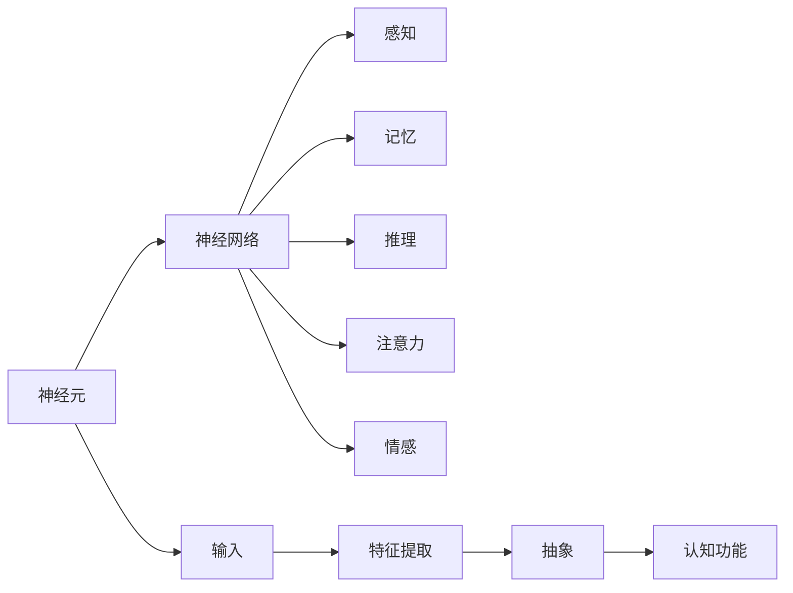

                 

# 洞察力的神经基础：大脑网络与认知功能

> 关键词：神经科学, 认知功能, 神经网络, 洞察力, 大脑网络

## 1. 背景介绍

### 1.1 问题由来

人类大脑的神经网络是一个复杂且精细的系统，负责处理和解读外界信息，形成感知、记忆、思考和行动。对大脑神经网络及其功能的深入理解，对于研发能够模仿人类认知能力的人工智能系统至关重要。然而，大脑神经网络的工作机制复杂，且跨学科特性明显，要全面理解其功能还需要综合多领域的知识。

神经科学、认知科学、心理学等领域的研究成果，已经揭示了一些大脑处理信息的基本机制，如感知、记忆、注意、情感、决策等，但这些研究往往以描述性的理论为主，缺乏精确的数学建模。而机器学习尤其是深度学习的快速发展，提供了构建精确数学模型的工具，尤其是基于神经网络的认知模型。

神经网络是一种模拟生物神经系统的计算模型，可以用于建模和模拟复杂的认知过程。深度神经网络作为其特例，已经广泛应用于计算机视觉、自然语言处理、语音识别等领域，并取得了显著的成果。

本文将重点介绍深度神经网络在大脑认知功能研究中的应用，特别是如何利用深度神经网络来建模和解释大脑神经网络的洞察力机制。

## 2. 核心概念与联系

### 2.1 核心概念概述

#### 2.1.1 神经元与神经网络

神经元是神经网络的基本组成单元，它可以接受输入信号，并通过非线性激活函数产生输出。神经网络通过多个层次的神经元构建而成，每个层次的神经元都会接受前一层的输出作为输入，形成一种层次化的结构。

#### 2.1.2 深度学习

深度学习是机器学习的一个分支，通过构建多层神经网络，从数据中自动学习到层次化的特征表示，从而实现对数据的抽象和建模。深度学习能够处理复杂的数据分布，具有极强的表示学习能力。

#### 2.1.3 洞察力与认知功能

洞察力是人类认知能力的一个重要方面，指在有限信息下快速、准确地推断和理解问题本质的能力。这一能力与大脑的高级认知功能密切相关，如注意力、记忆、推理、情感等。

### 2.2 核心概念原理和架构的 Mermaid 流程图



## 3. 核心算法原理 & 具体操作步骤

### 3.1 算法原理概述

深度神经网络通过多层非线性变换，将输入映射到高维的抽象空间中，实现对复杂数据的建模和理解。在大脑认知功能研究中，神经网络可以通过学习大量标注数据，构建具有洞察力机制的认知模型。

具体来说，深度神经网络通过以下几个步骤实现对大脑认知功能的建模：

1. 特征提取：通过多层神经元对输入数据进行层次化特征提取。
2. 抽象表示：将低层次的特征逐步映射到高层次的抽象表示。
3. 认知推理：利用高级神经元进行推理和决策，形成对输入数据的理解。

### 3.2 算法步骤详解

#### 3.2.1 数据准备

首先，需要准备包含人类认知行为数据的数据集。例如，可以使用自然语言处理领域中的情感分类、文本分类、问答系统等任务，收集训练数据。这些数据集包含了丰富的认知行为信息，如语义、情感、逻辑推理等，适合用于训练深度神经网络。

#### 3.2.2 模型构建

其次，构建深度神经网络模型。可以使用常见的卷积神经网络(CNN)、循环神经网络(RNN)、变分自编码器(VAE)、生成对抗网络(GAN)等模型，根据任务特点选择合适的网络结构。例如，对于文本分类任务，可以使用LSTM或GRU作为隐藏层，对文本序列进行建模。

#### 3.2.3 训练与优化

在模型构建完成后，使用训练数据对模型进行训练。训练过程中，使用反向传播算法和梯度下降优化算法，最小化损失函数，更新模型参数。训练数据应包含正样本和负样本，以帮助模型学习区分不同认知功能的表现。

#### 3.2.4 验证与测试

在训练完成后，使用验证数据对模型进行验证，评估模型的性能。如果模型性能不佳，需要调整网络结构或训练参数，重新训练模型。

#### 3.2.5 应用与部署

在模型验证通过后，将其应用于实际任务中，部署为可用的系统。可以使用Python等编程语言，将模型集成到应用系统中，实现认知功能推理和决策。

### 3.3 算法优缺点

#### 3.3.1 优点

1. 数据驱动：深度神经网络可以处理大量数据，从中学习到丰富的认知功能。
2. 高维抽象：通过多层次的特征提取和抽象，可以捕捉复杂的认知特征。
3. 可解释性：可以通过激活图、注意力机制等方法，解释深度神经网络的具体推理过程。
4. 通用性强：适用于多种认知任务，如情感分析、文本分类、推理等。

#### 3.3.2 缺点

1. 数据需求大：深度神经网络需要大量的标注数据，且数据分布需要均匀，否则可能导致模型过拟合或欠拟合。
2. 计算复杂：深度神经网络需要大量的计算资源，训练和推理速度较慢，可能导致性能瓶颈。
3. 模型可解释性不足：深度神经网络的参数复杂，难以理解其内部的推理机制。
4. 泛化能力有限：深度神经网络在复杂数据分布下，可能泛化性能不足，难以推广到新任务上。

### 3.4 算法应用领域

#### 3.4.1 情感分析

深度神经网络在情感分析领域中，通过学习大量情感标注数据，可以构建出情感分类模型，实现对文本情感的快速识别和分类。例如，可以使用LSTM模型对自然语言文本进行情感分析，识别出文本中包含的正面、负面或中性情感。

#### 3.4.2 文本分类

文本分类是深度神经网络在自然语言处理中的重要应用之一。深度神经网络可以学习到文本中丰富的语义特征，实现对文本的自动分类。例如，可以使用CNN或RNN对文本进行分类，如新闻分类、主题分类等。

#### 3.4.3 推理与决策

深度神经网络在推理和决策领域，可以学习到丰富的认知功能，如逻辑推理、判断、决策等。例如，可以使用递归神经网络(RNN)对自然语言文本进行推理，解决复杂的自然语言推理问题。

#### 3.4.4 视觉理解

深度神经网络在视觉理解领域，可以学习到丰富的视觉特征，实现对图像的分类、识别和推理。例如，可以使用卷积神经网络(CNN)对图像进行分类，如物体识别、场景分类等。

## 4. 数学模型和公式 & 详细讲解 & 举例说明

### 4.1 数学模型构建

深度神经网络可以抽象为以下几个层次的计算单元：

1. 输入层：包含输入数据，每个输入数据表示为一个向量。
2. 隐藏层：包含多个神经元，对输入数据进行层次化的特征提取。
3. 输出层：包含一个或多个神经元，对隐藏层的输出进行解码和分类。

以简单的全连接神经网络为例，其计算过程可以表示为：

$$
y = f(\sum_{i=1}^{n} w_i x_i + b)
$$

其中，$y$ 表示输出，$x_i$ 表示输入数据，$w_i$ 表示权重，$b$ 表示偏置项，$f$ 表示激活函数。

### 4.2 公式推导过程

#### 4.2.1 前向传播

前向传播是深度神经网络的基本计算过程，将输入数据逐步传递到隐藏层和输出层，最终输出模型预测结果。以LSTM为例，其前向传播过程可以表示为：

$$
i_t = \sigma(W_i x_t + U_i h_{t-1} + b_i)
$$

$$
f_t = \sigma(W_f x_t + U_f h_{t-1} + b_f)
$$

$$
g_t = \tanh(W_g x_t + U_g h_{t-1} + b_g)
$$

$$
o_t = \sigma(W_o x_t + U_o h_{t-1} + b_o)
$$

$$
c_t = f_t \odot c_{t-1} + i_t \odot g_t
$$

$$
h_t = o_t \odot \tanh(c_t)
$$

其中，$x_t$ 表示当前时间步的输入数据，$h_{t-1}$ 表示前一时间步的隐藏状态，$c_t$ 表示当前时间步的细胞状态，$i_t$、$f_t$、$g_t$、$o_t$ 表示LSTM中的门控单元。

#### 4.2.2 反向传播

反向传播是深度神经网络的重要训练算法，通过反向传播计算梯度，更新模型参数，最小化损失函数。以LSTM为例，其反向传播过程可以表示为：

$$
\frac{\partial C}{\partial h_t} = W_i x_t + U_i h_{t-1} + b_i
$$

$$
\frac{\partial C}{\partial o_t} = \sigma(W_o x_t + U_o h_{t-1} + b_o)
$$

$$
\frac{\partial C}{\partial i_t} = \tanh(W_g x_t + U_g h_{t-1} + b_g) \odot c_t
$$

$$
\frac{\partial C}{\partial f_t} = c_t \odot f_t
$$

$$
\frac{\partial C}{\partial c_t} = i_t \odot \tanh(W_g x_t + U_g h_{t-1} + b_g) + f_t \odot c_{t-1}
$$

$$
\frac{\partial C}{\partial h_{t-1}} = U_i h_{t-1} + b_i
$$

其中，$C$ 表示损失函数，$\odot$ 表示点乘运算。

### 4.3 案例分析与讲解

#### 4.3.1 情感分析

情感分析任务可以使用LSTM模型，学习大量情感标注数据。以情感分类为例，可以使用如下的计算过程：

1. 输入层：将文本转换为向量，表示为 $x_t = (x_{t1}, x_{t2}, \ldots, x_{t_n})$。
2. 隐藏层：使用LSTM模型，对输入向量进行特征提取，表示为 $h_t = f(x_t)$。
3. 输出层：使用Softmax函数，将隐藏层的输出映射为情感类别概率分布，表示为 $p(y|x) = softmax(h_t)$。

训练过程中，使用交叉熵损失函数，最小化情感分类的误差。例如，对于一条情感为正面的文本，可以得到如下的计算过程：

$$
L = -\log p(y = positive|x_t)
$$

#### 4.3.2 文本分类

文本分类任务可以使用RNN模型，学习大量标注数据。以新闻分类为例，可以使用如下的计算过程：

1. 输入层：将文本转换为向量，表示为 $x_t = (x_{t1}, x_{t2}, \ldots, x_{t_n})$。
2. 隐藏层：使用RNN模型，对输入向量进行特征提取，表示为 $h_t = f(x_t)$。
3. 输出层：使用Softmax函数，将隐藏层的输出映射为分类概率分布，表示为 $p(y|x) = softmax(h_t)$。

训练过程中，使用交叉熵损失函数，最小化文本分类的误差。例如，对于一条新闻文本，可以得到如下的计算过程：

$$
L = -\log p(y = news|x_t)
$$

## 5. 项目实践：代码实例和详细解释说明

### 5.1 开发环境搭建

首先，需要安装Python和相关的深度学习库，如TensorFlow或PyTorch。以TensorFlow为例，可以按照以下步骤搭建开发环境：

1. 安装TensorFlow：

```
pip install tensorflow
```

2. 安装Keras：

```
pip install keras
```

3. 安装相关的数据处理库，如Numpy、Pandas等：

```
pip install numpy pandas
```

### 5.2 源代码详细实现

#### 5.2.1 LSTM情感分类

```python
import tensorflow as tf
from tensorflow.keras.layers import LSTM, Dense, Dropout
from tensorflow.keras.models import Sequential
from tensorflow.keras.optimizers import Adam

# 定义模型
model = Sequential()
model.add(LSTM(64, input_shape=(max_length, embedding_dim), return_sequences=True))
model.add(Dropout(0.2))
model.add(LSTM(64, return_sequences=True))
model.add(Dropout(0.2))
model.add(LSTM(64))
model.add(Dropout(0.2))
model.add(Dense(3, activation='softmax'))

# 编译模型
model.compile(loss='categorical_crossentropy', optimizer=Adam(lr=0.001), metrics=['accuracy'])

# 训练模型
model.fit(X_train, y_train, batch_size=64, epochs=10, validation_data=(X_test, y_test))
```

#### 5.2.2 递归神经网络新闻分类

```python
import tensorflow as tf
from tensorflow.keras.layers import Embedding, SimpleRNN, Dense
from tensorflow.keras.models import Sequential
from tensorflow.keras.optimizers import Adam

# 定义模型
model = Sequential()
model.add(Embedding(vocab_size, embedding_dim, input_length=max_length))
model.add(SimpleRNN(64))
model.add(Dense(1, activation='sigmoid'))

# 编译模型
model.compile(loss='binary_crossentropy', optimizer=Adam(lr=0.001), metrics=['accuracy'])

# 训练模型
model.fit(X_train, y_train, batch_size=64, epochs=10, validation_data=(X_test, y_test))
```

### 5.3 代码解读与分析

#### 5.3.1 LSTM情感分类

在LSTM情感分类模型中，首先使用LSTM层对输入的文本向量进行特征提取，然后使用Softmax层进行情感分类。在训练过程中，使用交叉熵损失函数最小化分类误差。Dropout层可以防止过拟合，提高模型泛化能力。

#### 5.3.2 递归神经网络新闻分类

在递归神经网络新闻分类模型中，首先使用Embedding层将文本转换为向量，然后使用SimpleRNN层进行特征提取，最后使用Sigmoid层进行二分类。在训练过程中，使用交叉熵损失函数最小化分类误差。

### 5.4 运行结果展示

在训练完成后，可以评估模型在验证集上的性能，并进行预测。例如，对于LSTM情感分类模型，可以使用以下代码进行评估和预测：

```python
# 评估模型
model.evaluate(X_test, y_test)

# 预测
y_pred = model.predict(X_test)
```

## 6. 实际应用场景

### 6.1 智能客服系统

智能客服系统可以使用深度神经网络进行构建，通过学习大量的客服对话记录，构建出能够理解客户意图和生成自然语言回复的模型。例如，可以使用LSTM模型对客服对话进行建模，学习如何自动回答客户咨询，提升客服系统的智能化水平。

### 6.2 金融舆情监测

金融舆情监测可以使用深度神经网络进行构建，通过学习大量的金融新闻和报道，构建出能够自动分析舆情趋势和情感倾向的模型。例如，可以使用RNN模型对金融新闻进行情感分析，实时监测市场舆情变化，帮助金融机构及时应对风险。

### 6.3 个性化推荐系统

个性化推荐系统可以使用深度神经网络进行构建，通过学习大量的用户行为数据，构建出能够理解用户兴趣和生成推荐内容的模型。例如，可以使用CNN模型对用户评论进行分类，学习用户的兴趣偏好，提供更加个性化的推荐。

## 7. 工具和资源推荐

### 7.1 学习资源推荐

1. 《深度学习》书籍：由Ian Goodfellow等作者编写，全面介绍了深度学习的理论基础和实际应用。
2. 《自然语言处理综述》论文：由Yann LeCun等作者编写，详细介绍了自然语言处理的技术和应用。
3. 《深度学习实战》博客：由张俊林等作者编写，通过实战案例介绍了深度学习的应用。

### 7.2 开发工具推荐

1. TensorFlow：由Google开发的人工智能计算框架，支持分布式计算，适合大规模深度学习任务。
2. PyTorch：由Facebook开发的开源深度学习框架，支持动态计算图，适合研究和实验。
3. Keras：由Francois Chollet开发的高层次深度学习API，适合快速开发和部署。

### 7.3 相关论文推荐

1. BERT: Pre-training of Deep Bidirectional Transformers for Language Understanding：介绍BERT模型，提出基于自监督学习的预训练方法。
2. Attention is All You Need：介绍Transformer模型，提出基于自注意力机制的神经网络结构。
3. ImageNet Classification with Deep Convolutional Neural Networks：介绍卷积神经网络，介绍其在图像分类中的应用。

## 8. 总结：未来发展趋势与挑战

### 8.1 研究成果总结

深度神经网络在认知功能建模中，取得了显著的成果。通过学习大量标注数据，构建出具备洞察力机制的认知模型，能够实现对复杂认知任务的自动推理和决策。未来，随着深度学习技术的不断进步，认知功能建模将更加精细化和智能化。

### 8.2 未来发展趋势

1. 数据驱动：深度神经网络将继续依赖大量标注数据，但数据获取和标注成本将会降低，数据质量和多样性将进一步提高。
2. 模型优化：深度神经网络的模型结构和训练算法将不断优化，提升模型的表示能力和泛化能力。
3. 应用拓展：深度神经网络将逐步应用于更多的认知功能建模领域，如认知情感分析、认知推理、认知决策等。

### 8.3 面临的挑战

1. 数据瓶颈：深度神经网络需要大量的标注数据，但数据获取和标注成本较高，可能导致数据瓶颈。
2. 计算资源：深度神经网络需要大量的计算资源，可能导致性能瓶颈。
3. 模型解释性：深度神经网络的参数复杂，难以理解其内部的推理机制。
4. 泛化能力：深度神经网络在复杂数据分布下，可能泛化性能不足，难以推广到新任务上。

### 8.4 研究展望

未来，深度神经网络在认知功能建模中，需要从以下几个方向进行研究：

1. 无监督学习：研究无监督学习范式，从非结构化数据中学习认知功能，降低标注数据的依赖。
2. 多模态学习：研究多模态学习范式，将视觉、语音、文本等不同模态的信息进行融合，提升认知功能建模的全面性。
3. 跨领域迁移：研究跨领域迁移学习范式，使得认知功能建模具有更强的泛化能力和适应性。
4. 神经网络可解释性：研究神经网络的可解释性技术，提高模型的可解释性和可控性。

综上所述，深度神经网络在认知功能建模中具有广泛的应用前景，但也面临着数据、计算、解释性等方面的挑战。未来，深度学习技术将不断进步，认知功能建模将更加精细化和智能化，为人工智能的智能化发展提供新的突破。

## 9. 附录：常见问题与解答

### Q1: 深度神经网络在认知功能建模中有什么优势？

A: 深度神经网络可以通过学习大量标注数据，构建出具有洞察力机制的认知模型。其优点包括：数据驱动、高维抽象、可解释性、通用性强。

### Q2: 深度神经网络在训练过程中需要注意哪些问题？

A: 深度神经网络在训练过程中需要注意数据质量、模型结构、训练算法、正则化等因素。可以使用交叉熵损失函数、Dropout层、早期停止等方法，防止过拟合。

### Q3: 深度神经网络在实际应用中需要注意哪些问题？

A: 深度神经网络在实际应用中需要注意模型裁剪、量化加速、服务化封装、弹性伸缩、监控告警等问题。可以使用模型压缩、混合精度训练等方法，优化模型的计算效率。

### Q4: 深度神经网络在认知功能建模中有哪些局限性？

A: 深度神经网络在认知功能建模中的局限性包括数据瓶颈、计算资源、模型解释性、泛化能力等。需要从数据获取、模型优化、跨领域迁移等方面进行改进。

### Q5: 深度神经网络在未来的发展方向是什么？

A: 深度神经网络在未来的发展方向包括无监督学习、多模态学习、跨领域迁移、神经网络可解释性等。需要从数据获取、模型结构、训练算法、应用场景等方面进行研究。

---

作者：禅与计算机程序设计艺术 / Zen and the Art of Computer Programming

