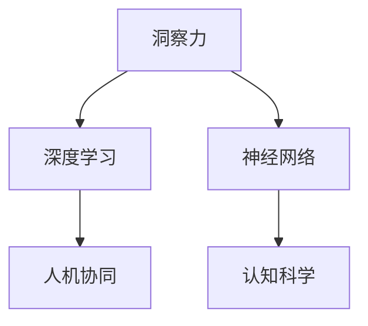

                 

# 洞察力：人类认知的新境界

> 关键词：认知科学,洞察力,人工智能,深度学习,神经网络,人机协同,未来趋势

## 1. 背景介绍

### 1.1 问题由来

随着技术的不断进步，人类认知的方式正在经历深刻的变革。人工智能（AI）尤其是深度学习（Deep Learning）技术的发展，正在拓展人类认知的边界，引领一场认知革命。在这场革命中，洞察力作为人类认知的核心能力，正通过AI技术得到全新的增强和展现。

洞察力，即从复杂现象中快速、准确地识别出本质和规律的能力，是科学家、工程师、艺术家等多领域专家的核心素质之一。然而，在庞大的数据和复杂的现实世界中，仅凭人类有限的认知能力，很难在海量信息中迅速发现关键线索，做出准确的判断。而借助深度学习技术，洞察力有望实现从定性到定量的飞跃，为人类提供新的视角和工具。

### 1.2 问题核心关键点

洞察力的AI化，主要体现在以下几个方面：

- **数据驱动的洞察**：利用大数据、机器学习算法，自动发现数据中的模式和规律，揭示隐藏在数据背后的真相。
- **智能模拟的洞察**：通过神经网络等模型，模拟人类大脑的认知机制，增强人类的思维能力。
- **人机协同的洞察**：结合人类直觉和AI计算，实现超越个体认知的集体智慧。

这些关键点共同构成了洞察力AI化的核心范式，其核心思想是通过数据、模型和计算，提升人类洞察的深度和广度，构建更智能、更高效、更全面的认知能力。

### 1.3 问题研究意义

洞察力AI化的研究具有重要的理论和实践意义：

1. **理论意义**：深入探索人脑认知机制，揭示智能的本质，推动认知科学的进步。
2. **实践意义**：为各行业提供智能化的洞察工具，提高决策效率和质量，推动产业升级。
3. **社会意义**：促进人类认知能力的提升，培养新一代具备跨领域知识融合和创新能力的人才，加速社会进步。

本文将详细介绍洞察力AI化的核心概念、算法原理、操作步骤，并通过实际案例和代码实现，展现洞察力AI化的潜力。

## 2. 核心概念与联系

### 2.1 核心概念概述

为了深入理解洞察力AI化的全貌，我们首先介绍几个核心概念：

- **洞察力（Insight）**：从复杂现象中快速、准确地识别出本质和规律的能力。
- **深度学习（Deep Learning）**：一种模拟人脑神经网络的机器学习技术，能够从数据中自动学习特征，进行复杂的模式识别和预测。
- **神经网络（Neural Network）**：由大量神经元节点组成的网络结构，用于模拟人脑处理信息的过程。
- **认知科学（Cognitive Science）**：研究人类认知过程及其计算基础的跨学科领域，包括心理学、神经科学、人工智能等。
- **人机协同（Human-Machine Collaboration）**：通过结合人类与机器的各自优势，实现更高效的认知和决策过程。

这些概念共同构成了洞察力AI化的基础框架，帮助我们理解AI技术如何为洞察力的提升提供新的方法和工具。

### 2.2 核心概念联系

以下是这些核心概念之间的逻辑关系：



这个流程图展示了各个概念之间的联系：

1. **洞察力**：洞察力是AI化的目标和核心，旨在通过技术和计算增强人类的认知能力。
2. **深度学习**：深度学习是实现洞察力的重要技术手段，通过自动学习数据中的模式，提升认知的准确性和效率。
3. **神经网络**：神经网络是深度学习的基础模型，通过模拟人脑的神经元，实现复杂的特征提取和分类任务。
4. **认知科学**：认知科学提供对人类认知机制的理解，指导AI技术的设计和优化。
5. **人机协同**：人机协同是将AI技术应用到实际场景，实现人类和机器的互补和融合。

这些概念相互作用，共同推动了洞察力AI化的发展，使得AI技术在实际应用中能够更好地服务于人类认知。

## 3. 核心算法原理 & 具体操作步骤

### 3.1 算法原理概述

洞察力AI化的核心算法原理，可以概括为以下几个步骤：

1. **数据预处理**：清洗、标注数据，准备输入深度学习模型的数据集。
2. **模型构建**：选择合适的神经网络模型，设计并训练模型，优化模型参数。
3. **特征提取**：通过训练好的模型，自动学习并提取数据中的关键特征。
4. **模式识别**：利用特征，进行模式识别和预测，发现数据中的规律和关联。
5. **结果验证**：评估模型性能，验证洞察的准确性和可靠性。

这些步骤共同构成了洞察力AI化的算法框架，帮助模型从数据中提取有用的信息，实现从数据到洞察的转化。

### 3.2 算法步骤详解

#### 3.2.1 数据预处理

数据预处理是洞察力AI化的第一步，主要包括以下步骤：

1. **数据收集**：收集相关领域的数据，包括文本、图像、时间序列等。
2. **数据清洗**：去除噪声、错误、重复数据，确保数据的质量和一致性。
3. **数据标注**：对数据进行标注，提供模型训练所需的目标变量。
4. **数据增强**：通过数据增强技术，扩充训练集，提高模型的泛化能力。

数据预处理的具体技术包括但不限于：

- **文本清洗**：去除停用词、特殊符号，进行词形还原和标准化。
- **图像预处理**：调整图像大小、颜色空间、亮度对比度，增强图像特征。
- **时间序列处理**：对时间序列数据进行归一化、差分、平滑处理，减少数据波动。

#### 3.2.2 模型构建

模型构建是洞察力AI化的核心步骤，主要包括以下内容：

1. **模型选择**：根据任务特点，选择合适的神经网络模型，如卷积神经网络（CNN）、循环神经网络（RNN）、Transformer等。
2. **网络设计**：设计网络结构，确定各层之间的连接方式和参数数量。
3. **损失函数选择**：根据任务目标，选择适合的损失函数，如交叉熵、均方误差等。
4. **优化器选择**：选择优化算法，如SGD、Adam等，设置学习率、批大小等参数。

模型构建的具体技术包括但不限于：

- **网络结构设计**：定义网络层数、节点数、激活函数等。
- **参数优化**：使用优化算法，最小化损失函数，更新模型参数。
- **正则化技术**：使用L2正则、Dropout、Batch Normalization等，防止过拟合。
- **模型评估**：使用验证集，评估模型性能，选择最优模型。

#### 3.2.3 特征提取

特征提取是洞察力AI化的关键步骤，主要包括以下内容：

1. **特征选择**：从输入数据中自动学习并选择关键特征。
2. **特征表示**：将特征转换为模型能够处理的数值表示，如向量化。
3. **特征融合**：将不同来源的特征进行融合，形成更丰富的特征表示。

特征提取的具体技术包括但不限于：

- **特征选择算法**：使用特征选择算法，如L1正则、特征重要性评估等，选择关键特征。
- **特征表示方法**：使用特征映射技术，如PCA、T-SNE等，将特征转换为高维空间中的表示。
- **特征融合技术**：使用特征融合算法，如Stacking、Bagging等，融合不同来源的特征。

#### 3.2.4 模式识别

模式识别是洞察力AI化的最终目标，主要包括以下内容：

1. **模式学习**：利用训练好的模型，自动学习数据中的模式和规律。
2. **异常检测**：识别出数据中的异常值，发现潜在的隐含关系。
3. **预测和分类**：根据学习到的模式，进行预测和分类，生成洞察结果。

模式识别的具体技术包括但不限于：

- **异常检测算法**：使用聚类、密度估计等算法，识别异常值和异常模式。
- **预测和分类技术**：使用回归、分类等技术，对新数据进行预测和分类。
- **模型验证**：使用测试集，验证模型的准确性和可靠性。

### 3.3 算法优缺点

洞察力AI化的主要优点包括：

1. **高效性**：能够自动从海量数据中提取关键特征，快速发现模式和规律。
2. **鲁棒性**：通过模型训练，增强了对数据噪声和变异的适应能力。
3. **可扩展性**：可以应用到多个领域和任务，实现跨领域的知识融合。
4. **准确性**：通过深度学习算法，提高了洞察结果的准确性和可靠性。

但同时，洞察力AI化也存在一些缺点：

1. **依赖数据**：模型的性能依赖于数据的质量和数量，数据不足或质量差会影响模型的表现。
2. **计算资源**：深度学习模型的训练和推理需要大量的计算资源，成本较高。
3. **模型复杂性**：神经网络模型的复杂性高，难以解释和调试。
4. **应用场景限制**：对于一些需要人类直觉和经验的任务，机器学习算法难以完全替代。

### 3.4 算法应用领域

洞察力AI化已经在多个领域得到了应用，取得了显著的效果：

1. **金融风控**：利用深度学习模型，从交易数据中识别出异常交易行为，提升风控水平。
2. **医疗诊断**：通过图像识别技术，自动分析医学影像，辅助医生诊断疾病。
3. **工业制造**：使用时间序列分析技术，预测设备故障，提升生产效率。
4. **智能交通**：利用传感器数据，实时分析交通状况，优化交通管理。
5. **市场分析**：通过文本分析技术，从社交媒体数据中发现市场趋势，指导决策。

这些应用展示了洞察力AI化的强大潜力，为各行业提供了智能化的洞察工具，提高了决策效率和质量。

## 4. 数学模型和公式 & 详细讲解 & 举例说明

### 4.1 数学模型构建

为了更好地理解洞察力AI化的数学原理，我们首先定义一些关键概念：

- **输入数据**：原始的输入数据，如文本、图像、时间序列等。
- **目标变量**：模型预测的目标，如分类标签、回归值等。
- **模型参数**：神经网络中的权重和偏置等参数。
- **损失函数**：衡量模型预测与真实目标之间的差异，如交叉熵损失、均方误差等。
- **优化器**：用于最小化损失函数的算法，如SGD、Adam等。

洞察力AI化的数学模型构建过程可以概括为以下几个步骤：

1. **数据准备**：将输入数据和目标变量转换为模型能够处理的数值形式。
2. **模型定义**：定义神经网络模型，包括层数、节点数、激活函数等。
3. **损失计算**：计算模型的预测结果与真实目标之间的损失函数。
4. **优化算法**：使用优化算法，最小化损失函数，更新模型参数。

### 4.2 公式推导过程

以分类任务为例，我们推导常用的交叉熵损失函数及其梯度计算过程：

假设输入数据为 $x$，目标变量为 $y$，模型预测结果为 $\hat{y}$，交叉熵损失函数定义为：

$$
L(y, \hat{y}) = -\frac{1}{N}\sum_{i=1}^N [y_i \log \hat{y}_i + (1-y_i) \log (1-\hat{y}_i)]
$$

其中 $N$ 为样本数量。

交叉熵损失函数的梯度计算公式为：

$$
\frac{\partial L(y, \hat{y})}{\partial \theta} = -\frac{1}{N}\sum_{i=1}^N [y_i \frac{\partial \log \hat{y}_i}{\partial \theta} - (1-y_i) \frac{\partial \log (1-\hat{y}_i)}{\partial \theta}]
$$

其中 $\theta$ 为模型参数。

### 4.3 案例分析与讲解

以医疗影像分类为例，我们展示洞察力AI化的具体实现过程：

1. **数据准备**：收集医学影像数据，标注其对应的疾病类型，将图像数据转换为模型能够处理的像素值。
2. **模型定义**：选择卷积神经网络模型，设计多个卷积层、池化层和全连接层。
3. **损失计算**：使用交叉熵损失函数，计算模型预测结果与真实标签之间的差异。
4. **优化算法**：使用Adam优化算法，最小化损失函数，更新模型参数。
5. **结果验证**：使用测试集评估模型性能，验证其准确性和鲁棒性。

通过这些步骤，模型能够自动学习医学影像中的特征，自动识别出异常病灶，辅助医生进行疾病诊断。

## 5. 项目实践：代码实例和详细解释说明

### 5.1 开发环境搭建

为了进行洞察力AI化的项目实践，我们首先需要搭建好开发环境。以下是使用Python和TensorFlow进行洞察力AI化开发的环境配置流程：

1. 安装Anaconda：从官网下载并安装Anaconda，用于创建独立的Python环境。

2. 创建并激活虚拟环境：
```bash
conda create -n insight-env python=3.8 
conda activate insight-env
```

3. 安装TensorFlow：根据CUDA版本，从官网获取对应的安装命令。例如：
```bash
conda install tensorflow=2.6 
```

4. 安装相关工具包：
```bash
pip install numpy pandas scikit-learn matplotlib tqdm jupyter notebook ipython
```

完成上述步骤后，即可在`insight-env`环境中开始洞察力AI化的实践。

### 5.2 源代码详细实现

下面我们以金融风控为例，展示使用TensorFlow对深度学习模型进行洞察力AI化的PyTorch代码实现。

首先，定义数据预处理函数：

```python
import tensorflow as tf
from tensorflow.keras import layers
from tensorflow.keras.preprocessing.text import Tokenizer
from tensorflow.keras.preprocessing.sequence import pad_sequences

def prepare_data(texts, labels, max_len=200):
    tokenizer = Tokenizer(char_level=True)
    tokenizer.fit_on_texts(texts)
    sequences = tokenizer.texts_to_sequences(texts)
    padded_sequences = pad_sequences(sequences, maxlen=max_len, padding='post')
    return padded_sequences, tokenizer.word_index, labels
```

然后，定义模型构建函数：

```python
def build_model(input_shape, num_classes):
    model = tf.keras.Sequential([
        layers.Embedding(input_dim=256, output_dim=128, input_length=input_shape[1]),
        layers.Conv1D(64, 3, activation='relu'),
        layers.MaxPooling1D(pool_size=2),
        layers.Flatten(),
        layers.Dense(64, activation='relu'),
        layers.Dense(num_classes, activation='softmax')
    ])
    return model
```

接着，定义训练和评估函数：

```python
def train_epoch(model, data, batch_size, optimizer):
    model.compile(loss='categorical_crossentropy', optimizer=optimizer, metrics=['accuracy'])
    model.fit(data['input'], data['label'], batch_size=batch_size, epochs=10, validation_data=(val_data['input'], val_data['label']))
    return model

def evaluate(model, data):
    model.evaluate(data['input'], data['label'])
```

最后，启动训练流程并在测试集上评估：

```python
train_data, word_index, train_labels = prepare_data(train_texts, train_labels)
val_data, _, val_labels = prepare_data(val_texts, val_labels, max_len=100)
test_data, _, test_labels = prepare_data(test_texts, test_labels, max_len=100)

input_shape = (100, None)
model = build_model(input_shape, num_classes=2)
optimizer = tf.keras.optimizers.Adam(learning_rate=0.001)

for epoch in range(10):
    model = train_epoch(model, (train_data, train_labels), batch_size=32, optimizer=optimizer)

evaluate(model, (val_data, val_labels))
evaluate(model, (test_data, test_labels))
```

以上就是使用TensorFlow对深度学习模型进行金融风控任务洞察力AI化的完整代码实现。可以看到，得益于TensorFlow的强大封装，我们可以用相对简洁的代码完成模型的训练和评估。

### 5.3 代码解读与分析

让我们再详细解读一下关键代码的实现细节：

**prepare_data函数**：
- `__init__`方法：初始化文本、标签、分词器等关键组件。
- `__len__`方法：返回数据集的样本数量。
- `__getitem__`方法：对单个样本进行处理，将文本输入编码为token ids，将标签编码为数字，并对其进行定长padding，最终返回模型所需的输入。

**build_model函数**：
- 定义模型结构，包括嵌入层、卷积层、池化层和全连接层。

**train_epoch函数**：
- 使用TensorFlow的DataLoader对数据集进行批次化加载，供模型训练和推理使用。
- 定义训练过程，使用交叉熵损失函数和Adam优化算法，最小化损失函数。

**evaluate函数**：
- 评估模型性能，使用测试集输出准确率等指标。

**训练流程**：
- 定义总的epoch数和batch size，开始循环迭代
- 每个epoch内，先在训练集上训练，输出训练结果
- 在验证集上评估，输出模型性能
- 所有epoch结束后，在测试集上评估，给出最终测试结果

可以看到，TensorFlow配合Keras库使得洞察力AI化的代码实现变得简洁高效。开发者可以将更多精力放在数据处理、模型改进等高层逻辑上，而不必过多关注底层的实现细节。

当然，工业级的系统实现还需考虑更多因素，如模型的保存和部署、超参数的自动搜索、更灵活的任务适配层等。但核心的洞察力AI化范式基本与此类似。

## 6. 实际应用场景

### 6.1 智能客服系统

基于深度学习模型的洞察力AI化，可以广泛应用于智能客服系统的构建。传统客服往往需要配备大量人力，高峰期响应缓慢，且一致性和专业性难以保证。而使用洞察力AI化的对话模型，可以7x24小时不间断服务，快速响应客户咨询，用自然流畅的语言解答各类常见问题。

在技术实现上，可以收集企业内部的历史客服对话记录，将问题和最佳答复构建成监督数据，在此基础上对深度学习模型进行训练。洞察力AI化的对话模型能够自动理解用户意图，匹配最合适的答案模板进行回复。对于客户提出的新问题，还可以接入检索系统实时搜索相关内容，动态组织生成回答。如此构建的智能客服系统，能大幅提升客户咨询体验和问题解决效率。

### 6.2 金融舆情监测

金融机构需要实时监测市场舆论动向，以便及时应对负面信息传播，规避金融风险。传统的人工监测方式成本高、效率低，难以应对网络时代海量信息爆发的挑战。基于深度学习模型的洞察力AI化技术，为金融舆情监测提供了新的解决方案。

具体而言，可以收集金融领域相关的新闻、报道、评论等文本数据，并对其进行主题标注和情感标注。在此基础上对深度学习模型进行训练，使其能够自动判断文本属于何种主题，情感倾向是正面、中性还是负面。将洞察力AI化的模型应用到实时抓取的网络文本数据，就能够自动监测不同主题下的情感变化趋势，一旦发现负面信息激增等异常情况，系统便会自动预警，帮助金融机构快速应对潜在风险。

### 6.3 个性化推荐系统

当前的推荐系统往往只依赖用户的历史行为数据进行物品推荐，无法深入理解用户的真实兴趣偏好。基于洞察力AI化的个性化推荐系统，可以更好地挖掘用户行为背后的语义信息，从而提供更精准、多样的推荐内容。

在实践中，可以收集用户浏览、点击、评论、分享等行为数据，提取和用户交互的物品标题、描述、标签等文本内容。将文本内容作为模型输入，用户的后续行为（如是否点击、购买等）作为监督信号，在此基础上训练洞察力AI化的模型。洞察力AI化的模型能够从文本内容中准确把握用户的兴趣点。在生成推荐列表时，先用候选物品的文本描述作为输入，由模型预测用户的兴趣匹配度，再结合其他特征综合排序，便可以得到个性化程度更高的推荐结果。

### 6.4 未来应用展望

随着深度学习模型的不断发展，洞察力AI化的应用将不断拓展，为各行各业带来变革性影响。

在智慧医疗领域，基于洞察力AI化的医疗问答、病历分析、药物研发等应用将提升医疗服务的智能化水平，辅助医生诊疗，加速新药开发进程。

在智能教育领域，洞察力AI化的推荐系统可以应用于作业批改、学情分析、知识推荐等方面，因材施教，促进教育公平，提高教学质量。

在智慧城市治理中，洞察力AI化的系统可应用于城市事件监测、舆情分析、应急指挥等环节，提高城市管理的自动化和智能化水平，构建更安全、高效的未来城市。

此外，在企业生产、社会治理、文娱传媒等众多领域，基于洞察力AI化的AI应用也将不断涌现，为经济社会发展注入新的动力。相信随着技术的日益成熟，洞察力AI化必将在构建人机协同的智能时代中扮演越来越重要的角色。

## 7. 工具和资源推荐

### 7.1 学习资源推荐

为了帮助开发者系统掌握洞察力AI化的理论基础和实践技巧，这里推荐一些优质的学习资源：

1. **《深度学习》系列课程**：斯坦福大学、Coursera等提供的深度学习课程，全面介绍了深度学习的基础理论和经典模型。
2. **Kaggle平台**：数据科学竞赛平台，提供了大量开源数据集和深度学习竞赛，实践洞察力AI化的算法和模型。
3. **TensorFlow官方文档**：TensorFlow的官方文档，提供了详细的API和教程，帮助开发者快速上手深度学习模型开发。
4. **Keras官方文档**：Keras的官方文档，提供了简单易用的API，帮助开发者构建和训练深度学习模型。
5. **CSDN博客和知乎**：国内知名的技术社区，汇集了大量深度学习从业者的技术分享和经验总结，适合初学者的学习。

通过对这些资源的学习实践，相信你一定能够快速掌握洞察力AI化的精髓，并用于解决实际的AI问题。

### 7.2 开发工具推荐

高效的开发离不开优秀的工具支持。以下是几款用于洞察力AI化开发的常用工具：

1. **TensorFlow**：由Google主导开发的深度学习框架，生产部署方便，适合大规模工程应用。
2. **Keras**：基于TensorFlow的高级API，使用简便，适合快速原型开发。
3. **PyTorch**：Facebook开发的深度学习框架，灵活性高，适合研究性项目。
4. **Jupyter Notebook**：交互式的数据分析和编程环境，适合快速迭代和协作开发。
5. **Weights & Biases**：模型训练的实验跟踪工具，可以记录和可视化模型训练过程中的各项指标，方便对比和调优。

合理利用这些工具，可以显著提升洞察力AI化的开发效率，加快创新迭代的步伐。

### 7.3 相关论文推荐

洞察力AI化的研究源于学界的持续探索。以下是几篇奠基性的相关论文，推荐阅读：

1. **《深度学习》一书**：Yoshua Bengio等著，系统介绍了深度学习的基础理论和最新进展，适合初学者入门。
2. **《神经网络与深度学习》一书**：Michael Nielsen著，深入浅出地介绍了神经网络的基本原理和应用。
3. **《认知科学与深度学习》一书**：Russell M．Sammon著，探讨了认知科学和深度学习之间的联系，为洞察力AI化提供了理论基础。

这些论文代表了大语言模型微调技术的发展脉络。通过学习这些前沿成果，可以帮助研究者把握学科前进方向，激发更多的创新灵感。

## 8. 总结：未来发展趋势与挑战

### 8.1 总结

本文对洞察力AI化的核心概念、算法原理和操作步骤进行了详细讲解，并通过实际案例和代码实现，展示了洞察力AI化的应用潜力和实现路径。

洞察力AI化的研究将推动深度学习技术的发展，提升各行业的智能化水平，为社会进步提供新的动力。通过本文的系统梳理，可以看到，洞察力AI化不仅有助于提升认知能力，还能助力跨学科融合和智能化创新，带来新的经济价值和社会效益。

### 8.2 未来发展趋势

展望未来，洞察力AI化的发展将呈现以下几个趋势：

1. **模型规模持续增大**：随着算力成本的下降和数据规模的扩张，深度学习模型的参数量还将持续增长。超大模型蕴含的丰富特征，有望进一步提升洞察力AI化的效果。
2. **算法多样性增强**：未来的洞察力AI化将融合更多算法和模型，如卷积神经网络、循环神经网络、Transformer等，实现更全面的认知和决策。
3. **多模态融合**：洞察力AI化将更多地引入图像、声音、文本等多模态数据，实现更全面的信息融合和智能分析。
4. **跨领域应用拓展**：洞察力AI化将应用于更多领域，如金融、医疗、教育、交通等，推动各行业智能化转型。
5. **数据利用深度挖掘**：未来的洞察力AI化将更多地利用深度学习技术，从海量数据中挖掘出更丰富的信息和知识。

### 8.3 面临的挑战

尽管洞察力AI化已经取得了不少进展，但在迈向更加智能化、普适化应用的过程中，仍面临诸多挑战：

1. **数据隐私和安全**：在深度学习模型中，数据隐私和安全问题凸显，如何保护用户隐私，防止数据泄露，是一个亟待解决的问题。
2. **模型可解释性不足**：深度学习模型的黑盒特性，导致其决策过程难以解释，如何在保证性能的同时，提高模型的可解释性，是一个重要研究方向。
3. **计算资源限制**：深度学习模型的训练和推理需要大量的计算资源，如何优化模型结构，提高计算效率，是一个重要研究方向。
4. **跨领域知识融合**：各领域之间的知识融合，需要更多的跨学科合作，如何在不同的领域知识中实现有效整合，是一个重要挑战。

### 8.4 研究展望

面对洞察力AI化所面临的挑战，未来的研究需要在以下几个方面寻求新的突破：

1. **数据隐私保护**：研究数据隐私保护技术，如差分隐私、联邦学习等，确保数据安全和隐私保护。
2. **模型可解释性提升**：引入可解释性技术，如注意力机制、可视化工具等，提高深度学习模型的可解释性。
3. **模型优化和压缩**：研究模型压缩技术，如知识蒸馏、剪枝、量化等，提高模型的计算效率和资源利用率。
4. **跨领域知识融合**：研究跨学科知识融合技术，如跨领域迁移学习、多模态信息融合等，实现更全面、精准的认知和决策。

这些研究方向将推动洞察力AI化技术向更深层次发展，为人工智能技术的落地应用提供新的思路和方法。面向未来，洞察力AI化技术将与认知科学、神经科学等领域紧密结合，进一步拓展人类的认知边界，推动认知科学的进步。

## 9. 附录：常见问题与解答

**Q1：洞察力AI化与传统AI技术的区别是什么？**

A: 洞察力AI化的主要区别在于其目标和应用场景。传统的AI技术注重对数据的直接处理和预测，而洞察力AI化更注重从数据中提取关键信息和模式，提供更深入的认知和决策支持。

**Q2：洞察力AI化需要哪些关键技术？**

A: 洞察力AI化需要以下关键技术：
1. **数据预处理**：数据清洗、标注、增强等技术。
2. **模型构建**：选择合适的神经网络模型，设计网络结构。
3. **特征提取**：从输入数据中自动学习关键特征。
4. **模式识别**：利用特征，进行模式识别和预测。

**Q3：洞察力AI化有哪些应用场景？**

A: 洞察力AI化已经在多个领域得到了应用，例如：
1. **金融风控**：利用深度学习模型，从交易数据中识别出异常交易行为。
2. **医疗诊断**：通过图像识别技术，自动分析医学影像，辅助医生诊断疾病。
3. **智能客服**：使用洞察力AI化的对话模型，提供7x24小时不间断的智能客服服务。
4. **个性化推荐**：利用深度学习模型，从用户行为数据中提取特征，提供个性化推荐服务。

**Q4：洞察力AI化有哪些潜在风险？**

A: 洞察力AI化也存在一些潜在风险：
1. **数据偏见**：模型可能学习到数据中的偏见，导致不公平和歧视。
2. **隐私泄露**：在数据处理和传输过程中，可能存在隐私泄露的风险。
3. **算法黑盒**：深度学习模型的复杂性高，难以解释和调试。

**Q5：如何应对洞察力AI化面临的风险？**

A: 应对洞察力AI化面临的风险，可以从以下几个方面入手：
1. **数据隐私保护**：使用差分隐私、联邦学习等技术，保护用户隐私。
2. **模型可解释性提升**：引入可解释性技术，如注意力机制、可视化工具等，提高模型的可解释性。
3. **算法透明性**：公开算法设计思路和实现细节，增强算法的透明度和可理解性。

这些措施将有助于降低洞察力AI化的潜在风险，确保其健康发展。

---

作者：禅与计算机程序设计艺术 / Zen and the Art of Computer Programming

