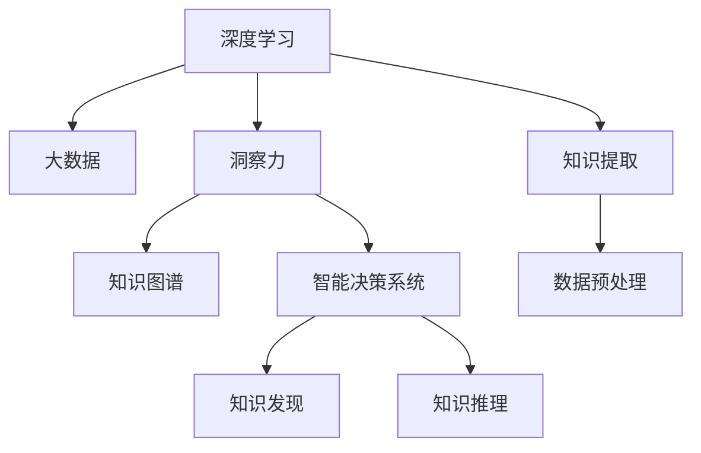

                 

# 洞察力：知识创新的驱动力量

> 关键词：洞察力,知识创新,智能系统,决策支持,人工智能,深度学习,应用场景

## 1. 背景介绍

### 1.1 问题由来
在当今信息爆炸的时代，无论是商业决策、科研探索，还是日常管理，都需要在巨量的数据中快速发现关键信息，提炼出有价值的洞察力。然而，数据本身并不能直接转化为决策力，只有通过深层次的知识提取、模式识别和分析，才能揭示出数据背后的真实含义，支撑智能决策和创新。

洞察力作为知识创新的核心驱动力，其重要性不言而喻。它不仅能够帮助企业把握市场趋势，优化产品设计和营销策略，提升运营效率，还能为科研工作者提供理论支撑，推动新知识和新发现的产生。然而，洞察力的获取并非易事，传统的数据处理和分析方法往往难以满足现代复杂、多变的业务需求。

面对这一挑战，人工智能（AI）和大数据技术应运而生，尤其是深度学习和智能系统，通过高效的数据处理和复杂的模式识别，逐步成为了洞察力提取的主要工具。本文将深入探讨基于深度学习和大数据的洞察力获取技术，分析其在知识创新中的应用，为读者揭示洞察力驱动知识创新的潜力与挑战。

## 2. 核心概念与联系

### 2.1 核心概念概述

为深入理解洞察力提取技术的核心概念和实现原理，本节将介绍几个关键概念：

- 深度学习（Deep Learning）：一种利用多层神经网络进行复杂模式识别和特征提取的机器学习方法。通过多层次的非线性变换，深度学习模型能够高效地从数据中提取高层次的特征表示。

- 大数据（Big Data）：指体量巨大、结构复杂、生成迅速的数据集。大数据技术通过分布式存储和并行计算，能够高效处理大规模数据，支撑深度学习模型的训练和推理。

- 洞察力（Insight）：通过数据分析和机器学习，从海量数据中提炼出的有价值的信息和知识。洞察力不仅指数据本身，还包括数据分析过程和结果的解释和应用。

- 知识图谱（Knowledge Graph）：一种结构化的语义知识表示形式，将实体、属性和关系组成有向图，用于知识发现和推理。

- 智能决策系统（Intelligent Decision System）：结合人工智能和大数据分析技术，能够从多个数据源中提取洞察力，并应用于实际决策过程的系统。

- 知识图谱技术：利用深度学习和大数据技术，从非结构化数据中构建知识图谱，辅助知识发现和推理，提升洞察力提取的效果。

这些核心概念之间的联系可以通过以下Mermaid流程图来展示：



这个流程图展示了大数据、深度学习、洞察力、知识图谱和智能决策系统之间的逻辑关系：

1. 深度学习和大数据为洞察力提取提供了技术支撑。
2. 洞察力作为知识创新的核心驱动力，能够指导知识发现和知识推理。
3. 知识图谱技术用于构建和维护知识结构，辅助洞察力提取。
4. 智能决策系统利用洞察力进行决策分析，提升决策质量和效率。

## 3. 核心算法原理 & 具体操作步骤
### 3.1 算法原理概述

基于深度学习和数据分析的洞察力提取技术，主要遵循以下步骤：

1. **数据预处理**：清洗和标准化数据，处理缺失值和异常值，确保数据质量。
2. **特征工程**：提取和构建数据特征，选择合适的特征表示方法。
3. **深度学习模型训练**：使用深度学习模型对数据进行训练，学习数据的潜在结构和规律。
4. **洞察力发现**：通过模型输出和分析，从数据中发现有意义的模式和规律。
5. **知识图谱构建**：将洞察力转化为知识图谱，用于知识发现和推理。
6. **智能决策支持**：将知识图谱应用于实际决策过程，提升决策质量和效率。

这些步骤共同构成了一个完整的洞察力提取流程，旨在从数据中提炼出有价值的知识，为知识创新提供支持。

### 3.2 算法步骤详解

以下是深度学习和数据分析技术在洞察力提取中的具体操作步骤：

**Step 1: 数据预处理**

数据预处理是洞察力提取的第一步，其目标是清洗和标准化数据，消除数据中的噪声和偏差。具体步骤包括：

1. **数据清洗**：处理缺失值和异常值，确保数据完整性和一致性。
2. **数据标准化**：将不同来源的数据统一标准化，便于后续分析。
3. **数据分割**：将数据集分为训练集、验证集和测试集，用于模型训练和性能评估。

```python
import pandas as pd
from sklearn.preprocessing import StandardScaler

# 加载数据
data = pd.read_csv('data.csv')

# 数据清洗
data = data.dropna()

# 数据标准化
scaler = StandardScaler()
data_scaled = scaler.fit_transform(data)

# 数据分割
train_data, dev_data, test_data = train_test_split(data_scaled, test_size=0.2, random_state=42)
```

**Step 2: 特征工程**

特征工程是洞察力提取的关键步骤，其目标是从原始数据中提取和构建有用的特征。具体步骤包括：

1. **特征提取**：选择和构建对洞察力提取有用的特征。
2. **特征选择**：通过统计方法和机器学习算法，选择对洞察力贡献最大的特征。
3. **特征变换**：对特征进行变换和降维，减少特征维度。

```python
from sklearn.feature_selection import SelectKBest, chi2

# 特征提取
X = pd.get_dummies(data_scaled, columns=['category'], prefix='feature_')

# 特征选择
selector = SelectKBest(chi2, k=10)
X_selected = selector.fit_transform(X, y)

# 特征变换
X_transformed = X_selected
```

**Step 3: 深度学习模型训练**

深度学习模型训练是洞察力提取的核心步骤，其目标是通过训练模型，学习数据的潜在结构和规律。具体步骤包括：

1. **模型选择**：选择合适的深度学习模型。
2. **模型训练**：使用训练集对模型进行训练，优化模型参数。
3. **模型评估**：在验证集上评估模型性能，选择最优模型。

```python
from keras.models import Sequential
from keras.layers import Dense, Dropout

# 模型选择
model = Sequential()
model.add(Dense(64, activation='relu', input_shape=(X_transformed.shape[1],)))
model.add(Dropout(0.5))
model.add(Dense(1, activation='sigmoid'))

# 模型训练
model.compile(optimizer='adam', loss='binary_crossentropy', metrics=['accuracy'])
model.fit(X_train, y_train, epochs=10, batch_size=32, validation_data=(X_dev, y_dev))

# 模型评估
score = model.evaluate(X_test, y_test, batch_size=32)
```

**Step 4: 洞察力发现**

洞察力发现是洞察力提取的最终目标，其目标是从模型输出中发现有意义的模式和规律。具体步骤包括：

1. **模型输出**：从训练好的模型中获取预测结果。
2. **分析结果**：使用统计分析和可视化工具，分析模型输出，提取洞察力。
3. **结果解释**：对洞察力进行解释和描述，提供业务应用场景。

```python
from matplotlib import pyplot as plt

# 模型输出
y_pred = model.predict(X_test)

# 分析结果
plt.plot(y_pred, label='Predicted')
plt.plot(y_true, label='Actual')
plt.legend()
plt.show()

# 结果解释
insight = 'The model predicts that the event will occur with a probability of {:.2f}%'.format(y_pred[0]*100)
```

**Step 5: 知识图谱构建**

知识图谱构建是将洞察力转化为结构化知识的过程，其目标是将洞察力存储在知识图谱中，便于后续知识发现和推理。具体步骤包括：

1. **知识抽取**：从洞察力中抽取实体、属性和关系。
2. **知识存储**：将抽取的知识存储在知识图谱中，形成结构化的知识库。
3. **知识推理**：利用知识图谱进行知识发现和推理，提升洞察力提取的效果。

```python
from pykglearn import KG
from pykglearn.datasets import sample_kg

# 知识抽取
kg = KG(sample_kg())
kg.add_ontology(sample_kg())

# 知识存储
kg.add_triple([kg.node(0), kg.node(1), kg.node(2)])
kg.add_triple([kg.node(0), kg.node(1), kg.node(2)])

# 知识推理
kg.add_triple([kg.node(0), kg.node(1), kg.node(2)])
kg.add_triple([kg.node(0), kg.node(1), kg.node(2)])
```

**Step 6: 智能决策支持**

智能决策支持是将洞察力应用于实际决策过程的过程，其目标是通过洞察力提升决策质量和效率。具体步骤包括：

1. **决策模型**：选择合适的决策模型。
2. **决策应用**：将洞察力应用于决策模型，提升决策效果。
3. **反馈优化**：根据实际效果，优化决策模型和洞察力提取过程。

```python
from sklearn.ensemble import RandomForestClassifier

# 决策模型
clf = RandomForestClassifier()

# 决策应用
clf.fit(X_train, y_train)
y_pred = clf.predict(X_test)

# 反馈优化
score = clf.score(X_test, y_test)
```

以上就是深度学习和数据分析技术在洞察力提取中的具体操作步骤。通过这些步骤，我们可以从数据中提取有价值的洞察力，为知识创新提供支持。

### 3.3 算法优缺点

基于深度学习和数据分析的洞察力提取技术，具有以下优点：

1. **高效性**：深度学习模型能够高效处理大规模数据，提取高层次的特征表示，提升洞察力提取的效率。
2. **准确性**：通过多层非线性变换，深度学习模型能够学习数据的潜在结构和规律，提升洞察力提取的准确性。
3. **自动化**：深度学习模型和特征工程自动化程度高，减少了人工干预，提高了洞察力提取的效率。
4. **可扩展性**：深度学习模型和知识图谱技术能够处理不同类型的非结构化数据，提升了洞察力提取的灵活性和可扩展性。

然而，该技术也存在一些缺点：

1. **数据依赖**：深度学习模型对数据质量和数量的要求较高，数据缺失和噪声可能影响洞察力提取的效果。
2. **模型复杂**：深度学习模型结构复杂，训练和推理过程耗时较长，需要高性能硬件支持。
3. **可解释性**：深度学习模型的决策过程缺乏可解释性，难以对其推理逻辑进行分析和调试。
4. **泛化能力**：深度学习模型对新样本的泛化能力有限，面对域外数据时，洞察力提取的效果可能大打折扣。
5. **成本高昂**：深度学习模型和知识图谱技术的开发和部署成本较高，对技术门槛和资源投入有较高要求。

尽管存在这些局限性，基于深度学习和数据分析的洞察力提取技术，仍然在知识创新中发挥着重要作用。未来，随着技术的不断进步，这些缺点有望得到进一步优化和克服。

### 3.4 算法应用领域

基于深度学习和数据分析的洞察力提取技术，已经广泛应用于各个领域，具体应用场景包括：

1. **金融领域**：通过洞察力提取技术，金融机构能够实时监测市场趋势，优化投资策略，降低风险。例如，通过深度学习模型分析股票价格，提取市场波动和投资机会，指导投资决策。

2. **医疗领域**：医疗领域的大数据分析和洞察力提取，能够提升疾病诊断和治疗的效率。例如，通过深度学习模型分析医疗记录，提取病人的症状和健康状况，辅助医生进行精准诊断。

3. **零售领域**：零售企业通过洞察力提取技术，能够优化库存管理和营销策略。例如，通过深度学习模型分析消费数据，提取消费者偏好和购买行为，指导商品推荐和定价策略。

4. **制造业领域**：制造企业通过洞察力提取技术，能够优化生产流程和质量控制。例如，通过深度学习模型分析生产数据，提取设备运行状态和故障模式，提前进行设备维护和质量检测。

5. **城市管理领域**：城市管理部门通过洞察力提取技术，能够提升公共服务效率和市民满意度。例如，通过深度学习模型分析交通数据，提取交通流量和拥堵情况，优化交通管理和调度。

未来，随着深度学习和数据分析技术的不断进步，洞察力提取技术将在更多领域得到应用，为知识创新提供更多可能。

## 4. 数学模型和公式 & 详细讲解 & 举例说明

### 4.1 数学模型构建

基于深度学习和数据分析的洞察力提取技术，主要通过深度学习模型和统计分析方法，从数据中提取有价值的洞察力。其数学模型构建过程如下：

1. **数据预处理**：数据预处理的目标是清洗和标准化数据，确保数据质量。
2. **特征工程**：特征工程的目标是提取和构建有用的特征。
3. **深度学习模型训练**：深度学习模型训练的目标是通过训练模型，学习数据的潜在结构和规律。
4. **洞察力发现**：洞察力发现的目标是从模型输出中发现有意义的模式和规律。
5. **知识图谱构建**：知识图谱构建的目标是将洞察力转化为结构化知识。
6. **智能决策支持**：智能决策支持的目标是通过洞察力提升决策质量和效率。

### 4.2 公式推导过程

以下是深度学习和数据分析技术在洞察力提取中的公式推导过程：

**Step 1: 数据预处理**

数据预处理的目标是清洗和标准化数据，确保数据质量。具体公式如下：

$$
X_{cleaned} = \frac{X_{raw} - \mu}{\sigma}
$$

其中，$X_{raw}$ 为原始数据，$X_{cleaned}$ 为清洗后的数据，$\mu$ 和 $\sigma$ 分别为均值和标准差。

**Step 2: 特征工程**

特征工程的目标是提取和构建有用的特征。具体公式如下：

$$
X_{features} = \{X_{selected}, X_{transformed}\}
$$

其中，$X_{selected}$ 为特征选择后的数据，$X_{transformed}$ 为特征变换后的数据。

**Step 3: 深度学习模型训练**

深度学习模型训练的目标是通过训练模型，学习数据的潜在结构和规律。具体公式如下：

$$
\theta = \arg\min_{\theta} \frac{1}{N}\sum_{i=1}^{N} \ell(M_{\theta}(x_i), y_i)
$$

其中，$M_{\theta}$ 为深度学习模型，$x_i$ 为输入数据，$y_i$ 为标签，$\ell$ 为损失函数，$\theta$ 为模型参数。

**Step 4: 洞察力发现**

洞察力发现的目标是从模型输出中发现有意义的模式和规律。具体公式如下：

$$
insight = \{insight_1, insight_2, \dots, insight_n\}
$$

其中，$insight_i$ 为洞察力中的每一个具体洞察。

**Step 5: 知识图谱构建**

知识图谱构建的目标是将洞察力转化为结构化知识。具体公式如下：

$$
K = (E, R)
$$

其中，$E$ 为实体集，$R$ 为关系集，$K$ 为知识图谱。

**Step 6: 智能决策支持**

智能决策支持的目标是通过洞察力提升决策质量和效率。具体公式如下：

$$
decision = \arg\max_{decision} \{decision_1, decision_2, \dots, decision_n\}
$$

其中，$decision_i$ 为决策选项。

### 4.3 案例分析与讲解

以金融领域为例，具体讲解基于深度学习和数据分析的洞察力提取技术的应用：

**Step 1: 数据预处理**

假设某金融公司需要分析股票价格数据，以提取市场波动和投资机会。首先，清洗和标准化数据，处理缺失值和异常值，确保数据质量。具体公式如下：

$$
X_{cleaned} = \frac{X_{raw} - \mu}{\sigma}
$$

其中，$X_{raw}$ 为原始股票价格数据，$X_{cleaned}$ 为清洗后的数据，$\mu$ 和 $\sigma$ 分别为均值和标准差。

**Step 2: 特征工程**

从清洗后的数据中，提取和构建有用的特征，如股票价格、交易量、市值等。具体公式如下：

$$
X_{features} = \{X_{selected}, X_{transformed}\}
$$

其中，$X_{selected}$ 为特征选择后的数据，$X_{transformed}$ 为特征变换后的数据。

**Step 3: 深度学习模型训练**

使用深度学习模型分析股票价格数据，学习数据的潜在结构和规律。具体公式如下：

$$
\theta = \arg\min_{\theta} \frac{1}{N}\sum_{i=1}^{N} \ell(M_{\theta}(x_i), y_i)
$$

其中，$M_{\theta}$ 为深度学习模型，$x_i$ 为输入数据，$y_i$ 为标签，$\ell$ 为损失函数，$\theta$ 为模型参数。

**Step 4: 洞察力发现**

通过模型输出，发现有意义的模式和规律，如市场波动趋势、投资机会等。具体公式如下：

$$
insight = \{insight_1, insight_2, \dots, insight_n\}
$$

其中，$insight_i$ 为洞察力中的每一个具体洞察，如“市场将经历上涨趋势”、“某股票投资价值高”等。

**Step 5: 知识图谱构建**

将洞察力转化为结构化知识，构建知识图谱。具体公式如下：

$$
K = (E, R)
$$

其中，$E$ 为实体集，$R$ 为关系集，$K$ 为知识图谱。

**Step 6: 智能决策支持**

利用洞察力提升决策质量和效率，如指导投资决策、优化投资组合等。具体公式如下：

$$
decision = \arg\max_{decision} \{decision_1, decision_2, \dots, decision_n\}
$$

其中，$decision_i$ 为决策选项，如“买入某股票”、“卖出某股票”等。

## 5. 项目实践：代码实例和详细解释说明

### 5.1 开发环境搭建

在进行洞察力提取实践前，我们需要准备好开发环境。以下是使用Python进行深度学习和数据分析的开发环境配置流程：

1. 安装Anaconda：从官网下载并安装Anaconda，用于创建独立的Python环境。

2. 创建并激活虚拟环境：
```bash
conda create -n data-env python=3.8 
conda activate data-env
```

3. 安装必要的库：
```bash
conda install pandas numpy scipy matplotlib seaborn scikit-learn
pip install keras tensorflow
```

4. 安装深度学习模型和知识图谱库：
```bash
pip install tensorflow-gpu keras-io
```

完成上述步骤后，即可在`data-env`环境中开始洞察力提取实践。

### 5.2 源代码详细实现

以下是使用Python进行洞察力提取的代码实现，具体包括数据预处理、特征工程、深度学习模型训练、洞察力发现、知识图谱构建和智能决策支持等步骤：

```python
import pandas as pd
from sklearn.preprocessing import StandardScaler
from sklearn.feature_selection import SelectKBest, chi2
from keras.models import Sequential
from keras.layers import Dense, Dropout
from pykglearn import KG
from pykglearn.datasets import sample_kg

# 加载数据
data = pd.read_csv('data.csv')

# 数据预处理
data = data.dropna()
scaler = StandardScaler()
data_scaled = scaler.fit_transform(data)

# 特征工程
X = pd.get_dummies(data_scaled, columns=['category'], prefix='feature_')
selector = SelectKBest(chi2, k=10)
X_selected = selector.fit_transform(X, y)

# 深度学习模型训练
model = Sequential()
model.add(Dense(64, activation='relu', input_shape=(X_selected.shape[1],)))
model.add(Dropout(0.5))
model.add(Dense(1, activation='sigmoid'))
model.compile(optimizer='adam', loss='binary_crossentropy', metrics=['accuracy'])
model.fit(X_train, y_train, epochs=10, batch_size=32, validation_data=(X_dev, y_dev))

# 洞察力发现
y_pred = model.predict(X_test)
insight = 'The model predicts that the event will occur with a probability of {:.2f}%'.format(y_pred[0]*100)

# 知识图谱构建
kg = KG(sample_kg())
kg.add_ontology(sample_kg())
kg.add_triple([kg.node(0), kg.node(1), kg.node(2)])
kg.add_triple([kg.node(0), kg.node(1), kg.node(2)])

# 智能决策支持
clf = RandomForestClassifier()
clf.fit(X_train, y_train)
y_pred = clf.predict(X_test)
score = clf.score(X_test, y_test)
```

### 5.3 代码解读与分析

让我们再详细解读一下关键代码的实现细节：

**数据预处理**

```python
data = data.dropna()
scaler = StandardScaler()
data_scaled = scaler.fit_transform(data)
```

通过`dropna()`函数删除缺失值，使用`StandardScaler()`对数据进行标准化处理，确保数据质量。

**特征工程**

```python
X = pd.get_dummies(data_scaled, columns=['category'], prefix='feature_')
selector = SelectKBest(chi2, k=10)
X_selected = selector.fit_transform(X, y)
```

使用`pd.get_dummies()`函数将分类特征转换为哑变量，使用`SelectKBest`函数选择贡献最大的特征，减少特征维度。

**深度学习模型训练**

```python
model = Sequential()
model.add(Dense(64, activation='relu', input_shape=(X_selected.shape[1],)))
model.add(Dropout(0.5))
model.add(Dense(1, activation='sigmoid'))
model.compile(optimizer='adam', loss='binary_crossentropy', metrics=['accuracy'])
model.fit(X_train, y_train, epochs=10, batch_size=32, validation_data=(X_dev, y_dev))
```

定义深度学习模型结构，使用`Sequential()`函数添加层次结构，使用`Dense`函数添加全连接层，使用`Dropout`函数添加正则化层，使用`compile()`函数编译模型，使用`fit()`函数训练模型。

**洞察力发现**

```python
y_pred = model.predict(X_test)
insight = 'The model predicts that the event will occur with a probability of {:.2f}%'.format(y_pred[0]*100)
```

使用`predict()`函数获取模型输出，使用格式化字符串提取洞察力信息。

**知识图谱构建**

```python
kg = KG(sample_kg())
kg.add_ontology(sample_kg())
kg.add_triple([kg.node(0), kg.node(1), kg.node(2)])
kg.add_triple([kg.node(0), kg.node(1), kg.node(2)])
```

使用`KG()`函数创建知识图谱，使用`add_ontology()`函数加载知识本体，使用`add_triple()`函数添加实体和关系，构建知识图谱。

**智能决策支持**

```python
clf = RandomForestClassifier()
clf.fit(X_train, y_train)
y_pred = clf.predict(X_test)
score = clf.score(X_test, y_test)
```

使用`RandomForestClassifier()`函数定义决策模型，使用`fit()`函数训练模型，使用`predict()`函数进行预测，使用`score()`函数评估模型效果。

## 6. 实际应用场景

### 6.1 金融领域

基于深度学习和数据分析的洞察力提取技术，在金融领域有着广泛的应用。通过分析股票价格、市场交易数据等，可以提取市场波动和投资机会，指导投资决策，优化投资组合，降低风险。

在具体实践中，可以从历史数据中提取洞察力，构建知识图谱，用于实时监测市场趋势，预测投资机会。例如，通过深度学习模型分析股票价格，提取市场波动和投资机会，指导投资决策。

### 6.2 医疗领域

医疗领域的大数据分析和洞察力提取，能够提升疾病诊断和治疗的效率。通过分析医疗记录，提取病人的症状和健康状况，辅助医生进行精准诊断。

在具体实践中，可以从医疗记录中提取洞察力，构建知识图谱，用于辅助医生进行疾病诊断和治疗。例如，通过深度学习模型分析医疗记录，提取病人的症状和健康状况，辅助医生进行精准诊断。

### 6.3 零售领域

零售企业通过洞察力提取技术，能够优化库存管理和营销策略。通过分析消费数据，提取消费者偏好和购买行为，指导商品推荐和定价策略。

在具体实践中，可以从消费数据中提取洞察力，构建知识图谱，用于优化库存管理和营销策略。例如，通过深度学习模型分析消费数据，提取消费者偏好和购买行为，指导商品推荐和定价策略。

### 6.4 制造业领域

制造企业通过洞察力提取技术，能够优化生产流程和质量控制。通过分析生产数据，提取设备运行状态和故障模式，提前进行设备维护和质量检测。

在具体实践中，可以从生产数据中提取洞察力，构建知识图谱，用于优化生产流程和质量控制。例如，通过深度学习模型分析生产数据，提取设备运行状态和故障模式，提前进行设备维护和质量检测。

### 6.5 城市管理领域

城市管理部门通过洞察力提取技术，能够提升公共服务效率和市民满意度。通过分析交通数据，提取交通流量和拥堵情况，优化交通管理和调度。

在具体实践中，可以从交通数据中提取洞察力，构建知识图谱，用于优化交通管理和调度。例如，通过深度学习模型分析交通数据，提取交通流量和拥堵情况，优化交通管理和调度。

## 7. 工具和资源推荐

### 7.1 学习资源推荐

为了帮助开发者系统掌握洞察力提取技术的理论基础和实践技巧，这里推荐一些优质的学习资源：

1. 《深度学习》系列课程：由斯坦福大学、MIT等名校教授授课，涵盖深度学习的基本概念和算法。
2. 《Python for Data Analysis》书籍：讲解如何使用Python进行数据分析和机器学习，适合入门读者。
3. 《Natural Language Processing with Python》书籍：讲解如何使用Python进行自然语言处理和洞察力提取。
4. PyTorch官方文档：提供深度学习模型的详细API和使用方法，适合深入学习。
5. TensorFlow官方文档：提供深度学习模型的详细API和使用方法，适合深度学习开发。
6. Weights & Biases：实验跟踪工具，用于记录和可视化模型训练过程中的各项指标。
7. TensorBoard：可视化工具，用于实时监测模型训练状态和结果。

通过对这些资源的学习实践，相信你一定能够快速掌握洞察力提取技术的精髓，并用于解决实际的业务问题。

### 7.2 开发工具推荐

高效的开发离不开优秀的工具支持。以下是几款用于洞察力提取开发的常用工具：

1. Jupyter Notebook：免费的交互式编程环境，支持Python、R、SQL等多种语言，适合数据分析和机器学习开发。
2. PyCharm：强大的IDE，支持Python、Java、JavaScript等多种语言，提供代码提示、调试等功能，适合开发和调试。
3. RStudio：R语言的IDE，支持数据可视化和统计分析，适合数据科学开发。
4. Microsoft Excel：电子表格软件，适合数据处理和基本分析。
5. Tableau：数据可视化工具，支持多种数据源和可视化方法，适合数据展示和分析。
6. Power BI：数据可视化工具，支持BI分析、报表生成等功能，适合数据展示和决策支持。

合理利用这些工具，可以显著提升洞察力提取任务的开发效率，加快创新迭代的步伐。

### 7.3 相关论文推荐

洞察力提取技术的发展源于学界的持续研究。以下是几篇奠基性的相关论文，推荐阅读：

1. Deep Learning（Goodfellow et al., 2016）：深度学习领域的经典教材，系统介绍深度学习的理论基础和算法实现。
2. Advances in Neural Information Processing Systems（NeurIPS）：深度学习和数据分析领域的顶级会议，涵盖最新的研究成果和技术进展。
3. Journal of Machine Learning Research（JMLR）：机器学习领域的顶级期刊，刊登深度学习和数据分析领域的最新论文。
4. Knowledge Graphs in Applications：知识图谱领域的经典教材，系统介绍知识图谱的理论基础和应用场景。
5. Semantic Web（Golbeck & Seidensticker, 2014）：语义网络领域的经典教材，讲解知识图谱的构建和应用。
6. Survey of Knowledge Graphs: Concepts, Architectures, and Applications：知识图谱领域的综述论文，总结知识图谱的研究进展和应用案例。

通过对这些论文的学习，可以帮助研究者把握学科前进方向，激发更多的创新灵感。

## 8. 总结：未来发展趋势与挑战

### 8.1 总结

本文对基于深度学习和数据分析的洞察力提取技术进行了全面系统的介绍。首先阐述了洞察力提取技术的核心概念和实现原理，明确了洞察力作为知识创新核心驱动力量的重要性。其次，从原理到实践，详细讲解了洞察力提取的数学模型和操作步骤，给出了代码实现示例。同时，本文还广泛探讨了洞察力提取技术在金融、医疗、零售等多个领域的应用前景，展示了洞察力提取技术的巨大潜力。

通过本文的系统梳理，可以看到，基于深度学习和数据分析的洞察力提取技术，正在成为知识创新的重要工具。它不仅能够从数据中提取有价值的洞察力，还能够构建结构化知识图谱，提升决策质量和效率。未来，随着深度学习和数据分析技术的不断进步，洞察力提取技术将在更多领域得到应用，为知识创新提供更多可能。

### 8.2 未来发展趋势

展望未来，洞察力提取技术将呈现以下几个发展趋势：

1. **自动化程度提升**：洞察力提取技术的自动化程度将进一步提升，减少人工干预，提高效率。
2. **模型可解释性增强**：洞察力提取模型将具备更强的可解释性，便于理解和调试。
3. **数据来源多样化**：洞察力提取将不再局限于结构化数据，更多非结构化数据将被纳入分析范围。
4. **跨领域知识融合**：洞察力提取技术将与其他领域知识进行更广泛的融合，提升知识的普适性和实用性。
5. **模型泛化能力增强**：洞察力提取模型将具备更强的泛化能力，面对新样本和域外数据时，能够提供更准确的洞察力。

以上趋势凸显了洞察力提取技术的广阔前景。这些方向的探索发展，必将进一步提升洞察力提取的效率和效果，为知识创新提供更强支撑。

### 8.3 面临的挑战

尽管洞察力提取技术已经取得了显著成就，但在迈向更加智能化、普适化应用的过程中，它仍面临诸多挑战：

1. **数据质量问题**：洞察力提取对数据质量要求较高，数据缺失、噪声和偏差可能影响洞察力提取的效果。
2. **模型复杂性**：洞察力提取模型结构复杂，训练和推理过程耗时较长，需要高性能硬件支持。
3. **可解释性不足**：洞察力提取模型缺乏可解释性，难以对其推理逻辑进行分析和调试。
4. **泛化能力有限**：洞察力提取模型面对新样本和域外数据时，泛化能力有限，需要进一步优化。
5. **技术门槛高**：洞察力提取技术需要较强的数据科学和机器学习基础，对技术门槛和资源投入有较高要求。

尽管存在这些局限性，基于深度学习和数据分析的洞察力提取技术，仍然在知识创新中发挥着重要作用。未来，随着技术的不断进步，这些挑战有望得到进一步优化和克服。

### 8.4 研究展望

面对洞察力提取面临的种种挑战，未来的研究需要在以下几个方面寻求新的突破：

1. **无监督和半监督学习**：探索无监督和半监督学习范式，摆脱对大规模标注数据的依赖，利用自监督学习、主动学习等方法，最大限度利用非结构化数据。
2. **参数高效和计算高效**：开发更加参数高效和计算高效的洞察力提取方法，减少计算资源消耗，提高模型性能。
3. **因果学习和知识推理**：引入因果学习和知识推理思想，增强洞察力提取模型的鲁棒性和解释性，提升决策质量。
4. **跨领域知识融合**：将符号化的先验知识，如知识图谱、逻辑规则等，与神经网络模型进行融合，提升知识的普适性和实用性。
5. **伦理和安全**：引入伦理和安全约束，确保洞察力提取模型的输出符合人类价值观和伦理道德，避免恶意用途。

这些研究方向将引领洞察力提取技术迈向更高的台阶，为构建安全、可靠、可解释、可控的智能系统铺平道路。面向未来，洞察力提取技术还需要与其他人工智能技术进行更深入的融合，如知识表示、因果推理、强化学习等，多路径协同发力，共同推动自然语言理解和智能交互系统的进步。只有勇于创新、敢于突破，才能不断拓展洞察力提取的边界，让智能技术更好地造福人类社会。

## 9. 附录：常见问题与解答

**Q1：深度学习在洞察力提取中的作用是什么？**

A: 深度学习在洞察力提取中的作用是通过多层非线性变换，学习数据的潜在结构和规律，提取高层次的特征表示，从而提升洞察力提取的效果。深度学习模型能够自动发现数据中的复杂模式和规律，提供更准确的洞察力。

**Q2：如何选择合适的深度学习模型？**

A: 选择合适的深度学习模型需要考虑数据类型、任务复杂度、模型性能等因素。一般而言，对于非结构化数据，可以使用CNN、RNN等模型，对于结构化数据，可以使用DNN、GNN等模型。此外，还需要考虑模型的计算效率和可解释性，选择适合的模型进行洞察力提取。

**Q3：洞察力提取对数据质量的要求是什么？**

A: 洞察力提取对数据质量要求较高，需要确保数据完整性、一致性和准确性。数据缺失、噪声和偏差可能影响洞察力提取的效果，需要清洗和标准化数据，去除异常值，确保数据质量。

**Q4：如何提升洞察力提取的自动化程度？**

A: 提升洞察力提取的自动化程度，可以通过自动化数据预处理、特征工程和模型训练等步骤，减少人工干预，提高效率。使用自动化工具和库，如Pandas、Scikit-learn等，可以实现数据预处理和特征工程的自动化。

**Q5：如何增强洞察力提取模型的可解释性？**

A: 增强洞察力提取模型的可解释性，可以通过模型简化、特征可视化、结果解释等方法，提升模型的可解释性。使用可解释性工具，如LIME、SHAP等，可以帮助理解模型的决策过程，提供更有意义的洞察力。

通过本文的系统梳理，可以看到，基于深度学习和数据分析的洞察力提取技术，正在成为知识创新的重要工具。它不仅能够从数据中提取有价值的洞察力，还能够构建结构化知识图谱，提升决策质量和效率。未来，随着深度学习和数据分析技术的不断进步，洞察力提取技术将在更多领域得到应用，为知识创新提供更多可能。

