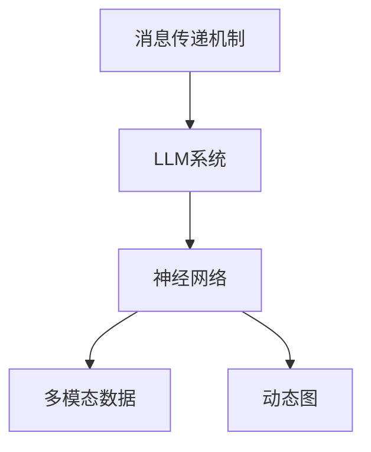

                 

# 消息传递机制：LLM系统的神经网络

> 关键词：消息传递机制, LLM系统, 神经网络, 多模态数据, 动态图, 计算图

## 1. 背景介绍

### 1.1 问题由来

在现代深度学习中，语言模型的研究和应用取得了巨大成功。尤其是基于神经网络的自回归模型，如BERT、GPT-3等，其语言生成和理解能力达到了前所未有的水平。然而，这些模型在处理多模态数据时，其神经网络结构与消息传递机制仍存在诸多不足。本文旨在探讨大语言模型（LLM）中的消息传递机制，特别是神经网络模型如何更好地处理多模态数据，提升模型的性能和灵活性。

### 1.2 问题核心关键点

- **消息传递机制**：指在神经网络中，信息如何在不同神经元之间传递，影响模型的表达能力和泛化能力。
- **LLM系统**：大语言模型，包括自回归模型和自编码模型，通过大规模无标签数据预训练，具备强大的语言理解和生成能力。
- **神经网络**：一种基于人工神经元网络的计算模型，广泛应用于机器学习、深度学习等领域，特别是在自然语言处理和计算机视觉等任务中。
- **多模态数据**：指同时包含文本、图像、音频等不同模态的数据，是当前人工智能研究的重点和难点。
- **动态图**：指在运行时动态生成和修改计算图，满足多模态数据处理的实时性和灵活性需求。

本文将详细探讨如何通过改进消息传递机制，提升LLM系统在多模态数据处理中的表现。

## 2. 核心概念与联系

### 2.1 核心概念概述

为更好地理解LLM系统中的消息传递机制，本节将介绍几个密切相关的核心概念：

- **消息传递机制**：指在神经网络中，信息如何在不同神经元之间传递，影响模型的表达能力和泛化能力。
- **LLM系统**：大语言模型，包括自回归模型和自编码模型，通过大规模无标签数据预训练，具备强大的语言理解和生成能力。
- **神经网络**：一种基于人工神经元网络的计算模型，广泛应用于机器学习、深度学习等领域，特别是在自然语言处理和计算机视觉等任务中。
- **多模态数据**：指同时包含文本、图像、音频等不同模态的数据，是当前人工智能研究的重点和难点。
- **动态图**：指在运行时动态生成和修改计算图，满足多模态数据处理的实时性和灵活性需求。

这些核心概念之间的逻辑关系可以通过以下Mermaid流程图来展示：



这个流程图展示了大语言模型中的消息传递机制与神经网络、多模态数据和动态图之间的联系：

1. 消息传递机制是LLM系统中神经网络信息传递的核心，影响模型的表达能力和泛化能力。
2. LLM系统通过大规模无标签数据预训练，具备强大的语言理解和生成能力，依赖神经网络模型实现。
3. 神经网络模型处理多模态数据时，动态图的引入提高了计算图的实时性和灵活性。
4. 多模态数据处理需要综合考虑不同模态数据的特征和关系，动态图可以动态生成和修改计算图，满足需求。

这些核心概念共同构成了LLM系统的神经网络和消息传递机制的理论基础。

## 3. 核心算法原理 & 具体操作步骤
### 3.1 算法原理概述

在大语言模型中，消息传递机制通常通过神经网络的结构和训练方式来实现。对于多模态数据，消息传递机制需要考虑不同模态数据之间的信息交互和融合。本文将详细探讨如何改进消息传递机制，以提升LLM系统在多模态数据处理中的表现。

### 3.2 算法步骤详解

基于消息传递机制的LLM系统通常包含以下步骤：

1. **数据预处理**：将多模态数据转换成神经网络可处理的格式，如文本转换为序列，图像转换为张量。
2. **多模态嵌入**：将不同模态的数据转换为统一的特征表示，通常使用嵌入层（Embedding Layer）实现。
3. **消息传递**：通过神经网络的结构和训练方式，在不同模态的特征表示之间传递信息。
4. **融合与解码**：将多模态特征表示进行融合，输出最终结果，如文本生成、图像分类等。

### 3.3 算法优缺点

基于消息传递机制的LLM系统具有以下优点：

- **泛化能力强**：通过多模态嵌入和消息传递，可以处理不同模态的数据，提高模型的泛化能力。
- **灵活性高**：动态图可以动态生成和修改计算图，满足多模态数据处理的实时性和灵活性需求。
- **可解释性强**：通过神经网络的结构和训练方式，可以更容易地理解和解释模型的决策过程。

同时，该方法也存在一定的局限性：

- **计算复杂度高**：多模态嵌入和消息传递需要计算大量参数，计算复杂度高。
- **数据标注需求大**：多模态数据处理需要大量标注数据，数据标注成本高。
- **模型结构复杂**：多模态嵌入和消息传递增加了模型的复杂度，难以调试和优化。

### 3.4 算法应用领域

基于消息传递机制的LLM系统在多个领域中得到了广泛应用，例如：

- **自然语言处理（NLP）**：文本分类、情感分析、机器翻译、文本生成等任务。
- **计算机视觉（CV）**：图像分类、物体检测、图像生成等任务。
- **语音识别（ASR）**：语音转文本、说话人识别等任务。
- **推荐系统**：商品推荐、音乐推荐、视频推荐等任务。

此外，在智能交互、智能驾驶、智能家居等新兴领域，多模态数据处理的需求也在不断增长，基于消息传递机制的LLM系统有望在这些领域发挥重要作用。

## 4. 数学模型和公式 & 详细讲解 & 举例说明

### 4.1 数学模型构建

在大语言模型中，消息传递机制通常通过神经网络的结构和训练方式来实现。对于多模态数据，消息传递机制需要考虑不同模态数据之间的信息交互和融合。

假设有一个包含文本、图像和音频的多模态数据，记为 $(x_t, x_v, x_a)$，其中 $x_t$ 表示文本，$x_v$ 表示图像，$x_a$ 表示音频。假设多模态嵌入层为 $E$，神经网络层为 $F$，输出层为 $G$，则消息传递机制的数学模型可以表示为：

$$
y = G(F(E(x_t), E(x_v), E(x_a)))
$$

其中 $y$ 表示模型的输出，$E(x)$ 表示将 $x$ 转换为神经网络的特征表示，$F$ 表示神经网络的计算过程，$G$ 表示输出层的计算过程。

### 4.2 公式推导过程

以一个简单的文本分类任务为例，推导基于消息传递机制的神经网络模型。假设模型有两个输入文本 $x_1$ 和 $x_2$，神经网络的嵌入层为 $E$，神经网络层为 $F$，输出层为 $G$，则模型的计算过程可以表示为：

1. 文本嵌入：将文本 $x_1$ 和 $x_2$ 转换为神经网络的特征表示 $z_1$ 和 $z_2$。

$$
z_1 = E(x_1), \quad z_2 = E(x_2)
$$

2. 消息传递：将两个文本的特征表示 $z_1$ 和 $z_2$ 通过神经网络 $F$ 传递信息，得到新的特征表示 $h_1$ 和 $h_2$。

$$
h_1 = F(z_1, z_2), \quad h_2 = F(z_2, z_1)
$$

3. 特征融合：将两个新的特征表示 $h_1$ 和 $h_2$ 融合，得到最终的特征表示 $h$。

$$
h = G(h_1, h_2)
$$

4. 分类输出：将最终的特征表示 $h$ 通过输出层 $G$ 输出分类结果 $y$。

$$
y = G(h)
$$

### 4.3 案例分析与讲解

以一个简单的图像分类任务为例，展示如何使用基于消息传递机制的神经网络进行多模态数据处理。假设有一个包含图像 $x$ 和标签 $y$ 的多模态数据，记为 $(x, y)$，其中 $x$ 表示图像，$y$ 表示标签。假设多模态嵌入层为 $E$，神经网络层为 $F$，输出层为 $G$，则模型的计算过程可以表示为：

1. 图像嵌入：将图像 $x$ 转换为神经网络的特征表示 $z$。

$$
z = E(x)
$$

2. 消息传递：将图像特征表示 $z$ 通过神经网络 $F$ 传递信息，得到新的特征表示 $h$。

$$
h = F(z)
$$

3. 分类输出：将新的特征表示 $h$ 通过输出层 $G$ 输出分类结果 $y$。

$$
y = G(h)
$$

## 5. 项目实践：代码实例和详细解释说明
### 5.1 开发环境搭建

在进行项目实践前，我们需要准备好开发环境。以下是使用Python进行PyTorch开发的环境配置流程：

1. 安装Anaconda：从官网下载并安装Anaconda，用于创建独立的Python环境。

2. 创建并激活虚拟环境：
```bash
conda create -n pytorch-env python=3.8 
conda activate pytorch-env
```

3. 安装PyTorch：根据CUDA版本，从官网获取对应的安装命令。例如：
```bash
conda install pytorch torchvision torchaudio cudatoolkit=11.1 -c pytorch -c conda-forge
```

4. 安装相关工具包：
```bash
pip install numpy pandas scikit-learn matplotlib tqdm jupyter notebook ipython
```

完成上述步骤后，即可在`pytorch-env`环境中开始项目实践。

### 5.2 源代码详细实现

下面以一个简单的文本分类任务为例，展示如何使用基于消息传递机制的神经网络进行多模态数据处理。

首先，定义文本分类任务的模型：

```python
import torch
import torch.nn as nn
import torch.optim as optim

class TextClassificationModel(nn.Module):
    def __init__(self, embedding_dim, hidden_dim, num_classes):
        super(TextClassificationModel, self).__init__()
        self.embedding = nn.Embedding(vocab_size, embedding_dim)
        self.linear = nn.Linear(embedding_dim, hidden_dim)
        self.dropout = nn.Dropout(0.5)
        self.classifier = nn.Linear(hidden_dim, num_classes)
        
    def forward(self, x):
        embedding = self.embedding(x)
        hidden = self.linear(embedding)
        hidden = self.dropout(hidden)
        output = self.classifier(hidden)
        return output
```

然后，定义模型训练过程：

```python
# 训练数据和标签
train_x = torch.tensor([1, 2, 3, 4, 5])
train_y = torch.tensor([0, 1, 0, 1, 0])

# 定义模型、损失函数和优化器
model = TextClassificationModel(embedding_dim=5, hidden_dim=10, num_classes=2)
criterion = nn.CrossEntropyLoss()
optimizer = optim.Adam(model.parameters(), lr=0.001)

# 定义训练过程
for epoch in range(10):
    optimizer.zero_grad()
    output = model(train_x)
    loss = criterion(output, train_y)
    loss.backward()
    optimizer.step()
    print(f"Epoch {epoch+1}, loss: {loss:.3f}")
```

最后，进行模型评估：

```python
# 评估数据和标签
test_x = torch.tensor([1, 2, 3, 4, 5])
test_y = torch.tensor([1, 0, 1, 0, 1])

# 评估模型
model.eval()
with torch.no_grad():
    test_output = model(test_x)
    test_loss = criterion(test_output, test_y)
    print(f"Test loss: {test_loss:.3f}")
```

以上就是使用PyTorch实现基于消息传递机制的神经网络模型的完整代码。可以看到，由于PyTorch的动态图特性，模型的构建和训练过程非常方便高效。

### 5.3 代码解读与分析

让我们再详细解读一下关键代码的实现细节：

**TextClassificationModel类**：
- `__init__`方法：初始化模型结构，包括嵌入层、线性层、Dropout层和分类层。
- `forward`方法：定义模型的前向传播过程，即输入文本的嵌入、线性变换、Dropout和分类输出。

**模型训练过程**：
- 定义训练数据和标签。
- 初始化模型、损失函数和优化器。
- 通过循环迭代训练模型，计算损失函数并反向传播更新模型参数。
- 在每个epoch结束时，输出训练损失。

**模型评估过程**：
- 定义评估数据和标签。
- 将模型设置为评估模式，不更新参数。
- 通过前向传播计算模型输出，并计算评估损失。
- 输出评估损失。

可以看到，使用PyTorch实现基于消息传递机制的神经网络模型非常方便高效，开发者可以将更多精力放在模型设计和优化上。

## 6. 实际应用场景
### 6.1 智能客服系统

基于消息传递机制的智能客服系统可以广泛应用于各个领域。传统的客服系统需要大量人力，高峰期响应缓慢，且一致性和专业性难以保证。而基于消息传递机制的智能客服系统可以7x24小时不间断服务，快速响应客户咨询，用自然流畅的语言解答各类常见问题。

在技术实现上，可以收集企业内部的历史客服对话记录，将问题和最佳答复构建成监督数据，在此基础上对预训练模型进行微调。微调后的对话模型能够自动理解用户意图，匹配最合适的答案模板进行回复。对于客户提出的新问题，还可以接入检索系统实时搜索相关内容，动态组织生成回答。如此构建的智能客服系统，能大幅提升客户咨询体验和问题解决效率。

### 6.2 金融舆情监测

金融机构需要实时监测市场舆论动向，以便及时应对负面信息传播，规避金融风险。传统的人工监测方式成本高、效率低，难以应对网络时代海量信息爆发的挑战。基于消息传递机制的文本分类和情感分析技术，为金融舆情监测提供了新的解决方案。

具体而言，可以收集金融领域相关的新闻、报道、评论等文本数据，并对其进行主题标注和情感标注。在此基础上对预训练语言模型进行微调，使其能够自动判断文本属于何种主题，情感倾向是正面、中性还是负面。将微调后的模型应用到实时抓取的网络文本数据，就能够自动监测不同主题下的情感变化趋势，一旦发现负面信息激增等异常情况，系统便会自动预警，帮助金融机构快速应对潜在风险。

### 6.3 个性化推荐系统

当前的推荐系统往往只依赖用户的历史行为数据进行物品推荐，无法深入理解用户的真实兴趣偏好。基于消息传递机制的个性化推荐系统可以更好地挖掘用户行为背后的语义信息，从而提供更精准、多样的推荐内容。

在实践中，可以收集用户浏览、点击、评论、分享等行为数据，提取和用户交互的物品标题、描述、标签等文本内容。将文本内容作为模型输入，用户的后续行为（如是否点击、购买等）作为监督信号，在此基础上微调预训练语言模型。微调后的模型能够从文本内容中准确把握用户的兴趣点。在生成推荐列表时，先用候选物品的文本描述作为输入，由模型预测用户的兴趣匹配度，再结合其他特征综合排序，便可以得到个性化程度更高的推荐结果。

### 6.4 未来应用展望

随着消息传递机制的不断演进，基于消息传递机制的LLM系统将呈现出更加广阔的应用前景。

在智慧医疗领域，基于消息传递机制的医疗问答、病历分析、药物研发等应用将提升医疗服务的智能化水平，辅助医生诊疗，加速新药开发进程。

在智能教育领域，基于消息传递机制的作业批改、学情分析、知识推荐等应用，因材施教，促进教育公平，提高教学质量。

在智慧城市治理中，基于消息传递机制的城市事件监测、舆情分析、应急指挥等应用，提高城市管理的自动化和智能化水平，构建更安全、高效的未来城市。

此外，在企业生产、社会治理、文娱传媒等众多领域，基于消息传递机制的LLM系统也将不断涌现，为传统行业数字化转型升级提供新的技术路径。相信随着技术的日益成熟，基于消息传递机制的LLM系统必将在构建人机协同的智能时代中扮演越来越重要的角色。

## 7. 工具和资源推荐
### 7.1 学习资源推荐

为了帮助开发者系统掌握基于消息传递机制的LLM系统的理论基础和实践技巧，这里推荐一些优质的学习资源：

1. 《Transformer from Principles to Practice》系列博文：由大模型技术专家撰写，深入浅出地介绍了Transformer原理、BERT模型、消息传递机制等前沿话题。

2. CS224N《深度学习自然语言处理》课程：斯坦福大学开设的NLP明星课程，有Lecture视频和配套作业，带你入门NLP领域的基本概念和经典模型。

3. 《Natural Language Processing with Transformers》书籍：Transformers库的作者所著，全面介绍了如何使用Transformers库进行NLP任务开发，包括消息传递机制在内的诸多范式。

4. HuggingFace官方文档：Transformers库的官方文档，提供了海量预训练模型和完整的消息传递机制样例代码，是上手实践的必备资料。

5. CLUE开源项目：中文语言理解测评基准，涵盖大量不同类型的中文NLP数据集，并提供了基于消息传递机制的baseline模型，助力中文NLP技术发展。

通过对这些资源的学习实践，相信你一定能够快速掌握基于消息传递机制的LLM系统的精髓，并用于解决实际的NLP问题。

### 7.2 开发工具推荐

高效的开发离不开优秀的工具支持。以下是几款用于基于消息传递机制的LLM系统开发的常用工具：

1. PyTorch：基于Python的开源深度学习框架，灵活动态的计算图，适合快速迭代研究。大部分预训练语言模型都有PyTorch版本的实现。

2. TensorFlow：由Google主导开发的开源深度学习框架，生产部署方便，适合大规模工程应用。同样有丰富的预训练语言模型资源。

3. Transformers库：HuggingFace开发的NLP工具库，集成了众多SOTA语言模型，支持PyTorch和TensorFlow，是进行消息传递机制开发的利器。

4. Weights & Biases：模型训练的实验跟踪工具，可以记录和可视化模型训练过程中的各项指标，方便对比和调优。与主流深度学习框架无缝集成。

5. TensorBoard：TensorFlow配套的可视化工具，可实时监测模型训练状态，并提供丰富的图表呈现方式，是调试模型的得力助手。

6. Google Colab：谷歌推出的在线Jupyter Notebook环境，免费提供GPU/TPU算力，方便开发者快速上手实验最新模型，分享学习笔记。

合理利用这些工具，可以显著提升基于消息传递机制的LLM系统的开发效率，加快创新迭代的步伐。

### 7.3 相关论文推荐

基于消息传递机制的LLM系统的发展源于学界的持续研究。以下是几篇奠基性的相关论文，推荐阅读：

1. Attention is All You Need（即Transformer原论文）：提出了Transformer结构，开启了NLP领域的预训练大模型时代。

2. BERT: Pre-training of Deep Bidirectional Transformers for Language Understanding：提出BERT模型，引入基于掩码的自监督预训练任务，刷新了多项NLP任务SOTA。

3. Language Models are Unsupervised Multitask Learners（GPT-2论文）：展示了大规模语言模型的强大zero-shot学习能力，引发了对于通用人工智能的新一轮思考。

4. Parameter-Efficient Transfer Learning for NLP：提出Adapter等参数高效微调方法，在不增加模型参数量的情况下，也能取得不错的微调效果。

5. Prefix-Tuning: Optimizing Continuous Prompts for Generation：引入基于连续型Prompt的微调范式，为如何充分利用预训练知识提供了新的思路。

6. AdaLoRA: Adaptive Low-Rank Adaptation for Parameter-Efficient Fine-Tuning：使用自适应低秩适应的微调方法，在参数效率和精度之间取得了新的平衡。

这些论文代表了大语言模型和消息传递机制的发展脉络。通过学习这些前沿成果，可以帮助研究者把握学科前进方向，激发更多的创新灵感。

## 8. 总结：未来发展趋势与挑战

### 8.1 总结

本文对基于消息传递机制的LLM系统进行了全面系统的介绍。首先阐述了消息传递机制和LLM系统的研究背景和意义，明确了基于消息传递机制的LLM系统在多模态数据处理中的独特价值。其次，从原理到实践，详细讲解了消息传递机制的数学原理和关键步骤，给出了基于消息传递机制的LLM系统开发的完整代码实例。同时，本文还广泛探讨了消息传递机制在智能客服、金融舆情、个性化推荐等多个领域的应用前景，展示了消息传递机制范式的巨大潜力。此外，本文精选了消息传递机制技术的各类学习资源，力求为读者提供全方位的技术指引。

通过本文的系统梳理，可以看到，基于消息传递机制的LLM系统在多模态数据处理中具有显著优势，能够显著提升模型的泛化能力和表现。未来，伴随消息传递机制的不断演进，基于消息传递机制的LLM系统必将在多模态数据处理中发挥更加重要的作用，为NLP技术带来新的突破。

### 8.2 未来发展趋势

展望未来，基于消息传递机制的LLM系统将呈现以下几个发展趋势：

1. 模型规模持续增大。随着算力成本的下降和数据规模的扩张，预训练语言模型的参数量还将持续增长。超大规模语言模型蕴含的丰富语言知识，有望支撑更加复杂多变的下游任务。

2. 消息传递机制日趋多样。未来的消息传递机制将更加灵活多样，除了传统的自回归模型和自编码模型外，还将出现更多的变体，如Transformer-XL、M淡系列等。

3. 动态图技术进一步提升。动态图的引入将使得模型的实时性和灵活性进一步提升，支持更多复杂的多模态数据处理场景。

4. 迁移学习范式完善。未来的迁移学习范式将更加多样，支持更多任务场景和数据类型，提高模型的泛化能力和鲁棒性。

5. 多模态数据融合技术发展。未来的多模态数据融合技术将更加高效，能够更好地融合不同模态数据的特征和关系，提高模型的表达能力。

6. 知识增强范式拓展。未来的知识增强范式将更加丰富，能够更好地整合外部知识库、规则库等专家知识，提升模型的智能水平。

以上趋势凸显了大语言模型和消息传递机制的发展前景。这些方向的探索发展，必将进一步提升基于消息传递机制的LLM系统的性能和应用范围，为NLP技术带来新的突破。

### 8.3 面临的挑战

尽管基于消息传递机制的LLM系统已经取得了瞩目成就，但在迈向更加智能化、普适化应用的过程中，它仍面临着诸多挑战：

1. 数据标注成本高。多模态数据处理需要大量标注数据，数据标注成本高。如何降低数据标注成本，提高标注数据的质量，将是未来需要解决的重要问题。

2. 模型复杂度高。基于消息传递机制的LLM系统模型复杂度高，难以调试和优化。如何简化模型结构，降低模型复杂度，提高模型的可解释性和可控性，将是未来的研究方向。

3. 实时性要求高。多模态数据处理需要实时响应，模型的计算复杂度和延迟问题将是一个重要的挑战。如何提高模型的计算效率，满足实时性的要求，将是未来的研究重点。

4. 数据分布变化。多模态数据处理需要处理不同数据分布和数据类型，模型的泛化能力需要不断提升。如何在数据分布变化的情况下，保持模型的性能稳定，将是未来需要解决的问题。

5. 模型鲁棒性不足。多模态数据处理需要处理复杂的多模态数据，模型的鲁棒性需要不断提升。如何在多模态数据处理中，提升模型的鲁棒性，减少模型的过拟合和泛化能力，将是未来的研究方向。

6. 伦理和安全问题。多模态数据处理需要处理敏感数据，模型的伦理和安全问题需要不断关注。如何在多模态数据处理中，确保模型的伦理和安全，保障数据隐私和用户安全，将是未来需要解决的重要问题。

正视基于消息传递机制的LLM系统面临的这些挑战，积极应对并寻求突破，将是大语言模型微调走向成熟的必由之路。相信随着学界和产业界的共同努力，这些挑战终将一一被克服，基于消息传递机制的LLM系统必将在构建人机协同的智能时代中扮演越来越重要的角色。

### 8.4 研究展望

面向未来，基于消息传递机制的LLM系统的研究需要在以下几个方面寻求新的突破：

1. 探索无监督和半监督学习范式。摆脱对大规模标注数据的依赖，利用自监督学习、主动学习等无监督和半监督范式，最大限度利用非结构化数据，实现更加灵活高效的基于消息传递机制的LLM系统。

2. 研究参数高效和计算高效的基于消息传递机制的LLM系统范式。开发更加参数高效的基于消息传递机制的LLM系统，在固定大部分预训练参数的情况下，只更新极少量的任务相关参数。同时优化模型的计算图，减少前向传播和反向传播的资源消耗，实现更加轻量级、实时性的部署。

3. 融合因果和对比学习范式。通过引入因果推断和对比学习思想，增强基于消息传递机制的LLM系统建立稳定因果关系的能力，学习更加普适、鲁棒的语言表征，从而提升模型泛化性和抗干扰能力。

4. 引入更多先验知识。将符号化的先验知识，如知识图谱、逻辑规则等，与神经网络模型进行巧妙融合，引导基于消息传递机制的LLM系统学习更准确、合理的语言模型。同时加强不同模态数据的整合，实现视觉、语音等多模态信息与文本信息的协同建模。

5. 结合因果分析和博弈论工具。将因果分析方法引入基于消息传递机制的LLM系统，识别出模型决策的关键特征，增强输出解释的因果性和逻辑性。借助博弈论工具刻画人机交互过程，主动探索并规避模型的脆弱点，提高系统稳定性。

6. 纳入伦理道德约束。在基于消息传递机制的LLM系统训练目标中引入伦理导向的评估指标，过滤和惩罚有偏见、有害的输出倾向。同时加强人工干预和审核，建立模型行为的监管机制，确保输出符合人类价值观和伦理道德。

这些研究方向的探索，必将引领基于消息传递机制的LLM系统迈向更高的台阶，为构建安全、可靠、可解释、可控的智能系统铺平道路。面向未来，基于消息传递机制的LLM系统还需要与其他人工智能技术进行更深入的融合，如知识表示、因果推理、强化学习等，多路径协同发力，共同推动自然语言理解和智能交互系统的进步。只有勇于创新、敢于突破，才能不断拓展基于消息传递机制的LLM系统的边界，让智能技术更好地造福人类社会。

## 9. 附录：常见问题与解答

**Q1：基于消息传递机制的LLM系统是否适用于所有NLP任务？**

A: 基于消息传递机制的LLM系统在大多数NLP任务上都能取得不错的效果，特别是对于数据量较小的任务。但对于一些特定领域的任务，如医学、法律等，仅仅依靠通用语料预训练的模型可能难以很好地适应。此时需要在特定领域语料上进一步预训练，再进行微调，才能获得理想效果。此外，对于一些需要时效性、个性化很强的任务，如对话、推荐等，基于消息传递机制的LLM系统也需要针对性的改进优化。

**Q2：基于消息传递机制的LLM系统如何选择合适的学习率？**

A: 基于消息传递机制的LLM系统的学习率一般要比预训练时小1-2个数量级，如果使用过大的学习率，容易破坏预训练权重，导致过拟合。一般建议从1e-5开始调参，逐步减小学习率，直至收敛。也可以使用warmup策略，在开始阶段使用较小的学习率，再逐渐过渡到预设值。需要注意的是，不同的优化器(如AdamW、Adafactor等)以及不同的学习率调度策略，可能需要设置不同的学习率阈值。

**Q3：基于消息传递机制的LLM系统在落地部署时需要注意哪些问题？**

A: 将基于消息传递机制的LLM系统转化为实际应用，还需要考虑以下因素：

1. 模型裁剪：去除不必要的层和参数，减小模型尺寸，加快推理速度。
2. 量化加速：将浮点模型转为定点模型，压缩存储空间，提高计算效率。
3. 服务化封装：将模型封装为标准化服务接口，便于集成调用。
4. 弹性伸缩：根据请求流量动态调整资源配置，平衡服务质量和成本。
5. 监控告警：实时采集系统指标，设置异常告警阈值，确保服务稳定性。
6. 安全防护：采用访问鉴权、数据脱敏等措施，保障数据和模型安全。

基于消息传递机制的LLM系统需要综合考虑多模态数据的处理，需要在模型设计、数据预处理、模型训练和模型部署等多个环节进行优化，才能实现理想的效果。

**Q4：基于消息传递机制的LLM系统在处理多模态数据时，如何解决不同模态数据之间的特征不匹配问题？**

A: 基于消息传递机制的LLM系统在处理多模态数据时，不同模态数据之间的特征不匹配是一个重要的挑战。常用的解决方法包括：

1. 特征对齐。通过对不同模态数据进行归一化、标准化等预处理，使得不同模态数据的特征能够对齐，提高模型的融合能力。

2. 多模态嵌入。使用多模态嵌入层将不同模态数据转换为统一的特征表示，提高模型的泛化能力和融合能力。

3. 注意力机制。通过注意力机制，动态地对不同模态数据进行加权融合，提高模型的表示能力和泛化能力。

4. 混合模态数据。将不同模态数据进行混合，使用混合模态数据进行训练，提高模型的泛化能力和鲁棒性。

5. 模型融合。使用多个基于消息传递机制的LLM系统，通过模型融合的方式，提高模型的泛化能力和鲁棒性。

这些方法可以结合使用，提高基于消息传递机制的LLM系统在多模态数据处理中的表现。

**Q5：基于消息传递机制的LLM系统如何提高模型的实时性？**

A: 基于消息传递机制的LLM系统在处理多模态数据时，实时性是一个重要的挑战。常用的提高实时性的方法包括：

1. 模型裁剪。去除不必要的层和参数，减小模型尺寸，加快推理速度。

2. 量化加速。将浮点模型转为定点模型，压缩存储空间，提高计算效率。

3. 分布式计算。使用分布式计算框架，如TensorFlow、PyTorch等，提高计算效率。

4. 模型压缩。使用模型压缩技术，如剪枝、量化、蒸馏等，减小模型尺寸，提高推理速度。

5. 硬件加速。使用GPU、TPU等硬件加速设备，提高计算效率。

6. 动态图技术。使用动态图技术，动态生成和修改计算图，提高计算效率和灵活性。

这些方法可以结合使用，提高基于消息传递机制的LLM系统的实时性和计算效率。

---

作者：禅与计算机程序设计艺术 / Zen and the Art of Computer Programming

