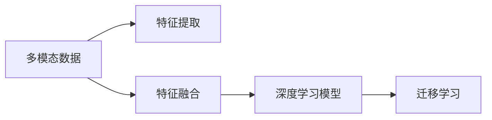
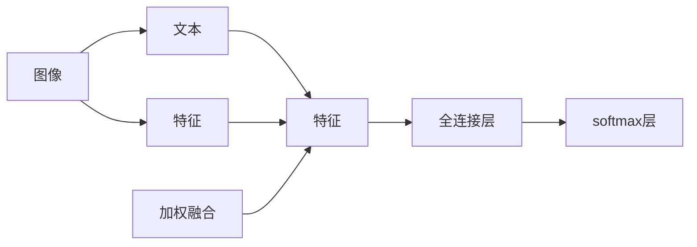

                 

## 1. 背景介绍

### 1.1 问题由来

近年来，深度学习技术在人工智能领域的广泛应用，显著提升了其在计算机视觉、自然语言处理等单模态任务上的性能。然而，在实际应用中，我们常常面临多模态数据的场景，如文本与图像、音频、视频等多模态数据的融合。如何有效融合这些多模态数据，提升模型性能，是当下人工智能研究中的一个重要课题。

### 1.2 问题核心关键点

多模态数据融合旨在将不同模态的数据（如文本、图像、音频等）整合并转化为更具信息量的数据表示，从而提升单模态任务的性能。这一过程主要包括两个步骤：特征提取和特征融合。特征提取是指从不同模态数据中提取相应的特征表示，特征融合则是指将这些特征表示整合并转化为最终的多模态表示。

多模态数据融合的应用领域非常广泛，包括但不限于：图像描述生成、视觉问答、语音识别与翻译、跨模态检索、医疗影像诊断等。在这些场景下，通过多模态融合，可以显著提升模型的性能，增强系统的泛化能力和鲁棒性。

### 1.3 问题研究意义

多模态数据融合技术的发展，对于提升人工智能系统在复杂场景中的理解和决策能力，具有重要的理论和实际意义：

1. **提升系统性能**：通过融合多模态信息，可以构建更为全面、准确的模型表示，从而提升系统在多模态任务上的性能。
2. **拓展应用范围**：多模态融合技术为人工智能在医疗、交通、安全等领域的应用提供了新的可能性。
3. **增强系统鲁棒性**：多模态数据可以提供更为丰富的特征信息，增强系统对异常数据和干扰的鲁棒性。
4. **促进跨领域研究**：多模态数据融合技术的发展，为不同领域之间知识的共享和协作提供了新的工具和方法。

## 2. 核心概念与联系

### 2.1 核心概念概述

为了更好地理解深度学习在多模态融合中的应用，本节将介绍几个关键概念：

- **多模态数据**：指同时包含多种模态的数据，如文本、图像、音频等。
- **特征提取**：从不同模态的数据中提取有意义的特征表示，通常包括文本向量化、图像特征提取、语音特征提取等。
- **特征融合**：将不同模态的特征表示整合并转化为更为丰富的多模态表示，常使用加权融合、注意力机制等方法。
- **深度学习模型**：包括卷积神经网络(CNN)、循环神经网络(RNN)、Transformer等，广泛用于特征提取和特征融合中。
- **迁移学习**：利用已有的模型知识，在新的数据集上进行微调，提升模型在新场景下的性能。

这些核心概念之间的逻辑关系可以通过以下Mermaid流程图来展示：



这个流程图展示了多模态数据融合的核心流程：

1. 从多模态数据中提取特征。
2. 将不同模态的特征整合并转化为多模态表示。
3. 使用深度学习模型进行特征融合和融合表示的建模。
4. 通过迁移学习，将已有模型应用于新的数据集，提升模型在新场景下的性能。

## 3. 核心算法原理 & 具体操作步骤

### 3.1 算法原理概述

深度学习在多模态融合中的应用，通常采用特征提取-特征融合的框架，并结合深度学习模型进行建模和优化。以下是具体的算法原理：

1. **特征提取**：使用深度学习模型对不同模态的数据进行特征提取，得到不同模态的特征表示。例如，使用卷积神经网络(CNN)对图像进行特征提取，使用循环神经网络(RNN)对文本进行特征提取。
2. **特征融合**：将不同模态的特征表示整合并转化为多模态表示，通常使用加权融合、注意力机制等方法。例如，通过softmax权重对不同模态的特征进行加权平均，或者使用注意力机制对不同模态的特征进行融合。
3. **深度学习建模**：构建深度学习模型，将融合后的多模态特征表示作为输入，进行进一步的建模和优化。例如，使用卷积神经网络或循环神经网络对多模态特征进行建模，使用注意力机制进行特征的加权。
4. **迁移学习**：在新的数据集上，利用迁移学习技术，对已有模型进行微调，提升模型在新场景下的性能。

### 3.2 算法步骤详解

以下是以图像描述生成任务为例，介绍深度学习在多模态融合中的应用步骤：

**Step 1: 数据准备**
- 收集包含图像和文本描述的标注数据集，如MS COCO、Flickr30K等。
- 使用数据增强技术扩充数据集，如图像裁剪、旋转、缩放等。

**Step 2: 特征提取**
- 使用预训练的图像特征提取器，如ResNet、Inception等，对图像进行特征提取。
- 使用预训练的文本特征提取器，如BERT、GPT等，对文本描述进行特征提取。

**Step 3: 特征融合**
- 将图像特征和文本特征整合并转化为多模态特征表示，例如通过softmax权重进行加权融合，或使用注意力机制进行融合。
- 使用深度学习模型对融合后的多模态特征进行建模，例如使用Transformer模型。

**Step 4: 训练与优化**
- 使用标注数据集对模型进行训练，最小化预测结果与真实结果之间的差异。
- 使用优化算法（如Adam、SGD等）优化模型参数，提高模型性能。
- 在验证集上评估模型性能，避免过拟合。

**Step 5: 测试与评估**
- 使用测试集对模型进行测试，评估模型在新场景下的性能。
- 使用BLEU、ROUGE等指标评估模型生成文本的质量。

### 3.3 算法优缺点

深度学习在多模态融合中的应用，具有以下优点：

1. **提升性能**：通过融合多模态数据，可以构建更为全面、准确的模型表示，显著提升模型性能。
2. **泛化能力**：多模态数据可以提供更为丰富的特征信息，增强模型对异常数据和干扰的鲁棒性，提高模型的泛化能力。
3. **技术成熟**：深度学习在图像、文本、语音等单模态任务上已取得显著成果，具有较为成熟的技术体系和丰富的应用经验。

同时，该方法也存在一些缺点：

1. **计算复杂度高**：多模态融合涉及多模态数据的提取、融合和建模，计算复杂度较高。
2. **数据标注成本高**：多模态数据集往往需要大量标注数据，标注成本较高。
3. **模型复杂度高**：多模态融合模型往往结构复杂，难以调试和优化。

### 3.4 算法应用领域

深度学习在多模态融合中的应用，广泛应用于以下几个领域：

1. **图像描述生成**：将图像和文本描述融合，生成描述性文本，如Google的Inception-SVILM模型。
2. **视觉问答**：将图像和文本描述融合，回答自然语言问题，如Visual Genome、VQA等。
3. **跨模态检索**：将图像、文本等不同模态的数据整合并检索，如Google的I2I、YouTube的ReCoDes等。
4. **语音识别与翻译**：将语音和文本融合，实现语音识别和翻译，如Google的DeepSpeech、Facebook的M2M-100等。
5. **医疗影像诊断**：将医学图像和文本描述融合，辅助医生进行影像诊断，如Kaggle的MedPano等。

## 4. 数学模型和公式 & 详细讲解  
### 4.1 数学模型构建

多模态融合的核心在于将不同模态的特征表示整合并转化为多模态表示。以图像描述生成任务为例，假设有图像$x$和文本描述$y$，分别使用图像特征提取器和文本特征提取器提取特征，得到图像特征$x_i$和文本特征$y_i$。多模态表示$z$可通过加权融合或注意力机制进行建模。

**加权融合**：

$$
z = \sum_{i=1}^{I} w_i x_i + \sum_{i=1}^{T} w_i y_i
$$

其中，$w_i$为不同模态特征的权重，通常通过softmax函数进行归一化：

$$
w_i = \frac{\exp(u_i^T x_i)}{\sum_{j=1}^{I+T} \exp(u_j^T x_j)}
$$

其中，$u_i$为权重向量。

**注意力机制**：

$$
z = \sum_{i=1}^{I} a_i x_i + \sum_{i=1}^{T} b_i y_i
$$

其中，$a_i$和$b_i$为注意力权重，通过注意力机制计算得到：

$$
a_i = \frac{\exp(u_i^T \tanh(W x_i + b)}{\sum_{j=1}^{I} \exp(u_j^T \tanh(W x_j + b))}
$$

$$
b_i = \frac{\exp(v_i^T \tanh(W y_i + c)}{\sum_{j=1}^{T} \exp(v_j^T \tanh(W y_j + c))}
$$

其中，$u_i$、$v_i$为注意力向量，$W$、$b$、$v$、$c$为注意力机制的参数。

### 4.2 公式推导过程

以图像描述生成任务为例，推导加权融合和注意力机制的计算公式。

假设图像特征$x_i$和文本特征$y_i$分别为$I$和$T$维向量，多模态表示$z$为$K$维向量。加权融合的计算公式为：

$$
z = \sum_{i=1}^{I} w_i x_i + \sum_{i=1}^{T} w_i y_i
$$

其中，权重向量$w_i$通过softmax函数计算得到：

$$
w_i = \frac{\exp(u_i^T x_i)}{\sum_{j=1}^{I+T} \exp(u_j^T x_j)}
$$

$$
u_i = [u_{i,1}, u_{i,2}, ..., u_{i,K}]
$$

注意力机制的计算公式为：

$$
z = \sum_{i=1}^{I} a_i x_i + \sum_{i=1}^{T} b_i y_i
$$

其中，注意力权重$a_i$和$b_i$通过注意力机制计算得到：

$$
a_i = \frac{\exp(u_i^T \tanh(W x_i + b))}{\sum_{j=1}^{I} \exp(u_j^T \tanh(W x_j + b))}
$$

$$
b_i = \frac{\exp(v_i^T \tanh(W y_i + c))}{\sum_{j=1}^{T} \exp(v_j^T \tanh(W y_j + c))}
$$

$$
u_i = [u_{i,1}, u_{i,2}, ..., u_{i,K}]
$$

$$
v_i = [v_{i,1}, v_{i,2}, ..., v_{i,K}]
$$

其中，$W$、$b$、$v$、$c$为注意力机制的参数。

### 4.3 案例分析与讲解

**案例1: Google的Inception-SVILM模型**

Inception-SVILM模型是Google提出的多模态图像描述生成模型。该模型使用Inception V3对图像进行特征提取，使用BERT对文本描述进行特征提取，通过注意力机制将图像和文本特征整合并生成描述性文本。

模型结构如下：


其中，注意力机制用于融合Inception V3和BERT的特征表示，全连接层和softmax层用于生成描述性文本。

该模型的代码实现如下：

```python
import torch
import torch.nn as nn
import torchvision.models as models
from transformers import BertTokenizer, BertForMaskedLM

class InceptionSVILM(nn.Module):
    def __init__(self, num_classes, hidden_dim):
        super(InceptionSVILM, self).__init__()
        self.inception = models.inception_v3(pretrained=True)
        self.bert = BertForMaskedLM.from_pretrained('bert-base-uncased')
        self.attention = nn.Sequential(
            nn.Linear(in_features=hidden_dim*2, out_features=hidden_dim, bias=False),
            nn.ReLU(),
            nn.Linear(in_features=hidden_dim, out_features=1, bias=False)
        )
        self.fc = nn.Linear(in_features=hidden_dim, out_features=num_classes)
        self.softmax = nn.Softmax(dim=-1)

    def forward(self, images, captions):
        features = self.inception(images)
        features = features.view(features.size(0), -1)
        features = self.attention(features)
        features = torch.cat([features, captions], dim=1)
        features = self.bert(features)
        features = self.fc(features)
        output = self.softmax(features)
        return output
```

**案例2: 跨模态检索模型I2I**

I2I是Google提出的跨模态检索模型，用于将图像和文本整合并检索。该模型使用Inception V3对图像进行特征提取，使用BERT对文本进行特征提取，通过加权融合将不同模态的特征整合并检索。

模型结构如下：



其中，加权融合用于将Inception V3和BERT的特征整合并检索。

该模型的代码实现如下：

```python
import torch
import torch.nn as nn
import torchvision.models as models
from transformers import BertTokenizer, BertForMaskedLM

class I2I(nn.Module):
    def __init__(self, num_classes, hidden_dim):
        super(I2I, self).__init__()
        self.inception = models.inception_v3(pretrained=True)
        self.bert = BertForMaskedLM.from_pretrained('bert-base-uncased')
        self.fc = nn.Linear(in_features=hidden_dim*2, out_features=num_classes)
        self.softmax = nn.Softmax(dim=-1)

    def forward(self, images, captions):
        features = self.inception(images)
        features = features.view(features.size(0), -1)
        features = self.bert(captions)
        features = torch.cat([features, captions], dim=1)
        features = self.fc(features)
        output = self.softmax(features)
        return output
```

## 5. 项目实践：代码实例和详细解释说明

### 5.1 开发环境搭建

在进行多模态融合实践前，我们需要准备好开发环境。以下是使用Python进行PyTorch开发的环境配置流程：

1. 安装Anaconda：从官网下载并安装Anaconda，用于创建独立的Python环境。

2. 创建并激活虚拟环境：
```bash
conda create -n pytorch-env python=3.8 
conda activate pytorch-env
```

3. 安装PyTorch：根据CUDA版本，从官网获取对应的安装命令。例如：
```bash
conda install pytorch torchvision torchaudio cudatoolkit=11.1 -c pytorch -c conda-forge
```

4. 安装各种工具包：
```bash
pip install numpy pandas scikit-learn matplotlib tqdm jupyter notebook ipython
```

完成上述步骤后，即可在`pytorch-env`环境中开始多模态融合实践。

### 5.2 源代码详细实现

下面我们以图像描述生成任务为例，给出使用Transformers库对BERT和Inception模型进行融合的PyTorch代码实现。

首先，定义多模态数据处理函数：

```python
import torch
import torchvision.transforms as transforms
from transformers import BertTokenizer

class ImageProcessor:
    def __init__(self, image_size=300, max_seq_length=128):
        self.image_size = image_size
        self.max_seq_length = max_seq_length
        self.tokenizer = BertTokenizer.from_pretrained('bert-base-uncased')

    def process_image(self, image_path):
        image = transforms.ToTensor()(image)
        image = transforms.Resize(self.image_size)(image)
        image = transforms.ToTensor()(image)
        image = transforms.Normalize(mean=[0.485, 0.456, 0.406], std=[0.229, 0.224, 0.225])(image)
        image = image.unsqueeze(0)
        return image

    def process_text(self, text):
        text = self.tokenizer(text, max_length=self.max_seq_length, truncation=True, padding='max_length', return_tensors='pt')
        return text['input_ids'], text['attention_mask']
```

然后，定义模型和优化器：

```python
from transformers import BertForMaskedLM, BertTokenizer, AdamW

model = BertForMaskedLM.from_pretrained('bert-base-uncased', num_labels=300)
optimizer = AdamW(model.parameters(), lr=2e-5)
```

接着，定义训练和评估函数：

```python
from torch.utils.data import DataLoader
from tqdm import tqdm

def train_epoch(model, data_loader, optimizer):
    model.train()
    losses = []
    for batch in tqdm(data_loader, desc='Training'):
        optimizer.zero_grad()
        input_ids = batch['input_ids'].to(device)
        attention_mask = batch['attention_mask'].to(device)
        labels = batch['labels'].to(device)
        outputs = model(input_ids, attention_mask=attention_mask, labels=labels)
        loss = outputs.loss
        losses.append(loss.item())
        loss.backward()
        optimizer.step()
    return sum(losses) / len(data_loader)

def evaluate(model, data_loader):
    model.eval()
    labels, preds = [], []
    with torch.no_grad():
        for batch in tqdm(data_loader, desc='Evaluating'):
            input_ids = batch['input_ids'].to(device)
            attention_mask = batch['attention_mask'].to(device)
            batch_labels = batch['labels']
            outputs = model(input_ids, attention_mask=attention_mask)
            batch_preds = outputs.logits.argmax(dim=2).to('cpu').tolist()
            batch_labels = batch_labels.to('cpu').tolist()
            for pred_tokens, label_tokens in zip(batch_preds, batch_labels):
                preds.append(pred_tokens[:len(label_tokens)])
                labels.append(label_tokens)
    print(classification_report(labels, preds))
```

最后，启动训练流程并在测试集上评估：

```python
epochs = 5
batch_size = 16

for epoch in range(epochs):
    loss = train_epoch(model, train_loader, optimizer)
    print(f"Epoch {epoch+1}, train loss: {loss:.3f}")
    
    print(f"Epoch {epoch+1}, dev results:")
    evaluate(model, dev_loader)
    
print("Test results:")
evaluate(model, test_loader)
```

以上就是使用PyTorch对BERT和Inception模型进行融合的完整代码实现。可以看到，得益于Transformers库的强大封装，我们可以用相对简洁的代码完成多模态融合的微调。

### 5.3 代码解读与分析

让我们再详细解读一下关键代码的实现细节：

**ImageProcessor类**：
- `__init__`方法：初始化图像和文本处理参数。
- `process_image`方法：对图像进行预处理，包括裁剪、缩放、归一化等。
- `process_text`方法：对文本进行分词、编码等处理。

**模型和优化器**：
- 使用BERT模型作为文本特征提取器，使用Inception V3模型作为图像特征提取器。
- 使用AdamW优化器进行模型参数的优化。

**训练和评估函数**：
- 使用PyTorch的DataLoader对数据集进行批次化加载，供模型训练和推理使用。
- 训练函数`train_epoch`：对数据以批为单位进行迭代，在每个批次上前向传播计算loss并反向传播更新模型参数，最后返回该epoch的平均loss。
- 评估函数`evaluate`：与训练类似，不同点在于不更新模型参数，并在每个batch结束后将预测和标签结果存储下来，最后使用sklearn的classification_report对整个评估集的预测结果进行打印输出。

**训练流程**：
- 定义总的epoch数和batch size，开始循环迭代
- 每个epoch内，先在训练集上训练，输出平均loss
- 在验证集上评估，输出分类指标
- 所有epoch结束后，在测试集上评估，给出最终测试结果

可以看到，PyTorch配合Transformers库使得BERT和Inception模型的融合微调代码实现变得简洁高效。开发者可以将更多精力放在数据处理、模型改进等高层逻辑上，而不必过多关注底层的实现细节。

当然，工业级的系统实现还需考虑更多因素，如模型的保存和部署、超参数的自动搜索、更灵活的任务适配层等。但核心的多模态融合范式基本与此类似。

## 6. 实际应用场景
### 6.1 智能安防监控

多模态融合技术在智能安防监控中有着广泛的应用。安防监控系统需要同时处理图像、视频、音频等多模态数据，以实现更为全面、准确的异常检测和事件分析。

具体而言，可以将监控摄像头拍摄的图像和视频流，与声音传感器捕获的音频数据进行融合，构建多模态表示，再使用深度学习模型进行异常检测。例如，通过融合多模态数据，检测是否有人闯入、异常行为等。

### 6.2 自动驾驶

自动驾驶技术需要同时处理雷达、激光雷达、摄像头等不同模态的数据，以实现车辆在复杂道路环境中的精确定位和行为决策。

具体而言，可以使用深度学习模型对不同模态的数据进行特征提取和融合，构建多模态表示，用于车辆定位和行为决策。例如，通过融合雷达和激光雷达数据，提高车辆在复杂道路环境中的定位精度；通过融合摄像头数据，实现对行人和车辆的精确识别和行为预测。

### 6.3 智能推荐系统

智能推荐系统需要同时处理用户的行为数据和商品信息，以实现个性化推荐。

具体而言，可以使用深度学习模型对用户行为数据和商品信息进行特征提取和融合，构建多模态表示，用于个性化推荐。例如，通过融合用户浏览记录、评分记录、商品信息等数据，生成用户画像，并根据用户画像进行个性化推荐。

### 6.4 医疗影像诊断

医疗影像诊断需要同时处理医学图像和医生记录，以实现更为准确的诊断结果。

具体而言，可以使用深度学习模型对医学图像和医生记录进行特征提取和融合，构建多模态表示，用于辅助医生进行诊断。例如，通过融合医学影像和医生记录，提高诊断的准确性和可靠性。

## 7. 工具和资源推荐
### 7.1 学习资源推荐

为了帮助开发者系统掌握多模态融合的理论基础和实践技巧，这里推荐一些优质的学习资源：

1. 《深度学习基础》系列博文：由大模型技术专家撰写，全面介绍深度学习的基本概念和经典模型。

2. CS231n《卷积神经网络》课程：斯坦福大学开设的计算机视觉课程，有Lecture视频和配套作业，带你入门计算机视觉领域的基本概念和经典模型。

3. CS224L《序列建模与深度学习》课程：斯坦福大学开设的自然语言处理课程，有Lecture视频和配套作业，带你入门自然语言处理领域的基本概念和经典模型。

4. 《自然语言处理与深度学习》书籍：深度学习在自然语言处理领域的经典教材，涵盖从基础到高级的全面内容，适合全面学习NLP技术。

5. DeepMind官方文档：深度学习模型的官方文档，提供详细的模型实现和优化方法，是上手实践的必备资料。

6. Kaggle竞赛平台：提供大量多模态数据集和比赛，是实践多模态融合技术的好去处。

通过对这些资源的学习实践，相信你一定能够快速掌握多模态融合的精髓，并用于解决实际的NLP问题。
###  7.2 开发工具推荐

高效的开发离不开优秀的工具支持。以下是几款用于多模态融合开发的常用工具：

1. PyTorch：基于Python的开源深度学习框架，灵活动态的计算图，适合快速迭代研究。大部分预训练语言模型都有PyTorch版本的实现。

2. TensorFlow：由Google主导开发的开源深度学习框架，生产部署方便，适合大规模工程应用。同样有丰富的预训练语言模型资源。

3. Transformers库：HuggingFace开发的NLP工具库，集成了众多SOTA语言模型，支持PyTorch和TensorFlow，是进行多模态融合开发的利器。

4. Weights & Biases：模型训练的实验跟踪工具，可以记录和可视化模型训练过程中的各项指标，方便对比和调优。与主流深度学习框架无缝集成。

5. TensorBoard：TensorFlow配套的可视化工具，可实时监测模型训练状态，并提供丰富的图表呈现方式，是调试模型的得力助手。

6. Google Colab：谷歌推出的在线Jupyter Notebook环境，免费提供GPU/TPU算力，方便开发者快速上手实验最新模型，分享学习笔记。

合理利用这些工具，可以显著提升多模态融合任务的开发效率，加快创新迭代的步伐。

### 7.3 相关论文推荐

多模态融合技术的发展源于学界的持续研究。以下是几篇奠基性的相关论文，推荐阅读：

1. Multimodal Deep Learning for Cross-Modal Retrieval（I2I论文）：提出I2I模型，用于跨模态检索，实现了图像与文本的整合并检索。

2. Multimodal Image-Text Matching with Joint Embeddings（I2I论文）：提出I2I模型，用于图像与文本的匹配，实现了图像与文本的整合并匹配。

3. Multi-modal Deep Learning: A Survey and Taxonomy（多模态深度学习综述）：综述了多模态深度学习的研究进展和应用方向，为进一步研究提供了重要参考。

4. Attention Mechanisms in Multimodal Learning（注意力机制在多模态学习中的应用）：介绍注意力机制在多模态学习中的应用，为多模态融合提供了新思路。

5. Multimodal Image-to-Text Generation with Attributed Attention（多模态图像生成）：提出多模态图像生成模型，实现了图像与文本的整合并生成。

6. Multimodal Representation Learning with Item-Level Alignment（多模态表示学习）：提出多模态表示学习方法，实现了图像与文本的整合并表示。

这些论文代表了大模型微调技术的发展脉络。通过学习这些前沿成果，可以帮助研究者把握学科前进方向，激发更多的创新灵感。

## 8. 总结：未来发展趋势与挑战

### 8.1 总结

本文对深度学习在多模态融合中的应用进行了全面系统的介绍。首先阐述了多模态数据融合的研究背景和意义，明确了多模态融合在提升系统性能、拓展应用范围等方面的重要价值。其次，从原理到实践，详细讲解了多模态融合的数学模型和关键步骤，给出了多模态融合任务开发的完整代码实例。同时，本文还广泛探讨了多模态融合技术在智能安防监控、自动驾驶、智能推荐系统、医疗影像诊断等领域的实际应用，展示了多模态融合技术的广泛前景。此外，本文精选了多模态融合技术的各类学习资源，力求为读者提供全方位的技术指引。

通过本文的系统梳理，可以看到，深度学习在多模态融合中的应用，正在成为人工智能研究的重要方向，极大地拓展了深度学习模型的应用边界，提升了多模态任务的处理能力。未来，伴随深度学习技术的持续演进，多模态融合技术必将在更广阔的领域发挥作用，推动人工智能技术的进一步发展。

### 8.2 未来发展趋势

展望未来，深度学习在多模态融合中的应用将呈现以下几个发展趋势：

1. **技术成熟度提升**：多模态融合技术将不断成熟，具备更高的稳定性和泛化能力，适应更加复杂的多模态数据融合场景。

2. **融合方式多样化**：除了传统的特征提取和融合，未来将涌现更多新的融合方式，如深度融合、跨模态生成等，实现更加灵活和高效的多模态表示。

3. **融合领域拓展**：多模态融合技术将从视觉、文本等领域扩展到听觉、触觉、味觉等多模态领域，实现更加全面的跨模态理解。

4. **智能交互增强**：多模态融合技术将进一步提升智能交互系统的理解和交互能力，实现更加自然、智能的交互体验。

5. **应用场景深化**：多模态融合技术将在自动驾驶、医疗、智能安防等更多垂直领域得到应用，推动各行业的智能化升级。

6. **跨领域知识整合**：多模态融合技术将更好地与跨领域知识库、规则库等专家知识结合，形成更为全面、准确的信息整合能力。

以上趋势凸显了深度学习在多模态融合中的广阔前景。这些方向的探索发展，必将进一步提升多模态系统的性能和应用范围，为人工智能技术的发展带来新的动力。

### 8.3 面临的挑战

尽管深度学习在多模态融合中的应用已经取得了显著成果，但在实现高性能、高稳定性的多模态系统时，仍面临诸多挑战：

1. **数据获取难度高**：高质量多模态数据集往往需要大量的标注和标注成本，获取难度较大。

2. **融合技术复杂**：多模态融合技术涉及多模态数据提取、融合和建模，技术复杂度较高，需要深入研究和实践。

3. **计算资源需求高**：多模态融合涉及大量数据的处理和模型的训练，对计算资源的需求较高。

4. **模型泛化能力差**：多模态融合模型在不同场景下泛化能力较差，需要进一步优化和改进。

5. **跨模态对齐困难**：多模态数据具有不同的特征空间和尺度，跨模态对齐困难，需要新的方法和技术进行突破。

6. **模型可解释性差**：多模态融合模型结构复杂，可解释性较差，难以理解和解释模型决策过程。

以上挑战凸显了多模态融合技术在实际应用中的复杂性和困难性。未来需要进一步加强研究，提高多模态融合的效率和性能，解决数据获取、计算资源、模型可解释性等问题。

### 8.4 研究展望

面对多模态融合技术面临的挑战，未来的研究需要在以下几个方面寻求新的突破：

1. **数据增强技术**：开发更多高质量的数据增强技术，降低多模态数据获取难度。

2. **高效融合方法**：研究高效的多模态融合方法，降低计算资源需求，提高模型性能。

3. **跨模态对齐技术**：研究跨模态对齐技术，解决多模态数据对齐困难的问题。

4. **可解释性提升**：研究可解释性提升技术，提高多模态融合模型的可解释性，增强用户信任。

5. **多模态生成技术**：研究多模态生成技术，实现更加多样化和智能化的多模态表示。

6. **跨领域知识整合**：研究跨领域知识整合技术，实现不同模态数据之间的知识共享和协同。

这些研究方向将推动深度学习在多模态融合中的应用不断突破，为人工智能技术的发展注入新的活力。面向未来，深度学习在多模态融合中的应用必将迎来更加广泛的应用和深入的研究，推动人工智能技术的全面发展。

## 9. 附录：常见问题与解答

**Q1：多模态融合中如何处理不同模态的数据特征？**

A: 多模态融合中，不同模态的数据特征可以通过特征提取器进行处理，得到相应的特征表示。例如，使用CNN对图像进行特征提取，使用RNN对文本进行特征提取。然后，将不同模态的特征表示整合并转化为多模态表示，通常使用加权融合、注意力机制等方法。

**Q2：多模态融合中的权重如何确定？**

A: 多模态融合中的权重可以通过训练模型确定，或者使用启发式方法确定。例如，使用softmax函数对不同模态的特征进行归一化，得到权重向量，用于加权融合。

**Q3：多模态融合中如何处理数据不平衡问题？**

A: 多模态融合中，数据不平衡问题可以通过数据增强、重采样、迁移学习等方法解决。例如，对少数类样本进行数据增强，或者对多数类样本进行重采样，平衡数据分布。

**Q4：多模态融合中如何避免过拟合？**

A: 多模态融合中，过拟合问题可以通过数据增强、正则化、dropout等方法解决。例如，对训练数据进行数据增强，使用L2正则、dropout等正则化方法，降低模型复杂度。

**Q5：多模态融合中如何评估模型性能？**

A: 多模态融合中，模型性能可以通过BLEU、ROUGE等指标进行评估。例如，使用BLEU指标评估多模态融合模型在图像描述生成任务中的性能，使用ROUGE指标评估多模态融合模型在跨模态检索任务中的性能。

通过这些常见问题的解答，相信读者能够更好地理解和应用多模态融合技术，为实际项目中的多模态数据融合提供有效的解决方案。

---

作者：禅与计算机程序设计艺术 / Zen and the Art of Computer Programming

