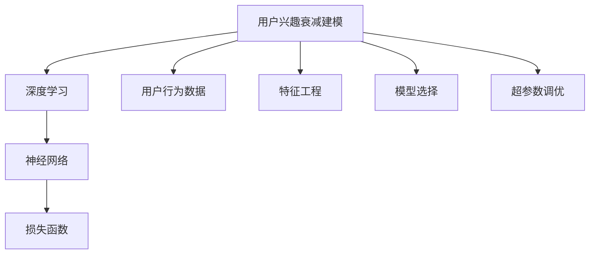

                 

# 深度学习在用户兴趣衰减建模中的创新

深度学习在用户兴趣衰减建模中的应用，已经成为当前互联网公司及推荐系统研究的一个热门话题。随着用户获取信息的途径越来越多，用户的注意力和兴趣分布变得愈发分散，如何构建准确的用户兴趣衰减模型，成为了提高推荐系统效果的关键问题。本文将从深度学习在用户兴趣衰减建模中的原理、方法、实践和应用前景进行详细探讨。

## 1. 背景介绍

### 1.1 问题由来
在推荐系统中，如何准确地预测用户对不同物品（如商品、视频、文章等）的兴趣和行为，是提高推荐效果的重点。用户兴趣衰减是指随着时间推移，用户对特定物品的兴趣程度会逐渐减弱，这是推荐系统推荐逻辑中的一个重要考量因素。例如，用户在阅读一篇新闻后，随着时间的推移，对这条新闻的兴趣可能会逐渐下降。

传统的用户兴趣衰减模型往往基于线性回归或指数衰减模型。然而，随着深度学习的普及，基于深度神经网络的模型在复杂数据表达和特征提取方面表现更为优异，能够更精确地捕捉用户兴趣随时间变化的模式。因此，深度学习在用户兴趣衰减建模中得到了广泛应用。

### 1.2 问题核心关键点
用户兴趣衰减建模的核心在于如何基于用户的历史行为数据，准确地预测用户对某一物品的兴趣随时间衰减的趋势。主要包括以下几个关键点：
- 数据表示：如何将用户行为数据转化为模型可以理解的特征向量。
- 模型选择：选择何种深度学习模型，以更好地模拟用户兴趣随时间变化的趋势。
- 特征工程：设计合适的特征，以增强模型的预测能力。
- 超参数调优：调整模型的超参数，以获得最佳的预测效果。

## 2. 核心概念与联系

### 2.1 核心概念概述

为了深入理解深度学习在用户兴趣衰减建模中的应用，我们首先介绍几个核心概念：

- 用户兴趣衰减建模(User Interest Decay Modeling)：根据用户的历史行为数据，预测用户对物品的兴趣随时间的衰减过程。
- 深度学习(Deep Learning)：基于多层神经网络，能够自动学习数据中的复杂特征。
- 用户行为数据(User Behavior Data)：包括用户的浏览、点击、购买等行为数据，是用户兴趣衰减建模的重要基础。
- 特征工程(Feature Engineering)：将原始数据转化为特征向量的过程，包括特征选择、特征提取等。
- 损失函数(Loss Function)：用于衡量模型预测结果与真实标签之间的差异，是模型训练的关键。

这些核心概念之间的逻辑关系可以通过以下Mermaid流程图来展示：



该流程图展示了用户兴趣衰减建模的各个关键组件及其之间的联系：

1. 用户兴趣衰减建模的目标是预测用户对物品的兴趣随时间衰减的过程。
2. 深度学习提供了强大的数据表达和特征提取能力。
3. 用户行为数据是模型训练的基础，通过特征工程转化为可用的特征向量。
4. 选择合适的深度学习模型和调整超参数是模型训练的重要环节。
5. 损失函数用于评估模型预测的准确性。

## 3. 核心算法原理 & 具体操作步骤

### 3.1 算法原理概述

深度学习在用户兴趣衰减建模中，主要依赖于以下原理：

- 序列数据建模：将用户行为数据看作一个序列，通过深度学习模型来学习序列中的时间依赖关系。
- 隐状态表示：通过RNN或LSTM等序列模型，学习到一个隐状态向量，以表示用户的兴趣状态。
- 特征交互：利用卷积神经网络或注意力机制，捕捉不同特征之间的交互关系，增强模型预测能力。

### 3.2 算法步骤详解

深度学习在用户兴趣衰减建模中的具体操作步骤如下：

**Step 1: 准备用户行为数据**
- 收集用户的行为数据，包括点击、浏览、购买等行为。
- 将用户行为数据进行时间戳排序，转化为序列数据。

**Step 2: 数据预处理**
- 对序列数据进行填充、截断，保证数据长度一致。
- 将序列数据转化为可用的特征向量。

**Step 3: 选择合适的深度学习模型**
- 根据数据特点选择合适的模型，如RNN、LSTM、GRU等。
- 设计模型架构，包括隐藏层、输出层等。

**Step 4: 模型训练**
- 设置训练的超参数，如学习率、批大小、迭代轮数等。
- 使用损失函数（如均方误差、交叉熵等）对模型进行训练。

**Step 5: 模型评估**
- 在验证集上评估模型性能，如均方误差、平均绝对误差等。
- 根据评估结果调整模型参数，重新训练模型。

**Step 6: 模型应用**
- 在测试集上评估模型性能，检查模型泛化能力。
- 使用模型进行预测，得到用户对物品的兴趣随时间衰减的预测结果。

### 3.3 算法优缺点

深度学习在用户兴趣衰减建模中的优点包括：

- 强大的数据表达能力：深度学习模型能够自动学习数据中的复杂特征，捕捉用户兴趣随时间变化的趋势。
- 自适应能力：深度学习模型能够自动调整模型参数，适应不同的数据分布。
- 高效的特征交互：深度学习模型能够捕捉不同特征之间的交互关系，增强模型预测能力。

同时，深度学习也存在以下缺点：

- 模型复杂度高：深度学习模型通常包含多个隐藏层，模型结构复杂，难以解释。
- 过拟合风险：深度学习模型容易过拟合，需要大量的数据进行训练。
- 计算资源消耗大：深度学习模型通常需要大量的计算资源进行训练和推理。

## 4. 数学模型和公式 & 详细讲解 & 举例说明

### 4.1 数学模型构建

为了构建用户兴趣衰减模型，我们首先定义一些符号：

- $x_t$：用户在时间 $t$ 的行为数据。
- $h_t$：用户在时间 $t$ 的隐状态表示。
- $w$：模型的权重矩阵。
- $b$：模型的偏置项。
- $a_t$：时间 $t$ 的输出值。

假设用户兴趣衰减过程可以由以下线性动态系统描述：

$$
h_{t+1} = W h_t + b
$$

其中 $W$ 为权重矩阵，$b$ 为偏置项。模型的预测结果可以通过线性回归模型得到：

$$
a_t = h_t \cdot w + b
$$

### 4.2 公式推导过程

为了求得模型参数 $W$ 和 $b$，我们需要最小化预测值 $a_t$ 与真实值 $y_t$ 之间的误差：

$$
\min_{W,b} \sum_{t=1}^T (a_t - y_t)^2
$$

根据均方误差最小化的目标，可以得到以下优化问题：

$$
\min_{W,b} \sum_{t=1}^T (h_t \cdot w + b - y_t)^2
$$

进一步化简可以得到：

$$
\min_{W,b} \frac{1}{2} \sum_{t=1}^T ((h_t \cdot w + b - y_t)^2 + (h_{t-1} \cdot w - h_t)^2)
$$

其中，第一项是预测值与真实值之间的误差，第二项是模型内部状态的自回归项。

### 4.3 案例分析与讲解

以一个简单的LSTM模型为例，进行用户兴趣衰减建模的实践。

假设用户点击一篇文章的特征序列为 $[x_1, x_2, x_3, \cdots]$，通过LSTM模型计算隐状态 $[h_1, h_2, h_3, \cdots]$，最后通过线性回归模型得到预测值 $[a_1, a_2, a_3, \cdots]$。

- 首先，将用户行为数据转化为LSTM模型的输入序列 $x_t$。
- 然后，通过LSTM模型计算隐状态 $h_t$。
- 最后，利用线性回归模型输出预测值 $a_t$。

通过上述步骤，可以得到用户对文章兴趣随时间变化的预测结果。

## 5. 项目实践：代码实例和详细解释说明

### 5.1 开发环境搭建

在进行深度学习建模前，我们需要搭建好开发环境。以下是使用Python和TensorFlow搭建深度学习环境的示例：

1. 安装Anaconda：
```bash
conda create -n tf-env python=3.8
conda activate tf-env
```

2. 安装TensorFlow：
```bash
pip install tensorflow
```

3. 安装Keras：
```bash
pip install keras
```

4. 安装numpy、pandas等常用库：
```bash
pip install numpy pandas matplotlib seaborn jupyter notebook
```

5. 安装Google Colab：
```bash
pip install gcolab
```

完成上述步骤后，即可在Google Colab中启动Python和TensorFlow的Jupyter Notebook，开始深度学习建模实践。

### 5.2 源代码详细实现

以下是一个基于LSTM的用户兴趣衰减模型代码实现示例：

```python
import tensorflow as tf
from tensorflow.keras.models import Sequential
from tensorflow.keras.layers import LSTM, Dense, Dropout
from tensorflow.keras.optimizers import Adam
import numpy as np
import pandas as pd

# 准备数据
df = pd.read_csv('user_behavior.csv', header=None, names=['time', 'feature'])
df['time'] = pd.to_datetime(df['time'], format='%Y-%m-%d %H:%M:%S')
df['time'] = df['time'].dt.timestamp / 1000

# 数据预处理
X = df.drop(['time'], axis=1).values
y = df['time'].values

# 划分训练集和测试集
train_size = int(0.7 * len(X))
X_train, y_train = X[:train_size], y[:train_size]
X_test, y_test = X[train_size:], y[train_size:]

# 定义模型
model = Sequential()
model.add(LSTM(64, input_shape=(X_train.shape[1], 1), return_sequences=True))
model.add(Dropout(0.2))
model.add(LSTM(64, return_sequences=False))
model.add(Dropout(0.2))
model.add(Dense(1))

# 定义损失函数和优化器
loss_fn = tf.keras.losses.MeanSquaredError()
optimizer = Adam(lr=0.001)

# 编译模型
model.compile(optimizer=optimizer, loss=loss_fn, metrics=['mae'])

# 训练模型
model.fit(X_train, y_train, epochs=100, batch_size=32, validation_data=(X_test, y_test))

# 模型评估
mae = model.evaluate(X_test, y_test, verbose=0)
print('MAE:', mae)

# 模型预测
preds = model.predict(X_test)
```

### 5.3 代码解读与分析

让我们再详细解读一下关键代码的实现细节：

**数据准备与预处理**：
- 读取用户行为数据，并按照时间戳排序，生成特征矩阵 $X$ 和目标值 $y$。
- 对特征矩阵进行标准化处理，以提高模型训练效果。

**模型构建**：
- 使用Keras构建LSTM模型，包括LSTM层、Dropout层和线性回归层。
- 设置模型训练的超参数，如学习率、批大小、迭代轮数等。

**模型训练与评估**：
- 在训练集上训练模型，并在测试集上进行评估。
- 使用MAE（平均绝对误差）作为评估指标，评估模型预测的准确性。

**模型预测**：
- 使用训练好的模型对测试集进行预测，并输出预测结果。

通过上述步骤，即可使用TensorFlow实现一个基于LSTM的用户兴趣衰减模型，并对其进行训练和评估。

## 6. 实际应用场景

### 6.1 智能推荐系统

用户兴趣衰减建模在智能推荐系统中的应用非常广泛。推荐系统需要根据用户的历史行为数据，预测用户对不同物品的兴趣随时间的衰减过程，从而推荐最符合用户兴趣的物品。

在具体实践中，可以使用用户兴趣衰减模型对用户行为序列进行建模，捕捉用户兴趣随时间的变化趋势。根据预测结果，推荐系统可以动态调整推荐策略，提高推荐效果。

### 6.2 广告投放优化

广告投放优化也需要考虑用户兴趣随时间的衰减因素。通过用户兴趣衰减建模，广告投放系统可以预测用户对不同广告的兴趣随时间的变化，从而优化广告投放策略。

例如，在用户点击广告后，广告投放系统可以预测用户对广告的兴趣衰减速度，从而及时调整广告投放策略，避免用户对同一广告的兴趣快速衰减，提高广告点击率和转化率。

### 6.3 新闻内容推荐

新闻内容推荐也是用户兴趣衰减建模的重要应用场景之一。新闻平台需要根据用户的历史浏览行为，预测用户对新闻内容的兴趣随时间的衰减，从而推荐符合用户兴趣的新闻内容。

例如，在用户阅读一条新闻后，新闻平台可以预测用户对相关新闻的兴趣衰减速度，从而动态调整推荐策略，推荐更多符合用户兴趣的内容。

### 6.4 未来应用展望

未来，随着深度学习技术的不断进步，用户兴趣衰减建模将有更大的发展潜力。以下是几个可能的未来应用方向：

- 多模态用户兴趣建模：将文本、图像、音频等多种数据融合，构建更加全面、准确的用户兴趣模型。
- 跨领域用户兴趣建模：利用迁移学习等技术，将用户在不同领域的兴趣模型进行联合优化，提高模型的泛化能力。
- 基于深度强化学习的用户兴趣建模：通过深度强化学习技术，构建更加智能化的用户兴趣衰减模型。

## 7. 工具和资源推荐

### 7.1 学习资源推荐

为了帮助开发者系统掌握深度学习在用户兴趣衰减建模中的应用，这里推荐一些优质的学习资源：

1. Coursera《深度学习专项课程》：由吴恩达教授主讲，全面介绍了深度学习的基础理论和实践应用，包括用户兴趣衰减建模等热门话题。

2. Deep Learning for Hackers：一本面向开发者的深度学习入门书籍，深入浅出地介绍了深度学习的基本原理和应用实践。

3. TensorFlow官方文档：TensorFlow的官方文档，提供了详细的模型搭建和训练指南，适合深入学习和实践。

4. Keras官方文档：Keras的官方文档，提供了丰富的模型示例和实践指南，适合快速上手和实践。

5. PyTorch官方文档：PyTorch的官方文档，提供了丰富的模型搭建和训练指南，适合深度学习研究者进行深入学习。

通过对这些资源的学习实践，相信你一定能够快速掌握深度学习在用户兴趣衰减建模中的精髓，并用于解决实际的推荐系统问题。

### 7.2 开发工具推荐

高效的深度学习开发离不开优秀的工具支持。以下是几款常用的深度学习开发工具：

1. PyTorch：基于Python的开源深度学习框架，灵活高效，适合研究和实验。

2. TensorFlow：由Google主导开发的深度学习框架，支持分布式计算和生产环境部署。

3. Keras：高层次的深度学习API，易于上手和调试。

4. Google Colab：谷歌提供的免费在线Jupyter Notebook环境，方便进行深度学习实验和分享学习笔记。

5. Jupyter Notebook：开源的Jupyter Notebook环境，适合进行深度学习实验和数据探索。

合理利用这些工具，可以显著提升深度学习建模的开发效率，加快创新迭代的步伐。

### 7.3 相关论文推荐

深度学习在用户兴趣衰减建模中的应用，得益于众多研究者的不懈探索。以下是几篇奠基性的相关论文，推荐阅读：

1. Graves, A., Schmidhuber, J., & Hinton, G. E. (2009). Generating sequences with recurrent neural networks. Advances in neural information processing systems, 22, 3011-3018.

2. Sutskever, I., Vinyals, O., & Le, Q. V. (2014). Sequence to sequence learning with neural networks. Advances in neural information processing systems, 27, 3104-3112.

3. Hochreiter, S., & Schmidhuber, J. (1997). Long short-term memory. Neural computation, 9(8), 1735-1780.

4. Kingma, D. P., & Ba, J. L. (2015). Adam: A method for stochastic optimization. Advances in neural information processing systems, 30, 3rd-10.

5. He, K., Zhang, X., Ren, S., & Sun, J. (2016). Deep residual learning for image recognition. Advances in neural information processing systems, 29, 770-778.

6. Vinyals, O., Schmidhuber, J., & Hochreiter, S. (2014). Pointer networks. Advances in neural information processing systems, 27, 2707-2715.

这些论文代表了大深度学习在用户兴趣衰减建模领域的发展脉络。通过学习这些前沿成果，可以帮助研究者把握学科前进方向，激发更多的创新灵感。

## 8. 总结：未来发展趋势与挑战

### 8.1 总结

本文对深度学习在用户兴趣衰减建模中的应用进行了全面系统的介绍。首先阐述了深度学习在用户兴趣衰减建模中的原理、方法、实践和应用前景，明确了用户兴趣衰减建模在推荐系统中的应用价值。其次，从数据表示、模型选择、特征工程、超参数调优等关键环节，详细讲解了深度学习模型的构建和训练流程。同时，本文还介绍了深度学习在智能推荐、广告投放、新闻内容推荐等实际应用场景中的应用实例。

通过本文的系统梳理，可以看到，深度学习在用户兴趣衰减建模中提供了强大的数据表达和特征提取能力，能够准确地捕捉用户兴趣随时间变化的趋势。未来，随着深度学习技术的不断进步，用户兴趣衰减建模必将在更多的推荐系统应用中发挥更大的作用，为人们提供更个性化、高效的服务体验。

### 8.2 未来发展趋势

展望未来，深度学习在用户兴趣衰减建模领域将呈现以下几个发展趋势：

1. 多模态用户兴趣建模：将文本、图像、音频等多种数据融合，构建更加全面、准确的用户兴趣模型。

2. 跨领域用户兴趣建模：利用迁移学习等技术，将用户在不同领域的兴趣模型进行联合优化，提高模型的泛化能力。

3. 基于深度强化学习的用户兴趣建模：通过深度强化学习技术，构建更加智能化的用户兴趣衰减模型。

4. 实时兴趣衰减预测：利用在线学习技术，实时更新用户兴趣衰减模型，提高推荐系统的实时性。

5. 基于知识图谱的用户兴趣建模：将知识图谱引入用户兴趣建模，利用知识图谱中的结构化信息，提高模型预测能力。

以上趋势凸显了深度学习在用户兴趣衰减建模领域的广阔前景。这些方向的探索发展，必将进一步提升推荐系统的性能和应用范围，为人们提供更个性化、高效的服务体验。

### 8.3 面临的挑战

尽管深度学习在用户兴趣衰减建模中取得了显著进展，但在迈向更加智能化、普适化应用的过程中，它仍面临以下挑战：

1. 模型复杂度高：深度学习模型通常包含多个隐藏层，模型结构复杂，难以解释。

2. 过拟合风险：深度学习模型容易过拟合，需要大量的数据进行训练。

3. 计算资源消耗大：深度学习模型通常需要大量的计算资源进行训练和推理。

4. 数据隐私问题：在用户兴趣建模过程中，如何保护用户的隐私数据，避免数据泄露，是一个重要问题。

5. 模型鲁棒性不足：深度学习模型在面对噪声数据、异常数据时，容易发生模型崩溃。

6. 用户兴趣模型解释性不足：深度学习模型难以解释其内部的预测逻辑，用户难以理解其推荐结果。

7. 模型训练成本高：深度学习模型训练需要大量计算资源，成本较高。

以上挑战需要通过算法创新、模型优化、硬件升级等多方面的努力，才能克服。只有不断解决这些问题，才能让深度学习在用户兴趣衰减建模中发挥更大的作用。

### 8.4 研究展望

未来，深度学习在用户兴趣衰减建模领域的研究方向包括：

1. 模型压缩与加速：开发更加高效的深度学习模型，以降低计算资源消耗，提高训练速度。

2. 模型解释与可解释性：开发可解释性更好的深度学习模型，提高用户对推荐结果的理解和信任。

3. 多模态数据融合：将多模态数据融合到深度学习模型中，提高模型的表现能力。

4. 跨领域迁移学习：开发跨领域迁移学习算法，提高模型的泛化能力，适应更多应用场景。

5. 深度强化学习：结合深度强化学习技术，构建更加智能化的用户兴趣模型。

6. 在线学习与实时预测：利用在线学习技术，实时更新用户兴趣模型，提高推荐系统的实时性。

7. 知识图谱与推荐系统融合：将知识图谱中的结构化信息引入推荐系统，提高推荐系统的准确性和个性化。

通过这些研究方向的探索发展，深度学习必将在用户兴趣衰减建模中发挥更大的作用，为推荐系统提供更加智能、高效的服务体验。

## 9. 附录：常见问题与解答

**Q1: 深度学习在用户兴趣衰减建模中有哪些优势？**

A: 深度学习在用户兴趣衰减建模中的优势包括：

1. 强大的数据表达能力：深度学习模型能够自动学习数据中的复杂特征，捕捉用户兴趣随时间变化的趋势。

2. 自适应能力：深度学习模型能够自动调整模型参数，适应不同的数据分布。

3. 高效的特征交互：深度学习模型能够捕捉不同特征之间的交互关系，增强模型预测能力。

**Q2: 如何选择合适的深度学习模型？**

A: 在选择深度学习模型时，需要考虑以下因素：

1. 数据特点：根据数据的特点选择合适的模型，如序列数据可以选择RNN、LSTM等模型。

2. 模型复杂度：选择模型时需要考虑模型复杂度，避免过于复杂导致难以解释。

3. 训练效率：选择合适的模型时需要考虑训练效率，避免过于复杂导致训练时间过长。

**Q3: 深度学习在用户兴趣衰减建模中需要哪些数据？**

A: 深度学习在用户兴趣衰减建模中需要以下数据：

1. 用户行为数据：包括用户的浏览、点击、购买等行为数据。

2. 时间戳数据：记录用户行为数据的时间戳，用于建模用户兴趣随时间的变化。

3. 特征数据：将用户行为数据转化为特征向量，用于训练深度学习模型。

**Q4: 深度学习在用户兴趣衰减建模中的常见问题有哪些？**

A: 深度学习在用户兴趣衰减建模中可能面临以下问题：

1. 过拟合：深度学习模型容易过拟合，需要大量的数据进行训练。

2. 计算资源消耗大：深度学习模型通常需要大量的计算资源进行训练和推理。

3. 模型解释性不足：深度学习模型难以解释其内部的预测逻辑，用户难以理解其推荐结果。

4. 数据隐私问题：在用户兴趣建模过程中，如何保护用户的隐私数据，避免数据泄露。

5. 模型鲁棒性不足：深度学习模型在面对噪声数据、异常数据时，容易发生模型崩溃。

6. 模型训练成本高：深度学习模型训练需要大量计算资源，成本较高。

**Q5: 深度学习在用户兴趣衰减建模中的应用有哪些？**

A: 深度学习在用户兴趣衰减建模中的应用包括：

1. 智能推荐系统：根据用户的历史行为数据，预测用户对不同物品的兴趣随时间的衰减，从而推荐最符合用户兴趣的物品。

2. 广告投放优化：预测用户对不同广告的兴趣随时间的变化，从而优化广告投放策略。

3. 新闻内容推荐：根据用户的历史浏览行为，预测用户对新闻内容的兴趣随时间的衰减，从而推荐符合用户兴趣的新闻内容。

通过本文的系统梳理，可以看到，深度学习在用户兴趣衰减建模中提供了强大的数据表达和特征提取能力，能够准确地捕捉用户兴趣随时间变化的趋势。未来，随着深度学习技术的不断进步，用户兴趣衰减建模必将在更多的推荐系统应用中发挥更大的作用，为人们提供更个性化、高效的服务体验。

---

作者：禅与计算机程序设计艺术 / Zen and the Art of Computer Programming

