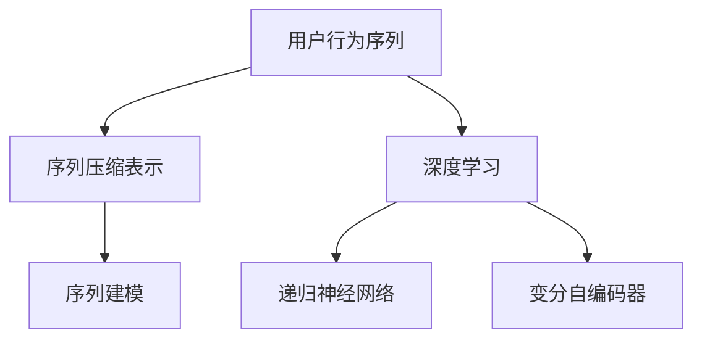

                 

# 深度学习在用户行为序列压缩表示中的应用

> 关键词：深度学习,用户行为序列,序列压缩表示,时间序列分析,深度学习在NLP中的应用

## 1. 背景介绍

在现代社会，我们每天都在产生大量的行为数据，从在线浏览、购物、社交媒体互动到手机通话记录、GPS定位信息等。这些行为数据蕴藏着丰富的信息，如用户偏好、行为模式、社交关系等，对商家、企业和政府部门具有极高的利用价值。然而，由于数据量的庞大和维度的多样性，直接分析这些数据会面临极大的挑战，如计算资源消耗、数据隐私保护等。

为了更高效地利用这些数据，需要对用户行为序列进行压缩表示。序列压缩表示的目标是找到一种高效且准确的方法，将用户行为序列转换为低维度的向量表示，方便后续的分析和建模。深度学习技术，特别是递归神经网络(RNN)和变分自编码器(VAE)等，为序列压缩表示提供了强有力的工具。

本博客将详细阐述深度学习在用户行为序列压缩表示中的应用，涵盖算法原理、具体操作步骤、实际案例及未来展望，希望能为读者提供有价值的技术指导。

## 2. 核心概念与联系

### 2.1 核心概念概述

为了更好地理解深度学习在用户行为序列压缩表示中的应用，本节将介绍几个核心概念：

- **用户行为序列**：指用户在不同时间点上的行为记录，如点击、浏览、购买等。序列数据的特征包括时间戳、行为类型、用户特征等。
- **序列压缩表示**：指将序列数据转换为低维向量表示的过程。其目标是将高维的序列数据映射到低维空间，保留重要信息的同时减少计算复杂度。
- **深度学习**：一种基于神经网络的机器学习技术，通过多层非线性变换，自动学习特征表示。
- **递归神经网络(RNN)**：一种处理序列数据的深度学习模型，能够通过记忆单元捕捉序列间的时序关系。
- **变分自编码器(VAE)**：一种生成式深度学习模型，通过重构损失和潜在空间正则化，学习序列数据的低维表示。
- **序列建模**：通过序列压缩表示，结合深度学习模型对用户行为序列进行建模，提取有用信息。

这些概念之间的逻辑关系可以通过以下Mermaid流程图来展示：



这个流程图展示了大语言模型微调的核心概念及其之间的关系：

1. 用户行为序列通过深度学习进行压缩表示。
2. 深度学习模型包括递归神经网络和变分自编码器，分别用于捕捉时序关系和生成低维表示。
3. 压缩表示后的序列数据用于建模，提取有用信息。

这些概念共同构成了序列压缩表示的理论基础，使得深度学习技术在大规模用户行为数据上的应用成为可能。

## 3. 核心算法原理 & 具体操作步骤

### 3.1 算法原理概述

深度学习在用户行为序列压缩表示中的应用主要基于递归神经网络(RNN)和变分自编码器(VAE)等模型。其核心思想是：通过多层非线性变换，自动学习序列数据的特征表示，将其压缩为低维向量。

对于递归神经网络，其核心是记忆单元，能够通过时序信息捕捉序列数据的内在关系。每个时间步的输出不仅依赖于当前输入，还受到之前所有时间步的输出影响。通过这种机制，RNN能够处理变长的序列数据，并学习到其时间依赖的特征。

变分自编码器则是通过对序列数据进行重构，学习其低维表示。VAE由编码器和解码器两部分组成，编码器将序列数据映射到潜在空间，解码器则通过重构损失将潜在表示映射回原始序列空间。VAE在潜在空间引入了正则化，避免了过拟合，同时保证了重构误差的最小化。

### 3.2 算法步骤详解

深度学习在用户行为序列压缩表示的应用过程包括以下几个关键步骤：

**Step 1: 数据预处理**

- 收集用户行为数据，清洗和归一化数据。
- 将序列数据按照时间顺序排列，确保时间戳准确性。
- 对序列数据进行分批处理，每个批次包含一定长度的序列片段。

**Step 2: 模型选择与构建**

- 选择递归神经网络或变分自编码器等深度学习模型。
- 根据数据特点，设计合适的网络结构和超参数。
- 使用TensorFlow、PyTorch等深度学习框架实现模型。

**Step 3: 模型训练**

- 使用交叉熵损失等适合序列数据的损失函数，训练模型。
- 通过反向传播算法计算梯度，优化模型参数。
- 设置合适的学习率和正则化参数，防止过拟合。
- 使用验证集评估模型性能，避免模型在训练集上过拟合。

**Step 4: 模型评估与测试**

- 在测试集上评估模型性能，使用MAE、RMSE等指标。
- 分析模型预测与实际数据的差异，调整模型参数或架构。
- 进行序列压缩表示的应用，如时间序列预测、用户行为分析等。

### 3.3 算法优缺点

深度学习在用户行为序列压缩表示的应用具有以下优点：

1. **自动学习特征**：深度学习能够自动学习序列数据中的复杂特征表示，减少了手动设计特征的复杂度。
2. **模型泛化能力强**：由于有大量训练数据支撑，深度学习模型能够泛化到不同场景和用户行为模式。
3. **高效处理序列数据**：递归神经网络和变分自编码器等模型能够高效处理变长序列数据，适用于大规模用户行为分析。
4. **低维表示有效**：深度学习模型能够将高维序列数据压缩到低维向量表示，方便后续的分析和建模。

同时，该方法也存在一些局限性：

1. **计算资源需求高**：深度学习模型通常需要大量的计算资源进行训练和推理，对硬件要求较高。
2. **模型复杂度高**：深度学习模型往往结构复杂，难以解释其内部工作机制，可能存在"黑盒"问题。
3. **过拟合风险**：在训练数据不足的情况下，深度学习模型容易过拟合，导致泛化性能下降。
4. **模型调参困难**：深度学习模型的超参数调优需要丰富的经验和技巧，可能面临较大的挑战。

尽管存在这些局限性，但就目前而言，深度学习在用户行为序列压缩表示中的应用已经取得了显著的成效，成为序列数据分析的重要手段。

### 3.4 算法应用领域

深度学习在用户行为序列压缩表示中的应用广泛，以下是几个典型领域：

- **时间序列预测**：通过学习用户行为序列，对未来的点击、购买、交易等行为进行预测。深度学习模型能够捕捉时间依赖关系，提高预测准确性。
- **用户行为分析**：通过分析用户行为序列，挖掘用户偏好、行为模式等信息，用于个性化推荐、广告投放等。
- **社交网络分析**：通过对用户互动序列进行分析，理解用户关系网络结构，发现用户之间的影响关系。
- **金融交易监控**：通过学习交易行为序列，识别异常交易模式，防范金融风险。
- **健康监测**：通过分析用户行为序列，如运动、饮食、睡眠等，预测健康状况，提供个性化健康建议。

## 4. 数学模型和公式 & 详细讲解 & 举例说明

### 4.1 数学模型构建

本节将使用数学语言对深度学习在用户行为序列压缩表示中的应用进行更加严格的刻画。

设用户行为序列为 $\{x_t\}_{t=1}^{T}$，其中 $x_t$ 为第 $t$ 时刻的行为记录，$T$ 为序列长度。深度学习模型 $f$ 将序列压缩表示为低维向量 $\boldsymbol{z}$。

深度学习模型的数学表达为：
$$
\boldsymbol{z} = f(\{x_t\}_{t=1}^{T})
$$

其中 $f$ 为深度学习模型，可以是递归神经网络或变分自编码器等。

### 4.2 公式推导过程

以下我们以递归神经网络为例，推导其重构损失函数的计算公式。

假设递归神经网络 $f$ 包含 $L$ 层隐藏单元，每个时间步的输入为 $\boldsymbol{x}_t$，输出为 $\boldsymbol{z}_t$。则网络结构可以表示为：
$$
\boldsymbol{z}_t = f(\boldsymbol{x}_t, \boldsymbol{z}_{t-1})
$$

其中 $\boldsymbol{z}_0$ 为输入嵌入向量，$f$ 为网络函数。

重构损失函数定义为：
$$
\mathcal{L} = \sum_{t=1}^{T} (\boldsymbol{x}_t - \boldsymbol{z}_t)^2
$$

重构损失函数的目标是最小化重构误差，使得 $\boldsymbol{z}$ 能够忠实地表示原始序列数据 $\{x_t\}_{t=1}^{T}$。

### 4.3 案例分析与讲解

假设我们有一个用户行为序列数据集，包含用户的点击行为记录。我们的目标是学习用户的点击行为序列，将其压缩为低维表示，并用于后续的分析任务。

首先，将原始的点击行为数据进行预处理，转化为递归神经网络的输入格式。然后，选择合适的深度学习模型，设计其网络结构和超参数。在训练集上使用交叉熵损失函数，通过反向传播算法进行模型训练。

训练完成后，在测试集上评估模型的性能，使用MAE、RMSE等指标。如果模型表现不佳，可以调整模型参数或架构，进行重新训练。

最后，将训练好的模型应用于实际场景，如推荐系统、广告投放等，通过序列压缩表示进行用户行为分析。

## 5. 项目实践：代码实例和详细解释说明

### 5.1 开发环境搭建

在进行深度学习项目实践前，我们需要准备好开发环境。以下是使用Python进行TensorFlow开发的环境配置流程：

1. 安装Anaconda：从官网下载并安装Anaconda，用于创建独立的Python环境。

2. 创建并激活虚拟环境：
```bash
conda create -n tensorflow-env python=3.8 
conda activate tensorflow-env
```

3. 安装TensorFlow：根据CUDA版本，从官网获取对应的安装命令。例如：
```bash
conda install tensorflow-gpu
```

4. 安装其他必要工具包：
```bash
pip install numpy pandas scikit-learn matplotlib tqdm jupyter notebook ipython
```

完成上述步骤后，即可在`tensorflow-env`环境中开始项目实践。

### 5.2 源代码详细实现

这里我们以用户行为序列压缩表示为例，给出使用TensorFlow对递归神经网络进行训练的代码实现。

首先，定义用户行为序列数据处理函数：

```python
import tensorflow as tf
import numpy as np

def process_sequence(data):
    sequences = []
    labels = []
    for seq, label in data:
        sequences.append(seq)
        labels.append(label)
    return sequences, labels

# 处理样本
train_data = process_sequence(train_data)
val_data = process_sequence(val_data)
test_data = process_sequence(test_data)
```

然后，定义递归神经网络模型：

```python
from tensorflow.keras.layers import Input, LSTM, Dense
from tensorflow.keras.models import Model

def build_model(input_shape, output_dim):
    input_seq = Input(shape=input_shape)
    lstm = LSTM(64)(input_seq)
    output = Dense(output_dim, activation='softmax')(lstm)
    model = Model(inputs=input_seq, outputs=output)
    return model

# 构建模型
model = build_model(input_shape=(None, 5), output_dim=2)
```

接着，定义损失函数和优化器：

```python
from tensorflow.keras.losses import mean_squared_error

# 损失函数
loss_fn = mean_squared_error

# 优化器
optimizer = tf.keras.optimizers.Adam()
```

最后，启动模型训练流程：

```python
epochs = 10
batch_size = 32

# 训练模型
model.compile(optimizer=optimizer, loss=loss_fn)
history = model.fit(train_data, epochs=epochs, batch_size=batch_size, validation_data=val_data)
```

以上就是使用TensorFlow对递归神经网络进行用户行为序列压缩表示训练的完整代码实现。可以看到，使用TensorFlow进行深度学习建模，代码实现相对简洁高效。

### 5.3 代码解读与分析

让我们再详细解读一下关键代码的实现细节：

**process_sequence函数**：
- `process_sequence`函数：将原始数据转化为深度学习模型的输入格式，即将序列数据按时间顺序排列，并将其转化为TensorFlow的序列数据格式。

**build_model函数**：
- `build_model`函数：定义递归神经网络模型。首先定义输入层，然后添加LSTM层，最后定义输出层和模型。

**损失函数和优化器**：
- 损失函数：使用均方误差损失，用于评估模型重构序列数据的误差。
- 优化器：使用Adam优化器，自动调整学习率，加速模型收敛。

**模型训练**：
- `compile`方法：定义模型的损失函数和优化器。
- `fit`方法：在训练集上训练模型，并使用验证集评估模型性能。

可以看到，TensorFlow提供了方便的高级API，使得深度学习模型的实现变得简单易懂。开发者可以将更多精力放在模型设计和数据处理上，而不必过多关注底层实现细节。

## 6. 实际应用场景

### 6.1 智能推荐系统

智能推荐系统是深度学习在用户行为序列压缩表示中的典型应用场景。传统推荐系统往往只依赖用户历史行为数据进行物品推荐，难以深入理解用户的真实兴趣和偏好。深度学习模型能够从序列数据中自动学习用户行为模式和偏好，提供更精准、多样化的推荐内容。

在实践中，可以将用户的历史点击、浏览、购买等行为数据作为序列输入，使用深度学习模型学习用户的行为模式和偏好，并生成推荐列表。通过序列压缩表示，可以进一步提高推荐的效率和准确性。

### 6.2 金融风险监控

金融行业面临诸多风险，如市场波动、欺诈行为等。深度学习模型可以学习用户的历史交易行为序列，识别异常交易模式，及时预警风险。

在实践中，可以将用户的历史交易记录作为序列输入，使用深度学习模型学习交易行为的模式和规律。通过序列压缩表示，可以将模型输出的低维向量表示用于风险预警和监控。

### 6.3 健康监测与个性化健身

健康监测和个性化健身领域，深度学习模型可以学习用户的行为序列，预测健康状况，提供个性化的健身建议。

在实践中，可以将用户的运动、饮食、睡眠等行为数据作为序列输入，使用深度学习模型学习用户的行为模式和健康状况。通过序列压缩表示，可以将模型输出的低维向量表示用于健康状况预测和个性化健身建议。

## 7. 工具和资源推荐

### 7.1 学习资源推荐

为了帮助开发者系统掌握深度学习在用户行为序列压缩表示中的应用，这里推荐一些优质的学习资源：

1. 《深度学习》课程：由吴恩达教授讲授的深度学习入门课程，涵盖了深度学习的基本概念和算法。

2. 《Python深度学习》书籍：弗朗索瓦·切尼厄(François Chollet)的深度学习入门书籍，详细介绍了TensorFlow、Keras等深度学习框架的使用。

3. 《序列模型：自然语言处理中的深度学习》书籍：Hochreiter和Schmidhuber合著的序列模型经典教材，介绍了递归神经网络和变分自编码器等深度学习模型。

4. TensorFlow官方文档：TensorFlow的官方文档，提供了丰富的API文档和示例代码，方便开发者学习和实践。

5. Kaggle竞赛：Kaggle上举办的多项数据科学和深度学习竞赛，可以锻炼开发者的实践能力和算法理解能力。

通过对这些资源的学习实践，相信你一定能够快速掌握深度学习在用户行为序列压缩表示中的应用，并用于解决实际的NLP问题。

### 7.2 开发工具推荐

高效的开发离不开优秀的工具支持。以下是几款用于深度学习项目开发的常用工具：

1. TensorFlow：由Google主导开发的深度学习框架，生产部署方便，适合大规模工程应用。提供了丰富的深度学习模型和优化器，支持多种硬件平台。

2. PyTorch：由Facebook开发的深度学习框架，灵活性高，适合研究和快速迭代。提供了动态计算图和丰富的API接口，方便开发者进行模型设计和调试。

3. Keras：由François Chollet开发的高级深度学习API，基于TensorFlow和Theano实现。提供了简洁易用的API接口，方便开发者进行模型构建和训练。

4. Weights & Biases：模型训练的实验跟踪工具，可以记录和可视化模型训练过程中的各项指标，方便对比和调优。与主流深度学习框架无缝集成。

5. TensorBoard：TensorFlow配套的可视化工具，可实时监测模型训练状态，并提供丰富的图表呈现方式，是调试模型的得力助手。

6. Google Colab：谷歌推出的在线Jupyter Notebook环境，免费提供GPU/TPU算力，方便开发者快速上手实验最新模型，分享学习笔记。

合理利用这些工具，可以显著提升深度学习项目开发的效率，加快创新迭代的步伐。

### 7.3 相关论文推荐

深度学习在用户行为序列压缩表示的研究源于学界的持续研究。以下是几篇奠基性的相关论文，推荐阅读：

1. Sequence to Sequence Learning with Neural Networks: Bridging NLP, CV, and Speech Processing：RNN的经典论文，详细介绍了递归神经网络在序列数据上的应用。

2. Variational Autoencoders（VAE）：Kingma和Welling合著的变分自编码器经典论文，介绍了VAE模型及其变体。

3. Attention is All You Need：Vaswani等合著的Transformer论文，提出了自注意力机制，改进了RNN的序列建模能力。

4. Generative Adversarial Networks（GAN）：Goodfellow等合著的生成对抗网络论文，介绍了GAN模型及其应用。

5. Recurrent Neural Network Toolkit（RNTK）：RNTK是一个专门用于RNN的深度学习框架，提供了丰富的RNN模型和API接口，方便开发者进行序列建模。

这些论文代表了大语言模型微调技术的发展脉络。通过学习这些前沿成果，可以帮助研究者把握学科前进方向，激发更多的创新灵感。

## 8. 总结：未来发展趋势与挑战

### 8.1 总结

本文对深度学习在用户行为序列压缩表示中的应用进行了全面系统的介绍。首先阐述了深度学习在用户行为序列压缩表示的背景和意义，明确了序列压缩表示在数据处理和建模中的重要价值。其次，从原理到实践，详细讲解了深度学习在用户行为序列压缩表示中的应用，给出了深度学习项目开发的完整代码实例。同时，本文还广泛探讨了深度学习模型在推荐系统、金融风险监控、健康监测等实际场景中的应用前景，展示了深度学习技术在多领域的广泛应用。此外，本文精选了深度学习相关资源的推荐，力求为读者提供全方位的技术指引。

通过本文的系统梳理，可以看到，深度学习在用户行为序列压缩表示的应用已经成为数据驱动领域的重要工具，极大地拓展了数据处理的范围和深度。未来，伴随深度学习模型的不断演进和优化，相信其将进一步推动自然语言处理、计算机视觉等领域的发展，为人工智能技术落地应用提供强有力的支撑。

### 8.2 未来发展趋势

展望未来，深度学习在用户行为序列压缩表示的应用将呈现以下几个发展趋势：

1. **模型结构优化**：未来深度学习模型将朝着更高效、更灵活的结构设计发展，如Transformer架构、注意力机制等，提高模型性能和计算效率。
2. **多模态融合**：未来的序列压缩表示将结合视觉、语音等多模态数据，构建更加全面的用户行为理解模型。
3. **自监督学习**：自监督学习在序列压缩表示中的应用将越来越广泛，利用无标签数据提升模型泛化性能。
4. **联邦学习**：在保护用户隐私的前提下，利用联邦学习技术进行序列数据的分布式训练，提高模型安全性和公平性。
5. **跨模态嵌入**：未来的深度学习模型将能够同时处理文本、图像、语音等多种数据类型，构建跨模态的用户行为表示模型。
6. **实时处理**：深度学习模型将越来越多地应用于实时数据处理场景，如实时推荐、实时风险监控等。

以上趋势凸显了深度学习在用户行为序列压缩表示中的广阔前景。这些方向的探索发展，必将进一步提升深度学习模型的性能和应用范围，为数据驱动领域带来革命性的变化。

### 8.3 面临的挑战

尽管深度学习在用户行为序列压缩表示中的应用已经取得了显著的成效，但在迈向更加智能化、普适化应用的过程中，它仍面临着诸多挑战：

1. **计算资源需求高**：深度学习模型通常需要大量的计算资源进行训练和推理，对硬件要求较高。如何在有限的计算资源下提高模型效率，是未来需要解决的重要问题。
2. **模型复杂度高**：深度学习模型往往结构复杂，难以解释其内部工作机制，可能存在"黑盒"问题。如何提高模型的可解释性，是未来研究的重点方向之一。
3. **过拟合风险**：在训练数据不足的情况下，深度学习模型容易过拟合，导致泛化性能下降。如何提高模型的泛化能力，避免过拟合，还需要更多理论和实践的积累。
4. **数据隐私保护**：深度学习模型需要大量数据进行训练，如何保护用户隐私，避免数据泄露，是未来需要重点关注的问题。
5. **模型公平性**：深度学习模型容易引入偏见，导致输出不公平。如何确保模型公平性，避免歧视，是未来需要解决的重要问题。

尽管存在这些挑战，但未来的研究仍需在深度学习模型的结构优化、泛化性能提升、隐私保护等方面取得突破，才能真正实现深度学习技术在用户行为序列压缩表示中的广泛应用。

### 8.4 研究展望

面对深度学习在用户行为序列压缩表示中所面临的种种挑战，未来的研究需要在以下几个方面寻求新的突破：

1. **自监督学习的应用**：探索自监督学习在用户行为序列压缩表示中的应用，利用无标签数据提升模型泛化性能。
2. **跨模态数据融合**：结合视觉、语音等多模态数据，构建更加全面的用户行为表示模型。
3. **模型压缩与量化**：研究模型压缩与量化技术，提高深度学习模型的计算效率和推理速度。
4. **隐私保护技术**：研究隐私保护技术，确保用户行为数据的隐私安全。
5. **公平性优化**：通过公平性约束和优化，提高深度学习模型的公平性和可解释性。

这些研究方向将引领深度学习在用户行为序列压缩表示中的应用走向成熟，推动深度学习技术在数据驱动领域的广泛应用。只有勇于创新、敢于突破，才能真正实现深度学习技术在用户行为序列压缩表示中的革命性变革。

## 9. 附录：常见问题与解答

**Q1：深度学习在用户行为序列压缩表示中需要哪些数据？**

A: 深度学习在用户行为序列压缩表示中需要大量的用户行为数据，包括用户的点击、浏览、购买、社交互动等行为记录。这些数据通常包含时间戳、行为类型、用户特征等信息。数据的收集和清洗需要结合实际应用场景进行。

**Q2：如何选择合适的深度学习模型？**

A: 选择合适的深度学习模型需要考虑数据的特点和应用需求。对于序列数据，递归神经网络（RNN）和变分自编码器（VAE）等模型表现良好。对于无标签数据，自监督学习模型如CAE、GAN等也可以用于序列压缩表示。

**Q3：深度学习模型在训练过程中需要注意哪些问题？**

A: 深度学习模型在训练过程中需要注意以下几点：
1. 选择合适的损失函数，如均方误差、交叉熵等。
2. 设置合适的学习率和正则化参数，防止过拟合。
3. 合理选择模型架构和超参数，如隐藏层大小、网络深度等。
4. 使用有效的优化器，如Adam、SGD等。
5. 在训练过程中定期评估模型性能，调整模型参数或架构。

**Q4：深度学习模型在实际应用中需要注意哪些问题？**

A: 深度学习模型在实际应用中需要注意以下几点：
1. 模型的推理效率和计算资源消耗。
2. 模型的可解释性和公平性。
3. 模型的隐私保护和安全。
4. 模型的泛化能力和鲁棒性。
5. 模型的实时性和灵活性。

## 结语

深度学习在用户行为序列压缩表示中的应用为数据驱动领域带来了新的契机，使得我们能够高效处理大规模用户行为数据，挖掘其中的有用信息。随着深度学习技术的不断进步，我们相信未来在用户行为序列压缩表示等领域，将会有更多创新应用的出现，推动人工智能技术在各行各业的广泛应用。

---

作者：禅与计算机程序设计艺术 / Zen and the Art of Computer Programming

