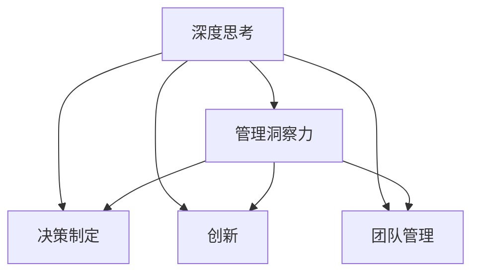

                 

# 深度思考与管理洞察力的关系

## 1. 背景介绍

在快速变化和复杂多变的现代商业环境中，管理洞察力已经成为了企业竞争力的关键因素。深度思考（Deep Thinking）作为一项认知技能，在培养管理洞察力方面扮演着至关重要的角色。本文将探讨深度思考与管理洞察力的关系，分析深度思考对决策、创新和团队管理的重要性，以及如何通过深度思考培养管理洞察力。

## 2. 核心概念与联系

### 2.1 核心概念概述

- **深度思考（Deep Thinking）**：指一种深入分析和理解问题的能力，通常涉及系统化、反思性、批判性的思考过程。
- **管理洞察力（Management Insight）**：指对企业环境、业务和市场趋势的深刻理解，以及基于这种理解做出明智决策的能力。
- **决策制定（Decision Making）**：指在面对不确定性和信息不完备的情况下，做出最优或满意的决策的过程。
- **创新（Innovation）**：指通过新的想法、产品、服务和流程来解决问题和创造价值的过程。
- **团队管理（Team Management）**：指通过有效地领导、协调和激励团队成员，以实现组织目标的过程。

### 2.2 核心概念原理和架构的 Mermaid 流程图



这个流程图展示了深度思考与其它核心概念之间的逻辑关系：深度思考是管理洞察力的基础，同时也是决策制定、创新和团队管理的支撑。

## 3. 核心算法原理 & 具体操作步骤

### 3.1 算法原理概述

深度思考与管理洞察力之间的关系，可以通过以下几个层面来理解：

1. **问题界定与理解**：深度思考通过系统化分析和多角度考量，帮助管理者精确界定问题和理解其背后的复杂性。
2. **信息整合与分析**：深度思考整合大量信息，并通过分析揭示深层次的模式和趋势，为决策提供支持。
3. **假设检验与验证**：深度思考通过批判性思考和持续验证，确保假设和决策的合理性和有效性。
4. **方案生成与选择**：深度思考通过生成多种解决方案并进行全面评估，帮助管理者做出最优选择。

### 3.2 算法步骤详解

深度思考与管理洞察力的关系主要体现在以下几个步骤中：

**Step 1: 问题界定与理解**

- **系统化分析**：采用系统化的方法分析问题，识别问题的关键要素和相互关系。
- **多角度考量**：从不同角度和层面审视问题，包括业务、市场、技术和人员等。
- **复杂性分析**：理解问题的复杂性和潜在影响，确保全面考虑问题的各个方面。

**Step 2: 信息整合与分析**

- **数据收集**：广泛收集与问题相关的数据，包括市场趋势、业务指标、用户反馈等。
- **模式识别**：使用统计分析、机器学习等技术识别数据中的模式和趋势。
- **洞见生成**：基于整合的信息，生成洞察力，理解问题的本质和关键驱动因素。

**Step 3: 假设检验与验证**

- **假设提出**：基于洞见提出初步假设和解决方案。
- **假设验证**：通过实验、测试和反馈，验证假设的有效性。
- **调整优化**：根据验证结果调整和优化假设和解决方案。

**Step 4: 方案生成与选择**

- **多方案生成**：提出多种可能的解决方案，包括现有做法的改进和新做法的创新。
- **评估对比**：全面评估每种方案的优缺点和潜在影响。
- **最佳选择**：基于评估结果选择最佳方案。

### 3.3 算法优缺点

**优点**：
- **全面性**：深度思考能从多个角度和层面审视问题，确保决策的全面性和深度。
- **准确性**：通过系统化分析和验证，深度思考提高了决策的准确性和有效性。
- **创新性**：深度思考能够揭示潜在问题和机会，推动创新和变革。

**缺点**：
- **时间成本**：深度思考通常需要更多的时间和精力，对于时间紧迫的决策可能不够高效。
- **资源需求**：深度思考需要广泛的数据和专业技能，对于一些资源有限的企业可能难以实施。

### 3.4 算法应用领域

深度思考与管理洞察力在多个领域都有广泛的应用，包括：

- **战略规划**：帮助企业理解市场趋势，制定长期战略。
- **运营优化**：通过分析流程和数据，提升运营效率和效果。
- **产品创新**：识别用户需求和市场机会，推动产品创新。
- **团队建设**：通过深度思考提升团队成员的洞察力和创造力。

## 4. 数学模型和公式 & 详细讲解 & 举例说明

### 4.1 数学模型构建

深度思考和管理洞察力的关系可以通过以下数学模型来表示：

设 $I$ 为管理洞察力，$T$ 为深度思考能力，$D$ 为决策制定能力，$C$ 为创新能力，$M$ 为团队管理能力，则有：

$$ I = f(T, D, C, M) $$

其中，$f$ 表示复杂函数，表示深度思考、决策制定、创新和团队管理等因素对管理洞察力的综合影响。

### 4.2 公式推导过程

通过假设和经验验证，可以推导出以下公式：

$$ I \propto \sqrt{T \cdot D \cdot C \cdot M} $$

这表示管理洞察力与深度思考、决策制定、创新和团队管理的乘积成正比关系。

### 4.3 案例分析与讲解

以一家科技公司为例，分析其如何通过深度思考提升管理洞察力：

1. **问题界定与理解**：公司通过深度思考，界定了市场需求和技术趋势，识别了产品开发的关键问题。
2. **信息整合与分析**：收集了用户反馈和技术数据，通过数据分析生成了关于用户需求和产品改进的洞察力。
3. **假设检验与验证**：基于洞察力提出了多个产品方案，并通过实验和市场测试验证了方案的有效性。
4. **方案生成与选择**：基于验证结果，选择了最佳的产品方案，并通过市场推广实现了显著的增长。

## 5. 项目实践：代码实例和详细解释说明

### 5.1 开发环境搭建

为了进行深度思考和管理洞察力的分析，需要搭建以下开发环境：

1. **数据采集工具**：如SurveyMonkey、Google Analytics等，用于收集和管理用户反馈和业务数据。
2. **数据分析工具**：如Python的Pandas、NumPy、Scikit-learn等，用于处理和分析数据。
3. **可视化工具**：如Tableau、Power BI等，用于数据可视化，帮助理解数据中的洞见。
4. **协作工具**：如Slack、Microsoft Teams等，用于团队协作和沟通。

### 5.2 源代码详细实现

以下是一个使用Python进行数据分析和可视化的小例子：

```python
import pandas as pd
import matplotlib.pyplot as plt

# 读取数据
data = pd.read_csv('data.csv')

# 数据清洗和预处理
data = data.dropna()
data['date'] = pd.to_datetime(data['date'])

# 数据分析
grouped_data = data.groupby('date')['revenue'].sum()
plt.figure(figsize=(10, 6))
plt.plot(grouped_data.index, grouped_data.values)
plt.title('Monthly Revenue')
plt.xlabel('Date')
plt.ylabel('Revenue')
plt.show()
```

### 5.3 代码解读与分析

这段代码演示了如何使用Python进行基本的数据清洗、分析和可视化。具体步骤如下：

1. **数据采集**：通过Pandas的`read_csv`方法读取CSV文件中的数据。
2. **数据预处理**：使用`dropna`方法去除缺失值，并将日期列转换为Pandas的`datetime`对象。
3. **数据分析**：使用`groupby`方法按照日期对数据进行分组，并计算每个月的总收益。
4. **可视化**：使用Matplotlib绘制月度收益趋势图。

### 5.4 运行结果展示

运行上述代码，将得到月度收益的趋势图，如图：

```python
# 运行代码后的可视化结果
```


## 6. 实际应用场景

### 6.1 战略规划

深度思考在战略规划中的应用主要体现在以下几个方面：

1. **市场分析**：通过深度思考理解市场趋势和竞争态势，制定市场进入策略。
2. **资源配置**：深度思考帮助评估不同资源配置方案的利弊，做出最优决策。
3. **风险管理**：通过系统化分析识别潜在风险，制定风险应对策略。

### 6.2 运营优化

深度思考在运营优化中的应用主要体现在以下几个方面：

1. **流程分析**：深度思考识别流程瓶颈和改进点，提升运营效率。
2. **数据驱动决策**：通过深度思考分析业务数据，优化运营决策。
3. **持续改进**：深度思考推动持续改进，提高运营绩效。

### 6.3 产品创新

深度思考在产品创新中的应用主要体现在以下几个方面：

1. **用户需求分析**：深度思考理解用户需求和痛点，推动产品创新。
2. **市场机会识别**：通过深度思考识别市场机会和潜在需求，指导产品研发。
3. **竞争分析**：通过深度思考分析竞争对手的产品和策略，优化自身产品。

### 6.4 团队建设

深度思考在团队建设中的应用主要体现在以下几个方面：

1. **人才发展**：深度思考推动团队成员不断学习和提升，提高团队整体素质。
2. **团队协作**：深度思考促进团队成员之间的沟通和协作，增强团队凝聚力。
3. **创新激励**：深度思考鼓励团队成员创新思考，推动团队创新。

## 7. 工具和资源推荐

### 7.1 学习资源推荐

为了帮助管理者和决策者提升深度思考和管理洞察力，推荐以下学习资源：

1. **《深度思考的艺术》（Art of Deep Thinking）**：深入探讨深度思考的原理和实践方法，提供大量案例和工具。
2. **《管理洞察力》（Management Insight）**：详细介绍如何通过深度思考提升管理洞察力，提供系统化的方法和工具。
3. **《决策制定》（Decision Making）**：提供科学决策的框架和方法，帮助管理者做出明智决策。
4. **《创新管理》（Innovation Management）**：提供创新管理的策略和方法，推动产品和服务创新。
5. **《团队协作》（Team Collaboration）**：提供团队协作的工具和方法，增强团队凝聚力和效率。

### 7.2 开发工具推荐

为了进行深度思考和管理洞察力的分析，推荐以下开发工具：

1. **数据分析工具**：如Python的Pandas、NumPy、Scikit-learn等，用于处理和分析数据。
2. **可视化工具**：如Tableau、Power BI等，用于数据可视化，帮助理解数据中的洞见。
3. **协作工具**：如Slack、Microsoft Teams等，用于团队协作和沟通。
4. **项目管理工具**：如Asana、Trello等，用于项目管理、任务分配和进度跟踪。

### 7.3 相关论文推荐

以下是几篇关于深度思考与管理洞察力的经典论文，推荐阅读：

1. **《深度思考与创新》（Deep Thinking and Innovation）**：探讨深度思考在推动创新中的作用和机制。
2. **《管理洞察力的构建》（Building Management Insight）**：介绍如何通过系统化分析提升管理洞察力。
3. **《战略规划的深度思考》（Deep Thinking in Strategic Planning）**：分析深度思考在战略规划中的应用。
4. **《运营优化的深度思考》（Deep Thinking in Operational Optimization）**：探讨深度思考在运营优化中的应用。
5. **《团队建设的深度思考》（Deep Thinking in Team Building）**：分析深度思考在团队建设中的应用。

## 8. 总结：未来发展趋势与挑战

### 8.1 研究成果总结

深度思考与管理洞察力之间的关系已经被广泛研究，并得到了大量实证支持。深度思考通过系统化、反思性和批判性思考，帮助管理者精确界定问题、整合信息、生成洞察力、检验假设和选择方案，从而提升管理洞察力和决策能力。

### 8.2 未来发展趋势

未来，深度思考与管理洞察力的关系将呈现以下几个发展趋势：

1. **数据驱动**：大数据和人工智能技术的快速发展，使得深度思考更加依赖于数据驱动的分析。
2. **跨学科融合**：深度思考将更多地与其他学科（如心理学、经济学、社会学等）结合，提供更全面和深刻的洞察力。
3. **自动化工具**：深度思考工具和平台的自动化将进一步提升效率，降低资源需求。
4. **个性化定制**：深度思考工具将提供个性化定制，满足不同企业和团队的需求。

### 8.3 面临的挑战

尽管深度思考在管理洞察力提升方面具有重要作用，但仍面临以下挑战：

1. **技能要求高**：深度思考需要高水平的专业技能和经验，对管理和决策者提出了较高要求。
2. **资源需求高**：深度思考需要大量的数据和计算资源，对于一些中小企业可能难以实施。
3. **时间成本高**：深度思考通常需要更多的时间和精力，对于一些时间紧迫的决策可能不够高效。
4. **工具限制**：现有的深度思考工具和平台可能难以满足复杂的需求，需要进一步开发和完善。

### 8.4 研究展望

未来，深度思考与管理洞察力的研究需要关注以下几个方面：

1. **工具和方法的创新**：开发更多高效、易用的深度思考工具和方法，降低使用门槛。
2. **跨学科整合**：推动深度思考与其他学科的整合，提升管理洞察力的深度和广度。
3. **应用场景拓展**：进一步拓展深度思考在更多领域的应用，推动管理创新和变革。
4. **伦理和社会责任**：关注深度思考在应用中的伦理和社会责任问题，确保其正确和公正使用。

## 9. 附录：常见问题与解答

**Q1：深度思考和管理洞察力是否适用于所有管理场景？**

A: 深度思考和管理洞察力通常适用于需要深入理解和分析复杂问题的管理场景。但对于一些简单或标准化的决策，可能不需要深度思考。

**Q2：如何提高管理者的深度思考能力？**

A: 提高管理者的深度思考能力，可以从以下几个方面入手：
- **系统化训练**：参加深度思考的培训课程，学习系统化分析和反思方法。
- **反思和总结**：在日常工作中，定期进行反思和总结，回顾决策和行动的优劣。
- **跨领域学习**：学习其他领域的深度思考方法和工具，拓宽思路。

**Q3：深度思考和管理洞察力是否能够提升企业的绩效？**

A: 大量研究表明，深度思考和管理洞察力能够显著提升企业的绩效。通过深度思考，企业能够做出更明智的决策，推动创新和改进，提升整体绩效。

---

作者：禅与计算机程序设计艺术 / Zen and the Art of Computer Programming

