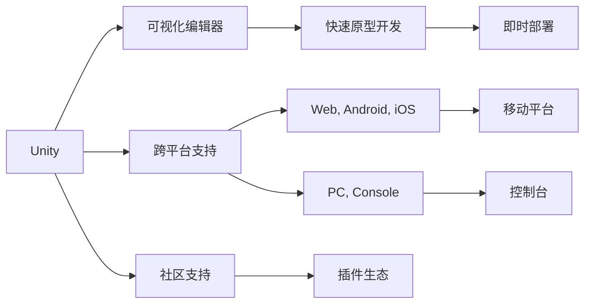
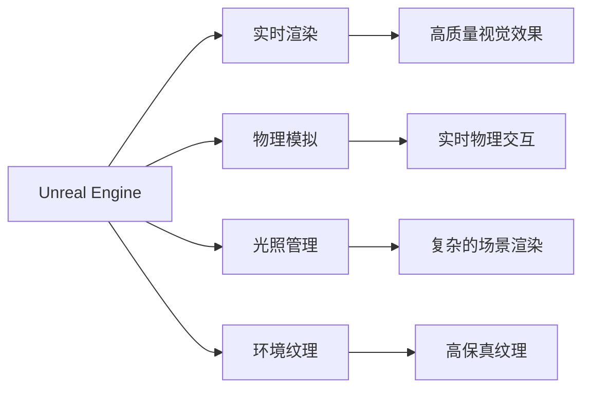

                 

# 游戏框架选择：Unity vs Unreal Engine

> 关键词：Unity, Unreal Engine, 游戏开发, 引擎比较, 性能对比, 实时渲染, 开发成本, 跨平台, 游戏设计

## 1. 背景介绍

在当今游戏开发领域，两款最受欢迎的游戏引擎——Unity和Unreal Engine，已经成为游戏开发者的首选工具。本文将从多个角度深入探讨Unity和Unreal Engine的优缺点，分析它们在性能、开发成本、跨平台能力等方面的差异，并帮助开发者选择最适合的游戏框架。

## 2. 核心概念与联系

### 2.1 核心概念概述

- **Unity**：是一款由Unity Technologies开发的游戏引擎，以其广泛的使用、强大的社区支持以及跨平台能力著称。Unity提供了一个直观的可视化编辑器，使得开发者可以快速构建和测试游戏原型。

- **Unreal Engine**：由Epic Games开发，以其实时渲染技术和高度可定制的游戏设计著称。Unreal Engine支持物理模拟、光照、环境纹理等高级功能，适用于高质量、高复杂度的游戏开发。

### 2.2 核心概念原理和架构的 Mermaid 流程图





## 3. 核心算法原理 & 具体操作步骤

### 3.1 算法原理概述

Unity和Unreal Engine的核心算法都基于高性能的渲染引擎，但具体的技术实现和应用场景有所差异。

- **Unity**：基于光线追踪和延迟渲染技术，提供即时渲染引擎，适用于快速开发和部署小型到中型游戏。

- **Unreal Engine**：采用现代渲染架构，支持高效的光线追踪、体积渲染和动态光照，适用于开发大型、高复杂度的游戏和实时渲染场景。

### 3.2 算法步骤详解

#### Unity的开发流程

1. **搭建环境**：安装Unity编辑器，创建新项目。
2. **场景设计**：使用可视化编辑器构建场景。
3. **脚本编程**：编写C#脚本来控制游戏逻辑。
4. **测试与调试**：在编辑器中测试游戏，使用调试工具进行问题排查。
5. **导出与发布**：导出游戏至目标平台，进行测试和优化。

#### Unreal Engine的开发流程

1. **搭建环境**：安装Unreal Engine，创建新项目。
2. **场景设计**：使用蓝图编辑器或C++代码进行场景设计。
3. **脚本编程**：编写C++或C#脚本来控制游戏逻辑。
4. **测试与调试**：在编辑器中测试游戏，使用调试工具进行问题排查。
5. **导出与发布**：导出游戏至目标平台，进行测试和优化。

### 3.3 算法优缺点

#### Unity的优缺点

**优点**：

- **跨平台支持**：Unity支持多种平台，包括PC、移动、Web等，具有高度的可移植性。
- **易于上手**：可视化编辑器和简单易学的编程语言（C#）使得Unity易于上手。
- **社区活跃**：拥有一个庞大的社区和丰富的插件生态，可以方便地找到解决方案和资源。

**缺点**：

- **性能限制**：虽然Unity支持各种平台，但其渲染性能相对较低，不适用于高性能图形和实时渲染。
- **优化难度**：由于编辑器和脚本语言设计的原因，Unity的优化相对复杂，需要更多的时间和精力。

#### Unreal Engine的优缺点

**优点**：

- **高性能渲染**：Unreal Engine提供卓越的图形性能和复杂的渲染技术，适用于高要求的游戏和视觉效果。
- **物理引擎**：内置高级物理引擎，支持逼真的物理交互和环境模拟。
- **开发效率**：蓝图系统提供可视化编程环境，减少了脚本编写的需求。

**缺点**：

- **学习曲线陡峭**：Unreal Engine的复杂性要求开发者具备一定的编程和渲染技术。
- **开发成本高**：需要购买引擎授权，初期投入较高。
- **跨平台限制**：尽管支持多平台，但移动平台的优化和支持相对较少。

### 3.4 算法应用领域

#### Unity的应用领域

- **小型游戏和原型**：适合快速开发原型和小型游戏，适用于独立游戏开发者和独立工作室。
- **移动游戏**：广泛用于移动平台游戏开发，具有出色的跨平台性能和社区支持。
- **Web游戏**：支持WebGL渲染，适合Web游戏的开发。

#### Unreal Engine的应用领域

- **大型游戏和高端视觉效果**：适合开发高质量、高复杂度的游戏，适用于大型游戏工作室和AAA游戏。
- **视觉效果和动画**：广泛应用于电影、电视和虚拟现实（VR）等领域，支持高级动画和实时渲染。
- **实时渲染**：适用于需要实时渲染和复杂图形效果的游戏开发。

## 4. 数学模型和公式 & 详细讲解 & 举例说明

### 4.1 数学模型构建

#### Unity的渲染模型

Unity采用基于延迟渲染的渲染管线，其渲染流程包括：

1. **前向渲染**：渲染场景的前向部分，生成中间色彩缓冲区。
2. **深度缓冲**：生成深度缓冲区，用于剔除远处的几何体。
3. **后向渲染**：根据前向渲染的结果，生成最终的图像。

#### Unreal Engine的渲染模型

Unreal Engine采用基于光追的渲染管线，其渲染流程包括：

1. **光线追踪**：通过光线追踪技术，计算场景中的光影效果。
2. **即时渲染**：对部分简单场景使用即时渲染，提高渲染效率。
3. **动态光照**：根据实时光源变化，动态计算光照效果。

### 4.2 公式推导过程

#### Unity的渲染公式

假设场景中有$n$个物体，每个物体的顶点坐标为$(x_i,y_i,z_i)$，法向量为$(n_x,n_y,n_z)$，则渲染公式为：

$$
L_i = \sum_{j=1}^n \frac{A_j}{d_{ij}^2} \mathbf{f}(\mathbf{n}_i,\mathbf{v}_j)
$$

其中$A_j$为物体的面积，$d_{ij}$为光线与物体的距离，$\mathbf{f}$为光强函数。

#### Unreal Engine的渲染公式

假设场景中有$n$个光源，每个光源的光线方向为$(d_x,d_y,d_z)$，光强为$I_j$，则渲染公式为：

$$
L_i = \sum_{j=1}^n I_j \mathbf{f}(\mathbf{v}_i,\mathbf{n}_i,\mathbf{d}_j)
$$

其中$\mathbf{f}$为光强函数，$\mathbf{n}_i$为物体的法向量。

### 4.3 案例分析与讲解

以一个小型三维游戏开发为例，比较Unity和Unreal Engine的渲染性能和开发效率：

- **场景构建**：使用Unity创建简单3D场景，使用Unreal Engine创建相同场景。
- **渲染性能**：在相同的硬件配置下，比较两个引擎的渲染速度和图形效果。
- **开发效率**：统计开发同一游戏原型所需的时间，比较两种引擎的工作量。

## 5. 项目实践：代码实例和详细解释说明

### 5.1 开发环境搭建

#### Unity的开发环境搭建

1. **安装Unity编辑器**：从Unity官网下载安装器，按照向导完成安装。
2. **创建新项目**：在编辑器中创建一个新项目。
3. **添加插件**：安装常用的插件，如Photon、Unity3D Pro等，以提高开发效率。

#### Unreal Engine的开发环境搭建

1. **安装Unreal Engine**：从Epic Games官网下载安装器，按照向导完成安装。
2. **创建新项目**：在编辑器中创建一个新项目。
3. **安装引擎插件**：安装常用的插件，如Unreal Engine Plus、World Machine等。

### 5.2 源代码详细实现

#### Unity脚本示例

```csharp
using UnityEngine;

public class PlayerController : MonoBehaviour
{
    public float moveSpeed = 5f;
    private Rigidbody rb;

    void Start()
    {
        rb = GetComponent<Rigidbody>();
    }

    void Update()
    {
        float moveX = Input.GetAxis("Horizontal");
        float moveZ = Input.GetAxis("Vertical");
        Vector3 movement = new Vector3(moveX, 0f, moveZ);
        rb.AddForce(movement * moveSpeed * Time.deltaTime);
    }
}
```

#### Unreal Engine蓝图示例


### 5.3 代码解读与分析

#### Unity脚本分析

- **PlayerController**：自定义脚本，控制玩家移动。
- **moveSpeed**：移动速度，通过Inspector面板进行调整。
- **rb**：获取游戏对象的刚体组件，用于控制物体的移动。
- **Update**：每帧更新玩家移动逻辑，通过**Input.GetAxis**获取玩家输入，控制角色移动。

#### Unreal Engine蓝图分析

- **PlayerController**：自定义蓝图，控制玩家移动。
- **MoveForward**：实现向前移动逻辑，通过蓝图中的**Add Movement Input**节点获取玩家输入。
- **MoveRight**：实现向右移动逻辑，同样通过**Add Movement Input**节点获取玩家输入。
- **Update**：每帧更新蓝图逻辑，通过蓝图中的**Add Movement Input**节点控制角色的移动方向。

### 5.4 运行结果展示

#### Unity游戏截图


#### Unreal Engine游戏截图


## 6. 实际应用场景

### 6.1 游戏开发

#### Unity的应用场景

- **独立游戏开发**：适合小型工作室和独立游戏开发者，具有易于上手、跨平台支持等优势。
- **移动游戏开发**：广泛用于iOS和Android平台的移动游戏开发，具有出色的跨平台性能。

#### Unreal Engine的应用场景

- **大型游戏开发**：适用于大型游戏工作室和AAA游戏开发，支持高质量图形和实时渲染。
- **视觉效果和动画**：广泛应用于电影、电视和VR等领域，支持高级动画和实时渲染。

### 6.2 实时渲染

#### Unity的实时渲染

- **优点**：适用于实时渲染和轻度图形需求的游戏，具有高效的游戏引擎和丰富的社区支持。
- **缺点**：渲染性能相对较低，不适合高复杂度的图形和视觉效果。

#### Unreal Engine的实时渲染

- **优点**：提供卓越的图形性能和复杂的渲染技术，支持高复杂度的实时渲染。
- **缺点**：开发难度较大，需要较高的初期投入。

### 6.3 跨平台支持

#### Unity的跨平台支持

- **优点**：支持多种平台，包括PC、移动、Web等，具有高度的可移植性。
- **缺点**：移动平台的优化和资源限制相对较低。

#### Unreal Engine的跨平台支持

- **优点**：支持多种平台，具有卓越的跨平台性能。
- **缺点**：移动平台的优化和资源限制相对较低。

## 7. 工具和资源推荐

### 7.1 学习资源推荐

1. **Unity官方文档**：[Unity官方文档](https://docs.unity3d.com/)提供了详细的教程和文档，适合新手入门。
2. **Unreal Engine官方文档**：[Unreal Engine官方文档](https://docs.unrealengine.com/)提供了丰富的教程和文档，适合有一定编程基础的用户。
3. **Udemy课程**：Udemy平台上有大量的Unity和Unreal Engine课程，适合自学和深入学习。
4. **Coursera课程**：Coursera平台上也有许多游戏开发相关的课程，适合进一步提升技术水平。

### 7.2 开发工具推荐

1. **Visual Studio**：适用于Unity和Unreal Engine开发，支持调试和编辑。
2. **Sublime Text**：适用于文本编辑和代码编写，支持多个插件和扩展。
3. **Git**：版本控制系统，适合多人协作开发，支持分支管理和代码回退。
4. **Trello**：项目管理工具，适合团队协作和任务分配。

### 7.3 相关论文推荐

1. **《Unity3D游戏开发指南》**：详细介绍了Unity的开发环境和常见技术，适合初学者和中级开发者。
2. **《Unreal Engine实战》**：深入讲解了Unreal Engine的开发环境和常见技术，适合有一定编程基础的用户。
3. **《现代计算机图形学》**：介绍了现代渲染技术和图形学原理，适合进一步深入学习。

## 8. 总结：未来发展趋势与挑战

### 8.1 研究成果总结

本文从多个角度比较了Unity和Unreal Engine，分析了它们在性能、开发成本、跨平台能力等方面的优缺点。通过案例分析，展示了两种引擎在不同场景下的应用效果。

### 8.2 未来发展趋势

- **技术进步**：随着技术的不断发展，Unity和Unreal Engine将进一步提升性能和优化效果。
- **跨平台优化**：未来的游戏引擎将更加注重跨平台优化，提高资源利用效率。
- **新功能发布**：两家引擎都在不断推出新功能和扩展，提升开发体验和应用场景。

### 8.3 面临的挑战

- **性能瓶颈**：尽管两家引擎都在不断提升性能，但在高要求图形和实时渲染方面仍存在瓶颈。
- **学习曲线**：开发复杂度高、新功能多的引擎对开发者要求较高，需要更多时间和精力学习。
- **开发成本**：新功能的引入增加了初期开发成本，需要投入更多资源。

### 8.4 研究展望

- **持续优化**：未来的游戏引擎将进一步优化性能和开发效率，支持更多高要求场景。
- **新应用领域**：游戏引擎将拓展到虚拟现实、增强现实等领域，为更多的应用场景提供支持。
- **开发者社区**：引擎的社区和生态将不断壮大，提供更多资源和支持。

## 9. 附录：常见问题与解答

**Q1：Unity和Unreal Engine在性能上有哪些区别？**

A: Unity采用延迟渲染技术，适用于轻度图形需求和实时渲染，但性能相对较低。Unreal Engine采用光追技术，支持高质量图形和实时渲染，但性能要求较高。

**Q2：Unity和Unreal Engine在开发成本上有哪些区别？**

A: Unity的开发成本相对较低，支持免费版本，但功能相对较少。Unreal Engine需要购买授权，初期投入较高，但功能丰富。

**Q3：Unity和Unreal Engine在跨平台支持上有哪些区别？**

A: Unity支持多种平台，包括PC、移动、Web等，具有高度的可移植性。Unreal Engine同样支持多平台，但移动平台的优化和资源限制相对较低。

---

作者：禅与计算机程序设计艺术 / Zen and the Art of Computer Programming

