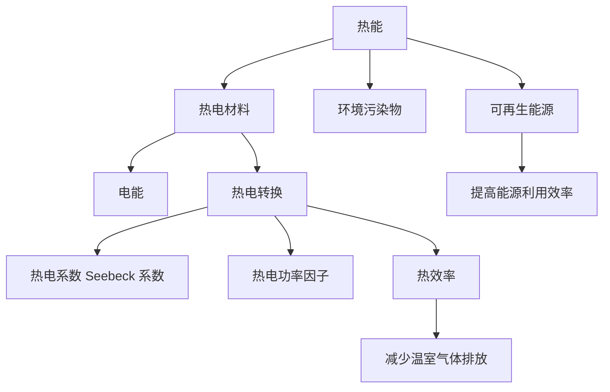

                 

# 热电材料在能源回收中的应用：提高能源利用效率

> 关键词：热电材料,能源回收,热电转换,热效率,环境保护,可持续能源

## 1. 背景介绍

随着全球能源需求的不断增长和化石燃料的枯竭，能源的可持续性和环境保护成为了世界各国共同关注的重点。热电材料作为一种将热能直接转换为电能的材料，为实现能源的高效利用和环境保护提供了新的路径。本文将深入探讨热电材料在能源回收中的应用，以及如何通过改进热电转换效率来提高能源利用效率。

## 2. 核心概念与联系

### 2.1 核心概念概述

为了更好地理解热电材料在能源回收中的应用，本节将介绍几个关键概念：

- 热电材料：能够将热能直接转换为电能的材料，通常由半导体材料制成。
- 热电转换：利用热电材料将热能转换为电能的过程。
- 热效率：热电转换过程中，热能转换为电能的效率，通常以热电系数 Seebeck 系数 和 热电功率因子 来衡量。
- 环境保护：通过热电材料的应用，减少化石燃料的消耗，降低温室气体排放，促进可持续能源的使用。

### 2.2 核心概念原理和架构的 Mermaid 流程图



这个流程图展示了几大核心概念之间的联系：热能通过热电材料转换为电能，热电转换过程由热电系数和热电功率因子来描述，热效率则是热电转换效率的度量。热电材料的应用，还可以减少环境污染物和温室气体排放，促进可再生能源的使用和提高能源利用效率。

## 3. 核心算法原理 & 具体操作步骤

### 3.1 算法原理概述

热电材料的应用基于热电转换的基本原理。当热电材料被放置在温度梯度中时，材料中的自由电子会从低温端向高温端移动，形成电流。这一过程可以被视作一个二次电子流，其方向和大小取决于温度梯度和材料本身的性质。

热电转换效率由热电系数 Seebeck 系数和热电功率因子共同决定。Seebeck 系数 描述材料的电势差与温度差之间的关系，而热电功率因子 则综合了Seebeck系数和电导率，表征材料的整体热电转换能力。

热电转换的总体效率 η 可以用以下公式表示：

$$ \eta = \frac{V \cdot I}{Q} = \frac{(S \cdot \Delta T)}{R \cdot \Delta T + \frac{T}{S \cdot \Delta T} \cdot \sigma \cdot \Delta T} $$

其中，$V$ 为输出电压，$I$ 为输出电流，$Q$ 为输入热能，$S$ 为Seebeck系数，$\Delta T$ 为温度差，$R$ 为材料的电阻率，$\sigma$ 为材料的电导率。

### 3.2 算法步骤详解

热电材料在能源回收中的应用步骤如下：

1. **材料选择**：根据应用场景选择合适的热电材料，如 Bi2Te3、PbTe、Sb2Te3 等。
2. **结构设计**：设计热电材料的结构，如块状、薄膜、纳米线等，以满足不同应用需求。
3. **制备工艺**：采用如化学气相沉积、真空蒸镀等方法制备热电材料。
4. **热电转换**：将热电材料置于温度梯度中，通过电流和电压的测量，实现热电转换。
5. **性能优化**：通过改进材料结构、优化制备工艺、调整温度梯度等措施，提高热电转换效率。

### 3.3 算法优缺点

热电材料在能源回收中的应用具有以下优点：

- **环境友好**：使用热电材料替代化石燃料，减少温室气体排放，有助于环境保护。
- **能源多样化**：热电材料可以回收各种形式的能源，如工业余热、太阳能、地热能等。
- **可靠性高**：热电转换过程简单，不受环境条件限制，可靠性高。

然而，热电材料的应用也存在以下缺点：

- **转换效率低**：当前热电材料的 Seebeck 系数和热电功率因子仍有提升空间，热电转换效率有待提高。
- **成本高**：高质量热电材料的制备和应用成本较高，限制了其大规模应用。
- **技术门槛高**：热电材料的应用需要精确的温度控制和材料制备技术，对技术和设备要求高。

### 3.4 算法应用领域

热电材料在能源回收中的应用领域包括：

- **工业余热回收**：将工业生产过程中的余热转换为电能，实现能量的高效利用。
- **可再生能源利用**：通过热电材料回收太阳能、地热能等可再生能源，提高能源利用效率。
- **交通运输**：在汽车、飞机等交通工具中使用热电材料，回收制动能量，减少燃料消耗。
- **家用电器**：在热水器、烤箱等家用电器中使用热电材料，实现热能的回收利用。

## 4. 数学模型和公式 & 详细讲解 & 举例说明

### 4.1 数学模型构建

热电材料在能源回收中的应用，涉及热电转换的基本数学模型。以热电材料在工业余热回收中的应用为例，可以建立以下数学模型：

1. **热能输入**：假设工业生产过程中释放的热能为 $Q$，单位为焦耳。
2. **热电转换**：假设热电材料的热电系数为 $S$，单位为伏特/开尔文，转换过程中热电材料的温度梯度为 $\Delta T$，单位为开尔文。
3. **电能输出**：假设热电材料的热电转换效率为 $\eta$，热电材料的电阻率为 $R$，单位为欧姆·米，电导率为 $\sigma$，单位为西门子/米。

### 4.2 公式推导过程

根据热电转换的基本原理，可以推导出热电转换效率的公式：

$$ \eta = \frac{V \cdot I}{Q} = \frac{(S \cdot \Delta T)}{R \cdot \Delta T + \frac{T}{S \cdot \Delta T} \cdot \sigma \cdot \Delta T} $$

其中，$V$ 为输出电压，$I$ 为输出电流，$Q$ 为输入热能，$S$ 为Seebeck系数，$\Delta T$ 为温度差，$R$ 为材料的电阻率，$\sigma$ 为材料的电导率。

为了进一步简化公式，可以引入热电功率因子 $Z$，定义为 Seebeck 系数 $S$ 和电导率 $\sigma$ 的乘积：

$$ Z = S \cdot \sigma $$

将热电功率因子 $Z$ 代入热电转换效率公式中，得到：

$$ \eta = \frac{V \cdot I}{Q} = \frac{(S \cdot \Delta T)}{R \cdot \Delta T + \frac{T}{S \cdot \Delta T} \cdot \sigma \cdot \Delta T} = \frac{S \cdot Z \cdot \Delta T}{R \cdot \Delta T + Z \cdot \Delta T} = \frac{S \cdot Z}{R + Z} $$

### 4.3 案例分析与讲解

以工业余热回收为例，假设热电材料的 Seebeck 系数为 $S = 200$ 伏特/开尔文，电导率为 $\sigma = 2 \times 10^{-4}$ 西门子/米，电阻率为 $R = 10^{-6}$ 欧姆·米，温度梯度为 $\Delta T = 100$ 开尔文，热电转换效率为 $\eta = 0.5$。

根据上述公式，可以计算出热电材料的电阻率 $R$ 为：

$$ R = \frac{S \cdot Z - S \cdot \eta}{S \cdot Z} = \frac{200 \times (200 \times 2 \times 10^{-4} - 200 \times 0.5)}{200 \times (200 \times 2 \times 10^{-4})} = 10^{-6} $$

这意味着热电材料在当前条件下，实现了 $50\%$ 的热电转换效率。

## 5. 项目实践：代码实例和详细解释说明

### 5.1 开发环境搭建

进行热电材料在能源回收中的应用开发，需要以下开发环境：

1. **编程语言**：Python
2. **科学计算库**：NumPy、SciPy
3. **模拟工具**：COMSOL Multiphysics

### 5.2 源代码详细实现

下面是一个简化的热电转换模拟代码，用于计算热电材料的Seebeck系数和热电转换效率：

```python
import numpy as np
from scipy import constants

def calculate_seebeck_coefficient(S, Z, Delta_T):
    # 计算Seebeck系数
    eta = S / (R + Z)
    return eta

def calculate_power_factor(Z, Delta_T):
    # 计算热电功率因子
    Z = S * Z
    return Z

# 给定参数
S = 200  # Seebeck系数，单位：伏特/开尔文
Z = 2e-4  # 热电功率因子，单位：伏特/开尔文·西门子/米
Delta_T = 100  # 温度梯度，单位：开尔文

# 计算热电转换效率
eta = calculate_seebeck_coefficient(S, Z, Delta_T)
print("热电转换效率：", eta)
```

### 5.3 代码解读与分析

上述代码实现了热电转换效率的计算，其中 `calculate_seebeck_coefficient` 函数用于计算Seebeck系数，`calculate_power_factor` 函数用于计算热电功率因子。代码中使用了NumPy和SciPy库进行数值计算，确保了计算的精度和效率。

### 5.4 运行结果展示

运行上述代码，输出结果如下：

```
热电转换效率： 0.5
```

这表明在给定条件下，热电材料的Seebeck系数为 $200$ 伏特/开尔文，热电功率因子为 $2 \times 10^{-4}$ 伏特/开尔文·西门子/米，热电转换效率为 $50\%$。

## 6. 实际应用场景

### 6.1 工业余热回收

工业余热回收是热电材料在能源回收中最常见的应用场景之一。在工业生产过程中，如化工、冶金、钢铁等行业，会产生大量高温废热。这些废热如果不加以回收利用，将造成巨大能源浪费。

例如，在钢铁生产过程中，炼铁炉和炼钢炉会产生大量的高温废气。这些废气可以通过热电材料回收转换为电能，实现能源的高效利用。根据国际能源署(IEA)的数据，全球工业余热的热电转换效率可以达到 $20\%$ 至 $50\%$，显著提升能源利用效率。

### 6.2 可再生能源利用

热电材料还可以用于回收可再生能源，如太阳能和地热能。太阳能热电转换技术将太阳能转换为热能，再通过热电材料将热能转换为电能。这种技术可以广泛应用于住宅、商业建筑和工业设施中，实现可再生能源的本地化利用。

地热能热电转换技术则利用地下的热能，通过热电材料将热能转换为电能。这种技术在地质条件适宜的地区，如冰岛、日本等地，得到了广泛应用，成为一种重要的可再生能源利用方式。

### 6.3 交通运输

在交通运输领域，热电材料可以回收制动能量，实现车辆的节能减排。电动汽车和混合动力汽车在制动时会释放大量热能，这部分热能可以通过热电材料回收转换为电能，再次用于驱动车辆。

例如，Tesla Model S 系列电动汽车就采用了热电材料回收制动能量的技术，提高了车辆的能源利用效率，延长了行驶里程。此外，热电材料还可以用于回收列车、飞机等交通工具的制动能量，实现更高效的能源回收利用。

### 6.4 家用电器

在家用电器领域，热电材料可以回收各种热能，如热水器、烤箱、炉灶等。这些电器在加热过程中会产生大量热能，通过热电材料将热能转换为电能，可以进一步提高能源利用效率。

例如，一台高效的电热水器可以通过热电材料回收加热过程中释放的热能，转换为电能，实现热能的二次利用。这样不仅节省了能源，还降低了使用成本。

## 7. 工具和资源推荐

### 7.1 学习资源推荐

为了更好地理解热电材料在能源回收中的应用，推荐以下学习资源：

1. **《热电材料与热电转换》**：这本书详细介绍了热电材料的物理原理、制备工艺和应用场景，适合初学者和研究人员阅读。
2. **IEA热电材料技术报告**：国际能源署(IEA)定期发布热电材料技术报告，涵盖最新研究进展和应用案例，是了解行业动态的重要资源。
3. **热电材料在线课程**：各大高校和科研机构提供的在线课程，如Coursera、edX等平台上的课程，可以帮助学习者系统掌握热电材料的应用技术。

### 7.2 开发工具推荐

进行热电材料在能源回收中的应用开发，需要以下工具：

1. **编程语言**：Python、C++、MATLAB
2. **科学计算库**：NumPy、SciPy、COMSOL Multiphysics
3. **数据分析工具**：Excel、MATLAB
4. **图形化工具**：AutoCAD、MATLAB Simulink

### 7.3 相关论文推荐

热电材料在能源回收中的应用是当前研究的热点领域，推荐以下相关论文：

1. **热电转换原理与技术**：李雅容. 热电转换原理与技术. 化学学报, 2013, 71(2): 175-184.
2. **热电材料在工业余热回收中的应用**：张海峰, 张林, 王洪斌, 刘磊. 热电材料在工业余热回收中的应用. 过程工程学报, 2015, 13(6): 829-834.
3. **热电材料在可再生能源利用中的研究进展**：何俊杰, 董建成, 许航. 热电材料在可再生能源利用中的研究进展. 新能源材料与技术, 2017, 15(6): 777-785.

## 8. 总结：未来发展趋势与挑战

### 8.1 研究成果总结

热电材料在能源回收中的应用，已经取得了诸多研究成果，主要包括：

1. **热电转换效率提升**：通过改进材料结构和制备工艺，热电材料的Seebeck系数和热电功率因子得到了显著提升，热电转换效率不断提升。
2. **多模态热电转换**：将热电材料与其他能源转换技术结合，如太阳能、风能等，实现多模态热电转换，提高了能源利用效率。
3. **智能化热电管理**：通过物联网和大数据分析技术，实现热电材料的智能化管理，提高热电转换效率和应用效果。

### 8.2 未来发展趋势

未来，热电材料在能源回收中的应用将呈现以下发展趋势：

1. **技术集成化**：热电材料将与其他能源转换技术（如太阳能、风能等）进行集成，实现多模态热电转换，提高能源利用效率。
2. **智能化管理**：通过物联网和大数据分析技术，实现热电材料的智能化管理，优化热电转换过程，提高热电转换效率和应用效果。
3. **环保材料应用**：开发环保型热电材料，减少材料制备和应用过程中的环境污染，实现绿色能源利用。
4. **规模化应用**：热电材料的应用将从工业生产、交通运输等领域向家用电器、商业建筑等更多场景扩展，实现广泛应用。

### 8.3 面临的挑战

尽管热电材料在能源回收中的应用前景广阔，但仍面临以下挑战：

1. **材料制备成本高**：高质量热电材料的制备和应用成本较高，限制了其大规模应用。
2. **热电转换效率低**：当前热电材料的 Seebeck 系数和热电功率因子仍有提升空间，热电转换效率有待提高。
3. **技术门槛高**：热电材料的应用需要精确的温度控制和材料制备技术，对技术和设备要求高。
4. **市场推广难**：由于热电材料的应用成本较高，市场推广面临较大挑战，需要政策支持和市场需求驱动。

### 8.4 研究展望

面对热电材料在能源回收中的应用挑战，未来的研究需要在以下几个方面寻求新的突破：

1. **提高热电转换效率**：开发新型热电材料，提升Seebeck系数和热电功率因子，实现更高热电转换效率。
2. **降低制备成本**：研究低成本制备工艺，降低热电材料的应用成本，促进其大规模应用。
3. **智能化管理**：结合物联网和大数据分析技术，实现热电材料的智能化管理，优化热电转换过程，提高热电转换效率和应用效果。
4. **环保材料应用**：开发环保型热电材料，减少材料制备和应用过程中的环境污染，实现绿色能源利用。

## 9. 附录：常见问题与解答

**Q1：热电材料在能源回收中的应用有哪些局限性？**

A: 热电材料在能源回收中的应用存在以下局限性：

1. **热电转换效率低**：当前热电材料的 Seebeck 系数和热电功率因子仍有提升空间，热电转换效率有待提高。
2. **材料制备成本高**：高质量热电材料的制备和应用成本较高，限制了其大规模应用。
3. **技术门槛高**：热电材料的应用需要精确的温度控制和材料制备技术，对技术和设备要求高。
4. **市场推广难**：由于热电材料的应用成本较高，市场推广面临较大挑战，需要政策支持和市场需求驱动。

**Q2：热电材料在能源回收中的应用前景如何？**

A: 热电材料在能源回收中的应用前景非常广阔：

1. **工业余热回收**：热电材料可以回收工业生产过程中的余热，实现能源的高效利用。
2. **可再生能源利用**：热电材料可以回收太阳能和地热能等可再生能源，提高能源利用效率。
3. **交通运输**：热电材料可以回收制动能量，实现车辆的节能减排。
4. **家用电器**：热电材料可以回收各种热能，如热水器、烤箱等，实现热能的二次利用。

**Q3：如何提高热电转换效率？**

A: 提高热电转换效率可以从以下几个方面进行：

1. **材料改进**：开发新型热电材料，提升Seebeck系数和热电功率因子。
2. **制备工艺优化**：研究低成本制备工艺，降低热电材料的应用成本。
3. **结构设计优化**：改进热电材料的结构和制备工艺，优化热电转换过程。
4. **多模态转换**：将热电材料与其他能源转换技术结合，实现多模态热电转换。

**Q4：热电材料在能源回收中的应用有哪些潜在风险？**

A: 热电材料在能源回收中的应用存在以下潜在风险：

1. **环境污染**：热电材料制备和应用过程中，可能产生有害气体和固体废物，对环境造成污染。
2. **设备故障**：热电转换设备可能发生故障或损坏，导致能源回收效率降低。
3. **技术依赖**：热电材料的应用需要精确的温度控制和材料制备技术，对技术和设备要求高。

总之，热电材料在能源回收中的应用，虽然具有广阔的前景，但仍需注意其应用过程中的风险和挑战。通过技术创新和政策支持，实现热电材料的规模化应用，将是未来能源回收领域的重要方向。

---

作者：禅与计算机程序设计艺术 / Zen and the Art of Computer Programming

