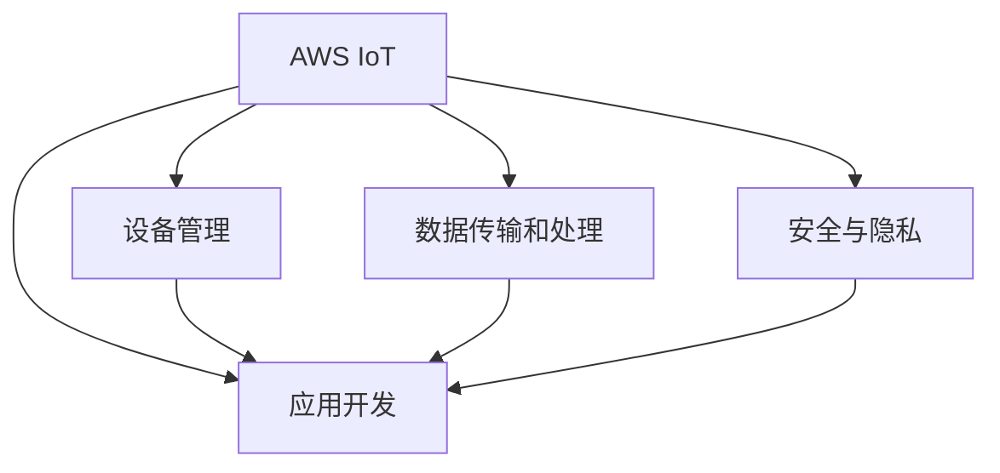

                 

# 物联网平台：AWS IoT 和 Azure IoT Hub

## 1. 背景介绍

### 1.1 问题由来
随着物联网(IoT)技术的迅猛发展，越来越多的设备连接到互联网，产生了海量数据。然而，这些数据往往分散在各个孤岛，缺乏统一的组织和管理。如何高效地整合、分析和利用这些数据，成为了企业和开发者面临的挑战。

### 1.2 问题核心关键点
针对上述挑战，AWS IoT 和 Azure IoT Hub 成为了市场上广受认可的解决方案。这两个平台利用云计算和分布式数据处理技术，为物联网设备和应用提供了强大的支持。

AWS IoT 由 Amazon Web Services 提供，提供了基于云端设备管理和数据处理的全面解决方案。而 Azure IoT Hub 则由 Microsoft Azure 提供，专注于构建高效、可扩展的物联网解决方案。两者均具备强大的数据处理能力，支持设备管理和远程监控，并提供了丰富的API和工具，便于开发者快速开发和部署应用。

### 1.3 问题研究意义
AWS IoT 和 Azure IoT Hub 的成功部署，不仅能够提升物联网设备的管理效率，还能推动数据驱动的业务决策，提高企业的竞争力。其技术架构设计合理，能够满足不同规模和需求的企业，具有广泛的应用前景。

## 2. 核心概念与联系

### 2.1 核心概念概述

为了更好地理解 AWS IoT 和 Azure IoT Hub 的工作原理和架构，本节将介绍几个核心概念：

- **AWS IoT**：由 Amazon Web Services 提供的物联网平台，支持设备管理、数据传输、分析等全栈功能，广泛应用于智能家居、工业自动化、智慧城市等领域。
- **Azure IoT Hub**：Microsoft Azure 提供的物联网平台，专注于构建高可用性、高性能的设备连接和管理解决方案，支持大规模的物联网设备。
- **设备管理**：通过集中管理设备，实现设备配置、监控和更新等操作。
- **数据传输和处理**：利用云端服务实现数据的高效传输和处理，支持多种协议和数据格式。
- **安全与隐私**：确保设备和数据的安全性，防止未经授权的访问和数据泄露。
- **应用开发**：提供丰富的API和SDK，方便开发者快速构建物联网应用。

这些核心概念之间的逻辑关系可以通过以下 Mermaid 流程图来展示：



这个流程图展示了 AWS IoT 和 Azure IoT Hub 的核心组件及其相互作用：

1. 通过设备管理功能，集中管理设备的配置、状态和数据。
2. 数据传输和处理功能，利用云端服务实现数据的高效传输和实时处理。
3. 安全与隐私功能，确保设备和数据的安全性和隐私保护。
4. 应用开发功能，提供丰富的API和SDK，方便开发者快速构建物联网应用。

## 3. 核心算法原理 & 具体操作步骤
### 3.1 算法原理概述

AWS IoT 和 Azure IoT Hub 的原理基于分布式系统和云计算技术，通过集中管理和数据处理，提供强大的物联网平台支持。

其主要算法和操作包括以下几个方面：

- **设备注册和管理**：通过云端服务实现设备的注册、认证和配置。
- **数据传输和存储**：利用消息队列、数据流处理等技术，实现数据的实时传输和存储。
- **数据处理和分析**：使用分布式数据处理框架（如 Apache Kafka、Amazon Kinesis），对数据进行高效处理和分析。
- **安全与隐私**：通过加密、认证和访问控制等措施，保护设备和数据的安全性。

### 3.2 算法步骤详解

以下是 AWS IoT 和 Azure IoT Hub 的详细操作步骤：

**Step 1: 创建平台账户**
- 在 AWS 或 Azure 门户上创建物联网平台账户，获取必要的API密钥和访问权限。

**Step 2: 设备注册和管理**
- 在平台中注册和管理设备，设置设备的名称、标识符、认证方式等参数。
- 通过平台提供的设备管理接口，实现设备的远程监控、配置和更新。

**Step 3: 数据传输和处理**
- 配置数据传输通道，将设备产生的数据传输到云端。
- 使用数据流处理框架，对数据进行实时处理和存储。

**Step 4: 数据处理和分析**
- 利用分布式数据处理技术，对数据进行高效处理和分析。
- 使用机器学习模型，对数据进行深度分析和挖掘，提取有价值的信息。

**Step 5: 安全与隐私**
- 实现数据加密和传输安全，防止数据泄露和篡改。
- 配置访问控制策略，确保只有授权用户能够访问设备和数据。

**Step 6: 应用开发**
- 使用提供的API和SDK，快速开发和部署物联网应用。
- 集成第三方工具和系统，提升应用的功能和性能。

### 3.3 算法优缺点

AWS IoT 和 Azure IoT Hub 具有以下优点：

1. **易用性**：通过集中管理和数据处理，大大简化了物联网设备的部署和管理。
2. **可扩展性**：支持大规模设备连接，能够处理海量数据。
3. **安全性**：提供了丰富的安全措施，确保设备和数据的安全性。
4. **互操作性**：支持多种数据协议和API接口，与第三方系统兼容性好。

同时，也存在一些缺点：

1. **成本较高**：云服务的使用需要支付一定的费用，特别是对于大规模的数据处理。
2. **延迟问题**：数据传输可能会受到网络延迟的影响，影响实时性。
3. **复杂性**：对于没有云计算背景的企业，可能存在一定的学习曲线。

### 3.4 算法应用领域

AWS IoT 和 Azure IoT Hub 的应用领域非常广泛，包括但不限于：

- **智能家居**：通过设备和云端的协同工作，实现家庭自动化和智能控制。
- **工业自动化**：实现设备监控、故障预测和远程维护，提高生产效率。
- **智慧城市**：实现城市管理和公共服务的智能化，提升城市治理水平。
- **健康医疗**：实现远程监测和管理，提高医疗服务的效率和质量。
- **农业智能化**：实现农业设备和系统的智能化管理，提升农业生产效率。

## 4. 数学模型和公式 & 详细讲解  
### 4.1 数学模型构建

本节将使用数学语言对 AWS IoT 和 Azure IoT Hub 的核心算法进行详细讲解。

以 Azure IoT Hub 为例，其核心算法主要涉及数据传输、流处理和分析。

**数据传输模型**：

- 设备产生的数据通过MQTT、HTTP/REST等协议传输到Azure IoT Hub。
- 数据在Hub中经过缓存、队列处理，最终被转发到应用端。

**流处理模型**：

- 使用Apache Kafka、Azure Stream Analytics等框架，对数据进行实时处理。
- 使用流处理函数，实现数据的过滤、转换和聚合操作。

**分析模型**：

- 使用机器学习框架（如Azure Machine Learning），对数据进行深度分析和挖掘。
- 使用统计分析和可视化工具，对分析结果进行展示和解读。

### 4.2 公式推导过程

以下以数据传输为例，介绍AWS IoT 和 Azure IoT Hub 的数据传输模型。

设设备产生的数据量为 $D$，数据传输速率 $R$，数据处理延迟 $T$，应用端数据消费速率 $C$。

在数据传输过程中，设数据在Hub缓存区经过时间 $t$ 后到达应用端。则数据传输模型可以表示为：

$$
D = R \times t
$$

应用端在 $t$ 时间内消费数据量为 $C \times t$。则实际有效数据量为：

$$
E = D - C \times t
$$

数据传输效率和延迟可以表示为：

$$
\eta = \frac{E}{D}
$$

$$
\tau = \frac{t}{D}
$$

### 4.3 案例分析与讲解

以智能家居为例，分析AWS IoT 和 Azure IoT Hub 的应用场景。

假设家庭中的智能灯泡通过物联网平台连接到云端，用户可以通过手机App控制灯泡的开关和亮度。

**设备注册和管理**：
- 用户通过平台注册智能灯泡设备，设置设备名称和认证方式。
- 通过远程控制功能，实现灯泡的开关和亮度调节。

**数据传输和处理**：
- 智能灯泡产生的传感器数据（如环境光强、温度等）通过MQTT协议传输到云端。
- 数据在Hub中经过缓存和处理后，发送到手机App，供用户查看和分析。

**数据处理和分析**：
- 用户可以通过App查看灯泡的数据记录和实时状态。
- 平台使用机器学习模型，分析环境变化对灯泡亮度的影响，提出优化建议。

## 5. 项目实践：代码实例和详细解释说明
### 5.1 开发环境搭建

在进行项目实践前，我们需要准备好开发环境。以下是使用Python进行AWS IoT 和 Azure IoT Hub 开发的环境配置流程：

1. 安装Python：从官网下载并安装Python，推荐使用3.x版本。

2. 安装AWS SDK：使用pip安装AWS SDK for Python，可以访问[官方文档](https://boto3.amazonaws.com/v1/documentation/api/latest/index.html)获取更多信息。

3. 安装Azure SDK：使用pip安装Azure SDK for Python，可以访问[官方文档](https://docs.microsoft.com/en-us/azure/iot-hub/iot-hub-python-sdk-install)获取更多信息。

4. 安装第三方库：使用pip安装必要的第三方库，如paho-mqtt、numpy、pandas等。

完成上述步骤后，即可在本地开发环境中进行实践。

### 5.2 源代码详细实现

以下是使用AWS SDK和Azure SDK进行智能家居设备管理的Python代码示例：

**AWS IoT示例代码**：

```python
import boto3
from botocore.exceptions import NoCredentialsError

# 创建AWS IoT Client
client = boto3.client('iot', region_name='us-east-1')

# 创建设备
try:
    response = client.create thing(name='MyDevice')
    print(response)
except NoCredentialsError:
    print('No credentials found')

# 更新设备属性
try:
    response = client.update thing(name='MyDevice', attributes={})
    print(response)
except NoCredentialsError:
    print('No credentials found')

# 获取设备属性
try:
    response = client.get thing(name='MyDevice')
    print(response)
except NoCredentialsError:
    print('No credentials found')
```

**Azure IoT Hub示例代码**：

```python
from azure.iothub import IoTHubClient, IoTHubClientConfig
from azure.iothub.exceptions import IoTHubError

# 创建Azure IoT Hub Client
client = IoTHubClient.from_connection_string(connection_string)

# 发送消息
client.send_message("MyDevice", "Hello World")

# 接收消息
try:
    message = client.receive_message()
    print(message)
except IoTHubError as e:
    print(e)
```

### 5.3 代码解读与分析

让我们再详细解读一下关键代码的实现细节：

**AWS IoT代码**：
- 使用AWS SDK for Python创建IoT Client，连接AWS IoT平台。
- 使用create thing方法创建设备，设置设备名称。
- 使用update thing方法更新设备属性。
- 使用get thing方法获取设备属性。

**Azure IoT Hub代码**：
- 使用Azure SDK for Python创建IoTHubClient，连接Azure IoT Hub。
- 使用send_message方法向设备发送消息。
- 使用receive_message方法接收设备发送的消息。

## 6. 实际应用场景
### 6.1 智能家居系统

基于AWS IoT 和 Azure IoT Hub 的智能家居系统，可以实现家庭自动化和智能控制。用户可以通过手机App远程控制家中的智能设备，如智能灯泡、智能插座、智能门锁等。

在技术实现上，智能设备通过MQTT协议连接到AWS IoT 或 Azure IoT Hub，数据在云端进行集中处理和管理。用户可以通过App查看设备状态，并发送控制指令。同时，平台可以提供数据分析和报告功能，帮助用户更好地管理家庭环境。

### 6.2 工业自动化

在工业自动化领域，AWS IoT 和 Azure IoT Hub 可以用于设备监控、故障预测和远程维护。通过将生产线上的设备连接到云平台，实时采集设备数据，并进行分析和预测，及时发现和解决问题，提高生产效率。

在具体应用中，可以使用传感器和监测设备采集生产线上的各项参数，如温度、湿度、压力等。数据通过MQTT协议传输到AWS IoT 或 Azure IoT Hub，进行处理和分析。平台可以生成生产报告和故障预警，帮助企业优化生产流程和设备维护。

### 6.3 智慧城市

智慧城市是一个复杂的系统，涉及到交通管理、公共服务、环境监测等多个方面。AWS IoT 和 Azure IoT Hub 可以用于构建智慧城市的基础设施，实现城市管理的智能化。

在智慧城市中，传感器和监测设备采集到的城市数据（如交通流量、空气质量、水质等）通过MQTT协议传输到AWS IoT 或 Azure IoT Hub，进行处理和分析。平台可以提供实时监控和数据可视化功能，帮助城市管理者做出决策。同时，平台还可以集成第三方系统，如智能交通系统、公共服务平台等，提升城市管理的整体水平。

## 7. 工具和资源推荐
### 7.1 学习资源推荐

为了帮助开发者系统掌握AWS IoT 和 Azure IoT Hub 的理论基础和实践技巧，这里推荐一些优质的学习资源：

1. AWS IoT官方文档：提供了全面的API文档和示例代码，帮助开发者快速上手。

2. Azure IoT Hub官方文档：提供了详细的API和SDK文档，支持Python、C#等多种编程语言。

3. 《AWS IoT实战指南》书籍：由AWS官方出版的书籍，系统介绍了AWS IoT的架构和应用场景，适合初学者和进阶开发者。

4. 《Azure IoT Hub设计与开发》视频课程：由Microsoft官方提供的视频教程，讲解了Azure IoT Hub的核心概念和开发技巧。

5. IoT Stack Hub：一个集成了AWS IoT、Azure IoT Hub、AWS Lambda等多个云服务的在线开发平台，提供了丰富的教程和示例。

通过对这些资源的学习实践，相信你一定能够快速掌握AWS IoT 和 Azure IoT Hub 的精髓，并用于解决实际的物联网问题。

### 7.2 开发工具推荐

高效的开发离不开优秀的工具支持。以下是几款用于AWS IoT 和 Azure IoT Hub 开发的常用工具：

1. AWS IoT Studio：AWS提供的云端开发工具，支持可视化设计、测试和部署。

2. Azure IoT Hub Explorer：Microsoft Azure提供的在线工具，支持可视化查看设备状态和消息流。

3. Paho MQTT：Python的MQTT客户端库，支持MQTT协议下的设备连接和数据传输。

4. PyMongo：Python的MongoDB客户端库，支持数据的存储和查询操作。

5. Azure Stream Analytics：Azure提供的流处理平台，支持实时数据处理和分析。

6. Apache Kafka：开源的流处理框架，支持分布式数据处理和消息传输。

合理利用这些工具，可以显著提升AWS IoT 和 Azure IoT Hub 的开发效率，加快创新迭代的步伐。

### 7.3 相关论文推荐

AWS IoT 和 Azure IoT Hub 的发展源于学界的持续研究。以下是几篇奠基性的相关论文，推荐阅读：

1. "IoT Hub for Embedded Devices"（Azure IoT Hub论文）：提出Azure IoT Hub的设计思想和架构，介绍了平台的核心功能和特性。

2. "AWS IoT: Device Connectivity in the Cloud"（AWS IoT论文）：介绍AWS IoT的核心概念和架构，讲解了平台的数据处理和流处理技术。

3. "IoT for Smart Homes: Challenges and Opportunities"（智能家居论文）：分析了智能家居领域的挑战和机遇，提出了基于AWS IoT 和 Azure IoT Hub 的解决方案。

4. "Machine Learning in IoT: Opportunities and Challenges"（物联网机器学习论文）：讨论了物联网领域中机器学习的应用和挑战，提供了基于AWS IoT 和 Azure IoT Hub 的机器学习实践。

这些论文代表了大规模物联网平台的研究方向，通过学习这些前沿成果，可以帮助研究者把握学科前进方向，激发更多的创新灵感。

## 8. 总结：未来发展趋势与挑战

### 8.1 总结

本文对AWS IoT 和 Azure IoT Hub 的原理和实践进行了全面系统的介绍。首先阐述了AWS IoT 和 Azure IoT Hub 的研究背景和意义，明确了平台在物联网设备管理、数据处理和应用开发等方面的核心价值。其次，从原理到实践，详细讲解了AWS IoT 和 Azure IoT Hub 的数学模型和操作步骤，提供了完整的代码实现。同时，本文还广泛探讨了AWS IoT 和 Azure IoT Hub 在智能家居、工业自动化、智慧城市等多个领域的应用前景，展示了平台的强大应用能力。此外，本文精选了AWS IoT 和 Azure IoT Hub 的学习资源和开发工具，力求为开发者提供全方位的技术指引。

通过本文的系统梳理，可以看到，AWS IoT 和 Azure IoT Hub 正在成为物联网平台的重要范式，为物联网设备的管理和应用提供了高效、可扩展的解决方案。未来，伴随技术不断进步和应用场景的拓展，相信AWS IoT 和 Azure IoT Hub 必将在物联网领域发挥更大的作用。

### 8.2 未来发展趋势

展望未来，AWS IoT 和 Azure IoT Hub 将呈现以下几个发展趋势：

1. **边缘计算的融合**：将边缘计算技术与AWS IoT 和 Azure IoT Hub 结合，实现数据在边缘和云端的协同处理，提升实时性和处理效率。

2. **AI和ML的集成**：引入机器学习、深度学习等AI技术，提升数据处理和分析的智能化水平，提高决策的准确性和效率。

3. **跨平台和跨云集成**：支持多云、多平台之间的数据互通和协同工作，推动云平台的统一化。

4. **隐私和安全**：加强数据隐私保护和访问控制，提升平台的安全性和可靠性，保障用户的利益。

5. **边缘设备的支持**：支持低功耗的物联网边缘设备，降低设备成本和部署难度，拓展物联网的应用场景。

以上趋势凸显了AWS IoT 和 Azure IoT Hub 的广阔前景，这些方向的探索发展，必将进一步提升平台的性能和应用范围，为物联网领域带来新的突破。

### 8.3 面临的挑战

尽管AWS IoT 和 Azure IoT Hub 已经取得了显著成就，但在迈向更加智能化、普适化应用的过程中，它仍面临着诸多挑战：

1. **数据一致性问题**：在多源数据整合和处理时，如何保证数据的一致性和完整性，是一个难题。

2. **设备互操作性**：不同厂商的设备可能采用不同的协议和标准，如何在平台中实现设备互操作，是一个挑战。

3. **网络延迟和带宽问题**：在大规模数据传输和处理时，网络延迟和带宽限制可能会影响实时性。

4. **隐私和安全风险**：大规模数据处理可能带来隐私泄露和安全风险，如何在保障安全的同时，保护用户隐私，是一个重要问题。

5. **成本问题**：云服务的长期使用可能会带来较高的成本，如何在提升性能的同时，降低成本，是一个亟待解决的问题。

6. **技能要求高**：平台的复杂性较高，需要具备云计算和物联网专业知识，对用户的技能要求较高。

正视AWS IoT 和 Azure IoT Hub 面临的这些挑战，积极应对并寻求突破，将是大规模物联网平台走向成熟的必由之路。相信随着学界和产业界的共同努力，这些挑战终将一一被克服，AWS IoT 和 Azure IoT Hub 必将在物联网领域发挥更大的作用。

### 8.4 研究展望

面向未来，AWS IoT 和 Azure IoT Hub 需要在以下几个方面寻求新的突破：

1. **数据融合与治理**：引入数据治理技术和工具，提升数据的融合和处理效率，保证数据的一致性和可靠性。

2. **跨平台和跨云解决方案**：探索跨平台和跨云的数据集成和协同工作机制，实现物联网设备的广泛互操作。

3. **智能化决策**：引入AI和ML技术，提升平台的数据分析和决策能力，提供更加精准和智能的服务。

4. **隐私保护与合规**：研究隐私保护和合规性技术，确保平台符合法规和标准，保护用户隐私。

5. **边缘计算与智能设备**：探索边缘计算和智能设备的结合，提升平台的数据处理能力和实时性。

6. **多云融合与互操作**：研究多云环境下的数据互通和协同工作机制，推动云平台的统一化和互操作。

这些研究方向将进一步推动AWS IoT 和 Azure IoT Hub 的发展，为物联网平台的未来发展提供新的动力和方向。

## 9. 附录：常见问题与解答

**Q1: AWS IoT 和 Azure IoT Hub 哪个更好？**

A: 两者均具有强大的物联网平台支持，选择取决于具体需求和环境。AWS IoT 在生态系统和开发工具方面更成熟，而Azure IoT Hub 在数据处理和分析方面更强大。开发者应根据项目需求和资源条件，选择适合的平台。

**Q2: 如何降低AWS IoT 和 Azure IoT Hub 的成本？**

A: 优化设备和数据传输的资源使用，合理配置和调度资源。使用混合云解决方案，将部分计算任务转移到本地或第三方云平台。利用数据压缩和缓存技术，减少数据传输量。同时，关注AWS Free Tier和Azure Free Tier，充分利用免费资源。

**Q3: 如何提高AWS IoT 和 Azure IoT Hub 的数据处理效率？**

A: 采用分布式数据处理技术，如Apache Kafka、Amazon Kinesis，提升数据处理的实时性和吞吐量。优化设备连接和数据传输，减少网络延迟和带宽占用。引入AI和ML技术，提升数据分析和处理能力。

**Q4: 如何在AWS IoT 和 Azure IoT Hub 中实现设备互操作？**

A: 使用统一的协议和标准，如MQTT、CoAP等。采用API网关和中间件，实现不同厂商设备的数据互操作。引入数据转换和格式解析技术，提升数据的兼容性。

**Q5: 如何在AWS IoT 和 Azure IoT Hub 中实现边缘计算？**

A: 引入边缘计算设备和解决方案，如AWS Greengrass、Azure IoT Edge。在设备端进行数据预处理和初步分析，减少数据传输量。利用本地计算资源，提升数据处理效率。同时，引入边缘计算API和工具，实现边缘和云端的协同工作。

总之，AWS IoT 和 Azure IoT Hub 在物联网领域具有广阔的应用前景，通过不断优化和创新，必将在未来的物联网发展中发挥更大的作用。

